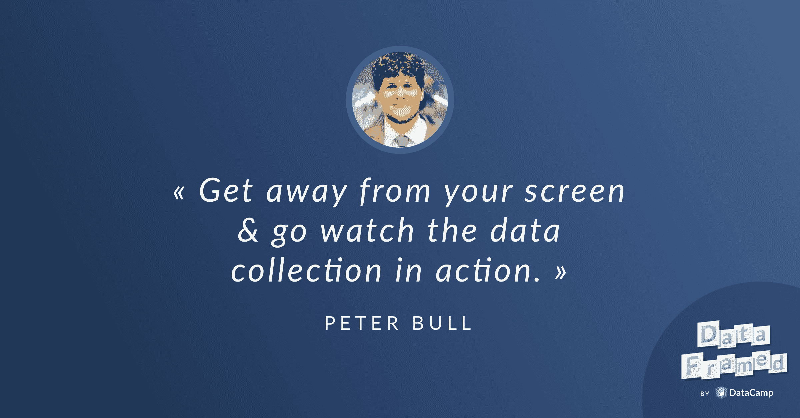

# Peter Bull 讨论了以人为中心的设计在数据科学中的重要性。

> 原文：<https://web.archive.org/web/20221129045010/https://www.datacamp.com/blog/peter-bull-discusses-the-importance-of-human-centered-design-in-data-science>

[https://web.archive.org/web/20220524180706if_/https://w.soundcloud.com/player/?url=https%3A//api.soundcloud.com/tracks/523751268%3Fsecret_token%3Ds-KlZLB&color=%23ff5500&auto_play=false&hide_related=false&show_comments=true&show_user=true&show_reposts=false&show_teaser=true](https://web.archive.org/web/20220524180706if_/https://w.soundcloud.com/player/?url=https%3A//api.soundcloud.com/tracks/523751268%3Fsecret_token%3Ds-KlZLB&color=%23ff5500&auto_play=false&hide_related=false&show_comments=true&show_user=true&show_reposts=false&show_teaser=true)

DataCamp 播客 DataFramed 的主持人 Hugo Bowne-Anderson 最近采访了社会公益的数据科学家兼 Driven Data 的联合创始人 Peter Bull。

下面是播客[链接](https://web.archive.org/web/20220524180706/https://www.datacamp.com/community/podcast/human-centered-design-data-science)。

## [介绍彼得·布尔](https://web.archive.org/web/20220524180706/https://www.datacamp.com/community/podcast/human-centered-design-data-science)

雨果:你好，彼得，欢迎来到数据框。

彼得:谢谢你，雨果。我很高兴来到这里。

雨果:我很高兴有你在这里。我真的很高兴能够谈论以人为中心的设计和数据科学，设计在数据科学中的作用，以及数据科学可以告诉我们以人为中心的设计。在我们开始之前，我想了解一下你。你在数据社区以什么闻名？

Peter:主要是因为我在驱动数据方面的工作而出名。驱动数据(Driven Data)是一个组织，它举办具有社会影响的机器学习竞赛。我们与非营利组织、非政府组织、政府团体合作，帮助他们找出一种机器学习可以帮助他们更有效的方法。然后我们把它放到网上，这样我们的全球数据科学家社区就可以提出这个特殊问题的最佳解决方案。比赛结束后，我们将帮助组织继续利用这一优势。

Peter:这可能是我们过去五年一直在做的驱动数据工作之一。除此之外，我还经常谈论数据科学的两个特殊领域，并且对此非常感兴趣。第一个是数据科学的工程最佳实践。我是 cookie cutter 数据科学项目的维护者之一，这是一个项目模板，我希望我们能有时间谈论它，因为它是我最喜欢的项目之一，我认为它对我们自己的工作有很大的影响，我希望它对其他人也有影响。

Peter:另一个是思考数据科学可能产生的社会影响，以及它与正在发生的更广泛的数据伦理对话的关系。我们刚刚发布了一个名为“Deon”的软件包，D-E-O-N，用于构建道德检查表，您可以将其作为数据科学项目的一部分。如果有机会，我也很想谈谈这两个问题，因为它们是我非常关心的事情。

雨果:我很乐意投入到所有这些事情中去。概括地说，我们有关于社会影响、工程最佳实践的机器学习竞赛，我认为这非常重要，特别是因为有一种观点认为，在数据科学中...一般来说，最佳实践的想法处于一种可悲的状态，许多人正在努力纠正这种状态，将工程最佳原则引入其中将是必不可少的。当然，最近你工作的数据伦理方面...Mike Loukides、Hilary Mason 和 DJ Patil 已经开始为 O'Reilly 撰写他们的数据伦理系列，他们实际上已经发布了一个关于清单与誓言和行为准则的帖子。我认为所有这些都是非常热门的话题。

### 具有社会影响的机器学习竞赛

Hugo:让我们花一点时间来看一下这些。关于你的具有社会影响的机器学习竞赛，你能给我们举几个例子吗？

彼得:好的，当然。我先从我最喜欢的一个开始，那是我们举办的第一次比赛。有一个名为教育资源战略的非营利组织。他们真正想做的是帮助学区更有效地花钱。学校把钱花在学生交通、教师工资和教科书上。他们的运营成本范围很广。现在，一个学区很难说，“我是否比邻近的学区支付更多的教科书费用，却得到同样的结果？我的投资有效吗？”进行这种基准或比较的最大障碍是学校预算的格式大相径庭。没有报告预算支出类别的标准，所以我可以说，“我们在教科书上的花费比邻近的学校多，我们需要看看这个。”

Peter:教育资源策略从他们工作的地区收集所有的预算信息。最终，他们的输出是一个建议，在他们经历了将该学区与其他学区进行对比的过程后，如何考虑该学区的预算。最大的问题是，他们每年要花费数百个工时来查看 Excel 电子表格，阅读预算项目，并试图为其分配一组标准的类别。

Peter:我相信你的观众会从描述中了解到，他们有很多在运营过程中产生的标签数据。标签数据是一个预算行项目，它的描述，预算项目的成本，然后它属于哪一类，是交通，课本，课外活动，行政工资。所有这些，都是他们在与学区合作的历史中获得的。

Peter:所以我们的第一个竞赛是我们如何帮助这个真正关心输出报告而不是分类过程的组织？我们如何帮助他们实现自动化？所以我们举办了一场比赛，人们构建算法来解析这些预算中的自然语言，查看这些预算成本，并自动将这些学校预算的类别分配给这些行项目。我们获得了那次竞赛的成果，我们把它变成了一个适合这个组织已经有的工作流程的工具。这为他们的分析师节省了大量阅读销售电子表格的时间，这样他们就可以将时间集中在真正能增加价值的地方，即就如何改变预算提出建议。

雨果:太好了。看起来它会减少大量的体力劳动。

彼得:对，真的...上次我们检查时，自动化该流程每年为他们节省了大约 300 个工时。对于一个相对较小的非营利组织来说，这实际上节省了大量的劳动力。事实上，他们的目标是更有效地利用这些节约，让员工真正增加价值，而不是在电子表格上贴标签，无论如何，这只是必须发生的任务。

雨果:对，绝对是。我们应该提到，如果人们发现这种类型的东西非常令人兴奋和有趣，他们可以查看驱动数据的所有比赛，但如果他们发现这个特定的比赛有趣，他们甚至可以参加你建立的和我合作的数据营课程，这是向专家学习:你最终可以建立获胜的解决方案。

彼得:对，没错。该课程不仅会介绍如何解决这样的问题，还会介绍获胜者如何结合一些有趣的技巧来获得最佳解决方案。

雨果:我不会破坏笑点的。我也不希望你这样，但我要说的是，赢得竞争的不是 LSTM 或任何疯狂的深度学习架构。

## 数据科学的工程最佳实践

Hugo:现在我们已经讨论了在 Driven Data 上进行的机器学习竞赛的类型。也许你能告诉我们一些关于数据科学工程最佳实践的想法，特别是你维护的 cookie cutter 数据科学项目？

彼得:太好了。是的，所以我的背景是软件工程。当我从事数据科学项目时，我思考的一件事是软件和数据科学如何结合在一起。我认为这两个过程之间有一些重要的区别，因为数据科学往往更加开放，更倾向于研究和开发工作。事实上，我们在数据科学领域所做的很多事情，本质上都是构建软件。即使该软件存在于 Jupyter 笔记本或 Rmarkdown 文件中，它仍然是一个软件。软件工程中的许多最佳实践可以用来改进这些产品。

Peter:cookie cutter 数据科学项目是我们认为标准化我们的流程以使我们自己更有效的第一步。那就是对数据科学项目有一个一致的布局。如果你在 Django(一个 Python web 框架)中，或者在 Ruby on Rails 中，或者在 Node.js 中查看一个 web 应用程序，所有这些都是不同的编程语言，但是任何时候你在其中一个框架中构建一个 web 应用程序，你都有或多或少相同的结构。这意味着，任何 web 开发人员都可以进入这样的项目，并对在哪里可以找到特定类型的代码有所期待。与数据库对话的代码通常位于一个地方。与前端对话的代码通常位于另一个地方。这些期望使得在项目中一起工作和协作变得非常容易。

Peter:千篇一律的数据科学项目理念是将这种标准化引入到我们自己的数据科学工作中。我们有一个定义好的文件夹结构来存放数据。我们有一组文件夹，用于存放原始数据、经过一些处理但处于临时状态的数据，以及经过处理的数据。我们有一个特殊的文件夹结构，用于存放我们的 Jupyter 笔记本或 Rmarkdown 文件，这些文件是以有文化的编程风格构建的。我们有另一组数据处理管道的文件夹结构，它们可能以脚本的形式存在，然后最终可能在类似 Python 包的东西中被重构。

彼得:因为这种一致性，我们很容易从一个项目转移到另一个项目，拿起一些东西并记住我们在哪里，如何复制一些东西，因为我们在许多不同的项目上与许多不同的客户合作，这意味着团队中的任何人都可以进入任何项目，而不必花费大量时间来弄清楚在哪里发生了什么。

### 构建数据伦理和伦理清单包

雨果:太好了。我发现所有的细节都非常有趣，但正如你所说，我认为对数据科学项目和最佳实践系统进行总体、整体一致的布局非常重要。我认为这实际上在你构建数据伦理和伦理清单的方法中扮演了一个角色，有一些你可以跨项目携带的东西。如果存在偏见或挑战，它们是系统性的，因为它们不会被从事项目工作的人所诱发。它们将作为一个整体存在于这个结构中，所以你会意识到这一点。

彼得:对，所以我认为这两者是相关的，因为我们确实花了很多时间为数据科学家开发工具。很多时候，它们最初是我们自己使用的工具，然后我们开源这些工具，以便从事数据科学工作的其他人可以使用它们。这就是千篇一律的数据科学项目是如何开始的，这也是 DEON 的道德检查表是如何开始的。

Peter:我们的想法是，有很多关于数据伦理的对话，从真正看到流程中哪里出了问题的角度来看，我们发现这些对话非常有说服力，并且感觉就像我们自己一样，我们很容易受到这些可能出错的事情的影响。很难有完美的预见，也很难准确理解在任何给定的情况下会出什么问题。因为我们不断看到这些例子，并感觉到，“我们在自己的工作中一定会发现这一点吗？”我们希望有一种更可行的方式来参与数据道德对话，以确保我们不会落入工作中存在的一些陷阱。如果你专注于方法，如果你在思考数据，你可以进入这些真正的技术层面，而没有机会停下来看看伦理的含义。

Peter:我们希望有一种真正由流程驱动的方式来参与我们自己项目的对话。我们构建的这个包所做的是，它生成一个真正围绕数据科学流程构建的数据道德清单。它从数据收集阶段开始。有一组清单项目会询问您一些问题，例如，您的数据收集的参与者是否对所收集的数据给予了知情同意？这是清单上的一个例子。

Peter:我们所做的是，在数据科学流程的不同部分选取这些清单项目，并将它们映射到出现问题的真实世界示例中。我们收集了一些新闻文章和学术论文，解释了数据科学项目何时触及伦理含义以及已经出现的问题。

彼得:实际上，有一篇非常棒的文章是关于亚马逊真的在尝试建立一个简历过滤算法。他们得到的任何职位的简历数量都令人难以置信。他们相信，他们可以使用所有的历史数据来训练一种算法，以确定申请给定职位的最佳候选人。现在，从数据科学的角度来看，这种框架似乎很有意义。我们已经有了一长串的训练数据，我们希望能够用算法复制这些数据。

彼得:他们实际上只是关闭了在这个项目上工作了多年的团队，因为他们发现这个算法对女性有偏见。特别是，它没有说，“哦，这个人是女的吗，他们已经在他们的申请上注明了，现在我想用这个，不考虑他们的申请，”而是使用了比这更含蓄的东西。特别是，如果申请人上过女子大学，他们的分数就会下降。他们发现了算法中的这些问题，并彻底解散了这个项目的团队，因为他们无法克服这个过程中的障碍。他们仍然让人审查所有收到的简历。

Peter:这只是一个典型的例子，从理论上看，这似乎是机器学习问题的一个很好的设置，但如果你不考虑它如何影响你的输出，而不仅仅是一些准确性的衡量标准，它可能会非常非常错误。

### 德翁

雨果:这些是 DEON 会让你检查的东西吗？

彼得:完全正确。是啊。它经历了从数据收集到数据清理到探索性数据分析再到实际构建模型的数据科学流程，这就是它的用武之地。实际上，它有一个关于部署模型的部分。部署模型时，您应该问哪些问题？实际上，我们的目标并不是在一份清单中列出所有关于什么是对的，什么是错的答案。考虑到人们工作的不同领域，这确实是一项不可能完成的任务。

彼得:我们的目标是让那些已经是尽职尽责的演员的人做正确的事情，并确保他们就物品可能被滥用的方式进行对话。实际上，我们看到该工具的工作流程是，使用该工具生成一份清单，然后向您的项目提交一份 PR，上面写着:“嘿，这是我们的道德清单，让我们确保作为一个团队来讨论这些项目。”这实际上是激励团队讨论，以确保您已经考虑了项目的特殊含义，并做出了正确的决定。

雨果:我们会在展示笔记中加入“曲奇饼干项目”和“DEON 套餐”的链接。我认为你从考虑各种利益相关者的角度来讨论数据伦理，这与我们关于数据科学中以人为本的设计及其重要性的对话非常吻合。作为以人为中心的设计的前奏，我想问你一个关于共情在整个数据科学中的作用的小问题。我想知道移情在数据科学中对你有什么作用？

彼得:这是一个很好的问题。实际上，我觉得同理心是一个开始在数据科学对话中出现的术语，是数据科学家的核心技能。在我看来，移情只是一种获得特定方法的方式。这种方法是以问题为中心，而不是以方法为中心。我的意思是，我们应该从真正从事专业服务的数据科学家做起。我们为企业的不同部分或组织的不同部分提供服务。我们应该从我们正在解决的问题开始，并了解该问题的背景，而不是说，“嘿，谁有一个我可以用 LSTM 解决的 NLP 问题？”或者，“谁有计算机视觉问题，我可以尝试最新的神经网络方法，并得到一个非常酷的结果。”

Peter:如果你先从方法开始，很多时候你最终得到的解决方案在它运行的环境中并不真正有用。当我们谈论数据科学和移情时，我们真正想说的是，你应该移情于你的数据科学成果将如何被使用。你应该理解我们正在解决的问题。当我们谈论移情时，我认为这是一种获得问题优先而不是方法优先的观点的方式。

雨果:你想到什么具体的例子了吗？

彼得:对，所以我认为对我来说，一个很好的例子是我们在一个项目中试图自动识别视频中的物种。也就是动物的种类。有一个研究组织在丛林中安装了这些运动检测摄像机，他们试图记录黑猩猩的视频，但他们也获得了许多其他动物的视频。我们不是坐在那里看所有这些视频，然后说哪个有黑猩猩，哪个没有，而是帮助他们建立一个算法来自动识别出现的动物。实际上，去年我们围绕这个问题举办了一场比赛。如果你好奇，你可以看看 DrivenData.org，看看比赛的结果。

雨果:比赛的名称是什么？

彼得:比赛的名字是“灵长类动物矩阵”因式分解。

雨果:别说了。

彼得:谢谢你的关心。

雨果:太棒了。

Peter:我们非常关心我们的数据科学双关语，这是我最喜欢的一个。

### 天真的蜜蜂

Hugo:当谈到数据科学的双关语时，我们也必须提到天真的蜜蜂。

彼得:对。老实说，雨果，你的口音让我甚至不确定你是在说蜜蜂还是贝叶斯，所以在澳大利亚效果更好。

Hugo:当然是 nave Bees，目前也正在变成一系列的数据营项目。

彼得:对，没错。nave Bees 比赛是为了建立一种算法来识别蜜蜂和大黄蜂。我们正在开展一系列 DataCamp 项目，以帮助人们解决这个问题，让他们首次接触到符合分类框架的计算机视觉任务，并研究更传统的方法，然后转向深度学习、神经网络和卷积神经网络。

## 共情的作用

雨果:在那段双关语插曲之后，回到移情在识别灵长类动物中的作用？

彼得:回到移情的角色。真的，这是关于回到背景和理解你操作的背景。我们和这个生态学家和生物学家团队一起工作。他们花了很多时间在野外设置这些摄像机，捕捉数据，观看视频，然后就他们在视频中看到的内容写论文。比赛结束后，我们制作的输出是一个开源包，让你从命令行运行，预测这是我的新视频，它会输出每个视频的 CSV 文件，以及某一种动物出现在视频中的概率。我们对这个结果非常满意。这对我们会非常有用。

Peter:我们从合作团队那里听到的第一句话是，“我们甚至无法安装这个工具。我无法在我的机器上安装 XGBoost。我在安装 TensorFlow 版本时遇到问题。我在安装 GPU 驱动程序时遇到问题。”作为数据科学家，所有这些东西对我们来说就像是第二天性，有点让我们看不到这个工具实际上要被使用的环境，而且是由不习惯围绕数据科学工具包装的所有这些复杂机器的生态学家使用的，这可能会使使用最新方法变得非常具有挑战性。这只是一个非常具体的例子，说明我们没有提前做正确的事情来真正理解环境并确保我们构建了有用的东西。我们在建造一些我们知道会对我们有用的东西。

Hugo:我必须澄清一点，我确信相当一部分工作的专家数据科学家偶尔也会遇到安装 XGBoost 的问题。

Peter:是的，如果有人想主动改善 XGBoost 的安装体验，这是一个非常有价值的项目，有人可以为开源社区做这个项目。

## 人性化设计

Hugo:让我们进入以人为中心的设计，以及为什么它在数据科学中如此重要。我想可能我们的许多听众不一定认为设计原则会在数据科学过程中发挥巨大作用。也许你能告诉我们以人为中心的设计，以及为什么它在数据科学中如此重要？

彼得:很好，对。以人为中心的设计是构建设计过程的一种方式。它实际上与这个领域的其他术语有关，你可能听说过，比如设计思维、双钻石方法和设计冲刺。这些都是人们可能会谈论的流行术语。它实际上指的是同一套想法，也就是有一个设计过程。

彼得:尤其是以人为中心的设计，是我们通过与一家名为 IDO.Org 的机构合作而最为熟悉的设计。IDO 是领先的以人为中心的设计公司之一。他们帮助设计了第一款苹果鼠标。他们从工业设计的角度，也从数字设计的角度，以及最终从服务设计的角度，都有成为设计师的悠久历史。他们在使用这些设计工具刺激创新方面有着悠久的历史和记录。

彼得:他们成立了一个非盈利机构，IDO.org，与非政府组织合作，也有同样的结果。我们与该组织合作，研究坦桑尼亚的数字金融服务。退一步说，这就是我们工作的背景，是这个以人为中心的设计师团队。以人为中心的设计流程是什么样的，我会先给你一个概述，然后我们可以深入了解这个特定项目的细节，我认为这对数据科学和设计如何协同工作很有启发...总的来说，以人为中心的设计就是从人们想要的开始。有一种观点认为，问题的最佳解决方案是可取的，因为有人想使用它们，它们从技术角度来看是可行的，从商业角度来看也是可行的。最佳解决方案位于文氏图的交叉点。你知道，除非你在谈论维恩图，否则你不会有一个好的数据科学对话。

雨果:我在等维恩图。

彼得:对吗？这个特殊的文氏图是可取的，可行的，可行的。我们想要这三者的交集。

雨果:当然，许多数据科学工作可能会从可行开始，比如最新的尖端技术和最酷最有效的算法等，对吗？

彼得:完全正确。我认为这是我们作为数据科学家的趋势之一，我一直在自己身上看到这一点，我对许多这些新技术感到兴奋，我想找到使用它们的方法。诀窍就是找到真正解决问题的平衡点，在合适的地方使用它。以人为中心的设计过程从用户想要什么的角度出发。它通过设计过程的这三个阶段来实现。

### 灵感

彼得:首先是灵感。灵感是去观察那些将成为你最终产品用户的人。如果你是一名数据科学家，假设你的工作是创建这份报告，每月一次通过电子邮件发送给你的管理团队。你实际上要做的是去和收到邮件的人交谈，你会说，嘿，当你收到这封邮件时，你用它做什么？它包含什么内容？你会说，“好吧，我需要一些我放进幻灯片的顶行数字？”或者是你通过阅读来获取上下文，然后你对你管理的人说，“我们需要改变东西，XY 和 z。”

Peter:你会去和你的数据科学过程的消费者实际交谈，看看它如何适应更大的图景。这个阶段的灵感部分实际上是关于拓展视野，集思广益，并试图从你周围看到的一切中获得灵感。这不是“让我看看数据”，并从我的数据中获得灵感。它是“在我们考虑数据之前，让我们从一切事物中获得灵感”。这是第一阶段。

### 思维能力

彼得:第二个阶段是构思。这意味着试图提出一个问题的特定解决方案，然后快速测试这些方案。这里的核心概念之一是拥有尽可能最低保真度的原型，并获得真实的用户反馈。可能的情况是，你正在研究一个模型来做一些分类，最终它将是这个部署在云中的大型、复杂的机器学习系统。你首先要做的是...假设我们正在研究蜜蜂/大黄蜂的问题。你可能会说，“好吧，这是每个物种概率的电子表格，你会怎么做？”这是我最不忠实的一个。拿最基本的方法，拿最基本的输出说:“这个有用吗？”然后你拿着它，从中学习。

彼得:构思阶段是从低保真度原型中学习的迭代循环，慢慢地围绕它们建立保真度，但它有助于保持你的项目朝着确保输出针对真实问题的方向发展。它实际上会很有用，当你在整个过程中提出新的想法时，你可以看出哪些是好想法，哪些不是。

雨果:它让你保持诚实，对吧，从某种意义上说，你不会最终建造一些无用的东西，或者走上完全错误的道路。

彼得:完全正确。是啊。我是说，我见过太多次了...甚至是我们做的工作，你做了一个没人会看的仪表板。每个人都认为仪表板是他们想要的，但它不是适合这项工作的工具。人们真的很关心回答一个特定的问题，如果他们进入一个页面，竖起大拇指表示是，竖起大拇指表示否，这可能比你创建的仪表板要好。

Hugo:在这个仪表板案例中，不是构建仪表板，也许灵感或构思阶段会涉及到在白板或纸上绘制图形，仪表板会显示并对利益相关者说，“嘿，这真的是你想要的吗？”

彼得:对，完全正确。或者甚至在 PowerPoint 中模仿它，或者使用 Microsoft Paint 制作一个小原型，然后说，“嘿，这个图表是你需要的吗？您将如何在您的流程中使用它？”试着去理解，而不只是说，“嘿，你喜欢这个吗，这是你想看的吗？”更多的是，“那你会怎么用？”那个你实际上如何使用某物的问题会改变人们的答案。

彼得:我认为在许多数据科学工作中，很明显，如果你问，“嘿，你想看看这个吗，嘿，你想看看那个吗，嘿，你想看看别的吗？”人们对所有这些问题的回答都是肯定的。你怎么能不想拥有你能拥有的所有信息呢？真的，你将如何使用它的问题帮助你把它缩小到有价值的东西上，而不是制造这种信息过载。

### 履行

雨果:给我们讲讲第三阶段。我们有灵感，有想法，第三个“我”是...？

彼得:第三个“我”是执行。这里的实现不仅仅是，好吧，你已经完成了，现在去构建它。实施实际上是这一过程的延续，从原型设计到解决方案的实际试验。我们认为原型是小规模的，低保真度的，我们和几个人一起做一些事情来获得一些反馈。我们认为实施是，好吧，我们如何变得更加数据驱动我们现在做的这个决定？实施就是挑选一个试点群体，一组真正使用它的用户，然后说，“好的，这是我们现在正在使用的版本。这是我们拥有的一个更高逼真度的原型。让我们为特定的用户群发布它，让我们做一些真正的测试，看看这个解决方案是否有效，是否能解决我们想要解决的问题。”实施是一个试点阶段，在此阶段，您不仅可以从这些讨论中获得大量有趣的定性证据，还可以开始获得定量证据，了解您所构建的内容是如何改变您所关注的指标的。

## 坦桑尼亚数字金融服务项目

Hugo:你和我讨论了你之前参与的一个非常有趣的项目，我认为这个项目非常精彩地阐明了所有这些步骤。在这个项目中，你看到了坦桑尼亚的数字金融服务。也许你能告诉我们一些关于这个项目的情况，以及以人为中心的设计是如何对你起到关键作用的。

彼得:很好，对。这个项目，我将后退一步，给你们一些这个项目的背景。对很多人来说，你的钱一直都是数字化的。我这么说的意思是，当我开了我的第一个银行账户时，我的父母带我到中学的一家银行，并说，“你将有一个银行账户。你现在必须对自己的财务负责。”我给了银行一些钱，他们在一张纸上写下了我有多少钱。那笔钱不是我手里的现金，而是存在银行的数据库里。那纯粹是数字的。这是我与货币互动的原始体验，是拥有货币的真正数字表示。

彼得:然而在许多地方，银行基础设施并不是很好。建立银行的成本很高，转移实物货币存在安全风险。在许多国家，情况是人们用纯现金进行大部分的货币交易。这意味着当他们想存钱时，他们有现金。当他们想花钱时，那就得有足够的现金来买东西。随着时间的推移，这可能会限制你存钱的能力，限制你贷款购买特定物品的能力。在国际发展领域有一种信念，我们可以帮助人们摆脱贫困的方法之一是为他们提供数字金融服务。人们在成长过程中把钱放在银行的数字体验是一样的，我们如何在不建立所有实体银行基础设施的情况下提供这种体验？

彼得:解决这个问题的方法之一是在你的手机上安装一个与你的手机账户相关联的电子钱包。移动电话是这些跨越式技术中的一种，以前连座机都没有的人现在可以使用移动电话了。移动电话提供商现在开始提供服务，让你可以在手机上省钱。你可以说，“好的，我有一个装有 10 美元的钱包，”这只是与我的手机相关联。

彼得:从一个只用现金工作的世界到一个用数字表示的世界，这是一个过渡。对于那些没有体验过总是用数字表示的人来说，你必须建立对这个系统的信任。你必须确保数字金融服务确实符合这个社区的需求。这是一个大项目的背景和背景，我们如何增加这些数字金融服务的增长，这些服务是为这些环境中的人们提供的，这些人的收入非常不稳定，他们的钱有一定的稳定性，有些人可以获得贷款基础设施，有些人可以获得储蓄基础设施？这就是背景。

彼得:这是一个由盖茨基金会资助的项目，旨在了解我们可以利用什么杠杆来帮助人们参与进来，并让他们获得这些工具。这个数字金融服务系统的一个特别之处是，你需要一种方法将你的数字货币兑换成现金。总会有一些类似于自动取款机的交易。然而，自动提款机相对昂贵，而且你需要很多物理基础设施才能让自动提款机工作。

彼得:在有数字金融服务的地方会发生什么，这也被称为“移动货币”，所以我会互换使用，你有所谓的移动货币代理。这些人通常在某个地方有一个小店，卖家庭用品、小吃和饮料。他们也成为移动货币代理人。这意味着，你可以去跟他们说，“我想用五美元换五美元的现金，”或者，“我想拿五美元的现金放在我的电子钱包里。”它们是实物现金和数字现金之间的接口。

彼得:我们项目的重点是，我们如何让代理商和客户之间的互动有助于在这个移动货币系统中建立信任，这个方向是由这个以人为中心的设计过程驱动的。当我们出去时，我们做的第一件事就是和使用移动货币的人和不使用移动货币的人交谈。我们去了很多市场。我们观察人们买东西，我们问他们，“你为什么用现金买东西？你为什么用移动支付买那个？你有手机货币账户吗？你的体验是怎样的？”

Hugo:听起来在这个过程中，你会得到定性数据和定量数据。

彼得:没错。实际上，你所做的很大一部分工作也是试图收集定性数据。我们一直在通过这些采访收集定性数据，但我们也从一家移动网络运营商那里获得了整整九个月的移动货币交易。所有的交易都有数十亿字节的数据。全国数以亿计的移动货币交易。我们的目标是将关于真实行为的丰富数据来源与我们听说的行为结合起来，与人们实际拥有的定性经验结合起来。

彼得:我认为一个非常好的例子凸显了以人为本的设计的价值，那就是我们一直在和代理商交谈，问他们:“你在移动支付方面最大的困难是什么？你如何看待它与你的业务的大背景相适应，移动支付是你的收入来源之一，但你也销售其他商品。”我们不断从这些移动货币代理商那里听到的是，“嗯，预测我将在移动货币交易中赚多少钱真的很难，因为我从每笔交易中赚取一些佣金，但这些佣金是什么真的不清楚，我很难预测在某个给定的周或某个给定的月的任何累计时间框架内我将从佣金中获得多少钱。”

彼得:这让我们特别感兴趣，因为我们作为数据科学家一直在挖掘这个巨大的数据宝库，心想，“哦，这里面有所有的答案，这将是惊人的。我们可以在我们拥有的大量交易中找到如此多的见解。”做了这些采访后，我们意识到的一件事是，我们不知道代理的佣金是多少。这不是我们现有数据集中的数据。我们有交易的金额，但是代理作为佣金得到的那部分是完全由另一个应用程序中存在的一些业务逻辑单独计算的。

雨果:即使你知道他们得到了多少，你可能也不知道是多了还是少了，也不知道这对他们有什么影响。

彼得:哦，当然。是啊。只是想到我们可以通过查看数据集并找出这些模式来知道什么对代理有价值，数据集甚至没有对我们工作的代理最重要的变量。如果我们不与他们交谈，仅仅试图从数据中学到东西，我们就不会学到这些。

Peter:我们在所有工作中努力做的一件大事，也是我鼓励所有数据科学家去做的一件事，就是出去观察你的数据是如何被收集的。如果你在工厂里处理物联网数据，实际上要去工厂车间，观察事情是如何发生的。如果你像我们一样从事数字金融服务，去观察人们进行交易。查看真实世界中的哪些操作与数据中的某些内容相对应，因为这种视角会改变您对数据本身的看法。它改变了你信任数据的地方和不信任数据的地方。我真的鼓励人们离开他们的屏幕，离开他们的办公桌，去看实际的数据收集。我认为在几乎每一种情况下，你都可以这样做，这将对你如何看待这些数据产生变革性的影响。

Hugo:我认为这真的很重要，特别是在我们生活的这个时代，人们可能会第一次接触到数据科学，有经验，比如在线竞赛，就像你一样...像 DataCamp 这样的平台，获取技术数据或在线数据，并不真正思考数据生成过程。

彼得:对。很容易从数据开始，然后说，“好的，这里有什么？”直到你真正理解了数据生成的过程，你才知道问“这些数据中有什么我不关心的？”或者“这个数据里有什么不靠谱的？”例如，我们看到很多移动货币交易因为网络连接而失败。对于其中一些交易，我们在数据中看不到。如果网络出现故障，交易就永远不会通过，也不会被记录在数据库中。了解连接的局限性以及它如何影响体验，是我们只能开始询问的事情，当我们实际观察它们时，我们如何测量这些交易。

### 坦桑尼亚项目的其他方面

雨果:我们需要在几分钟内结束，彼得。我只是在想，在坦桑尼亚的这个项目，你还有其他方面想讨论的吗？

彼得:对，所以我想分享另一个以人为中心的设计方法发挥作用的例子。我们在看一天中移动货币代理商最忙的时间。人们什么时候开始把现金换成数字货币，或者相反。我们获取了数据，并在一周的几天和一天中的几个时间查看了这些数据，我们构建了这个非常漂亮的热图可视化，你可以把它想象成棋盘，其中每个方格根据你有多少笔交易而变亮或变暗。我们让它变得互动，这样你可以悬停，你可以看到不同地区、不同时间、不同日子的繁忙程度，并真正感受到移动货币的使用模式。

雨果:它对色盲的人类也很友好。

彼得:绝对是。我们确实用 viridis 建造了它，它是色盲友好的。如果你没有为你的可视化考虑这个问题，你应该考虑，因为这是一个以人为中心的设计。

雨果:作为一个色盲，我是红绿色盲，你知道 8%的男性都是这样。

彼得:你比我们其他人更欣赏绿色地图，认为它是一幅美丽的彩色地图。

雨果:我永远也看不够。

彼得:嗯，我认为这是一幅非常引人注目的美丽的彩色地图，这也是我们喜欢这种可视化的原因之一，也是我们的同事喜欢这种可视化的原因之一，以及它的互动性...但是，和我们合作的特工都没有电脑。他们不是坐在笔记本电脑前，而是想看一个上面有这种美丽视觉效果的仪表板。这对他们没什么用。

Peter:我们最终实际构建的是一个基于文本的可视化图形，本质上只是一个条形图，其中显示“M”表示星期一，然后连续显示三个大写的“I”。那么它会有“T”代表星期二，它会有八个大写的“I”排成一行。通过构建这些基于文本的可视化，本质上是用字符构建的条形图，我们实际上可以给这些在功能手机上工作的代理提供数据可视化体验。将我们认为是惊人的数据科学输出的东西，这种真正引人注目的交互式可视化，并将其放入实际可用的上下文中的过程，是那个项目对我们的变革性体验之一，我们开始思考，“好吧，我们所有输出的上下文是什么？”而不是“我们如何做出最惊人的数据可视化？”

雨果:是的，它非常依赖于对实际技术的了解，以及人类在地面上有什么手机。

彼得:对，完全正确。

## 行动呼吁

雨果:彼得，最后一个问题，我想知道你是否对我们所有的听众发出了最后的行动号召？

彼得:对。我认为，在我看来，以人为中心的数据科学家有四个核心活动，我认为我们都应该成为以人为中心的数据科学家。第一个是，去现场观察产生的数据。如果不了解数据集中的一行意味着什么，不实际观察发生了什么，不知道捕获了什么，没有捕获什么，出错时会发生什么，那么您可以获得的输出将非常有限。此外，如果你真的去做了，你就能更好地提出与你的数据相关的问题。如果没有与这些代理交谈，我们就不会问数据集的佣金问题。第一件事是去实地观察产生的数据。

彼得:第二项是通过迭代原型来设计，而不是为了设计。这个不断迭代的过程，与实际使用输出的人交谈，让他们接受你所做的决定，意味着当你完成项目时，它将是有用的。而不是“我工作了三个月，这样对你好吗？”“哦，不，不是”，或者需要一些重大的改变。这就是我们如何保持这一过程更紧密地同步，以便我们实际上是在构建有用的东西。我们通过不断测试的低保真度原型来实现这一点。

彼得:第三是把结果，而不是方法或产出放在第一位。那真的是在说，我们在乎的结果是什么？在我们的案例中，是数字金融服务的采用增加了。这就是我们所关心的，特别是我们认为我们可以通过改进移动货币代理商所拥有的工具来做到这一点。我们的目标是说，“好吧，最好的结果是移动货币代理商进行更多的交易。”这就是我们想要衡量的。这不是，我们如何在这个庞大的数据集上做最有趣的降维。

Peter:第四项是就成功的衡量标准达成共识。我认为这是最困难但也是最重要的一点，你需要预先定义成功意味着什么，你需要获得每个人对成功的认同。我认为这是人们假设如果他们从一开始就在同一个项目上工作，他们会有相同的目标，但是直到你明确讨论成功意味着什么以及那些指标是什么，你才会为完全相同的事情进行优化。

彼得:我想是那些...作为一名数据科学家，我呼吁采取行动，并尝试将其融入您的流程中。除了成为一名以人为中心的数据科学家，考虑你的用户，使用更具协作性的流程，我会鼓励人们来看看 DrivenData.org 上的一场比赛。我们在那里开展了许多有趣的社会影响项目。或者，看看我们在这次讨论中的一个开源项目，那就是 DEON 的 cookie cutter 数据科学，伦理清单包。

Hugo:当然，这两个项目和参与竞赛以及你在驱动数据上做的所有其他伟大的事情，也将帮助任何初露头角的数据科学家或成熟的数据科学家做更多以人为中心的数据工作。

彼得:对，这就是目标。

雨果:彼得，很高兴你能来参加这个节目。

彼得:雨果，谢谢你邀请我。我一如既往地喜欢聊天。