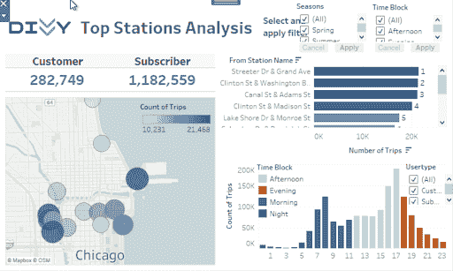
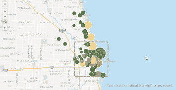
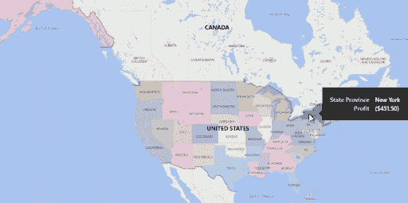

# Power BI vs Tableau:你该选哪个？

> 原文：<https://web.archive.org/web/20221210075939/https://www.datacamp.com/blog/power-bi-vs-tableau-which-one-should-you-choose>

一个好的决策过程会在果断和尽职调查之间找到平衡，因此快速传达信息在商业中非常重要。这是可视化的本质——通常在一个单一的图形中，图表快速地显示和解释了原本成千上万的数字和文字。可以使用 Tableau 和 Power BI 等商业智能工具创建图表。

## 电源 BI 与 Tableau -相似性

### 他们非常受欢迎。

据 Gartner 称，他们是商业智能平台市场的两大领导者。Tableau 于 2003 年推出，并发展成为最受欢迎的 BI 工具之一，而 Power BI 则是由微软在 2011 年推出的，并于 2013 年添加到 Office 365 中。

### 它们可以用来产生各种不同的可视化效果。

这些可以包括条形图和折线图、树形图和地理图。在这两个平台上，您可以与这些可视化进行交互，例如将鼠标悬停在它们上面以获取更多信息和应用过滤器，还可以将它们组合起来创建仪表板。

### 它们可以连接到各种数据源。

其中包括 MS Excel、CSV 和 JSON，这两个平台的付费版本可以让您访问 50 多个额外的数据连接器，如 Google Bigquery、Amazon Redsift 和 Salesforce。如果基础数据发生变化，可视化效果也会更新。

### 两者都是用户友好的，不涉及编码。

如果您是数据分析新手，这使它们成为学习的第一套理想工具。如果您是一名业务分析师，它们是您需要处理数据的两个主要数据可视化工具。如下图所示，它们绝不是您将使用的唯一工具。SQL、R 和 Python 也是很有价值的工具，在您的技能组合中增加一个或多个是非常有价值的。

### 由于最近的更新，这两者变得越来越相似。

例如，Power BI 曾经在数据准备方面表现出色，因为用户总是能够通过 Power Query 建模、清理和向数据集添加计算列。然而，随着 Tableau Prep 的推出，Tableau 最近在这方面取得了自己的进展。

> 在 Power BI 和 Tableau 之间选择时，你应该问的第一个问题是:我需要吗？

如果你想提高技能，增加你对潜在雇主的价值，具备商务智能或桌面的工作知识是很好的。此外，两者都可以在 DataCamp 上获得，一旦你学会了如何使用其中一个，学习如何使用另一个就很简单了。

## 权力 BI 与 Tableau——差异

但是，应该考虑几个不同点，如果您正在考虑在您的业务中使用它们，选择其中一个是有意义的。

### Power BI 仅适用于 Microsoft Windows。

如果你在工作中经常使用 Mac 电脑，Tableau 会更有用。

### Tableau 和 Power BI 提供的认证范围不同。

Tableau 为特定职业提供了更广泛的选择。你可以在 [Tableau 网站](https://web.archive.org/web/20220727051145/https://www.tableau.com/learn/certification)上找到更多关于这些的信息(有些人很快就要退休了，而且有一个新的数据分析师认证即将上线，所以一定要检查这个)，DataCamp 最近也让我们的 [Tableau 导师接受了自己参加考试的挑战](https://web.archive.org/web/20220727051145/https://www.datacamp.com/community/blog/tableau-student-to-certification)！费用从 100 美元到 250 美元不等。

Power BI 有一项考试涵盖了该平台的所有主要功能，费用为 165 美元(尽管在撰写本文时，他们仍以 15 美元的价格向学生、休假人员和其他受到新冠肺炎疫情负面影响的个人提供这项考试)。

### Tableau 的考试(目前)只有英文版。

Power BI 提供多种语言的考试，而 Tableau 目前只提供英语考试，尽管他们表示未来将发布翻译版本。

### 它们集成的难易程度将取决于您使用哪种软件。

由于 Power BI 是由微软开发的，如果您使用办公软件，它将更容易集成到您的工作空间中。同样，Tableau 最近被 Salesforce 收购，由于其原生集成，它们值得考虑。然而，两者都能够连接到 Excel 和 Salesforce，所以这更是一个哪个运行更流畅的问题。

### 有不同的定价级别。

这就是权力 BI 和 Tableau 最大的区别所在。

| 许可证名称 | 成本(每月) | 描述 | 许可证名称 | 成本(按月、按年计费) | 描述 |
| --- | --- | --- | --- | --- | --- |
| 超级商务智能桌面 | 自由的 | 允许您在本地计算机上使用所有基本的 Power BI 功能 | Tableau 公共 | 自由的 | 可用于创建连接到 Excel、CSV 和 JSON 文件的可视化效果。所有可视化都将公开 |
| Power BI Pro | 9.99 美元(如果你有 Office 365 就免费) | 为个人用户提供访问，使他们能够构建自己的仪表板并连接到广泛的数据源。 | 浏览表格 | “Tableau 服务器 35 美元，在线 42 美元” | 允许持有者基于同事提供的数据集构建仪表板和可视化。 |
| Power BI Premium(每用户) | $20 | 类似于 Power BI Pro，但增加了存储容量，允许您更频繁地刷新仪表板，并提供了一些附加功能。 | Tableau 创建者 | $70 | 提供所有资源管理器权限，以及创建数据源连接的能力。**推荐给个人用户。** |

上面的许可证是为创建仪表板的个人数据分析师设计的。如果您的公司有兴趣推出 Tableau 或 Power BI，您还需要考虑查看器许可证:

| 许可证名称 | 成本(每月) | 描述 | 许可证名称 | 成本(按月、按年计费) | 描述 |
| --- | --- | --- | --- | --- | --- |
| Power BI Premium(每容量) | 起价 4995 美元 | 特定于企业的许可证，允许组织中的每个人进行查看访问(编辑仪表板仍需要 PBI 专业版许可证)。 | Tableau 查看器 | 在 Tableau 服务器上，每个观众 12 美元，在线观众 15 美元 | 特定于企业的许可证，允许持有者查看同事创建的仪表板并应用过滤器。还提供定制企业[订阅计划。](https://web.archive.org/web/20220727051145/https://www.tableau.com/about/contact#contact_enterprise-subscriptions) |

### Power BI 和 Tableau 哪个好？

Power BI 和 Tableau 之间有很多重叠，最终两者都是有用的工具。对于一些用户来说，选择学习两者可能是最好的选择，但是，对于那些希望在两者之间做出选择的人来说，必须考虑成本和可访问性的差异。

DataCamp 提供 [Tableau](https://web.archive.org/web/20220727051145/https://www.datacamp.com/courses/introduction-to-tableau) 和 [Power BI](https://web.archive.org/web/20220727051145/https://www.datacamp.com/courses/introduction-to-power-bi) 两种课程。我们的课程使您能够在不涉及任何安装的情况下练习每个工具的界面，并涵盖连接数据和构建仪表板等功能。

### 概括起来

|   | （舞台上由人扮的）静态画面 | 功率 BI |
| --- | --- | --- |
| 市场领导者？ | 981 号房 | 981 号房 |
| 各种不同的可视化？ | 981 号房 | 981 号房 |
| 可以连接各种数据源？ | 981 号房 | 981 号房 |
| 用户友好？ | 981 号房 | 981 号房 |
| 它能在什么类型的机器上工作？ | 苹果电脑和视窗电脑 | 仅限 Windows 电脑 |
| 认证？ | 多重 | 一个 |
| 更易于集成... | 销售力量 | 微软 |
| 费用 | 各不相同，但 Tableau 通常更贵 | 各不相同，但 Tableau 通常更贵 |

想从事数据方面的职业？在 Microsoft Power BI 职业跟踪中发现我们的[数据分析师，您将立即为工作做好准备。](https://web.archive.org/web/20220727051145/https://www.datacamp.com/tracks/data-analyst-in-power-bi)

