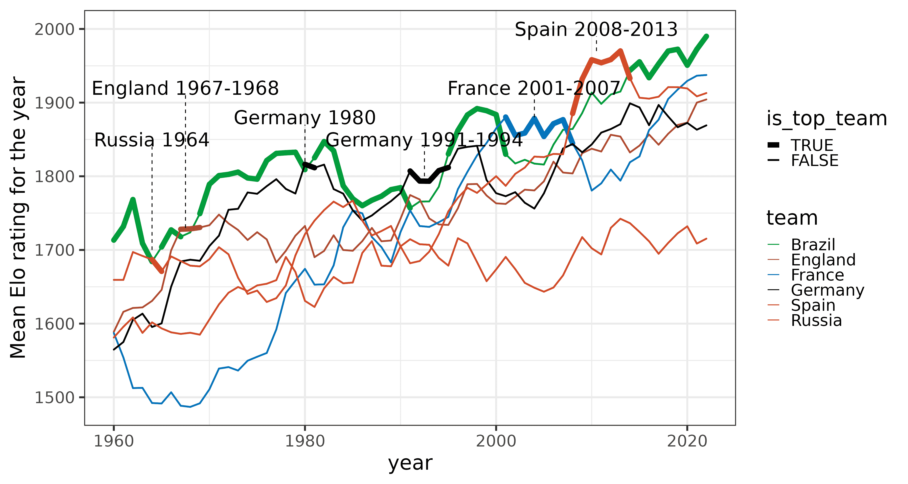

# 预测 2022 年卡塔尔世界杯冠军

> 原文：<https://web.archive.org/web/20221210075939/https://www.datacamp.com/blog/predicting-soccer-world-cup-winners>

## 谁是 goa t？

有史以来最伟大的国家足球队是哪支？是 1970 年有贝利和雅伊尔津霍的巴西，还是 2010 年有安德烈斯·伊涅斯塔、哈维和伊克尔·卡西利亚斯的西班牙？英式足球(或者足球！)球迷们经常激烈地讨论哪个队更好，哪个队最好，但没有数据这只是一种看法。

为了庆祝 2022 年卡塔尔世界杯，让我们定量地看看过去 70 年来不同国家队的实力！

## 简单的模型

我们从所有国际足球比赛开始，包括至少有 200 场比赛的球队的友谊赛。(这不包括一些在一段时间内排名一直不好的球队，如塞舌尔国家队。)为了简单起见，我们将只模拟胜、平、负，忽略点球大战。我们把一场胜利转化为一分，平局转化为每队半分，输了就给零分。

比如 2018 年莫斯科世界杯决赛，法国 4-2 战胜克罗地亚；给法国一分，给克罗地亚零分。正如我们所做的，比如 2014 年世界杯德国在贝洛奥里藏特 7-1 战胜巴西。点球大战，比如 2006 年世界杯决赛中，齐达内在柏林用头撞马尔科·马特拉济，意大利 5-3 战胜法国，被视为平局，双方各得 0.5 分，因为常规比赛的结局未定。

| 日期 | 锦标赛 | 团队 1 | 第二小组 | 结果 | 积分团队 1 | 积分小组 2 |
| 2018-07-15 | 2018 年世界杯 | 法国 | 克罗地亚 | 4:2 | one | one |
| 2014-07-08 | 2014 年世界杯 | 德国 | 巴西 | 7:1 | one | Zero |
| 2006-07-09       | 2006 年世界杯 | 意大利 | 法国 | 1:1 | Zero point five | Zero point five |

我们现在如何衡量一个团队的优势？众所周知，与其他运动相比，足球的力量很难评估，因为由于进球数量少(我们感兴趣的主要信号)，它具有更高的随机性或噪音水平。与俱乐部级别相比，国家队参加的比赛数量较少，这进一步加剧了这一统计挑战。

一个简单的统计数据可能只是过去 20 场比赛的得分。然而，这不会给我们任何关于在过去的 20 场比赛中没有交手的球队的信息。想想看，哥斯达黎加凭借其出色的守门员凯洛尔·纳瓦斯击败了乌拉圭和意大利，战平了英格兰，最终在 2014 年世界杯上领先 D 组，英格兰和意大利被淘汰。我们还可以运行一个逻辑回归，将所有的球队(和对手)作为特征，这将使得包含随时间变化的动态变得具有挑战性。为了说明相对优势和长期动态评级，我们来看一个更复杂的评级方法:Elo 评级。

## elo 评级

Elo ratings 以物理学家阿帕德·艾罗(Arpad Elo)的名字命名，不要与 20 世纪 70 年代的英国摇滚乐队 Elo 混淆，它是为了衡量棋手的实力而发明的，旨在阻止强棋手通过反复与弱棋手比赛来积累分数。Elo 评分也可以转化为概率，Elo 评分相近的玩家获胜的可能性同样大。

但是 Elo 是如何工作的呢？我们在这里跳过公式，因为它相当直观:获胜的玩家从失败者那里获得分数，他们获得的分数取决于排名的差异。当排名较高的玩家击败排名较低的玩家时，他们只能得到几分，但当排名较低的玩家击败排名较高的玩家时，他们可以得到很多分。

我们再来看一个例子，2018 年世界杯期间，半决赛，英格兰 1:2 不敌克罗地亚。英格兰队是最有希望获胜的球队，赛前的 Elo 为 1837 比 1757。这可以解释为英格兰的获胜概率略高于 60%(忽略平局)。然而，在加时赛中，克罗地亚通过马里奥·曼祖基奇的进球获胜，克罗地亚获得了 12 分，而英格兰失去了 12 分(Elo 变化总体上是对称的)。

一个大冷门是 2010 年世界杯小组赛瑞士战胜西班牙。正如我们将在一分钟内看到的那样，后来的世界杯冠军西班牙当时的 Elo 评分最高，预计获胜率为 84%(再次忽略平局)，因此损失了 17 个 Elo 分。

| 日期 | 锦标赛 | 团队 1 | 第二小组 | 结果 | 之前的 Elo 团队 1 | Elo 团队 1 之后 | 之前的 Elo 团队 2 | Elo 第二小组在 |
| 2018-07-11 | 2018 年世界杯 | 克罗地亚 | 英格兰 | 2-1 | One thousand seven hundred and fifty-seven | One thousand seven hundred and sixty-nine | One thousand eight hundred and thirty-seven | One thousand eight hundred and twenty-five |
| 2010-06-16 | 2010 年世界杯 | 西班牙 | 瑞士 | 0-1 | One thousand nine hundred and thirty-seven | One thousand nine hundred and twenty | One thousand six hundred and forty-four | One thousand six hundred and sixty-one |

## 自 1960 年以来世界上最好的球队

现在让我们根据 Elo 评级来看看一段时间内最好的团队。我们用 20 世纪 50 年代来校准评级，从 1960 年开始。正如你在下图中看到的，巴西统治着足球世界，在过去的 63 年中有 42 年是世界第一。除了巴西，只有另外 5 支队伍获得了冠军。在 1964 年的一年里，俄国队围绕着传奇门将列夫·雅辛。1980 年的德国，当时他们赢得了欧锦赛冠军，随后是 1990 年世界杯冠军，队长是洛塔尔·马特乌斯。法国在 2001 年至 2007 年凭借齐达内或蒂埃里·亨利等球员赢得 2020 年欧洲杯后。他们在 2008 年被西班牙接管，西班牙在 2008 年至 2012 年间连续三次夺冠(包括 2010 年世界杯)。迭戈马拉多纳(Diego Maradona)或莱昂内尔梅西(Lionel Messi)的阿根廷从未登上这个排行榜的榜首，约翰·克鲁伊夫的荷兰在 20 世纪 70 年代也是如此。

Elo 的收视率持续上升。这可能部分是由于更好的足球人才识别和更好的培训，但众所周知的事实是，Elo 评级往往会随着时间的推移而膨胀(是的，通货膨胀现在无处不在)。有不同的方法来增加 Elo 以考虑通货膨胀，但这超出了本文的范围。

如果您希望自己重新创建该图，则[打开用于准备数据和绘制图的 DataCamp 工作区](https://web.archive.org/web/20221121141815/https://app.datacamp.com/workspace/new?_tag=workspace&accountType=personal&utm_content=copy_duplicate_link&utm_medium=in_product&utm_source=workspace&visibility=public&workspaceId=3e705713-3e6d-4b4f-8853-dfe4c2a471d0)。

## 2022 年世界杯谁会夺冠？

最后，看看即将到来的卡塔尔世界杯，哪些球队最有可能把奖杯带回家？看看最近的 Elo 评级就能对当前的表现有所了解。

| 组 | 当前 Elo 评级 |
| 巴西 | Two thousand |
| 阿根廷 | One thousand nine hundred and forty-four |
| 西班牙 | One thousand nine hundred and fifteen |
| 法国 | One thousand nine hundred and six |
| 比利时 | One thousand eight hundred and ninety-seven |

自 2013 年以来，巴西再次排名第一，得分为 2000，其次是阿根廷、西班牙、法国和比利时。即使是这个简单的模型——它没有考虑到小组赛对每支球队来说有多容易或多难——也与博彩公司的预测相当接近，他们也认为巴西是最有可能的赢家。

如果巴西在决赛中遇到阿根廷，我们的 Elo 模型预测巴西将有 58%的获胜机会。

## 不断学习

如果你对使用数据进行预测感兴趣，可以试试机器学习科学家职业道路。

*   [Python 中的机器学习科学家](https://web.archive.org/web/20221121141815/https://www.datacamp.com/tracks/machine-learning-scientist-with-python)
*   [R 中的机器学习科学家](https://web.archive.org/web/20221121141815/https://www.datacamp.com/tracks/machine-learning-scientist-with-r)

如果你已经做到了这一点，并且你仍然有兴趣了解更多关于 Elo 评级和足球的信息，你可以看看《国际预测杂志》上的这篇文章，这篇文章还描述了 Elo 评级如何被用作其他模型的功能:[使用 ELO 评级预测足球协会的比赛结果](https://web.archive.org/web/20221121141815/https://www.sciencedirect.com/science/article/abs/pii/S0169207009001708)。