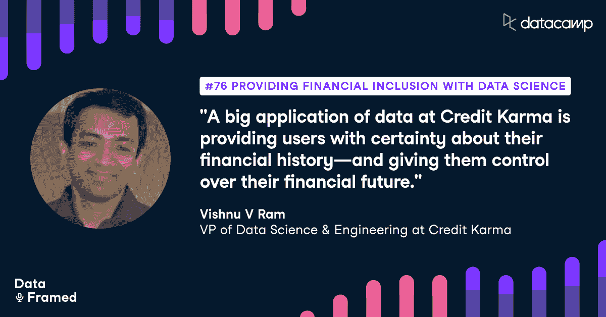

# 利用数据科学实现金融普惠

> 原文：<https://web.archive.org/web/20221129045128/https://www.datacamp.com/blog/providing-financial-inclusion-with-data-science>

[https://web.archive.org/web/20220703051723if_/https://embed.podcasts.apple.com/us/podcast/76-providing-financial-inclusion-with-data-science/id1336150688?i=1000543340303](https://web.archive.org/web/20220703051723if_/https://embed.podcasts.apple.com/us/podcast/76-providing-financial-inclusion-with-data-science/id1336150688?i=1000543340303)

DataCamp 播客 DataFramed 的主持人 Adel Nehme 最近采访了 Credit Karma 的数据科学和工程副总裁 Vishnu V Ram。

## [介绍毗湿奴 V Ram](https://web.archive.org/web/20220703051723/https://www.datacamp.com/community/podcast/providing-financial-inclusion-with-data-science)

Adel Nehme:你好。这是来自 DataCamp 的 Adel Nehme，欢迎来到 DataFramed，这是一个涵盖所有数据及其对世界各地组织的影响的播客。总的来说，数据科学和技术最令人兴奋的一个方面是，它如何减少以前难以在服务中获取信息的障碍，无论是谷歌地图、提供导航、立即在 YouTube 上观看教程的能力，还是通过优步订购出租车。有鉴于此，数据科学在降低信息和服务壁垒方面最具影响力的领域是金融和医疗保健等高风险行业。这就是为什么我很高兴能与 Credit Karma 的数据科学和工程副总裁 Vishnu Ram 交谈。Credit karma 是一家成立于 2007 年的金融科技初创公司，旨在通过允许个人免费查看自己的信用评分来为个人提供金融包容性。

Adel Nehme:从那以后，它一直在生产一套利用数据科学的产品，为用户提供更多关于其财务未来的确定性。在这一集里，毗湿奴讲述了他的背景、Credit Karma 的使命、推动 Credit Karma 的数据科学产品的内部工作原理、他如何带领他的数据团队从 2000 万用户增长到 1.2 亿用户、构建数据文化、数据团队需要具备的技能等等。说到数据团队需要具备的技能，我们也很高兴地宣布推出 DataCamp Professional 的 14 天免费试用。它专为能够访问 DataCamp 所有课程的任何规模的团队而设计。一定要去看看，邀请你的同事。毗湿奴，很高兴你能上节目。

毗湿奴·V·拉姆:非常感谢你邀请我来到 Adel。

Adel Nehme:我很高兴与您讨论您在 Credit Karma 管理数据科学和工程的经验，以及您在领导数据团队和大规模运营数据科学方面开发的最佳实践。但是在我们开始之前，你能给我们一个关于你自己和你如何进入数据空间的简短背景吗？

毗瑟奴·V·拉姆:我进入数据领域的方式是，我听过很多你的播客，我知道很多人也谈论过这个。有点像迂回进入数据科学。在我的大学里，我做了几个关于使用模糊逻辑控制系统动力学的项目。这就是我喜欢进入人工智能的原因。本科毕业后，我有机会在神经网络方面做实际工作，但我最终选择了一条不同的道路。如果我选择了神经网络，我可能会进入数据科学，并更早地进入数据世界，这是我对它的看法。但我的道路最终更像是一名早期创业工程师，从零开始构建东西，然后开始担任一些早期创业公司的 CTO 角色，当你在做你可以理解的早期创业公司时，最终戴上多顶帽子，或者一堆不同的帽子。

Vishnu V Ram:我认为在这些创业公司的开始阶段，更多的是利用数据进行分析，利用数据做出成功或失败的商业决策。然后经过一段时间，开始做更多的事情，因为这些是更多的消费技术创业公司，做更多的用户行为数据管道，理解和做出重大产品决策。后来，我在其中一家初创公司从事电子商务产品推荐工作。最后，在 Credit Karma，我觉得事情又回到了原点，我没有在这家公司早期加入它。但我觉得我已经涉足了所有这些方面的数据，分析、数据科学、构建推荐系统、用户行为理解、机器学习，以上所有方面。

Adel Nehme:太棒了。对于那些没有意识到的人，你能简单介绍一下信用因果报应的背景和它是如何运作的吗？

毗湿奴 V 拉姆:对。我得回到 2007 年，那时我们的创始人创办了这家公司。我想在 2007 年，当我们的创始人创办公司时，主要是为了让大家免费开放 TransUnion 的信用评分。事情就是这样开始的。大约在 2015 年左右，也就是我加入的时候，我将把这一年作为一个重大的里程碑。这在这里是一个里程碑，因为是的，Equifax 以及 TransUnion。然后，如果你看看今天我们在哪里，我们已经在美国、英国和加拿大完成了大约 40 亿份信用评分和信用报告。

Vishnu V Ram:因此，Credit Karma 的旅程是从为我们的成员提供信用评分开始的，然后它开始帮助我们的成员很好地理解他们的信用报告。但与此同时，我们确实为产品添加了一些非常重要的功能，如身份监控。今天，我们的成员将 Credit Karma 作为一个平台来购买他们所有的金融产品，无论是信用卡、个人贷款、汽车保险、汽车贷款还是抵押贷款。在过去几年中，我们还增加了免费的银行产品，如支票和储蓄账户，这使我们的成员能够真正利用他们的信用业力来处理他们个人财务方面需要做的一切事情。

Adel Nehme:太好了。如果我没弄错的话，你们大概有 1.2 亿客户吧？

毗湿奴 V 拉姆:没错。在 2014 年至 2019 年期间，我们增加了约 7000 万用户。看到我们取得的增长，真是令人惊讶。增长的一部分对我来说非常非常惊人。

Adel Nehme:那一定非常令人兴奋，并且为今天的对话奠定了基础。Credit Karma 的使命真正令人兴奋的是使用数据来实现金融信息的民主化，并让每个人都有能力做出健康的金融决策。因此，我想通过真正理解核心数据对于 Credit Karma 成功和运营的重要性，为今天的对话做好准备。你介意给我们一个在 Credit Karma 使用数据科学的不同方法的概述，以及一些你亲自参与的使用案例吗？

毗瑟奴·V·拉姆:所以可能拿一些和我们所有人更相关的东西。比方说，你打开谷歌地图，你试图看到去某个地方。如果你没有打开 GPS 追踪系统，你可能需要输入的第一件事就是你现在在哪里？你的起始地址是哪里？因此，对于我们的许多会员来说，起点实际上是他们今天在所有金融机构眼中的位置，他们去那里获得他们的金融产品，而不仅仅是金融机构，如果你想租一个房子，如果你想从威瑞森或 T-Mobile 或任何其他供应商那里获得新的苹果 iPhone，你需要知道你的位置。我认为这也是我们所有 Credit Karma 成员了解他们的信用历史、信用报告和信用评分的起点。我可以说，我的信用评分这一个数据点是整个公司的起源。

毗瑟奴·V·拉姆:所以我会说，当你把它放在一个人面前时，这是一个非常强大的数据点，当他们有一种强烈的感觉时，就不会再想它了，对吗？比如，嘿，我的信用评分好吗？我有不良信用记录吗？我买得起最新的 iPhone 吗？我能负担得起去升级我的租赁吗？我可以申请新的房屋贷款吗？我能得到多少房屋贷款利率？你不再受这些人的摆布了。你很清楚在那个时候你被允许做什么。对吗？所以我认为这有点像我们所有成员的起点。然后你开始使用数据实现更多自动化，将数据用于更高级的用例，如利用机器学习来更好地理解用户，更好地理解产品，更好地理解用户产品交互，然后你将所有这些放在一起。

毗瑟奴·V·拉姆:所以归结起来就像数据和机器学习在信贷业中的实际应用，所以我们思考事物的方式，事物被分割的方式是我们有一种叫做确定性的东西。当用户申请金融产品时，很多时候他们会将自己置于一个脆弱的位置，可能会被拒绝购买该产品。因此，他们不确定是否会获得批准。因此，我们拥有的最大、最大的用例之一是为我们的成员提供确定性。你的产品获得批准的可能性有多大？一旦你能够向我们的成员提供这种确定性，这就给他们提供了一种完全的解脱。这是一种确定性，你知道你什么时候离开家，你想去你朋友那里，或者你想去一个新的地方。你只要在你的谷歌地图或苹果地图中输入目的地地址，你就会得到信息，这是路线，沿着这条路线走。

毗瑟奴·V·拉姆:你将在 25 分钟内到达那里。通常情况下，不管你在路上是否换车道，不管你在高速公路上是以每小时 70 英里还是 75 英里的速度行驶，你都可以确定你什么时候会到达那里，你会到达那里。这是我们在信贷业内对数据的一个很大的应用。然后确定性是很好的，但我有点想控制我想得到什么样的金融产品。我可能想从 A，B，C 得到金融产品，而不是 X，Y，z。我自己对它的控制是什么？我自己的意图是什么？我想得到一笔 15 年的房屋贷款，还是想在 15 年内付清房屋贷款？

毗瑟奴·V·拉姆:或者我想在 30 年的时间内支付房屋贷款？这些都是我想要控制的事情。作为一个用户，我想了解这一点。我希望能够做得很好。系统拥有的数据是什么，公司必须以某种方式帮助排序或排名，当用户使用信用因果报应时，你要考虑用户想要什么以及他们真正想从信用因果报应中获得什么，这就是排名应用程序的来源。第三件事是，我们都有在不同时间点想要信用卡、个人贷款、汽车贷款或房屋贷款的需求。但是不同的时间点是这里的关键词。当你得到某样东西的时候和当你不想得到其他东西的时候，我们的倾向模型就出现了。

毗瑟奴·V·拉姆:然后当你把所有这些东西放在一起时，你就有机会向我们的成员提供真正强有力的、相关的建议。当我们向我们的成员提供这些相关的建议时，你就能够从用户提供给你的信息和数据中获取所有的东西，并能够帮助他们从 Credit Karma 和与 Credit Karma 合作的所有其他合作伙伴那里获得他们想要的东西。所以我想说，就我们的数据而言，它就像是我们的面包和黄油。但除此之外，我们还利用数据做重要的事情，如在我们的系统中进行异常检测，在我们的业务指标中进行异常检测。然后我们也想知道我们做得有多好？我们会做得多好。像假设问题一样问和答，这是预测等事情发生的地方。但是我要说我的面包和黄油，以及很多关于信用因果报应的面包和黄油，因为数据已经在推荐空间里了。

Adel Nehme:你的构思非常棒，尤其是当你提到为人们提供救济的能力时。我不认为很多人会考虑到心理压力，尤其是弱势群体在与银行或金融机构打交道时的感受。因此，提供财务指南针的能力非常重要。

## 推荐引擎

Adel Nehme:显然，推荐引擎是 Credit Karma 商业模式的核心，而你是构建这一模式的关键人物之一。简而言之，如果我错了，请纠正我，你提供了从人们的信用数据中提炼出来的见解。他们从不同的银行和贷款人那里获得基于他们的信用洞察力的金融产品推荐。如果他们采纳了这一建议，贷方就会支付信贷业力。因此，客户总能获得您所讨论的免费见解和包容性。您介意详细介绍一下推荐引擎的第一次迭代吗？从那以后它是如何发展的？

毗瑟奴·V·拉姆:是的，我认为你说得差不多了，阿德尔，所以我只是在这里添加一些细微的差别。因此，当我在 2014 年及之前加入该公司时，有一些事情已经确定下来，我认为即使是现在，我们也没有真正改变任何事情。我们设定的一件事是一个双赢的商业模式，我们希望确保任何时候 Credit Karma 获得任何激励，当用户从与 Credit Karma 的互动中受益时，它就会获得激励。另一方面，银行或其他金融机构也从会员与信用因果关系的互动中受益。因此，我们为我们的成员、我们自己以及我们的合作伙伴树立了双赢的理念。我们认为这就是生态系统自我维持的方式，也让我们所有人、我们的成员、我们以及我们的合作伙伴走上了成长之路。

毗瑟奴·V·拉姆:但与此同时，随着时间的推移，我们处理这件事的方式已经发生了变化。当我开始的时候，我会说到处都有规则。就用户需求而言，数据收集有限。有很多基于规则的决策。然后我会说第一年左右，工作是将规则集中在一个地方。

毗湿奴 V 拉姆:请记住，该公司做得真的很好。我们的成员得到了很多实实在在的好处。我提到的确定性模型在它最早的化身中就已经存在了。当我加入公司的时候，有很多事情都运转得很好。但我们有机会看到当时服务于 2000 多万会员的一项业务，并能够取得更大的成就。

Vishnu V Ram:所以我想说，在最初的几年里，更多的是将所有的规则集中在一个地方，将模型视为核心，并有一种方法，我们能够取代许多这些分析性的见解，这些见解更多地基于时间点，也可能是特定于某些人群的，然后用可以进化和学习的模型来取代它们。

Vishnu V Ram:然后为了能够支持这一点，我们必须在我们的数据收集基础设施上进行非常重要的投资。此外，我们还下了很大的赌注，转向 Bitquery。在 GCP 发展的非常非常早的时候，GCP 还处于早期阶段，我们在 Bitquery 上下了很大的赌注。我仍然记得有一次我们坐在首席技术官的房间里，我们在想 Bitquery 就像市场上的其他产品一样，我们在想为什么我们要进入 Bitquery。

Vishnu V Ram:我认为当我们进行投资时，Bitquery 对我们来说是一个巨大的胜利。它给我们的数据科学家带来了确定性，实际上，在某种程度上，他们知道当他们周一早上来上班时，他们需要操作的数据集，能够开始训练他们的模型，以及他们需要查看的数据，以了解当前在生产中运行的模型是否工作良好，它就在那里，他们可以访问它，他们不需要担心是否能够访问它。

毗湿奴 V 拉姆:我认为，大约四年后，大约在 2017 年左右，我们的模型开始接管。我们意识到，我们需要对我们的实验系统进行重大改进，这个系统有点过时，而且做出了很多奇怪的决定。所以我们想确保我们能够建立一个强大的实验服务。这是我们在 2016 年投资的一个项目。

Vishnu V Ram:也是在那一年，我们开始组建我们早期的 ML infra 团队，最初在 AWS 中，后来我们把它放到了 Google cloud 中。

Vishnu V Ram:我认为在那个时候，我们也在考虑我们是否想要成为一个全 Scala 商店，因为许多工程或许多系统都基于 Scala，我们在想，“嘿，工程师可能比数据科学家多，而数据科学家编写的代码行更少。也许我们可以让我们的数据科学家学习 Scala。”因为它们中的一些来自 R，一些来自其他的生态系统。所以我们说，“嘿，为什么我们不弄清楚我们是否能让他们做 Scala。”那没有持续多久。

Vishnu V Ram:我想说的是，2018 年我们将更多地转向 Scala 工程，Python 数据科学，并允许我们的数据科学家真正带来他们想要的一切，并成为社区的一部分。整个数据科学社区都基于 Python，因此允许他们也与社区互动，从社区中学习，然后以简单的方式将其带入[听不清 00:18:21]，同时允许我们的工程系统在 Scala 的堆栈上大规模运行。

毗瑟奴·V·拉姆:还有一段时间，我们从 0.1 天开始就一直在跟踪 TensoFlow。我们确实认为这将是我们在未来某个时候可以利用的东西。2018 年，我们说，“好吧，让我们开始向 TensoFlow 前进。”或者在 2018 年左右，谷歌也发表了 TensoFlow 扩展论文。然后当我们看到扩展的论文时，我们知道这些正是我们思考自己的机器学习基础设施的方式。对我们来说，继续做大 TensoFlow，继续做大 GCPS 是很有意义的，特别是考虑到我们在 Bitquery 上的早期成功。

毗湿奴·V·拉姆:今天，我想说我们每天做 350 亿次模型预测。我们收集所有关于用户所见的数据。当用户收到通知时，推荐系统驱动用户看到的一切。它只是参与了与用户的每一次互动。

Vishnu V Ram:回顾并重申这一点，在所有这些演变中，不变的是双赢/多赢/双赢的商业模式。我们的目标函数并没有真正改变。我们的目标职能始终忠实于企业真正希望我们交付的东西。

Adel Nehme:我很乐意打开其中的一些。因此，我们做了一些基础设施层面的改进，数据收集方面的改进，等等。就用于驱动这个推荐引擎的数据而言，显然关键的合作伙伴是像 Equifax 和 TransUnion 这样的信用机构。但是你也使用外部数据来补充你的解决方案吗？如果是，您使用什么类型的数据来补充推荐引擎？

Vishnu V Ram:我认为来自我们局的数据肯定是我们所做的一切的主要驱动力。但与此同时，我们也意识到，虽然为我们的会员提供大量的确定性以及了解他们想要什么对我们来说很重要，但申请金融产品和申请不同金融产品的申请流程非常复杂，需要经过许多步骤和冗长的表格。很多都是重复的。我们意识到，在所有这些应用中，有几个数据点是必需的。请记住，当有人发现申请产品很容易时，如果他们有把握，那么这将为我们的胜利/胜利/胜利提供飞轮。

毗瑟奴·V·拉姆:所以在这个思考过程中，我们确实引入了一些数据来帮助我们的成员。一些数据点实际上是会员自己提供给我们的。只要确保如果你被要求申请某个特定产品的收入，那么两周后你将申请其他产品，你猜怎么着，同样的收入也用于下一个申请流程。就像，让用户轻松地完成整个过程。

Vishnu V Ram:还有其他一些事情可能看起来微不足道，但从数据的角度来看，但从成员易用性的角度来看，它只是让我们变得更好。如今我们都认为这是理所当然的，但是你仍然需要努力去实现它。就像当我输入我的地址时，我的地址是正确的吗，我搞砸了什么吗？如果你只是把它放在 DoorDash 或优步上，如果你错过了它，你就错过了乘车或送餐。但是如果在一个金融产品里面做，就有机会浪费很多时间。你可能正在申请房屋贷款。你可能已经出价，你想得到房屋贷款。你不想弄错，你想把事情做好。

Vishnu V Ram:所以，为了帮助会员在任何时候都做正确的事情，我们在这些领域进行投资，这样我们就可以纠正用户输入的地址，这样他们就不会弄错了。它允许我们为我们的成员提供易用性。

Vishnu V Ram:随着我们的许多供应商也采用云技术，并且也在云中，许多这些数据集成变得更加便宜和容易。因此，就他们的体验而言，做一些事情来帮助我们的成员获得更好的易用性是显而易见的。

## 财务决策

Adel Nehme:太好了。到目前为止，您已经提到了双赢模式，以及您希望如何为此进行优化。现在，我们可以从很多角度来讨论这个问题，但是考虑到增强用户能力对于 Credit Karma 的使命是多么重要，您如何确保您提供的建议和产品符合公司的关键原则，最终为用户提供做出更好、更健康的财务决策的能力？

毗湿奴 V 拉姆:我认为这是一个非常困难的问题。问得好。这是一个非常非常困难的问题，如何能够持续不断地这样做。任何时候，当你需要坚持做一些真正困难的事情时，你必须从你用你的文化做什么开始。

Vishnu V Ram:我认为作为我们文化的一部分，作为一个组织，作为团队，作为组织中的个人，我们有很多合作。根据定义，当我们在数据方面做事情时，我们正在与业务密切合作，以了解业务需求是什么，了解什么样的业务约束更好。我们还与法律和营销部门密切合作，以了解我们需要正确遵守的法规。并确保我们更好地了解我们的用户需求，了解什么工作得好，什么工作得不好。

Vishnu V Ram:在所有这些过程中，还需要对我们的最终用户有正确的同情心，真正了解谁是我们的最终用户，他们从使用产品中得到什么，他们有什么反馈来帮助我们，我们可以利用这些反馈来做得更好。在这里做了很多不同的事情。

毗瑟奴·V·拉姆:但我要说的是，就文化而言，真正对我们有用的是，当你与任何利益相关者交谈时，在整个过程中保持谦逊和好奇。因为特别是当你利用数据为 1 亿人做决定时，你是在非常非常大的范围内工作。

毗瑟奴·V·拉姆:所以在这个过程中保持谦逊和好奇是非常重要的，并且能够进入很多这样的对话，在那里有人可能会问你这样的问题，“嘿，为什么我会看到这个？为什么给我发这个推送通知？你为什么给我发这封邮件？”他们问你这个问题的方式，可能会有点伤害你。你可能会想，“哦，我当然是为 1 亿用户这么做的，你可以期望我在这里或那里得到一些错误的用户。”但是如果你保持谦逊和好奇，你会想从那次谈话中得到一些东西。这只是你如何能够灌输一种文化的一部分，即保持谦逊和好奇，并感同身受地倾听。那很有帮助。

毗瑟奴·V·拉姆:然后为了能够支持它，你真的希望有正确的过程，并且你一直在建立正确的过程。比如将一切都设置为实验，测量一切，确保您的发布和斜坡设计良好，并且您知道您在发布前已经查看了这些指标。

Vishnu V Ram:即使在发布之后，你也在寻找正确的指标来确保。有时我们会说，“嘿，如果收入不变，我们就想推出。”但是如果收入最终是负的，那么你仍然会想，“嘿，好吧，收入是负的，但是还有其他重要的指标。就用户而言，它变得更好了。所以让我们开始吧。”

毗瑟奴·V·拉姆:然后，再一次，你可以谈论所有这些，但是我们周围都在发生变化。尤其是在 COVID 时代，我们已经看到所有这些变化都给了我们巨大的冲击。你必须以一种能很好地保护不利因素的方式来构建系统，这样你才能始终支持团队的创新，才能跟上变化，继续应对变化，从变化中获得更多价值。我想说的是，要处理这样一个难题，你需要强大的投资和文化处理系统，我是这么说的。

Adel Nehme:你如何确保自己能够理解不利的一面？例如，你目前在你的模型上使用任何可解释的技术吗，或者你对用户如何被一个特定的模型影响做任何追溯分析吗？

毗湿奴 V 拉姆:这是个很好的问题。我认为从 2017 年开始，当我们从零开始重建我们的推荐系统时，我们非常清楚我们对一个非常复杂的系统的流程产生了影响。并且该系统具有模型，该系统具有规则，该系统具有可以在推荐系统之外应用的其他商业约束。我们可能会同时进行数百个实验。所以我们知道我们真的需要再次投资数据收集。在这种情况下，我们真正做的是投资于系统内部工作规模的数据收集。

Vishnu V Ram:因此，如果我们看到任何异常或差异，如果有人报告了一个问题，或者如果一些用户看到了他们不应该看到的东西或没有看到他们应该看到的东西，我们就能够进行诊断和故障排除。我们真的希望让我们的分析师和数据科学家能够获得这项投资。

毗瑟奴·V·拉姆:所以，我想说，这是我们能够理解端到端系统如何工作的一个非常非常大的驱动因素，因为，当你建立模型时，你通常会想说，“嘿，我正在建立确定性模型。我的模型提供好的确定性还是坏的确定性？他们在提供确定性方面做得好不好？”但你可以有最高度确定的模型，金融产品，但如果你从来没有向会员展示，他们永远不会申请或永远不会与它互动，你不知道在引擎盖下发生了什么。

Vishnu V Ram:所以我们知道我们有不同的模型集，不同的规则，不同的业务约束，以及新的数据流入。所以当你把所有这些放在一起，这是一个非常复杂的系统。你真的，当你考虑可解释性时，你真的想考虑端到端的系统可解释性，就我们成员的最终结果而言，而不是看零零碎碎的。

毗湿奴 V 拉姆:零碎也是你从中得到的东西，但你必须从成员结果开始，然后向下工作。因此，我们在那里进行的最大投资就是确保我们收集了大量关于系统如何工作的数据。这让我们能够在此基础上继续建设，能够...因为可解释性技术，它们也在不断变化，所以你有机会在你已经拥有的基础上继续构建。

## 如何创建为客户增值的数据解决方案？

Adel Nehme:我认为这是一个很好的话题，来讨论你作为数据领导者和在 Credit Karma 保持数据团队的整体经验。我很想深入探究数据如何推动 Credit Karma 的成功。显然，掌控数据团队的整体方向是 it 的关键组成部分。您如何确保在任何给定的时间，您总是在创建有益于 Credit Karma 客户并增加价值的数据解决方案？

毗瑟奴·V·拉姆:我认为它始于理解你为客户和企业创造的价值。如果你对自己创造的价值有很好的理解，那么你就能做得很好。我看事情的方式是，你需要很多不同的东西来创造价值。你需要真正好的数据，高质量的数据。您需要能够收集所有这些信息并进行扩展，以便及时用于模型培训、分析和模型评分。然后，您需要能够将正确的建模技术应用于解决问题。

毗湿奴 V 拉姆:这些年来，我们经历了各种迭代。我们仍然有各种不同的建模技术可以利用，既有神经网络，也有树和我们使用的其他模型。然后你需要系统和流程。当您拥有数据、正确的数据、正确的建模技术、正确的系统和流程，并且所有这些都结合得非常好时，您就创造了最佳的最终用户价值。如果您考虑了所有这些方面，并且考虑了这些领域中的差距，然后您能够在正确的时间填补正确的差距，那么您就知道您有能力持续创造最终用户价值。

毗瑟奴·V·拉姆:你会犯错，当你犯错的时候你怎么抓住它？你只需要反思哪些做得好，哪些可以改进，因为我们有时会过度投资于数据、系统或模型技术。所有这些事情，我们都搞错了。所以，这个想法，真的，是要确保你把所有这些东西都放在一起。如果你做错了其中一件事，猜猜会发生什么？你可能没有交付用户价值，你有一个真正的机会完全扼杀这种主动性。

毗瑟奴·V·拉姆:所以如果你非常深思熟虑，如果你适当地思考这些，那么你知道，“嘿，如果我的系统是正确的，那么这些模型应该是有效的。这个，我们早就解决了。我们本可以更好地为用户解决这个问题。”因此，它在思考这些领域中的每一个领域，以及它们是如何结合在一起的，你如何对其进行反思，以及如何对其进行改进。这就是你如何始终如一地为我们的客户提供价值。

## 衡量投资回报率

Adel Nehme:所以，当然，这里有很多优先事项可以竞争。随着时间的推移，你如何对不同的任务和项目进行优先排序？当然，在对项目进行优先级排序时，预期 ROI 是很重要的。总体而言，您如何衡量投资回报率，以及如何将其纳入您的优先化框架？

毗瑟奴·V·拉姆:这真的没有什么灵丹妙药。所以我想你肯定想做你提到的事情。我觉得我们学到的另一件事，我觉得我们做得很好，就是...我只需要一个数据科学术语。耐心点。因此，根据哪个项目会给你带来投资回报，哪个项目不会给你带来投资回报，拥有良好的先验知识真的很有价值。同样，其中一些也是时机。因此，不仅要获得正确的投资回报，还要获得正确的投资回报时机。

毗湿奴·V·拉姆:我觉得我们做得很好的一件事是...从历史上看，Credit Karma 在吸引行业资深人士加入公司方面一直做得很好。他们能帮什么忙？他们可以帮助我们找出可靠的前科。然后你就能构建出一组廉价的迭代。因此，当你有可靠的先验，当你的迭代是廉价的，那么投资回报决策过程，你可以承受犯错。一旦你做错了，你会经历一些迭代，这些迭代是廉价的，这让我们能够返回，然后做出不同的决定，走上不同的道路。

Vishnu V Ram:其中一些也来自于我们能够构建和组装平台的能力，这些平台可以帮助降低投资回报率的分母，因此进行这些投资会更便宜。再说一次，这也是你必须有一个良好的组合，建设和购买。如果你有一个构建和购买的良好组合，那么你就有机会减少投资。所以你的投资回报决定不是一成不变的。退回去更便宜。

毗瑟奴·V·拉姆:说了这么多，我确实谈到了一些我们在过去所做的关于系统如何工作的数据收集。它让我们能够问一些有趣的假设问题，比如，“如果我有这些数据会怎么样？如果我们能够推出这个模型或者建造这个模型会怎么样？我们是否能够做得更好，提出更好的建议？”所以这是有科学依据的。它也有很多艺术。

Adel Nehme:现在，鉴于你已经在 Credit Karma 工作了大约七年，我相信你已经看到了公司在这段时间内的巨大爆炸式增长。这意味着还要确保扩展数据和工程团队，以及支持大规模数据分析的基础架构。然而，除此之外，作为一名数据领导者，您如何不仅能够为数据科学家扩展数据科学，还能够扩展组织中每个人大规模做出数据驱动型决策的能力？在实现这一目标的过程中，数据团队的角色是什么？

Vishnu V Ram:当你在 2000 万用户中运营，然后当你增长到 1.2 亿用户时，团队规模自然会随之增长。当团队规模随之增长时，你必须不断地演进过程，不断地思考，“我的组织是如何构建的？该组织是如何构建的，以交付未来将向信贷业要求什么，以及未来将要求信贷业为成员交付什么？”而不是过于关注历史背景。此外，您还需要不断改进基础架构，以便能够支持所有数据。这是一个持续的挑战，每个领域都是如此；我们如何发展过程，我们如何发展组织结构，我们如何发展基础设施。

Vishnu V Ram:例如，当我在 2014 年加入时，我们有一些数据科学家，他们分散在几个团队中。当时没有定义明确的数据科学团队。然后，直到 2017 年，我们都没有机器学习基础设施团队。所以你必须能够选择创建这些新团队的时间。基本上，你要求一些人停止他们在组织不同部门正在做的事情，并强迫他们走到一起，成为一个有凝聚力的单位，然后你为他们创建一个章程。

毗瑟奴·V·拉姆:然后你还必须思考，在这段时间内，商业是如何发展的。我们的业务已经朝着更加垂直化的结构发展。当你走向垂直结构时，这些垂直结构中的每一个都有他们追求的非常重要、强烈的目标。作为一个数据组织，您可以帮助他们每个人实现他们的目标。因此，这又一次归结为，我们的组织如何，我们的系统如何随着业务需求而发展？

毗瑟奴·V·拉姆:然后你必须能够思考，成功的伙伴关系是什么样子的？你必须明白哪些是你需要花更多时间来帮助他们变得更加成功的伙伴关系，哪些是你可以负担得起的，至少在一定时间内保持现状。有时你想看着某样东西说，“嘿，那是个项目，”有时你会看着某样东西说，“那不是个项目。这是一个长期团队，需要经历七八次不同的迭代，才能构建出一个好的系统。”然后，即使在那之后，他们必须能够不断添加更多的细微差别，不断使事情变得更复杂、更有效。

毗瑟奴·V·拉姆:在这整个过程中，我们如何交流，我们如何区分优先次序，一切都在改变。多年来，我们可能已经多次改变了计划和执行机制下的优先级。老实说，有一段时间，我非常非常专注于执行，而不是计划，尤其是当我们在组装系统的初始构件时。这真的需要我们有强大的执行力。但是一旦你有了基本的系统，那么你就会进入更多的节奏。你需要更多地与垂直行业合作，合理规划他们将如何利用系统，从你的投资中获得更多价值。

毗瑟奴·V·拉姆:所以我认为这就像是你将继续发展你的组织结构和流程，这样你就会开始变得真正强大的执行能力，你就会变得真正强大的计划能力。规划流程允许您建立成功的合作关系，通过利用数据帮助多个业务部门取得成功。

## 扩展数据团队

Adel Nehme:现在，回到扩展数据团队，您如何确保发展您的数据科学家技能组合？所以在方向上，你更看重通才数据科学家还是更看重专科？您确保发展数据团队技能的方法是什么？

Vishnu V Ram:我谈到了试图让我们的数据科学家在某个时间点开始做[Scala 00:40:24]的失误。因此，我认为这也可以追溯到我们希望为企业和我们的成员提供什么，以便很好地了解当前的差距，很好地了解我们如何才能很好地利用我们的数据，我们如何才能很好地模拟我们的业务问题。当我们开始时，我们从来没有能够帮助我们的数据科学家利用深度学习之类的东西的系统。一路走来，一旦我们投资了 TensorFlow 和 GCP，我们就能够进入这样一个领域，我们的数据科学家能够将深度学习视为他们工具箱中的另一个工具。

毗瑟奴·V·拉姆:所以我认为许多这些建模技术和能够观察数据，能够探索数据，许多这些技能是...我想说的是，当你面对正确的业务问题时，你可以不断地添加它。有时人们会说，“嘿，我想做[听不清 00:41:24]或我想做 GPT3”或其他什么，但你可能在业务中没有真正的用例来利用这些东西。

Vishnu V Ram:我认为当我们开始的时候，我们肯定需要更多的通才数据科学家，尤其是当我们在构建我们的系统的时候。我们需要我们的数据科学家也和我们的工程师一起进入战壕，以确保我们的系统设计良好。经过一段时间，我们进入了一个更需要我们的数据科学家以更深入的方式理解他们正在解决的问题以及他们可能做出的一些低级决策的影响的世界，这些决策可能会改变您解决问题的方式。然后试着理解这些问题是如何演变的？

Vishnu V Ram:那么在业务方面与 more 的合作，在特定领域与产品理解的合作，我们是如何做事的，我会给你一个例子来更好地理解它。从历史上看，信用卡和个人贷款一直是企业和会员收入和交易的主要驱动力。信用卡交易比房屋贷款交易要多得多。这意味着你有很多数据。然而，当谈到房屋贷款，你有少得多的数据。

Vishnu V Ram:因此，为了能够建立你的技能集，不仅仅是处理大规模的信用卡交易数据，还能够处理较小规模的房屋贷款，房屋购买数据变得非常非常有价值。因此，数据科学家需要能够理解他们将使用哪些技术。他们不能采取同样的技术，并在这里不及格。他们需要能够理解什么技术在这里更适用。然后，他们必须不断地更好地理解问题，并试图简化它，这样他们就可以，也许他们现有的一些技术仍然可以在这里工作。

Adel Nehme:那真是太棒了。并将其扩展到组织文化和技能中。您如何描述 Credit Karma 的数据素养，以及您采取了哪些措施来保持数据素养？什么样的系统可以让每个人都可以访问数据，并能够自己做决定？

毗湿奴 V 拉姆:对。我认为，确保当你建立一个组织时，你有意识地刻意思考如何让你的团队成为一个多元化和包容性的团队。我认为，能够建立一个多元化和包容性的团队，可以让你对我们的成员面临的一些问题有更广泛的理解，并且在如何与利益相关者建立成功的合作伙伴关系方面，也能真正击中要害。因为不管你相不相信，你都希望与多元化和包容性的利益相关者一起工作。你真的需要能够与他们交流。你真的需要能够很好地理解他们的问题。我想说的是，尤其是在数据科学团队方面，我们在招聘和培养关键女性领导者方面取得了非常早期的成功，她们真正帮助我们在运营方面变得非常强大。

Vishnu V Ram:这又回到了建立这些关键人物的数据文化，为他们建立...雇佣这些关键人物，为他们的持续发展做准备。增长是我们非常非常珍视的东西。我可以诚实地告诉你，因为这是我在任何一家公司工作时间最长的一次。对我来说，我只是觉得每年，每六个月，每个季度，每个月，我觉得总有一些新的东西在帮助我成长。当你想的时候...当增长成为你运营方式的一个重要部分时，自然而然会发生的事情是，你不能坚持所有的决策，你不能坚持所有的优先顺序。你需要让你的团队也能自下而上地思考，哪些数据对我们解决问题很重要。

毗瑟奴·V·拉姆:当你经历这个过程时，你最终从这个过程中得到的计划就像一个非常非常丰富的计划。我不会说我们在这方面是完美的。我仍然觉得我在不断寻找改进的方法。就 Credit Karma 的数据素养而言，我认为...我是说，就像我告诉你的那样。当我开始的时候，有很多规则，到处都是规则。事实上，到处都有规则，这意味着我们已经在查看数据并引入这些规则，这些规则更像是分析驱动的见解，我们说，“嘿，这种产品对这个信用评分范围内的人来说真的很好。这种产品真的很适合那种信用评分范围的人。”基于数据，我们在规则中捕捉到了大量的分析见解。

Vishnu V Ram:我认为我们所面临的最大挑战之一是能够慢慢地消除一些规则，允许模型学习，允许模型进化。这是一个非常艰难的过程，因为模特不能为你做所有的事情。模特会犯一些非常非常错误的事情。规则是你建立的保护机制，确保模型和规则能够很好地协同工作。

毗瑟奴·V·拉姆:所以如果你想采取这些规则中的一条，这是向我们的成员提供正确价值的一个如此重要的因素，你想用模型来取代它，你真正需要做的是真正真正投资于模型如何工作的透明度，并确保你的所有利益相关者对这些模型如何工作有强烈的感觉？当您迭代这些模型时，您是否遵循了正确的过程？每次你出去做那些迭代的时候，你会到达一个更好的地方吗？如果你不是在做一件好事，如果你在做一些灰色地带的事情，你会在开始做这些模型之前来和我们谈一谈吗？

毗瑟奴·V·拉姆:所以我想说，这些一直在继续发展，继续让我们的生活充满乐趣和挑战。但与此同时，我们知道这是我们真正需要的，为我们的成员提供最好的东西，不仅仅是对我们的模型或数据驱动系统最好的东西，而是对我们的成员最好的东西。

## 展望未来

Adel Nehme:我认为这是对数据素养的一种奇妙的理解，特别是它如何武装人们就机器学习系统和生产进行艰难的对话。我很乐意围绕数据科学和金融科技的未来以及你最感兴趣的事情进行更多的讨论。在数据科学领域，你最期待的事情是什么，具体来说，你最期待的将为 Credit Karma 客户提供价值的事情是什么？

毗湿奴 V 拉姆:对。我认为我们的首席执行官和领导层已经谈了很多关于自主财务的问题，我们能够帮助我们的成员做正确的事情。最后，这就是我们要做的，对吗？我们希望确保我们的成员能够利用信用因果报应，在他们财务旅程的大部分日常事务中保持自动驾驶，并能够始终在正确的时间做出正确的决定。对吗？

毗瑟奴·V·拉姆:我认为如果你需要更新你的汽车保险，如果你的家庭最近刚刚有了一个孩子，你可能需要改变你在汽车保险中的内容。这不仅仅是降低你的利率。这也是为了确保你的家人得到适当的保护。为了能够使用这些数据，优化我们的消费者的生活，让他们的生活变得丰富多彩，许多平凡的事情都得到了关注。然后，很多重要的事情，他们仍然在某种程度上控制着他们的旅程，控制着他们的命运。我想我会的...就我在公司所关心的而言，我们如何着手解决这些问题可能需要五年的时间。

毗瑟奴·V·拉姆:然后，当你进入类似于，嘿，我怎么能在这里利用因果关系？因为如果你不能做像因果关系这样的事情，你就不能很好地解决这些问题。我该如何，我们是否需要投资于知识图表之类的东西，以便能够理解用户想要从某些金融产品中得到什么，或者他们的动机是什么，他们的目标是什么？他们从这些金融产品中获得了什么来解决他们生活中的日常事务？

Vishnu V Ram:所以我们需要在因果关系、知识图表等方面进行正确的投资，以便能够更好地了解我们的用户，了解金融产品提供的价值。然后，这将使我们能够更多地参与，更多地执行我们为会员提供自主融资的愿景。

## 行动呼吁

Adel Nehme:这真的很令人兴奋，也很棒。所以毗湿奴，在我们结束之前，在我们结束今天的这一集之前，你还有什么遗言吗？

毗湿奴 V 拉姆:对。我认为，在金融领域和金融科技领域经营，从历史上看，这个领域一直非常不透明。但是我想说有很多创新。这里有很多透明度，很多新玩家都非常喜欢透明度。我真的想确保我们所有人都加倍努力。获取所有这些数据并为企业创造更多假钞总是很容易的，但让我们记住，我们利用的数据实际上属于用户，属于我们的成员。我们真的希望能够做更多的工作来帮助他们成功。我想说的是，商业上的成功会自然而然地随之而来。

Adel Nehme:非常感谢你来到 DataFramed，Vishnu，并分享你的见解。

非常感谢，阿德尔。

Adel Nehme:今天的 DataFramed 节目就到这里了。谢谢你和我们在一起。我真的很喜欢毗湿奴关于数据科学推动信贷业的见解。如果你喜欢这一集，一定要在 iTunes 上留下评论，我们下次在 DataFramed 上再见。