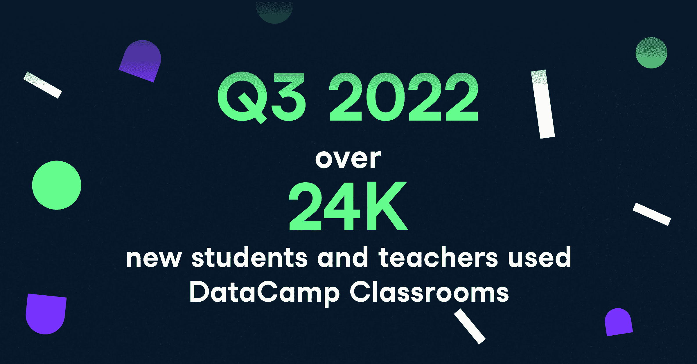
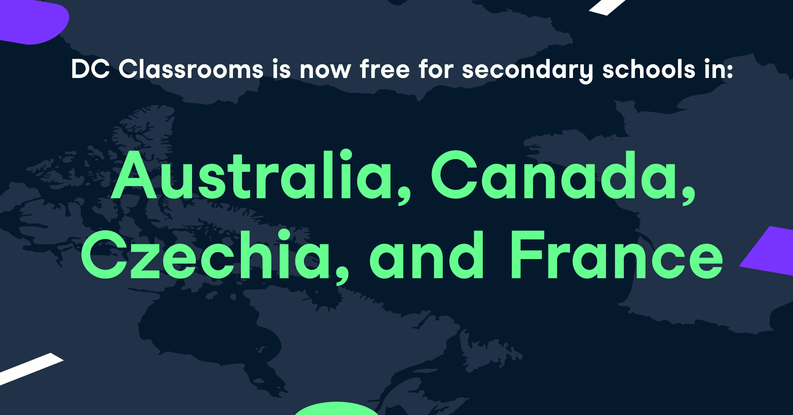
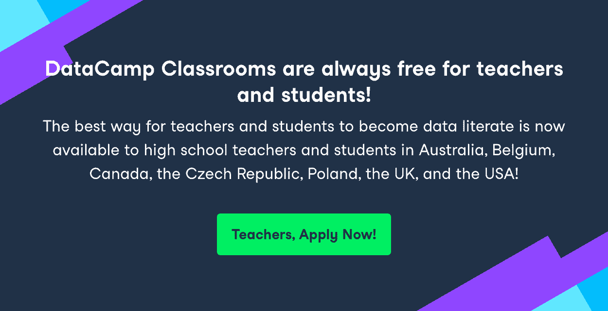
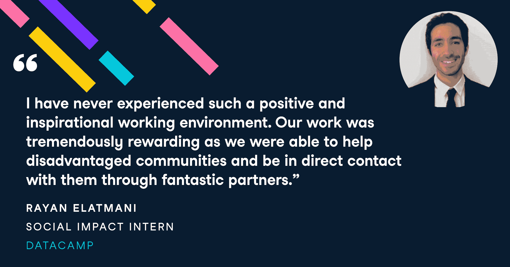

# 2022 年第 3 季度数据营教室综述

> 原文：<https://web.archive.org/web/20221210075939/https://www.datacamp.com/blog/q3-2022-data-camp-classrooms-roundup>

2022 年秋季学期的开学打破了单季度创造的最多[数据营教室](https://web.archive.org/web/20221212135819/https://www.datacamp.com/groups/classrooms)的记录！高中、本科和研究生级别的教师在 80 多个国家创建了超过 2，300 个 DataCamp 教室，使超过 24，000 名新教师和学生获得了六个月免费访问 DataCamp 学习、工作空间、认证和工作的机会。

我们还将加拿大、法国、澳大利亚和捷克共和国的中学教师纳入了 DataCamp 课堂。下面是两篇博文，讲述了捷克[和澳大利亚](https://web.archive.org/web/20221212135819/https://www.datacamp.com/blog/how-one-teacher-revolutionized-data-education-in-the-czech-republic)[的高中教师如何伸出援手，为 DataCamp 社会影响团队提供了核实这些地区学校电子邮件地址所需的必要数据。与美国、英国、比利时和波兰一样，这使得八个国家的高中有资格利用 DataCamp 教室提供的一切。发送电子邮件至](https://web.archive.org/web/20221212135819/https://www.datacamp.com/blog/datacamp-classrooms-australia) [【电子邮件受保护】](/web/20221212135819/https://www.datacamp.com/cdn-cgi/l/email-protection#492d2627283d2c092d283d282a282439672a2624) 帮助我们添加您所在国家的中学！

**阅读更多:** [一位教师如何在捷克共和国掀起数据教育革命](https://web.archive.org/web/20221212135819/https://www.datacamp.com/blog/how-one-teacher-revolutionized-data-education-in-the-czech-republic)

**阅读更多:** [数据营课堂登陆澳洲:你也可以投稿](https://web.archive.org/web/20221212135819/https://www.datacamp.com/blog/datacamp-classrooms-australia)

## 教师和学生从课堂数据营中获得了什么？

*   包含超过 380 门课程的综合数据科学课程可以让任何人从新手到专家，从基础理论课程到所有突出的编码技术，如 Python、SQL、R 等等。
*   数据科学项目使用真实世界的数据集和场景，让学生体验向最终目标应用新技能的过程。
*   一个易于使用的平台，无需下载任何软件即可访问全功能浏览器。
*   [练习练习](https://web.archive.org/web/20221212135819/https://www.datacamp.com/interactive-learning)通过快速的日常挑战来提升您的数据科学技能。
*   我们所有课程视频的字幕和[最佳辅助选项](https://web.archive.org/web/20221212135819/https://www.datacamp.com/blog/learner-spotlight-learning-on-datacamp-with-a-disability)。
*   [作业](https://web.archive.org/web/20221212135819/https://support.datacamp.com/hc/en-us/articles/360050186713-Assignments-Overview#creating-an-assignment-0-0)和报告工具，增强您的课堂管理能力。你会确切地知道哪些学生完成了你的作业，什么时候完成的。我们甚至会给你看他们的[技能评估](https://web.archive.org/web/20221212135819/https://www.datacamp.com/signal)的结果。
*   高成就者可以获得行业认可的[数据科学家和数据分析师认证](https://web.archive.org/web/20221212135819/https://www.datacamp.com/certification)，并访问我们的工作平台，开始他们的职业生涯。
*   DataCamp [Workspace](https://web.archive.org/web/20221212135819/https://www.datacamp.com/workspace) ，这是一个创意空间，允许教师定制作业，并允许学生分享他们的数据驱动工作组合。
*   [iPhone 和 Android](https://web.archive.org/web/20221212135819/https://www.datacamp.com/mobile) 上完整的 DataCamp 应用程序。
*   我们甚至允许您和您的学生下载我们的课程内容进行离线学习。
*   所有这些都是免费的！

## 你好，再见

我们的社会影响团队有了一名新成员！奥利·杜赫斯特是 DataCamp 的新任增长副总裁。他位于伦敦之外，他的目标是在 2023 年将数据营的捐赠和教室增加一倍。

当我们的社会影响实习生 Rayan Elatmani 和 Seve Perez 回到学校时，我们也向他们道别。他们在发展、维护、促进和改善 DataCamp 的所有社会影响项目方面所做的宝贵工作，只要他们存在，人们就会感受到。特别是，如果没有他们勤奋的团队合作，我们在澳大利亚、加拿大、捷克和法国的高中扩张是不可能的。

他们愉快地出现在我们的帝国大厦办公室里，我们都会怀念他们。祝你们俩好运！