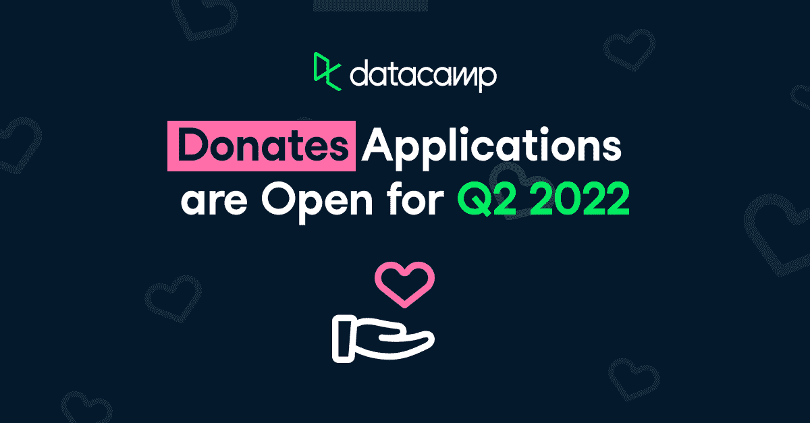

# 合格的非营利组织免费获得数据营！申请数据营捐赠

> 原文：<https://web.archive.org/web/20221129050302/https://www.datacamp.com/blog/qualified-nonprofits-get-datacamp-for-free-apply-to-datacamp-donates>

数据营的社会影响团队再次[接受申请](https://web.archive.org/web/20221212135827/http://www.datacamp.com/donates/apply)加入[数据营捐赠](https://web.archive.org/web/20221212135827/https://www.datacamp.com/donates)！如果你在一个非盈利组织工作或做志愿者，你应该为你自己和你的社区申请一整年的免费、无限制的 DataCamp 访问。

所有向乌克兰难民提供直接支持的乌克兰组织，请务必申请。我们将尽快处理您的申请，以便您可以免费获得一年的 DataCamp，并提供给您的社区。帮助乌克兰人民安全地学习数据科学并获得新的工作是 DataCamp 社会影响团队的主要优先事项。

## 如何申请？

去[www.datacamp.com/donates/apply](https://web.archive.org/web/20221212135827/http://www.datacamp.com/donates/apply)填写申请表。我们的社会影响团队将在 1-3 个工作日内对您的申请做出回应，许多新的合作伙伴组织将在不到两周的时间内获得访问权限。DataCamp 捐赠免费访问 DataCamp 学习平台，以便:

*   职业发展和就业安置非营利组织
*   非营利数据科学和/或编码组织服务于历史上的弱势群体
*   环境、健康、经济和社会科学研究非营利组织
*   中学或大专学校认可的学生经营的俱乐部/社团

DataCamp Donates 的目标是帮助弱势群体掌握更多数据知识，获得更高收入的工作，从而为明天的世界做好更好的准备。因此，请在申请过程中准备好证明您的组织和您的成员如何满足这些标准。您提供的信息越多，处理您的申请就越容易、越快。

将优先考虑支持以下人群的机构:

*   失业的
*   就业不足(工资太低和/或工作时间不够)
*   生活在他们国家的国家贫困线以下
*   因新冠肺炎而失去的工作、工资和/或亲人
*   战争和/或环境灾难的难民
*   历史上弱势群体和社区的成员
*   16 - 26 岁的学生

请记住，如果你代表乌克兰非营利组织或支持乌克兰难民的组织申请，你就自动符合资格。

## 您的社区从 DataCamp 捐赠中获得了什么？

DataCamp 捐赠给非营利组织及其成员:

*   **Autonomy** : DataCamp 使人们能够在一整年内按照自己的节奏学习真实世界的数据课程和练习，我们为他们的管理员提供工具来组织他们的学习者，给他们分配任务，并全年有效地跟踪他们的进度。
*   **可访问性**:DataCamp 的所有评估、课程、项目等课程都免费提供给 data camp 捐赠合作伙伴。从来没有必要购买任何额外的软件。我们的平台几乎可以在任何电脑上运行，但也包括通过我们的移动应用程序无限制访问。无论我们的学习者在哪里，互联网都不便宜或无处不在，这就是为什么我们也让他们下载我们的视频和幻灯片供离线观看。他们甚至可以放慢(或加快)我们的视频，或者观看 15 种以上语言的隐藏字幕，因为可访问性是 DataCamp 精神的核心。
*   职业发展:数据和编码相关的技能是招聘者最需要的技能之一。通过使用任何有抱负的数据科学家的最基本的工具来促进您的成员的职业生涯。 [Workspace](https://web.archive.org/web/20221212135827/https://www.datacamp.com/workspace) 通过与同事和招聘人员分享您的数据科学见解，帮助学员展示他们的才华。获得行业认可的认证以及个人职业支持。更好的是，获得免费的[数据分析师或科学家认证](https://web.archive.org/web/20221212135827/https://www.datacamp.com/certification)，并受益于 [DataCamp Talent](https://web.archive.org/web/20221212135827/https://www.datacamp.com/talent) 功能，让您的个人资料与最佳雇主匹配，参加特定职位的评估，并获得您梦想的工作！

## 为什么要申请？

随着国际紧张局势加剧，不确定性在全球范围内扩大，而世界仍在从全球疫情中复苏。此外，应重点关注历史上受危机影响更大的弱势群体。免费、灵活地访问在线学习资源变得至关重要，因为在这种可怕的情况下，教育和足智多谋是我们所有人的关键。

非营利组织是当前健康和经济环境解决方案的一个组成部分。然而，他们也最需要额外的帮助和资源。

申请 DataCamp 捐赠是非营利组织的一种免费而可靠的方式，通过鼓励他们学习为未来做准备的基本技能，帮助他们的成员在困境中茁壮成长。自 2020 年 8 月 DataCamp 开始捐赠以来，我们已经向 100 多个国家的非营利合作伙伴组织发放了 30，000 多份奖学金。仅在 Q1 2022，我们就为有需求的有志数据专业人士发放了至少 7，000 个许可证。通过加入 DataCamp 捐赠，您为大众化数据扫盲做出了贡献。

[在此申请](https://web.archive.org/web/20221212135827/https://www.datacamp.com/donates/apply)或通过 [【电子邮件保护】](/web/20221212135827/https://www.datacamp.com/cdn-cgi/l/email-protection#54303b3a3520311430352035373539247a373b39) 联系我们，这样我们可以帮助您直接免费使用一个最全面、最受行业认可的数据科学学习平台，为期一年。