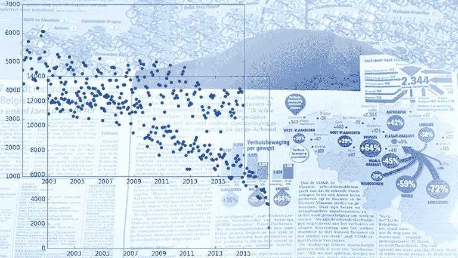

# 数据新闻快速指南

> 原文：<https://web.archive.org/web/20230101103415/https://www.datacamp.com/blog/quick-guide-to-data-journalism>

随着数据科学行业对数据故事的重新关注，将数据科学作为团队运动的方法，以及数据记者开展和发布的大型调查，如 [Panama Papers](https://web.archive.org/web/20220529063311/https://panamapapers.icij.org/) 、 [2016 年美国大选预测](https://web.archive.org/web/20220529063311/http://projects.fivethirtyeight.com/2016-election-forecast/?ex_cid=rrpromo)或[Airbnb 效应](https://web.archive.org/web/20220529063311/http://www.sfchronicle.com/airbnb-impact-san-francisco-2015/#1)，人们对数据新闻的兴趣正在上升。

但它到底是什么，你如何成为一名数据记者？今天的博文将尝试对这些问题给出更多的见解和答案。

提示:如果你想通过 R 学习数据新闻入门课程，可以考虑 DataCamp 的[与 Tidyverse](https://web.archive.org/web/20220529063311/https://www.datacamp.com/courses/communicating-with-data-in-the-tidyverse) 课程中的数据交流。

## 对新闻业最热门趋势的定义

有许多定义，很难只见树木不见森林。有些人说数据新闻和数据驱动新闻(DDJ)一样，另一些人坚持认为两者是不同的学科。你会在那里找到很多定义。

在本文中，我们将把这两者视为同一学科。

然后，就简单了，对吧？定义一点也不难！这只是用数据做的新闻。

但是新闻到底是什么意思，什么是数据？

数据新闻一般被定义为“当你将传统的‘新闻嗅觉’和讲述引人注目的故事的能力与现在可用的数字信息的绝对规模和范围相结合时，所开辟的新的可能性”。

然而，这个定义可能掩盖了存在工作流的事实:在这个意义上， [Mirko Lorenz](https://web.archive.org/web/20220529063311/https://twitter.com/mirkolorenz) 的定义可能更准确，其中该学科被描述为“数据是分析、可视化以及最重要的是讲故事的基础的工作流”。

请注意，您会经常看到“汽车”(计算机辅助报告)这个术语。这是第一个有组织的，系统的方法来使用计算机收集和分析数据，以改善新闻。

## 如何成为一名数据记者

既然背景和定义已经很清楚了，你可以开始思考成为一名数据记者需要什么了。接下来的部分将会让你更深入地了解成为一名会计师需要做些什么，你还会找到一个你可以遵循的分步计划的大纲，包括最好的资源。

### 成为一名数据记者需要什么？

你可能读过一些这方面的引言，比如“要成为一名优秀的数据记者，从成为一名优秀的记者开始会有所帮助”( [Meredith Broussard](https://web.archive.org/web/20220529063311/https://twitter.com/merbroussard) )或者“计算机不会把一名糟糕的记者变成一名优秀的记者。他们所做的是让一个好记者变得更好”(埃利奥特·贾斯平)，但最终你需要什么才能成为一名数据记者？

根据 ProPublica 的副执行主编、DocumentCloud 的联合创始人 Scott Klein 的说法，候选人应该具备 1。新闻技能，2。设计人才，3。编码敏锐度。这看起来相当简单，但是教育背景呢，什么是“新闻技能”、“设计天赋”或“编码敏锐度”？

对于第一个方面，你可能认为你需要一个新闻学位。斯科特·克莱恩证实，他团队中的大多数人都有新闻学位，但这肯定不是先决条件。有一些数据记者有数学或计算机科学背景。

这种方法效果很好，也是因为，按照克莱恩的说法，“新闻业天生适合那些想让世界变得更美好的数学运动员”。然而，克莱恩在候选人身上寻找的东西也透露出教育背景不一定起很大作用，只要你拥有他寻找的三样东西。

从另一方面来说，如果你没有任何技术背景，当然也有可能成为一名数据科学记者。

无论你的背景是什么，在你寻求获得成为一名数据记者所需的三项技能时，你都需要考虑它！

而这三项技能来之不易。不幸的是，没有很多大学或课程可以教你这三种知识，大多数人认为你真的需要自己学习很多东西。

你可以参加 MOOC，比如[这个](https://web.archive.org/web/20220529063311/http://datajournalismcourse.net/)或者[这个大数据大学课程](https://web.archive.org/web/20220529063311/http://bigdatauniversity.com/courses/introduction-data-journalism/)，或者由外部数据记者教授的研讨会，但是提供的机会非常少，而且价格不菲。许多针对专业数据记者的培训通常包括数据和记者团队之间的合作，号召支持网络、数据训练营，...

但主要还是要自学。

这就是你需要为自己制定一个循序渐进的计划，包括各种资源，以达到成为一名数据记者的目标，或者，如果你已经是一名数据记者，继续自学。

### 学习数据新闻的循序渐进计划

这个循序渐进的计划包含了开始的第一步。您需要根据您的教育背景和学习风格个性化本指南。

以下是成为数据记者的计划中包含的八个步骤:

1.  [建立广泛的知识库](#step1)
2.  [写，写，写](#step2)
3.  [学习(一些)编程语言](#step3)
4.  [发现数据新闻工作流程](#step4)
5.  [打造你的工具箱](#step5)
6.  [开始建立你的人际网络](#step6)
7.  [继续你的学习](#step7)
8.  去争取吧！

[//web.archive.org/web/20220529063311if_/https://www.slideshare.net/slideshow/embed_code/key/6AQ1IsyTnzVGe4](//web.archive.org/web/20220529063311if_/https://www.slideshare.net/slideshow/embed_code/key/6AQ1IsyTnzVGe4)
**[Data Journalism: A Quick Start Guide](//web.archive.org/web/20220529063311/https://www.slideshare.net/karlijnwilems/data-journalism-a-quick-start-guide "Data Journalism: A Quick Start Guide")** from **[Karlijn Willems](//web.archive.org/web/20220529063311/https://www.slideshare.net/karlijnwilems)**

### 1.建立广泛的知识库

记者天生就是这样的人，无论何时出现新的话题，他们都必须能够调整自己的技能。此外，数据记者报道的主题可以变化很大，你必须能够覆盖广泛的范围，甚至比典型的记者更广。

建立广泛知识库的关键可能因人而异，取决于你的学习风格。

不过，达到目的的方法之一是通过大量的阅读、倾听和观看。但是最终，你的态度可能是达到你所需要的最重要的事情。如果你天生好奇，并且你有一些东西驱使你去发现和学习新事物，这绝对是一个加分项。

这第一步指定的广泛的知识库不仅包括时事知识，还包括量化主题的知识。你不应该只知道政治，而对统计学一无所知，因为这无疑会干扰你分析政治数据的能力。让这也成为文章中经常出现的事情之一，就是数据记者和编辑的建议:上统计课。如果你想开始，一定要去看看 [OpenIntro](https://web.archive.org/web/20220529063311/http://www.openintro.org/) 和 [DataCamp](https://web.archive.org/web/20220529063311/https://www.datacamp.com/courses/) 提供的统计课程。

最后，考虑获取更多关于学科本身的背景知识:

*   听听斯科特·克莱因关于数据新闻历史的有趣演讲
*   看看你的同事都做了些什么:
    *   由[安娜·弗拉格](https://web.archive.org/web/20220529063311/https://twitter.com/AnnaFlagg)发起的[动物灭绝](https://web.archive.org/web/20220529063311/http://projects.propublica.org/extinctions/)项目
    *   美国最危险的工作由[克里斯多佛·坎农](https://web.archive.org/web/20220529063311/https://twitter.com/homiedonttweet)、[亚历克斯·麦金太尔](https://web.archive.org/web/20220529063311/http://www.bloomberg.com/authors/AQf55JeSS_c/alexander-mcintyre)和[亚当·皮尔斯](https://web.archive.org/web/20220529063311/https://twitter.com/adamrpearce)(彭博)制作
    *   [国安局文件解码](https://web.archive.org/web/20220529063311/https://www.theguardian.com/world/interactive/2013/nov/01/snowden-nsa-files-surveillance-revelations-decoded#section/3)，由[埃文·麦卡斯基尔](https://web.archive.org/web/20220529063311/https://twitter.com/ewenmacaskill)、[加百列·丹斯](https://web.archive.org/web/20220529063311/https://twitter.com/gabrieldance)、[菲尔丁·凯奇](https://web.archive.org/web/20220529063311/https://twitter.com/fcage)和[格雷格·陈](https://web.archive.org/web/20220529063311/https://twitter.com/chengreg)(《卫报》)
    *   [可视化伊战日志](https://web.archive.org/web/20220529063311/http://jonathanstray.com/a-full-text-visualization-of-the-iraq-war-logs)，作者[乔纳森·斯特里特](https://web.archive.org/web/20220529063311/https://twitter.com/jonathanstray)和[朱利安·伯吉斯](https://web.archive.org/web/20220529063311/https://twitter.com/aubergene)

### 2.写，写，写

你可能认为这一步在你成为数据记者的计划中可以忽略不计，但事实并非如此。写得好是很难教的事情之一，如果你想写得又快又准确，需要大量的练习，但仍然要针对你的读者，并在你写作的媒介的背景下，可能是博客，报纸，…为读者而不仅仅是为你自己写作需要技巧。任何你认为可以被其他人访问和阅读的东西，很可能都不是这样。

因此，请务必花时间完成这一步。幸运的是，网上有很多关于这个话题的课程，所以你不会被冷落:

*   EdX 为那些想学习更多新闻知识的人提供了一个很好的机会。“新闻促进社会变革”课程可能会让你感兴趣，但“记者英语:关键概念”无疑也会有很大帮助。
*   此外， [Coursera](https://web.archive.org/web/20220529063311/http://www.coursera.org/) 还提供新闻课程和一整套专业化路线，以启动你的新闻职业生涯。
*   查看 [Mediabistro](https://web.archive.org/web/20220529063311/https://www.mediabistro.com/online-training-courses/browse/) 的培训课程。

如果你更喜欢现场训练，你可以考虑[卫报的大师班](https://web.archive.org/web/20220529063311/https://www.theguardian.com/guardian-masterclasses/writing-and-publishing)或者在谷歌上搜索一下，看看你家附近有没有这样的课程；有很多大学和组织提供新闻课程。

### 3.学习(一些)编程语言

尽管你可以用 Microsoft Excel 之类的工具做很多事情，而且编程本身并不是成为一名数据记者的必要条件，但在这个(早期)阶段学习如何编码会让你受益匪浅。

与您可能期望的相反，在这里学习编程的目标不仅是确保您能够收集信息，而且能够显示信息。

请注意，这里对某种语言的选择取决于您希望在哪里工作以及您正在处理的数据/故事。

作为一名数据记者，有些工作要求你比收集、转换和建模数据更了解网络开发，反之亦然。首先，最好在这两方面都有基础，然后在你更感兴趣的方面提高你的能力，因为这也将在你申请的工作中发挥作用。

这也解释了为什么最受欢迎的技能是 JavaScript、CSS 和 HTML。这些语言是网站制作语言。你可以看看 [Journocode](https://web.archive.org/web/20220529063311/http://journocode.com/) 教程。

接下来，也非常需要 Django (Python)和 Ruby web 框架方面的技能。如果你想学习如何用这两种语言编程，你应该考虑一下代码学校的课程。

最后，R/SAS/SPSS 和 Python 也应该在数据记者的学习清单上。这些语言不同于其他语言和上面提到的 Django 框架，因为它们非常适合分析和建模数据。在这里可能会派上用场的课程有 DataCamp 的[R 简介](https://web.archive.org/web/20220529063311/https://www.datacamp.com/courses/free-introduction-to-r/)和[数据科学 Python 简介](https://web.archive.org/web/20220529063311/https://www.datacamp.com/courses/intro-to-python-for-data-science/)课程。它们是为初学者量身定制的，一步一步地将你的编程技能提升到一个新的水平。对于 SAS 培训，你可以去[这里](https://web.archive.org/web/20220529063311/https://support.sas.com/training/)，对于 SPSS，你可以去[这里](https://web.archive.org/web/20220529063311/https://www.lynda.com/SPSS-training-tutorials/1009-0.html)。

### 4.发现数据新闻工作流程

了解工作流程并有一个工具箱供您使用是您学习的重要一步。开始这一步没有太多要求，但大多数数据记者都认为你应该能够使用 Microsoft Excel。因此，如果你不知道电子表格是如何工作的，你应该确保在开始任何其他工作之前，你已经熟练使用 Excel。

如果你有这个基础，你可以开始研究数据新闻工作流程。

与数据科学工作流程非常相似，数据记者应该经历数据收集、数据争论、分析以及数据可视化和报告等步骤。

然而，这个过程的重点将不是对数据建模，而是更多地放在其他步骤上，特别强调报告或讲故事。

以下资源可能有助于您开始了解数据争论、数据分析、数据可视化和报告:

*   爱德华·塔夫特的书:如果你不知道如何展示数据和信息，这些书很棒。对于任何想重温可视化和可视化理论知识的人来说，它们都是极好的资源。同样值得一试的是 [Alberto Cairo](https://web.archive.org/web/20220529063311/https://twitter.com/albertocairo) 的“功能艺术”和[Stephen first](https://web.archive.org/web/20220529063311/https://twitter.com/FakeStephenFew)的“信息仪表板设计”。
*   Nate Silver 的《信号与噪音:为什么如此多的预测失败——但有些没有》:对数据或分析感兴趣的人的必读之作。
*   有许多资源专门关注 Python 和 r 的数据收集、争论和可视化。在这里阅读更多关于这些的[。](https://web.archive.org/web/20220529063311/https://www.datacamp.com/community/tutorials/learn-data-science-resources-for-python-r/)

### 5.构建您的工具箱

你需要有合适的工具来处理上面描述的工作流程。幸运的是，数据记者可以使用各种各样的工具。对某种工具的选择自然取决于你工作的环境:看看 data journalist 的招聘信息就知道，不同的工作可以使用不同的工具，故事和数据的环境也会对你的选择产生一定的影响。最后，你也可能对某些工具有所偏好，因为你对它很精通。

这就是你的态度的来源。

你不需要知道如何使用每种工具，但是你应该了解每种工具能为你和你的故事提供什么。

你应该具备学习技能的能力和学习的意愿。

下面，我们列举一些经常在 Quora 等论坛和招聘启事中提到的工具的例子。该概述遵循上述工作流程的各个阶段，并不意味着详尽无遗:它只是为您提供从何处开始的指导。

**建立你的工作空间。这可能是工作流程的第一步。如果你打算编程，你可能需要一个编码编辑器。考虑一下 [VIM](https://web.archive.org/web/20220529063311/http://www.vim.org/) 、 [TextMate](https://web.archive.org/web/20220529063311/https://macromates.com/) 、 [Sublime Text](https://web.archive.org/web/20220529063311/https://www.sublimetext.com/) 或者一个成熟的 IDE，比如 [RStudio](https://web.archive.org/web/20220529063311/https://www.rstudio.com/) 、[Spyder](https://web.archive.org/web/20220529063311/https://www.spyder-ide.org/)……你也可以考虑安装 [Git](https://web.archive.org/web/20220529063311/https://git-scm.com/) 或者其他版本控制系统来管理你的源代码。**

获取您的数据。数据是您工作流程的基石。因此，您首先需要知道从哪里可以获得这些数据。获取数据的第一个途径是通过你的网络。来源是非常重要的，因为数据并不总是出现在你面前，但故事却出现了。然后你的工作是找到数据来证实你从你的消息来源那里听到的故事。

获取数据的第二种方式是通过开放数据平台。有很多这样的网站，但是最突出的是世界银行、T2、联合国、T4、数据门户和数据中心。你也有[美国政府的公开数据](https://web.archive.org/web/20220529063311/https://www.data.gov/)和[英国政府的公开数据](https://web.archive.org/web/20220529063311/https://data.gov.uk/)，以及许多其他有公开数据的政府网站。

要了解更多关于开放数据可以带来的价值，请查看来自欧洲数据门户的[开放数据研究所课程](https://web.archive.org/web/20220529063311/http://theodi.org/courses)、[电子学习计划](https://web.archive.org/web/20220529063311/https://www.europeandataportal.eu/en/training-library/elearning)，...

作为一名有抱负的数据记者，卫报的数据博客也是一个有趣的起点，因为它展示了数据、背景和关于数据新闻过程的问题。

数据集也可以通过邮件列表获得，如 NICAR listserv 或论坛。

除了可以通过开放数据平台、邮件列表、论坛或资源获得的数据集，你还可以通过网络搜集获得数据。在这里，您需要利用 Python 和 R 等编程语言提供的包或库。或者你可以求助于专门为此目的而设计的工具，这些工具不需要你精通编程。

另一方面，也可以从数据库中检索数据。SQL 在这一点上会派上用场。如果你想学习这个技能，试着专注于 MySQL、PostgreSQL 或 SQL Server。考虑在[tutorial point](https://web.archive.org/web/20220529063311/https://www.tutorialspoint.com/)上学习一些教程，了解更多关于数据库和 SQL 的知识。

你马上会发现拥有一个网络在这里是很重要的。我们稍后再讨论这个。

在所有这一切中，不要忘记法律上的考虑，这一点非常重要。总是检查你能利用你已经获得的数据集做什么，以及你需要给予谁信任。如果您没有获得所需的数据，您可以随时提交信息自由(FOI)请求(也称为“摇摆”)，这使您有机会请求访问政府公共部门组织(如警方、学校或公有博物馆)持有的记录信息。

**在工作区获取数据。**要将数据放入您的工作空间，您可以首先求助于最基本的方法，即使用 Excel。然而，当你已经更高级时，你应该能够利用你正在使用的编码语言的库或包。您可以使用特殊函数在上导入数据。csv，。txt 或其他文件扩展名，但也有一些特定的材料可以帮助你通过网络搜集从互联网上收集数据。Python 和 R 有专门为此设计的库/包，即 [`scrapy`](https://web.archive.org/web/20220529063311/https://scrapy.org/) 或`[rvest](https://web.archive.org/web/20220529063311/https://www.rdocumentation.org/packages/rvest/versions/0.3.2)`。要从 pdf 中抓取数据，您可以使用 [Tabula](https://web.archive.org/web/20220529063311/http://tabula.technology/) 。要提取 web 数据，还可以利用 [import.io](https://web.archive.org/web/20220529063311/https://www.import.io/) 。

**争论你的数据。**整理您的数据意味着对其进行处理、清理和重塑，以便它可以随时对您的数据进行分析。对于 Python 来说， [`NumPy`](https://web.archive.org/web/20220529063311/http://www.numpy.org/) 和 [`Pandas`](https://web.archive.org/web/20220529063311/http://pandas.pydata.org/) 包是必经之路。对于 R，可以依靠[`dplyr`](https://web.archive.org/web/20220529063311/https://www.rdocumentation.org/packages/dplyr/versions/0.5.0)[`tidyr`](https://web.archive.org/web/20220529063311/https://www.rdocumentation.org/packages/tidyr/versions/0.6.0)。对于开箱即用的工具， [OpenRefine](https://web.archive.org/web/20220529063311/http://openrefine.org/) (以前的 Google Refine)是一个用于清理和转换数据的流行工具，但你也可以使用 [DataWrangler](https://web.archive.org/web/20220529063311/http://vis.stanford.edu/wrangler/) 或 [CSVKit](https://web.archive.org/web/20220529063311/http://csvkit.readthedocs.io/en/latest/) 。

**分析你的数据。这里可能是你的统计技能派上用场的地方。利用 or R 和 Python，用 [`statsmodels`](https://web.archive.org/web/20220529063311/http://statsmodels.sourceforge.net/) 或 [``statmod``](https://web.archive.org/web/20220529063311/https://www.rdocumentation.org/packages/statmod/versions/1.4.26) 对你的数据建模。您也可以使用诸如 [DataRobot](https://web.archive.org/web/20220529063311/https://www.datarobot.com/) 、 [Knime](https://web.archive.org/web/20220529063311/https://www.knime.org/) 或 [RapidMiner](https://web.archive.org/web/20220529063311/https://rapidminer.com/) 等工具。**

**可视化您的数据。**大多数受欢迎的技能都涉及显示信息，所以把足够的注意力放在可视化数据上是非常重要的。可以求助于 [Tableau](https://web.archive.org/web/20220529063311/http://www.tableau.com/) 或者 [Qlikview](https://web.archive.org/web/20220529063311/https://www.qlik.com/us) 、 [TileMill](https://web.archive.org/web/20220529063311/https://tilemill-project.github.io/tilemill/) 、 [infogr](https://web.archive.org/web/20220529063311/https://infogr.am/) [。am](https://web.archive.org/web/20220529063311/https://infogr.am/) ，Google Fusion 或者 [QGIS](https://web.archive.org/web/20220529063311/http://www.qgis.org/en/site/) 和 [ArcGIS](https://web.archive.org/web/20220529063311/https://www.arcgis.com/features/index.html) 如果你正在寻找不需要你做(很多)编程的工具。如果你已经精通 JavaScript、Python 或 R，你可能会考虑 [D3.js](https://web.archive.org/web/20220529063311/https://d3js.org/) 、`[plotly](https://web.archive.org/web/20220529063311/https://plot.ly/)`、[、`matplotlib`、或](https://web.archive.org/web/20220529063311/http://matplotlib.org/)`[ggplot](https://web.archive.org/web/20220529063311/https://www.rdocumentation.org/packages/ggplot2/versions/2.1.0/topics/ggplot)`。

报告你的结果。您可以使用 Tableau 或 Qlikview 构建仪表盘，或者使用 [Adobe Illustrator、Adobe Indesign 或 Adobe Photoshop 制作信息图](https://web.archive.org/web/20220529063311/http://www.adobe.com/)，或者将您的代码和可视化结果放在笔记本中。你有一个基于网络的 [Jupyter](https://web.archive.org/web/20220529063311/http://jupyter.org/) 笔记本来存放你的 Python 代码。对于 R，你可以考虑制作一个 [R Markdown](https://web.archive.org/web/20220529063311/http://rmarkdown.rstudio.com/) 文档。

### 6.开始建立你的人际网络

如果你想成为一名数据记者，建立你的关系网将非常重要，因为这是你找到灵感和导师的途径。你的人际网络会让你向最优秀的人学习。

首先在 Twitter 上关注一些数据新闻和行业的关键人物:

| [保罗·布拉德肖](https://web.archive.org/web/20220529063311/https://twitter.com/paulbradshaw) | 西蒙·罗杰斯 |
| 史蒂夫·多伊格 | 马修·康伦 |
| 斯科特·贝里纳托 | 阿尔贝托·佩佩 |
| [黄邦贤柏林](https://web.archive.org/web/20220529063311/https://twitter.com/jonathonberlin) | [艾琳·罗斯](https://web.archive.org/web/20220529063311/https://twitter.com/ireneros) |
| 马尔滕·兰布雷特 | [尼尔斯穆德](https://web.archive.org/web/20220529063311/https://twitter.com/nmulvad) |
| 大卫·麦坎多斯 | 约翰·伯恩-默多克 |
| 阿尔贝托·卢卡斯·洛佩斯 | 沃伦·里德 |
| 大卫·哈丁 | [stijn debouwer](https://web.archive.org/web/20220529063311/https://twitter.com/stdbrouw) |
| [尼古拉·卡塞尔-布里尔](https://web.archive.org/web/20220529063311/https://twitter.com/nicolaskb) | 雅格布·奥塔维亚尼 |
| 克雷格·西尔弗曼 | 尼古拉斯·惠特克 |
| 安德鲁·奥德瓦恩 | [海伦娜·本斯特朗森](https://web.archive.org/web/20220529063311/https://twitter.com/HelenaBengtsson) |
| 米科拉·李森科 | [思思韦](https://web.archive.org/web/20220529063311/https://twitter.com/sisiwei) |
| 克里斯·祖巴克-斯基斯 | ... |

这只是一个让你开始的列表。

请注意，这个列表不包括这篇文章中已经提到的人。

此外，你还可以加入 [Reddit](https://web.archive.org/web/20220529063311/http://www.reddit.com/) 或 LinkedIn 上的群组来了解最新消息:考虑关注 subreddit*/R/**theydithmath*或 */r/datasets* ，但也可以看看更具体的 Python 或 R subreddits 来了解最新消息。特定语言的 Reddit 和 LinkedIn 群组在这里[列出](https://web.archive.org/web/20220529063311/https://www.datacamp.com/community/tutorials/learn-data-science-resources-for-python-r/)。

此外，你也可以考虑去参加像这样的聚会，通过[数据驱动新闻](https://web.archive.org/web/20220529063311/http://datadrivenjournalism.net/events)或[欧洲新闻中心](https://web.archive.org/web/20220529063311/http://ejc.net/)网站关注你所在地区的事件和/或会议。此外，考虑加入 Knight-Mozilla 开放新闻社区。

### 7.继续你的学习

你的学习永远不会结束。总是有那么多要发现和要做的事情，尤其是当你想在这个领域开始的时候，甚至是当你已经有一份工作的时候。

你将永远在学习。

您可以查看一些其他资源:

关注并发现有趣的网站。访问博客，如[fivethirtyeght](https://web.archive.org/web/20220529063311/http://fivethirtyeight.com/)、 [TheUpshot](https://web.archive.org/web/20220529063311/http://www.nytimes.com/section/upshot) (纽约时报)或 [ProPublica Nerd 博客](https://web.archive.org/web/20220529063311/https://www.propublica.org/nerds)，或其他关于数据可视化的有趣网站，如 [EagerEyes](https://web.archive.org/web/20220529063311/https://eagereyes.org/) 或[flow data](https://web.archive.org/web/20220529063311/http://flowingdata.com/)。此外，不要忘了查看数据记者或数据自由职业者的博客和作品集，如 Maarten Lambrechts、 [Alberto Lucas López](https://web.archive.org/web/20220529063311/http://www.lucasinfografia.com/) 或 [John Burn-Murdoch](https://web.archive.org/web/20220529063311/http://johnburnmurdoch.github.io/) 。

听播客。如果你喜欢播客，你会很乐意收听数据故事。这是一个关于数据可视化的很棒的播客。不要错过[这一集](https://web.archive.org/web/20220529063311/http://datastori.es/data-stories-49-data-journalism-at-propublica-w-scott-klein/)，Scott Klein 讲述了他的团队以及他们如何在 ProPublica 工作。也一定要看看[偏导数](https://web.archive.org/web/20220529063311/http://partiallyderivative.com/)和五点三十八分的播客。

**读一些书。**推荐书籍有[本书](https://web.archive.org/web/20220529063311/http://leanpub.com/datajournalism)由[克莱尔·米勒](https://web.archive.org/web/20220529063311/https://twitter.com/clairemilleruk)所著。

**寻找其他培训材料。**查看这份[培训材料清单](https://web.archive.org/web/20220529063311/http://mjwebster.github.io/DataJ/)。考虑一下你是否已经习惯了工具箱中的工具。如果你不是，考虑参加一些教程。你可以在这里找到更多 R 或 Python 教程[。](https://web.archive.org/web/20220529063311/https://www.datacamp.com/community/)

**开始做数据新闻。**从小做起，从自己的一个项目开始。获取一个数据集，并开始分析、可视化和报告结果。你可以在 [Kaggle](https://web.archive.org/web/20220529063311/http://www.kaggle.com/) 或者 [DrivenData](https://web.archive.org/web/20220529063311/http://www.drivendata.org/) 上找到项目。下一步，你可以开一个博客。就像上面提到的那些。这是展示你才华的好方法，也是你简历的一大亮点。你要确保你的成果与全世界分享！

### 8.去吧！

当你完成了前面的步骤，你可能想给自己找一份数据记者的工作。

一些可能会帮助你找工作的网站有[新闻呆子工作](https://web.archive.org/web/20220529063311/http://www.newsnerdjobs.com.s3-website-us-east-1.amazonaws.com/)、[Indeed.com](https://web.archive.org/web/20220529063311/http://www.indeed.com/)、 [NICAR](https://web.archive.org/web/20220529063311/http://ire.org/nicar/) Listserv、 [Mediabistro 工作列表](https://web.archive.org/web/20220529063311/https://www.mediabistro.com/jobs/openings/)、 [Linkedin](https://web.archive.org/web/20220529063311/http://www.linkedin.com/) 和[journal Jobs](https://web.archive.org/web/20220529063311/http://journajobs.eu/)。

## 一些最后的建议

最后，成为一名数据记者的最佳建议是马腾·兰布雷茨的建议:开始做数据新闻吧。

此外，这里还有一些提示:

不要气馁。开始时，你很可能会遇到问题，但这不是放弃的理由。你在实践中学习，这需要一些时间。

不要害怕从小处着手。有些新闻编辑室还没有大数据团队。请记住这一点。

慢慢来。判断某个项目是否值得，需要一定的经验。有时候，你会处理数据，但它不会成为一个故事。也要花时间建立你的人际网络，向他人学习，积累整个工作流程中的经验。