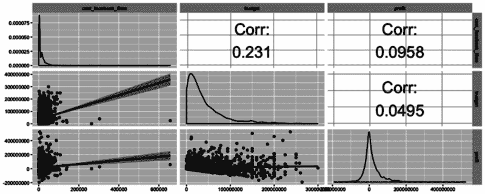
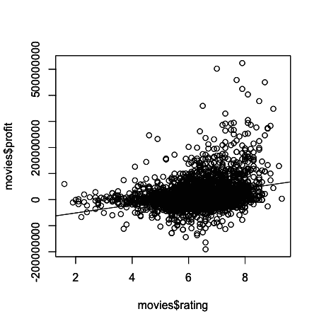
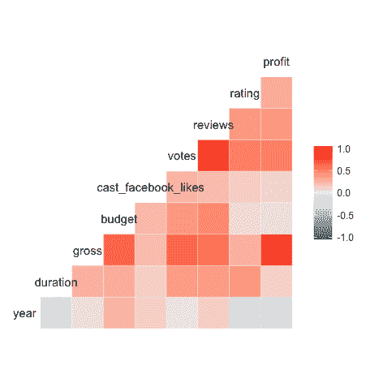
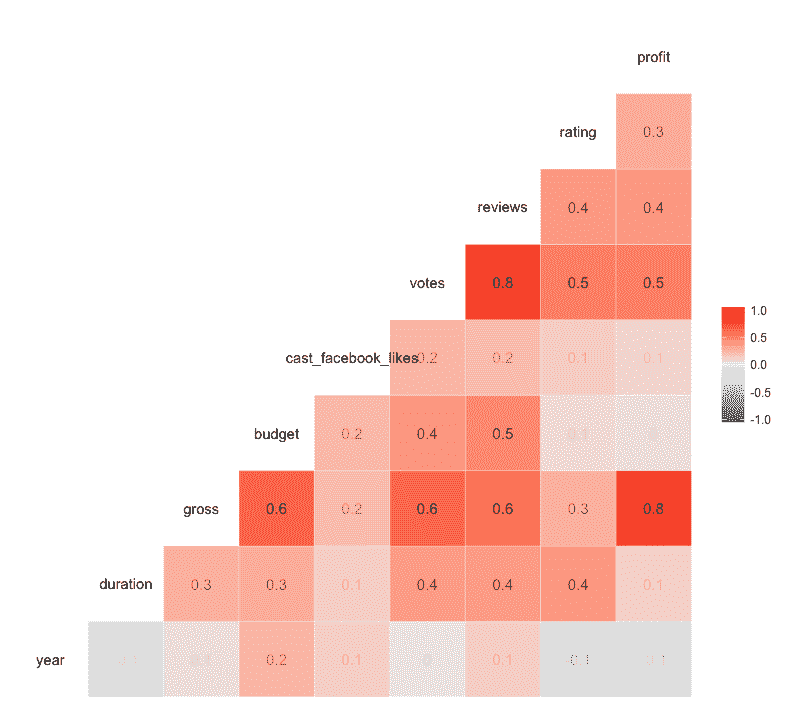
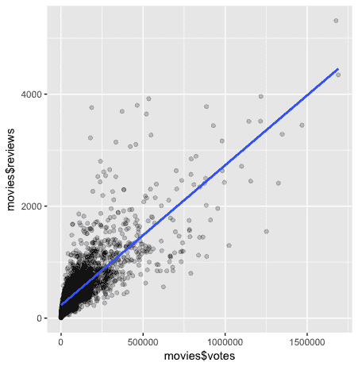
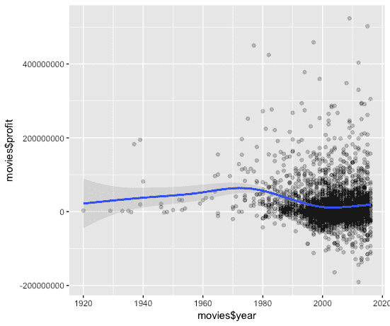
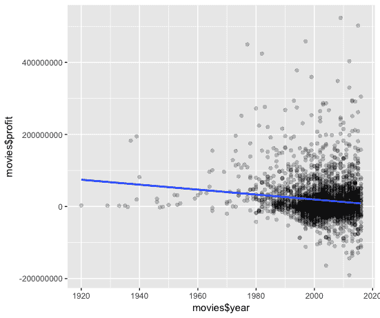
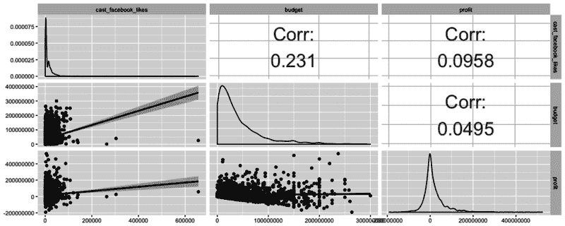

# r 相关教程

> 原文：<https://web.archive.org/web/20230101103415/https://www.datacamp.com/blog/r-correlation-tutorial>



在本教程中，您将探索大量的[数据可视化](https://web.archive.org/web/20221024152619/https://www.datacamp.com/data-courses/data-visualization-courses)方法及其底层统计。特别是在识别数据框架中变量之间的趋势和关系方面。

没错，你会把重点放在相关和回归等概念上！首先，将向您介绍 R 中的相关性。然后，您将看到如何使用诸如`ggplot2`和`GGally`之类的包在 R 中绘制相关性矩阵。最后，您将看到存在哪些类型的相关性，以及它们对您的进一步分析有何影响。

如果你有兴趣深入这个话题，可以考虑参加 DataCamp 的[相关性和回归](https://web.archive.org/web/20221024152619/https://www.datacamp.com/courses/correlation-and-regression/)课程。

## 背景

在今天的教程中，你将使用从 [Kaggle](https://web.archive.org/web/20221024152619/https://www.kaggle.com/) 获得的一组电影数据，来发现如何更好地理解变量之间的关系。

我对数据进行了轻度处理，通过确保货币等事物使用相同的单位，我们的分析是“苹果对苹果”的分析。如果没有这一步，我们对变量`gross`、`budget`和`profit`的统计分析将会产生误导。您可以访问原始数据集。

## 导入数据

为了访问`movies`数据集并投入使用，您可以使用`read.csv()`函数将您的数据导入到数据框中，并将其存储在具有惊人的原始名称`movies`的变量中！

```py
movies <- read.csv(url("http://s3.amazonaws.com/dcwoods2717/movies.csv"))
```

这就是入门的全部！

### 对数据的基本检查

导入数据框后，最好了解一下您的数据。首先，检查正在检查的数据的结构。下面你可以看到使用这个超级简单、有用的函数`str()`的结果:

```py
str(movies)
```

```py
## 'data.frame':    2961 obs. of  11 variables:
##  $ title              : Factor w/ 2907 levels "10 Cloverfield Lane",..: 1560 2143 34 2687 1405 1896 2633 894 1604 665 ...
##  $ genre              : Factor w/ 17 levels "Action","Adventure",..: 6 12 5 5 5 3 2 8 3 8 ...
##  $ director           : Factor w/ 1366 levels "Aaron Schneider",..: 474 472 781 828 175 1355 1328 1328 968 747 ...
##  $ year               : int  1920 1929 1933 1935 1936 1937 1939 1939 1940 1946 ...
##  $ duration           : int  110 100 89 81 87 83 102 226 88 144 ...
##  $ gross              : int  3000000 2808000 2300000 3000000 163245 184925485 22202612 198655278 84300000 20400000 ...
##  $ budget             : int  100000 379000 439000 609000 1500000 2000000 2800000 3977000 2600000 8000000 ...
##  $ cast_facebook_likes: int  4 109 995 824 352 229 2509 1862 1178 2037 ...
##  $ votes              : int  5 4546 7921 13269 143086 133348 291875 215340 90360 6304 ...
##  $ reviews            : int  2 107 162 164 331 349 746 863 252 119 ...
##  $ rating             : num  4.8 6.3 7.7 7.8 8.6 7.7 8.1 8.2 7.5 6.9 ...
```

在这个特定的数据框中，您可以从控制台看到 11 个变量的 2961 个观测值。

顺便说一下，即使每部电影只有一个小时，你也需要连续看四个多月才能看完！

控制台还按名称列出每个变量、每个变量的类以及每个变量的一些实例。这让我们对数据框架中的内容有了一个很好的了解，对它的理解对我们的分析工作至关重要。

另一个帮助我们对数据框架进行快速、高级概述的伟大功能是`summary()`。请注意运行`str()`所产生的输出之间的异同。

```py
summary(movies)
```

```py
##                          title            genre    
##  Home                       :   3   Comedy   :848  
##  A Nightmare on Elm Street  :   2   Action   :738  
##  Across the Universe        :   2   Drama    :498  
##  Alice in Wonderland        :   2   Adventure:288  
##  Aloha                      :   2   Crime    :202  
##  Around the World in 80 Days:   2   Biography:135  
##  (Other)                    :2948   (Other)  :252  
##               director         year         duration    
##  Steven Spielberg :  23   Min.   :1920   Min.   : 37.0  
##  Clint Eastwood   :  19   1st Qu.:1999   1st Qu.: 95.0  
##  Martin Scorsese  :  16   Median :2004   Median :106.0  
##  Tim Burton       :  16   Mean   :2003   Mean   :109.6  
##  Spike Lee        :  15   3rd Qu.:2010   3rd Qu.:119.0  
##  Steven Soderbergh:  15   Max.   :2016   Max.   :330.0  
##  (Other)          :2857                                 
##      gross               budget          cast_facebook_likes
##  Min.   :      703   Min.   :      218   Min.   :     0     
##  1st Qu.: 12276810   1st Qu.: 11000000   1st Qu.:  2241     
##  Median : 34703228   Median : 26000000   Median :  4604     
##  Mean   : 58090401   Mean   : 40619384   Mean   : 12394     
##  3rd Qu.: 75590286   3rd Qu.: 55000000   3rd Qu.: 16926     
##  Max.   :760505847   Max.   :300000000   Max.   :656730     
##                                                             
##      votes            reviews           rating     
##  Min.   :      5   Min.   :   2.0   Min.   :1.600  
##  1st Qu.:  19918   1st Qu.: 199.0   1st Qu.:5.800  
##  Median :  55749   Median : 364.0   Median :6.500  
##  Mean   : 109308   Mean   : 503.3   Mean   :6.389  
##  3rd Qu.: 133348   3rd Qu.: 631.0   3rd Qu.:7.100  
##  Max.   :1689764   Max.   :5312.0   Max.   :9.300  
## 
```

只需一个命令，您就可以让 R 返回数据框中每个变量的一些关键统计信息。现在您已经知道您正在处理什么了，让我们开始深入研究数据吧！

## 特征工程:计算利润

在回顾您可用的变量时，似乎可以操纵一些数值变量来为我们的数据框架提供新的见解。

例如，你已经有了`gross`和`budget`变量，那么为什么不用一点子集来计算每部电影的利润呢？

你可以用公式`profit = gross - budget`计算利润。在下面的 DataCamp Light 块中尝试一下吧！

eyJsYW5ndWFnZSI6InIiLCJwcmVfZXhlcmNpc2VfY29kZSI6Im1vdmllcyA8LSByZWFkLmNzdih1cmwoXCJodHRwOi8vczMuYW1hem9uYXdzLmNvbS9kY3dvb2RzMjcxNy9tb3ZpZXMuY3N2XCIpKSIsInNhbXBsZSI6IiMgRmlsbCBpbiB0aGUgYXBwcm9wcmlhdGUgdmFyaWFibGUgbmFtZXMgdG8gc3Vic2V0IVxucHJvZml0IDwtIG1vdmllcyQuLi4uLiAtIG1vdmllcyQuLi4uLlxuXG4jIENoZWNrIHRoZSByZXN1bHRcbnN1bW1hcnkocHJvZml0KSIsInNvbHV0aW9uIjoiIyBGaWxsIGluIHRoZSBhcHByb3ByaWF0ZSB2YXJpYWJsZSBuYW1lcyB0byBzdWJzZXQhXG5wcm9maXQgPC0gbW92aWVzJGdyb3NzIC0gbW92aWVzJGJ1ZGdldFxuXG4jIENoZWNrIHRoZSByZXN1bHRcbnN1bW1hcnkocHJvZml0KSIsInNjdCI6InRlc3Rfb2JqZWN0KFwicHJvZml0XCIsIHVuZGVmaW5lZF9tc2c9XCJEaWQgeW91IGNvcnJlY3RseSBkZWZpbmUgdGhlIHZhcmlhYmxlIGBwcm9maXRgP1wiLCBpbmNvcnJlY3RfbXNnID0gXCJOb3QgcXVpdGUhXCIpXG50ZXN0X2Vycm9yKClcbnN1Y2Nlc3NfbXNnKFwiRXhjZWxsZW50IVwiKSJ9

厉害！

你可以看到，在我们的数据框架中，有相当多的赚钱者和赚钱者。

我们的电影中的`profit`可能会用于一些有趣的分析，所以让我们继续将`profit`作为一个新列添加到我们的数据框中。

eyJsYW5ndWFnZSI6InIiLCJwcmVfZXhlcmNpc2VfY29kZSI6Im1vdmllcyA8LSByZWFkLmNzdihcImh0dHA6Ly9zMy5hbWF6b25hd3MuY29tL2Rjd29vZHMyNzE3L21vdmllcy5jc3ZcIikiLCJzYW1wbGUiOiIjIEFkZCBhIGNvbHVtbiBmb3IgYHByb2ZpdGAgdG8gYG1vdmllc2AgXG5tb3ZpZXMkLi4uLi4gPC0gbW92aWVzJC4uLi4uIC0gbW92aWVzJC4uLi4uIiwic29sdXRpb24iOiIjIEFkZCBhIGNvbHVtbiBmb3IgYHByb2ZpdGAgdG8gYG1vdmllc2Bcbm1vdmllcyRwcm9maXQgPC0gbW92aWVzJGdyb3NzIC0gbW92aWVzJGJ1ZGdldCJ9

## 相互关系

现在`profit`已经作为一个新列添加到我们的数据框中，是时候更仔细地看看数据集变量之间的关系了。

让我们看看`profit`相对于每部电影的`rating`是如何波动的。

为此，您可以使用 R 的内置`plot`和`abline`函数，其中`plot`将产生一个散点图，而`abline`将产生一条回归线或“最佳拟合线”,因为我们包含了线性模型参数，如下所示。

eyJsYW5ndWFnZSI6InIiLCJwcmVfZXhlcmNpc2VfY29kZSI6Im1vdmllcyA8LSByZWFkLmNzdih1cmwoXCJodHRwOi8vczMuYW1hem9uYXdzLmNvbS9kY3dvb2RzMjcxNy9tb3ZpZXMuY3N2XCIpKVxubW92aWVzJHByb2ZpdCA8LSBtb3ZpZXMkZ3Jvc3MgLSBtb3ZpZXMkYnVkZ2V0XG5vcHRpb25zKHNjaXBlbiA9IDk5OSkiLCJzYW1wbGUiOiIjIENyZWF0ZSB0aGUgc2NhdHRlciBwbG90IHdpdGggYHJhdGluZ3NgIG9uIHRoZSB4LWF4aXMgYW5kIGBwcm9maXRgIG9uIHRoZSB5LWF4aXNcbnBsb3QobW92aWVzJC4uLi4sIG1vdmllcyQuLi4uKVxuXG4jIEFkZCBhIHJlZ3Jlc3Npb24gbGluZXdpdGggdGhlIGZvcm0gYGFibGluZShsbSh5IH4geCkpYFxuXG5hYmxpbmUobG0obW92aWVzJC4uLi4gfiBtb3ZpZXMkLi4uLikpIiwic29sdXRpb24iOiIjIENyZWF0ZSB0aGUgc2NhdHRlciBwbG90IHdpdGggYHJhdGluZ3NgIG9uIHRoZSB4LWF4aXMgYW5kIGBwcm9maXRgIG9uIHRoZSB5LWF4aXNcbnBsb3QobW92aWVzJHJhdGluZywgbW92aWVzJHByb2ZpdClcblxuIyBBZGQgYSByZWdyZXNzaW9uIGxpbmUgd2l0aCB0aGUgZm9ybSBgYWJsaW5lKGxtKHkgfiB4KSlgIFxuYWJsaW5lKGxtKG1vdmllcyRwcm9maXQgfiBtb3ZpZXMkcmF0aW5nKSkifQ==

输出是否与您预期的差不多？



一般来说，似乎具有较高`rating`的电影往往具有较高的`profit`。另一种表述这种说法的方式是，至少在我们的数据框架中，`rating`和`profit`之间存在正相关。

也就是说，即使粗略地看一下剧情，也会发现有很多高收视率的电影并不完全是大片，也有一些非常赚钱的电影获得了相对较低的收视率。

相关性并不意味着因果关系！

有一个轶事可以帮助你理解相关性和因果性，如下:我在海滩上经营一个冰淇淋摊。当我的冰淇淋销售增加时，城市中乱穿马路者的平均数量往往会增加，但是我的冰淇淋导致人们无视交通法规，还是有其他因素在起作用？我的冰淇淋确实很棒，但是外面的阳光可能与人们想吃冰淇淋和不想站在人行横道上被晒伤有关。我的冰淇淋销量和 jay walkers 的数量之间确实存在关联，但你不能肯定地说这是一种因果关系。

在学习本教程的过程中，请记住这条推理路线！

## 计算 R 中的相关性

那么`movies`中的变量之间存在什么类型的关系，如何定量评估这些关系呢？

第一种方法是用`cor()`产生相关性和相关性矩阵:

eyJsYW5ndWFnZSI6InIiLCJwcmVfZXhlcmNpc2VfY29kZSI6Im1vdmllcyA8LSByZWFkLmNzdihcImh0dHA6Ly9zMy5hbWF6b25hd3MuY29tL2Rjd29vZHMyNzE3L21vdmllcy5jc3ZcIilcbm1vdmllcyRwcm9maXQgPC0gbW92aWVzJGdyb3NzIC0gbW92aWVzJGJ1ZGdldFxub3B0aW9ucyhzY2lwZW4gPSA5OTkpIiwic2FtcGxlIjoiIyBDb21wdXRlIFBlYXJzb24gY29ycmVsYXRpb25cbmNvcihtb3ZpZXMkcmF0aW5nLCBtb3ZpZXMkcHJvZml0KVxuXG4jIENvcnJlbGF0aW9uIE1hdHJpeFxuY29yKG1vdmllc1ssNDoxMF0pIn0=

**注意**你也可以指定你想要的方法来指示你想要计算的相关系数。要小心，因为这些相关性总是有一些假设:Kendall 和 Spearman 方法只对有序输入有意义。这意味着您需要在计算相关系数之前对数据进行排序。

此外，默认方法——皮尔逊相关法——假定变量呈正态分布，每个变量之间存在直线关系，并且数据围绕回归线呈正态分布。

还要注意，您可以使用`rcorr()`，它是`Hmisc`包的一部分，用于计算 pearson 和 spearman 相关性的显著性水平。

您还会看到，相关矩阵实际上是一个表格，显示了变量集之间的相关系数。这已经是了解数据集变量之间存在哪些关系的第一个好方法，但是让我们在下一节更深入地探讨这个问题。

## 可视化探索相关性:R 相关矩阵

在接下来的探索中，您将使用您的`movies`数据框中可用的变量绘制一个相关矩阵。这个简单的图将使您能够快速直观地看到哪些变量与其他变量具有负相关、正相关、弱相关或强相关。

为了实现这个奇迹，您将使用一个叫做`GGally`的漂亮包和一个叫做`ggcorr()`的函数。

这个函数调用的形式将是`ggcorr(df)`，其中`df`是您调用函数的数据框的名称。这个函数的输出将是一个三角形的彩色编码矩阵，标有我们的变量名。每个变量相对于其他变量的相关系数可以通过读取矩阵的横向和/或纵向来找到，这取决于变量在矩阵中的位置。

这听起来可能令人困惑，但实际上非常简单，所以在下面的代码块中尝试一下吧！

eyJsYW5ndWFnZSI6InIiLCJwcmVfZXhlcmNpc2VfY29kZSI6Im1vdmllcyA8LSByZWFkLmNzdih1cmwoXCJodHRwOi8vczMuYW1hem9uYXdzLmNvbS8vZGN3b29kczI3MTcvbW92aWVzLmNzdlwiKSlcbm1vdmllcyRwcm9maXQgPC0gbW92aWVzJGdyb3NzIC0gbW92aWVzJGJ1ZGdldFxubGlicmFyeShcIkdHYWxseVwiKSIsInNhbXBsZSI6IiMgUmVwbGFjZSB0aGUgXCIuLi4uLlwiIHdpdGggdGhlIG5hbWUgb2YgdGhlIGRhdGEgZnJhbWUgXG5nZ2NvcnIoLi4uLi4pIiwic29sdXRpb24iOiIjIFJlcGxhY2UgdGhlIFwiLi4uLi5cIiB3aXRoIHRoZSBuYW1lIG9mIHRoZSBkYXRhIGZyYW1lIFxuZ2djb3JyKG1vdmllcykifQ==



所以在你刚刚创建的相关矩阵中(顺便说一句，干得好！)，您可以转到与某个变量相关的行或列，如`year`，并查看其相关系数，如与另一个变量相对应的单元格的颜色所示。

例如，在检查`year`时，您可以看到与`budget`有微弱的正相关性，与`rating`也有类似微弱的负相关性。

相关系数始终介于-1 和 1 之间，包括-1 和 1。相关系数为-1 表示完美的负拟合，其中 y 值的下降速度与 x 值的上升速度相同。相关系数 1 表示完美的正拟合，其中`y`值以与`x`值相同的速率增加。

在大多数情况下，比如你上面的`year`例子，相关系数在-1 和 1 之间。

你注意到相关矩阵中显示的变量有什么奇怪的地方吗？

并不是`movies`中的所有变量都存在！

这是因为`movies`中的变量并不都是数字。`ggcorr`功能会自动忽略非数字变量，使用户在创建矩阵前无需“子集化”这些变量，从而节省了一些时间。

如果你想让你的相关矩阵真正“流行”(或者你可能有点色盲，像我一样)，你可以做一些简单的调整来产生更具视觉吸引力的数据加载矩阵。

在接下来的代码块中，您已经包含了`label`参数，它可以被设置为等于`TRUE`或`FALSE`。默认设置是`FALSE`，但是如果添加`label = TRUE`，每个关系的相关系数都包含在适当的单元格中。这可以防止您根据色标猜测每个系数的值。

`label_alpha`参数允许您根据相关系数的强度增加或减少每个标签的不透明度。这对于快速、直观的数据分析非常有帮助。

不要相信我的话，你自己试试吧！

现在让我们绘制一个更好的相关矩阵:

eyJsYW5ndWFnZSI6InIiLCJwcmVfZXhlcmNpc2VfY29kZSI6Im1vdmllcyA8LSByZWFkLmNzdih1cmwoXCJodHRwOi8vczMuYW1hem9uYXdzLmNvbS8vZGN3b29kczI3MTcvbW92aWVzLmNzdlwiKSlcbm1vdmllcyRwcm9maXQgPC0gbW92aWVzJGdyb3NzIC0gbW92aWVzJGJ1ZGdldFxubGlicmFyeShcIkdHYWxseVwiKSIsInNhbXBsZSI6IiMgRmlsbCBpbiBcIlRSVUVcIiBvciBcIkZBTFNFXCIgdG8gc2VlIGhvdyB0aGUgY29ycmVsYXRpb24gbWF0cml4IGNoYW5nZXNcbmdnY29ycihtb3ZpZXMsIFxuICAgICAgIGxhYmVsID0gLi4uLi4sIFxuICAgICAgIGxhYmVsX2FscGhhID0gLi4uLi4pIiwic29sdXRpb24iOiIjIEZpbGwgaW4gXCJUUlVFXCIgb3IgXCJGQUxTRVwiIHRvIHNlZSBob3cgdGhlIGNvcnJlbGF0aW9uIG1hdHJpeCBjaGFuZ2VzXG5nZ2NvcnIobW92aWVzLCBcbiAgICAgICBsYWJlbCA9IFRSVUUsIFxuICAgICAgIGxhYmVsX2FscGhhID0gVFJVRSkifQ==



在接下来的图中，您将看到，当创建具有“强”相关性的图时，其回归线的斜率(`x` / `y`)更接近 1/1 或-1/1，而“弱”相关性的图可能具有几乎没有任何斜率的回归线。接近 1/1 或-1/1 的斜率意味着绘制的两个变量密切相关。

在我们的`movies`数据框架中，这样的回归线可以提供关于变量性质的有力见解，并可能表明这些变量的相互依赖性。

例如，在你之前的`profit`对`rating`的曲线图中，你看到我们的回归线有一个适度的正斜率。回头看看你的相关矩阵，你看到这两个变量的相关系数是 0.3。

有道理，对吧？

## 相关类型

现在让我们来看看其他的图表，这些图表展示了您在上一节中看到的不同类型的相关性！

### 强相关性:绘制投票与评论

让我们从绘制两个强正相关的变量开始。

在查看我们的相关矩阵时，似乎`votes`对`reviews`符合您的标准，相关值为 0.8。这意味着我们的斜率应该相对接近 1/1。

您将在本练习和接下来的练习中实现`ggplot2`包。`ggplot2`包是一个多功能的工具集，可用于创建引人注目的数据可视化。

在这种情况下，您将利用`ggplot2`包中的`qplot`函数，它可以根据传递给`geom`(几何)参数的绘图类型生成多种绘图。

在接下来的代码块中，`geom`被设置为包含两种几何类型的向量，`point`和`smooth`，其中`point`产生散点图，`smooth`产生趋势线。您还会注意到`method`已被设置为`lm`，这意味着趋势线将是我们之前在`profit`对`years`的绘图中创建的熟悉的直线回归线。

简而言之，您将了解到在一瞬间生成杀手级数据可视化是多么容易！

eyJsYW5ndWFnZSI6InIiLCJwcmVfZXhlcmNpc2VfY29kZSI6ImxpYnJhcnkoXCJnZ3Bsb3QyXCIpXG5tb3ZpZXMgPC0gcmVhZC5jc3YodXJsKFwiaHR0cDovL3MzLmFtYXpvbmF3cy5jb20vL2Rjd29vZHMyNzE3L21vdmllcy5jc3ZcIikpXG5tb3ZpZXMkcHJvZml0IDwtIG1vdmllcyRncm9zcyAtIG1vdmllcyRidWRnZXRcbm9wdGlvbnMoc2NpcGVuID0gOTk5KSIsInNhbXBsZSI6IiMgUGxvdCB2b3RlcyB2cyByZXZpZXdzXG5xcGxvdChtb3ZpZXMkLi4uLi4sIFxuICAgICAgbW92aWVzJC4uLi4uLCBcbiAgICAgIGRhdGEgPSAuLi4uLiwgXG4gICAgICBnZW9tID0gYyhcInBvaW50XCIsIFwic21vb3RoXCIpLCBcbiAgICAgIG1ldGhvZCA9IFwibG1cIiwgXG4gICAgICBhbHBoYSA9IEkoMSAvIDUpLCBcbiAgICAgIHNlID0gRkFMU0UpIiwic29sdXRpb24iOiIjIFBsb3Qgdm90ZXMgdnMgcmV2aWV3c1xucXBsb3QobW92aWVzJHZvdGVzLCBcbiAgICAgIG1vdmllcyRyZXZpZXdzLCBcbiAgICAgIGRhdGEgPSBtb3ZpZXMsIFxuICAgICAgZ2VvbSA9IGMoXCJwb2ludFwiLCBcInNtb290aFwiKSwgXG4gICAgICBtZXRob2QgPSBcImxtXCIsIFxuICAgICAgYWxwaGEgPSBJKDEgLyA1KSwgXG4gICAgICBzZSA9IEZBTFNFKSJ9



您可能已经认识到了上面的`qplot`函数中包含的`alpha`参数。在`qplot`中使用`alpha`对散点图中的点应用不透明度梯度，类似于在`ggcorr`中改变相关系数标签的不透明度。

在您使用的配置中，只有当一个点与其他 5 个点重叠时，才能实现完全不透明。增加或减少`alpha`分母中的数字将影响改变点的不透明度所需的重叠点的数量。使用这种美学的一个原因是，它可以帮助用户快速识别图中数据点的集中程度，这反过来又可以让我们只需看一眼就能了解关于数据的新见解。

继续修改代码，看看它是如何为自己工作的！

### 弱相关性:绘制多年利润图

现在让我们通过绘制`profit`对`years`来看看“弱”负相关是什么样子的。这一次，没有指定`method`，所以我们的趋势线将根据数据以曲线方式变化(拟合曲线)，这是该函数的默认设置。你会注意到，沿着趋势线的某些部分，有一个浅灰色区域，其大小根据趋势线的置信区间而增大或减小。

如果你不熟悉置信区间的概念，不要担心！r 将为您完成这项工作，这个概念在这个练习之后会得到更好的解释。

现在，只要在空白处填入必要的代码并观察就行了！

eyJsYW5ndWFnZSI6InIiLCJwcmVfZXhlcmNpc2VfY29kZSI6ImxpYnJhcnkoXCJnZ3Bsb3QyXCIpXG5tb3ZpZXMgPC0gcmVhZC5jc3YodXJsKFwiaHR0cDovL3MzLmFtYXpvbmF3cy5jb20vL2Rjd29vZHMyNzE3L21vdmllcy5jc3ZcIikpXG5tb3ZpZXMkcHJvZml0IDwtIG1vdmllcyRncm9zcyAtIG1vdmllcyRidWRnZXRcbm9wdGlvbnMoc2NpcGVuID0gOTk5KSIsInNhbXBsZSI6IiMgUGxvdCBwcm9maXQgb3ZlciB5ZWFyc1xucXBsb3QobW92aWVzJHllYXIsIFxuICAgICAgbW92aWVzJHByb2ZpdCwgXG4gICAgICBkYXRhID0gbW92aWVzLCBcbiAgICAgIGdlb20gPSBjKFwicG9pbnRcIiwgXCJzbW9vdGhcIiksIFxuICAgICAgYWxwaGEgPSBJKDEgLyA1KSkiLCJzb2x1dGlvbiI6IiMgUGxvdCBwcm9maXQgb3ZlciB5ZWFyc1xucXBsb3QobW92aWVzJHllYXIsIFxuICAgICAgbW92aWVzJHByb2ZpdCwgXG4gICAgICBkYXRhID0gbW92aWVzLCBcbiAgICAgIGdlb20gPSBjKFwicG9pbnRcIiwgXCJzbW9vdGhcIiksIFxuICAgICAgYWxwaGEgPSBJKDEgLyA1KSkifQ==



那么现在你已经有机会看到置信区间和平滑曲线在起作用，你能观察到什么呢？

*   首先，你可以看到在图的开始部分，`profit`似乎在增加每一个`year`。
*   其次，您会注意到平滑曲线的灰色区域偏移最初相当大，而数据点(或观察值)的数量相当少。
*   第三，当曲线移动到一个更大的观察集中点时，灰色区域变小，实际上接近曲线，曲线在随后的`year`开始下降。

总之，绘制置信区间和平滑曲线可以让我们看到与回归线相关的不确定性。这种不确定性随着观测值的减少而增加，随着观测值的增加而减少。

这非常有助于可视化我们的变量之间的关系如何在整个数据框架中变化，并揭示观测值的集中如何改变绘制的曲线。

这里需要注意的是，该图可能有点误导，因为很难直观地辨别变量之间是正相关还是负相关。

现在让我们用绘制`votes`对`reviews`的相同方法绘制`profit`对`year`的曲线:只需替换“…..”在每个自变量中，年被标绘在`x`轴上，而`profit`在 y 轴上。确保指定“数据”等于哪个数据框！

eyJsYW5ndWFnZSI6InIiLCJwcmVfZXhlcmNpc2VfY29kZSI6ImxpYnJhcnkoXCJnZ3Bsb3QyXCIpXG5tb3ZpZXMgPC0gcmVhZC5jc3YodXJsKFwiaHR0cDovL3MzLmFtYXpvbmF3cy5jb20vL2Rjd29vZHMyNzE3L21vdmllcy5jc3ZcIikpXG5tb3ZpZXMkcHJvZml0IDwtIG1vdmllcyRncm9zcyAtIG1vdmllcyRidWRnZXRcbm9wdGlvbnMoc2NpcGVuID0gOTk5KSIsInNhbXBsZSI6IiMgUGxvdCB0aGUgeWVhcnMgb24gdGhlIHgtYXhpcywgcHJvZml0IG9uIHRoZSB5LWF4aXNcbnFwbG90KG1vdmllcyQuLi4uLiwgXG4gICAgICBtb3ZpZXMkLi4uLi4sIFxuICAgICAgZGF0YSA9IC4uLi4uLCBcbiAgICAgIGdlb20gPSBjKFwicG9pbnRcIiwgXCJzbW9vdGhcIiksIFxuICAgICAgbWV0aG9kID0gXCJsbVwiLCBcbiAgICAgIGFscGhhID0gSSgxIC8gNSksIFxuICAgICAgc2UgPSBGQUxTRSkiLCJzb2x1dGlvbiI6IiMgUGxvdCB0aGUgeWVhcnMgb24gdGhlIHgtYXhpcywgcHJvZml0IG9uIHRoZSB5LWF4aXNcbnFwbG90KG1vdmllcyR5ZWFyLCBcbiAgICAgIG1vdmllcyRwcm9maXQsIFxuICAgICAgZGF0YSA9IG1vdmllcywgXG4gICAgICBnZW9tID0gYyhcInBvaW50XCIsIFwic21vb3RoXCIpLCBcbiAgICAgIG1ldGhvZCA9IFwibG1cIiwgXG4gICAgICBhbHBoYSA9IEkoMSAvIDUpLCBcbiAgICAgIHNlID0gRkFMU0UpIn0=



回顾您的相关矩阵，您会发现`profit`和`year`的相关系数为-0.1，这在采用最佳拟合线的图中可能比在使用拟合曲线的图中更容易看到。

## 把这一切联系在一起

现在让我们看看`GGally`中另一个强大的功能`ggpairs`。该功能非常棒，因为它允许用户创建一个矩阵，显示多个变量的相关系数以及散点图(包括一条带有置信区间的最佳拟合线)和密度图。

使用这个函数，您可以以一种简洁、易于理解的方式有效地将本教程中涉及的所有内容结合起来。

在下面的代码块中，从数据框中选择您最喜欢的三个变量(不需要子集化！)，插上电源，就可以玩了！

eyJsYW5ndWFnZSI6InIiLCJwcmVfZXhlcmNpc2VfY29kZSI6ImxpYnJhcnkoXCJnZ3Bsb3QyXCIpXG5saWJyYXJ5KFwiR0dhbGx5XCIpXG5tb3ZpZXMgPC0gcmVhZC5jc3YodXJsKFwiaHR0cDovL3MzLmFtYXpvbmF3cy5jb20vL2Rjd29vZHMyNzE3L21vdmllcy5jc3ZcIikpXG5tb3ZpZXMkcHJvZml0IDwtIG1vdmllcyRncm9zcyAtIG1vdmllcyRidWRnZXRcbm9wdGlvbnMoc2NpcGVuID0gOTk5KSIsInNhbXBsZSI6IiMgUGx1ZyBpbiB5b3VyIHRocmVlIGZhdm9yaXRlIHZhcmlhYmxlcyBhbmQgdGlua2VyIGF3YXkhXG5nZ3BhaXJzKG1vdmllcywgXG4gICAgICAgIGNvbHVtbnMgPSBjKFwiLi4uLi5cIiwgXCIuLi4uLlwiLCBcIi4uLi4uXCIpLCBcbiAgICAgICAgdXBwZXIgPSBsaXN0KGNvbnRpbnVvdXMgPSB3cmFwKFwiY29yXCIsIFxuICAgICAgICAgICAgICAgICAgICAgICAgICAgICAgICAgICAgICAgc2l6ZSA9IDEwKSksIFxuICAgICAgICBsb3dlciA9IGxpc3QoY29udGludW91cyA9IFwic21vb3RoXCIpKSIsInNvbHV0aW9uIjoiIyBQbHVnIGluIHlvdXIgdGhyZWUgZmF2b3JpdGUgdmFyaWFibGVzIGFuZCB0aW5rZXIgYXdheSFcbmdncGFpcnMobW92aWVzLCBcbiAgICAgICAgY29sdW1ucyA9IGMoXCJjYXN0X2ZhY2Vib29rX2xpa2VzXCIsIFwiYnVkZ2V0XCIsIFwicHJvZml0XCIpLCBcbiAgICAgICAgdXBwZXIgPSBsaXN0KGNvbnRpbnVvdXMgPSB3cmFwKFwiY29yXCIsIFxuICAgICAgICAgICAgICAgICAgICAgICAgICAgICAgICAgICAgICAgc2l6ZSA9IDEwKSksIFxuICAgICAgICBsb3dlciA9IGxpc3QoY29udGludW91cyA9IFwic21vb3RoXCIpKSJ9



正如你可能已经猜到的，有许多场景中，一种类型的情节是理想的-关键是要了解哪些可视化技术是可用的，如何使用它们，以及最终结果意味着什么！

## 前进

您已经在本教程中涉及了很多内容，所以祝贺您坚持到最后！

我希望你能够将这些概念运用到你自己的分析冒险中去！这些实际上是 R 中数据探索的基础，在开始分析和建模之前，您可以做更多的事情来确保对数据有一个良好的感觉。为什么不更进一步，开始 DataCamp 的[探索性数据分析](https://web.archive.org/web/20221024152619/https://www.datacamp.com/courses/exploratory-data-analysis/)课程呢？

与此同时，我鼓励你前往 [Kaggle](https://web.archive.org/web/20221024152619/https://www.kaggle.com/) ，如果你不想继续使用`movies`数据集，就去寻找一个丰富的、令人着迷的数据集来探索吧！