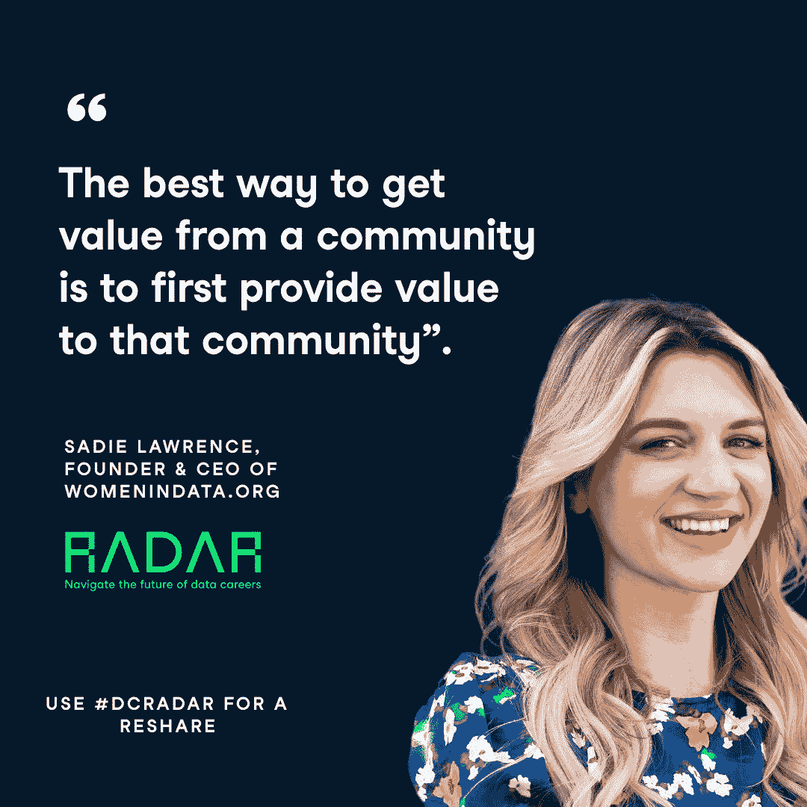
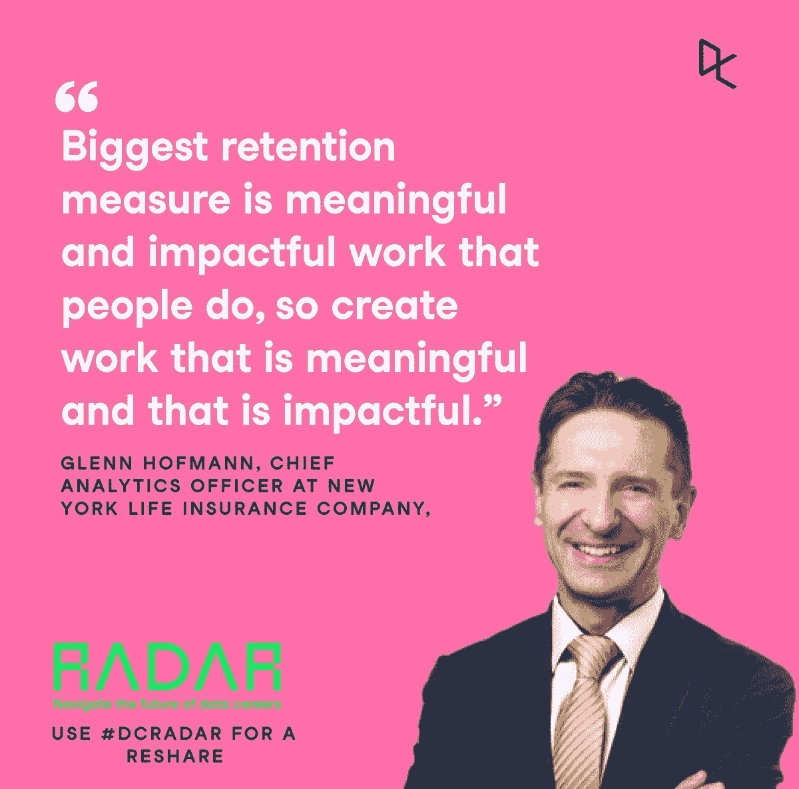

# 雷达回顾:数据职业洞察日

> 原文：<https://web.archive.org/web/20230101102924/https://www.datacamp.com/blog/radar-recap-a-day-of-data-career-insights>

## 概观

上周，在 6 月 23 日，Datacamp 举办了一次在线工作峰会。免费活动包括两场同时进行的讲座、网络研讨会和由数据行业巨头领导的小组讨论。Radar 的使命是帮助招聘人员和求职者驾驭数据职业的未来。

为什么是现在？随着数据科学和分析行业的持续[增长，出现了对角色以及寻求填补这些角色的人的需求。Datacamp 知道在不断发展的市场中招聘和被招聘有多难。为了庆祝](https://web.archive.org/web/20220908073428/https://www.datacamp.com/resources/whitepapers/data-trends-and-predictions-2022)[我们在美国、英国、欧盟和加拿大](https://web.archive.org/web/20220908073428/https://www.datacamp.com/data-jobs)的工作公告板的发布，Datacamp 希望为 Radar 与会者提供对行业的独家见解，让他们准备好使用该网站并找到自己理想的工作或团队。

## 统计数据

雷达是数据营的巨大成功。来自世界各地的 18000 多名专业人士注册了免费在线活动的席位。社交网站[的影响](https://web.archive.org/web/20220908073428/https://twitter.com/DataCamp)包括 300 万次展示、50 万次接触和 1 万次参与。

## 演讲者见解:求职者

对于侧重于求职的 stream 1，发言者包括“数据中的女性”的创始人兼首席执行官赛迪·圣劳伦斯和 Datacamp 的分析总监豪尔赫·巴斯克斯。这些讲座旨在帮助所有阶段的求职者开始或推进他们的职业生涯。在这些会议中，主题包括如何开始你的职业生涯，如何应对数据科学面试的技巧，以及如何钉上你的简历和如何获得你梦想的数据工作的问答。

Sadie Lawrence 分享了她的理念，即“从社区获得价值的最佳方式是首先为社区提供价值。”她还提供了一些重要的战略建议，比如使用“找到你的桥梁”维恩图来比较你目前的技能和你的目标工作技能。

## 演讲者见解:招聘人员

对于侧重于招聘的流程 2，会议主题旨在在整个招聘流程中为招聘人员提供支持。从如何雇佣和留住数据人才，如何解决你的雇主品牌问题，如何雇佣和建立

高影响力数据团队，构建和扩展远程团队。讨论这些问题的阵容包括企业分析和数据高级总监 Meenal Iyer 和 Lawrence Harvey 的 SVP Mariano Allegra。

纽约保险公司的首席分析官 Glenn Hofmann 解释说，“最大的保留措施是人们所做的有意义和有影响力的工作，所以创造有意义和有影响力的工作”。

## 访问录像

如果你没能在 Radar 活动中找到自己的位置，或者想重温一些鼓舞人心的演讲，请不要担心！您可以在此查看所有小组讨论的录音。点击“进入活动”并免费注册，即可访问活动日程中的所有重播视频。