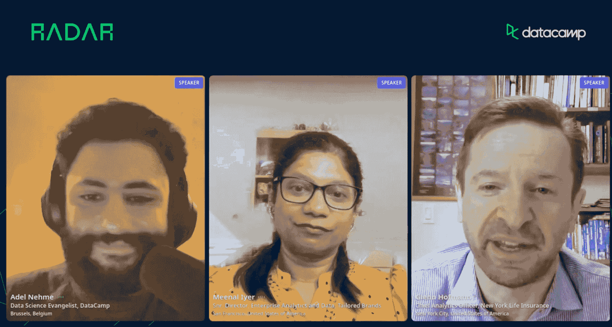

# 博客摘要—2022 年雇佣和留住数据人才

> 原文：<https://web.archive.org/web/20221129035725/https://www.datacamp.com/blog/recap-radar-hiring-retaining-talent-2022>

随着大辞职、不稳定的经济状况和弹性工作的兴起，雇佣和留住数据团队变得前所未有的具有挑战性和重要性。

作为 [DataCamp Radar Conference](https://web.archive.org/web/20221211112232/https://www.datacamp.com/resources/webinars/radar-hiring-and-building-high-impact-data-teams) 的一部分，我们与 Momentive.ai 的数据科学副总裁 Meenal Iyer 和纽约人寿保险公司的首席分析官 Glenn Hofmann 一起主持了一个关于在 2022 年雇佣&留住数据人才的小组讨论。该小组讨论了当今许多招聘经理最关心的热点问题。在这篇博文中，我们提供了本次会议的主要收获。

[点击此处观看完整会议](https://web.archive.org/web/20221211112232/https://www.datacamp.com/resources/webinars/radar-hiring-and-retaining-data-talent-in-2022)

## 引领 2022 年充满挑战的招聘格局

今年，组织在组建数据团队方面面临着严峻的形势。在疫情、大辞职和经济衰退的背景下，组织面临着在有限的数据专业人员供应的激烈竞争中建立数据团队的困难。

梅尔打趣道，如今的市场更青睐数据员工，而非雇主。受欢迎的数据专业人士在求职时可以有所选择。因此，希望建立数据团队的公司应该建立愉快而富有挑战性的员工体验，以吸引最优秀的人才。

通常，申请人会被市场薪酬、充足的福利、远程工作的灵活性以及健康的工作生活平衡所吸引。不仅如此，数据专业人员正在寻找与公司文化、工作范围以及他们为客户带来的价值的良好契合。因此，一个公司必须有良好的雇主品牌，以确保数据人才。

米纳尔还强调了留住现有员工的重要性。为此，公司应该平衡现有员工和新员工的薪酬。此外，他们还应该对现有员工进行再培训、技能提升和交叉培训，以保持他们的技能与时俱进。

面对严峻的市场形势，数据团队也应该公开招聘初级员工。Meenal 建议招聘经理根据他们的分析和思考能力而不是他们的经验来公平地考虑他们。Meenal 说，雇用初级员工的先决条件是有足够的现有数据从业者来指导新人通过陡峭的学习曲线。

## 与 FAANG 争夺数据人才

数据专业人士不断争夺 FAANG 公司中的角色，这已经不是什么秘密了。知道了这些，一个公司如何吸引数据人才？该小组提供了一些实用的技巧来留住那些在大型科技公司寻找职位的员工。

纽约人寿保险公司的格伦团队对 FAANG 的竞争并不担心。这是因为该团队拥有与 FAANG 公司相当的技术基础设施和工具。有了它，数据团队可以从事有助于他们职业发展的技术复杂的项目。

Glenn 提醒数据专业人员不要在不考虑个人-组织匹配的情况下盲目面试 FAANG。FAANG 的数据专业人员通常专注于一个特定的问题，这可能不符合一个人对理想工作的想法。例如，Meta 的数据科学家可能专注于广告优化，但没有机会探索其他领域。求职者在为 FAANG 公司面试时应该认识到这样一种权衡。

Meenal 将非 FAANG 公司的数据专业人员的经历比作“成为小池塘里的大鱼”。在非 FAANG 中，员工更有可能在跨职能团队中工作，以推动有影响力的项目。这反过来会加速员工的学习和职业发展。

## 2022 年雇佣和留住数据人才

结束前，专家组强调了 2022 年雇佣和留住数据人才的一些关键最佳实践。

除了提供市场水平的薪酬，Meenal 还强调了现有员工的再培训、技能提升和交叉培训对于留住员工的重要性。这种培训可以包括技术(例如编码)和非技术(例如通信)技能。这样的举措不仅填补了团队内部的技能缺口，还为员工提供了学习现有组合之外的技能的机会。

格伦发现有意义的工作机会是工作满意度的关键。这些机会可以是长期项目，也可以是临时工作。例如，应该允许认为指导初级员工有意义的员工这样做。当然，这样的机会必须与员工的兴趣相一致。因此，数据主管有责任与他们的团队进行真正的职业对话，并创造相关的机会。

此外，米纳尔和格伦都强调了积极的工作文化的重要性。工作文化应该鼓励主动学习和成长心态。此外，它应该是一个每个人的贡献都受到赞赏的地方。为了建立积极的工作文化，Glenn 建议数据团队打破远程工作的单调，定期举行面对面的团队合作会议。

## 观看完整的会议，了解更多信息

如果你有兴趣进一步了解如何在 2022 年留住和建立数据团队，请点击此处查看完整的会议。此外，如果你正在寻找建立自己的数据团队，请查看[数据营招聘](https://web.archive.org/web/20221211112232/https://www.datacamp.com/hire-data-professionals)。