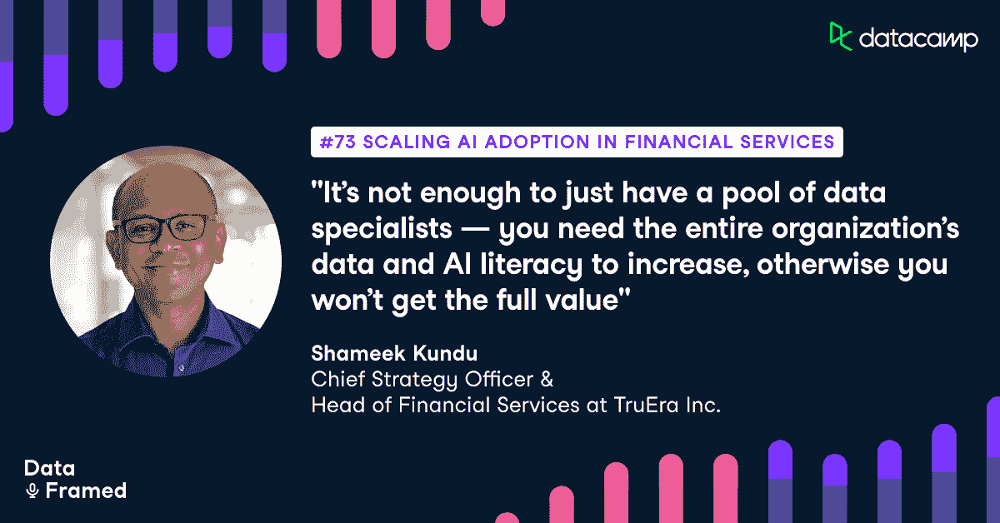

# 扩大人工智能在金融服务中的应用

> 原文：<https://web.archive.org/web/20221129051850/https://www.datacamp.com/blog/scaling-ai-adoption-in-financial-services>

[https://web.archive.org/web/20220518121511if_/https://embed.podcasts.apple.com/us/podcast/73-scaling-ai-adoption-in-financial-services-with/id1336150688?i=1000538909250](https://web.archive.org/web/20220518121511if_/https://embed.podcasts.apple.com/us/podcast/73-scaling-ai-adoption-in-financial-services-with/id1336150688?i=1000538909250)

DataCamp 播客 DataFramed 的主持人 Adel Nehme 最近采访了 TruEra Inc .的首席战略官兼金融服务负责人 Shameek Kundu。

## [介绍 Shameek Kundu](https://web.archive.org/web/20220518121511/https://www.datacamp.com/community/podcast/scaling-ai-adoption-in-financial-services)

Adel Nehme:你好。我是来自 Data Camp 的 Adel Nehme，欢迎来到 Data Framed，这是一个播客，内容涉及数据及其对全球组织的影响。可以说，数据最丰富的行业是金融服务，无论是银行、保险、投资银行还是其他行业。数据科学和机器学习有各种各样的用例。然而，这并不意味着机器学习正被充分利用，因为在前进的道路上有许多不同的障碍。

Adel Nehme:这就是为什么我对 TruEra 首席战略官兼金融服务主管、渣打银行前集团首席技术官 Shameek Kundu 感到如此兴奋。Shameek 在金融服务行业推动负责任地采用数据分析和人工智能方面花费了大部分时间。他是英格兰银行人工智能公私论坛和 OCD 人工智能全球伙伴关系的成员，也是新加坡货币管理局人工智能公平、道德、问责和透明指导委员会的成员。最近，Shameek 是渣打银行的集团首席数据官，他帮助该银行在多个领域探索和采用人工智能，并塑造了该银行负责任的人工智能的内部方法。

Adel Nehme:在这一集里，Shameek 讨论了他的背景、金融服务中数据转型的状态、当今机器学习操作化和金融服务的深度与广度、行业中可扩展人工智能采用的障碍、数据素养的重要性、人工智能的信任和责任挑战、数据科学和金融服务的未来等等。

Adel Nehme: Shameek，很高兴你能来参加我们的节目。我很高兴与您讨论数据科学和金融服务的现状、您在主要组织领导数据科学的经验以及您目前在 TruEra 的角色。在我们开始之前，你能简单介绍一下你的背景和你是如何进入数据领域的吗？

Shameek Kundu:首先，非常感谢您给我这个机会。能上你的播客真是太好了。对于你的问题，我是一名训练有素的工程师。随后，我攻读了金融和系统专业的 MBA 学位。信不信由你，20 年前在印度，我的第一份工作是帮助建立一家在线零售经纪公司。然后加入麦肯锡，花了八年时间为欧洲的金融服务客户提供技术和运营方面的咨询。然后在 2009 年，就在金融危机期间，加入了渣打银行，这是一家专注于亚洲、非洲和中东的国际银行。在今年加入 TruEra 之前，我在那里工作了 11 年，主要从事数据和技术方面的工作。

Adel Nehme:太好了。你在金融服务、数据科学和人工智能的交叉领域拥有丰富的经验。如您所言，在您之前在渣打银行的工作中，您曾担任多个首席信息官职位，并担任集团首席技术官约六年。鉴于您丰富的经验，我希望您能描述一下您如何看待当今金融领域的数据转型，以及作为行业中的数据领导者，您的经历是如何演变的？

Shameek Kundu:金融服务一直是一个数据驱动的行业，对吗？你所做的一切...从某些方面来说，金融服务业没有什么是真实的。都是数据从一个地方到另一个地方的移动。你的银行余额是一个数据。空头或实物现金，以及为数不多的支票和需求下降，金融服务中的一切都是数据。因此，这一直是一项关于处理、存储、保护和移动数据的业务。

沙梅克·昆杜:在过去的六年里，有两件事情发生了变化。首先，我看到围绕数据的问题已经从纯粹的防御性转变为具有强大攻击性或面向业务的问题。这是防御性的，意味着我需要处理这些数据来运营我的业务，例如，我需要知道客户的余额。我需要保护他们的信息。我需要安全地发送数据。所有这些都是我需要做的，因为我必须这样做，这是我业务的核心。从那个到更具攻击性的，实际上是利用所有这些信息。我能够为我的客户、我的企业、我的合作伙伴等等做更多的事情。这是一个纯粹的防守转变，让我们称之为防守和进攻。

Shameek Kundu:在我们继续之前，我想强调一下进攻和防御的投标。并不是说防御部分没有了。事实上，可以说它变得越来越复杂，因为监管机构和公民已经开始超越大多数人早先担心的数据质量和数据保留，到隐私、数据道德，他们必须让透明度、公平性以及所有关于大型技术的更大关注点等等。所有这些都让防御角度变得更加有趣，我怀疑对 CDO 来说，但这也是对进攻方面的一个强大增强。这是我看到的一个巨大转变。

Shameek Kundu:第二件事是谁谈论数据。当我开始担任首席数据官时，至少我所在银行的每个人都乐于让我独自处理数据。我离开的时候，从集团首席执行官到下面的每个人...实际上，我撒谎了。从集团董事长开始，理解并希望参与数据之旅，对吗？因此，银行或金融机构中关心数据、认为自己的工作主要与数据有关的人的范围大大扩大，远远超过了职位中包含数据的人。

沙梅克·昆杜:当然，这是我看到的两个重大转变。当然，另外还有一系列有利的变化，从数据分析的进步，到邻近技术领域的机器学习相关技术，如 API，使数据交换变得更加容易。组织中与数据相关的人才在不断拓宽和深化。监管机构更加了解与数据和分析相关的挑战和机遇。所有这一切都发生了，但最终这些使这两个转变成为可能，从单纯的防御到防御和进攻，从一个独立的专业极客到从首席执行官到每个人都理解并希望参与的东西。

## 金融中的数据科学、分析和机器学习

Adel Nehme:我发现从防守到防守和进攻的转变非常令人着迷。您提到，在过去几年中，令人不快的部分是通过数据科学、分析和机器学习来实现价值。您能描述一下今天金融服务中的这些价值领域在哪里吗？

沙梅克·昆杜:当然。我的意思是，也许我们可以从它对金融服务业务模型的影响开始，而不是仅仅从用例的角度来说。因此，我认为这是第一个类别，在这个类别中，你会看到许多数据和分析的早期用例，特别是机器学习，是为了提高金融服务公司内部风险管理的有效性。现在你可能会说，嗯，这听起来很无聊，但实际上正如你所知，银行和保险公司或银行和保险从根本上讲是关于管理风险的，对吗？以各种形式。因此，能够更有效地做到这一点，无论是通过更好的反洗钱解决方案，还是评估和监控信用风险的新方法，或者是检测保险索赔欺诈的新方法，甚至是检测网络威胁，这显然是最重要的，坦率地说，是高级分析产生影响的最早领域之一，对吗？

沙梅克·昆杜:这是第一个。这就是风险管理的有效性。第二，可以说一点也不新鲜的是增量收入的增加。所以，你可能会说，这并不新鲜，因为银行业的第一个分析用例是围绕客户维系和交叉销售的。但今天，这些技术在分析和数据备份方面取得了巨大进步，对吗？如果你愿意的话，这是第二个用例块。第三，当然是中后台流程的效率提升。这不是很吸引人，但实际上，当您自动化顽固的手动过程时，可以节省相当多的美元，例如在贸易融资和保险游戏评估中。

Shameek Kundu:第四个与上述密切相关，但并不总是可见的，但很多时候，当你和我，作为客户，我们考虑端到端的数字体验时，无论是我们作为客户加入或完成交易或获得关于我的付款在哪里的信息所需的时间和精力，所有这些实际上都是由大量数据和分析支撑的，特别是良好的数据和数据交换，如果不是高级分析的话。因此，数据和分析在塑造你的应用或新网站的客户体验方面发挥着重要作用，对吗？

Shameek Kundu:最后，也是最重要的一点，数据和分析正在推动商业模式的变革。因此，这不是降低现有业务的风险、提高效率或增加收入，也不是改善客户体验，而是建立全新的业务。我这么说是什么意思呢？这是一个关于提高金融包容性的圣杯，不仅仅是在非洲、亚洲和拉丁美洲，在那里不是每个人都有银行账户，甚至在金融服务不均衡的所谓更发达的经济体中也是如此。通过能够有效地使用数据和分析，你将能够扩大这种访问，从而为自己创造一个全新的业务。

Shameek Kundu:这是一个巨大的机会领域。有机会围绕建立全新的业务，如与电子商务平台捆绑在一起的银行，成为支撑它们的银行。他们称之为“平台即服务”战略，在这种战略中，你是许多商业活动下的银行[听不清]。整个商业模式都基于此。但如果你不是银行或保险公司，如果你是保险科技公司或金融科技公司，要么试图从银行或保险公司窃取一些业务，要么试图支持银行或保险公司，你可以用截然不同的方式做事情。例如，你可以...例如，在保险业，基于 IOT 数据和分析的全新核保方式是不可能的。因此，这几乎就像一个连续体，从更有效的风险管理到增量收入，到效率提高，到更好的客户体验，最后是大规模的变化，商业模式的转型变化。这是一个完整的范围，当然，不同地区的采用水平是不同的。

Adel Nehme:那么您如何描述这些用例的采用情况？似乎有大量的用例正在运行，这在扫描价值方面是非常令人兴奋的。你认为这个行业现在处于什么位置？

Shameek Kundu:所以我认为区分我所说的数据和分析是很重要的，数据和分析包括一些预测模型，但不包括机器学习，另一方面是机器学习。如果你只是指传统的数据和分析，即数据的广泛使用，描述性分析，可视化分析，预测性分析，而不是使用机器学习，我会说这五个类别中的四个非常先进。唯一没有那么先进的是建立转型的新商业模式。但是，无论是更好的风险管理，还是提高效率，还是改变客户体验，所有这些事情都在大规模进行。我说的是银行和保险公司今天获得的数千万美元的增值，而不是明天，是今天，对吗？在过去的四到五年里，这种情况发生了显著的变化。

Shameek Kundu:但是当涉及到机器学习时，情况就不一样了。我会称之为广泛而浅薄的故事，对吗？我引用了三个不同的来源。一项是英格兰银行 2020 年和 2019 年的调查，调查了英国银行和保险公司的采用水平。另一个是新加坡主权财富基金淡马锡(Temasek)的一项研究，该研究最近公布了人工智能在金融服务中的应用。第三个是我自己根据今年上半年的 35 次采访得出的相当不科学的评估，对吗？这三件事都暗示了两件事。第一，50%到 65%之间，甚至一半到三分之二的传统金融机构已经开始以一种重要的方式使用机器学习，这意味着不仅仅是试点或概念验证。他们实际上正在使用它。这是有价值的。

Shameek Kundu:但是他们中的 10%到 20%之间，所以只有十分之一或十分之二，这取决于你选择的来源，实际上在一定程度上启用了人工智能，这对底线产生了真正的影响。所以不仅仅是试点和概念证明。人们正在采用人工智能。但如果你问一家银行或保险公司甚至大多数金融科技公司的首席执行官，一个失败的 ML 模型会不会成为你的一大担忧，在绝大多数情况下，它还没有到达那里。对吗？故事就是这样。很宽但是很浅。我想说的唯一例外是在营销和欺诈分析等领域，当然机器学习的采用已经有一段时间了。但一般来说，传统数据和分析的采用率相当高，在许多组织中相当有影响力。机器学习被广泛采用，但除了十分之一或十分之二的组织之外，在所有组织中仍然主要是肤浅的。

Adel Nehme:你认为在行业中深度采用机器学习和人工智能的主要障碍是什么？

Shameek Kundu:正如你所说，有很多这样的障碍。你们所处的行业存在技术障碍、组织障碍和人才障碍。有与数据本身相关的价值，还有监管障碍或可以被解释为障碍的东西。最后，当然，信任是有障碍的。因此，让我稍微深入一下它们。我的意思是，技术壁垒，银行和保险公司已经建立了他们的系统几十年，有时在我的前雇主的情况下，超过一个世纪，他们将有众所周知的筒仓，对不对？我的意思是，这可能听起来像是老生常谈，但这确实是一个非常大的挑战，要以一种既能让对那个人进行分析变得有意义的方式收集关于特定客户的所有数据，所以我真的理解作为客户的 Shameek Kundu，因为我涵盖了从他们的财富管理持股到他们与我们的最后互动和投诉，再到他们的外部数据。我将所有这些都集中在一个地方，并且实时地做了足够多的工作，能够影响一线业务流程。

我的意思是，你可以选择其中之一。你可以使用一些有限的数据与客户进行实时互动，或者你可以描绘一幅非常漂亮的客户画像，但这不可能实时进行。我的意思是，人们会告诉你把所有的东西都放在一起是可能的，但我还没有看到这一点，对不对？所以这是一个非常大的技术障碍。顺便说一下，这不仅仅是传统银行的问题。一个常见的错误是说，这就是为什么 fintechs 或 neobanks 会赢。嗯，除非他们在一个区域玩。当一家金融科技公司或新银行试图建立自己的形象时，你别无选择。你需要越来越深入专业领域。当然，它不会像传统银行或保险公司那样糟糕。但是，要说我已经为我与客户关系的不同部分建立了系统，这是一个挑战。我需要把这些联系起来。它是相当大的一个。这可能是你能看到的最大的障碍。

Shameek Kundu:存在组织障碍，部分原因是缺乏信任，我们稍后会谈到这一点[听不清]，但更广泛的原因是缺乏对其他人如何对待我的数据的信任。组织内部存在一定程度的孤岛，不同的团队可能会担心更广泛地共享他们的数据，担心这些数据可能不会得到妥善处理，甚至不知道我为 XYZ 收集的这些数据是否可以使用。坦率地说，如果你来自一个以技术为先的组织，这些障碍正好相反。我是说，他们从假设每个人都可以访问所有东西开始。

Shameek Kundu:那么你就遇到了与人才相关的障碍，我想这是你们都很清楚的一个领域。我想说的唯一一点是，这可能是有用的，我们可以对此进行更多的讨论，既讨论与核心数据相关的技能，也讨论如何提高组织其余部分的数据谨慎性。仅有一群数据专家或分析专家是不够的。你需要整个组织的天赋、AI 或者数据商提升，否则你无法获得全部价值。我提到数据本身存在障碍。我的意思是，事实是我们有时高估了金融机构拥有的数据量或他们能够使用的数据量。这意味着在一些领域，可能没有足够的数据来建立有效的机器学习模型。

Shameek Kundu:洗钱就是一个例子，对吗？这是最佳领域之一，反洗钱是您希望使用预测分析来显著提高识别洗钱活动能力的最佳领域之一。但问题来了。当一家银行，在经历了很多痛苦和错误警报之后，我说的是 99%的错误警报。当一家银行将这 1%的资金用于它认为存在真实洗钱情况的地方，并向执法机构报告时，他们实际上通常不会得到肯定的确认，因为这几年内都不会为人所知。因此，这意味着任何有监督的机器学习中最重要的因素之一，即基础真理，正在丢失。你没有强调洗钱的正面事例。那你打算怎么训练？当然，你可以进行无人监督的学习，但你所产生的只是不寻常的行为。所以这真的很难...这只是一个例子。

Shameek Kundu:但是在很多这样的领域，很难说我有积极的行为可以利用。我的意思是，看看银行业之外，例如，围绕银行和保险的一个领域，这个领域变得非常明显...我的意思是，看看机器学习在应对疫情病毒的大多数领域表现得有多差，无论是预测谁会被它袭击，还是预测哪种药物可能会起作用，或者预测疫苗如何起作用...我的意思是，我认为一些模型得到了正确的数字，有多少人会有它。但是在帮助当局使用何种药物或谁更有可能制造这种药物方面，做得并不好。我的意思是，在麻省理工学院科技评论上有一篇很好的评论，对吗？

沙梅克·昆杜:这些都是非常严重的问题。当然，还有监管方面的问题。围绕数据主权、对大技术和大数据力量的担忧、对算法不公平行为的担忧，这些问题一直在增加。这些也在产生影响。最后，还有信任。我的意思是，这尤其是关于算法的可信度。在一个专业化程度很高的行业中，有一些主题专家...你可以和精算师或者原始数据科学家争论。例如，他们已经在保险业工作了很长时间。你不会突然进来说，“让开。我的算法会比你做得更好，因为它是根据历史数据训练出来的。”首先，这可能不是真的。事实上，像 COVID 这样的经历表明。过去的行为并不总是未来的良好指标，这是一个合理的担忧。

Shameek Kundu:但是第二，即使它是正确的，你正在进入一个对绝大多数银行和保险公司来说都有现成的工作方式的行业。你不能突然停止一切，至少如果你是一家传统的银行和保险公司。你确实需要作为一个数据科学团队，或者作为一个想要使用数据科学的人来完成这项工作。你必须做好工作来带动组织的其他部分。当然，你必须带上你的客户、你的监管者等等。我认为这是在受监管的金融服务中采用机器学习的主要障碍。

## 人才转型

Adel Nehme:我很高兴能和你一起解开信任和解释。但在此之前，你提到了人才转化，这是 DataCamp 关注的问题。你对金融服务中所需的人才转型挑战有什么看法，以便从数据科学、机器学习和人工智能中获得可扩展的价值？你提到了很多技术技能和数据科学以及机器学习。但除此之外，你如何想象一个数据文化组织和行业的样子？

沙梅克·昆杜:是的。我的意思是，老实说，你们可能是专家，但我一直在思考这个问题，我认为这是一个我会着迷于你们如何继续在这个领域做出贡献的领域。但正如你所说，有这两块工作。在第一块，我想，当然，有数据科学家、数据工程师，但在我看来，其他一些领域有些被忽视了，比如人们带给我的数据风险管理。我们称之为数据治理。但这是一个非常大的术语。我认为你需要数据管理员。我的意思是，如果你进入...我认为最初的谷歌作品是这样的。我怀疑他们雇佣了许多真正做信息管理的人，对吗？也就是如何恰当地组织数据，等等。所以我认为，除了建立预测模型的人和管理数据管道的人之外，甚至在数据领域也有更多的专业化。

Shameek Kundu:还有很多，无论是数据风险管理、数据治理还是数据可视化。我认为有些人能做到数据可视化，有些人不能。顺便说一下，我坚定地属于第二类。如果你不能，你就不能以一种有效的方式讲述这个故事。所以这里的重点是数量，我认为我们没有足够的这些技能，以及质量。但同样重要的是，要确保这些专家在加入时了解更广泛的行业背景。举一个非金融服务的例子，回到《麻省理工科技评论》中的 COVID 报告，其中一个例子是某家医院的 COVID 病例非常多，可能是因为它的[听不清]区域。这个模型从这些数据中学到了什么？其打印报告使用特定英语字体或罗马字体的医院最有可能具有高水平的 COVID。

Shameek Kundu:现在，基础学科专家会说，当然，这是个问题。但是，如果您不将数据科学专业知识与您正在谈论的领域的一些非常基本的理解相结合，那么它就不起作用。因此，我认为，即使对于在这一领域工作的专家来说，一个领域实际上是提高金融服务的商数。因此，正如我会谈到其他金融服务组织如何提高他们的数据商数一样，我认为数据专家需要提高他们的金融服务商数或他们所在的任何行业的商数。因此，我认为这是对数据科学家非常有帮助的一项工作，特别是那些来自行业外的科学家。

Shameek Kundu:但是第二个问题，正如我们都讨论过的，就是如何将组织的其他部分[听不清]带给设施人员？而且我真的很喜欢房地产例子的设施，因为你不会认为那个人是最数据驱动的。但实际上，在 COVID 加入之前，银行或保险公司的许多设施都进行了优化，对吗？哪些房间消耗了多少能源？这是非常数据驱动的。我对此印象深刻，因为这是我的首席信息官职能的一部分。令我印象深刻的是，至少在渣打银行，房地产公司的人在这方面是最先进的。这是一个很好的例子，因为当你想到懂数据的人时，你不会首先想到房地产人。但是你猜怎么着？他们是极端的，因为他们的整个价值主张围绕如何使业务，我们的足迹更环保，如何以可持续的方式减少空间。

Shameek Kundu:所有这些从根本上依赖于数据。我只是举个例子。从公共关系到人力资源，当然还有核心的银行和保险角色，甚至监管互动，每一个角色都需要更加精通数据。你需要有人能够理解数据和算法带来的机遇和风险。你需要知道如何在你的工作中最好地利用它，而不是在别人的工作中。当内部或外部销售人员向你许诺时，你需要能够提出正确的问题。对吗？听着，这很难，但我感觉这是一个更大的挑战。如果我选择像渣打银行这样的组织，我想，我不知道，数据专家可能只有几千名员工，对吗？任何组织，任何这样规模的银行，对吗？让我们从 100，000 人中，最多可能有 5，000 人是数据专家，对吗？

Shameek Kundu:但如果你有 10 万人，那就是另外 9.5 万人，他们需要掌握数据知识。所以可以说这是一个更大的挑战。老实说，我不知道是否有一个行之有效的模板。我认为这是一些基础教育与实际操作能力的结合，能够让数据与他们相关。我认为，我们这些数据人员经常陷入这样一种态度，即不要担心，让专家来处理。错误的态度，对吗？是的，专家会处理它，但我们也需要让组织的其他部分参与进来，这样最终即使它不是最好的，100%最好的处理问题的方法，也许它是 90%最好的方法，但它有更大的成功机会，因为我们有更多这样的方法。

## 信任人工智能

Adel Nehme:就你的观点而言，数据素养是增加数据团队正在开发的数据产品采用率的少数方法之一，因为最终数据团队会为职能业务专家创建数据产品。需要有一种通用的数据语言来支持它们之间的对话。我认为信任元素和数据素养元素之间也有一种有趣的联系，这需要理解并与构建这些数据系统的专家进行智能对话的能力。因此，我很乐意深入探讨您目前在 TruEra 的角色，以及在金融服务领域信任人工智能的重要性。你提到信任是人工智能应用和金融服务的主要障碍。您能否向我们介绍一下，为什么对金融服务机构来说，建立对人工智能的信任是一项如此困难的任务。

沙梅克·昆杜:当然。我想也许我会...我想借用你的话来说，实际上，建立信任并不是金融服务公司的一项艰巨任务。事实是，他们需要维护大量的现有信任级别，对吗？失去这种信任对他们来说既容易又是灾难性的。我是说，你可以看到上次金融危机来袭时有多困难。如果人们对金融服务失去信任，那就完了，对吗？我的意思是，除了你的医生，你的银行或保险公司可能比几乎所有人都更了解你。对吗？举例来说，我们过去曾有过这样的例子，人们抱怨为什么他们的信用卡账单会寄到他们的家庭住址，因为不幸的是，其中包含了妻子或配偶应该知道的与另一个伴侣的某些费用。

沙梅克·昆杜:所以有时候你的银行或保险公司可能比几乎任何人都了解你，除了你的医生。如果你不能相信你的金融服务提供商会为你做正确的事情，公平地对待你的客户，保护你的数据不被滥用，那你和他们的关系会怎样？对吗？所以这并不是说建立信任是一种新的行为。这实际上是有大量的信任需要捍卫。如果你不工作，它会很快很快落到你头上。特别是对于大型组织，成本...与更敏捷、更新的表单相比，这几乎是他们的一个优势。那就是，尽管它是一家声誉卓著的银行或保险公司，但如果我失去了这种信任，它就只是...特别是如果你用它来做一些高风险的事情，比如决定我的健康保险费，或者决定我是否能得到贷款，或者被建议我是否应该进行这项重大投资。在那些领域，如果我不能信任它，它就会变得极其复杂。

沙梅克·昆杜:所以这是两个层次。第一，作为一个组织，我希望我的客户和我的监管者信任我。但实际上，至少在传统银行和保险公司内部存在这种信任文化的 DNA，这意味着即使在组织内部，也有多层人员对此着迷，有时可能过于痴迷，但你必须让所有人相信，是的，这是可以信任的。这就是为什么这是一个如此大的挑战。

Adel Nehme:随着监管环境和金融服务的不断发展，创造负责任和值得信赖的人工智能的任务变得更加艰巨。你介意向我们介绍一下监管机构如何应对人工智能在金融服务中的出现，以及需要解决的主要问题是什么？

Shameek Kundu:这个问题有趣的地方在于它进化了多少。上周末，我在 LinkedIn 上发了两条关于这个话题的新帖子，坦率地说，这是因为上周发生了两件监管方面的事情，一件在欧洲，一件在中国。但是，我认为这是一个快速发展的领域。现在，与更广泛的技术数据或竞争监管机构相比，金融监管机构实际上相当合理。他们已经认识到所有相关的风险，以及继续鼓励这一领域创新的必要性。事实上，在这个问题上，我们 TruEra 一直与英国、新加坡和许多其他国家的监管机构密切合作。一些监管者从早期指导开始，思想指导，而不是监管，监管指导反对监管，对吗？意味着它更具强制性。新加坡的监管机构，2018 年 11 月，香港，一年后，荷兰，加拿大，英格兰银行。英格兰银行还没有公布，但我提到的其他银行都公布了在金融服务中使用人工智能的具体指导方针。

Shameek Kundu:英格兰银行和英国金融行为监管局成立了一个咨询论坛，我们是其中的一员。美国银行业监管机构就人工智能风险的一系列广泛问题征求了大量主要行业的意见。那是在三月份。然后，当然，在周末或者就在周末之前，证券交易委员会问了一个具体的问题，关于在线零售经纪公司和这种投资，在线零售投资，使用算法来鼓励某些行为。这是另一个令人感兴趣的领域。

Shameek Kundu:到目前为止，主要关注的是指导和概念，而不是新的有约束力的法规。但我确实认为，在未来 6 至 18 个月内，根据地理位置，我们可能会看到监管机构对行业参与者的期望变得更加明确。现在这不一定是一件坏事，因为坦率地说，留下许多指导方针和许多事情来讨论在某种程度上是不确定的。获得监管不确定性不一定是件坏事，对吗？至于他们关心什么，现在已经很清楚了。内部的可解释性、公平性和可解释性，这意味着组织是否希望了解正在发生的事情，以及面向客户或面向外部的透明度。所以这显然是一个很大的区域。公平性，因此防止不公正的偏见或不公平的结果，模型的稳定性。因此，确保模型不会在第一次数据发生巨大变化时崩溃。当然还有过度拟合，这是机器学习模型的一个特殊问题。

Shameek Kundu:这些显然是重点关注的领域。还有一些更广泛的方面，这是我们要花一点时间去做的。实际上，金融监管者通常不仅仅担心模型和数据是否得到了良好的管理。他们担心，回到关于其他组织的那一点，AI 商数在提高。他们担心组织中的其他人是否已经完全理解了风险并在实际业务中反映出来。例如，最近关于在线零售投资中数字参与的使用，问题不是使用人工智能鼓励某人购买产品是否非法。不是的。只要产品本身不违法，你可以用任何一种算法来鼓励他们。潜在的坏消息是，鉴于某人的风险状况，向他出售不适合他的股票或债券。

沙梅克·昆杜:如果你是人类顾问，你应该知道这一点。这是你的第一天。你知道，如果 Shameek 是一个中等风险的人，你不会在一个复杂结构的对冲产品上卖给他。但是算法，你不说算法，算法也不知道。所以管理一个模型和机器学习模型在公平性，可解释性等方面是有区别的。这实际上是比较好理解的。更复杂的是，你如何确保银行或保险公司或任何金融科技公司正在做的每一件事，都在考虑在该领域使用人工智能的间接影响。这是一个更复杂的问题。我认为，随着时间的推移，这将会进一步发展。

Adel Nehme:你如何看待它的发展？比如，你能为一家银行提出什么样的章程，以正确评估其风险。

Shameek Kundu:这是一个非常好的观点，因为实际上许多银行都在努力解决这个问题，银行和保险公司都在努力解决这个问题。但我认为最简单的思考方式是，你实际上不需要大量的数据或人工智能专家。你需要一些数据专家，但大多数银行和保险公司都有。坦率地说，至少我个人的经验是，如果你花很多精力教育其他风险人员，无论是信用风险、市场风险、合规风险还是声誉风险人员，如果你让他们意识到机器学习模型如何工作，可能存在哪些风险等等，实际上，他们会更好地理解这可能意味着什么。

沙梅克·昆杜:我第一次和管理金融市场风险的人交谈时，这个人立刻明白了我的意思，说道:“哦，好吧，等等。这项在线竞争政策可能会产生影响。”我说，“那是什么意思？这怎么可能？”因此，想象一下，如果我的模型和另一家银行的另一个模型参与操纵[听不清]价格，这可能是一个问题。这就像，作为一个数据和人工智能的人，我没有想过这个问题，但他立即想到了这个问题，因为他在考虑内在的风险。所以我想说这可能是一种方法。不要试图让一个中心团队去尝试和预测将要发生的一切。在更广泛的社区中传播人工智能带来的机遇和风险的知识，这些社区有能力处理这些风险，然后让他们消化这些知识，并弄清楚人工智能将如何影响他们。我认为这是一个更好、更联合的方法，而不是试图说银行或保险公司中的一个人或一个团队会以某种方式成为银行中所有人工智能风险的主宰。

## 模型可解释性和可解释性

Adel Nehme:这也是数据素养发挥作用的地方。因为如果商业专家不理解机器学习的局限性或数据系统通常是如何运行的，他们就无法做出这些评估。所以 TruEra 专门研究模型的可解释性和可解释性。你能给我们一个关于模型可解释性和可解释性的概述吗，尤其是考虑到它在机器学习研究中的重要性？

沙梅克·昆杜:是的。谈到它最初的方面，我加入 TruEra 的原因之一，我的意思是，最初我成为客户，然后加入他们，是因为我听说创始人 Anupam 教授在 2012 年开始研究这个。我不知道你怎么样。早在 2012 年，我就没有听说过模型可解释的可解释性。所以我想这家伙已经研究了这么久，他一定知道他在做什么。不管怎样，对于你的问题，它在哪里？我认为，首先，值得思考一些人所谓的内在可解释模型和后因素模型之间的区别，后因素模型是那些你只能在进入后才能解释的模型。有一个学派认为，也许在某些非常高风险的领域，你应该只使用内在可解释的模型。

Shameek Kundu:然而，我个人对他们有两个担心。一个是有几个领域，包括图像和文本相关的部分，其中非结构化数据的内在可解释模型还没有在性能上达到那种程度。它可能会随着时间而改变。但我认为更大的问题是，它有时可能会产生一种虚假的舒适感，因为你可能会得到一个解释得很好但极其复杂的内在可解释模型。但是如果你没有把它综合到对人类有实际意义的水平，它实际上给了你一种虚假的舒适感。因此，我认为内在可解释的模型扮演着一个角色，还有一个角色就是所谓的后演讲可解释性。

Shameek Kundu:我认为在相当准确的水平上已经有了很大的进步。因此，在这个层面上说，这个解释将是 X %准确，Y %的时间，这肯定是现在对大多数类型的机器学习模型来说是可能的，特别是在我们所处的阶段，不仅仅是 TruEra 自己的技术 QII，而是整个基于博弈论的解释方法。它们相当强大，对吧？它们被认为是有效的，特别是如果你...科学并不能解释...抱歉，这种科学的实现更加复杂。你如何实现这些解释技术，这可能是资源密集型的，等等，比科学本身更复杂。科学现在已经相当成熟了。

Shameek Kundu:现在在深度神经网络方面仍然需要一些工作。我们 TruEra 实际上已经认识到了这一点，我们创建了一个名为 TruLens 的开源项目，有点像 trulens.org。它根本不是 TruEra 产品的一部分。它需要今天开源中的东西加上我们自己的。我们刚刚开始。在过去的 10 天里，它得到了一些精彩的评论。确切地说，人们认识到在深度神经网络中还有更多工作要做。所以我们在商业产品上开放它。

Shameek Kundu:但我认为，我们最需要关注的领域，因为我们代表新加坡的 MAS 牵头的财团对此进行了一些审查，实际上是向最终用户提供的解释形式。因此，无论是你还是我这样的客户，或者是银行或保险公司中大多数不精通数据科学的人，仅仅给他们简单的解释是没有用的，对吗？你必须找到一种让他们产生共鸣的方式。当我们看到这方面的研究时，因为没有更好的词，我们称之为人机界面，当然还有更多工作要做，对吗？无论是如何向最终客户解释一个决定会有所不同，还是像这样简单的事情，哦，有一个人在决策的循环中，所以我们不应该担心它，因为每个人工智能决策，一个人都在审查它，并决定是否接受它。

Shameek Kundu:那么，有人研究过对算法的建议不断表示“是，是，是，是”的人的心理影响吗？然后，它应该说不的时候，它可能会忽略它，因为他已经看到了算法正确的最后 99 个案例。人类第一百次错了，而他们本应该介入。这不是一个理论观点。如你所知，特斯拉自动驾驶汽车的一些问题正是如此。人类已经假设...所以这个领域，与其说是潜在可解释性的直接标志，不如说是解释和人机界面工作的形式。我会说，这需要比基础科学更多的工作，除了在深度神经网络方面，我认为还有更多工作要做。

Adel Nehme:这是一个很好的概述，尤其是当你提到可解释性的包装时。你是否发现，在金融服务领域，有一些人工智能或机器学习用例的可信度和可解释性比其他用例更重要？如果是，组织需要根据这些不同的风险级别，从信任或风险角度应用哪些不同的措施？

Shameek Kundu:我认为你的第一个问题比第二个问题更容易回答，因为目前的监管和监管举措的一个问题是，人们还没有为我将使用 X 代表 Y 类别创建标准。随着时间的推移，这是我认为金融机构需要做更多工作的领域之一。但是关于你的第一个问题，是的，有非常明显的领域。就可信度和可解释性而言，并不是每个领域都有同样的风险，对吗？所以最受关注的是那些导致某人被拒绝任何服务的事件，特别是在这种情况下，当然是金融服务，对吗？那么这可能是什么呢？嗯，你没有得到一揽子保险或得到一个不可接受的高利率，因为人工智能表现不好或因为一些关于人工智能的问题，或者类似地没有得到贷款或甚至没有被接受为客户，因为你的 KYC 风险似乎太高。

Shameek Kundu:所以在任何地方，你被拒绝获得金融服务的比例可能是最高的，对吗？下一个最高的是你有比其他群体更差的经历或更差的结果的空间。那是歧视。但第一条不是歧视。这是绝对缺乏接触。因此，即使是算法也可以被用来，例如，拒绝某人来 ATM 机从自己的账户上取钱的权利，即面部识别。那么你最好有很好的保护措施，当人们有选择的时候，对吗？因为否则他们就无法进入，更不用说歧视了。我只是无法进入。

Shameek Kundu:所以我认为最大的风险是拒绝有效访问的风险。接下来是歧视的风险，政党之间的不公平歧视。我认为另一个非常重要的问题是，你必须向监管者证明你做了正确的事情。现在，当你必须证明时，最著名的是在金融犯罪和反洗钱制裁相关的事情上，以及比如说，内幕交易行为，等等，这与客户无关，但你必须证明，你有责任证明你在检测、捕捉和调查方面做了正确的事情。在这种情况下，如果你不能向监管机构证明，不是向员工或客户，而是向监管机构或你的内部风险管理团队证明，那也会变得很困难。所以，我想说，这些是你必须关心的非常容易的事情，因为你正在影响客户，或者它正在影响你的直接监管义务。

Shameek Kundu:现在，棘手的是那些不属于这些区域的，对吗？所以我真的对中国监管机构很感兴趣，不是金融服务监管机构，但他们在周末或周五提出了一系列关于他们所谓的算法推荐系统的规定。它并不局限于金融服务业。但是通常我们不会想到...抱歉，美国证券交易委员会对罗宾汉风格的在线投资工具进行了调查。这两个案例，在我脑海中产生了一个重要的想法，通常我会把营销用例看作，嗯，它会有什么危害呢？最坏的情况，它会卖东西给你，你不想买。好吧，走开。对吗？挺好的。问题不大。但实际上，你当然可以错过销售。你可能会不恰当地将某个金融产品的目标锁定在某个人身上，而这个人一开始就不应该被出售该产品。

沙梅克·昆杜:想象一下，把一笔非常高的利息贷款卖给一个机器已经解决了急需用钱的人。这公平吗？这合乎道德吗？这与拒绝服务或歧视无关，但向那个人提供贷款是错误的。你可能想给他们提供一些其他种类的帮助，但不是高息贷款来解决这个问题。

Adel Nehme:这是掠夺性的。是啊。

沙梅克·昆杜:这是掠夺性的。没错。这些就是我在开始提到的，拒绝服务，歧视，明确的监管。我认为在其他地方，我是在提供服务，但实际上，提供服务和提供不适当或掠夺性的东西之间的界限在哪里？这是一个更棘手的问题。但我认为大多数银行正在解决这个问题。因此，大多数银行和保险公司正在做的第一件事就是提出一个包含一系列条件的本质上不同的框架。现在，对于你问题的第二部分，我们是否已经到了这样一个阶段，人们已经说，对于这个层次，我们需要这种可解释性，对于这个层次，我们...我还没看过。我认为这是正在进行的工作的一部分。

## 关于 TruEra 公司。

Adel Nehme:我认为对于许多这样的用例来说，让一个人参与进来对于决策也是非常重要的。这也是包装信息的关键。这是讨论特鲁拉的一个很好的话题，他把可解释性和可解释性包装得非常好。你介意分享一下 TruEra 是如何解决你正在讨论的这些基本问题的吗？

沙梅克·昆杜:是的，当然。再次感谢给我这个机会。所以两件事，首先我们只做两件事。我们提供这样的软件，第一，它允许刚建立模型的人评估机器学习模型的质量。现在，当我说质量时，传统上，如你所知，数据科学家和他们的业务利益相关者通常会认为质量是相对于测试数据的准确性。但我们在讨论这个问题的同时，也在讨论其他一系列问题，比如不公正偏见的可能性，比如过度拟合不稳定性，以及与其他模型的比较。因此，这不仅仅是关于它对训练和测试人群的准确性，还包括机器学习模型在仅仅基于偏差的过度拟合不稳定性方面的已知弱点，等等。我们检查过了吗？这就像是质量诊断工具。

Shameek Kundu:现在，它的主要目的，实际上，在金融服务中，就是不做错事。但是实际上当你使用它的时候，它也帮助你做正确的事情，如果你明白我的意思的话。我的意思是，没有人出去说，我想建立一个过度拟合的模型，或者我想建立一个不稳定的模型。所以实际上，即使你为了防御的目的而提高质量，实际上，你只是为了提高质量而提高质量。你实际上提高了模型的质量。这是一部分，它就像一个模型诊断工具。另一个是监控。因此，一旦您开始使用模型，我们允许您以一种有意义的方式监控模型的输出和输入。也就是说，当您看到模型漂移或数据漂移时，您可以快速返回到该诊断模型，看看这是否是材料漂移，如果是，是什么原因造成的？对吗？

Shameek Kundu:所以监测和诊断之间的联系非常重要。就我们的部署方式而言，我们不是端到端的 ML 操作。所以你不在 TruEra 上开发模型。你不用 to TruEra 来训练模型，也不用 TruEra 来部署模型。这是有意的，因为我们的整个主张是，无论您使用 X、Y 还是 Z 平台，或者您只是在笔记本上完成它，或者您从某人那里购买了一个模型，都无关紧要。这种模式是如何产生的并不重要。我们只需要访问或者说你只需要访问 pickle 文件或类似文件中的模型输出，一个可序列化的输出，以及训练和测试数据。有了这些，TruEra 将能够为你提供所有这些人工智能质量诊断和监测，只要你有机会接触到那个模型。

Shameek Kundu:这非常重要，因为这意味着我们能够将内部模型与外部购买的模型进行比较，或者将一个团队使用一个平台构建的模型与另一个团队使用另一个平台构建的模型进行比较。所以，如果你想在一个组织中建立一致性和标准化，而不是强迫每个人在同一个平台上建立模型，这是一种确保某种程度一致性的好方法，对吗？这就是我们的工作方式。在这一点上，我们主要是在客户的前提下工作，至少对于大型企业客户来说是这样，这意味着要么在客户的前提下工作，要么在客户自己的云环境下工作。这不是一项服务。这是有意的，因为对于我们现在谈论的企业级客户来说，没有人愿意与我们分享模型和数据等机密信息。所以完全在客户端。TruEra 的任何人都不会看到你在用这个软件做什么。

Adel Nehme:看到围绕可解释性的软件栈的发展是非常令人兴奋的。我很乐意与您讨论数据科学和金融服务的未来，以及它如何与可解释性相交，对吗？你如何看待这个行业，例如，容纳大型语言模型 GPD three，特别是考虑到它的黑盒性质，以及从打包的角度来看，它可以随时使用，即插即用 API，而不是遵循 fit predict 范式的传统机器学习模型。

Shameek Kundu:显然，我还没有遇到过已经在使用 GPD three 的金融服务客户，但是有类似的例子。例如，面部识别模型不用于情感识别，但肯定用于身份认证，等等。我想说有一整套技术。在一个极端的情况下，最低的极限是，我已经得到了构建和创建这个模型的人的测试结果。我可以看到他们有百分之 X 的准确度，百分之 X 的精确度，百分之 Y 的回忆。我很喜欢这些词，对吧？所以不需要解释，因为我对有保证的表现很满意。为什么我对此感到高兴？因为特别是面部识别，如你所知，NISD 等有定期测试，你可以从中获得这类信息。

Shameek Kundu:这是可解释性的一个层次，在这个层次上，你理解模型是如何工作的，你对训练和测试数据有很好的理解，以及这个模型在野外的最近表现。所以你可以接受。一些用例经常在大量人工干预下被接受。因此，在这种情况下，你可能会说，好吧，这没问题，但我们希望 100%被拒绝的身份证明直接交给一个人，这样就没有客户受到不公平的对待，即使只有 0.1%，我也不希望任何客户受到不公平的拒绝。所以当你被拒绝时，它会去找一个人。这是解决问题的一种方式。这又回到了人类干预的部分。

沙梅克·昆杜:下一个层次就是说，实际上，不，这还不够。我希望提供商至少给我提供一个关于模型如何的一般性解释...不好意思，具体解释一下模型是怎么运作的。可能不是针对我客户的数据，而是针对你训练过的数据。对吗？现在，这就是一些深度神经网络的解释出现的地方，你不会说，啊，好吧，对于 X，Y，Z 银行，这就是所有的模型在工作。你说作为一个整体，这就是 GPD 三或这个特殊的面部识别模型是如何工作的。我确实认为随着时间的推移，这一点会变得越来越重要，因为当我在一家银行测试这一点时，或者当有人在一家银行测试这一点时，我意识到这一点，模型提供商明确表示，如果你戴上面具，模型将无法工作，这在 COVID 中是一种解脱，因为如果它开始与面具一起工作，而没有适当的认证，这将是一个问题。你瞧，有人发现了一张戴着面具的人的照片。

Shameek Kundu:模型提供者不知道这是怎么发生的。这表明，仅仅依靠过去的测试和训练数据是不够的。人们可能会强迫你说，好吧，你不必向我解释 GPD 或这个面部识别模型如何在我的银行或保险公司的环境中工作，但你需要给我一个更广泛的合理解释，对吗？这就把我带到了第三个层次。坦率地说，我认为这种模式可以安全管理的唯一方式是，如果你认为银行业肯定有这样的先例，如果你想到美国的 FICO 模式，信用模式，甚至一些大穆迪等等，Bangor 保险公司或投资者不会去挑战每一个穆迪的评级。实际情况是，监管机构正在检查穆迪是否尽职尽责。

Shameek Kundu:所以我认为这可能是一种可持续的方式，如果一个模型在整个行业中被广泛使用，对吗？不管是什么行业，该行业的监管者可能会监管这种模式。换句话说，模型提供商将私下向行业监管者解释他们的模型，并不断说服监管者说，是的，你可以依赖我，对吗？这样一来，金融科技领域的每家银行和保险公司都不必单独检查，如果你明白我的意思的话。所以我可以看到这三种处理方式。目前的大部分用法肯定属于我提到的第一类。

## 机器学习和人工智能在金融领域的未来

Adel Nehme:考虑到这个领域新兴的可解释技术和方法以及创新，你认为我们的机器学习或人工智能在金融服务中的用例将在明天实现，而我们今天无法实现？

Shameek Kundu:我认为这将是一个规模问题，而不是全新的事物，对吗？我的意思是，有些人正在使用机器学习进行信贷决策，也许是在挑战者模式下，也许在未来，他们不会使用挑战模式，对吗？或者面部识别变得更标准，不是为了情感识别，而是为了认证。因此，我认为你会看到，如果你花一两年时间，我认为区别不是全新的使用案例，而是它在没有大量手动干预的情况下使用得有多深入。我认为会被看到。因此，一些所谓的高风险领域可能会成为可接受的风险，无论是信贷还是定价、核保支持和保险等方面。

Shameek Kundu:我想我们会有两到三个其他有趣的话题，如果你想让我做一点水晶凝视的话，我认为这些话题会随着时间的推移而演变。我认为一个是，在金融服务业中出现了一些很难解决的问题。坦率地说，其中之一就是，当你有这么多不同的合作方时，实际上只是处理数据和数据权利，对吗？第三方、电信、零售商、搜索引擎和电子商务中的不同方。能够保证数据不被滥用，这本身就是一个巨大的挑战。我认为这是一个比算法问题更大的问题。在这方面，我认为会有进展。

Shameek Kundu:当然，另一个大难题是 ESG，特别是银行和保险公司的环境责任。现在做这件事非常困难。我确实认为无论是人工智能，还是更重要的，它就像数据和大数据在真正意义上的作用，以真正确定我们正在融资的这些事情，我们正在做的是绿色的，对吗？或者一个现有投资的非贪婪性，对吗？以一种现实且可验证的方式。这可能是最大的机会之一。这不是一到两年的时间，但我会说，如果我要投资一些东西，我会投资那些利用数据和人工智能的公司，这些数据和人工智能对于如何满足环境和个人数据权利方面的金融服务义务非常重要。可能就是这些了。但是在我谈到的用例中，我会说这是一个更高规模的问题，而不是全新的用例。

Adel Nehme:从技能的角度来看，你认为在人工智能和分析已经投入运营并成为日常工作流程的一部分的未来，金融服务专业人员最重要的技能是什么？你对未来的数据科学家有什么建议，例如，在加入科技或金融公司之间做出选择？

Shameek Kundu:所以让我来做后者，因为这肯定是我非常感兴趣的一个领域。听着，在很多行业，如果你是从一家技术第一的公司开始，是的，你可以用搜索引擎和电子商务推荐引擎等等做一些很酷的事情。但是，首先，你将开始处理一种非常不同的数据和大量的数据，这在某些方面比你在社交媒体上的日常行为更具实质性，因为你在社交媒体上做的很多事情都是基于情感，这可能是短暂的。但是你 10 年以上的财务历史就是 10 年以上。它告诉你一个你曾经的故事。因此，如果你说数据科学家真的对如何使用数据做出更好的决策感兴趣，那么数据和金融服务的丰富性要大得多。但更重要的是，我认为，你可以说，对于金融服务以及其他一些行业，如医疗保健和环境等，你用机器学习模型做的事情的价值可以说要高得多，对吗？

Shameek Kundu:我的意思是，拥有一个伟大的翻译工具真是太棒了。它将为许多人解决许多棘手的问题。我认为在一个例子中，我认为是一名白俄罗斯运动员使用谷歌翻译找到了离开东京机场的路，这甚至可能挽救生命。但在很大程度上，这很大程度上是为了让生活变得更容易，而不是解决金融包容性等根本问题。因此，你也将解决金融服务业中更大的问题。这就是为什么我会说它很迷人。你应该试一试。然而，现在到了另一个关于什么技能的问题，所以我将分两部分来回答这个问题。从技能组合的角度来看，我会向数据专家提出什么建议？坦率地说，了解你所在的行业，无论是医疗保健还是金融服务或交通运输或其他任何行业。因为任何认为没有背景数据就能主宰一切的人都忽略了这一点，例如，我强烈建议他们阅读新冠肺炎的经验。

沙梅克·昆杜:所以能够理解更广泛的背景，知道如何与保险公司的精算师、营销人员或银行的信贷人员等合作，这非常有帮助。这就是我对数据专家的建议。对于银行、保险公司或金融科技行业的其他人，我只有一条建议。你在银行、保险公司或金融科技公司工作的方方面面都会受到影响，对吗？你们中的一些人可能足够年轻或足够好奇或足够聪明，可以重建自己的职业生涯，成为一名数据专家，但大多数人不会。你甚至可能都不想。你可能只是想成为一名营销人员或学习人员或任何你想做的事情。你不需要成为一名数据科学家，但你绝对需要在这个话题上变得足够聪明，足够[听不见]来提出正确的怀疑性问题。如果你不能问正确的问题，那你就死定了，对吗？

Shameek Kundu:我想说的是建立一个你可以问聪明问题的平台。不要试图说“我知道如何编码”挺好的。如果你知道如何编码，那就太好了。理解代码如何工作以及数据如何用于训练模型可能比实际能够自己编码更重要。所以，我建议你去一个可以问正确问题的地方。

## 行动呼吁

Adel Nehme:太棒了。最后，Shameek，鉴于我们以这样一个鼓舞人心的音符结束，在我们今天结束之前，你还有什么最后的行动呼吁吗？

沙梅克·昆杜:是的。这是针对金融服务业本身的。我认为，正如我们所讨论的，在更广泛地使用分析、人工智能、数据和机器学习时，金融服务领域将出现一些真正有趣的机会，包括我们讨论的环境方面。还有一个非常真实的人工智能冬天的风险，也即将到来，当然是在金融服务领域。我的意思是，人们已经在许多大银行和保险公司投入了数十亿美元，当然还有数亿美元。我认为，如果我们不关注它，如果我们只是专注于我们能产生多少新的营销口号，而不是真正看到它是否有所作为，这将成为又一个人工智能冬天的真正风险。所以我会说，让我们认识到这个机会，让我们专注于用机器学习、数据和分析来做出真正的改变，而不是去炒作。

Adel Nehme:太好了。非常感谢你的洞察力。我们真的很感激。

沙梅克·昆杜:谢谢。

Adel Nehme:今天的数据框集到此结束。谢谢你和我们在一起。我非常喜欢 Shameek 关于金融服务行业人工智能采用状况的见解。如果你喜欢这个播客，一定要在 iTunes 上留下评论。我们下一集将采访 Brian Campbell，他是 Lucid Chart 的工程主管，负责有效管理数据科学项目。我希望它对你有用，我们下次在 Data Frame 上再见。