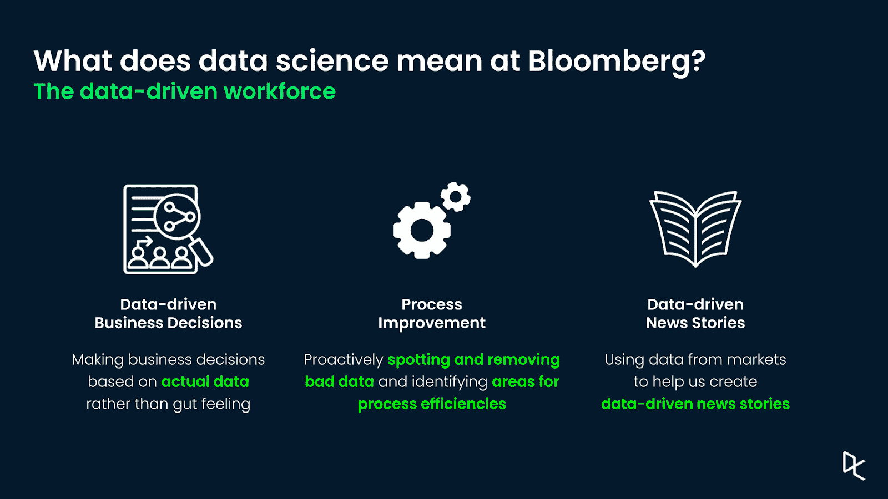
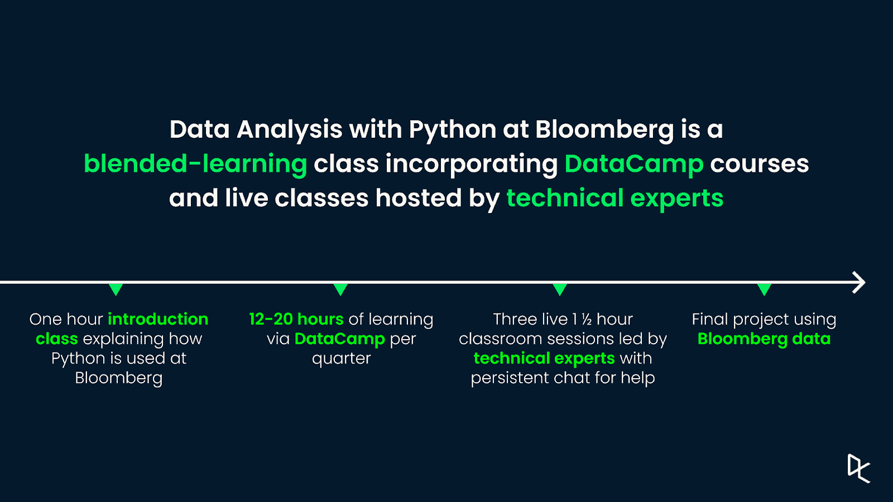
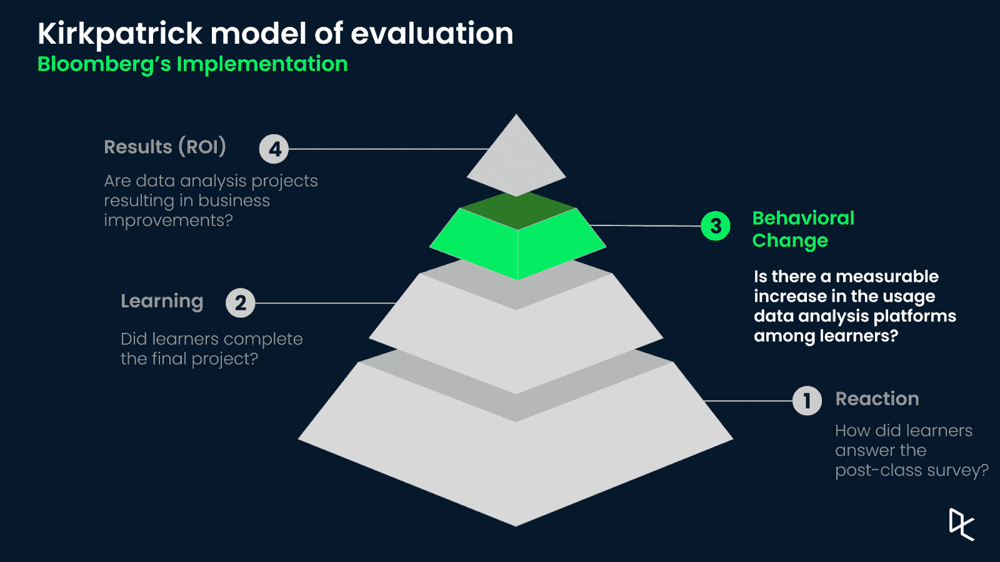
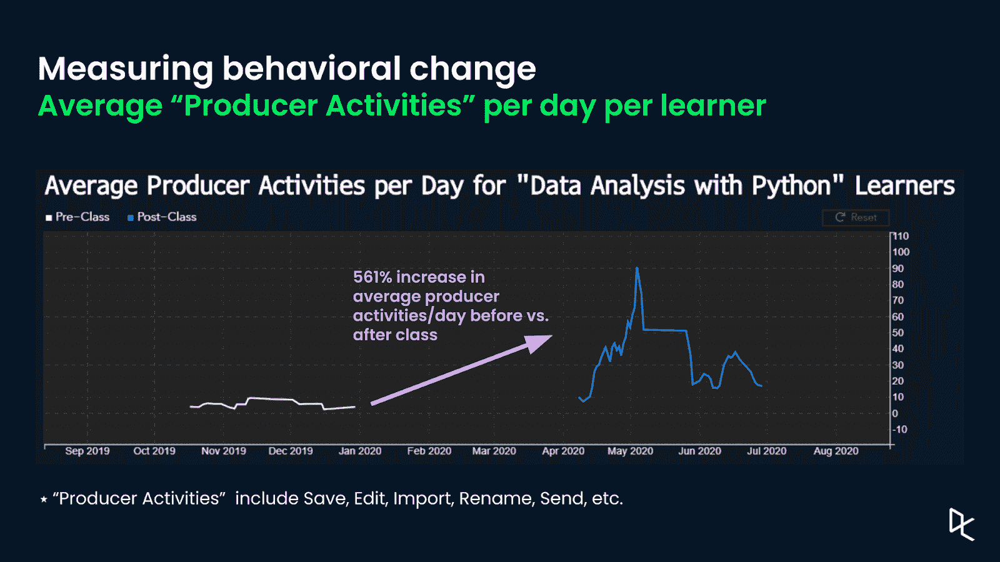

# 在彭博扩展混合学习

> 原文：<https://web.archive.org/web/20221129034451/https://www.datacamp.com/blog/scaling-blended-learning-at-bloomberg>

随着组织产生更多数据并将产品和流程数字化，数据驱动的员工队伍变得前所未有的重要。这就是为什么学习和发展已经成为业务战略的核心——尤其是专注于建立组织范围的数据科学能力的计划。

11 月 4 日，DataCamp 的数据科学布道者 Adel Nehme 与彭博大学的全球数据技术培训师谢尔·纳伊克一起，讨论了谢尔的团队如何利用混合学习来教授 Python 的数据分析，以及彭博如何衡量他们的技能提升计划后的行为变化。

## 成为数据驱动的价值

数据驱动从未像现在这样有价值。Anaconda 的首席执行官王蒙杰将数据科学描述为解决商业问题的基于证据的方法，其中数据科学家“利用数学和计算工具对商业世界进行推理”这种方法已经在各行各业中实现了大量的用例，从预测市场营销中的客户流失到金融机构的自动欺诈检测。

数据科学是彭博数据驱动文化的核心。他们的数据科学团队正在以多种方式推动可能性的边界，包括为自然语言处理项目创造[最佳实践](https://web.archive.org/web/20220524182449/https://www.techatbloomberg.com/blog/bloombergs-global-data-cto-data-science-teams-publish-best-practices-for-data-annotation-projects/)，[民主化](https://web.archive.org/web/20220524182449/https://www.techatbloomberg.com/blog/bqplot-is-now-a-community-open-source-project/)数据工具，以及在其产品中提供[智能解决方案](https://web.archive.org/web/20220524182449/https://www.bloomberg.com/company/press/bloomberg-magic-machine-learning/)。拥有数据驱动的文化还意味着让每个人都拥有必要的技能来做出数据驱动的决策，用数据改进流程，并制作数据驱动的新闻故事。

## 通过混合学习构建数据驱动的员工队伍

彭博的全球数据部门负责维护彭博终端上所有金融数据集的及时性和质量。作为一名数据技术培训师，谢尔·纳伊克与整个部门的业务领导合作，以确定在彭博从事数据工作时取得成功所需的技能，并设计、交付和评估旨在培养和提高这些技能的培训项目。这些技能包括使用版本控制工具，如 Git 和 GitHub，使用 SQL 进行数据分析，使用 Python 进行数据分析，等等。

彭博大学的 Python 数据分析课程是一个季度性的混合学习课程，包括一个小时的介绍，解释 Python 如何在彭博使用，12 到 20 小时的 DataCamp 课程，三个由内部技术专家领导的 1.5 小时的现场会议，以及一个使用彭博数据的最终项目。

彭博精心策划了 DataCamp 课程，以平衡学习目标和时间承诺，并包含来自诸如[Python 简介](https://web.archive.org/web/20220524182449/https://www.datacamp.com/courses/intro-to-python-for-data-science)、[中级 Python](https://web.archive.org/web/20220524182449/https://learn.datacamp.com/courses/intermediate-python) 等课程的章节。作为基础材料，这些课程已使 450 多名学习者(其中许多人以前从未编写过代码)能够学习和应用完成三个现场课堂会议、通过期末项目和完成培训计划所需的概念。

> 学习者能够从一生中从未编写过一行代码，到完成数据驱动的新闻分析，作为该项目最终项目的一部分——彭博大学全球数据技术培训师谢尔·纳伊克

这种混合式学习模式将自学与实时课堂培训相结合，可以在彭博实现跨地域、跨时间表和跨业务部门的学习的一致性和灵活性。在基础阶段提供的课程和经验的一致性允许彭博培训师扩展课堂并包括全球学习者。此外，在基础级别使用 DataCamp 这样的学习提供商可以提供用于衡量培训效果的见解和绩效数据。

## 衡量行为变化

评估培训项目直接投资回报的方法是 Kirkpatrick 评估模型。Kirkpatrick 模型提出了四个不同的评估级别:培训计划后的最初反应、学习评估、行为变化以及所获技能的业务影响。

彭博对 Kirkpatrick 模型第三层的实现测量了生产者在他们专有的 Jupyter 笔记本环境中的活动数量(保存、编辑、导入、重命名、发送等)。

通过利用这些数据点，Sheil 能够应用 Python 数据分析中教授的技术，发现从该计划毕业的一组学生的平均生产者活动增加了 **561%** 。根据 Sheil 的说法，彭博数据升级的最终目标是将技术与员工的主题专业知识相结合，以产生有洞察力的分析。

如果你想了解更多关于混合学习的知识，如何在你自己的组织中操作，以及 Sheil 建议每个学习和发展专业人员遵循的要点，请确保[观看完整的网络研讨会记录](https://web.archive.org/web/20220524182449/https://www.datacamp.com/resources/webinars/thrive-in-a-data-driven-age)。

