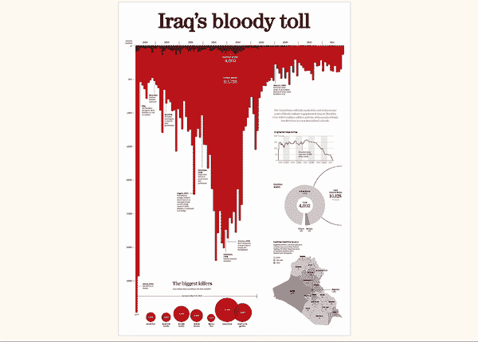
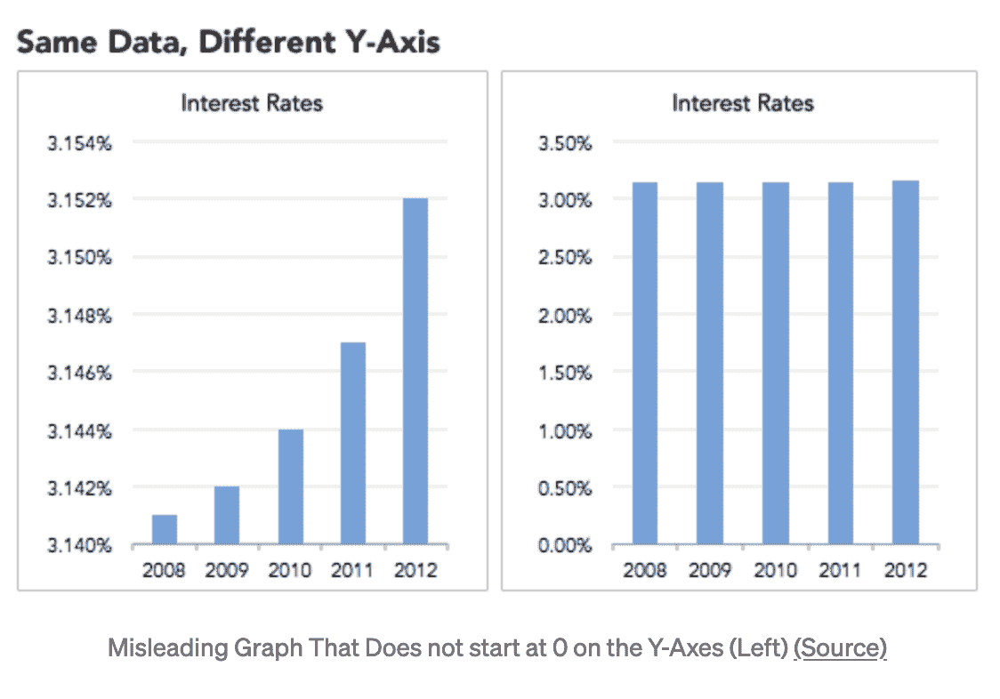
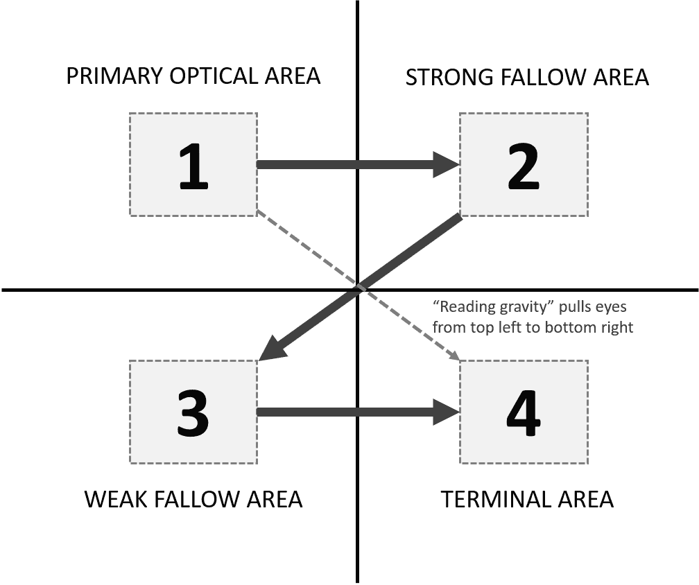

# 更好地讲述数据故事的七个技巧:第一部分

> 原文：<https://web.archive.org/web/20230101103026/https://www.datacamp.com/blog/seven-tricks-for-better-data-storytelling-part-i>

## 1.在头脑中构思数据故事

设计中的细微差异会深刻影响受众对数据可视化的理解。这些设计可以以颜色选择、标题和注释的形式出现。

一个令人不寒而栗的例子是西蒙·斯卡(Simon Scarr)的《伊拉克血腥死亡人数》(Iraq Bloody Toll)，该书强调了美国在伊拉克的军事行动造成的死亡人数。向下的红色条形图强烈地唤起了人们对伊拉克大屠杀的回忆，这一形象化的比喻让人记忆深刻。有趣的是，一个简单的重新定位和颜色变化完全改变了信息。

Figure 1: Iraq’s Bloody Toll by Simon Scarr [[Source](https://web.archive.org/web/20221001095742/http://www.simonscarr.com/iraqs-bloody-toll)]

数据说书人应该运用这种力量，负责任地、有意识地传达观点。在讲述一个理应客观的数据故事时，数据故事讲述者应该注意图表中可能放大偏见的细节。例如，轴应该从零开始，以避免误导的相关性。

Figure 2\. The same data points can convey dramatically different results [[Source](https://web.archive.org/web/20221001095742/https://www.datasciencejunction.com/2019/01/how-to-be-cautious-about-misleading.html)]

## 2.适当定位数据故事中的元素

古腾堡原理指出，当阅读内容时，用户的眼睛按照从左上到右下的 Z 形路径移动。

Figure 3\. The Gutenberg principle [[Source](https://web.archive.org/web/20221001095742/https://www.oreilly.com/library/view/practical-game-design/9781787121799/f77e030b-0f77-4774-9025-000c0d7732e6.xhtml)]

应用于数据故事，这个原则告诉我们，最重要的信息应该在左上角。更多的细节应该在图表的底部变得更加具体。行动号召也可以包含在终端部分所在的图表的右下角。

## 3.运用设计原则了解你的受众

设计原则可以用来理解受众对数据故事的体验。在《日常用品的设计》一书中，作者唐·诺曼认为，最终用户在三个情感层次上处理所有物品，这三个情感层次是:本能的、行为的和反思的。

*   直觉层面:在看到图表的第一秒钟内，用户根据图表的外观对其进行判断。这是本能的处理水平，指的是人类情感的根深蒂固和自动的品质。因此，图表的美感是保持受众对数据故事的注意力的关键。

*   行为层次:用户然后根据其有用性来判断一个可视化，这被称为处理的行为层次。换句话说，观众必须能够通过可视化看到作者的观点。

*   反思层次:在与可视化交互之后，用户反思他们的体验。例如，如果用户反思后发现他们的体验很愉快，他们可能会重用数据仪表板。

## 关于数据故事的更多提示

本文介绍了数据团队如何通过深思熟虑的设计来增强数据故事。在博文的[第二部分，我们将为展示优秀的数据故事提供更多可行的技巧。](https://web.archive.org/web/20221001095742/https://www.datacamp.com/community/blog/seven-tricks-for-better-data-storytelling-2)

