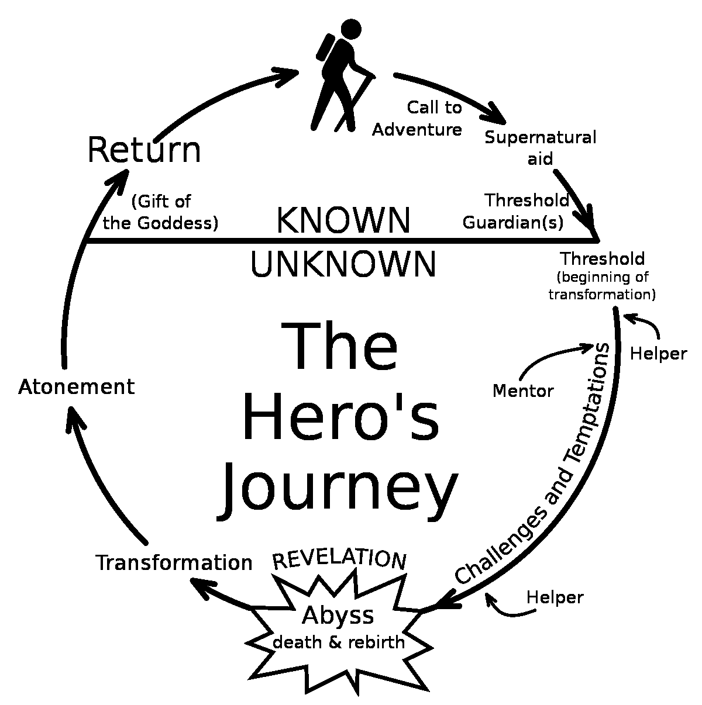
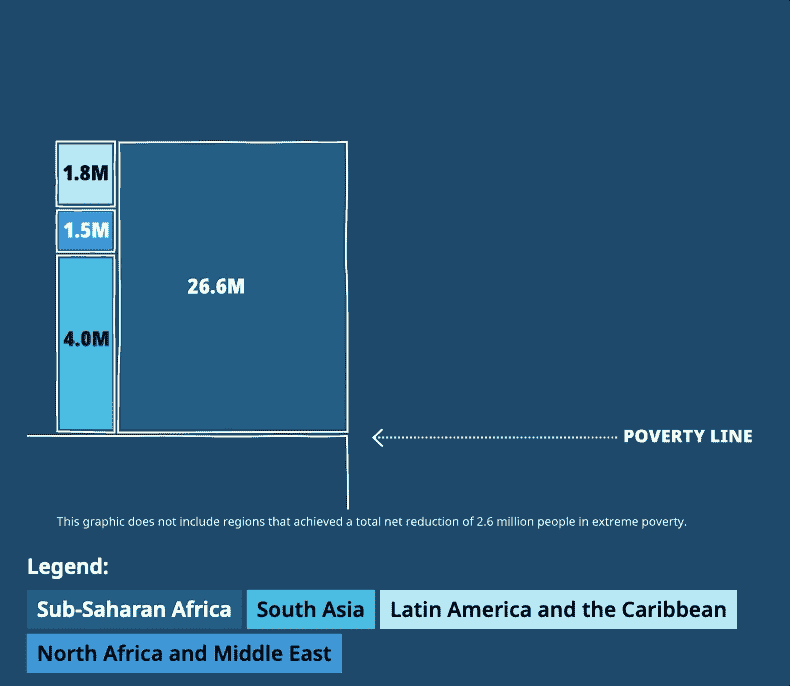
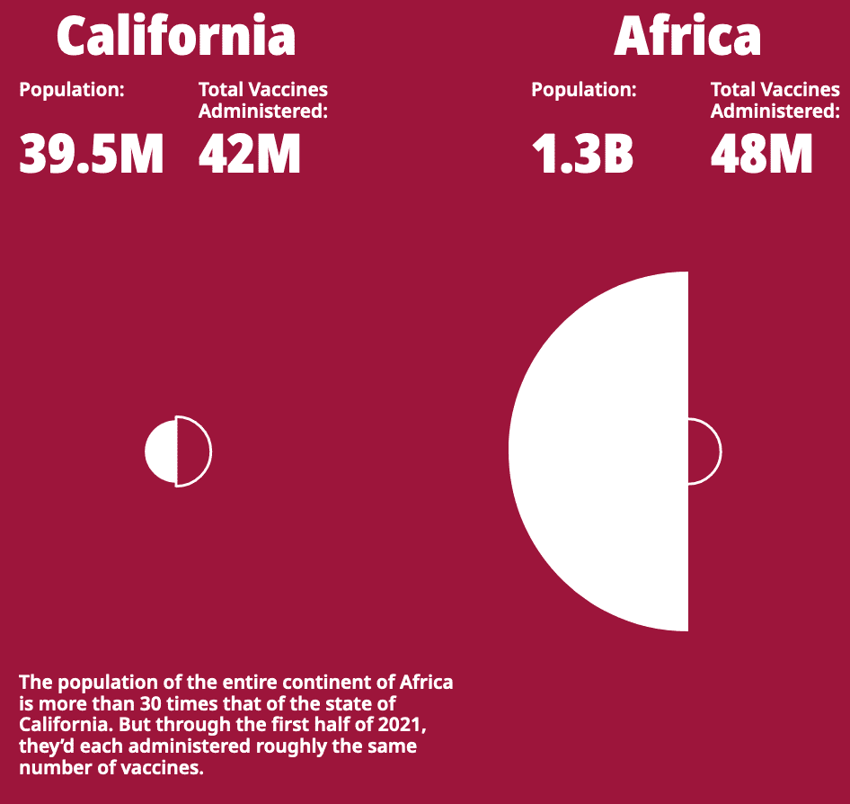
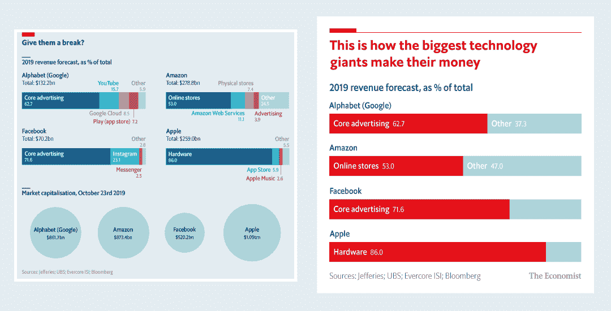

# 更好地讲述数据故事的七个技巧:第二部分

> 原文：<https://web.archive.org/web/20230101103026/https://www.datacamp.com/blog/seven-tricks-for-better-data-storytelling-part-ii>

## 4.在数据故事中使用叙事结构。

故事通常遵循一个共同的弧线——主角面临挑战，解决它，然后回归正常。这种弧线的一个例子是主人公的旅程。

Figure 1: The hero’s journey

当讲述一个故事时，听众记住一个事实的可能性是普通人的 22 倍。显然，数据可视化会从采用古老的叙述结构中受益。

采用叙事结构，数据故事以当前形势的背景开始，以建立核心洞察力的证据继续，以行动呼吁结束。(图 2)

Figure 2\. The narrative structure of a data story (Source: [Effective Data Storytelling By Brent Dykes](https://web.archive.org/web/20220827164502/https://www.effectivedatastorytelling.com/))

盖茨基金会的[守门员报告是一个很好的数据故事的例子，它展示了疫情是如何加剧不平等的。(图 3A、3B 和 3C)](https://web.archive.org/web/20220827164502/https://www.gatesfoundation.org/goalkeepers/report/2021-report/#LongTermInvestmentsPayOff)

Figure 3A: To set the scene, the data story first established the impact of COVID-19 on poverty-stricken countries. [[Source](https://web.archive.org/web/20220827164502/https://www.gatesfoundation.org/goalkeepers/report/2021-report/#LongTermInvestmentsPayOff)]

Figure 3B: The data story provided rising insights by highlighting the widening chasm between the haves and the have-nots pre-pandemic and post-pandemic.

Figure 3C: The data story closes with a call to action–for greater investments in women, communities, and innovations.

## 5.让数据故事适应媒体

跨多种媒介重用现有图表是很诱人的。这样做的数据说书人是在给自己帮倒忙。

没有针对媒体进行优化的图表可能无法有效地传递信息。最初为电子邮件设计的图表可能包含无法在屏幕上阅读的微小文本。

《经济学人》描绘了数据故事如何从印刷媒体改编到社交媒体。印刷的图表(为严肃的读者设计)信息密集。它针对 Instagram 进行了精简(专为休闲 scrollers 设计)。

Figure 4: The Economist’s printed chart (left) is adapted for social media (right) [[Source](https://web.archive.org/web/20220827164502/https://medium.economist.com/charting-new-territory-7f5afb293270)]

## 6.整理您的数据故事

杂乱使数据故事更难阅读。额外的认知负荷分散了观众对主要信息的注意力。

数据讲述者有责任识别和删除对预期信息没有贡献的多余元素。清理的结果是惊人的。

特别是，我们的白皮书“[更好地讲述数据故事的 8 条规则](https://web.archive.org/web/20220827164502/https://www.datacamp.com/resources/whitepapers/8-rules-for-better-data-storytelling)”建议数据故事讲述者:

*   删除图表边框
*   删除网格线或坐标轴
*   清理轴标签
*   直接标注数据(与使用图例相反)
*   删除数据标记
*   谨慎使用特殊效果(粗体、下划线、斜体、阴影)

## 7.分阶段解释数据故事

当呈现复杂的数据故事时，一个实用的技巧是逐渐揭示图表的元素。当信息以易于理解的片段呈现时，观众更有可能参与到演示中。

一个典型的例子是汉斯·罗斯林的演讲“统计的快乐”。观看罗斯林如何娴熟地讲述他的数据故事。

[https://web.archive.org/web/20220827164502if_/https://www.youtube.com/embed/jbkSRLYSojo](https://web.archive.org/web/20220827164502if_/https://www.youtube.com/embed/jbkSRLYSojo)

## 数据讲故事将会持续下去

随着数据洞察力成为组织的基石，数据故事很快将成为未来十年所有人的必备技能。要了解更多关于数据故事的技巧和诀窍，请收听 Andy 的播客，或学习他最近在 DataCamp 上的网络研讨会。

