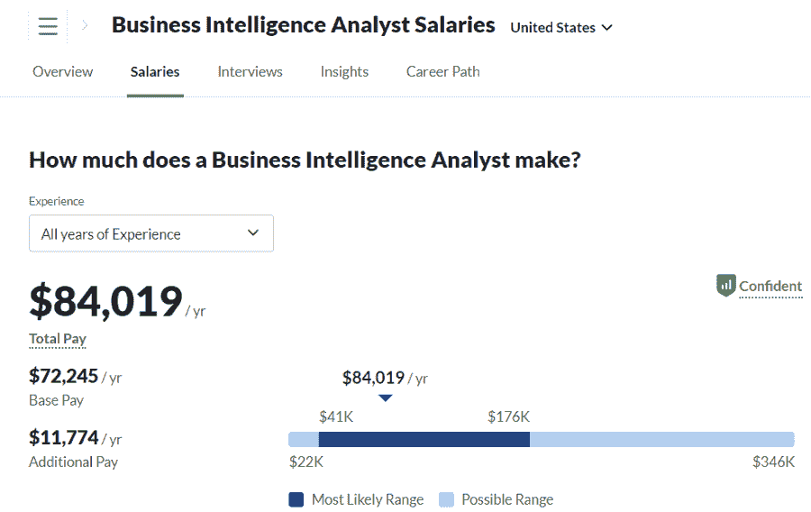

# 商业智能分析师应该学习编码吗？

> 原文：<https://web.archive.org/web/20221129033335/https://www.datacamp.com/blog/should-bi-analysts-learn-to-code>

每天，我们都会产生难以想象的大量数据。根据 Statista 的数据，2020 年全球产生的数据总量已达到 64.2 zetta bytes(1 zetta byte = 10 亿 TB)，在未来五年内，预计将增长到 180 zettabytes 以上。

随着数据量的激增，数据科学和商业智能在帮助组织理解这些数据方面发挥着关键作用。

数据科学家的工具箱主要围绕基于编码的工具，如 Python、R、命令行工具等，而商业智能分析师则利用复杂的基于 GUI 的工具，如 Tableau 或 Power BI。

在这种情况下，商业智能分析师在推动任何组织的洞察层方面发挥着重要作用。这就是为什么商业智能角色的需求越来越大。例如，在美国，商业智能分析师的平均年薪是 84019 美元。

随着低代码工具变得越来越复杂，商业智能功能继续为组织创造价值，编码技能对 BI 分析师的职业发展有多重要？在这篇文章中，我们开始回答这个问题。

如果不概述现代分析师角色的演变、需要编码的任务类型以及学习编码的价值，很难给出一个简短的答案。开始吧！

## 商业智能的历史

“商业智能”一词最早是由作家理查德·米勒·德文斯在 1865 年创造的，当时他在《商业和商业轶事百科全书》中用它来描述一位金融家如何通过收集信息并根据信息采取行动来成功击败竞争对手。

然而，直到 1956 年 IBM 发明了硬盘，现代商业智能的基础才到来。这允许用户存储 5 MB 的数据，这在当时构成了巨大的数据量。

两年后，IBM 研究员 Hans Peter Luhn 发表了一篇期刊论文，[A Business Intelligence System](https://web.archive.org/web/20221212135819/http://altaplana.com/ibmrd0204H.pdf)，通过评论企业在处理和使用大量数据以做出更好决策时面临的挑战，介绍了商业智能的原则。由于这些原因，汉斯被认为是商业智能之父。

在 20 世纪 60 年代和 70 年代之间，第一批数据管理系统和决策支持系统被开发出来，这导致了 80 年代[数据仓库](https://web.archive.org/web/20221212135819/https://www.ibm.com/cloud/learn/data-warehouse)的创建，该数据仓库一直沿用至今。

数据仓库是将来自不同来源的数据收集和组织到一个中央存储库中的系统，允许进行更有效和更深入的分析。快进到 20 世纪 90 年代末，随着技术创新、个人电脑的兴起和互联网的诞生，现代 BI 系统的前身变成了现实。

## 现代商业智能分析师的崛起

在过去的二十年里，  商业智能分析师的角色发生了巨大的变化。大数据的兴起和不断增长的数据量导致对复杂的 BI 平台和工具的需求不断增加，以帮助分析师理解他们公司的数据。

在 90 年代末和 21 世纪初，分析师使用 Excel、SQL 或基本的 BI 工具来分析和可视化他们组织的数据。然而，随着像 [Power BI](https://web.archive.org/web/20221212135819/https://www.datacamp.com/learn/power-bi) 、 [Tableau](https://web.archive.org/web/20221212135819/https://www.datacamp.com/learn/tableau) 和 Qlik 这样的工具的发布，现代分析师被期望在日常工作中掌握各种工具。

除了特定工具的技术专长，现代分析师还被期望成为广泛领域的专家。这意味着拥有强大的项目管理技能、领域知识、讲故事和沟通技巧，是当今现代分析师的赌注。

考虑到这一点，是时候重新考虑开始时提出的主要问题了:商业智能分析师应该学习编码吗？答案是肯定的！

虽然许多商业智能角色可能不需要编码技能，但学习编程技能可以使分析师加速他们为组织提供的价值，并帮助他们在求职中脱颖而出。下面，你会发现商业智能分析师应该学习如何编码的五个关键原因。

## 学习如何为商业智能分析师编码的价值

### 1.提高解决问题的技能

无论是了解 A/B 测试对关键指标的影响，为利益相关者构建仪表板，还是基于数据洞察提供建议，商业智能分析师每天都在解决问题。学习编程可以提高这些技能，因为编程提供了一个看待技术问题的新视角。

编程和提高解决问题的技能之间的联系已经得到了广泛的研究，因为它训练从业者思考潜在问题的各种解决方案。

### 2.与其他数据团队成员更好地合作

商业智能分析师通常坐在更广泛的[分析或数据团队](https://web.archive.org/web/20221212135819/https://www.datacamp.com/blog/infographic-the-anatomy-of-a-data-team-different-data-roles)中。这意味着他们将与编码优先的实践者合作，比如数据工程师、数据科学家和数据分析师。学习如何为商业智能分析师编码的一个关键结果是与其他团队成员更好的共情和协作。

学习如何编码，将有助于商业智能分析师从其他团队成员那里更好地处理问题，在其他团队成员时间有限的情况下创建需要编码技能的临时解决方案，并更好地了解他们的团队成员的工作流。更好的团队凝聚力只会给更广泛的组织带来更好的结果。

### 3.构建更复杂的数据可视化和工作流

掌握像 Tableau 和 Power BI 这样的商业智能工具是现代商业分析师的头等大事。然而，学习如何编码有助于以各种方式加速商业智能分析师的工作流程。

首先，Tableau 和 Power BI 提供了与 R 和 Python 的集成。这允许分析师通过使用他们最喜欢的商业智能工具中的脚本来自动化他们的工作流。一个重要的例子是在 Power BI 中运行 [Python 来自动化一个常用数据集上的数据操作步骤。](https://web.archive.org/web/20221212135819/https://www.datacamp.com/tutorial/running-python-scripts-in-power-bi-tutorial)

此外，像 R 和 Python 这样的编程语言可以让您构建更复杂的数据分析和可视化，这在 BI 工具上是不可能的。例如，使用诸如 R 的 [ggplot2](https://web.archive.org/web/20221212135819/https://www.datacamp.com/courses/data-visualization-with-ggplot2-1) 和 Python 的 [Matplotlib](https://web.archive.org/web/20221212135819/https://www.datacamp.com/courses/introduction-to-data-visualization-with-matplotlib) 之类的包，从业者可以设计非常定制的可视化和报告。

### 4.成为开源社区的一员

编程语言的一个独特之处在于，几乎所有最好的从业者和研究人员使用的工具都是开源的。这意味着任何人在任何时候都可以零门槛地免费下载最强大的复杂工具。

此外，这也意味着从业者可以直接与这些工具的创建者接触，为源代码的改进提供建议。加入开源社区可以帮助分析师丰富他们的职业、知识和声誉。这意味着未来更好的职业机会和数据世界中更丰富的联系。

### 5.职业发展机会

学习编程的一个主要优势是有可能扩大你的职业机会，甚至转向其他职业道路。商业智能是一个巨大的领域，有许多不同的职业道路，如数据分析师、产品分析师、BI 开发人员和商业智能架构师。根据 Glassdoor 的统计数据，编码工作需求量很大，薪水很高，满意度也很高。

这种角色的例子是数据分析师职位，它与商业智能角色密切相关，但需要更高程度的编程和统计知识。在美国，[数据分析师](https://web.archive.org/web/20221212135819/https://www.glassdoor.com/Salaries/us-data-analyst-salary-SRCH_IL.0,2_IN1_KO3,15.htm?clickSource=searchBtn)的平均年薪约为 94687 美元，最高可达 39.1 万美元。

此外，我们不断看到对数据工程师和数据科学家的巨大需求。数据工程师在整合大量数据方面发挥着重要作用，数据科学家将利用这些数据来提取见解和建立机器学习模型。数据工程师和数据科学家的工资中位数分别为每年 112，493 美元和 117，212 美元。

## 分析师角色的未来

随着商业智能的不断发展，现代商业智能分析师也需要发展。获得编码技能可以实现更好的问题解决技能、与其他团队成员更好的协作、高效和复杂的工作流、职业发展机会等等。

如果这篇文章启发了你开始学习编程，一定要查看下面的参考资料。