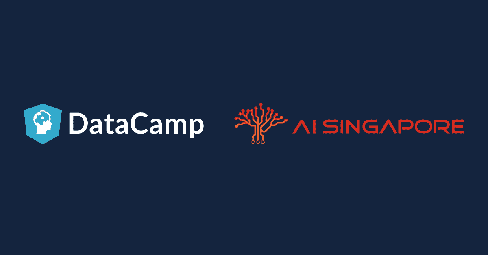
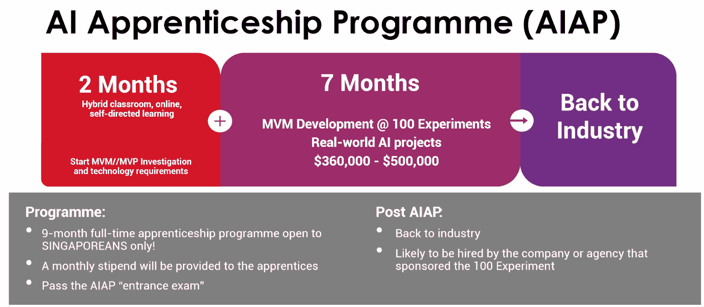
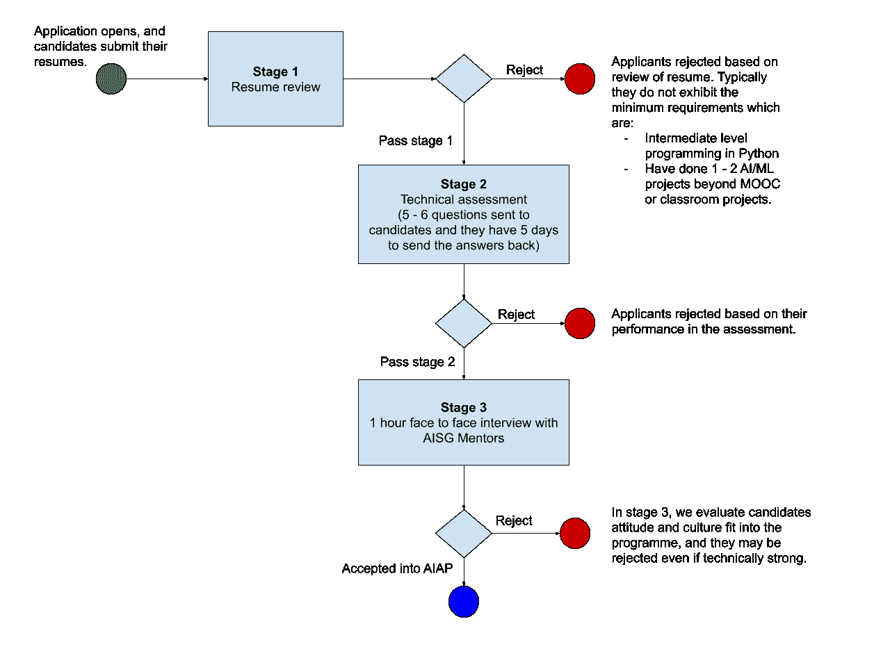
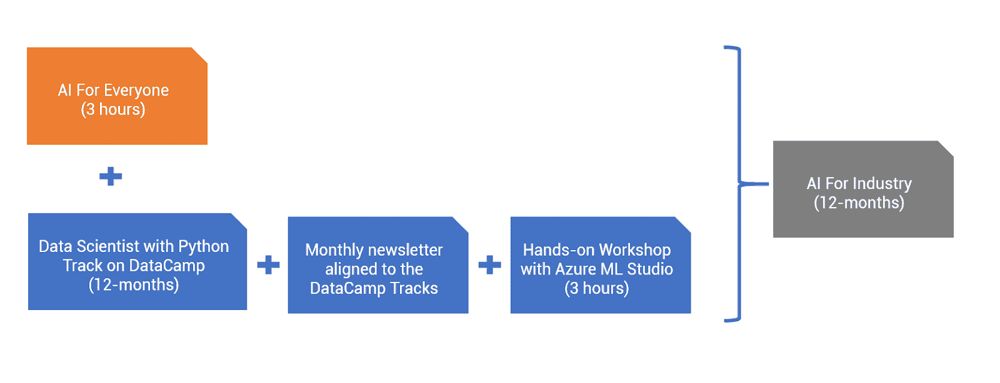

# 新加坡正在使用 DataCamp 创建一个人工智能流畅的国家

> 原文：<https://web.archive.org/web/20230101103339/https://www.datacamp.com/blog/singapore-is-using-datacamp-to-create-an-ai-fluent-nation>

我们生活在一个每天产生 2.5 万亿字节数据的世界里。移动设备的数量超过了地球上的人口数量，多年来我们一直听到这样的说法，即世界上 90%的数据都是在过去两年中生成的。各行各业尚未开发的数据数量惊人。构建基础设施和工具来将这些数据转化为见解，然后利用它为决策过程提供信息，这是每个行业都面临的一个始终存在且日益严峻的挑战。这同样适用于为员工配备管理和分析所有这些数据所必需的技能。在 DataCamp，我们看到我们的客户、合作伙伴和协作者使用一系列方法来应对这些挑战。

最近，在我们的播客 DataFramed 中，我与人工智能新加坡公司人工智能产业创新总监 Laurence Liew 聊天时，对人工智能新加坡公司的战略感到兴奋。我计划在 DataFramed 回归时发布这篇采访，它是一次旋风式的旅行，介绍了新加坡的技术和人工智能现状，以及人工智能新加坡如何与 DataCamp 合作，尽可能使这个国家成为人工智能驱动的国家，以及其他许多事情。

大赦国际新加坡办事处的既定任务是:

*锚定人工智能方面的深度国家能力，从而创造社会和经济影响，培养本地人才，建立人工智能生态系统，并通过人工智能研究、人工智能技术和人工智能创新三大支柱将新加坡放在世界地图上。*

我发现他们的方法令人兴奋的一点是，他们认识到存在于以下方面的深刻挑战:( I)确保尖端研究掌握在行业从业者手中;( ii)在数据科学、机器学习和人工智能工具和技术方面教育整个劳动力(和未来的劳动力)。

让我们深入研究人工智能研究、人工智能技术和人工智能创新的三大支柱，看看新加坡人工智能公司是如何考虑弥合(I)研究和工业与(ii)21 世纪现代工业所需的劳动力和数据技能之间的差距的。

## 人工智能研究:播种高质量

人工智能研究支柱的目标是播种高质量的研究成果，开发基础和新颖的人工智能技术、算法和相邻技术——这些成果最终将对新加坡人工智能的其他支柱做出重大贡献。人工智能新加坡的研究项目也鼓励国家研究合作，培养本地人工智能人才。

优先研究领域包括:

*   可解释的人工智能
*   艾设计
*   人工智能在感知中
*   人工智能-人类协作
*   小数据集培训

最后一条对新加坡尤为重要。作为一个小国，人类生成的数据集与人口更多的国家相比将会很小，所以他们的研究人员推进这一人工智能研究领域是很重要的。简而言之，这一支柱通过认识到正在进行的研究在开发将被下游产业采用的技术方面的重要性，为未来的人工智能工作提供了基础。

## 人工智能技术:应对重大挑战

这个支柱关注的是新加坡人工智能所称的重大挑战&这类问题非常困难，人工智能可以用来(作为几种技术之一)帮助解决。重大挑战(I)需要有影响力，(ii)需要影响新加坡的每一个人，以及(iii)必须可以衡量。

在大挑战下，AI Singapore 优先考虑了四个垂直领域:医疗保健、教育、城市和智能国家以及金融。将这些视为他们渴望解决的四大问题陈述。

作为一个引子，现在让我们来探索第一个垂直领域，医疗保健(您必须等到其他三个挑战发布后才能了解其余内容)。[医疗保健大挑战](https://web.archive.org/web/20220819082717/https://aisingapore.org/grand-challenges/health/)问“我们如何在未来五年内将三高降低 20%:高血压、高胆固醇和高血糖症(或糖尿病)？”医疗保健大挑战已经启动，事实上，就在我与劳伦斯交谈的两周前，他们举行了颁奖仪式，宣布三个团队获得了开展大挑战的最初资助。

> “三高、高血压、高胆固醇和糖尿病是新加坡政府非常关注的问题。他们使医疗保健系统和这里的预算变得紧张。我们希望通过人工智能，我们可以尝试至少减轻一些影响。”这个支柱旨在展示现代人工智能对这些重大挑战的持久影响。

## 人工智能创新:解决现实世界的问题

人工智能创新支柱包括一系列计划和战略，将尖端的人工智能研究技术引入行业合作伙伴的手中，以解决现实世界的问题。

人工智能创新下的旗舰项目是 100 个实验项目，在该项目中，公司向人工智能新加坡公司提出他们认为可以用数据科学、机器学习或人工智能来解决的商业问题或挑战。AI Singapore 对每一项提案进行系统的审查。如果他们认为这是一个有趣的问题，没有现有的商业可用的解决方案或技术合作伙伴可以帮助他们，他们就可以介入并为项目提供核心资金(有关申请流程的更多细节和更多信息可在此处找到)。

这看起来像什么？AI Singapore 为每个项目出资 250，000 新元(180，000 美元)，公司以 1:1 的比例进行匹配。Laurence 有一个执行 100 个项目的 KPI，因此命名为 100 个实验，总项目资金为 2500 万新币。

自 2017 年 6 月开始以来，他们已经批准了 40 个项目，由于该计划的成功，他们获得了第二轮政府资助，使项目数量达到 200 个。在医疗保健、制造、物联网、异常检测、采购和金融等领域已经有了一些项目。

每个实验的目标是在 9 到 18 个月内生产出最小可行产品(MVP)。这需要双方的合作，共同开发 MVP，然后公司可以把它放回他们的组织中。这笔资金支持一个项目团队，该团队包括新加坡当地大学的研究人员和新加坡人工智能的工程资源，包括他们所谓的人工智能学徒。劳伦斯告诉我，让教授参与进来相对简单，但他们也需要人工智能工程师来完成 MVP。这就是围绕快速发展的数据科学生态系统、机器学习和人工智能技术、工具和工业应用的教育发挥作用的地方。

## 人工智能学徒计划:培养未来的领导者

为了帮助建立所需的劳动力，以支持行业当前和不断增长的人工智能需求，新加坡人工智能创建了人工智能学徒计划。这给具备基本知识的新加坡人提供了深入学习技能的机会。该计划将通过 DataCamp 课程和其他资源进行的学习与通过 100 实验计划下的项目获得的实际经验相结合。

这个学徒项目迅速发展起来。这是 AI 新加坡的核心项目之一，加上 100 个实验项目(其中每个实验都有两个学徒)。

学徒计划是全职的，带薪的，为期九个月。AI Singapore 每月付给每个学徒 3000 到 5000 新币的津贴(参加是免费的)。劳伦斯告诉我，人工智能学徒计划正在帮助解决他们未来 10 年的人工智能工程挑战。然而，一个国家的技能提升、技能再提升和技能深化并不止于此。他们需要提升整个行业的技术技能，这就是他们如何提出工业人工智能的想法。

## 工业人工智能:民主化技能

AI for Industry 的目标是提升那些为各种垂直行业的组织工作的人的技术技能。AI Singapore 与 DataCamp 在这个项目上紧密合作。它建立在他们的 [AI for Everyone program](https://web.archive.org/web/20220819082717/https://aisingapore.org/event/ai4e-12-oct/) 的基础上，这是一个 3 小时的研讨会，向任何人介绍现代人工智能技术和应用，以便他们可以成为人工智能产品和服务的精明消费者。在 AI for Everyone 中，参与者学习如何在工作和日常生活中识别机会和潜在用例。他们还用在线工具建立了一个简单的人工智能模型！人工智能新加坡的任务之一是不仅让公司，而且让工作专业人士和其他所有人都为人工智能做好准备。人工智能为每个人服务是这一使命不断发展的结果。

AI for Industry 将面向每个人的 AI 与 DataCamp 的[数据科学家和 Python track](https://web.archive.org/web/20220819082717/https://www.datacamp.com/tracks/data-scientist-with-python) 结合在一起，这是一个 100 小时的课程集，涵盖了从 Python 基础到导入、清理和管理数据到统计、机器学习、SQL、包管理、数据可视化等所有内容。参与者将在 12 个月内完成这一课程。AI Singapore 策划了一份与赛道课程一致的月度通讯，并主持了一个三小时的机器学习实践研讨会。劳伦斯说，他们决定使用带有 Python track 的 DataCamp 数据科学家作为该计划的焦点，因为“它背后的思想是训练应该如何进行。”

但是教育并不止于此。还没入行的同学怎么办？这就是面向学生的人工智能发挥作用的地方。

## 面向学生的人工智能:用人工智能的流畅性赋能下一代

当 Laurence 意识到 DataCamp 一直为大学、教授和学生提供免费访问 DataCamp 平台的机会时，他想知道他们是否可以利用这一点并将该计划正式化，以便 AI Singapore 可以帮助更多学生加入进来。

> “我们为什么要仅仅停留在大学生身上呢？我们能把它一直开放给中学生吗？”

在新加坡，中小学的孩子们已经在学习 Python 了——那么他们为什么要在大学阶段开始正式的 Python 培训呢？为了测试他的理论是否可行，劳伦斯让他的儿子在 DataCamp 上用 Python 追踪数据科学家。

劳伦斯报告说:“他完成了。他通过了。他在学校做项目。有趣的是，他在 13 岁时就完成了。一个真正喜欢编程的聪明孩子。我们在新加坡有很多。他们可以通过这些模块。我想，如果他能做到，我相信很多其他孩子也能做到。”

在这个家庭试点项目之后，Laurence 与 DataCamp 密切合作，我们于去年 11 月宣布并启动了该项目。在我们谈话的时候，AI Singapore 有 7，000 名学生注册了 AI for Students，他们不仅来自大学，还来自理工学院和中学等。几个月后，他们现在有 11，000 名学生！Laurence 告诉我，学校教师对该计划非常感兴趣，他们希望在课后使用 Python、数据科学、人工智能和机器学习在该平台上培训他们的孩子。

劳伦斯明确表示，学生人工智能项目本质上是纯粹的数据营。AI 新加坡的角色是走出去说，“嘿，我们有这个平台。它是免费的。作为一名教师，你来对我们说，‘我已经查看了 DataCamp 平台。我真的很喜欢。我想学模块 1 到 10。“然后，AI Singapore 将在后端与 DataCamp 合作，将数据提供给老师。

就个人而言，这条消息对我来说意义重大。我在 DataCamp 的第一个角色本质上是构建基础 Python 数据科学课程，所以我在这里的前 18 个月的大部分时间都花在了 Python track 的数据科学家上。随着我们从一个 10 人的公司发展到 50 人(今天，我们有 140 多名员工),许多鲜血、汗水和泪水都投入了这条赛道。).它涉及到我们的外部讲师和内部内容、工程、产品和营销团队的大量工作。听到这条赛道现在被免费用于教育包括儿童在内的 11，000 名新加坡学生，我真是欣喜若狂。

## 着眼未来

更令人兴奋的是未来将会发生什么:DataCamp 最近同意在课堂上支持 100，000 名学生，而新的行业协作人工智能现在的任务是让新加坡的 25，000 名工作专业人员精通人工智能。AI Singapore 将继续在 DataCamp 的数据科学家和 Python track 的基础上为行业提供人工智能，为参与者提供数据流畅和人工智能精通的基本技能和知识。这是一次值得关注的合作。

| 程序 | 描述 |
| --- | --- |
| **人工智能研究** | Seeds 旨在开发基本人工智能新技术、算法和相邻技术的高质量研究工作，这些工作最终将对人工智能新加坡的其他支柱做出重大贡献。这个研究项目鼓励国家研究合作，培养本地人工智能人才。 |
| **AI 技术** | 支持人工智能新加坡称之为大挑战，这类问题非常困难，人工智能可以用来解决。重大挑战(I)需要有影响力，(ii)需要影响新加坡的每一个人，以及(iii)必须可以衡量。AI 新加坡优先考虑四个垂直领域:医疗保健、教育、城市和智能国家以及金融。 |
| **人工智能创新** | 一套程序和策略，让尖端的人工智能研究技术进入行业合作伙伴的手中，以解决现实世界的问题。人工智能创新下的旗舰项目是 100 个实验项目，公司带着他们认为可以用数据科学、机器学习或人工智能来解决的商业问题或挑战来到人工智能新加坡。 |
| **人工智能学徒计划** | 为了帮助建立劳动力以支持工业当前和不断增长的人工智能需求，AI 新加坡公司创建了人工智能学徒计划。这使得具备基础知识的新加坡人有机会利用自己的时间发展更深层次的技能。该计划将通过 DataCamp 课程和其他资源进行的学习与通过 100 实验计划下的项目获得的实际经验相结合。 |
| **AI for Industry** | 提升垂直行业专业人士的技术技能。新加坡人工智能公司与 DataCamp 紧密合作开展该项目。 |
| **AI for Everyone** | 一个三小时的研讨会，向任何人介绍现代人工智能技术和应用，使他们成为人工智能产品和服务的精明消费者。 |
| **学生 AI** | 一个赋予下一代人工智能流畅度的计划。该计划为中学、理工学院和大学的学生提供免费访问 DataCamp 的 100 小时 Python track 数据科学课程的机会。 |