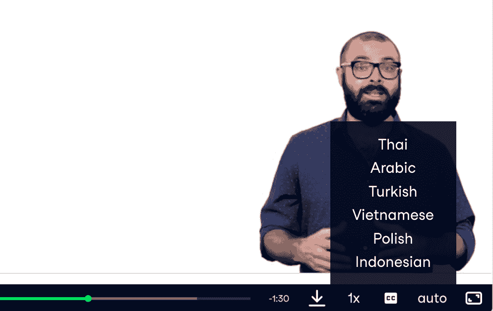

# DataCamp 新增六种字幕语言

> 原文：<https://web.archive.org/web/20221129044127/https://www.datacamp.com/blog/six-new-subtitle-languages-added-to-datacamp>

现在，用您的母语学习更加容易，有 16 种语言的视频字幕，包括阿拉伯语、印度尼西亚语、波兰语、泰语、土耳其语和越南语。

所有视频还配有英语、西班牙语、法语、中文(简体)、葡萄牙语、德语、韩语、日语、俄语和意大利语字幕。

## 如何在 DataCamp 中打开视频字幕:

要使用这些新字幕，请在观看任何视频时点击隐藏字幕(CC)图标，并选择您喜欢的音频或字幕选项。

请继续让我们知道[我们如何改进产品功能](https://web.archive.org/web/20221212135821/https://support.datacamp.com/hc/en-us/requests/new?ticket_form_id=360000029413)比如我们的翻译，并推荐我们接下来应该考虑添加哪些语言。我们也希望听到您对我们课程的[反馈](https://web.archive.org/web/20221212135821/https://support.datacamp.com/hc/en-us/requests/new?ticket_form_id=360000029453)！我们可以一起让 DataCamp 成为一个各行各业的人都可以学习数据语言的地方。

## 您可能还喜欢:

#### 客户成功案例:DataBird

DataCamp 帮助一个法国训练营满足该国对数据技能的需求。

*   [阅读 DataCamp 的案例研究](https://web.archive.org/web/20221212135821/https://www.datacamp.com/resources/case-studies/databird-case-study)

#### 用数据、叙述和视觉效果讲述有效的数据故事

Brent Dykes 在最近的一次网络研讨会上讨论了数据、叙事和视觉如何推动有效的数据故事。在这篇文章中学习他的最佳实践。

*   [阅读最佳实践](https://web.archive.org/web/20221212135821/https://www.datacamp.com/community/blog/telling-effective-data-stories-with-data-narrative-and-visuals)