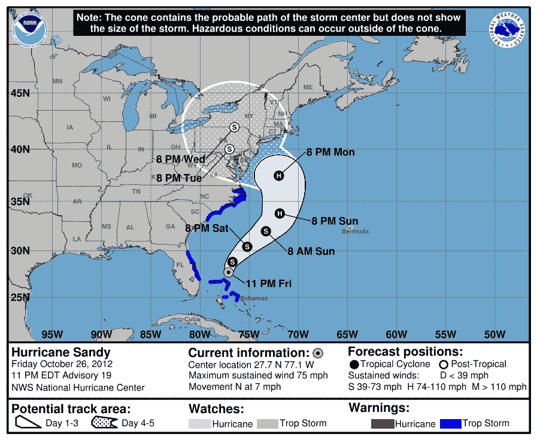
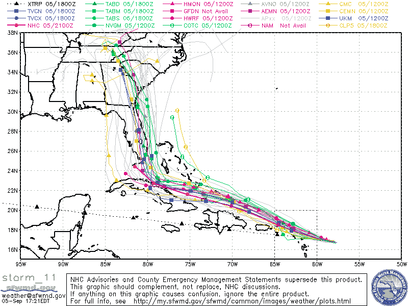
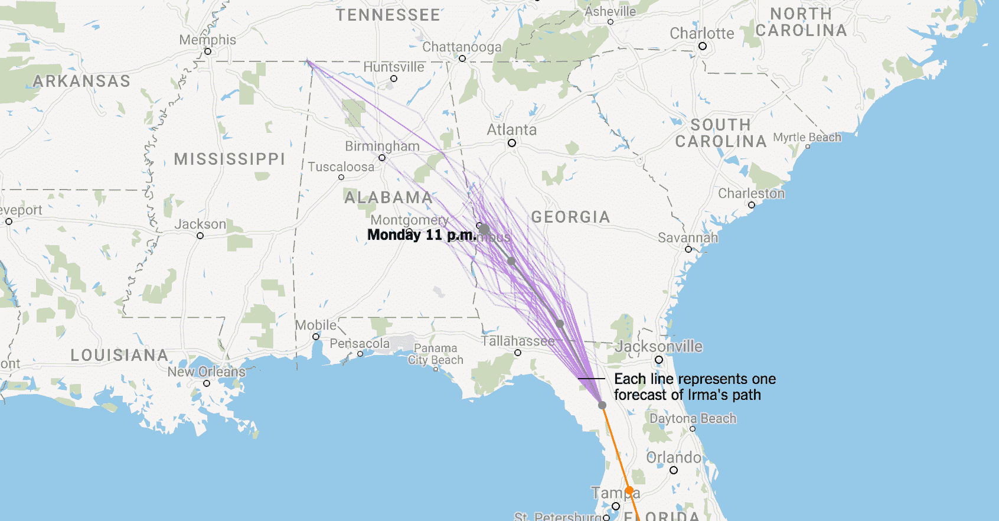

# 意大利面条图和飓风路径

> 原文：<https://web.archive.org/web/20230101103400/https://www.datacamp.com/blog/spaghetti-plots-and-hurricanes-paths>

可视化帮助我们理解世界，让我们以简洁的形式传达大量复杂的信息、数据和预测。需要传达给非专家受众的专家预测，无论是飓风的路径还是选举的结果，都包含一定程度的不确定性。如果这种不确定性没有在相关的可视化中传达，结果可能会误导人，甚至是危险的。

在这里，我们探讨了数据可视化在绘制飓风预测路径中的作用。我们探索不同的视觉方法来传达专家预测的不确定性和对外行人解释的影响。此外，我们还将此与更广泛的最佳实践讨论联系起来，这些最佳实践涉及新闻媒体如何报道专家模型和对大众而言重要的主题的科学成果。

## 没有意大利面情节？

我们最近看到了热带风暴系统在美洲造成的破坏。例如,《纽约时报》这样的新闻媒体已经通过互动可视化传达了大量关于飓风哈维和 T2 的信息。可视化包括地理可视化的百分比没有电的人，降雨量，损失金额和人数在避难所，以及许多其他事情。

可以理解的是，最近出现了一种特殊类型的绘图，并引起了争议:*如何绘制飓风在未来 72 小时内的预测路径*。有几种方法来可视化预测的路径，每种方法都有自己的陷阱和误解。最近，我们甚至在 Ars Technica 上看到一篇名为[的文章，请不要再分享飓风模型](https://web.archive.org/web/20220626103721/https://arstechnica.com/science/2017/09/please-please-stop-sharing-spaghetti-plots-of-hurricane-models/)的意大利面条图，矛头直指内特·西尔弗和 fivethirtyeight。

在接下来的内容中，我将比较三种常见的方式，探讨它们的优缺点，并对未来的情节类型提出建议。我还将深入研究为什么这些类型是重要的，这将帮助我们决定哪些视觉方法和技术是最合适的。

声明:我绝对不是气象和飓风预报方面的专家。但是我想了很多关于传递数据、预测和模型的视觉方法。我欢迎并积极鼓励专家和其他人的反馈。

## 可视化预测的飓风路径

有三种常见的方法来创建预测飓风路径的可视化效果。在谈论它们之前，我想让你看看它们，并考虑一下你能从它们中得到什么信息。反过来，尽最大努力解释他们每个人试图告诉你的内容，然后我们将深入研究他们的意图，以及他们的利弊:

### 不确定性的圆锥体

Caption: From [the National Hurricane Center](https://web.archive.org/web/20220626103721/http://www.nhc.noaa.gov/aboutcone.shtml).

### 意大利面条图(I 型)

From [South Florida Water Management District](https://web.archive.org/web/20220626103721/https://www.sfwmd.gov/) via [fivethirtyeight](https://web.archive.org/web/20220626103721/https://fivethirtyeight.com/features/hurricane-irma-will-be-dangerous-no-matter-where-it-makes-landfall/).

### 意大利面条样地(类型二)

From [The New York Times](https://web.archive.org/web/20220626103721/https://www.nytimes.com/interactive/2017/09/05/us/hurricane-irma-map.html). Surrounding text tells us 'One of the best hurricane forecasting systems is a model developed by an independent intergovernmental organization in Europe, according to Jeff Masters, a founder of the Weather Underground. The system produces 52 distinct forecasts of the storm’s path, each represented by a line [above].'

## 飓风预测路径可视化的解释和影响

### 不确定性的圆锥体

“不确定圆锥”是国家飓风中心(NHC)使用的一种工具，被许多新闻媒体传播，它向我们展示了飓风在未来五天内最有可能在 T2 的路径，由圆锥中的黑点给出。这也显示了他们对这条道路有多确定。随着时间的推移，预测变得越来越不确定，这被圆锥体捕获，因为有大约 66.6%的机会飓风的中心将落在圆锥体的边界内。

从情节本身来看，这很明显吗？

最初不是我，我从情节本身、NHC 的“关于不确定的圆锥”页面和 weather.com 的“T2”揭秘圆锥帖子中收集了这些信息。还有三个突出的要点，我们将全部回到:

*   这是一个常见的最初误解，即随着时间的推移，锥体的扩大表明风暴将会增长；
*   该图没有包含关于风暴规模的信息，只包含了风暴中心的潜在路径，因此在告诉我们哪里会有飓风级别的风方面用处有限；
*   伴随可视化的文本以及可视化本身包含了重要的信息，例如位于顶部显著位置的注释，“圆锥体包含风暴中心的可能路径，但不显示风暴的大小……”；在判断数据可视化的功效时，我们需要考虑它的所有属性，包括文本(以及我们是否真的能期望人们阅读它！);请注意，交互性是这些可视化不具备的属性(但也许应该具备)。

### 意大利面条图(I 型)

这种类型的图在一个图中显示多个预测。在任何给定的 I 型意大利面条图中，可视化的轨迹是来自不同机构(例如，NHC、国家海洋和大气管理局以及英国气象局)的模型的预测。它们是有用的，就像不确定的圆锥一样，它们告诉我们飓风可能经过的大致区域。它们非常无用，实际上还会误导人，因为它们对每个模型(或预测)的权重都是一样的。

在上面的 I 型意大利面条图中，有来自机构的具有不同程度不确定性的预测，这些机构先前已经做出了具有不同程度成功的预测。因此，根据我们目前所知，有些路径比其他路径更有可能。该信息不存在。更令人担忧的是，有些路径甚至连预测都算不上。以黑色虚线 XTRP 为例，这是一个给定风暴当前轨迹的直线预测。这甚至不是一个模型。埃里克·博格在这篇 Ars Technica 文章中进行了更详细的描述。

本质上，这种类型的图提供了一个[集合模型](https://web.archive.org/web/20220626103721/https://en.wikipedia.org/wiki/Ensemble_forecasting)(与[集合轮询](https://web.archive.org/web/20220626103721/https://en.wikipedia.org/wiki/Poll_aggregator)相比)。然而，集合模型的一个关键方面是每个模型被赋予适当的权重，并且这些权重需要在任何数据可视化中被传达。我们将很快看到如何使用类型 I 的变体来实现这一点。

### 意大利面条样地(类型二)

这些图显示了任何给定模型的许多不同实现，比如说 50 个。关键是，如果我们多次模拟(运行)一个模型，每次都会给出不同的轨迹。为什么？内特·科恩说得好，结果是:

> 很难准确预测风暴何时会转向。即使它转向北方时有 15 或 20 英里的差异，也可能改变迈阿密是否会受到眼墙的影响，眼墙是一种激烈的雷暴环，包括风暴中最强的风，并围绕着平静的眼。

这可能是三个中我最喜欢的，原因如下:

*   通过模拟模型的多次运行，它们提供了每个模型潜在的不确定性的指示；
*   它们给出了风暴中心穿过任何给定位置的相对可能性。简单地说，如果通过位置 A 的绘制轨迹多于通过位置 B 的绘制轨迹，那么在当前模型下，风暴中心更有可能通过位置 A；
*   它们不太可能被曲解(至少与不确定性圆锥和 I 型图相比)。可视化所需的所有单词是“每行代表 Irma 路径的一个预测”。

类型 II 的一个缺点是它们不能代表多个模型，但是，正如我们将看到的，这可以通过将它们与类型 I 图结合起来而改变。另一个缺点是，他们和其他人一样，只传达风暴中心的路径，而对其大小只字不提。很快我们也会看到如何补救这一点。请注意，类型 I 和类型 II 意大利面条图之间的区别不是我在文献中发现的，而是我创造的，因为这些图有如此不同的解释和效果。

然而，现在请注意，我们一直在讨论某些类型情节的功效，而没有明确讨论它们的目的，也就是说，我们到底为什么需要它们。在继续深入之前，让我们后退一步，尝试回答这个问题“可视化飓风预测路径的目的是什么？”执行这种看似幼稚的任务往往很有启发性。

## 为什么要绘制飓风的预测路径？

为什么我们试图传达热带风暴的预测路径？我将在一分钟内提供几个答案。

但是首先，让我说一下这些可视化是*而不是*的目的。我们并没有用这些可视化来帮助人们决定是否撤离他们的家园或城镇。命令或建议疏散是由地方当局在反复咨询专家、科学家、建模者和其他关键利益相关者后完成的。

这种可视化的主要目的是让公众尽可能了解飓风的可能路径，并让他们做好最坏的准备，如果他们现在或将来有可能处于毁灭的路径上。这并不是为了过分地吓唬人。正如关于不确定性圆锥的功能，“每个热带系统都有一个预测圆锥，以帮助公众更好地了解它的走向”，圆锥的设计是为了显示随着时间的推移不断增加的预测不确定性

为此，我认为对于读者来说，一个重要的属性是能够看着它并说‘我的房子(例如)很可能/很可能/50%可能/不太可能/非常不可能’会被飓风严重损坏。

更好的是，能够说“鉴于目前最先进的建模技术，我的房子有 30-40%的可能性会受到严重损坏”。

然后，我们有一个我们希望我们的可视化传达的层次结构:

*   最起码，我们希望平民知道飓风可能的路径。
*   然后，我们希望平民能够说，例如，他们的房子是非常可能、可能、不太可能还是非常不可能在路上。
*   理想情况下，一个平民会看到可视化，并能够定量读出他们的房子在飓风路径上的概率(或概率范围)。

最重要的是，我们希望我们的可视化既不误导也不容易误解。

### 不确定性圆锥与意大利面条图

所有这三种方法都发挥了最低限度的功能，提醒平民注意飓风可能的路径。不确定性圆锥做了一件很好的工作，允许一个平民说出飓风经过特定位置的可能性有多大(在圆锥内，大约有三分之二的可能性)。至少在定性上，类型 II 意大利面条图在这里也做得很好，如上所述，“如果通过位置 A 的轨迹比通过位置 B 的多，那么在当前模型下，风暴中心更有可能通过位置 A”。

如果你画出 50 条轨迹，你就能感觉到风暴的中心可能在哪里，也就是说，如果大约一半的轨迹穿过一个位置，那么大约有 50%的可能性(根据我们的模型)风暴的中心会击中那个位置。这些方法都没有执行第三个功能，我们将在下面看到如何结合类型 I 和类型 II 意大利面条图将允许我们这样做。

不确定性圆锥体和 I 型意大利面模型的主要问题是，不确定性圆锥体很容易被误解(因为许多人将圆锥体解释为不断增长的风暴，并且不理解不确定性的作用)，I 型意大利面模型具有误导性(它们使所有模型看起来同样可信)。这些模型没有满足“我们希望我们的可视化既不误导也不容易误解”的基本要求。

## 可视化飓风预测路径的最佳实践

第二类意面图是最具描述性的，也是最不容易被误解的。但是他们确实不能展示所有模型的结果。也就是说，它们不会像我们在类型 I 中看到的那样在多个模型上聚合。

那么如果我们把 I 型和 II 型结合起来会怎么样呢？

为了回答这个问题，我用`python`、`folium`和`numpy`做了一个小实验。你可以在这里找到所有的代码[。](https://web.archive.org/web/20220626103721/https://github.com/datacamp/community-hurricane-visualizations)

我首先选取了上周 NHC 飓风厄玛的预测路径，添加了一些随机噪声，并绘制了 50 条轨迹。请注意，再一次，我不是所有气象问题的专家。我生成并添加到预测信号/路径中的噪声并不基于任何模型，在实际用例中，它将来自模型本身(如果您感兴趣，我使用的是高斯噪声)。为了记录在案，我还发现很难找到关于媒体报道的任何预测路径的数据。我最后用的数据我在这里找到了。

这是一个简单的二型意大利面条图，有 50 条轨迹:

[https://web.archive.org/web/20220626103721if_/https://s3.amazonaws.com/assets.datacamp.com/blog_assets/Hurricane+Visualization/trajectories.html](https://web.archive.org/web/20220626103721if_/https://s3.amazonaws.com/assets.datacamp.com/blog_assets/Hurricane+Visualization/trajectories.html)

但是这些是由单一模型产生的可能轨迹。如果我们有来自不同机构的多个模型会怎么样？好吧，我们可以从每条曲线上画出 50 条轨迹:

[https://web.archive.org/web/20220626103721if_/https://s3.amazonaws.com/assets.datacamp.com/blog_assets/Hurricane+Visualization/trajectories_spag.html](https://web.archive.org/web/20220626103721if_/https://s3.amazonaws.com/assets.datacamp.com/blog_assets/Hurricane+Visualization/trajectories_spag.html)

II 型意大利面条图真正酷的一面是，如果我们绘制足够多的面条图，每条轨迹都变得模糊不清，我们开始看到飓风中心可能在哪里的热图。所有这一切意味着，在一个给定的区域，蓝色越多，路径通过那里的可能性就越大。放大查看。

[https://web.archive.org/web/20220626103721if_/https://s3.amazonaws.com/assets.datacamp.com/blog_assets/Hurricane+Visualization/trajectories_spag_heat.html](https://web.archive.org/web/20220626103721if_/https://s3.amazonaws.com/assets.datacamp.com/blog_assets/Hurricane+Visualization/trajectories_spag_heat.html)

此外，如果我们认为一个模型比另一个更有可能(例如，如果产生该模型的专家以前已经产生了更精确的模型)，我们可以通过例如轨迹的透明度来相应地加权这些模型，如下所述。请注意，对这些模型进行加权是专家的任务，也是总体建模过程的重要部分。

[https://web.archive.org/web/20220626103721if_/https://s3.amazonaws.com/assets.datacamp.com/blog_assets/Hurricane+Visualization/trajectories_spag_weight.html](https://web.archive.org/web/20220626103721if_/https://s3.amazonaws.com/assets.datacamp.com/blog_assets/Hurricane+Visualization/trajectories_spag_weight.html)

上面所做的是解决我们希望我们的可视化具有的前两个属性所要求的任务。要实现第三个，读者能够读出飓风中心通过特定位置的可能性为 30-40%,有两种解决方案:

*   更改热图，使其在红色和蓝色之间移动，并包含一个关键字，例如，红色表示概率大于 90%；
*   将热图转换为等值线图，显示概率为特定值的区域。

也请注意，这将告诉某人某个给定位置被飓风中心袭击的概率。你可以结合(嗯，卷积)这个与飓风大小的信息，将热图转换成一个位置被飓风袭击的概率。如果你想这样做，就去修改我写的代码，生成上面的图(我计划写一篇后续文章来做这件事，并遍历代码)。

## 可视化不确定性和数据新闻

我们能从中学到什么？我们已经探索了几种预测飓风路径的可视化方法，讨论了每种方法的优缺点，并提出了一种方法来绘制这些路径的更多信息和更少误导的图，这些图不仅传达了结果，还传达了模型的不确定性。

总的来说，这是我们需要进行的更广泛的对话的一部分，关于报告可视化和数据新闻中的不确定性。我们需要积极参与关于专家如何通过新闻媒体向平民报告不确定性的对话。[这里有一篇来自结果的精彩文章](https://web.archive.org/web/20220626103721/https://www.nytimes.com/2014/05/02/upshot/how-not-to-be-misled-by-the-jobs-report.html)展示了即使就业稳定，由于统计噪音，就业报告看起来会是什么样子。[这是另一篇总结文章](https://web.archive.org/web/20220626103721/https://www.nytimes.com/interactive/2015/07/21/upshot/election-2015-the-first-gop-debate-and-the-role-of-chance.html)，展示了噪音和不确定性在解读民意调查中的作用。我很清楚，我们需要标题来销售新闻，以及点击诱饵在现代新闻媒体格局中的作用，但我们需要传达的不仅仅是结果，而是围绕这些结果的不确定性，以免误导公众和潜在的我们自己。也许更重要的是，教育系统需要转变并使所有平民具备一定水平的数据素养和统计素养，以应对进入数据驱动时代的这一趋势。我们都可以为此做出贡献。