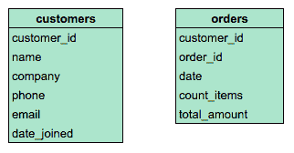
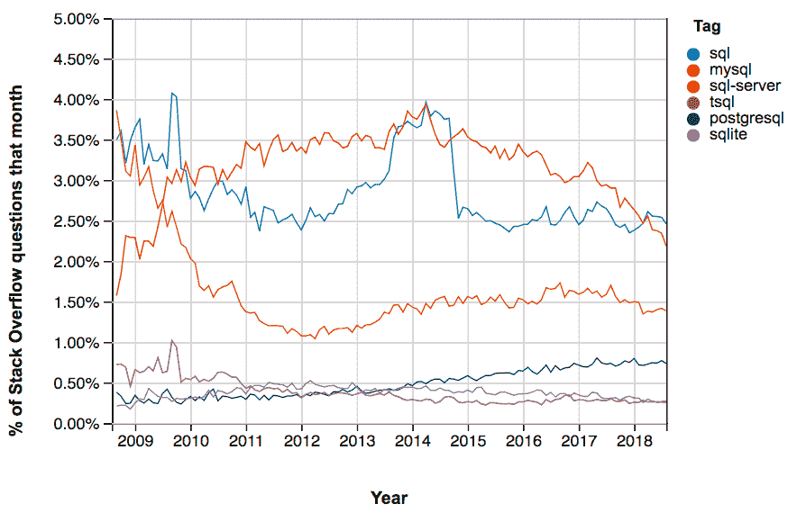

# SQL 服务器、PostgreSQL、MySQL...有什么区别？我从哪里开始？

> 原文：<https://web.archive.org/web/20221129045010/https://www.datacamp.com/blog/sql-server-postgresql-mysql-whats-the-difference-where-do-i-start>

**关系数据库**是一组表(包含行和列的数据集)，包含与数据库中其他表相关的信息。

下图包含一个示例关系数据库中两个表中列的信息。两个表都包含名为 customer_id 的列，这在两个表之间建立了关系。随着公司的发展和记录数以千计(或数百万计)的订单，将数据存储在单独的表中有助于优化空间和减小数据库的大小。



SQL 或结构化查询语言是与关系数据库交互的标准语言。使用 SQL，您可以对关系数据库中的数据进行查询或提问。[对于数据分析师、数据工程师或数据科学家来说，使用 SQL](https://web.archive.org/web/20221212193331/https://www.datacamp.com/learn/sql) 和关系数据库是一项无价的技能。

如果你已经开始寻找学习 SQL 的方法，你可能已经注意到了 SQL 的许多不同的方言，不同的方言之间有一些明显(或不明显)的区别。那么你从哪里开始呢？如果你以前没用过 SQL，哪个版本对你最有帮助？在本文中，我们将关注四种最流行的数据库管理系统——PostgreSQL、MySQL、SQLite 和 SQL Server——以及它们的 SQL 语法版本。

下面的堆栈溢出趋势图提供了一种对这些平台的讨论频率的感觉——每条线代表了关于 SQL 每个版本的所有堆栈溢出问题的百分比。



**MySQL** 一直是栈溢出问题中最受欢迎的 SQL 版本。排在第二位的是**微软 SQL Server** (包括 T-SQL，微软 SQL 方言的名称)，它始终比 **PostgreSQL** 和 **SQLite** 更受欢迎。这意味着，如果您有一个特定于这些系统的问题，您很可能会发现有人已经问过您的问题。

### 有什么区别？

PostgreSQL、MySQL 和 SQLite 使用非常相似的语法，下面突出了一些显著的区别。Microsoft SQL Server 在 SQL 语法方面有着最大的差异，并且有着其他平台所没有的各种各样的功能。下表突出了 SQL 平台之间基本差异的一些示例。

|   | SQL Server | 关系型数据库 | 一种数据库系统 | SQLite |
| --- | --- | --- | --- | --- |
| 挑选... | 选择[列 1]，[列 2] | 选择列 1、列 2 | 选择列 1、列 2 | 选择列 1、列 2 |
| 表中的数据区分大小写？ | 是，其中 name = 'John '和 WHERE name = 'John '是不同的 | 不，WHERE name = 'John '和 WHERE name = 'john '是一样的 | 是，其中 name = 'John '和 WHERE name = 'John '是不同的 | 是，其中 name = 'John '和 WHERE name = 'John '是不同的 |
| 使用引号 | 仅约翰一人 | name = 'John '或 name = "John " | 仅约翰一人 | name = 'John '或 name = "John " |
| 列和表的别名 | 选择 AVG(列 1)=avg1 | 选择 AVG(列 1)作为 avg1 | 选择 AVG(列 1)作为 avg1 | 选择 AVG(列 1)作为 avg1 |
| 使用日期 | GETDATE()日期部分() | CURDATE() CURTIME() EXTRACT() | 当前日期()当前时间()提取() | DATE(‘now’) strftime() |
| 窗口函数，即 OVER()，PARTITION BY() | 是 | 是 | 是 | 否(需要使用子查询) |

### 我从哪里开始？

对于很少或没有 SQL 经验，并且希望获得最广泛适用的技能的学生，我建议从 PostgreSQL 开始。尽管 MySQL 非常流行，但 PostgreSQL 可能是更好的选择，因为它的语法最符合标准 SQL。这意味着您可以轻松地将您的技能移植到其他数据库管理系统，如 MySQL 或 SQLite。例如，下面的查询从销售信息数据库中聚合数据。它包含一个连接、一个聚合函数和一个过滤器。该语法将在所有三个数据库系统中生成相同的结果。

```py
Select    
    c.customer_name,
    SUM(p.amount) AS total_sales
FROM customers AS c
    LEFT JOIN purchases AS p
    ON c.customers_id = p.customer_id
WHERE
    c.customer_location = 'USA'
GROUP BY
    c.customer_name; 
```

如果你打算在职业生涯中使用 Microsoft SQL Server，我建议你从学习 T-SQL/Microsoft SQL 开始。SQL Server 继续[保持相当大的市场份额](https://web.archive.org/web/20221212193331/https://insights.stackoverflow.com/survey/2018/#technology-databases)，并且是许多行业中重要的数据库管理系统。如果你不确定这两个对你来说哪个更重要，我建议浏览你所在领域的职位空缺，以确定特定角色或行业是否偏好特定的数据库系统。

### DataCamp 能有什么帮助？

在 DataCamp，我们目前为[提供两门 SQL](https://web.archive.org/web/20221212193331/https://www.datacamp.com/courses/tech:sql) 课程，涵盖了入门主题和 PostgreSQL 联接。我们正在开发一些激动人心的课程，涵盖 PostgreSQL 的中级和高级主题。我们还在开发几门 SQL Server 课程，包括 T-SQL/Microsoft SQL 入门课程，它将为您提供使用 SQL Server 的清晰基础。您可以查看我们的[课程路线图](https://web.archive.org/web/20221212193331/https://trello.com/b/BLplifUB/datacamp-course-roadmap)了解更多信息。

如果你想自己练习与 PostgreSQL 数据库交互，我推荐你在 [Kaggle](https://web.archive.org/web/20221212193331/https://www.kaggle.com/datasets) 上探索数据集。如果你发现了你感兴趣的东西，继续前进，导入到 [PostgreSQL](https://web.archive.org/web/20221212193331/https://www.postgresql.org/) (CSV 或 SQLite 文件将导入到 PostgreSQL)并开始探索！

### 来和我们一起教书吧！

您有兴趣在 DataCamp 上与我们的 300 万学生分享您的知识和专业技能吗？我们一直在寻找教师为我们不断增长的课程库做出贡献。我们的[课程愿望清单](https://web.archive.org/web/20221212193331/https://docs.google.com/spreadsheets/d/1iqtAIifjaSurddhSkg_hlf-VydL7L-I8ccUETgEu5Tw/edit?usp=sharing)强调了我们希望在未来几个月向学生提供的技能。你可以在这个[链接](https://web.archive.org/web/20221212193331/https://grnh.se/41d4fc591)这里申请。我们期待与您合作！