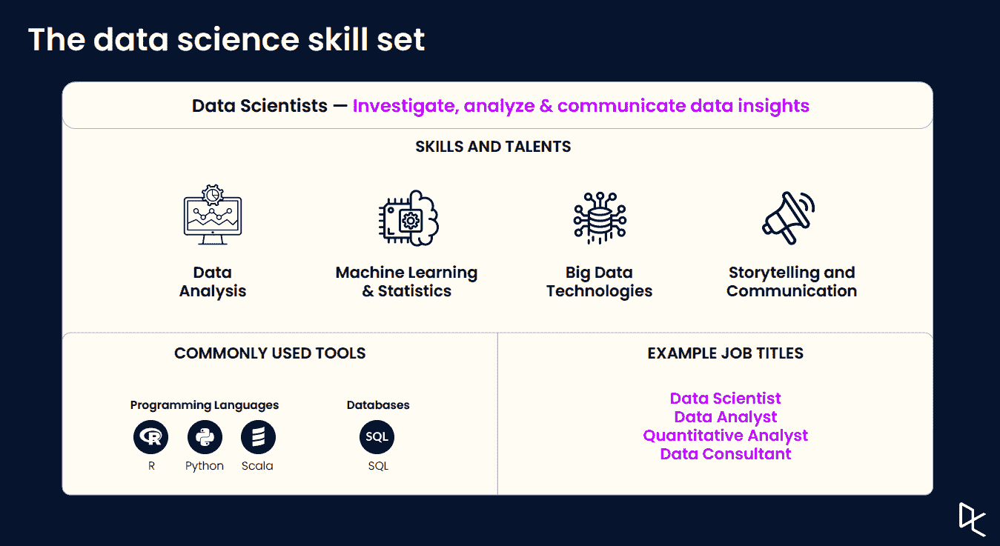
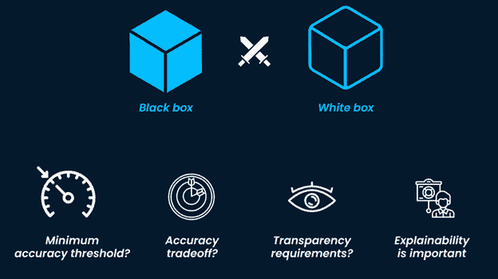
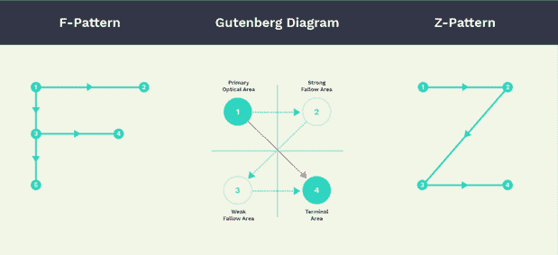
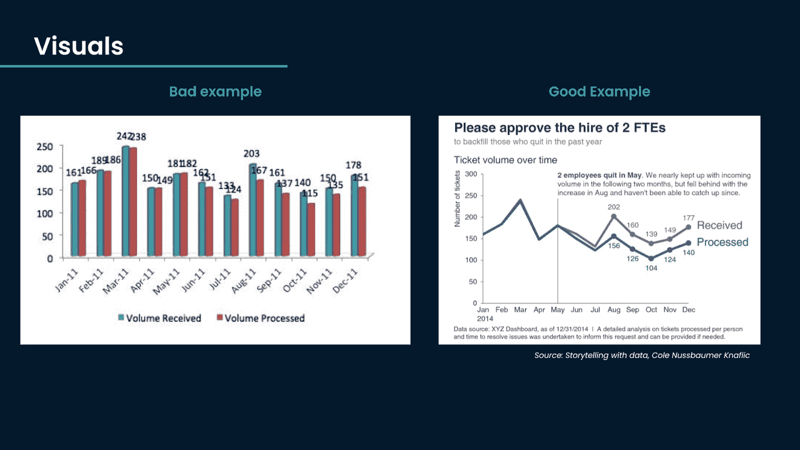

# 讲述更有影响力的数据科学

> 原文：<https://web.archive.org/web/20230101103227/https://www.datacamp.com/blog/storytelling-for-more-impactful-data-science>

讲述关于分析或模型的高质量故事的能力是采用数据科学家开发的解决方案的关键驱动力。在最近的网络研讨会中，德勤的机器学习主管 Gert De Geyter 和德勤的数据科学家 Bhavya Dwivedi 讨论了讲故事对于数据科学的重要性以及如何有效地讲故事。

## 讲故事实现更有影响力的数据科学

数据科学家以描述性、预测性和规范性分析的形式调查、分析和交流数据见解。概括地说，成为一名高效的数据科学家需要具备四个方面的能力:

1.  数据分析
2.  机器学习和统计
3.  大数据技术
4.  讲故事和交流

受过正规教育的数据科学家大量接触了前三种，但在有效沟通方面没有接受多少教育。在网络研讨会中，Gert 提到，通过对数据科学和人工智能会议进行粗略分析，从 2018 年到 2020 年，只有 1%的[数据科学和人工智能会议](https://web.archive.org/web/20220705000400/https://www.kdnuggets.com/meetings/index.html)讨论了讲故事。

尽管数据科学在教育中的代表性不足，但如果数据科学家想要在职业生涯中变得有效，他们必须学习这些技能。在[建立人工智能驱动的组织](https://web.archive.org/web/20220705000400/https://hbr.org/2019/07/building-the-ai-powered-organization)的过程中，研究人员发现，参与调查的成功实施人工智能的公司中，有 89%将超过一半的分析预算用于采用活动，其中包括沟通和培训。

数据素养在将数据科学与非技术利益相关方联系起来方面发挥着重要作用。这解释了为什么组织在沟通和培训上花费这么多。埃森哲发现，84%的企业高管认为人工智能是实现增长目标的必要条件。然而，许多高管没有接受过该领域的正规教育，这进一步增加了在整个组织中提高数据素养和有效沟通的需求。

随着人工智能变得越来越普遍，理解数据并将其正确地传达给受众对于在技术和非技术利益相关者的商业环境中推动价值至关重要。准确描述人工智能在特定背景下推动业务成果的潜力，对于让利益相关者做出导致积极业务成果的正确决策至关重要。一个非常常见的陷阱是夸大其潜力。

沟通对于扩大数据科学在组织中的影响是必要的，因为最终用户的接受以及高管和数据团队之间的协调是必不可少的。最有效的方式是讲故事。讲故事有助于观众与演讲者建立联系并记住内容。这种联系得到了[神经耦合理论](https://web.archive.org/web/20220705000400/https://www.pnas.org/content/107/32/14425)的支持。故事在我们记忆过去的方式中也发挥着重要作用——通过有效的故事讲述，我们帮助观众与我们这个演示者联系起来，并记住重要的内容，从而更好地理解模型或分析如何影响组织。

## 了解你的观众

有效讲故事的第一步是理解观众。一个好的故事需要让你与之交流的人能够理解。对受众的数据流畅性、组织的目标以及与您和组织的关系的深刻理解应融入故事中。

对这些问题的回答将有助于了解如何最好地讲述一个故事，以推动演示的预期结果。作为演示者，它们帮助我们知道强调什么，如何沟通以使观众理解内容，以及根据观众做出决策的动机，什么类型的信息将有助于达到预期的结果。当听众非常广泛时，确定演讲的目标听众是谁是非常重要的。

了解观众有助于告知故事讲述的顺序。用数据有效地讲述故事有三个关键部分:

1.  目标和信息，
2.  背景和
3.  论据，和流程。

一般来说，技术利益相关者更喜欢故事以争论开始，以结论结束。决策者喜欢信息以建议或结论开始，以论据和支持结束。

## 让故事变得透明和可操作

理解正在讲述的故事也很重要。IBM 发现 68%的商业领袖认为客户会希望人工智能在未来三年内给出更好的解释。使用黑盒或白盒模型的决策严重影响了解释的容易程度。

黑盒模型通常表现得更好，但是很难解释。白盒模型更简单，通常表现不佳，但更容易解释。如果可能的话，使用白盒模型会产生更好的故事。然而，一些高维问题是不可能使用白盒技术精确建模的。因此，业务环境在做出这个决定时很重要。

准确描述模型的输出代表什么也非常重要。许多模型描述了反应和预测之间的相关联系，而不是因果关系。向非技术利益相关者描述这种区别对于做出正确的数据驱动型决策至关重要，这种决策将为组织创造价值。一个模型的预测并不代表最好的商业决策，这需要包含在一个有效的故事中。如果有因果关系，这也必须准确描述。

## 如何讲述一个有效的故事

既然我们已经了解了关于听众和故事内容的关键考虑因素，我们就可以有效地讲述故事了。虽然有整本书都是关于这个主题的，但是我们将在这一节中讨论基础知识。

首先要考虑的是演示的形式:书面还是现场演示。书面演示让演示者更难控制观众如何理解信息，而现场演示中的演示者可以口头上为观众指明预期的方向。了解人们的注意力通常是如何工作的，可以澄清页面上内容的最佳位置，以引导预期的体验。

在 Cole Nussbaumer 的书《用数据讲故事》中，她强调了极简主义在可视化中的重要性。去除背景和不必要的标签，使用颜色来强调，通过将观众的注意力引向重要的东西，帮助我们讲述更清晰的故事。正如我们在她书中的以下示例中看到的，通过改进默认的 excel 图表(在左侧)，我们立即了解到，在两名员工辞职后，组织收到了超出其处理能力的数量。这个故事有助于 HR 了解需要再雇用两名员工以及这样做的确切原因。这种可视化讲述了一个强大的故事，有助于推动数据驱动的业务决策，而决策者只需付出很少的认知努力。

这是一个强有力的例子，展示了什么是好的故事。我们可以通过颜色、注释和图表选择来显著改变人们接近我们视觉化的方式。

## 让组织能够访问数据科学

我们通过许多大规模的高管调查看到，组织对数据科学和人工智能的重视程度有多高。要让这些系统变得可访问，首先要提高组织中的数据素养。数据素养允许非技术利益相关者轻松访问并做出数据驱动的决策，从而创造价值。展示这类信息的最有效方式是通过故事，在做出设计决策时，将观众和背景考虑在内，将注意力吸引到正确的地方。如果您想更深入地了解有效讲述数据科学的最佳实践，请务必观看[完整的网络研讨会](https://web.archive.org/web/20220705000400/https://www.datacamp.com/resources/webinars/storytelling-for-impactful-data-science)录像。

