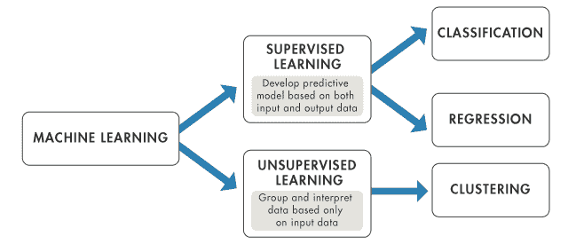
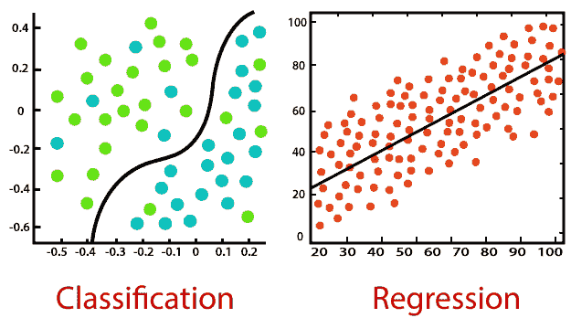
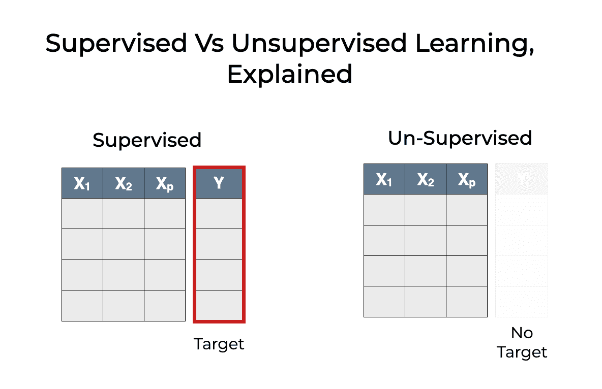
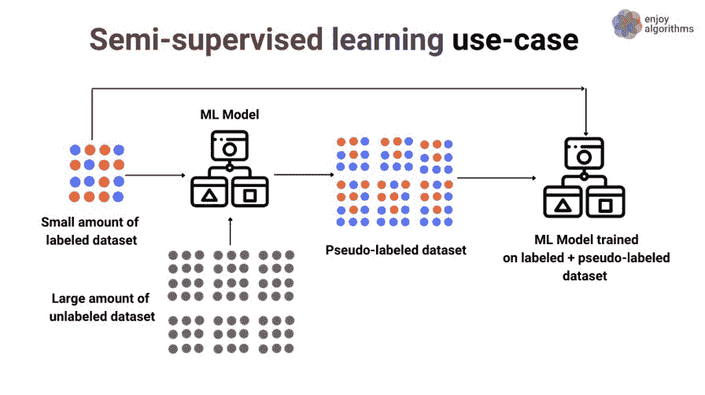
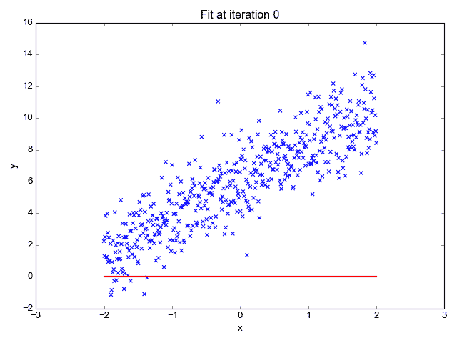
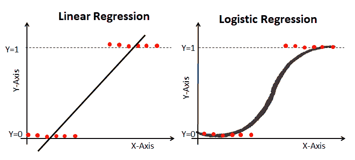
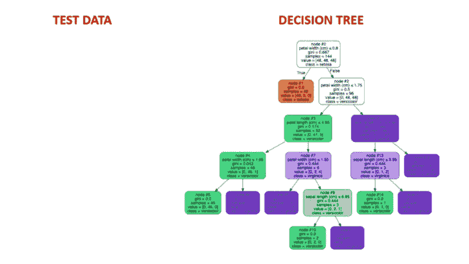
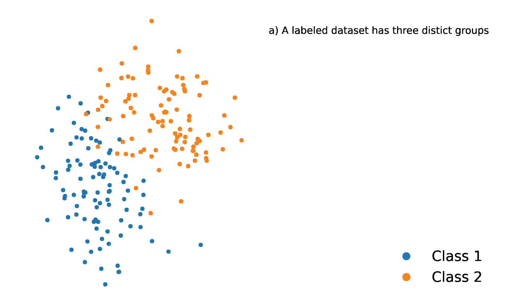
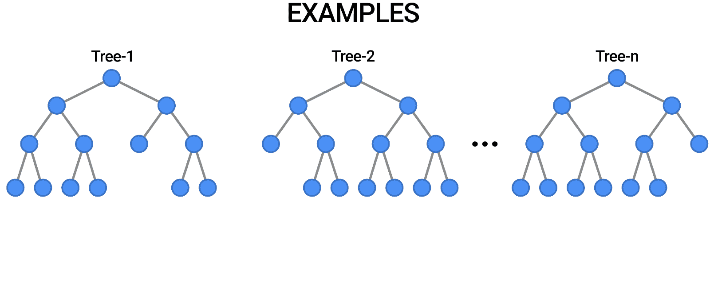
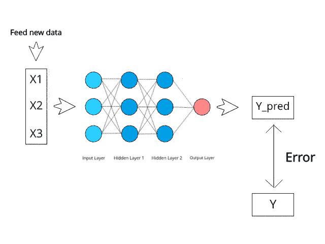

# 监督机器学习

> 原文：<https://web.archive.org/web/20221129041202/https://www.datacamp.com/blog/supervised-machine-learning>

## 介绍

监督机器学习是一种学习输入和输出之间关系的机器学习。输入被称为特征或“X 变量”，输出通常被称为目标或“y 变量”。包含特征和目标的数据类型称为标记数据。这是有监督和无监督机器学习之间的关键区别，这是两种主要的机器学习类型。在本教程中，您将学习:

*   什么是监督机器学习
*   有监督与无监督的机器学习
*   半监督机器学习
*   监督机器学习算法:

*   线性回归
*   决策图表
*   k 个最近邻居
*   随机森林
*   朴素贝叶斯

*   监督机器学习 Python 代码示例

## 什么是有监督的机器学习？

监督机器学习学习输入和输出数据之间的模式和关系。它是通过使用标记数据来定义的。标记数据是包含大量要素和目标示例的数据集。监督学习使用从数据集中学习特征和目标的关系的算法。这个过程被称为训练或调整。

有两种监督学习算法:

1.  分类
2.  回归



图片来源:[https://www . mathworks . com/help/stats/machine-learning-in-MATLAB . html](https://web.archive.org/web/20220926053251/https://www.mathworks.com/help/stats/machine-learning-in-matlab.html)

### 分类

分类是一种受监督的机器学习，其中算法从数据中学习，以预测未来的结果或事件。例如:

银行可能拥有包含信用历史、贷款、投资详情等的客户数据集。他们可能想知道是否有客户会违约。在历史资料中，我们会有特征和目标。

*   特征是客户的属性，如信用历史、贷款、投资等。
*   目标将表示特定客户过去是否违约(通常用 1 或 0 /真或假/是或否表示)

分类算法用于预测离散的结果，如果结果可以取两个可能的值，如真或假，默认或无默认，是或否，这就是所谓的二元分类。当结果包含两个以上的可能值时，称为多类分类。有许多机器学习算法可用于分类任务。其中一些是:

*   逻辑回归
*   决策树分类器
*   k 最近邻分类器
*   随机森林分类器
*   神经网络

### 

### 回归

回归是一种受监督的机器学习，其中算法从数据中学习以预测连续值，如销售额、工资、体重或温度。例如:

包含房屋特征的数据集，如地段大小、卧室数量、浴室数量、邻居等。和房屋价格，可以训练回归算法来学习特征和房屋价格之间的关系。

有许多机器学习算法可用于回归任务。其中一些是:

*   线性回归
*   决策树回归器
*   k 最近邻回归量
*   随机森林回归量
*   神经网络

图片来源:https://static . Java point . com/tutorial/machine-learniimg/regression-vs-class ification-in-machine-learning . png

## 监督与非监督学习

### 数据类型

有监督的和无监督的机器学习的主要区别在于，有监督的学习使用有标签的数据。标记数据是包含特征(X 变量)和目标(y 变量)的数据。

当使用监督学习时，该算法迭代地学习预测给定特征的目标变量，并针对适当的响应进行修改，以便从训练数据集中“学习”。这个过程被称为训练或调整。监督学习模型通常比非监督学习产生更准确的结果，但它们确实需要一开始就进行人工交互，以便正确识别数据。如果数据集中的标签没有被正确识别，监督算法将学习错误的细节。

另一方面，无监督学习模型以自主方式工作，以识别尚未标记的数据的固有结构。重要的是要记住，验证输出变量仍然需要一定程度的人工参与。例如，无监督学习模型可以确定在线购物的客户倾向于同时购买同一类别的多个项目。然而，人工分析师需要检查推荐引擎将项目 X 与项目 y 配对是否有意义。

### 使用案例

监督学习有两个突出的用例，即分类和回归。在这两项任务中，监督算法从训练数据中学习，以预测一些事情。如果预测变量是离散的，如“是”或“否”，1 或 0，“欺诈”或“无欺诈”，则需要分类算法。如果预测变量是连续的，如销售额、成本、工资、温度等。，则需要回归算法。

聚类和异常检测是无监督学习中两个突出的用例。要了解关于集群的更多信息，请查阅这篇文章。如果你想更深入地研究无监督的机器学习，请查看 DataCamp 的这个有趣的[课程](https://web.archive.org/web/20220926053251/https://www.datacamp.com/courses/unsupervised-learning-in-python)。您将学习如何使用 scikit-learn 和 scipy 对未标记的数据集进行聚类、转换、可视化和提取洞察。

### 目标

监督学习的目标是基于从标记的训练数据集学习的模型来预测新数据的结果。你可以预期的那种结果是以标记数据的形式预先知道的。无监督学习算法的目标是在没有明确标签的情况下从大量数据中获得洞察力。无监督算法也从训练数据集学习，但训练数据不包含任何标签。

### 复杂性

相对于非监督学习，监督机器学习是直接的。无监督学习模型通常需要大的训练集来产生期望的结果，这使得它们在计算上很复杂。



图片图片来源:https://www . sharpsightlabs . com/blog/supervised-vs-unsupervised-learning/

## 半监督机器学习

半监督学习是一种相对较新且不太受欢迎的机器学习类型，在训练期间，它将大量的未标记数据与少量的标记数据混合在一起。半监督学习介于监督学习(有标签的训练数据)和无监督学习(无标签的训练数据)之间。

半监督学习提供了许多现实世界的应用。很多领域都缺乏标注数据。因为它们涉及人类注释者、专门的设备或者昂贵、耗时的研究，标签(目标变量)可能很难获得。

半监督学习有两种类型:

1.  [直推式学习](https://web.archive.org/web/20220926053251/https://en.wikipedia.org/wiki/Transduction_(machine_learning))
2.  [归纳学习](https://web.archive.org/web/20220926053251/https://en.wikipedia.org/wiki/Inductive_reasoning)。



图片来源:https://www . enjoyalgorithms . com/blogs/supervised-unsupervised-and-semi supervised-learning

## 监督机器学习算法

在这一节中，我们将介绍监督机器学习的一些常见算法:

### 线性回归

线性回归是可用的最简单的机器学习算法之一，它用于学习根据训练数据集中的特征(自变量)预测连续值(因变量)。代表效果的因变量的值受自变量值变化的影响。

如果你还记得学生时代的“最佳拟合线”，这就是线性回归。根据身高预测一个人的体重是这个概念的一个简单例子。



图片来源:http://primo.ai/index.php?title=Linear_Regression

| 赞成的意见 | 面向连接的网络服务(Connection Oriented Network Service) |
| 简单，易于理解和解释 | 容易过度拟合 |
| 对于线性可分的数据表现异常出色 | 假设特征和目标变量之间呈线性关系。 |

### 逻辑回归

逻辑回归是线性回归的一个特例，其中目标变量(y)是离散的/分类的，例如 1 或 0、真或假、是或否、默认或无默认。概率的对数被用作因变量。使用 logit 函数，逻辑回归预测二元事件发生的概率。



要了解关于这个主题的更多信息，请查看 Python 教程中这篇关于 DataCamp 的优秀文章[了解逻辑回归。](https://web.archive.org/web/20220926053251/https://www.datacamp.com/tutorial/understanding-logistic-regression-python)

| 赞成的意见 | 面向连接的网络服务(Connection Oriented Network Service) |
| 简单，易于理解和解释 | 过度拟合 |
| 输出概率校准良好 | 体验捕捉复杂关系的困难 |

### 决策图表

决策树算法是一种类似概率树的结构模型，它不断地分离数据，以便根据前一组问题的结果进行分类或预测。该模型分析数据并提供问题的答案，以帮助您做出更明智的选择。

例如，你可以利用一个决策树，在这个决策树中，答案“是”或“否”被用来根据数据元素选择某种鸟，这些数据元素包括鸟的羽毛、飞行或游泳的能力、鸟喙的种类等等。



图片来源:https://aigraduate.com/decision-tree-visualisation-quick-ml-初学者教程/

| 赞成的意见 | 面向连接的网络服务(Connection Oriented Network Service) |
| 非常直观，易于解释 | 不稳定——训练数据的微小变化都会导致预测的巨大差异。 |
| 决策树不像一些线性模型那样需要大量的数据准备。 | 倾向于过度拟合 |

要了解更多关于 Python 中基于树的模型的机器学习，请查看 DataCamp 的这个[有趣的课程](https://web.archive.org/web/20220926053251/https://www.datacamp.com/courses/machine-learning-with-tree-based-models-in-python)。在本课程中，您将学习如何使用基于树的模型和集成通过 scikit-learn 进行回归和分类。

### k 个最近邻居

k-最近邻是一种统计方法，它评估一个数据点与另一个数据点的接近程度，以决定这两个数据点是否可以组合在一起。数据点的接近程度代表了它们之间的可比较程度。

例如，假设我们有一个图表，其中有两组不同的数据点，它们彼此非常接近，分别命名为组 A 和组 B。每组数据点将由图上的一个点来表示。当我们添加新的数据点时，该实例的组将取决于新点更接近哪个组。



来源:[https://towards data science . com/get-熟人-k-nearest-neighbors-ba 0 a 9 ECF 354 f](https://web.archive.org/web/20220926053251/https://towardsdatascience.com/getting-acquainted-with-k-nearest-neighbors-ba0a9ecf354f)

| 赞成的意见 | 面向连接的网络服务(Connection Oriented Network Service) |
| 对数据不做任何假设 | 训练需要很长时间 |
| 直观简单 | KNN 可以很好地处理少量的要素，但随着要素数量的增加，它很难准确预测。 |

### 随机森林

随机森林是建立在树上的算法的另一个例子，就像决策树一样。与只由一棵树组成的决策树不同，随机森林使用了许多决策树来做出判断，创建了本质上的树的森林。

它通过组合多个不同的模型来产生预测，并且可以用于分类和回归。



来源:[https://blog . tensor flow . org/2021/05/introducing-tensor flow-decision-forests . html](https://web.archive.org/web/20220926053251/https://blog.tensorflow.org/2021/05/introducing-tensorflow-decision-forests.html)

| 赞成的意见 | 面向连接的网络服务(Connection Oriented Network Service) |
| 随机森林可以轻松处理数据中的非线性关系。 | 因为有多棵树所以很难解释。 |
| 随机森林隐含地执行特征选择 | 对于大型数据集，随机森林的计算开销很大。 |

### 朴素贝叶斯

贝叶斯定理是用于计算条件概率的数学公式，朴素贝叶斯是该公式的应用。假设一个事件已经发生，那么这个事件发生的概率就是条件概率。

它预测每个类别的概率属于特定的类别，并且具有最高概率的类别是被认为是最有可能发生的类别。



图片来源:[https://www . kdnugges . com/2019/10/introduction-artificial-neural-networks . html](https://web.archive.org/web/20220926053251/https://www.kdnuggets.com/2019/10/introduction-artificial-neural-networks.html)

| 赞成的意见 | 面向连接的网络服务(Connection Oriented Network Service) |
| 算法非常快。 | 它假设所有特征都是独立的。 |
| 它简单且易于实现 | 该算法遇到了“零频率问题”，如果分类变量的类别不在训练数据集中，则它给出的分类变量的概率为零。 |

## 监督机器学习 Python 代码示例

在这一部分中，我们将使用 Python 中的 [scikit-learn](https://web.archive.org/web/20220926053251/https://scikit-learn.org/) 来训练一个伪数据集上的逻辑回归(分类)模型。点击这里查看完整的[笔记本](https://web.archive.org/web/20220926053251/https://colab.research.google.com/drive/1q-MuxXSRaVl866nSJ5kqG7HijBikt8h_?usp=sharing)。

```py
```

# create fake binary classification dataset with 1000 rows and 10 features

from sklearn.datasets import make_classification

X, y = make_classification(n_samples = 1000, n_features = 10, n_classes = 2)

# check shape of X and y

X.shape, y.shape

# train test split

from sklearn.model_selection import train_test_split

X_train, X_test, y_train, y_test = train_test_split(X, y, test_size=0.25, random_state=42)

# import and initialize logistic regression model

from sklearn.linear_model import LogisticRegression

lr = LogisticRegression()

# fit logistic regression model

lr.fit(X_train, y_train)

# generate hard predictions on test set

y_pred = lr.predict(X_test)

y_pred

# evaluate accuracy score of the model

from sklearn.metrics import accuracy_score

accuracy_score(y_test, y_pred)

```py
```

如果你想学习 R 中的监督机器学习，请查看 DataCamp 的 R 课程中的[监督学习。在本课程中，你将学习 R 编程语言中分类机器学习的基础知识。](https://web.archive.org/web/20220926053251/https://www.datacamp.com/courses/supervised-learning-in-r-classification)

## 结论

近年来，机器学习彻底改变了我们开展业务的方式。将机器学习与其他自动化策略区分开来的一项根本性创新，是对基于规则的编程的背离。由于有监督的机器学习技术，工程师可以在没有明确训练机器的情况下使用数据以某种方式解决问题。

在监督机器学习中，问题的预期解决方案对于未来数据可能是未知的，但可能是已知的，并在历史数据集中捕获，监督学习算法的工作是从历史数据中学习这种关系，以预测未来的结果、事件或值。

在本文中，我们对监督学习是什么以及它与无监督学习有何不同有了基本的了解。我们还回顾了监督学习中的一些常见算法。然而，有许多事情我们还没有谈到，如模型评估，交叉验证，或超参数调整。如果您想更深入地了解这些主题并进一步提高您的技能，请查看这些有趣的课程:

*   [使用 scikit-learn 进行监督学习](https://web.archive.org/web/20220926053251/https://www.datacamp.com/courses/supervised-learning-with-scikit-learn)
*   [R 中的监督机器学习](https://web.archive.org/web/20220926053251/https://www.datacamp.com/tracks/supervised-machine-learning-in-r)

分类和回归是监督学习的两种常见类型。分类用于预测离散的结果，如“通过”或“失败”、“真”或“假”、“默认”或“无默认”。而回归用于预测数量或连续值，如销售额、工资、成本等。

监督学习和非监督学习的主要区别在于数据。对于监督学习，您必须有标记数据，而非监督学习则不需要标记数据。

是的，时间序列预测是一种监督学习，我们在给定数字序列的情况下预测下一个值。这是一项受监督的学习任务。

两者都可以。这要看问题是怎么框定的。例如，预测文本文档的类型很可能是一项受监督的任务，而另一方面，如果用例是基于文档中包含的文本将相似的文档分组在一起，这种特定的用例称为主题建模，它是完全不受监督的。

对于聚类任务，你不需要标记数据，因此这是一个无监督的学习。

是的，算法完全不同。

线性回归、决策树、神经网络、支持向量机是监督学习的一些常用算法。