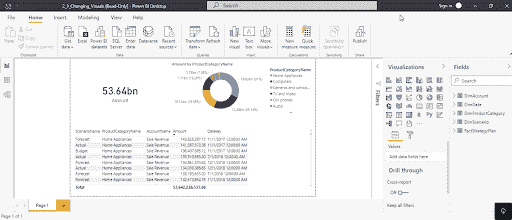
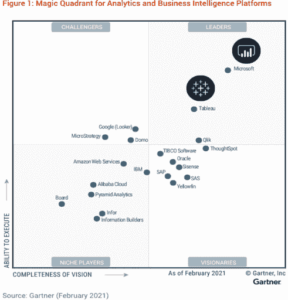
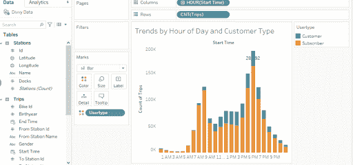
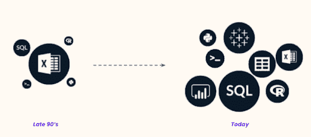
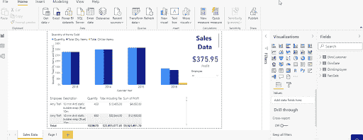
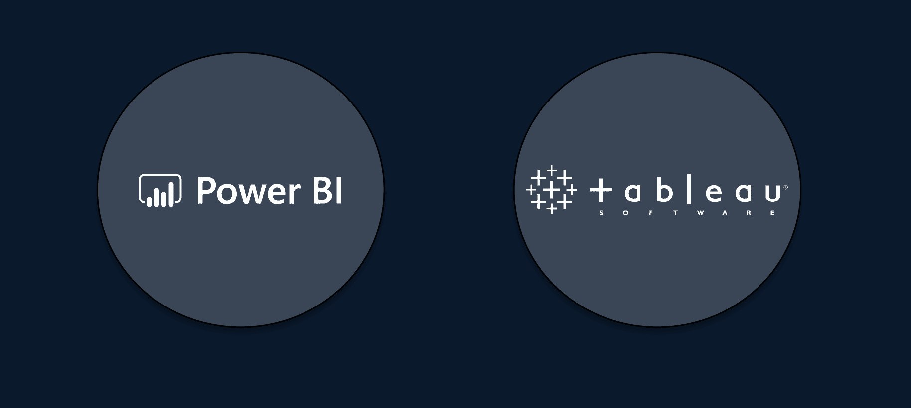
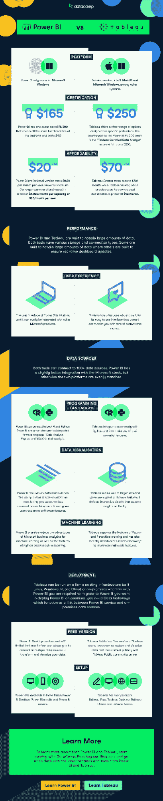

# 权力 BI vs Tableau:2023 年你该选哪个？

> 原文：<https://web.archive.org/web/20230101102851/https://www.datacamp.com/blog/tableau-vs-power-bi-infographic>

一个好的决策过程在果断和尽职调查之间找到了平衡，因此快速传达信息在各种业务中都受到高度重视。这个概念是数据可视化的核心；通常，一个图形或图表可以毫不费力地显示和解释成千上万的数字和文字。您可以使用 Tableau 和 Microsoft Power BI 等商业智能工具来创建这样的图表。

在本文中，我们来看看 Power BI vs Tableau，探索它们的相似之处和不同之处，以及它们的优缺点。看完之后，你应该有一个想法，哪一个适合你的需求。

*A chart in Power BI*

*A Tableau Visualization*

## 商业智能工具的背景

商业智能是一种先于数字时代的实践。这个词的第一次使用可以追溯到 19 世纪 60 年代，指的是一位美国银行家收集和分析数据，以获得可操作的见解，并在竞争中领先。

自那以后，事情发生了很大变化，现代企业可访问的数据量不断增加。由于这种数据的涌入，各种组织已经开发出软件来帮助企业理解大量的信息。

Tableau 于 2004 年首次推出，为用户提供了一种拖放的方式来创建交互式视觉效果和仪表盘。事实上，Tableau 有各种各样的产品可以帮助企业存储、分析和可视化数据。

几年后，微软 Power BI 问世，并于 2011 年首次面向公众推出。同样，重点是创建一个易于使用的界面，使非程序员能够组织和可视化数据。像 Tableau 一样，Power BI 包含几个不同的组件。你可以在另外的文章中找到更多关于[你能用 Tableau](https://web.archive.org/web/20230101105114/https://www.datacamp.com/blog/what-can-you-do-with-tableau) 做什么和[你能用 Power BI](https://web.archive.org/web/20230101105114/https://www.datacamp.com/blog/what-can-you-do-with-power-bi) 做什么的信息。

## 电源 BI 与 Tableau -相似性

让我们来看看 Tableau 和 Power BI 的一些相似之处:

### 它们非常受欢迎

根据 Gartner 的[数据，Power BI 和 Tableau 分别是市场上最受欢迎的商业智能工具。在 2500 多条评论中，Power BI 的平均评分为 4.4 星，略高于 Tableau，Tableau 在 2100 多条评论中的评分为 4.3 星。](https://web.archive.org/web/20230101105114/https://www.gartner.com/reviews/market/analytics-business-intelligence-platforms)

### 他们产生了各种不同的视觉效果

Tableau 和 Power BI 都可以帮助您以各种不同的方式展示您的数据。您可以选择可视化，包括条形图和折线图、树状图和地理图。在这两个平台上，您可以与这些可视化进行交互，例如将鼠标悬停在它们上面以获取更多信息和应用过滤器，您还可以将它们组合起来创建交互式仪表板。

### 他们可以连接到各种数据源

可视化您拥有的数据是一回事，但拥有一组输入也很重要。毕竟，企业倾向于从多个渠道收集数据。当比较 Tableau 和 Power BI 时，我们看到两者都可以连接到广泛的信号源。其中包括 MS Excel、CSV 和 JSON，这两个平台的付费版本可以让您访问 50 多个额外的数据连接器，如 Google Bigquery、Amazon Redsift 和 Salesforce。如果基础数据发生变化，可视化效果也会更新。

### 它们都是无代码和用户友好的

使用商业智能工具的部分吸引力在于，您需要的一切都触手可及。这使得 Tableau 和 Power BI 成为数据分析新手学习的理想工具。如果您是业务分析师，它们是您处理数据时需要的两个主要数据可视化工具。你可以通过 Power BI 或 Tableau 学习[成为数据分析师。](https://web.archive.org/web/20230101105114/https://www.datacamp.com/tracks/data-analyst-in-power-bi)

当然，您还可以使用其他工具，如下图所示。SQL、R 和 Python 也是很有价值的工具，在您的技能组合中增加一个或多个是非常有价值的。

### 其他相似之处

由于最近的更新，Tableau 和 Power BI 变得越来越相似。

例如，Power BI 曾经在数据准备方面表现出色，因为用户总是能够通过 Power Query 建模、清理和向数据集添加计算列。然而，随着 Tableau Prep 的推出，Tableau 最近也取得了自己的进展。

## 功率 BI 与 Tableau -差异

当比较 Tableau 和 Power BI 时，您应该考虑一些不同点，如果您正在考虑在您的业务或职业生涯中使用它们，这些可以使选择更容易。

### Power BI 仅适用于 Microsoft Windows

这可以使两个平台的选择更加容易。如果你经常在工作中使用 Mac，Tableau 会是更好的选择，因为你不能在 Mac 上使用 Power BI。

### 证书

Tableau 为特定职业提供了更广泛的选择。你可以在 [Tableau 网站](https://web.archive.org/web/20230101105114/https://www.tableau.com/learn/certification)上找到更多关于这些的信息，但基本上有助理、专家和分析师级别。

在 DataCamp，你还可以[成为 Tableau](https://web.archive.org/web/20230101105114/https://www.datacamp.com/tracks/data-analyst-in-tableau) 的数据分析师，参加一系列可以为 Tableau 认证做准备的课程。官方 Tableau 认证费用从 100 美元到 250 美元不等，视等级而定。

Power BI 拥有一项涵盖该平台所有主要功能的认证。还有 PL-300:微软 Power BI 数据分析师考试，165 美元。

认证之间的另一个关键区别是，虽然 Power BI 提供多种语言的考试，但 Tableau 目前只提供英语的认证专业考试。Tableau 助理考试有多种语言版本。

### 易于集成

由于 Power BI 是由微软开发的，如果您使用办公软件，它将更容易集成到您的工作空间中。同样，Tableau 最近被 Salesforce 收购，由于其原生集成，它们值得考虑。然而，两者都能够连接到像 Excel 和 Salesforce 这样的工具，所以这是一个更适合您的设置的问题。

### 编程语言

当谈到在不同的编程语言中使用每一种语言时，还有进一步的区别:

*   **Power BI** :可以使用 Power BI 中的数据分析表达式和 M 语言进行数据操作和数据建模。也可以使用微软 revolution analytics 连接 R 编程语言。
*   Tableau :你会发现 Tableau 有更多的选择和灵活性。除了更容易与 R 集成，您还可以用 Python、Java、C 和 C++实现 Tableau 软件开发工具包。

## Tableau vs Power 双价

值得更详细地了解这两个商业智能工具的价格，因为这可能是 Power BI 和 Tableau 之间最大的差异。

### 功率 BI

### （舞台上由人扮的）静态画面

*   **Tableau Public**-*Free*:这个是为在家用户准备的，可以用来创建连接到 Excel、CSV、JSON 文件的可视化。所有可视化将公开可见。
*   **Tableau 创建者** - *$70 每月/用户*:该选项面向个人和团队成员，提供对 Tableau 桌面、Tableau Prep Builder 的访问，以及 Tableau 服务器或 Tableau 云的一个创建者许可证。这为您提供了所需的可视化和分析工具。
*   **Tableau Explorer**-*【40 美元/月/用户*:此选项允许您通过自助分析来浏览数据。它附带一个 Tableau 云浏览器许可证。
*   **Tableau Viewe**r-*【15 美元/月/用户*:使用此选项，您只能查看现有的 Tableau 仪表盘和可视化效果。它附带一个 Tableau 云视图许可证。

作为快速参考，我们在下表中列出了这些详细信息:

| **许可证名称** | **费用(每月)** | **描述** | **许可证名称** | **费用(按月、按年计费)** | **描述** |
| Power BI 桌面 | 免费 | 允许您在本地机器上使用所有基本的 Power BI 功能 | Tableau Public | 免费 | 可用于创建连接到 Excel、CSV 和 JSON 文件的可视化效果。所有可视化将公开可见。 |
| 动力 BI Pro | $13.70(如果你有 Office 365 就免费) | 为个人用户提供访问权限，使他们能够构建自己的仪表板并连接到广泛的数据源。 | 表格总管 | $40 每用户 | 允许持有者根据同事提供的数据集构建仪表板和可视化效果。 |
| Power BI Premium(每用户) | $27.50 | 类似于 Power BI Pro，但增加了存储容量，允许您更频繁地刷新仪表板，并提供了一些附加功能。 | Tableau 创建者 | $70 | 提供所有资源管理器权限，以及创建数据源连接的能力。推荐个人用户使用。 |

上面的许可证是为创建仪表板的个人数据分析师设计的。如果您的公司有兴趣推出 Tableau 或 Power BI，您还需要考虑查看器许可证:

| 许可证名称 | 费用(每月) | 描述 | 许可证名称 | 费用(按月、按年计费) | 描述 |
| Power BI Premium(每容量) | 起于 6，858 美元 | 特定于企业的许可证，允许您组织中的每个人进行查看访问(编辑仪表板仍然需要 PBI 专业版许可证)。 | Tableau 查看器 | $15 每个观众 | 特定于企业的许可证，允许持有者查看同事创建的仪表板并应用过滤器。还提供定制的企业订阅计划。 |

## Tableau vs Power BI - Performance

Power BI 和 Tableau 都是为处理大量数据而构建的。这两种工具都有不同的存储和连接类型。有些是为了处理大量数据而构建的，而有些是为了确保实时仪表板更新而构建的。

然而，当涉及到非常大的数据集时，Tableau 往往比 Power BI 表现得更好。当数据集更有限时，Power BI 更快。同样，这取决于您将使用哪些工具，以及哪种工具最适合您。

## Power Bi 与 Tableau -用户界面

当谈到用户界面和 UX 时，这两者很少分开，只有个人偏好。两者都设计得直观易用，让用户有机会以一种熟悉的方式探索他们的数据。你将能够以相似的轻松程度学会任何一种。

## Power BI 和 Tableau 哪个好？

你可能想知道在 Tableau 和 Power BI 的比较中哪个更重要。但是，现实中，最好的选择真的取决于个人。这取决于您的需求和用途，以及您的业务需要什么。

如果你想提高技能，增加你对潜在雇主的价值，具备商务智能或桌面的工作知识是很好的。此外，两者都可以在 DataCamp 上学习，一旦你学会了如何使用一个，学习如何使用另一个就很简单了。你可以从[介绍力量 BI](https://web.archive.org/web/20230101105114/https://www.datacamp.com/courses/introduction-to-power-bi) 或者[介绍画面](https://web.archive.org/web/20230101105114/https://www.datacamp.com/courses/introduction-to-tableau)开始，然后从那里开始。

### 我该选哪个？

那么，应该选择 Power BI 还是 Tableau 呢？这两者之间肯定有很多重叠，最终都是有用的工具。对于一些用户来说，选择学习这两者可能是最好的选择。然而，对于那些希望在两者之间做出选择的人来说，必须考虑成本和可获得性的差异。

考虑您将使用的系统、您将处理的数据量、您是否需要在工作中使用编程语言，以及您是否希望获得认证。

DataCamp 提供了一系列课程，包括 [Tableau](https://web.archive.org/web/20230101105114/https://www.datacamp.com/data-courses/tableau) 和 [Power BI](https://web.archive.org/web/20230101105114/https://www.datacamp.com/data-courses/power-bi) 。我们的课程使您能够在不涉及任何安装的情况下练习每个工具的界面，并涵盖连接数据和构建仪表板等功能。

### 概括起来

|   | （舞台上由人扮的）静态画面 | 功率 BI |
| --- | --- | --- |
| 市场领导者？ | 981 号房 | 981 号房 |
| 各种不同的可视化？ | 981 号房 | 981 号房 |
| 可以连接各种数据源？ | 981 号房 | 981 号房 |
| 用户友好？ | 981 号房 | 981 号房 |
| 它能在什么类型的机器上工作？ | 苹果电脑和视窗电脑 | 仅限 Windows 电脑 |
| 认证？ | 多重 | 一个 |
| 更易于集成... | 销售力量 | 微软 |
| 费用 | 各不相同，但 Tableau 通常更贵 | 各不相同，但 Tableau 通常更贵 |

## 功率 BI 与 Tableau 对比

如果你正在寻找这两种神奇工具之间的差异的便捷指南，我们准备了一张信息图，其中列出了关键的比较点。

[*放大图像*](https://web.archive.org/web/20230101105114/https://res.cloudinary.com/dyd911kmh/image/upload/v1659686768/Marketing/Blog/Power%20BI%20vs%20Tableau%20Infographic.pdf)

想从事数据方面的职业？在 Microsoft Power BI 职业跟踪中发现我们的[数据分析师，您将立即为工作做好准备。](https://web.archive.org/web/20230101105114/https://www.datacamp.com/tracks/data-analyst-in-power-bi)

这个问题的答案完全取决于你的个人或业务需求。这两种工具都可以创建有用的数据洞察和可视化，并且每种工具都有一系列适合不同环境的功能。

它们之间没有太大的区别，但是很多人认为 Power BI 比 Tableau 更适合初学者。如果你不是数据分析师，Tableau 的学习曲线可能会稍微陡一点。然而，两者都很直观，并且有很好的用户界面。

两者都是很好的学习选择。如果您对商业智能的概念完全陌生，Power BI 可能是一个更温和的介绍。但是，如果您想要构建定制的仪表板，Tableau 也是一个不错的选择。

不，Tableau 和 Power BI 都不需要编码技能。然而，如果你想充分利用你的数据和可视化，那么掌握 R 编程、Python 和 SQL 的知识总是有用的。

通过我们的入门课程，您可以在大约 3-4 个小时内掌握这两种工具的基础知识。然而，要达到流利程度，可能需要相当长的时间，通常需要几个月。Tableau track 中的数据分析师大约需要 42 小时才能完成，而 Power BI 中的数据分析师大约需要 51 小时。

