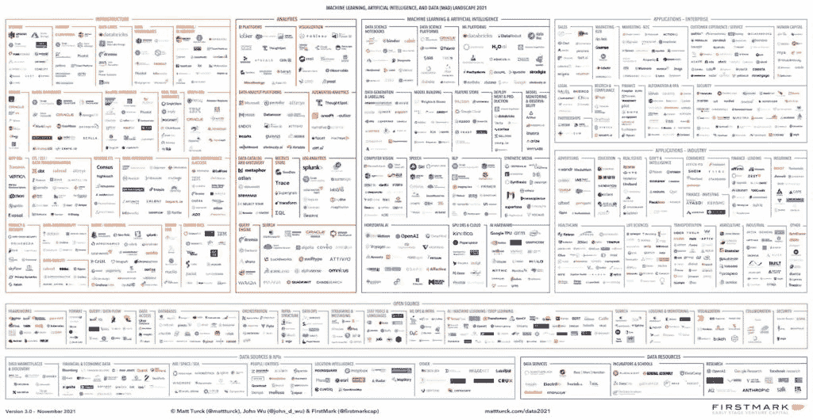

# 未来数据科学家的十课

> 原文：<https://web.archive.org/web/20230101103026/https://www.datacamp.com/blog/ten-lessons-for-future-data-scientists>

每天都有越来越多的人闯入数据科学领域。这种趋势有多种原因。首先，蓬勃发展的需求:根据领英 2020 年新兴工作报告，数据科学仍然是市场上增长最快的工作之一，尽管由于新冠肺炎疫情，该行业在 T2 有所放缓。

接下来，薪资预期: [Glassdoor 2020 统计数据](https://web.archive.org/web/20220518131947/https://taylor-mark110.medium.com/demystify-data-scientists-salaries-in-2020-8c772baa1e15)显示，一名入门级数据科学家的薪资约为 89000 美元。最后，显著的受欢迎程度:《哈佛商业评论》在一篇令人难忘的 2012 年[文章](https://web.archive.org/web/20220518131947/https://hbr.org/2012/10/data-scientist-the-sexiest-job-of-the-21st-century)中宣称数据科学家是 21 世纪最性感的工作。

如果你正在考虑在数据科学领域开始新的冒险，不要犹豫，大胆尝试吧。为了帮助您在旅程中取得成功，我们准备了 10 个课程和实用技巧，帮助您在数据科学的奇妙世界中导航并找到自己的位置。

1.  [揭开数据科学的神秘面纱](#demystifying-data-science)
2.  什么是编程语言？
3.  开始的时候，会很痛。但是要有耐心。
4.  你并不孤单:数据科学资源
5.  编码的艺术
6.  我从哪里开始学习？
7.  不断学习
8.  数据科学是达到目的的手段
9.  能力越大，责任越大
10.  结论:(你会)是数据，我的朋友

## 揭开数据科学的神秘面纱

数据科学经常与大数据、人工智能和机器学习等其他技术术语一起讨论，这使得人们很难清楚地了解数据科学到底是什么。

简而言之，数据科学是一个跨学科领域，它结合了科学方法、编程、算法和统计，从数据中提取知识。数据科学包含一套强大的工具和方法来处理数据，几乎可以在每个行业中使用。可能性范围很广，从基本的数据探索性分析和数据收集技术(如网页抓取)到一些最有价值的领域应用，如推荐引擎、计算机视觉、自动驾驶汽车和自然语言处理，机器学习和深度学习在这些领域发挥着关键作用。

虽然数据科学是具有 IT 或编程背景的专业人员的自然选择，但该领域正在快速发展，今天可以公平地说，每个人都受欢迎，无论你来自哪里。原因？随着数据科学发展成新的学科，了解某个领域或研究领域的基本方面至关重要。除了技术和编码技能，数据科学家应该始终拥有一定程度的业务领域专业知识，以便他们能够理解自己在做什么。这包括评估输入数据，评估见解的价值和有效性，以及辨别什么有意义，什么没有意义。

## 什么是编程语言？

学习编码是成为数据科学家的必要步骤。没有替代的答案，尽管[最近“无代码”数据科学和人工智能平台](https://web.archive.org/web/20220518131947/https://hbr.org/2021/11/how-no-code-platforms-can-bring-ai-to-small-and-midsize-businesses)激增。虽然这些解决方案允许非技术业务用户构建应用程序和软件(试图解决软件开发人员技能短缺的问题)，但数据科学家提供的能力、资源和思维模式几乎是不可替代的，至少目前是如此。

编程是数据科学家日常生活的核心部分。但是编程到底是什么呢？什么是编程语言？

编程是一种允许计算机系统自动执行任务的技术。为了与计算机交流，我们使用编程语言。编程语言是一组语义和语法规则，程序员用它们来编写指令(也称为算法)，让计算机完成特定的任务。

有数百种编程语言。在数据科学中，[最流行的两种编程语言是 Python 和 R](https://web.archive.org/web/20220518131947/https://www.datacamp.com/community/blog/when-to-use-python-or-r) 。这两种语言都非常适合您可能想到的任何数据科学任务。它们经常被描绘成竞争对手，但是更聪明的方法是把它们看作是互补的语言；可以联合起来利用他们的全部潜力和各自优势的联盟。幸运的是， [DataCamp 有一个很大的课程目录](https://web.archive.org/web/20220518131947/https://app.datacamp.com/learn/courses)，在那里你可以学习 Python 和 r

## 开始的时候，会很痛。但是要有耐心。

实话实说:学习编码很难。这句话适用于每个人，不管你的背景如何。是时候停止认为学习计算机科学或数学的人比文科毕业生更适合数据科学了。他们之间唯一的区别是前者可能在大学开始编程，而后者可能没有。但可以肯定的是，前者在某些时候也曾纠结于编码，尤其是在开始的时候。

编码就像去健身房。第一天会痛。你的肌肉感到疼痛和僵硬。你不习惯这种疼痛，躺在沙发上，你可能会想放弃。但是如果你不放弃，如果你坚持锻炼，情况会逐渐好转。几个星期后，你会发现自己打破了不久前似乎无法实现的健康里程碑。最终，去健身房会成为你日常生活的一部分，有一天你会意识到你喜欢健身。

对于大多数婴儿来说，需要 9 到 14 个月才能开始说话。幸运的是，编程语言比人类语言要简单和初级得多。如果你下定决心，你应该能在几个月内写出基本的脚本。就像去健身房一样，学习编程语言也要有耐心。

## 你并不孤单:数据科学资源

你的数据科学冒险将充满障碍。您可能会在编写代码时陷入困境，有时您会不明白为什么您的脚本不能正常运行，有时您甚至不知道如何开始某项数据科学任务。

不需要强调:你并不孤单。数据科学中最酷的事情之一——更广泛地说，编程生态系统——是互联网充满了可以帮助你克服可能遇到的挑战的资源和信息。你只需要问正确的问题来得到正确的答案。

以下是在您的数据科学之旅中可以为您提供帮助的资源列表:

*   程序员的 Delphi 预言。[栈溢出](https://web.archive.org/web/20220518131947/https://stackoverflow.com/)拥有超过 1600 万用户，是面向程序员的问答公众平台。如果您的 Python 或 R 脚本有问题，您可能最终会寻找堆栈溢出的解决方案。

*   教程:回归分析的烦恼？不知道从哪里开始抓取网页？阅读关于这个主题的教程是一个很好的起点。你可以在成熟的平台上找到广泛主题的综合教程，如 [DataCamp](https://web.archive.org/web/20220518131947/https://www.datacamp.com/community/tutorials) ，甚至 YouTube。

*   在线课程:如果你想成为一名学科专家，提高你的编码技能，或者只是想拓宽你的数据科学视野，一门课程可能是你正在寻找的。市场上有许多选项，包括 DataCamp。不要错过探索我们众多[课程](https://web.archive.org/web/20220518131947/https://app.datacamp.com/learn/courses)的机会。

*   数据科学书籍:书籍永远是信息的重要来源。在过去的几年中，越来越多的数据科学书籍已经出版，其中许多可以在网上免费找到。这里推荐:[奥莱利图书](https://web.archive.org/web/20220518131947/https://www.oreilly.com/search/?query=data&extended_publisher_data=true&highlight=true&include_assessments=false&include_case_studies=true&include_courses=true&include_playlists=true&include_collections=true&include_notebooks=true&include_sandboxes=true&include_scenarios=true&is_academic_institution_account=false&source=user&sort=relevance&facet_json=true&json_facets=true&page=0&include_facets=true&include_practice_exams=true)。

*   文档:最后但同样重要的是，我们需要提到包文档。文档是一个好的包或库的最重要的方面之一。文档是用户理解一个包的目的和它如何工作的主要来源。虽然这可能不是您最感兴趣的阅读，但在许多情况下，您的问题的解决方案将是一个包函数或参数，直到您阅读文档时才知道。

## 编码的艺术

经过几个月的编码训练，你会对自己的技能更加自信。在此期间，你将已经内化了许多过程、语法和命令。不经意间，编码自动化就会出现，让你的脚本更加流畅。

最终，你会开始看到大的图景:你会发现编码是一门艺术，例如，你会明白解决一个编程问题有很多方法，但有些方法比其他方法更有效。事实上，对效率的追求将指导您的工作，无论是编写还是运行代码。这将引导你学习新的编程策略。

你要着手解决的另一个重要方面是可读性。请记住，可读性不仅对可能必须处理您的脚本的其他程序员很重要，对您的“未来的您”也很重要通过对一些元素进行微小的修改，例如语法结构、变量和函数命名、间距和缩进，您的代码可以看起来更好，更容易理解。此外，对您的代码进行注释并记录您的函数将使您和其他读者的生活更加轻松。

## 我从哪里开始学习？

我们之前将数据科学定义为一个跨学科领域，它结合了科学方法、编程、算法和统计，以从数据中提取知识。是的，这是一个很大的开始。数据科学是一个要求很高的领域，新手很容易不知所措。如果这是一种安慰，要知道每个进入数据科学的人，不管他们的背景如何，都必须经历一定的学习过程:不可能马上知道所有的事情。

那么，从哪里开始呢？这个问题没有单一的答案，但是如果没有编程、统计和数学基础，你不会在职业生涯中走得很远。关于编程，除了 Python 或者 R，懂 SQL 当然是必须的。至于数学和统计，不用怕。这可能需要更多的时间，但你会在你自己的时间里学会什么是 p 值或人工神经网络。

与此同时，你可以做其他事情来增加你的知名度和被录用的机会。一个好主意是创建一个投资组合。在这方面，我们强烈建议尝试我们最近推出的 [DataCamp Workspace](https://web.archive.org/web/20220518131947/https://www.datacamp.com/workspace) ，这是一个编写代码的在线环境，通过分析有趣的数据集来应用您的技能，并构建您的数据科学组合。此外，你可以写关于该领域的文章，参加[数据科学竞赛](https://web.archive.org/web/20220518131947/https://www.datacamp.com/data-science-competitions)，或者参加数据科学认证。

## 不断学习

如果你认为找到你的第一份数据科学工作就是冒险的结束，那你就错了。数据科学是一个动态且快速发展的领域。今天流行的东西明天就可能过时。要了解数据科学的现状，请看这张图片。

来源:[第一马克](https://web.archive.org/web/20220518131947/https://mattturck.com/data2021/)

我们可以从这幅图像中得出两个结论。首先，数据科学是一个终身学习的过程。你必须不断学习，否则就有被淘汰的危险。

其次，不可能了解所有的编程语言和技术。所以要根据工作中的需要和自己最热衷的东西来选择学什么。

## 数据科学是达到目的的手段

如果你不能沟通你所从事的项目的相关性，作为一名数据科学家，你的工作还有什么价值？如果没人理解你在做什么，那么做深入彻底的数据分析又有什么意义呢？

数据科学的目标是从数据中提取见解，并应用这些见解来创造价值。换句话说，数据科学本身不是目的，而是创造价值的手段。良好的沟通、讲故事和创造性思维等技能是将洞察力转化为价值的关键。在这方面，如上所述，行业可以从非技术技能中受益。

## 能力越大，责任越大

这可能是最重要的一课。数据科学是我们生活中一些最有价值的应用和发明的背后。在数据科学和人工智能的颠覆性力量的推动下，我们的社会正在快速变化。

在这种不确定和深刻变化的背景下，保持批判和谨慎是很重要的。作为数据科学家，我们的日常工作包括处理大量数据、构建模型以及将见解转化为价值，但我们应该始终尝试超越我们的计算机，质疑我们工作的社会影响。

批判和负责是防止行业滥用和确保公平未来的第一步。

## 结论:(你会)是数据，我的朋友

为了结束这篇文章，我们想和你分享最后一课:数据科学不仅正在改变社会，而且还将永远改变你的生活。

我们生活的世界是复杂的。我们经常与超出我们理解范围的过程和系统打交道。为了解决这种复杂性，我们使用模型，模型可以被定义为对现实的简化描述。在这种情况下，数据科学提供了大量模型，可以帮助我们了解我们的世界。例如，数据库管理的关系模型可以非常方便地组织信息和描述复杂现象。社交网络模型可以帮助我们理解信息如何在人与人之间流动，或者开发我们所在网络的潜力。更令人着迷的是，推动机器学习应用的数学模型不仅对计算机学习至关重要，它们还提供了看待人类智能的新视角，从而更深入地了解我们自己。

最后，数据科学会改变你还有另外一个原因。我们生活在大数据时代。每天都会创建和收集大量数据。数据只不过是多种类型和来源的信息。阅读让我们从书本和其他源文本中学习，数据素养让我们从数据中学习。这是一件大事，因为数据提供了前所未有的方式来解决你可能想到的任何领域的研究，从医学、心理学和艺术到气候变化、天文学和历史。

数据科学为您提供了分析数据的工具，您对数据的处理完全依赖于您的想象力和好奇心。所以，让我们继续冒险吧:外面有一个完整的世界等着你去发现。从[在线培养你的数据技能](https://web.archive.org/web/20220518131947/https://www.datacamp.com/?utm_source=adwords_ppc&utm_medium=cpc&utm_campaignid=15903051076&utm_adgroupid=131825743429&utm_device=c&utm_keyword=datacamp&utm_matchtype=e&utm_network=g&utm_adpostion=&utm_creative=575358952028&utm_targetid=kwd-297372810188&utm_loc_interest_ms=&utm_loc_physical_ms=1007439&gclid=Cj0KCQiAi9mPBhCJARIsAHchl1zQdlQ2of_WoSWSK53iN8pxOzfXz_JrKXWkg2VX5QDB6ObP0R-mrXMaAk_kEALw_wcB)开始。