# 2022 年值得阅读的 15 本最佳数据机器学习书籍

> 原文：<https://web.archive.org/web/20221129041202/https://www.datacamp.com/blog/the-15-best-data-machine-learning-books-to-read-in-2022>

机器学习是数据科学中最热门的话题之一。这里有 15 本书可以帮助你进入这个领域或者成为专家

如果你对数据科学感兴趣，你可能听说过机器学习。机器学习是人工智能的一个分支，专注于开发在没有明确编程的情况下学习执行任务的算法。

从 Spotify 推荐到 Instagram 滤镜，机器学习已经嵌入到你的日常生活中。机器学习系统的使用越来越多，导致对具有机器学习技能的数据专业人员的需求不断增加。

如果你想在该领域入门或让你的专业知识更上一层楼，我们已经准备了一份 2022 年阅读的顶级机器学习书籍清单。现在，让我们开始吧！

## 初学者最好的机器学习书籍

### 奥利佛·西奥博尔德的《绝对初学者的机器学习》

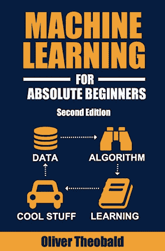

如果你是一个绝对的初学者，想学习机器学习的基础知识，这就是你要找的。[绝对初学者的机器学习](https://web.archive.org/web/20221212135821/https://www.amazon.com/Machine-Learning-Absolute-Beginners-Introduction-ebook/dp/B07335JNW1)致力于那些没有编码经验或数学背景的人。它也是用通俗易懂的英语编写的，这意味着你不会被技术术语弄得不知所措。

这本书的第三版于 2021 年出版，包括带测验的扩展章节、Python 编码模型的免费补充在线视频教程、可下载的编码练习和其他资源。总之，这是一本让每个人都能接触到机器学习的好书。

### 安德烈·布尔科夫的百页机器学习书

安德里·布尔科夫(Andry Burkov)写的长达 100 页的机器学习书籍是一本无需深入细节就能发现机器学习的完美书籍。总结像机器学习这样复杂而宽泛的学科的核心要素并不容易。这就是为什么安德烈·布尔科夫的工作更值得称赞。

读完这本书后，你将准备好讨论与机器学习相关的各种主题，包括监督和非监督学习，最流行的机器学习算法，以及建立和微调模型需要什么。数学、直觉和插图，全部在短短一百页内！

如果你对机器学习的理论基础感兴趣——我们强烈建议你报名参加我们的[了解机器学习](https://web.archive.org/web/20221212135821/https://www.datacamp.com/courses/understanding-machine-learning)免费课程。

### 约翰·保罗·穆勒和卢卡·马萨隆的《假人的机器学习》

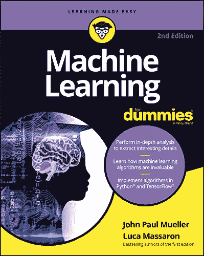

受欢迎的“假人”系列附有一本书，这总是好消息。由顶级数据科学家撰写的[傻瓜机器学习](https://web.archive.org/web/20221212135821/https://www.amazon.es/Machine-Learning-Dummies-Computer-Tech-dp-1119724015/dp/1119724015/ref=dp_ob_title_bk)为那些没有编码和数学背景的人提供了一个很好的起点。

这本书介绍了机器学习背后的关键概念和理论，以及它在现实世界中的应用，提供了许多例子，包括欺诈检测，搜索结果，实时广告，等等。它还提供了机器学习中使用的最常见的编程语言和工具的轻量级介绍。

### Python 机器学习导论:数据科学家指南

如果你有 Python 技能，并且正在寻求提高你的机器学习技能，这本书是给你的。[Python 机器学习简介](https://web.archive.org/web/20221212135821/https://www.oreilly.com/library/view/introduction-to-machine/9781449369880)是构建 Python 机器学习基础的最佳资源之一。

这本书由世界级数据科学家 Andreas C. Müller 和 Sara Guido 合著，教授基础机器学习概念和算法。它还介绍了机器学习工作流，并提供了从数据清理到特征工程等任务的最佳实践。书中介绍的所有概念都用例子说明，使用的是 Python 最流行的机器学习包 [scikit-learn](https://web.archive.org/web/20221212135821/https://www.datacamp.com/courses/supervised-learning-with-scikit-learn) 。

### 预测数据分析的机器学习基础:算法、工作实例和案例研究

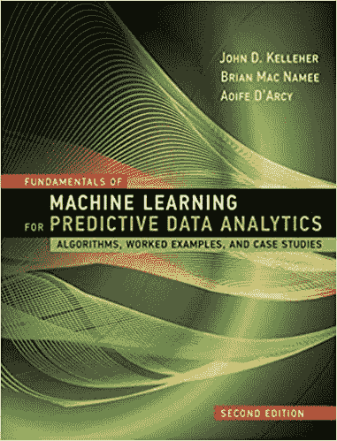

这本教科书特别适合有分析背景的专业人士。用于预测数据分析的第二版[机器学习](https://web.archive.org/web/20221212135821/https://www.amazon.com/Fundamentals-Machine-Learning-Predictive-Analytics-dp-0262044692/dp/0262044692/ref=dp_ob_title_bk)全面介绍了机器学习方法，包括理论和实践。

技术和数学解释得到了详细示例的支持，这些示例说明了机器学习模型在现实世界中的应用。例子从[价格预测](https://web.archive.org/web/20221212135821/https://www.datacamp.com/tracks/time-series-with-python)和[风险评估](https://web.archive.org/web/20221212135821/https://www.datacamp.com/courses/credit-risk-modeling-in-python)到[文件分类](https://web.archive.org/web/20221212135821/https://www.datacamp.com/tracks/image-processing)和[预测客户行为](https://web.archive.org/web/20221212135821/https://www.datacamp.com/courses/marketing-analytics-predicting-customer-churn-in-python)。第二版还加入了深度学习和机器学习技术的新章节，超出了预测分析，包括无监督学习和强化学习。

### 使用 Scikit-Learn、Keras 和 TensorFlow 进行机器实践学习:构建智能系统的概念、工具和技术

Python 机器学习从业者会喜欢这本书的。[使用 Scikit-Learn、Keras 和 TensorFlow 进行实际操作的机器学习](https://web.archive.org/web/20221212135821/https://www.oreilly.com/library/view/hands-on-machine-learning/9781492032632)是获得机器学习概述和提高实践技能的绝佳资源。

每章关注一种机器学习技术，提供了关于其背后的直觉、工作原理、用途的详细信息，以及大量 Python 示例。这本书不仅涵盖了机器学习，还涵盖了深度学习，为开发深度学习模型的两个最受欢迎的基于 Python 的框架 [Keras](https://web.archive.org/web/20221212135821/https://www.datacamp.com/courses/deep-learning-with-keras-in-python) 和 [Tensorflow](https://web.archive.org/web/20221212135821/https://www.datacamp.com/courses/introduction-to-tensorflow-in-python) 提供了很好的介绍。

### 数据挖掘:实用的机器学习工具和技术

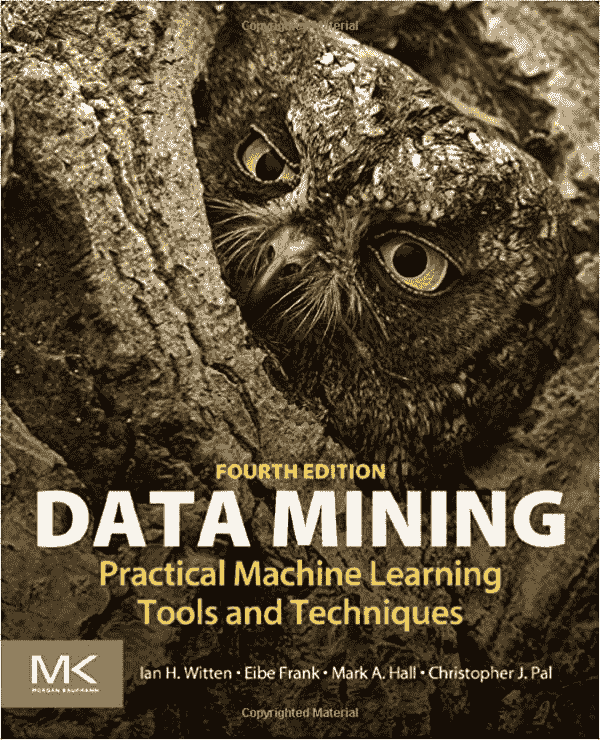

[数据挖掘:实用的机器学习工具和技术](https://web.archive.org/web/20221212135821/https://www.amazon.com/Data-Mining-Practical-Techniques-Management-dp-0128042915/dp/0128042915/ref=dp_ob_title_bk)提供了机器学习概念的简单介绍，以及在现实世界中应用这些技术的数学理论和实用建议。

这本书的第四版包括反映该领域最新发展的新章节，包括概率方法和深度学习。另外值得一提的是，这本书附带了作者自己的软件 WEKA，这是一个易于使用的交互式界面中用于数据挖掘任务的机器学习算法的综合集合。

### 德鲁·康威和约翰·迈尔斯·怀特的《黑客的机器学习》

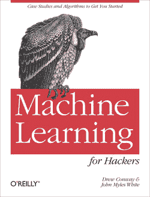

机器学习是一个复杂的话题，因为它需要对编码和数学有深刻的理解。如果你是一个有经验的程序员，想进入机器学习领域，但对数学不是很精通，这本书非常适合你。

[黑客的机器学习](https://web.archive.org/web/20221212135821/https://www.oreilly.com/library/view/machine-learning-for/9781449330514)抛开了数学理论。它通过实际操作的真实世界应用程序来处理这一学科，例如基于 Twitter 数据和电子邮件垃圾过滤器构建推荐系统。使用 [R 编程语言](https://web.archive.org/web/20221212135821/https://www.datacamp.com/learn/r)，每章专注于机器学习中的一个特定问题，包括分类、预测、优化和推荐。你可以在 DataFramed 播客上听作者之一德鲁·康威[讲述如何建立数据科学团队](https://web.archive.org/web/20221212135821/https://www.datacamp.com/podcast/building-data-science-teams)。

### 程序员的人工智能和机器学习:人工智能程序员指南

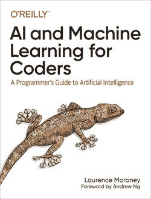

你是一名软件开发人员，正在寻求职业发展，进军人工智能和机器学习领域吗？这本书是一个理想的起点。[面向程序员的人工智能和机器学习](https://web.archive.org/web/20221212135821/https://www.oreilly.com/library/view/ai-and-machine/9781492078180)基于 Laurance Monorey 广受欢迎的人工智能课程，通过动手实践、代码优先的方法，提供了机器学习的简单介绍。每章都提出了一个实际的用例来说明机器学习派上用场的不同场景，例如，[计算机视觉](https://web.archive.org/web/20221212135821/https://www.datacamp.com/tracks/image-processing)，[自然语言处理](https://web.archive.org/web/20221212135821/https://www.datacamp.com/tracks/natural-language-processing-in-python)，以及[云计算](https://web.archive.org/web/20221212135821/https://www.datacamp.com/courses/understanding-cloud-computing)。

### 彼得·哈灵顿的《机器学习在行动》

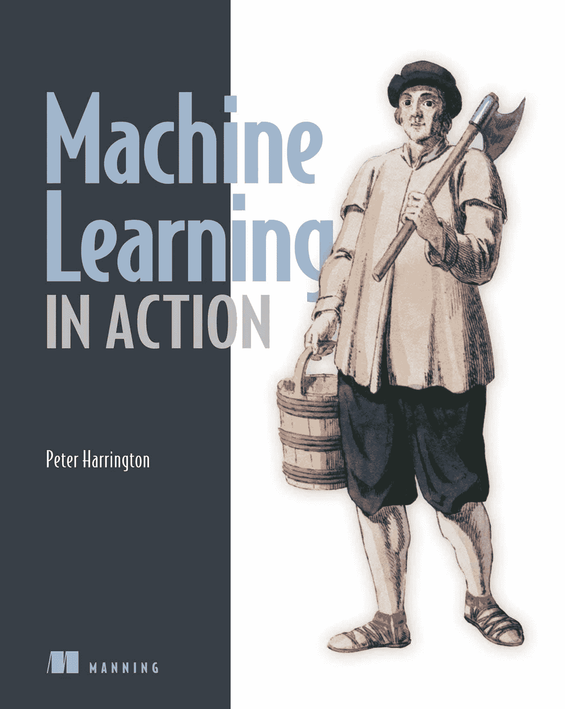

与前两本书一样，彼得·哈灵顿的《行动中的机器学习》为愿意学习机器学习基础的 IT 专业人士提供了一个极好的教程。它避免了学术语言，直接把你带到日常工作中使用的技术。书中充满了基于 Python 的例子来呈现核心的机器学习算法和任务，包括[数据预处理](https://web.archive.org/web/20221212135821/https://www.datacamp.com/courses/preprocessing-for-machine-learning-in-python)、[数据分析](https://web.archive.org/web/20221212135821/https://www.datacamp.com/data-courses/data-analysis-courses)和[数据可视化](https://web.archive.org/web/20221212135821/https://www.datacamp.com/data-courses/data-visualization-courses)。

## 高级机器学习书籍

### 人工智能:斯图尔特·鲁塞尔和彼得·诺维格的现代方法

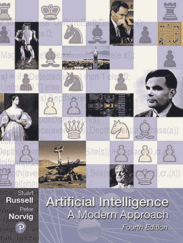

如果你只有一本关于人工智能的书，这是你应该有的。被认为是该领域的经典之作，[由世界级专家 Stuart Rusell 和 Peter Norvig 撰写的《人工智能:现代方法》](https://web.archive.org/web/20221212135821/https://docs.google.com/document/d/17i1AmXx3LIXnz3gJV_M05wRm2p0svgEJdwcnsIWPuac/edit)是对人工智能理论和实践最全面、最新的介绍之一。

该书的第四版提供了机器学习，深度学习，机器人，自然语言处理和许多其他技术概念的新的和扩展的覆盖范围，以及与该领域内在相关的其他主题，包括隐私，公平和道德人工智能。这本书还包括所有主要人工智能算法的伪代码版本，清晰统一地呈现。

### 机器学习:概率视角

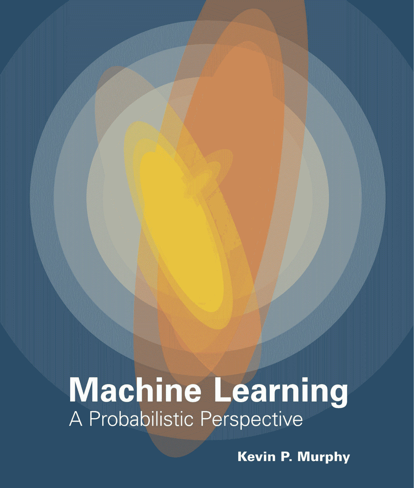

这本书于 2012 年出版，并获得了国际贝叶斯分析学会颁发的 2013 年 DeGroot 奖，对于那些对机器学习的数学基础感兴趣的人来说，这是一部经典。

谷歌研究科学家凯文·p·墨菲(Kevin P. Murphy)的《机器学习:概率视角》( Machine learning:a probability perspective)讲述了最常见的机器学习算法背后的数学过程。它提供了一个非正式但详细的关键主题的解释，如概率，最优化和线性代数。这本书包含最重要的算法，图像和例子的完整伪代码，涵盖了生物学，计算机视觉，机器人学等机器学习领域的应用。

### 使用 Python 的高级机器学习:通过掌握 Python 中的前沿机器学习技术来解决数据科学问题

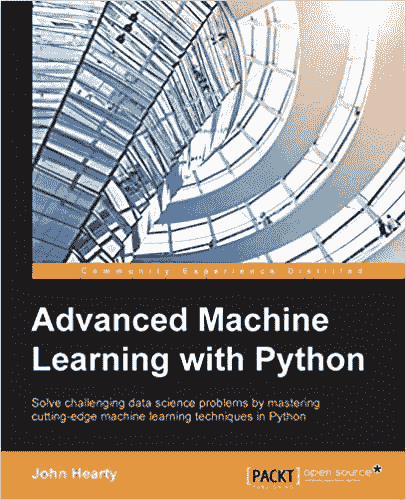

[使用 Python 的高级机器学习](https://web.archive.org/web/20221212135821/https://www.amazon.es/Advanced-Machine-Learning-Python-Hearty/dp/1784398632)是通过最相关和最强大的机器学习算法的指南。这本书有许多与现实世界的应用程序一起工作的详细代码示例。这本书涵盖了一些最具创新性的机器学习技术，以处理各种非结构化数据，包括图像、音乐、文本和金融数据，对于那些希望将其技能提高到一个新水平的机器学习从业者来说，这是一个极好的资源。

### 强化学习:理查德·萨顿和安德鲁·巴尔托介绍

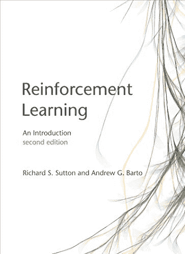

最近，机器学习领域中取得更多进展的一个领域是[强化学习](https://web.archive.org/web/20221212135821/https://www.google.com/search?q=reinformcement+learning+course+datacamp&rlz=1C5CHFA_enNL828NL828&sxsrf=ALiCzsZtxYaX1XF4wbJI0lFjAqDqw_DuwQ%3A1661338806049&ei=tgQGY8GsAoKG9u8P_M-UmAo&ved=0ahUKEwjB34qrqd_5AhUCg_0HHfwnBaMQ4dUDCA4&uact=5&oq=reinformcement+learning+course+datacamp&gs_lcp=Cgdnd3Mtd2l6EAMyBQgAEKIEMgUIABCiBDIFCAAQogQyBQgAEKIEOgcIABBHELADOgQIABANSgUIPBIBMUoECEEYAEoECEYYAFDJBVjBHmDYH2gBcAF4AYABmAKIAb0UkgEGMC4xNC4ymAEAoAEByAEIwAEB&sclient=gws-wiz)，即一种机器学习方法，在这种方法中，一个代理学习在一个环境中执行某些动作，从而获得最大回报。如果你对这个领域感兴趣，你应该读这本书。

尽管标题中出现了“简介”一词，[强化学习](https://web.archive.org/web/20221212135821/https://www.amazon.es/Reinforcement-Learning-Introduction-Richard-Sutton/dp/0262039249)还是对强化学习的关键思想和算法进行了全面的阐述。该书的第二版于 2018 年出版，包括了最近几年出现的新主题。虽然有些部分相当数学化，但这本书非常清晰，读起来很愉快。

### 统计学中的因果推理:朱迪亚·珀尔、玛德琳·格雷穆尔和尼古拉斯·p·朱厄尔的初级读本

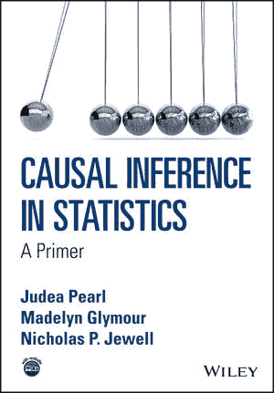

因果推理正迅速成为机器学习中的一个主要话题。这就是为什么这本书应该在这个名单上占有一席之地。由该领域的一些主要专家撰写，[统计中的因果推断](https://web.archive.org/web/20221212135821/https://www.wiley.com/en-us/Causal+Inference+in+Statistics%3A+A+Primer-p-9781119186847)包含对因果关系领域的全面介绍。

尽管其性质复杂，但这是一本令人愉快的书，充满了经典统计学的例子，以说明因果关系的必要性，以解决数据科学家经常遇到的决策困境。

谈论事故就是谈论事情发生的原因。从这个意义上说，这本书充满了发人深省的问题，将邀请你更深入地思考这个重要的问题。

## 成为机器学习专家

机器学习是数据科学中最有用的技能之一。有越来越多的机器学习书籍可以帮助你打入该领域或成为专家。除了书本，你还可以在 DataCamp 上互动学习。查看以下资源:

*   一个大的[课程目录](https://web.archive.org/web/20221212135821/https://www.datacamp.com/courses-all)涵盖了各种[机器学习课程](https://web.archive.org/web/20221212135821/https://www.datacamp.com/data-courses/machine-learning-courses)，有 Python 和 r 两种语言
*   订阅我们的[博客](https://web.archive.org/web/20221212135821/https://www.datacamp.com/blog)获取最新见解
*   订阅[数据框架播客](https://web.archive.org/web/20221212135821/https://www.datacamp.com/podcast)

查看我们的[数据科学小抄](https://web.archive.org/web/20221212135821/https://www.datacamp.com/cheat-sheet)，包括几份关于机器学习的小抄。