# 2022 年最值得阅读的 22 本数据科学书籍

> 原文：<https://web.archive.org/web/20221129052847/https://www.datacamp.com/blog/the-22-best-data-science-books-to-read-in-2022>

数据科学是当今发展最快的领域之一。世界各地的组织都在利用数据的力量来支持决策，并向其利益相关方提供创新体验。随着该领域的不断发展，数据科学书籍是从业者强化基础知识和跟踪最新技术和方法的好方法。

在本文中，我们准备了涵盖编程、统计、数据可视化等领域的顶级数据科学书籍的全面概述。我们开始吧！

## 初学者的最佳数据科学书籍

### 数据科学最佳编程书籍

#### 从零开始的数据科学:Python 的基本原则

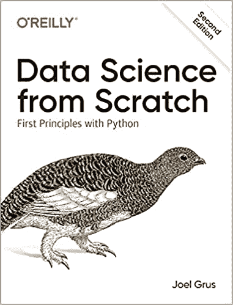

[从头开始的数据科学](https://web.archive.org/web/20220926065032/https://www.oreilly.com/library/view/data-science-from/9781492041122/)是一本适合初学者的完美书籍。在该书的第一版成功之后，Joel Grus 推出了一个修订版，使用 Python 3 编程语言涵盖了数据科学的基础知识。

围绕真正的数据科学问题，这本书通过从零开始实施解决方案，使用统计和编码的温和组合，涵盖了该领域中最重要的概念。

虽然你不需要事先知道如何使用 Python 来从这本书中获得你想要的所有结果，但是掌握一些该语言的知识会让你更容易学习。我们建议查看 DataCamp 的[Python 入门课程](https://web.archive.org/web/20220926065032/https://www.datacamp.com/courses/intro-to-python-for-data-science)以获得 Python 入门知识。

#### 杰克·范德普拉斯的《Python 数据科学手册》

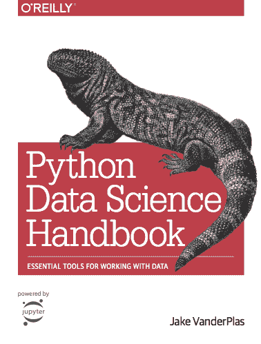

这本由 Jake VanderPlas 撰写的综合性书籍包含了使用 Python 数据科学生态系统中最流行的工具和包的分步指南。这包括 [Jupyter](https://web.archive.org/web/20220926065032/https://www.datacamp.com/cheat-sheet/jupyter-notebook-cheat-sheet) ，iPython， [NumPy](https://web.archive.org/web/20220926065032/https://www.datacamp.com/courses/introduction-to-numpy) ，[熊猫](https://web.archive.org/web/20220926065032/https://www.datacamp.com/community/blog/how-to-learn-pandas)， [scikit-learn](https://web.archive.org/web/20220926065032/https://www.datacamp.com/courses/supervised-learning-with-scikit-learn) ， [matplotlib](https://web.archive.org/web/20220926065032/https://www.datacamp.com/courses/introduction-to-data-visualization-with-matplotlib) 等库。你会通过例子了解到你可以很容易地复制。

[Python 数据科学手册](https://web.archive.org/web/20220926065032/https://www.oreilly.com/library/view/python-data-science/9781491912126/)自 2016 年发布以来，迅速成为 Python 中科学计算的参考。好消息是,[的修订版](https://web.archive.org/web/20220926065032/https://www.oreilly.com/library/view/python-data-science/9781098121211/)有望在 2022 年底问世。你还可以在[数据框架播客](https://web.archive.org/web/20220926065032/https://www.datacamp.com/podcast/data-science-astronomy-and-the-open-source)上听到杰克·范德普拉斯讨论这本书以及其他话题。

#### 数据科学的 r:导入、整理、转换、可视化和建模数据

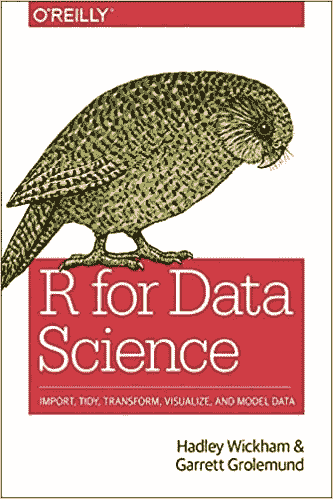

如果你是一个想要进入数据科学的 R 程序员，这本书是给你的。由 R 的明星 Hadley Wickham 和 Garret Grolemnd 撰写，带有用于数据科学的[R](https://web.archive.org/web/20220926065032/https://r4ds.had.co.nz/)，您将通过使用多功能 R 编程语言和 RStudio 获得该学科的基础知识。

这本书不是从头开始教授核心的统计概念，而是将重点放在如何使用 R 进行数据分析，以便您可以熟悉流行的软件包，如 [ggplot2](https://web.archive.org/web/20220926065032/https://www.datacamp.com/courses/data-visualization-with-ggplot2-1) 、 [tidyr](https://web.archive.org/web/20220926065032/https://www.datacamp.com/courses/reshaping-data-with-tidyr) 等等。总之，这是任何希望提高 r 基础知识的数据科学家的必读之作。

### 数据科学最佳统计书籍

#### 想想艾伦·b·唐尼的数据

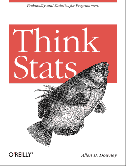

要将数据转化为见解，你不仅需要知道如何编码，还需要知道如何在概率和统计中应用不同的方法。学习统计学是成功成为数据科学家的一个重要方面。幸运的是，这本书展示了学习统计学可以是容易和有趣的。

Think Stats 是 Python 程序员对概率和统计的介绍。通过整本书的单个案例研究，您将了解在数据科学工作流程的不同步骤中使用的不同统计方法。

这本书广泛地涵盖了统计学中的关键概念，如描述性统计，分布，概率规则，可视化等等。你也可以看看 Allen Downey 关于 DataCamp 的书——《Python 中的探索性分析》。

#### 统计学习导论:在 R 中的应用

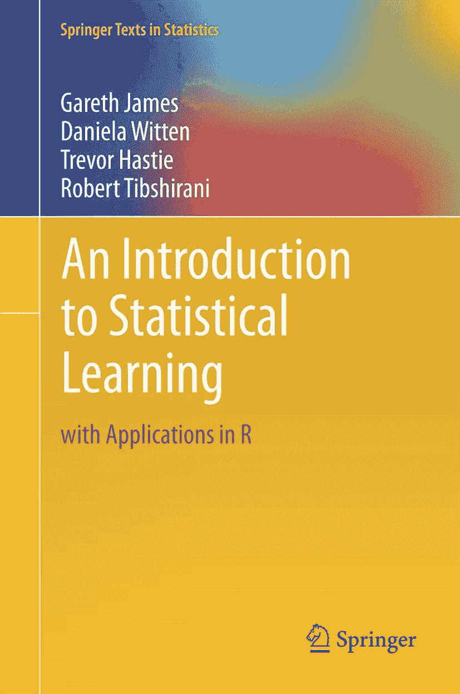

针对统计学家和非统计学家，[统计学习介绍](https://web.archive.org/web/20220926065032/https://www.statlearning.com/)提供了一个可访问的数据分析统计领域的概述。

它包括统计学习中一些关键主题的广泛和可访问的处理，包括线性回归，分类，重采样方法，收缩方法，基于树的方法，支持向量机，聚类等。还可以通过 R 技能赛道查看[统计基础知识，陪伴学习。](https://web.archive.org/web/20220926065032/https://www.datacamp.com/tracks/learn-statistics-with-r)

#### 数据科学家实用统计学:使用 R 和 Python 的 50 多个基本概念

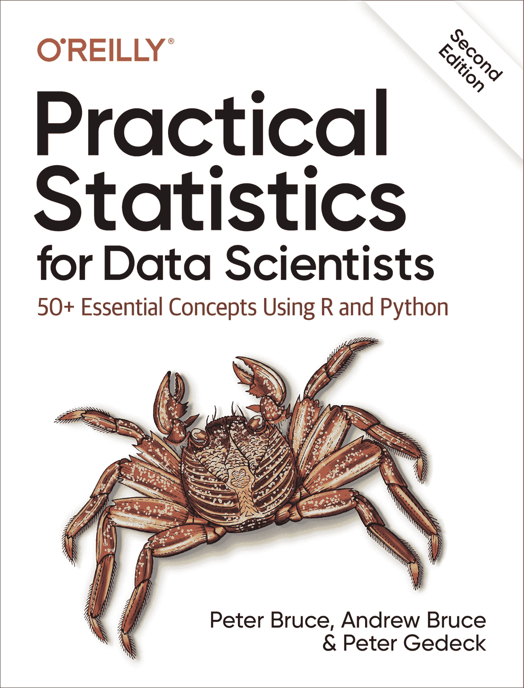

统计学是数据科学的核心部分。然而，正如这本书的作者所说，许多数据科学家缺乏统计学方面的正式培训。[数据科学家实用统计学](https://web.archive.org/web/20220926065032/https://www.oreilly.com/library/view/practical-statistics-for/9781492072935/)是填补这一空白的绝佳资源。

这本优秀的书提供了在数据科学中应用统计方法的实际指导。它侧重于如何避免在数据科学工作流中滥用统计数据，并就应用最广泛使用的统计技术提供战术建议。第二版增加了 Python 和 r 的新例子。

### 数据科学的最佳机器学习书籍

#### Python 机器学习导论:数据科学家指南

机器学习是数据科学工具包不可或缺的一部分。如果你是一个对学习机器学习感兴趣的 Python 程序员，这本书将为你提供你所需要的一切。

[Python 机器学习入门](https://web.archive.org/web/20220926065032/https://www.oreilly.com/library/view/introduction-to-machine/9781449369880/)是开启你机器学习之旅的理想书籍。由 scikit-learn 包的核心开发者之一编写，这本书广泛地涵盖了在 Python 的 [scikit-learn](https://web.archive.org/web/20220926065032/https://www.datacamp.com/courses/supervised-learning-with-scikit-learn) 包中构建机器学习模型的来龙去脉。

#### 使用 Scikit-Learn、Keras 和 TensorFlow 进行机器实践学习:构建智能系统的概念、工具和技术

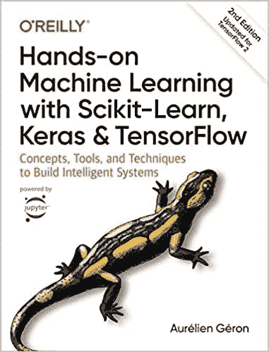

在这本[书](https://web.archive.org/web/20220926065032/https://www.oreilly.com/library/view/hands-on-machine-learning/9781492032632/)中，奥雷连·杰龙解释了基于流行的 Python 工具和框架的机器学习的基本技术，如 scikit-learn、 [Keras](https://web.archive.org/web/20220926065032/https://www.datacamp.com/courses/deep-learning-with-keras-in-python) 和 [Tensorflow](https://web.archive.org/web/20220926065032/https://www.datacamp.com/courses/introduction-to-tensorflow-in-python) 。

这本书采用了一种实用的机器学习方法，避免了许多机器学习模型背后的理论让你不知所措。它还解释了更高级的概念，如深度学习和神经网络。它在每一章中都包括练习，所以你可以很容易地实现这些例子并从中学习。

#### 安德烈·布尔科夫的百页机器学习书

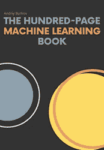

如果你只是对机器学习感到好奇，并希望在不进入技术细节的情况下开始学习这门学科，或者你是一名希望重温核心概念的机器学习从业者，你应该去找一本百页的机器学习书籍。

在仅仅 100 页的篇幅里总结如此复杂和广泛的学科是安德烈·布尔科夫成功的引人注目的努力。读完之后，你将能够理解不同类型的机器学习，预测模型的设计和部署中的核心概念，以及启动基于机器学习的应用程序需要什么。

学习机器学习理论基础的另一个重要资源是[面向所有人的机器学习](https://web.archive.org/web/20220926065032/https://www.datacamp.com/courses/machine-learning-for-everyone.)免费课程。

### 数据科学最佳数据可视化书籍

#### 阿尔贝托·开罗的功能艺术

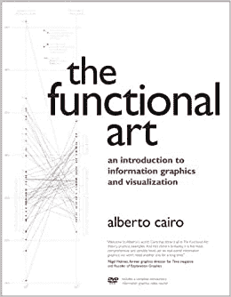

在[功能艺术](https://web.archive.org/web/20220926065032/http://www.thefunctionalart.com/)中，数据记者 Alberto Cairo 提出了如何使数据可视化背后的艺术功能化的问题。换句话说，如何在不牺牲有用性和洞察力的情况下创建漂亮的可视化效果。

从数据可视化最佳实践的详细概述出发，Cairo 总结了我们大脑的特性以及它们如何影响我们感知和记忆图形信息的方式。读完这本书后，你处理数据可视化的方式将永远改变。

#### 信息仪表板设计:显示数据进行一览式监控

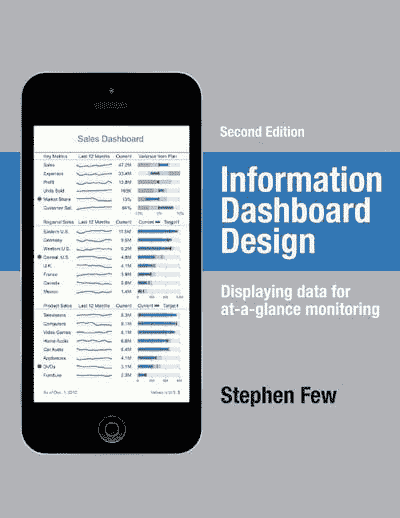

仪表板提供了一种最有效的方式来直观显示来自不同来源的数据。它们已经成为数据驱动型公司基础设施的核心元素，允许数据消费者和数据从业者同时访问数据和 KPI。然而，正如 Stephen little 在他著名的书中指出的那样，仪表盘的设计通常是笨重而低效的。

[信息仪表板设计](https://web.archive.org/web/20220926065032/http://www.stephen-few.com/idd.php)被认为是创建引人注目的仪表板的实用指南。从设计理论和数据可视化的原则出发，这本书继续介绍设计仪表板的行业最佳实践。它还提供了许多从理论到实践无缝过渡的例子。

#### 有效的数据叙事:如何用数据、叙事和视觉推动变革

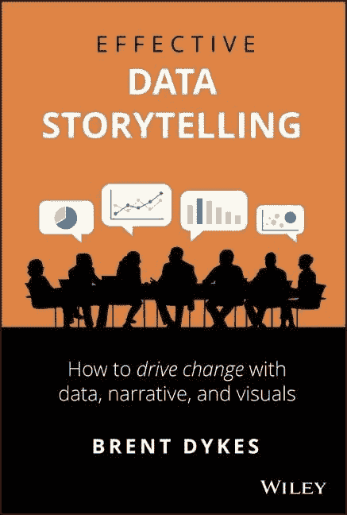

对于任何从事数据科学工作的人来说，与数据有效沟通的能力都是一项关键技能。数据可视化可以帮助我们完成这项任务。然而，如果我们想确保我们的数据洞察力转化为行动，我们需要考虑影响沟通的其他资源和元素。这就是[有效数据讲述](https://web.archive.org/web/20220926065032/https://www.effectivedatastorytelling.com/)背后的理念。

布伦特·戴克斯(Brent Dykes)出现在数据框架播客“[有效的数据故事讲述:如何将见解转化为行动](https://web.archive.org/web/20220926065032/https://www.datacamp.com/community/podcast/effective-data-storytelling-how-turn-insights-into-actions)”的一集中，在他的书中，戴克斯开发了一个数据故事讲述的框架，这种方法结合了三个核心元素:数据、叙事和视觉。总而言之，这本书是任何经常用数据交流的人的必备资源。

#### Sandra Rendgen 和 Julius Wiedemann 的信息图表

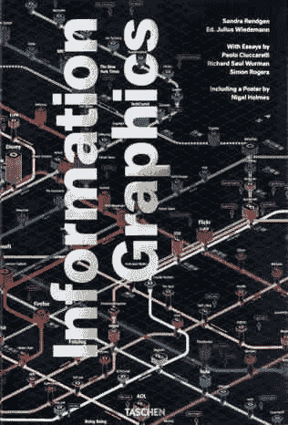

[信息图形](https://web.archive.org/web/20220926065032/https://www.taschen.com/pages/en/catalogue/graphic_design/all/44653/facts.information_graphics.htm)是一本精美绝伦的书，探索了大时代视觉传播的发展。它包含了一系列关于数据可视化历史的文章和 400 个跨越我们社会众多领域的图形项目的真实例子。任何对现代视觉传达的历史和实践感兴趣的人都会发现这很有用。

## 额外的数据科学书籍

### 凯西·奥尼尔的《摧毁数学的武器》

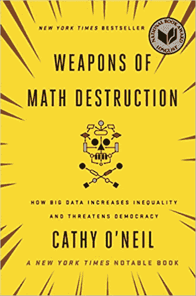

2016 年出版的[数学毁灭的武器](https://web.archive.org/web/20220926065032/https://www.penguinrandomhouse.com/books/241363/weapons-of-math-destruction-by-cathy-oneil/)为关于大数据的伦理影响的必要辩论铺平了道路。根据凯茜·奥尼尔的说法，算法正在延续有害的偏见。奥尼尔用真实的例子说明了这些偏见，他在书的最后指出，透明度和算法审计对于一个更加公平的未来是多么必要。听听凯茜·奥尼尔在[数据框架播客](https://web.archive.org/web/20220926065032/https://www.datacamp.com/podcast/weapons-of-math-destruction)上讨论她的书。

### 《每个人都在撒谎:大数据、新数据和互联网能告诉我们关于我们到底是谁》作者:Seth Stephens-Davidowitz

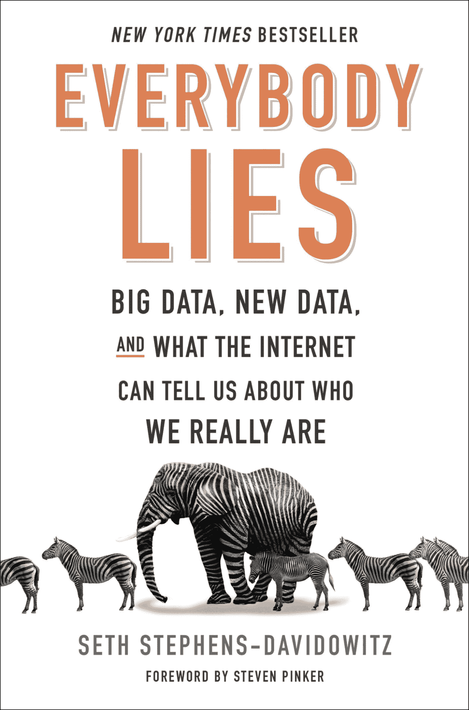

搜索引擎是大数据的最大驱动力之一。每天，我们仅仅通过在搜索引擎中键入查询就创造了数十亿兆兆字节的数据。这些信息可以揭示我们的行为、偏见和恐惧。在畅销书《每个人都在说谎》中，斯蒂芬斯-达维多维茨挖掘了谷歌搜索数据，并为经济、伦理、政治、种族、性别等问题提供了答案。

### 压迫的算法:搜索引擎如何强化种族主义

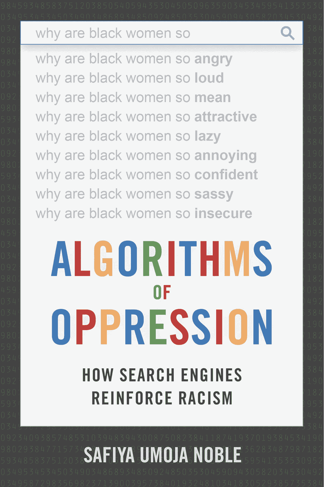

在[压迫算法](https://web.archive.org/web/20220926065032/https://nyupress.org/9781479837243/algorithms-of-oppression/)中，Safiya U. Noble 深入探究了搜索引擎如何向查询返回有偏见的结果。她认为，促进某些结果的激励措施，加上相对少数互联网搜索引擎的垄断地位，导致了种族主义和性别歧视算法，这些算法在互联网上延续了有害的陈规定型观念。这本书概述了数据科学在缓解和加强种族主义方面的力量。

### 比尔·弗兰克斯的《数据科学中的每个人都应该知道的 97 件关于道德的事情》

大多数引人注目的真实或感知的数据科学有害影响的案例并不是由不良意图驱动的。相反，它们通常是由于在设计和部署过程中缺乏仔细的伦理审查而导致的。数据科学领域的每个人都应该知道的 97 件道德问题的目标是确定道德最佳实践，以整合到数据分析工作流中。该书基于顶级数据科学从业者的观点。

### 赤裸裸的统计:从数据中剥离恐惧

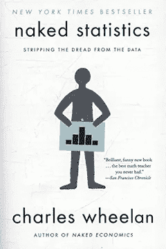

读者将会对这种发人深省和生动的观点感到高兴，这种观点阐述了当今公司如何利用统计数据来操纵我们的行为。著名作家 Charles Wheelan 平衡地结合了理论以及好的和特别是坏的实践的真实例子，为更好地理解我们的社会提供了线索，并为更好的统计素养提供了理由。

### 不要相信你的直觉:用数据获得生活中你真正想要的东西

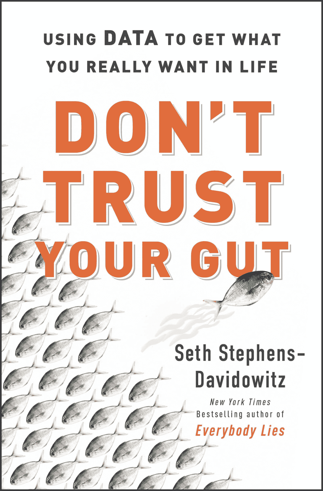

大多数关于大数据的书籍都倾向于关注数据在支持业务决策方面的应用，忽略了数据也可以帮助我们的日常生活这一事实。不要相信你的直觉来解决这个问题。它提供了一个实用指南，说明数据如何比直觉更好地支持我们一生中必须做出的大大小小的选择。

### 雅各布·艾森斯坦的《自然语言处理导论》

如果你已经有了编码和统计的基础知识，并且想把你的职业生涯转移到自然语言处理领域，这本书就是为你准备的。Jacob Einstein 的《自然语言处理简介》提供了 NLP 的技术视角，将当代机器学习技术与该领域的语言学和计算基础联系起来。

### 实践中的大数据:45 家成功公司如何利用大数据分析交付非凡成果

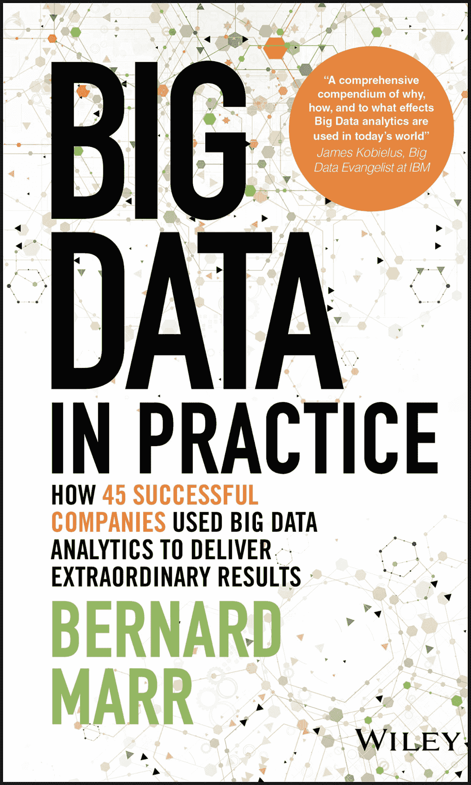

标题本身就说明了一切。畅销书作家 Bernard Marr 写了这本独特而实用的[书](https://web.archive.org/web/20220926065032/https://www.wiley.com/en-us/Big+Data+in+Practice:+How+45+Successful+Companies+Used+Big+Data+Analytics+to+Deliver+Extraordinary+Results-p-9781119231387)，讲述了 45 家最知名的公司如何在日常运营中使用大数据。他为寻求有效使用数据的其他组织提供了很大的启发，并揭示了在实施这些解决方案时要避免的一些陷阱。

### 《大数据:了解数据如何推动大企业》作者 Bill Schmarzo

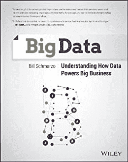

由大数据领域最杰出的专家之一撰写的《大数据:了解数据如何推动大企业发展》一书向我们全面概述了什么是数据以及如何使用数据。这本书充满了实用的技巧、想法、技术、方法和真实的例子，概述了大数据工具和技术如何加速商业价值。

## 了解有关数据科学的更多信息

我们希望你发现这个列表很有见地。书籍是学习数据科学的重要资源，无论是开始一个新的主题还是成为一名专家。但是如果你没有时间看书，我们还是会帮你的。查看以下资源并立即开始！

*   大型[课程目录](https://web.archive.org/web/20220926065032/https://www.datacamp.com/courses-all)，包含+380 门数据科学课程，涵盖编程、统计、可视化等。
*   订阅我们的[博客](https://web.archive.org/web/20220926065032/https://www.datacamp.com/blog)获取最新见解
*   订阅[数据框架播客](https://web.archive.org/web/20220926065032/https://www.datacamp.com/podcast)
*   查看我们的[数据科学备忘单](https://web.archive.org/web/20220926065032/https://www.datacamp.com/cheat-sheet)