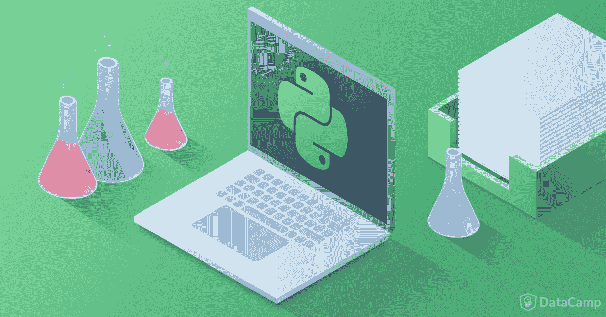
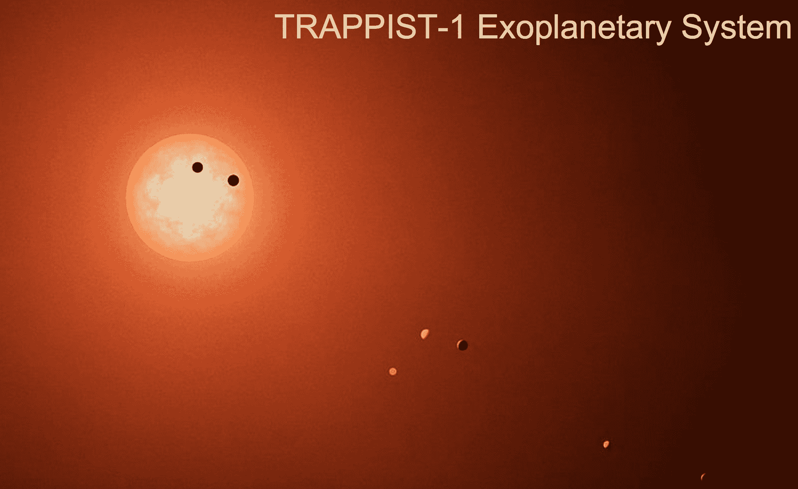
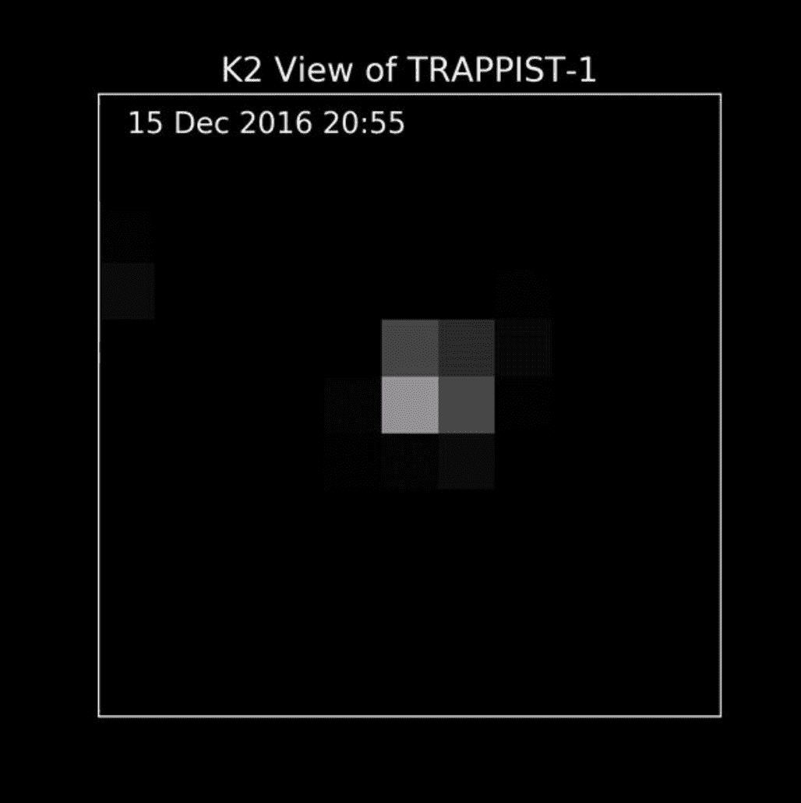
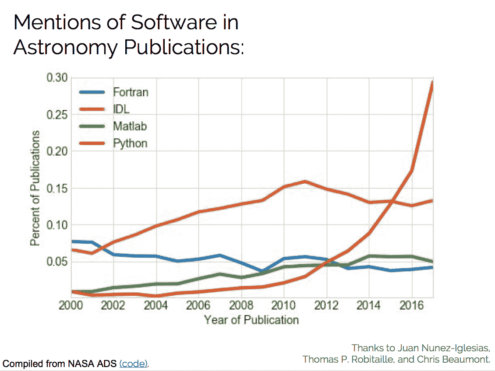
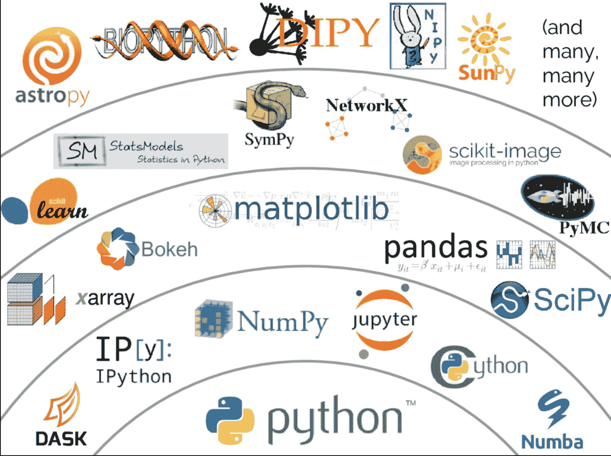
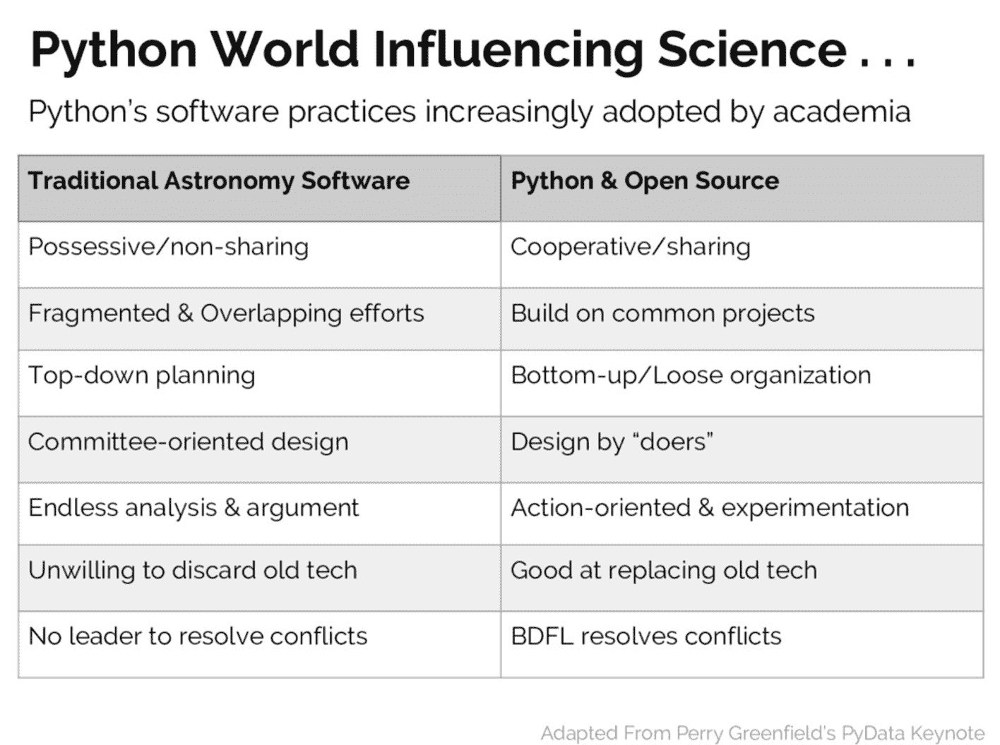
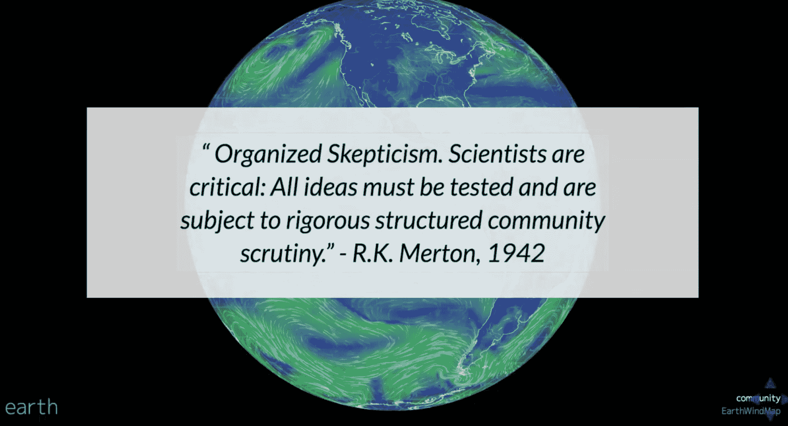
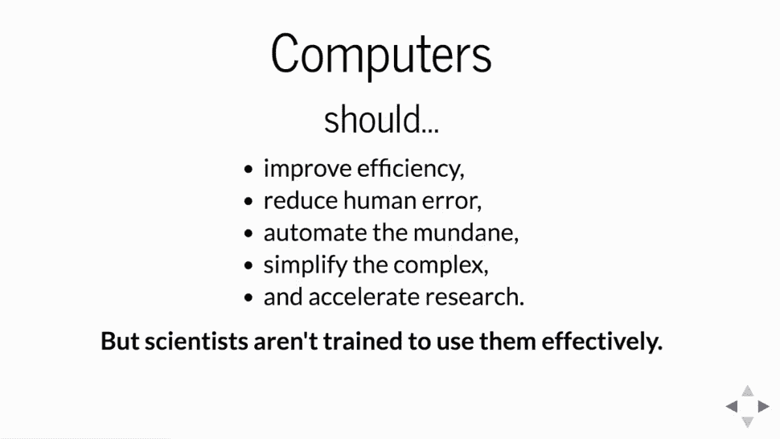

# 科学计算中的 Python 案例

> 原文：<https://web.archive.org/web/20230101103400/https://www.datacamp.com/blog/the-case-for-python-in-scientific-computing>

今年在 [PyCon 2017](https://web.archive.org/web/20221204130634/https://us.pycon.org/2017/about) 上，来自科学 Python 社区的人做了两个主题演讲:[Jake Vander plas](https://web.archive.org/web/20221204130634/https://www.youtube.com/watch?v=ZyjCqQEUa8o)博士讲述了为什么科学家已经并且应该拥抱 Python；[Kathryn Huff](https://web.archive.org/web/20221204130634/https://www.youtube.com/watch?v=kaGS4YXwciQ&t=683s)博士讲述了 Python 社区如何帮助科学界，以及为什么他们应该这样做。这两个讲座结合在一起，对科学研究和 Python 编程如何相互补充，为什么当今许多在职科学家采用 Python 会得到最好的服务，以及 Python 社区为什么以及如何能有效地帮助科学研究，提出了一个整体和一致的观点。

## Python 在科学计算中意想不到的效果

杰克·范德普拉斯是西雅图华盛顿大学科学研究所的天文学家。他还活跃于更大的科学 Python 社区，为 SciPy、scikit-learn 和 altair 等 Python 包做出了贡献。

大多数人想象天文学家在巨型望远镜的底座上，凝视着镜头，然而杰克向我们保证，大多数天文学家在他们的职业生涯中从未通过望远镜观察过，而是将大部分数据收集时间用于使用数据库查询。但是当谈到天文学家的计算技能时，数据库真的只是冰山一角，这是他们面临的任务所必需的，杰克举了几个有启发性的例子。以下面的 [*TRAPPIST-1 系外行星系统*](https://web.archive.org/web/20221204130634/https://en.wikipedia.org/wiki/TRAPPIST-1) 的可视化为例:

现在，人们很容易认为这是一幅真实的照片，但实际上这是艺术家的解释:这不是原始数据。这颗行星的存在是通过一颗日蚀恒星并使用这种系统的统计模型对以下和后续数据(以图像的形式，数据来自 Ethan Kruse)进行推断的:

所有这些推断和统计分析是如何完成的？当然是用 Python。并通过“令人难以置信的复杂的系统统计模型”；此外，杰克告诉我们，找到这类系统“归结为在复杂的数据分析管道中编写统计代码”。

这是杰克向我们展示的在其数据处理和分析管道中使用 Python 编程语言的几个科学项目(天文学)之一。值得注意的是，所有这些项目不仅是用开源编程语言编写的，而且它们都在 github 上有自己的代码，例如，[开普勒](https://web.archive.org/web/20221204130634/https://github.com/KeplerGO)和 [JWST](https://web.archive.org/web/20221204130634/https://github.com/STScI-JWST) ，后者试图发现其他行星大气中的气体，以嗅出其他恒星周围行星的化学成分，以帮助找到其他生命形式的化学特征——这些项目是用 Python 编写的，托管在 github 上，并使用 Jupyter 笔记本等工具。

这可能是轶事吗，即 Python 中的少数项目是例外而不是规范？嗯，不是在天文学上。杰克做了一项分析，证明使用 Python 的出版物稳步上升:

看看那条蟒蛇*曲棍球棒*！所以我们已经确定*科学家越来越多地使用 Python，但是*为什么*他们使用 Python？*

## 科学计算中 Python 的争论

杰克问道:*为什么 Python 是科学中如此有效的工具？*

### 1.与其他语言的互操作性。

*Python 作为粘合剂:*历史上，许多工作中的科学家都有笨拙、复杂和本质上荒谬的数据管道来将它们从实验和/或数据转换成可交流的结果，包括数据库查询、命令行 foo、使用专业或专有软件，直到数据可视化工具。杰克·范德普拉斯引用了戴夫·比兹利的话，部分原因是戴夫说得好:

> 科学家...使用各种系统，包括模拟代码、数据分析包、数据库、可视化工具和自主开发的软件——每一种都为用户提供了一套不同的界面和文件格式。因此，科学家可能会花相当多的时间试图让所有这些组件以某种方式一起工作。

Python 可以与大多数你想在科学研究中使用的工具进行交互操作:它是一种粘合剂。正如杰克所说，Python 被用来“将人们正在使用的工具大杂烩粘在一起；高级 Python 语法包装了这些低级 C/Fortran 库。

### 2.“包含电池”+第三方模块

科学家们蜂拥使用 Python 的另一个原因是(为什么那些还没有“应该”使用 Python 的人)

1.  它有很多“包括电池”和
2.  对于那些没有的，有一个巨大的科学 Python ( `SciPy`)生态系统可以用作第三方模块。

“包括电池”允许你抓取网页，启动网络服务器，使用文件系统和数据库，读取 jsons 和更多！

然而，“第三方”模块才是真正令人兴奋的地方。示例包括但不限于:

*   数组计算的数值:
*   Python 之上的 IPython 和 Jupyter for IDE，以及编写科学文档和就研究/成果进行交流和协作的手段；
*   用于缩放和分布式计算的 Numba 和 Dask
*   熊猫换数据框；
*   例如，用于数据可视化的 Matplotlib 和 Bokeh(Python 本身有一个完整的 dataviz 库生态系统)；
*   sci kit-为机器学习而学习；
*   用于创建、操作和研究复杂网络的 NetworkX
*   Scikit-image 用于图像处理；
*   马尔可夫链蒙特卡罗的 PyMC
*   这样的例子不胜枚举。

正如 Jake 所说，“如果你有问题要解决，你很可能会找到一个库来帮助你，它可能就在 github 上！”

### 3.简单和动态的性质

Python 相对容易编写，尤其是相对于 C 等语言而言，正如 Jake 所说，“在 Python 中，尤其是当你来自 C 语言时，你写下你想要发生的事情，它就会发生；这有点像编写可执行的伪代码。

他还引用了佩里·格林菲尔德的话，他说“Python 是一种对开发者来说非常强大的语言，但对天文学家来说也很容易理解。我认为，让这两类人使用相同的工具，会带来一个巨大的好处，但这一点并不总是被注意到或提及。

例如，由于像 IPython 和 Jupyter notebooks 这样的工具，动态编码和探索性迭代数据分析有了一个极好的机会。这导致*低门槛进入*，因为科学编码本身就是*非线性*和*探索性*。Jake 指出，有些人可能会抱怨或觉得这些工具很慢，但出于科学研究的目的，关键是开发的速度，而不是执行的速度。

### 4.开放的精神气质非常适合科学

开源软件有一种非常适合科学研究所需的开放性的精神气质(事实上，也许比许多科学研究更适合)。我们将在讨论凯蒂·哈夫的主题演讲时更详细地讨论这一点，但*科学*不仅仅出现在发表的论文中，*科学*出现在结果和指令/协议以及重现结果的能力中；这正是开源软件开发想要做的。杰克提供了以下引自*巴克海特和多诺霍* (1995，转述乔恩·克拉布特)

> 一篇关于计算结果的文章是广告，不是学术。真正的学术是产生结果的完整的软件环境、代码和数据。-巴克海特和多诺霍，1995 年

开源软件和 Python(科学和其他)生态系统的精神所提供的是一个框架，它有望帮助我们摆脱科学可重复性危机:“解决可重复性是关于开放科学的”，而 Python 生态系统中科学研究的协作、同行评审、GitHub 可发布的性质是这种科学开放性的关键。如果我想知道引力波(爱因斯坦预言的)是如何在 2016 年被探测到的，我需要做的就是去 LIGO 储存库[这里](https://web.archive.org/web/20221204130634/https://github.com/ligo-cbc/pycbc)。或者，如果你是越来越多的使用 Astropy 包进行研究的天文学家之一，你可以在这里[找到产生它的代码和社区](https://web.archive.org/web/20221204130634/https://github.com/astropy)，它如此开放的事实是其社区模仿他们在更大的 Python 社区中发现的开源和开放科学精神的直接结果。查看表格，了解 Jake(改编自 Perry Greenfield)认为天文学社区从 Python 社区学到了什么:

## 为了科学而做

Kathryn Huff 博士告诉 PyCon 社区“我在这里为我自己的设备利用你的能力”,她接着提供了一个令人信服的论点，即 Python 编程社区如何以及为什么能够帮助科学拯救世界。她的主题演讲提供了一个详细的、令人感同身受的论点，解释了为什么开源软件开发，特别是 Python，在科学计算、科学研究和实践中被证明是如此有效。它更进了一步，展示了 Python 编程和开发社区可以使用他们的 Python 技能来帮助科学界和拯救世界的许多地方。如果你认为*水*对人类来说是一个严重的问题，或者*健康*或者*能源*，Kathryn 已经准备好了项目和 GitHub 库，你可以投入到帮助中。她给出了几十个开放项目和软件包的例子，这些项目和软件包都有你可以贡献的问题。

Kathryn (Katy)是一名核工程师，长期为 SciPy 社区做出贡献，参与了《开源软件杂志》的工作，并花了大量时间研究中的[黑客以及软件和数据 Carpentries，这些软件和数据 carp entries 帮助科学家更好地使用计算机并做出发现，帮助提高科学家使用计算机的可重复性和易用性。](https://web.archive.org/web/20221204130634/http://www.thehackerwithin.org/)

凯蒂的任务是改善核能的生产方式；她选择的工具是什么？Python！在深入研究 Python 社区帮助科学研究社区的多种方式之前，Katy 提供了一个强有力的论据来说明为什么这实际上是必要的。凯蒂引用 R. K .默顿(1945)的话来描述科学需要**严格的**、**结构化的**、**社区**、**审查**(这是对*有组织的怀疑主义*的一个很好的工作定义)。这些都是开源 Python 社区无可争议的品质。

当凯蒂列举了科学的基本原则时，她提到了这个家的重要性，并明确表示，自毕达哥拉斯时代(公元前 6 世纪)以来，开源软件开发比任何坚持这些原则的社区都做得更好。科学的这些基本原则是:

*   同行审查
*   怀疑论
*   透明度
*   属性
*   有责任
*   合作
*   影响

计算机“应该”帮助科学家做以下事情:

那么，在让更多的科学家使用像 Python 这样的开源软件以便计算机可以帮助他们方面，挑战是什么？

*   科学家没有受过有效使用计算机的训练；

因此，Katy 向 Python 社区发出了战斗号召:

> “我想让你参与进来”。

这种团结是工作研究科学家使用 Python 的另一个原因:有一个庞大的开源程序员社区供他们使用。如前所述，凯蒂参与了另一种方法，即致力于教育科学家如何使用计算机进行工作。有几个这样的程序。我想敦促所有在职的科学家去看看[软件木工](https://web.archive.org/web/20221204130634/https://software-carpentry.org/)和[数据木工](https://web.archive.org/web/20221204130634/http://www.datacarpentry.org/)，看看他们是否能帮助你的团队、部门或大学(答案:如果你计算，他们很可能可以)。

那么凯蒂·哈夫博士是如何建议程序员提供帮助的呢？通过四个简单的步骤:

1.  好奇；
2.  挑一个项目；
3.  为科学做贡献；
4.  拯救世界。

## 为什么用 Python 做研究？

*   Python 生态系统包含一个成熟的、仍在发展的计算工具集合，供在职科学家使用。
*   由于 Python 的特性，科学家们正大量涌向 Python
    *   与其他语言的互操作性；
    *   “包括电池”和第三方模块，几乎可以满足你的所有需求；
    *   简单和动态的性质
    *   开放的精神气质非常适合科学
*   科学 Python 社区正在成长，库也在不断开发；社区是开放的；
*   开源开发社区比任何其他社区都更坚持科学研究的基本原则；这些原则是:
    *   同行审查
    *   怀疑论
    *   透明度
    *   属性
    *   有责任
    *   合作
    *   影响
*   有一个更广泛的 Python 程序员社区，他们不是科学家，但希望贡献 Python 对科学、世界和他们所信仰的问题的影响；稍微曲解一下佩里·格林菲尔德的话，

> Python 是一种对开发者来说非常强大的语言，但对[科学家]来说也是容易理解的。“让这两类人使用相同的工具，我认为，会带来一个巨大的好处，但这一点并不总是被注意到或提及。”。

如果你有任何想法、回应和/或反思，请随时在 Twitter 上联系我: [@hugobowne](https://web.archive.org/web/20221204130634/https://twitter.com/hugobowne) 。