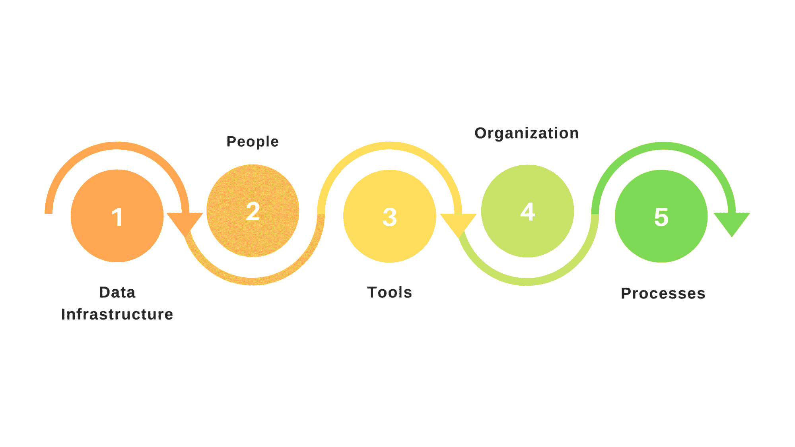

# 数据素养完全指南

> 原文：<https://web.archive.org/web/20221129044300/https://www.datacamp.com/blog/the-complete-guide-to-data-literacy>

*   [什么是数据素养？](#what-is-data-literacy?)
*   [数据素养框架](#a-framework-for-data-literacy)
*   [如何开始你的数据素养之旅](#how-to-begin-your-data-literacy-journey)
*   [行业数据素养用例](#data-literacy-use-cases-by-industry)
*   [数据素养课程](#data-literacy-courses)
*   [结论](#conclusion "#courses")

2021 年 [NewVantage Partners 大数据和人工智能高管调查](https://web.archive.org/web/20220828050931/https://c6abb8db-514c-4f5b-b5a1-fc710f1e464e.filesusr.com/ugd/e5361a_d59b4629443945a0b0661d494abb5233.pdf)发现，尽管 99%的组织积极投资数据科学和人工智能，但只有 29.2%的组织经历了任何转型成果，24%的组织声称他们是数据驱动的。有趣的是，声称自己是数据驱动的组织的数量一直在稳步下降，从 2017 年的 37%下降到 2019 年的 31%，再到今天的 24%。

这是因为组织正在意识到，组织范围的数据素养和文化对于大规模采用数据驱动的决策至关重要。在 2021 年的调查中，92%的组织声称数据文化和技能是实现数据驱动的最大障碍。

为了培养组织的数据素养，领导者必须启动转型计划，为员工提供大规模处理数据的技能、访问和工具，并转变他们的数据文化。

“我们现在生活在一个不同的时代，”DataCamp 首席执行官 Jonathan Cornelissen 说。“每个行业都在数字化并产生大量数据，但许多组织没有合适的技能来利用这些数据并超越竞争对手。就像过去公司必须培养计算机知识和软件知识一样，现在我们必须具备数据知识。数据素养正在推动每个行业的变革，并使每个部门都能交付更好的结果。它始于在您组织的每个级别建立适合角色的数据技能。”

## 什么是数据素养？

DataCamp 将数据素养定义为读取、写入、交流和推理数据以做出更好的数据驱动型决策的能力。从组织的角度来看，它是一系列数据技能，从数据驱动的决策到数据科学、数据工程和机器学习中的高级技术技能，使组织中的每个人都能从大规模数据中产生价值。

由埃森哲和 Qlik 授权的研究报告《数据素养对人类的影响》显示，全球只有 21%的员工能够自如地处理数据。

解决数据技能差距符合各种规模的组织的最大利益。缺乏数据素养不仅会影响员工的工作效率，还会阻碍组织从基于数据的业务中获益。该研究还显示，数据素养高的组织的市值是数据素养低的组织的三到五倍。

## 数据扫盲框架

成为一个懂数据的组织是一个需要扩展许多级别的旅程。在 DataCamp，我们使用基础设施、人员、工具、组织和流程框架(IPTOP)来帮助组织了解他们需要在数据扫盲的道路上扩展哪些内容。

### 数据基础设施:确保所有人都能获得数据

在一个有数据素养的组织中，数据是由组织中的每个人收集、发现、可靠、理解、遵从和操作的。对高质量、值得信赖的数据的受控访问确保组织能够大规模地做出分散的数据驱动型决策。

### 人员:基于角色的数据读写方法

除了基础设施，人可以说是框架中最重要的元素。扩大人员规模需要打造一种数据文化，在这种文化中，每个人都理解数据的价值，并且能够用数据说话、写作、交流和推理。这包括推出个性化的数据素养提升计划，涵盖整个技能水平范围，并适应整个数据素养技能范围。

[“数据文化不仅仅是在数据分析计划中取得成功的一个选项，它对业务至关重要。”—安联比荷卢经济联盟区域首席 CDO Suda man T . M .](https://web.archive.org/web/20220828050931/https://www.datacamp.com/community/blog/why-data-culture-matters)

### 工具:支持数据读写的工具系列

工具是指所有技能水平的数据从业者使用的各种各样的工具。有数据素养的组织有意提供包容工具，以适应不同类型的数据角色和用例，从拖放式商业智能工具(如 Tableau 和 Power BI)到开源编程语言(如 R、Python 和 SQL)。另一个组成部分是跨所有这些工具开发现成的模板和框架，以减少洞察时间并降低处理数据时的准入门槛。

### 组织:组织数据人才走向成功

组织是指如何有效地组织数据人才，以促进数据洞察的规模化获取。有多种组织模式。一方面，组织可以选择集中式模型，将数据团队定位为支持功能(例如，团队提交请求，数据团队根据业务需求确定优先级)。另一方面是分散模式，数据专家嵌入到业务功能中。这两种模式各有利弊，许多混合模式介于两者之间。

### 流程:通过协作推动数据扫盲

最后，流程是关于在团队内部和团队之间建立流程，以大规模推动数据素养。例如，微软已经采用了团队数据科学过程(Team Data Science Process),该过程尽可能地向利益相关者提供透明度:轻松查看项目并理解需求；区分谁负责流程中的哪个阶段；并利用模板进行数据分析。这扩展到了业务利益相关者与数据团队合作的流程，并确保它们能够扩展。

## 如何开始您的数据素养之旅

[麦肯锡&公司](https://web.archive.org/web/20220828050931/https://www.mckinsey.com/business-functions/mckinsey-analytics/our-insights/catch-them-if-you-can-how-leaders-in-data-and-analytics-have-pulled-ahead)2019 年的一项研究显示，一贯基于数据做出决策的组织在前三年报告收入增长至少 10%的可能性是 1.5 倍。像这样的数字是为什么许多组织都在问同一个问题的原因:我们如何成为数据素养？

数据素养的采用可以分为三个阶段。

### 评估数据素养

数据素养评估是对整个组织的当前数据技能进行基准测试的机会。评估应回答以下问题:

*   目前有多少人在利用数据做决策？
*   有多少人能理解简单的统计数据(如相关性、平均值等)。)?
*   有多少人有能力提出有相关数据支持的新倡议？
*   数据科学家目前在机器学习、编程、数据处理等领域的能力水平如何？

更重要的是，评估需要适应人们与数据的不同关系，包括他们在角色中取得成功所需的数据技能类型以及角色所需的能力水平。对评估结果的全面评估应该提供组织如何针对特定学习内容的方向，以及针对各种类型的学习角色的个性化学习建议。

### 为所有人启用数据访问

对于要成为数据驱动的团队，访问数据是至关重要的。但是，确保数据的高质量、可操作性、可理解性和合规性非常重要。因此，需要建立适当的数据治理，由数据管理员确保组织数据质量标准在整个组织内得到传达和执行。

受治理的数据访问必须与对现代数据工具的访问相结合，以便所有技能水平的员工都可以获得数据洞察力。数据科学家通常非常精通技术，他们需要访问 Python、R 或 SQL 等编程语言，以便操作、分析、创建预测模型并分享他们的见解。

而技术含量较低的员工，如业务分析师，则需要 Power BI 和 Tableau 等更易于使用的工具，使他们能够做出影响日常运营的数据驱动型决策。

### 推出数据素养提升计划

人是各阶段数据成熟度的基石。当组织寻求推动数据扫盲时，最初的挑战是使数据成为大多数决策和行动的默认考虑因素。组织面临的一个主要障碍是数据素养不足，这限制了非专家在使用数据时进行独立工作的能力。

推广全组织培训的最佳实践是为各种角色创建个性化的学习路径。例如，Airbnb 创建了数据大学，这是一个旨在提升整个组织的数据技能的计划，内容是为特定数据团队的 Data U Intensive 计划精心策划的。群组能够实现 30%的 SQL 使用持续增长。

在一个有数据素养的组织中，学习路径涵盖了从一般数据素养到数据科学、机器学习、数据工程等一系列主题。最终，组织可以采用一种通用的数据语言，并将数据科学作为一种习惯和方法来处理业务问题。

## 按行业划分的数据读写使用案例

在一个日益由数据驱动的世界中，组织数据素养的重要性显著增强。一个组织的成功在很大程度上取决于其员工操作数据的能力，因此，专业表现与对数据的牢固掌握密切相关，以帮助组织做出更好的决策。

### 卫生保健

HealthIT 记录显示，美国超过 85%的医疗服务提供者现在使用电子健康记录(EHRs)，这一数字自 2008 年以来已经翻了一倍多。然而，在大学或医学院，临床人员通常不会被教授有关分析的知识。因此，35%的[年轻医疗保健专业人员被患者数据](https://web.archive.org/web/20220828050931/https://healthitanalytics.com/news/one-third-of-young-providers-overwhelmed-by-patient-data-analytics)淹没，或者不清楚如何使用患者数据和分析来通知护理。

借助行业范围的数据扫盲，医疗保健提供商可以降低成本、提高患者护理的有效性，并改善患者的疗效。

以下是数据素养如何惠及医疗保健行业的一些示例:

*   医疗保健提供者可以通过解释来自患者数据的描述性分析来为患者提供预防措施。
*   医疗保险提供商可以通过机器学习来自动理赔和消除欺诈，从而降低医疗保健系统的总体成本。
*   制药领域的 R&D 专家可以用编程技能和机器学习来补充他们的专业知识，从而加快药物部署，改善某些人群的健康状况。

### 政府

2012 年，欧盟公共部门的支出占国内生产总值的 49.3%。因此，一个更有效率的公共部门可能意味着向公众提供同等水平的服务需要更少的资源，如税收。

随着世界各地的公共部门越来越意识到从数据和数据素养中获得的价值，以下是实现这一价值的一些使用案例:

*   政府机构可以利用数据来提供更快的危机响应。一个重要的例子是使用[仪表盘和地图](https://web.archive.org/web/20220828050931/https://data.berkeley.edu/news/computing-and-data-sciences-improve-what-we-know-about-wildfires-and-how-fight-them)来跟踪野火并对行动进行优先排序。
*   政府机构可以根据洞察力对干预措施进行优先排序。一个重要的例子来自纽约市，利用数据来确定哪些房东最有可能非法骚扰房客。
*   政府机构可以授权公众做出更好的决定。例如，纽约市的[商业地图集](https://web.archive.org/web/20220828050931/https://www.inc.com/jill-krasny/nyc-business-atlas-helps-small-businesses.html)帮助小企业根据数据做出在哪里卖什么的决策。

### 金融

尽管金融服务业是数据最丰富的行业之一，但《数据素养对人类的影响》报告显示，只有 38%的金融服务业员工对自己阅读和处理数据的能力充满信心。这不仅会影响组织从数据中获益的能力，还会影响员工的整体工作参与度。

以下示例是金融服务组织实现其现有数据优势的使用案例:

*   金融分析师可以利用商业智能工具缩短洞察时间，并通过仪表盘监控金融犯罪指标。
*   银行和保险组织可以通过客户流失和客户终身价值预测来优化其分销和走向市场。
*   投资银行可以应用量化风险管理技术来更好地管理风险和优化投资组合。
*   机器学习可用于自动化手动流程，如信用风险建模。

### 零售

顾客对零售商的期望显著提高。现在，零售商被期望提供个性化的客户体验，在线渠道和实体店之间的无缝体验，以及简单的购物方式。未能满足这些期望会导致客户流失。满足这些期望的能力取决于组织让员工(从车间到仓库)至少具备基本的数据素养的能力。这进一步得到了[数据素养指数](https://web.archive.org/web/20220828050931/https://www.qlik.com/us/company/press-room/press-releases/new-research-uncovers-opportunity-with-data-literacy)的支持，该指数显示，数据素养强的组织展现出高达 5%的企业价值。

零售商可以通过以下使用案例实现这一增加的企业价值:

*   运用市场分析技术预测需求并帮助降低成本。
*   分析客户的搜索和购买历史，以推荐客户可能感兴趣的其他商品。
*   分析顾客购物习惯，提供个性化购物体验。
*   分析和解释顾客的旅程，回答如下问题:顾客在哪里寻找产品信息？我们在哪个点上失去了顾客？接触顾客并迫使他们购买的最有效方法是什么？

## 数据扫盲课程

作为数据素养道路上的第一步，DataCamp 的数据素养基础技能课程将帮助您的组织获得员工使用数据语言所需的基本技能。不需要任何先验知识或编码技能。通过动手练习，团队将学习如何理解数据，并扩展他们对关键数据主题的知识，包括数据科学、机器学习、数据可视化，甚至数据工程和云计算。他们还将了解数据科学中的许多角色、技术和框架。

[数据素养基础知识](https://web.archive.org/web/20220828050931/https://learn.datacamp.com/skill-tracks/data-literacy-fundamentals)技能路线包括五门课程:

*   [面向所有人的数据科学](https://web.archive.org/web/20220828050931/https://www.datacamp.com/courses/data-science-for-everyone):随着您对什么是数据科学以及它为什么如此受欢迎的深入探究，无需代码就能深入了解数据科学。
*   [面向所有人的机器学习](https://web.archive.org/web/20220828050931/https://www.datacamp.com/courses/machine-learning-for-everyone):通过许多实践练习来了解机器学习炒作背后的东西，让你越过行话。
*   [面向所有人的数据可视化](https://web.archive.org/web/20220828050931/https://www.datacamp.com/courses/data-visualization-for-everyone):数据可视化是最有效的数据交流方式之一。了解数据可视化的最佳实践，发现最用户友好的数据可视化工具。
*   [人人共享的数据工程](https://web.archive.org/web/20220828050931/https://www.datacamp.com/courses/data-engineering-for-everyone) :没有矿，就不可能在数据中找到金子。数据工程师有责任为数据科学的发展奠定基础。了解数据工程师如何促进组织中的数据流动。
*   [面向所有人的云计算](https://web.archive.org/web/20220828050931/https://www.datacamp.com/courses/cloud-computing-for-everyone) :云计算已经成为许多公司技术堆栈的一部分，但是什么是云呢？为什么云计算变得如此流行？在这个初学者友好的课程中，你可以找到这些问题的答案以及更多的答案。

## 结论

数据素养对于希望保持竞争力的组织来说至关重要，现在是让您的组织走上全面数据素养之路的最佳时机。除了 DataCamp 的多样化目录[数据素养资源](https://web.archive.org/web/20220828050931/https://www.datacamp.com/resources/data-literacy)之外，还有一些在线资源可能对您的技能提升之旅有所帮助。一些推荐的读物包括:

*   [数据驱动的业务决策](https://web.archive.org/web/20220828050931/https://www.datacamp.com/courses/data-driven-decision-making-for-business)
*   [数据和分析领导者的数据素养指南](https://web.archive.org/web/20220828050931/https://www.gartner.com/smarterwithgartner/a-data-and-analytics-leaders-guide-to-data-literacy)
*   [为什么数据素养对您的团队很重要](https://web.archive.org/web/20220828050931/https://www.datacamp.com/blog/why-data-literacy-is-important-for-your-team)
*   [提高您团队的数据素养](https://web.archive.org/web/20220828050931/https://hbr.org/2020/02/boost-your-teams-data-literacy)
*   [数据素养指数 Qlik](https://web.archive.org/web/20220828050931/https://thedataliteracyproject.org/files/documents/Qlik%20-%20The_Data_Literacy_Index_October_2018.pdf)
*   [为什么数据素养对任何企业都很重要？](https://web.archive.org/web/20220828050931/https://bernardmarr.com/why-is-data-literacy-important-for-any-business/)
*   [使用 IPTOP 构建可扩展的数据策略:基础设施、人员、工具、组织和流程](https://web.archive.org/web/20220828050931/https://www.datacamp.com/community/blog/iptop)
*   [数据扫盲和数据驱动的业务转型路线图:Gartner 趋势洞察报告](https://web.archive.org/web/20220828050931/https://databricks.com/wp-content/uploads/2020/10/Roadmap_for_Data_Lit_729278_ndx.pdf)