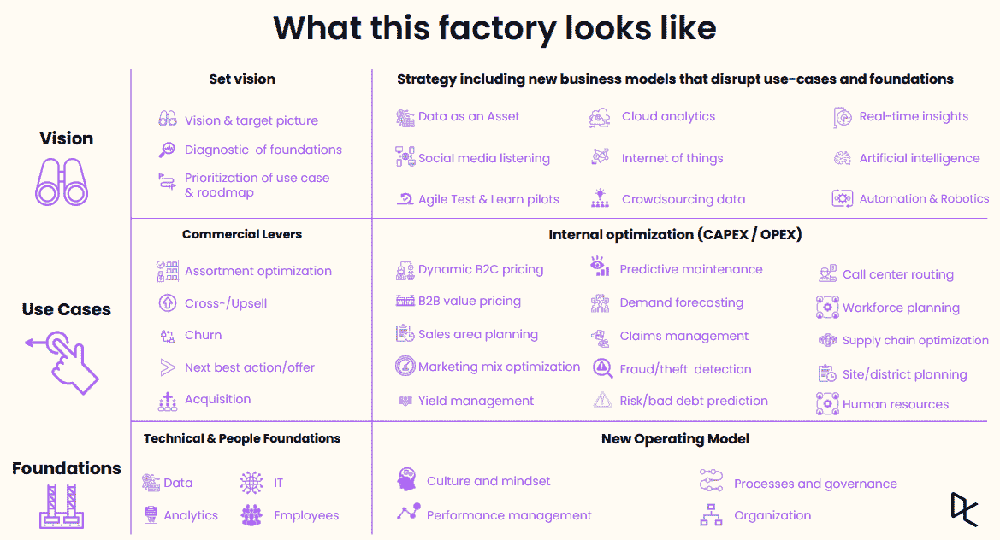

# 保险业数据科学的未来:从分析车库走向工厂

> 原文：<https://web.archive.org/web/20221129045128/https://www.datacamp.com/blog/the-future-of-data-science-in-insurance-moving-from-an-analytics-garage-to-a-factory>

为了保持竞争力，保险组织必须扩展他们从数据中产生的洞察力和价值的数量。在本次[近期网络研讨会](https://web.archive.org/web/20220819082937/https://www.datacamp.com/resources/webinars/future-of-data-science-in-insurance-1)的后半部分，安联比荷卢经济联盟区域首席数据和分析官 Sudaman Thoppan Mohanchandralal 讨论了保险组织为充分实现数据科学的潜力而必须采取的关键步骤。

## 从数据科学车库到工厂

在网络研讨会中，Sudaman 将数据科学在保险行业的当前应用描述为一个分析库。组织目前认识到大数据是一个优先事项，但他们没有在所有决策中有效利用大数据。

[IBM 报告](https://web.archive.org/web/20220819082937/https://www.ibm.com/thought-leadership/institute-business-value/report/insurance-data-personalization)虽然 71%的保险公司的产品依赖于其投资组合中的数据，但许多公司没有一个连贯的数据战略来扩展数据科学和机器学习。Sudaman 将组织应该努力实现的最终目标比作一个分析工厂。在这种情况下，组织可以在所有决策中利用大规模数据，从而带来三大好处:

1.  巨大的财务潜力:通过机器学习用例扩展核心业务的大量机会。
2.  相对于进入市场的新竞争对手的优势:制定数据驱动的决策是与具有颠覆性数据和分析驱动的商业模式的新竞争对手竞争的必要条件。
3.  扩展核心业务的新可能性:通过为核心业务做出更明智的决策，资源开放以扩展到当今核心业务之外的新业务模式。凯捷[在此](https://web.archive.org/web/20220819082937/https://worldinsurancereport.com/wp-content/uploads/sites/6/2020/05/World-Insurance-Report-2020.pdf)介绍了其中一些新一代服务。

然而，目前存在明显的障碍，阻止保险公司扩展分析工厂。以下是网上研讨会中列出的几个例子

## 障碍 1:治理不清晰

实现分析工厂的第一步是清晰的治理。在[本次网络研讨会](https://web.archive.org/web/20220819082937/https://www.datacamp.com/webinars/how-data-governance-enables-scalable-data-science)中，Ingredion Inc .的数据治理和人工智能经理庄文希·斯塔伯菲尔德描述了数据治理如何通过提供清晰的数据来最大限度地降低数据隐私法带来的商业风险。这种清晰性也使得基于这些数据做出的决策更有信心。[麦肯锡认为](https://web.archive.org/web/20220819082937/https://www.mckinsey.com/business-functions/mckinsey-digital/our-insights/designing-data-governance-that-delivers-value)在一些部门，由于缺乏治理，数据质量和可用性很差，超过 30%的员工时间被浪费在非增值任务上。清晰的治理对于创建数据科学工厂至关重要。

## 障碍 2:关键人才短缺

下一步是在组织内培养数据科学人才。这些技能可以分为三个主要角色:

1.  数据科学家:需要在数据挖掘、统计学、机器学习和计算机科学等领域的应用数学和技术技能背景。他们的主要工作是为有价值的用例构建算法。
2.  分析工程师:通常具有数据科学背景，更侧重于计算机科学和编程技能。他们的角色是使用数据科学家的算法，并使其可扩展用于生产环境。
3.  分析翻译:有数据科学和商业背景。他们的功能是将业务问题转化为技术语言，并将模型输出转化为业务解决方案。

在[数据人才短缺](https://web.archive.org/web/20220819082937/https://www2.deloitte.com/us/en/insights/industry/technology/data-analytics-skills-shortage.html)的情况下，大规模培养这些技能可能具有挑战性。因此，组织必须通过创造一种[学习文化](https://web.archive.org/web/20220819082937/https://www.datacamp.com/community/blog/five-steps-to-building-a-learning-culture)来提升内部技能。这些角色都是实现数据科学工厂所必需的。

一旦这些角色被填满，可以选择速赢的项目来证明工厂的潜力。然后，这些立竿见影的效果可以被系统化和规模化，以利用全栈数据产品生产分析流程。这些好处都来自于建立正确的团队和解决内部人才短缺问题。

## 障碍 3:缺乏一线参与

第三步是让一线工人参与进来。组织中的每个人都必须懂数据。在客户身边工作的员工需要了解正在部署的系统。他们必须能够传达为什么他们向客户推荐特定的服务，或者为什么服务的定价是这样的。与客户的有效沟通是建立分析工厂的关键，来自一线的参与。这就是建立数据文化发挥作用的地方 Sudaman 在另一场 [DataCamp 网络研讨会](https://web.archive.org/web/20220819082937/https://www.datacamp.com/resources/webinars/webinar-building-data-culture)中谈到了这一点。

## 障碍 4:管理层的关注

最后，工厂的运转必须有管理层的参与。他们必须与数据人才密切合作，以推动组织变革。他们应该利用自己的业务知识和专业技能，从数据团队开发的新技术中为组织带来财务影响和价值。没有决策者的适当关注，工厂的效益就无法实现。

要了解更多关于保险公司如何将其分析库扩展到工厂的信息，请务必收听[点播网络研讨会](https://web.archive.org/web/20220819082937/https://www.datacamp.com/resources/webinars/future-of-data-science-in-insurance-1)。

