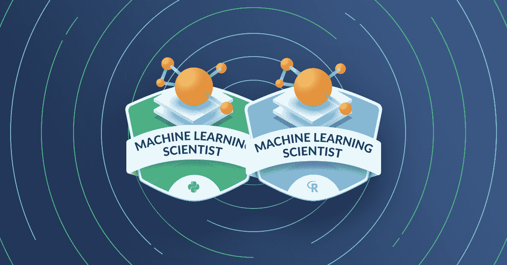

# 机器学习的许多商业应用

> 原文：<https://web.archive.org/web/20230101103328/https://www.datacamp.com/blog/the-many-business-applications-of-machine-learning>

## 什么是机器学习？

机器学习(ML)是一套工具，有助于根据数据进行预测和决策。监督学习声称 ML 的最大份额，并允许我们从以前的数据中归纳出新数据的模式。换句话说，当我们不知道我们想要预测的值时，它应用已知值的先验数据来进行预测。在其跨业务问题的应用中，机器学习也被称为预测分析，用例包括客户流失、信用卡欺诈和电子邮件垃圾邮件。

通过经验或指导观察到的可用数据来学习 ML 任务，这反过来导致更好的学习。最终目标是以这样一种方式改善学习，即它变得自动而不需要人为干预。

> “机器学习是一门科学和艺术，它让计算机能够在没有明确编程的情况下，学习根据数据做出决策。”—Hugo bow ne-Anderson 博士，DataCamp 的数据科学家和教育家

## 为什么机器学习对企业很重要

O'Reilly 在 2018 年进行的一项研究发现，51%的组织已经在使用 ML，其中 36%声称是 ML 的早期采用者，15%声称是成熟用户。49%的少数组织报告他们正在探索或“只是在考虑”部署 ML。

## 从您的数据中学习，更好地开展业务

### 日益增长的从数据中提取洞察力的需求

几乎每个企业都有大量数据，从支付交易到客户信息再到员工数据，这些数据可以(也应该)得到战略性利用。当今的领先企业正在将 ML 纳入其日常流程，从推动增长和优化效率到确定资本节约领域和降低投资成本。

### 机器学习提供了更快决策的途径

决策者需要比以往更快地访问关键数据，而 ML 支持快速、明智和准确的决策。ML 的一个主要好处是能够更快地做出明智的决策，50%已经实施 ML 的公司认为他们已经实现了这个目标。

### 为什么管理者需要基本的机器学习流畅性

管理者应该理解机器学习中的基本术语和概念。要与数据科学家进行富有成效的对话，他们必须了解 ML 是什么，它能做什么，以及使用它时需要注意什么。

机器学习的流畅性使管理者能够提出正确的问题，并知道哪些问题可以和不可以通过 ML 解决。他们还必须能够与数据服务和产品的供应商沟通，以建立一个成功的数据生态系统。

## 机器学习如何解决商业问题

这里有几个机器学习如何解决商业问题的实际例子，加上 DataCamp 课程的链接，以建立这些 ML 技能。

### 预测客户流失

机器学习可以帮助公司了解获得和保留现有客户的不同成本，以及如何计算客户终身价值，这是客户在流失之前产生的平均收入。

### 为客户定制个性化产品

希望更好地了解和服务客户各种习惯和需求的公司可以使用 ML 进行[客户细分和个性化](https://web.archive.org/web/20220810061137/https://www.datacamp.com/community/tutorials/introduction-customer-segmentation-python)。

### 处理和分析大量数据

自然语言处理的机器学习有着广泛的含义，可以给人机交互带来个性化的影响。这就是人工智能聊天机器人的驱动力。企业还可以通过[文本挖掘](https://web.archive.org/web/20220810061137/https://www.datacamp.com/courses/intro-to-text-mining-bag-of-words)和[图像处理和识别](https://web.archive.org/web/20220810061137/https://www.datacamp.com/tracks/image-processing)从非结构化数据中获得可操作的见解。应用范围从垃圾邮件检测到构建推荐系统等等。

### 进行财务分析

[金融行业将深度学习](https://web.archive.org/web/20220810061137/https://www.datacamp.com/resources/webinars/deep-learning-in-finance)用于从欺诈活动分类到[算法交易](https://web.archive.org/web/20220810061137/https://www.datacamp.com/resources/webinars/artificial-intelligence-in-finance-an-introduction-in-python)和[投资组合管理](https://web.archive.org/web/20220810061137/https://www.datacamp.com/resources/webinars/bayesian-covariance-for-portfolio-optimization)，到[贷款承销](https://web.archive.org/web/20220810061137/https://www.datacamp.com/community/blog/data-science-insurance-transcript)等等的方方面面。

机器学习正在被金融行业广泛采用。对冲基金“双适马”用它来指导交易策略。我们的一个保险客户正在 DataCamp [上支持机器学习课程，以推动他们的数据现代化计划](https://web.archive.org/web/20220810061137/https://www.datacamp.com/community/blog/how-to-transform-your-company-culture-with-data-modernization-initiatives)。

### 打造更好的技术产品和服务

科技行业使用 ML 来制造产品和服务。他们向客户提供个性化营销、推荐引擎、文本翻译、聊天机器人等服务。

### 在医疗保健中应用人工智能和人工智能

医疗保健行业正在不断发展，将 ML 纳入医学成像和诊断、数据收集、药物研发等领域。

## 对机器学习科学家日益增长的需求

那么，ML 领域增长了多少？国际数据公司预测，人工智能和人工智能的支出将从 2017 年的 120 亿美元增长到 2021 年的 576 亿美元。[德勤全球](https://web.archive.org/web/20220810061137/https://www2.deloitte.com/content/dam/Deloitte/globimg/infographics/technologymediatelecommunications/gx-deloitte-tmt-2018-intense-machine-learning-report.pdf)预测，2018 年机器学习试点和实施的数量将比 2017 年翻一番，到 2020 年再翻一番。

因为如此多的组织正在投资预测分析，所以对人工智能科学家的巨大需求是有道理的。一个组织在实施人工智能和人工智能方面越成熟，[他们就越开放](https://web.archive.org/web/20220810061137/https://www.forbes.com/sites/intelai/2019/05/22/ai-strategy-6-trends-changing-the-role-of-data-scientists/#71f346d45d5e)更多的角色。对 ML 科学家的需求正在增加，并且在可预见的未来很可能会持续高涨。

## 利用我们的机器学习课程提升您团队的技能

如需更多阅读，请查看我们的机器学习教程 [Python](https://web.archive.org/web/20220810061137/https://www.datacamp.com/community/tutorials/machine-learning-python) 和 [R](https://web.archive.org/web/20220810061137/https://www.datacamp.com/community/tutorials/machine-learning-in-r) 。

