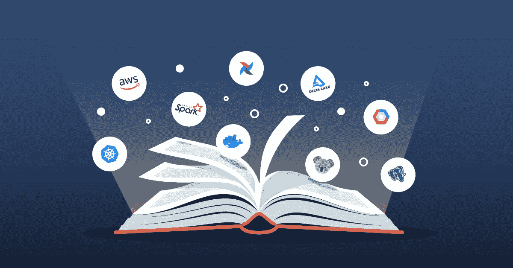
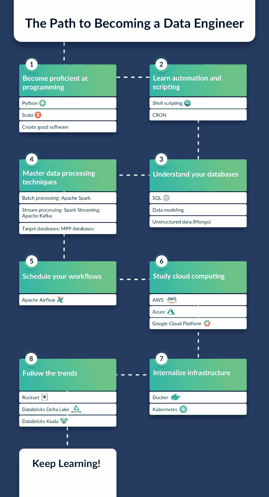
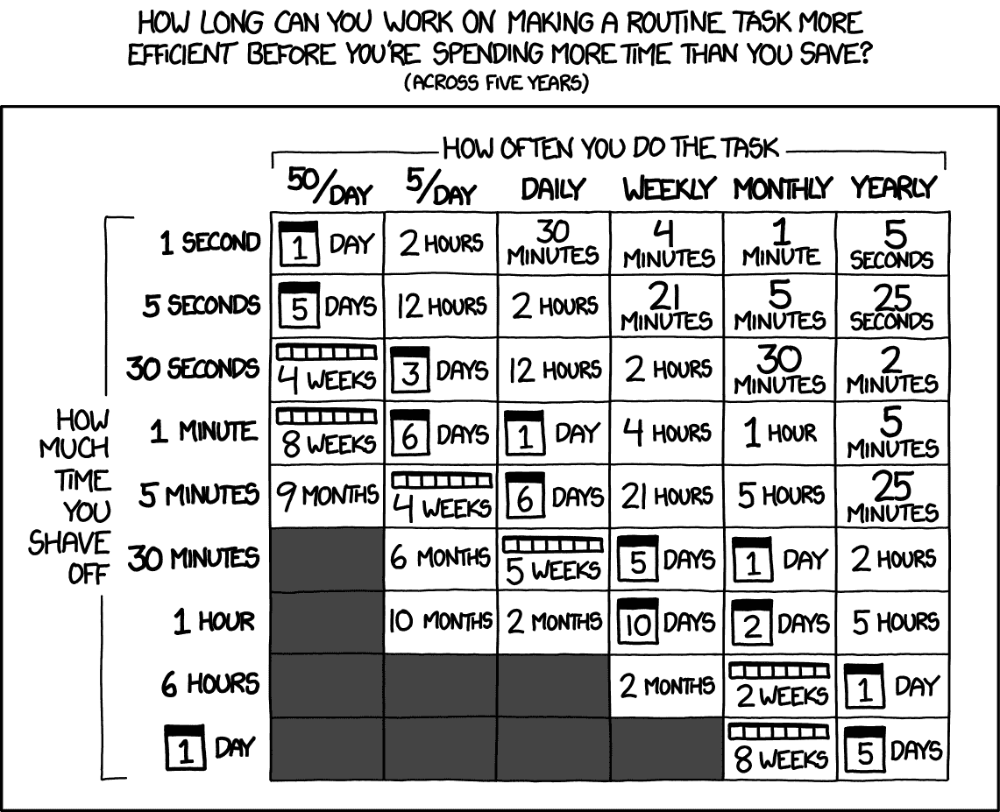
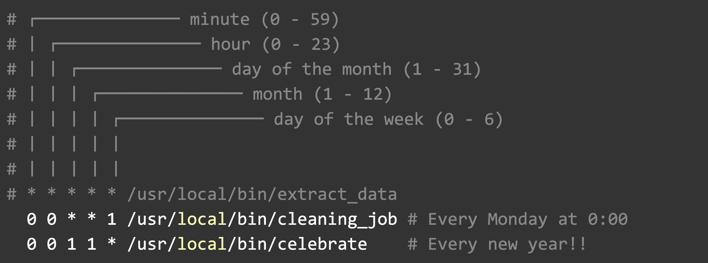
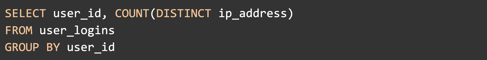
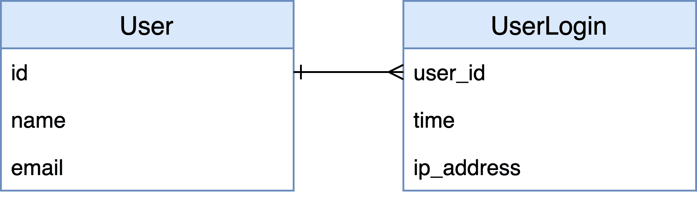
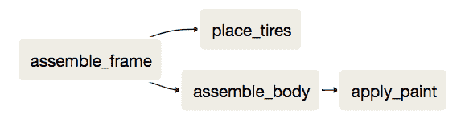
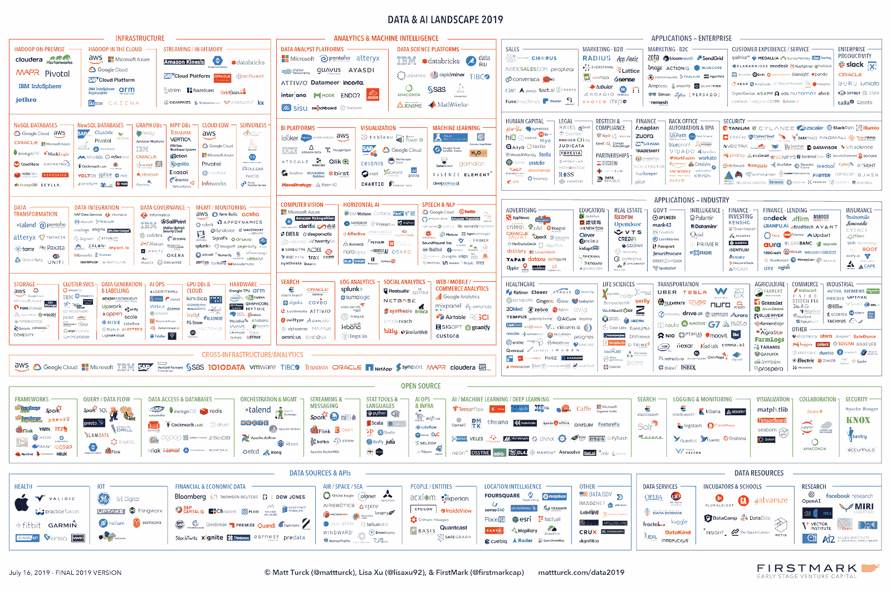
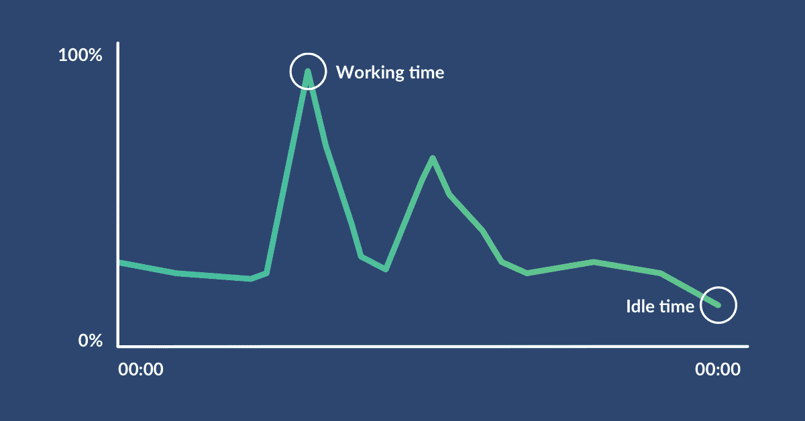
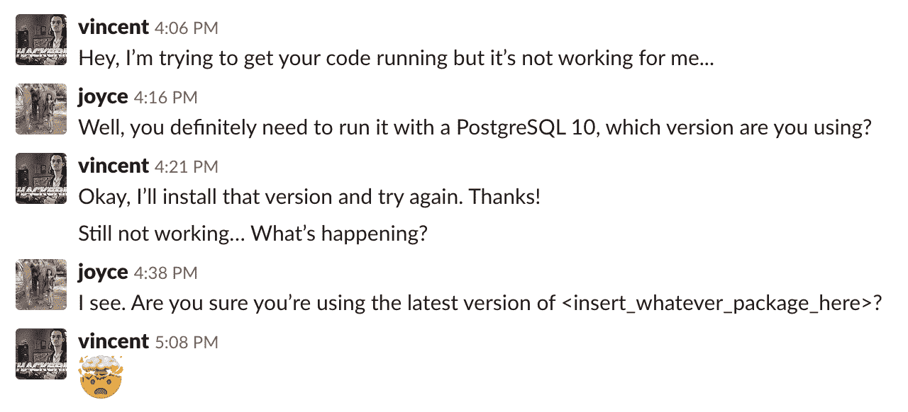

# 成为数据工程师的途径

> 原文：<https://web.archive.org/web/20230101103328/https://www.datacamp.com/blog/the-path-to-becoming-a-data-engineer>

数据科学的世界正在发展，而且变化很快。在过去的好时光里，所有的数据都可以在一个数据库中获得，作为一名数据科学家，你需要知道的只是一些 R 或 Python 来构建简单的脚本。就我而言，我记得设置了一个 R 脚本，让它从单个表中咀嚼一些数据，并吐出一些 markdown 报告，所有这些都粘在一个孤独的 CRON 作业中。但我们都必须吸取宝贵的教训:数据在增长。

随着公司的发展，不可避免地会增加越来越多的数据源。其中一些数据是成批到达的，而其他数据则通过各种渠道流入:太字节、太字节的数据积累得如此之快，以至于你的脑袋都要爆炸了。你们中的一些人可能在几年前就认识到了这一点，当时你们担任了数据工程师的新职位，负责安全、正确地存储数据。如果您发现自己处于这种棘手的情况，或者如果您刚刚开始成为一名数据工程师，我有一些好消息要告诉您:本文为您提供了学习数据工程所需的所有资源。这些资源中有很多都捆绑在 [DataCamp 的数据工程师职业生涯](https://web.archive.org/web/20220630230423/https://www.datacamp.com/tracks/data-engineer-with-python)中。

数据工程对于数据驱动的公司是必不可少的，但是数据工程师实际上是做什么的呢？以下类比可能有所帮助:

> 想想数据工程师，比如种植庄稼的农民，他们确保自己的田地得到良好维护，土壤和植物保持健康。他们负责为他人耕种、收割和准备他们的作物。这包括移除受损的作物，以确保作物的高质量和高产量。

这类似于数据工程师所做的工作，以确保组织中的其他人可以使用干净的原始数据来做出数据驱动的业务决策。

## 1.精通编程

在我们深入研究您需要的工具之前，您必须了解数据工程师位于软件工程和数据科学的交叉点。如果你想成为一名数据工程师，你首先需要成为一名软件工程师。所以你应该开始温习基本的编程技能。

行业标准主要围绕两种技术:Python 和 Scala。

### 学习 Python

对于 Python 编程，重要的是你不仅要知道如何用 Python 写脚本，还要知道如何创建软件。好的软件是结构良好的、经过测试的、高性能的。这意味着你应该为这项工作使用正确的算法。这些课程为成为 Python 编程明星铺平了道路:

1.  [Python 简介](https://web.archive.org/web/20220630230423/https://www.datacamp.com/courses/intro-to-python-for-data-science):如果 Python lists 或 NumPy 没有什么印象，就从这里开始。
2.  [数据科学中级 Python](https://web.archive.org/web/20220630230423/https://www.datacamp.com/courses/intermediate-python-for-data-science):如果你不知道如何在 Python 中构建循环，就从这里开始。
3.  [Python 数据科学工具箱(第 1 部分)](https://web.archive.org/web/20220630230423/https://www.datacamp.com/courses/python-data-science-toolbox-part-1):如果您从未用 Python 编写过函数，请从这里开始。
4.  用 Python 为数据科学家设计的软件工程:如果你从未用 Python 写过一个类，请从这里开始。
5.  [编写高效的 Python 代码](https://web.archive.org/web/20220630230423/https://www.datacamp.com/courses/writing-efficient-python-code):如果您从未计算过 Python 代码的时间，请从这里开始。

为了进一步加深您对 Python 的了解，请参加我们关于使用 Python 编写代码的[最佳实践的新技能课程。您在这些课程中积累的知识将为您编写高效且可测试的代码打下坚实的基础。](https://web.archive.org/web/20220630230423/https://www.datacamp.com/tracks/coding-best-practices-in-python)

### 学习 Scala 的基础知识

数据工程领域的许多工具都围绕着 Scala。Scala 建立在强大的函数式编程基础和静态类型系统之上。它运行在 Java 虚拟机(或 JVM)上，这意味着它与开源社区中的许多 Java 库兼容。如果这听起来令人生畏，我们可以通过我们的课程[Scala](https://web.archive.org/web/20220630230423/https://www.datacamp.com/courses/introduction-to-scala)介绍让你放松。

## 2.学习自动化和脚本

### 为什么自动化对数据工程师至关重要

数据工程师必须了解如何自动化任务。您需要对数据执行的许多任务可能很繁琐，或者可能需要经常执行。例如，您可能希望每小时清理一次数据库中的表。xckd 的漫画说得好:

TL；dr:如果你知道一个可自动化的任务需要很长时间，或者它需要经常发生，你可能应该自动化它。

### 自动化的基本工具

Shell 脚本是告诉 UNIX 服务器做什么和什么时候做的一种方式。例如，通过 shell 脚本，您可以启动 Python 程序或在 Spark 集群上运行作业。

CRON 是一个基于时间的作业调度器，它有一个特殊的符号来标记何时需要执行特定的作业。说明其工作原理的最佳方式是给你一些例子:

这里有一个很棒的网站可以帮你找出正确的时间表:[https://crontab.guru/](https://web.archive.org/web/20220630230423/https://crontab.guru/)。如果您迫不及待地想开始学习 shell 脚本和 CRON 作业，请开始学习这些课程:

1.  [面向数据科学的 Shell 简介](https://web.archive.org/web/20220630230423/https://www.datacamp.com/courses/introduction-to-shell-for-data-science)
2.  [Shell 中的数据处理](https://web.archive.org/web/20220630230423/https://www.datacamp.com/courses/data-processing-in-shell)(最后一课是关于 CRON 的)

在这篇文章的后面，我将谈论 Apache Airflow，这是一个同样依赖于您的脚本功能来安排您的数据工程工作流的工具。

## 3.了解您的数据库

### 从学习 SQL 基础知识开始

SQL 是与数据相关的一切事物的通用语言。这是一种成熟的语言，不会很快消失。看看下面这段 SQL 代码:

这段 SQL 代码的美妙之处在于它是一种声明性语言。这意味着代码描述做什么，而不是如何做——“查询计划”负责这一部分。这也意味着几乎任何人都可以理解我在这里写的这段代码，即使没有 SQL: *Return 每个用户的所有登录使用了多少不同的 IP 地址。*

SQL 有几种方言。作为一名数据工程师，您不一定需要了解它们，但熟悉 PostgreSQL 和 MySQL 可能会有所帮助。[数据科学 SQL 简介](https://web.archive.org/web/20220630230423/https://www.datacamp.com/courses/introduction-to-sql)温和地介绍了如何使用 PostgreSQL，而[SQL 关系数据库简介](https://web.archive.org/web/20220630230423/https://www.datacamp.com/courses/introduction-to-relational-databases-in-sql)则更加详细。

### 了解如何对数据建模

作为一名数据工程师，您还需要了解数据是如何建模的。数据模型定义了系统中的实体如何交互以及它们是由什么组成的。换句话说，您应该能够阅读数据库图表，如下图所示:

你应该认识到类似于数据库规范化(T1)或者 T2 星型模式(T3)的技术。数据工程师也知道，一些数据库针对事务进行了优化( [OLTP](https://web.archive.org/web/20220630230423/https://en.wikipedia.org/wiki/Online_transaction_processing) )，而另一些更适合分析( [OLAP](https://web.archive.org/web/20220630230423/https://en.wikipedia.org/wiki/Online_analytical_processing) )。如果这些数据建模主题还没有引起注意，请不要担心——我们的[数据库设计](https://web.archive.org/web/20220630230423/https://www.datacamp.com/courses/database-design)课程详细介绍了所有这些主题。

### 了解如何处理结构化程度较低的数据

有时您会发现自己处于这样一种情况，数据不是以结构化的方式表示，而是存储在一个不太结构化的文档数据库中，如 MongoDB。知道如何从中提取数据肯定会有所帮助。我们的[Python 中的 MongoDB 简介](https://web.archive.org/web/20220630230423/https://www.datacamp.com/courses/introduction-to-using-mongodb-for-data-science-with-python)课程可以帮助你做到这一点。

## 4.掌握数据处理技术

到目前为止，我只讲述了如何编程和自动化任务以及如何利用 SQL 的基础知识。现在是时候在此基础上开始构建了。既然你现在有一个强大的基础，前途无量！

### 了解如何批量处理大数据

首先，你需要知道如何从几个来源获得你的数据并对其进行处理:这被称为数据处理。如果你的数据集很小，你可以用 dplyr 或者 pandas 用 Python 来处理你的数据。或者您可以让您的 SQL 引擎来完成繁重的工作。但是如果你有千兆字节甚至兆兆字节的数据，你最好利用并行处理。使用并行处理有两个好处:(1)可以使用更多的处理能力，以及(2)可以更好地利用所有处理单元上的内存。

最常用的并行处理引擎是 [Apache Spark](https://web.archive.org/web/20220630230423/https://spark.apache.org/) ，根据他们网站的说法是*一个用于大规模数据处理的统一分析引擎*。让我来为您解释一下:Spark 提供了一个易于使用的 API，它使用常见的抽象，如 DataFrames，在机器集群上执行并行处理任务。

Spark 在并行处理方面明显优于 Hadoop 等旧系统。它是用 Scala 编写的，它有助于与 Python 和 r 等几种流行的编程语言进行接口。像 [Dask](https://web.archive.org/web/20220630230423/https://dask.org/) 这样不太为人所知的工具可以用来解决类似的问题。如果您想了解更多信息，请查看以下课程:

1.  [PySpark 简介](https://web.archive.org/web/20220630230423/https://www.datacamp.com/courses/introduction-to-pyspark)
2.  【PySpark 的大数据基础知识
3.  [Python 中 Spark SQL 介绍](https://web.archive.org/web/20220630230423/https://www.datacamp.com/courses/introduction-to-spark-sql)
4.  [利用 Dask 进行并行计算](https://web.archive.org/web/20220630230423/https://www.datacamp.com/courses/parallel-computing-with-dask)

数据处理通常是成批进行的，比如每天都要清理前一天的销售表。我们称之为批处理，因为这种处理是对过去发生的一系列观察结果进行操作的。

### 了解如何处理流中的大数据

在某些情况下，您可能有一个想要立即处理的连续数据流，称为流处理。一个例子是从一系列推文中过滤出对特定股票的提及。在这种情况下，您可能希望研究其他数据处理平台，如 Apache Kafka 或 Apache Flink，它们更专注于处理数据流。Apache Spark 也有一个名为 [Spark Streaming](https://web.archive.org/web/20220630230423/https://spark.apache.org/docs/2.2.0/streaming-programming-guide.html) 的扩展来进行流处理。如果你想学习更多关于 Kafka 或 Flink 的流处理，[看看这个温和的介绍](https://web.archive.org/web/20220630230423/https://medium.com/stream-processing/what-is-stream-processing-1eadfca11b97)。

### 将结果载入目标数据库

最后，安排好数据处理工作后，您需要将结果转储到某种数据库中。通常，数据处理后的目标数据库是 MPP 数据库。在接下来关于云计算的部分，我们将看到一些 MPP 数据库的例子。它们基本上是使用并行处理来执行分析查询的数据库。

## 5.计划您的工作流程

### 基于 Apache Airflow 的工作流调度

一旦在 Spark 或另一个引擎中构建了处理数据的作业，您就会希望定期调度它们。如前所述，您可以保持简单并使用 CRON。在 DataCamp，我们选择使用 Apache Airflow，这是一种在数据工程管道中安排工作流的工具。您应该使用最适合您工作流程的工具。对于您的用例，一个简单的 CRON 作业可能就足够了。如果 CRON 任务开始增加，并且一些任务依赖于其他任务，那么 Apache Airflow 可能是您的工具。Apache Airflow 具有可伸缩性的额外好处，因为它可以在使用 Celery 或 Kubernetes 的集群上运行——稍后将详细介绍。Apache Airflow 使用有向无环图或 Dag 来可视化您创作的工作流:

上面的 DAG 演示了组装汽车的步骤。

TL；dr:您可以使用气流来编排作业，这些作业使用 Apache Spark 或大数据生态系统中的任何其他工具来执行并行处理。

### 工具的生态系统

说到工具，很容易迷失在所有与数据工程相关的术语和工具中。我认为下图完美地说明了这一点:

##### 来源:https://mattturck.com/data2019/

这个图表非常完整，但是在我们的例子中它不是很有帮助。不要用过多的信息来淹没你，让我们用一个例子来总结过去的两个部分，这个例子可以帮助你理解我介绍的所有工具。

许多更流行的工具，如 Apache Spark 或 Apache Airflow，在我们的[数据工程简介](https://web.archive.org/web/20220630230423/https://www.datacamp.com/courses/introduction-to-data-engineering)课程中有更详细的解释。

观察力敏锐的读者可能会在这些开源工具中发现一种模式。事实上，很多都是由 Apache 软件基金会维护的。事实上，Apache 的许多项目都与大数据有关，所以您可能希望密切关注它们。下一件大事可能就要发生了！他们所有的项目都是开源的，所以如果你懂一些 Python、Scala 或 Java，你可能想看一看他们的 [GitHub 组织](https://web.archive.org/web/20220630230423/https://github.com/apache)。

## 6.学习云计算

### 使用云平台的案例

接下来，我希望大家再次思考并行处理。请记住，在上一节中，我们讨论了计算机集群。在过去，需要处理大数据的公司会拥有自己的数据中心，或者在数据中心租用服务器机架。这种方法很有效，许多公司在处理敏感数据时仍会这样做，比如银行、医院或公共服务部门。这种设置的缺点是浪费了大量的服务器时间。原因如下:假设你一天要做一次批处理。您的数据中心需要处理峰值处理能力，但是相同的服务器在其余时间会处于闲置状态。

这显然效率不高。我们甚至还没有谈到地理复制，在这种情况下，相同的数据需要在不同的地理位置进行复制以防止灾难。

每个公司自己管理他们的服务器是不切实际的，这是产生云平台的问题，云平台集中了处理能力。如果一个客户有空闲时间，另一个可能有高峰时刻，云平台可以相应地分配处理能力。今天的数据工程师需要知道如何使用这些云平台。最受公司欢迎的云平台是[亚马逊网络服务(AWS)](https://web.archive.org/web/20220630230423/https://aws.amazon.com/) 、[微软 Azure](https://web.archive.org/web/20220630230423/https://azure.microsoft.com/en-us/) 和[谷歌云平台(GCP)](https://web.archive.org/web/20220630230423/https://cloud.google.com/) 。

### 云平台提供的常见服务

云平台提供各种对数据工程师有用的服务。仅 AWS 就提供多达 165 项服务。让我强调几个:

*   **云存储**:数据存储是数据工程的基础。每个云平台都提供自己版本的廉价存储。AWS 有 S3，微软有 Azure 存储，谷歌有谷歌存储。它们几乎都做同样的事情:存储大量文件。
*   **计算**:每个云平台也有自己的底层计算服务。这意味着他们提供了一台远程机器来进行计算。AWS 有 EC2，Azure 有虚拟机，Google 有自己的计算引擎。它们的配置不同，但它们做的事情基本相同。
*   **集群管理**:所有的云平台都有自己版本的托管集群环境。AWS 有 EMR，Azure 托管 HDInsight，Google 有 Cloud Dataproc。
*   MPP 数据库 : **M** 被动 **p** 并行 **p** 处理数据库是一个奇特的术语，指的是运行在多台机器上并使用并行处理来执行昂贵查询的数据库。常见的例子有 AWS Redshift、Azure SQL 数据仓库、Google BigQuery 等。
*   **完全托管的数据处理**:每个云平台都有数据处理服务，为您运行基础架构/DevOps 设置。例如，您不必担心在集群中使用多少台机器。AWS 有一个叫数据管道的东西，还有 Azure Data Factory 和 Google Dataflow。Google 已经将 Dataflow 的编程模型开源到另一个 Apache 项目中:Apache Beam。

这只是数据工程师相关服务的一小部分。如果这些引起了你的兴趣，一定要看看[数据工程介绍](https://web.archive.org/web/20220630230423/https://www.datacamp.com/courses/introduction-to-data-engineering)的第一章，其中有一课是关于云平台的。如果你想获得更多的实践经验，请查看 Python 中的[AWS Boto 简介](https://web.archive.org/web/20220630230423/https://www.datacamp.com/courses/introduction-to-aws-boto-in-python)。

## 7.内部化基础设施

看到这里，您可能会感到惊讶，但是作为一名数据工程师，您还需要了解一些关于基础设施的知识。在这个话题上我不打算讲太多细节，但是让我告诉你两个至关重要的工具:Docker 和 Kubernetes。

### 何时使用 Docker

首先，让我们看看你是否认识到这种情况:

你可能知道我要说什么。掌握 Docker 可以帮助您使应用程序在任何机器上都是可复制的，不管那台机器的规格是什么。它是一个容器化软件，可以帮助你创建一个可复制的环境。它允许您在团队中协作，并确保您在开发中制作的任何应用程序在生产中都能类似地工作。有了 Docker，数据工程师在设置本地环境上浪费的时间就少多了。以 Apache Kafka 为例，在本地安装它可能会非常困难。您可以使用一个名为 [Confluent](https://web.archive.org/web/20220630230423/https://www.confluent.io/) 的平台，该平台将 Kafka 与其他用于流处理的有用工具打包在一起，Confluent 文档提供了一个关于[如何开始使用 Docker](https://web.archive.org/web/20220630230423/https://docs.confluent.io/current/quickstart/ce-docker-quickstart.html) 的简单易懂的指南。

### 何时使用 Kubernetes

逻辑上，单个容器之后是在几台机器上运行的一大堆容器。在基础设施行话中，这被称为容器编排，Kubernetes 是可以使用的工具。您可能会理所当然地想起并行处理和 Apache Spark 之类的工具。事实上，您可以将 Kubernetes 托管集群与 Spark 一起使用。这是数据工程中比较高级的话题之一，但是即使是新手也应该知道。

## 8.追随潮流

如果你已经做到了这一步，如果你觉得你还没有完全理解数据工程的前景，不要气馁。这是一个不断变化的巨大领域。最重要的是使用正确的工具，不要让您构建的大数据解决方案过于复杂。

也就是说，跟上最近的发展也无妨。这里有一些有用的资源:

*   查看新的软件和服务，如[三角洲湖](https://web.archive.org/web/20220630230423/https://delta.io/)、[考拉](https://web.archive.org/web/20220630230423/https://github.com/databricks/koalas)、 [Metaflow](https://web.archive.org/web/20220630230423/https://metaflow.org/) 和 [Rockset](https://web.archive.org/web/20220630230423/https://rockset.com/) 。
*   在 [ApacheCon](https://web.archive.org/web/20220630230423/https://www.apachecon.com/) 上观看会议讨论。
*   留意论坛上的帖子，比如[黑客新闻](https://web.archive.org/web/20220630230423/https://news.ycombinator.com/)、 [Reddit](https://web.archive.org/web/20220630230423/https://www.reddit.com/r/bigdata/) 和[数据营社区](https://web.archive.org/web/20220630230423/https://www.datacamp.com/community)。
*   收听播客，如[、奥莱利数据秀播客](https://web.archive.org/web/20220630230423/https://www.oreilly.com/radar/topics/oreilly-data-show-podcast/)和[数据工程播客](https://web.archive.org/web/20220630230423/https://www.dataengineeringpodcast.com/)。
*   或者在 GitHub 上查看这个[整理的数据工程工具列表。](https://web.archive.org/web/20220630230423/https://github.com/igorbarinov/awesome-data-engineering)

## 开始迈出作为数据工程师的第一步

就是这样！你已经穷途末路了。在这一点上，你实际上是一个数据工程师…但你必须应用你所学到的东西。积累数据工程师的经验是最难的部分。幸运的是，你不需要成为所有这些话题的专家。你可以专注于一个云平台，比如谷歌云平台。你甚至可以使用谷歌的公共 BigQuery 数据集之一开始你的第一个宠物项目。

我希望这篇博文能给你带来启发，我提供的资源对你有用。在 DataCamp，我们致力于构建我们的数据工程课程，并增加有关流数据和云平台等主题的课程，敬请关注！