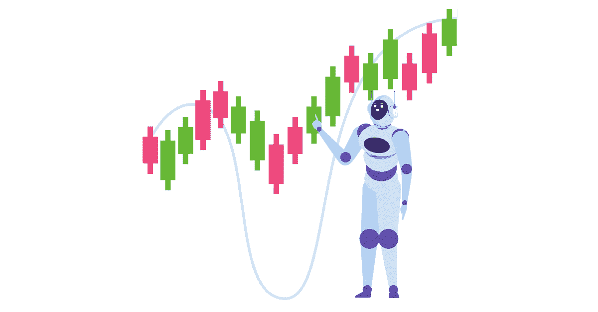

# 人工智能在金融和算法交易中的力量

> 原文：<https://web.archive.org/web/20230101103301/https://www.datacamp.com/blog/the-power-of-ai-in-finance-and-algorithmic-trading>

Recently, Dr. Hugo Bowne-Anderson (DataCamp) and Dr. Yves Hilpisch (The Python Quants) discussed how AI can be leveraged in finance, how it compares to more traditional approaches, and why data scientists are now key players in finance. They also discussed uncertainty and risk, and how useful AI and machine learning can be in market crashes, during black swan events, and in volatile markets. [Watch the webinar on-demand](https://web.archive.org/web/20220817161819/https://www.datacamp.com/resources/webinars/ai-finance-and-algorithmic-trading) or read on for some key takeaways. ## What is AI and what are the implications? Yves defines artificial intelligence as the whole range of fields that try to emulate and improve what people can do. In that sense, AI in chess tries to play chess better than humans, and AI in finance can mean building and training bots that can trade better than humans do. > AI is where software achieves something that we would consider an intelligent act. And intelligence can be defined as the ability to achieve a certain goal.—Dr. Yves Hilpisch Machines can follow the scientific method much more efficiently than humans. They are able to look at the data and find out revealed preferences by tracking what people actually do. And from that, they derive insights. They leverage millions of data points to form these insights, which end up being far more accurate than theoretical models. > So what is the scientific method?...You set up an experiment, you collect data, and then you try to either find support for the hypothesis, or maybe you find data that contradicts the hypothesis. Then the next step will be to adjust your hypothesis, your assumptions, or maybe retract the hypothesis altogether. This process of the scientific method can be replicated by machines a million times in seconds.—Dr. Yves Hilpisch ## AI has provided a major competitive advantage in the past 20 years AI serves the same purpose in finance as it does for any other field: to gain a competitive advantage. In finance, it got its start in the 1950s, when Markowitz led the way with the first quantitative finance model. It was the first model in variance portfolio theory that gained widespread acceptance. Today, it’s still used to manage trillions of dollars. But it uses normative theory which is based on analyzing various possible portfolios of securities—it’s not prescriptive because it doesn’t suggest a possible course of action. So it’s not based on data, but rather behavioral data or market data. In the past 20 years, data has become more readily available than ever before—the key is to use it appropriately. Gregory Zuckerman’s [The Man Who Solved the Market](https://web.archive.org/web/20220817161819/https://www.amazon.com/dp/B07NLFC63Y/ref=dp-kindle-redirect?_encoding=UTF8&btkr=1) details how the hedge fund Renaissance Technologies led the way in amassing data for financial gain. Today, almost every industry has embraced their strategy of creating mathematical models and crunching data—and are able to make more optimal decisions as a result. ## Modern use cases and best practices for quantitative finance There has been a dramatic evolution of AI in financial markets. For example, using the mountains of data available today, supervised learning models are able to predict the behavior of creditors or consumers with a high degree of accuracy. Algorithmic trading also leverages reinforcement learning to reward and punish trading bots based on how much money they make or lose. > We have now millions and millions of data points that we can use to analyze the behavior of people. And with the new technologies that we have, banks and institutions [such as] fintech startups are ten times, a hundred times better at predicting consumer behavior, creditor behavior, etc, than every theory that ever has been devised by financial professors.—Dr. Yves Hilpisch But in times like these where there is high market volatility, it’s clear that AI in finance requires safety precautions. Supervised learning relies on historical data and assumes that what has happened in the past is representative of what will happen in the future. This is faulty logic in times of market volatility. That’s why you must have rules in place to prevent bad trading decisions, like putting a stop loss—which specifies a price that a security or commodity will be sold—on the algorithms. This logic limits losses that are too great to bear and is akin to putting security mechanisms on a self-driving car to prevent it from hitting pedestrians on a sidewalk. AI is useful for reducing risk resulting from current events and its impact on the market. In black swan events, supervised learning tactics must be carefully monitored, and reinforcement learning can be used to retrain models based on new market conditions. Human intervention and careful monitoring of deployed algorithms will still be required for the foreseeable future. ## The need for simple, replicable, scalable tools In computational finance, the Monte Carlo simulation has a forward-looking approach that starts with a certain point in time and simulates outward into the future. Python is a great tool for this. The Python data stack today is a set of interoperable packages that allow you to ingest data, transform it with pandas, conduct statistical modeling, and create machine learning algorithms. Python allows all this to happen at scale. Today, algorithmic trading depends on having the proper tooling. And getting a job in this industry requires a certain degree of proficiency in these tools—namely, Python and R. The Python package pandas and frameworks like TensorFlow and Keras have allowed many people to be able to do what was previously impossible. ## Lowering the barriers to entry Learning how to use these tools is a big investment, and more companies and individuals are making this investment than ever before. Educational offerings like DataCamp and [The Python Quants](https://web.archive.org/web/20220817161819/https://home.tpq.io/) can democratize the learning process. Learners become familiar with data science and machine learning concepts and get comfortable with building algorithms independently in a coding environment. They’re also able to get familiar with how to set up a proper environment and tool chain to work on the server—empowering them to deploy algorithms in the cloud.

