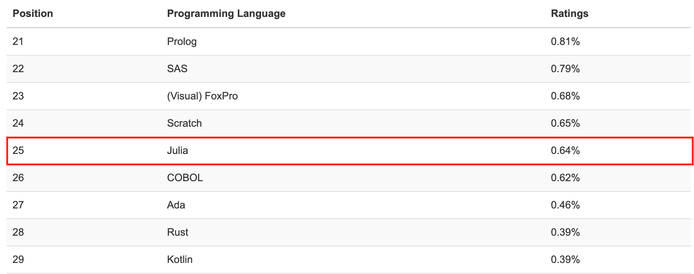
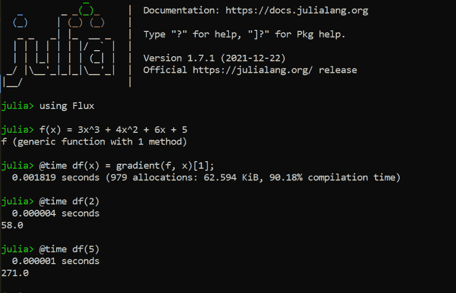
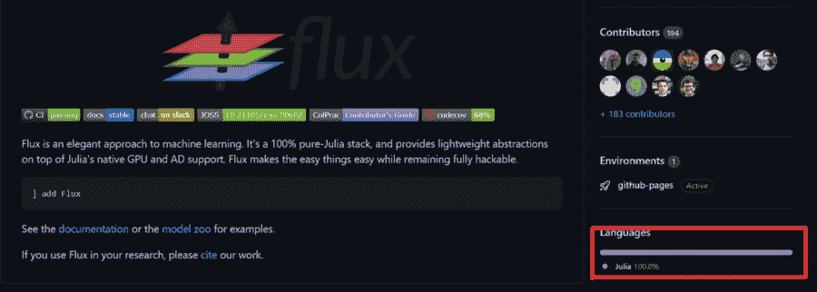
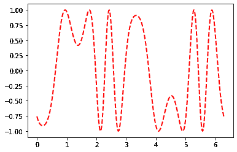
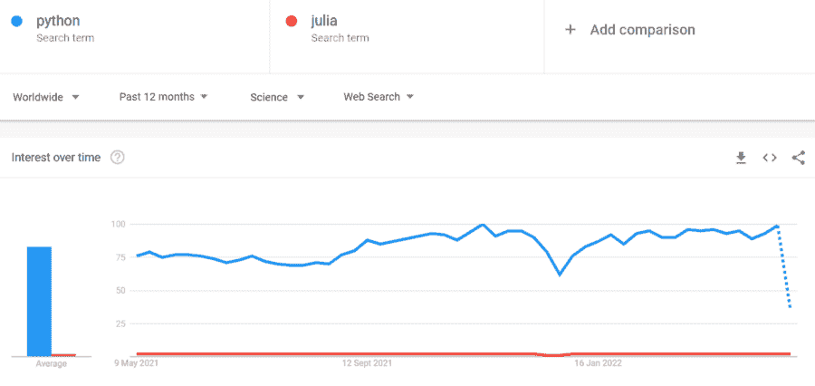
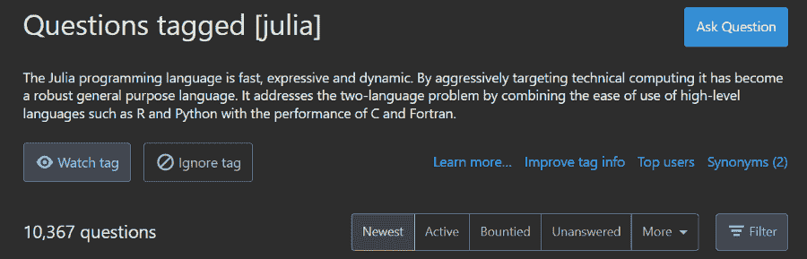
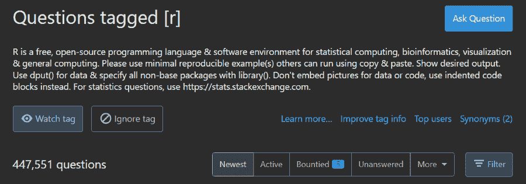
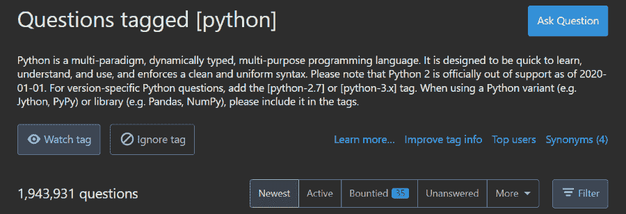

# 朱莉娅的崛起——2022 年值得学习吗？

> 原文：<https://web.archive.org/web/20221129041532/https://www.datacamp.com/blog/the-rise-of-julia-is-it-worth-learning-in-2022>

当考虑数据科学的编程语言时，Python 占据了至高无上的地位。虽然 Python 在大多数领域都超过了 R，但 R 在跟踪编程语言受欢迎程度的 5 月 TIOBE 指数中保持了其在前 15 名编程语言中的位置。事实上，在过去的一年中，R 使用的百分比增长远远高于像 JavaScript、Java、C 和 PHP 这样的泰坦语言。

Python 和 R 一起统治了数据世界，给类似的语言投下了阴影。

但是有一种语言已经脱颖而出，慢慢走向光明。那种语言就是朱莉娅。尽管它还很年轻，Julia 爱好者已经称它为数据科学和人工智能的“未来语言”。为了验证他们是否正确，让我们来看看 Julia 采用的一些指标，这些指标摘自 Julia 关于增长统计的年度简讯。

截至 2022 年 1 月 1 日，朱莉娅已被下载 3500 万次，2021 年的下载次数是过去三年总和的三倍。核心语言及其注册包已经在 Github 上聚集了总共 250，000 名明星，是六年前总和的 13 倍。 [Julia 的 GitHub repo](https://web.archive.org/web/20221212135742/https://github.com/JuliaLang/julia) 一家独大，39.1K 星，4.9K 叉，3.3K 发行。

朱莉娅登记的包裹数量在 4 月份达到了 7400 多个，比 6 年前多了 10 倍。至于它在所有其他语言中的排名，[5 月 TIOBE 指数](https://web.archive.org/web/20221212135742/https://www.tiobe.com/tiobe-index)将其置于第 25 位，比去年从第 47 位跃升的排名下降了三位。



*5 月 TIOBE 指数作者截图*

Julia 的实际 TIOBE 指数为 0.64%，也就是说在搜索引擎上所有与编程语言相关的查询中，有 0.64%的时候会弹出 Julia 的名字。换句话说，大约每 200 个编程相关的问题都是关于 Julia 的。

考虑到朱莉娅最早的稳定发布是在 2018 年，这些数字令人印象深刻。但是，这些数字是否意味着在可预见的未来，Julia 的受欢迎程度将只有 Python 或 R 的一半呢？现在还值得学习吗？在我们回答这些问题之前，让我们更仔细地看看语言本身。

## 朱莉娅是什么？

Julia 是一种科学计算语言，于 2012 年首次发布。编写它的四位创始人，Jeff Bezanson、Stefan Karpinski、Alan Edelman 和 Viral B. Shah，都有不同的背景，但都欣赏所有其他编程语言的集体力量。

为了让 Julia 成为最强大的语言，创始人为这种语言设计了一个特定的愿景。在一篇解释他们为什么创造朱莉娅的博客文章中，他们说朱莉娅应该是:

*   开源
*   和 C 一样快
*   像 Ruby 一样充满活力
*   同形符号，或把代码当作数据
*   数学符号中的类 Matlab
*   在宏中类似 Lisp
*   像 Python 一样通用
*   像 R 一样易于统计
*   像 Perl 一样自然地进行字符串处理
*   像 Matlab 一样强大的线性代数
*   类似 Hadoop 的分布

这些超凡脱俗的雄心壮志的确雄心勃勃。然而，当 Julia 1.0.0 在 2018 年发布时，他们已经兑现了六年前做出的 90%的承诺。

Julia 擅长编程的某些方面，这是任何普通语言都做不到的。例如，Python 为了灵活和动态类型化而牺牲了速度，而像 C、C++和 Java 这样的语言为了在运行时更快而严格静态和严格。至于 Julia，这种语言读起来像英语，完全是动态的，并且仍然是历史上最快的语言之一。

这些好处已经导致了这门语言引人入胜的应用。例如，巴西国家空间研究所(INPE)使用 Julia 来规划太空任务，而联邦航空管理局(FAA)正在使用该语言开发下一代防撞系统。

## 使用 Julia 的数据团队

不仅仅是航空航天工程，制药公司也在和 Julia 一起发展。辉瑞公司使用在 Julia 运行的模型，将心力衰竭治疗的模拟加速了 [175 倍。阿斯利康使用带有 Flux.jl 和 Turing.jl Julia 软件包的贝叶斯神经网络来](https://web.archive.org/web/20221212135742/https://juliacomputing.com/case-studies/pfizer)[预测药物毒性](https://web.archive.org/web/20221212135742/https://juliacomputing.com/case-studies/astra-zeneca)。你可以在另一篇文章中了解更多关于【Julia 用于的信息。

朱莉娅在全球一些最负盛名的机构任教，如麻省理工学院、斯坦福大学、康奈尔大学、加州大学伯克利分校、布朗大学、东京城市大学等。以下是一些在朱莉娅发展的全球知名公司。

*   美国英特尔公司(财富 500 强公司之一ˌ以生产 CPU 芯片著称)
*   迪斯尼
*   亚马孙
*   大写一
*   毕马威会计事务所
*   谷歌
*   微软
*   国家航空与航天局
*   国际商用机器公司


*如今使用 Julia 的公司*

## 是什么让朱莉娅与众不同？

朱莉娅的许多品质使其成为独一无二的语言。这里有一个让学习 Julia 引人注目的非详尽特征列表。

### 1.速度

我已经多次接触到它惊人的速度。但是，我们真正交谈的速度有多快呢？

1998 年，阿帕奇角天文台的研究人员开始对 35%天空范围内的所有可见物体进行成像。他们称该项目为 Celeste，并获得了 5 亿颗恒星和星系的数据集。16 年来，对这些图像进行编目是一项繁琐而费力的工作。

朱莉娅上场了。

2014 年，一个科学家和程序员团队聚集了 178TB 的图像数据，并在仅仅 [14.6 分钟](https://web.archive.org/web/20221212135742/https://juliacomputing.com/case-studies/celeste/index.html)内对 1.88 亿颗恒星和星系进行了点估计。

这一科学和编程壮举是通过在 Cori 超级计算机上运行 Julia 实现的，在 9300 个节点上跨 130 万个线程实现了 1.54 petaflops(每秒 10 次⁵运算)的峰值性能。因此，Julia 成为继 C、C++和 Fortran 之后第四种达到 petaflops 性能的语言。

### 2.句法

Julia 的另一个亮点是它的语法，它以一种曾经被认为不可能的方式表现了语言。在 Julia 发布之前，科学计算主要是用 Python 或 r 等其他动态类型语言完成的。由于计算是由物理学家、生物学家和金融专家完成的，他们不是经验丰富的开发人员，所以这些专家更喜欢更简单的语法，即使这是以失去计算速度为代价的。

Julia 也是动态类型的，使得学习和编写非常简单，但是作为一种编译语言，它可以和静态类型的语言如 C 或 Fortran 一样快。

### 3.多重调度

另一个优点是多重分派，尽管这对于编程来说并不陌生。不要太专业，多重分派指的是一个函数根据其参数类型做出不同行为的能力。这里有一个例子可以说明这一点是如何有用的:

```py
function _add_str(str1, str2)
   str1 * str2
end

function _add_int(int1, int2)
   int1 + int2
end

add(item1::String, item2::String) = _add_str(item1, item2)
add(item1::Int64, item2::Int64) = _add_int(item1, item2)
```

```py
[OUT]: add (generic function with 2 methods)
```

```py
add(4, 5)
```

```py
[OUT]: 9
```

```py
add("Julia ", "is awesome!")
```

```py
[OUT]: "Julia is awesome!"
```

如果你已经注意到，我刚刚在 Python 中实现了`+` plus 操作符，它随着输入类型的改变而表现不同。上面这个例子的美妙之处在于，您可以在几乎任何您想要的函数上启用 Julia 的多调度特性，并使它在不同的输入下表现不同。

这些是关于朱莉娅的一些美好的事情。现在，让我们把它与 Python 进行比较。

## Julia vs. Python，详细对比

在这一节中，我将尝试概述 Julia 和 Python 之间的差异。虽然比较将主要在 Julia 和 Python 之间进行，但是它们也适用于 R，因为 Python 在许多方面优于 R 或与 R 表现相似。

### 1.速度

我们先来看看语速差异，因为朱莉娅爱好者不断吹嘘自己语言的速度。我们将测量找到 Julia 的`Flux.jl`包中的函数的导数所需的时间，并与 Python 中的`Tensorflow`的`GradientTape`进行比较。

我们将从张量流开始:

```py
import time

import tensorflow as tf
start = time.time()
x = tf.Variable(5.0)

with tf.GradientTape() as tape:
   y = 3 * x ** 3 + 4 * x ** 2 + 6 * x + 5

   # dy_dx = 9x^2 + 8x + 6
   dy_dx = tape.gradient(y, x)

print(time.time() - start)
```

```py
[OUT]: 0.003016233444213867
```

求`x`的导数大约需要 0.003 秒。让我们在朱丽亚身上看到同样的操作:



*两个例子都在本地机器上运行(AMD 锐龙 9 3900x 12 核处理器，英伟达 RTX 2060 SUPER 8GB VRAM)*

我们第一次运行渐变，Julia 用了~0.002 秒编译，已经比 Tensorflow 快了。下一次运行时，评估速度提高了约 450 倍。速度测试—检查！

### 2.句法

现在，我们来谈谈语法。许多人声称朱莉娅代码读起来更像英语；它比 Python 更有表现力，更干净，尤其是对于科学计算。让我们来看看实际情况。

第一个例子是写数学表达式——你可以像在 MATLAB 中一样写多项式:

```py
x = 5
3x^2 + 5x + 4
```

```py
[OUT]: 104
```

```py
(x + 5)x
```

```py
[OUT]: 50 
```

还有一些大大简化条件句的短路表达式，来自于此:

```py
x = 73; y = 37

if x > y
   println("$x is higher than $y")
end
```

```py
[OUT]: 73 is higher than 37
```

对于这个精简的例子:

```py
x > y && println("$x is higher than $y") 
```

```py
[OUT]: 73 is higher than 37
```

本地 Python 和本地 Julia 之间还有其他有益的区别。例如，默认情况下，Julia 中的数组被认为是向量和矩阵，任何在其上运行的函数都将被矢量化，从而消除了不必要的循环。尽管如此，对于数据科学来说，Python 仍然是最用户友好的编程语言之一。

### 3.流行度和包装生态系统

然而，并不是每个人都准备好跳上朱莉娅的列车。我已经在介绍中谈到了朱莉娅的成长统计数据。就其本身而言，它们看起来相当令人印象深刻，但与 Python 相比，还有很长的路要走。

Python 以 12.74%的指数位居 TIOBE 排行榜之首，而 Julia 的指数为 0.64%。作为一门语言，有像 TensorFlow 或 PyTorch 这样的完整 Python 包比 Julia 更有吸引力。

Python 的数据科学和机器学习生态系统更加广泛和成熟。Julia 有超过 7k 的注册包，而 Python 有超过 110k。这些数字意味着 Julia 要成为最好的通用语言还有很长的路要走，尽管它可能在许多方面比原生 Python 有明显的优势。

虽然 Python 在规模上令其相形见绌，但对 Julia 程序员来说，一个优势是他们有更大的机会来改进语言，并在 Julia 生态系统中的许多不断发展的学科中留下自己的印记。此外，要开始为朱莉娅做贡献，不需要有多年的专业知识或精通多种语言。用 Julia 编写的库完全是用 Julia 编写的，没有其他语言的贡献。下面是一个`Flux.jl`存储库的例子:



相比之下，你不仅要掌握 Python，还要掌握 C++、C、GO 等其他语言。，以及它们是如何相互作用来开始理解关键 Python 包的代码的。


如果你确实想在 Julia 中调用 Python 等其他语言，像`Pycall`这样的包可以让它变得简单。这是一个正在运行的包:

```py
using Pkg

Pkg.add(PackageSpec(name="PyCall", rev="master"))
Pkg.build("PyCall")
using PyCall

plt = pyimport("matplotlib.pyplot")

x = range(0; stop=2*pi, length=1000)
y = sin.(3*x + 4*cos.(2*x));

plt.plot(x, y, color="red", linewidth=2.0, linestyle="--")
plt.show()
```



有类似的 Julia 包可用于调用其他语言，如`RCall`、`MATLAB.jl`等等。

### 4.学习资源

不幸的是，虽然 [Python](https://web.archive.org/web/20221212135742/https://www.datacamp.com/tracks/machine-learning-scientist-with-python) 和 [R](https://web.archive.org/web/20221212135742/https://www.datacamp.com/tracks/machine-learning-scientist-with-r) 有丰富的初学者友好的学习材料，但缺乏学习 Julia 的类似资源。缺乏免费和付费的关于 Julia 的指南、课程和书籍是它仍然没有被大量采用的原因之一，因为开发人员讨厌通过阅读文档来学习一门新语言。

由于给定主题的教育资源的数量通常与其搜索需求相关，我们可以查看 [Google Trends](https://web.archive.org/web/20221212135742/https://trends.google.com/trends/explore?cat=174&q=python,julia) 获取这方面的数据:



这个图显示 Python 的受欢迎程度明显高于 Julia。

对 Python 和 R 的社区支持也比 Julia 多得多。我们可以通过查看 StackOverflow 上每种语言的标记问题数量来确认这一点:







Python 无疑领先于这两种语言，但是随着它的采用，Julia 的培训材料和社区支持的可访问性也在增加。

## 朱莉娅值得学习吗？

那么，是时候回答这个百万美元的问题了——朱莉娅值得学习吗？

权衡这种语言的利弊，答案倾向于“是！”。这只是时间问题。

大多数数据科学家会说，在数据科学和机器学习之旅的早期阶段，你不应该学习 Julia。几乎 100%的数据角色都将 Python 或 R 列为要求，在职业生涯初期选择学习 Julia 而不是它们可能是一个严重的错误。如今，数据工作所需的技能和工具已经非常庞大，以至于要花相当多的时间投资才能让自己成为某个角色的资产。用朱莉娅分散你的注意力会让你远离一份有报酬的工作，并减缓你的职业发展。

开始学习 Julia 的最佳时机是当你觉得你已经掌握了 R 或 Python，并且可以用它们的库解决业务问题的时候。在那个阶段，Julia 将是您工具箱中的一个很好的补充，因为您可以充分利用该语言带来的所有优势和能力。

然而，一些专家对学习朱莉娅有完全激进的看法。正如 Ari Joury 在他们的文章中声称的那样，如果你早学并且学得好，Julia 可能是你通向未来的黄金门票。作者引用了人工智能本身的例子，因为它在 30-40 年前是一个非常小众的领域，但在 90 年代采用它的人现在非常受欢迎。

时间会证明这是否同样适用于朱莉娅，因为朱莉娅可能是你可以放在简历上的一件事，以真正从皮托尼斯塔中脱颖而出。决定权在你。你可以在我们单独的文章中找到更多关于机器学习的信息，朱莉娅和[从 MATLAB 进展到朱莉娅](https://web.archive.org/web/20221212135742/https://www.datacamp.com/blog/progressing-from-matlab-to-julia)。