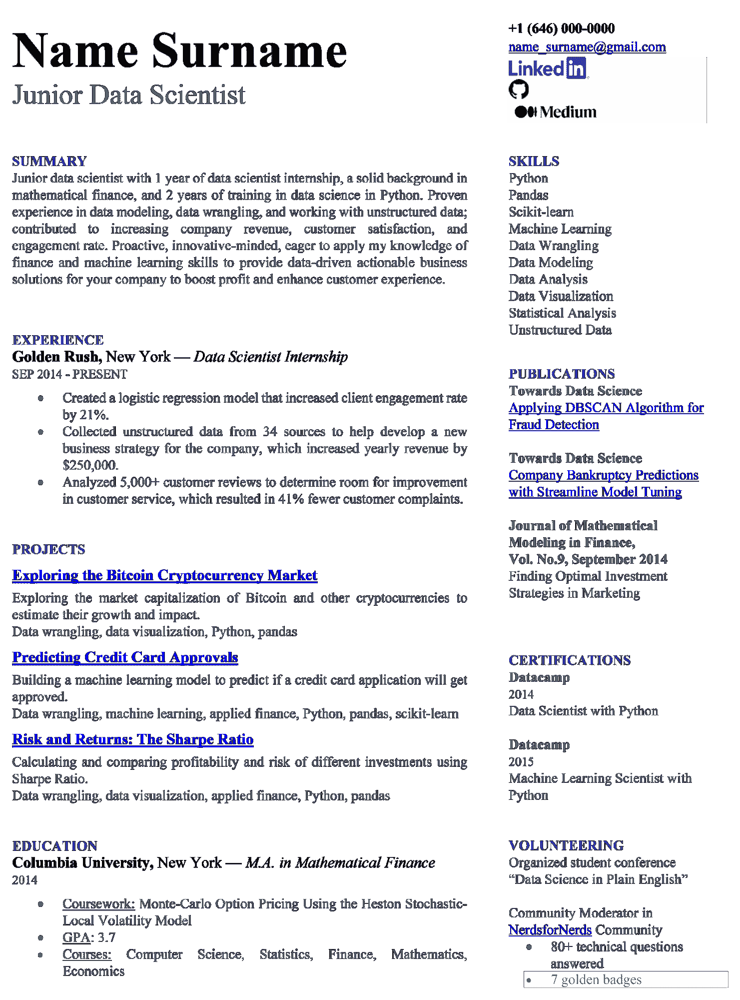
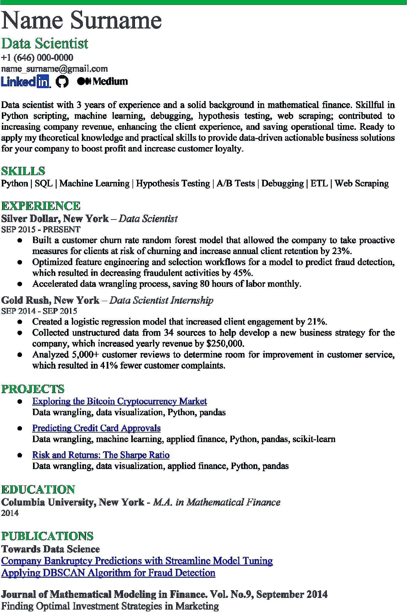
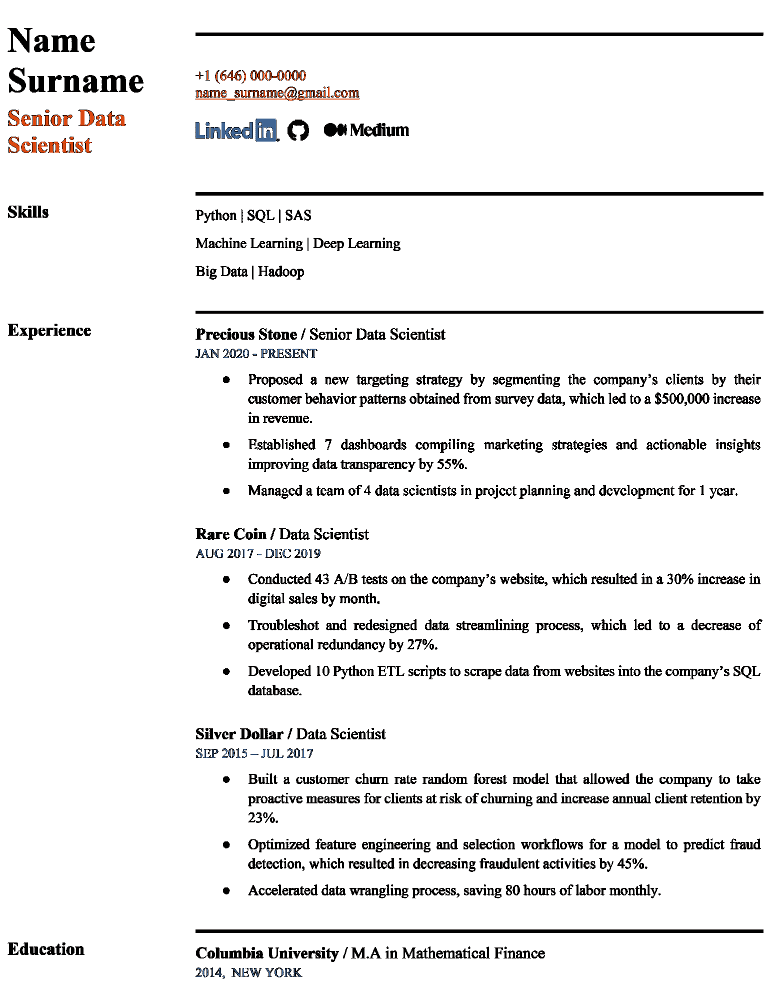

# 构建数据科学家简历的技巧

> 原文：<https://web.archive.org/web/20221129044127/https://www.datacamp.com/blog/tips-to-build-your-data-scientist-resume>

数据科学是现代就业市场上最具竞争力的领域之一，吸引着来自世界各地的有志专家。成为一名数据科学家意味着进入拥有诱人职业前景和高薪的特权圈子。对这一领域的兴趣不断增长，对数据专业人员的需求也在不断增加，但候选人需要满足的要求也相当苛刻。

对于数据科学求职者来说，重要的第一步是写一份有效的简历，能够给招聘经理/招聘人员留下足够深刻的印象，从而让你获得面试机会。对于那些已经在该领域拥有大量工作经验的专家来说，这是一项相对容易的任务，而对于入门级的数据科学家来说，这可能相当具有挑战性，并引发许多问题:我如何才能弥补我工作经验的不足？如果与数据科学不完全相关，描述以前的工作经历和/或教育是个好主意吗？哪个部分应该先走:教育还是经验？我需要包括什么样的项目，有多少个？我应该列出我的软技能吗？该不该给简历增色？总而言之，我如何才能脱颖而出，更接近被聘用为数据科学家的诱人目标？

在这篇文章中，我们将讨论一些基本的技巧和诀窍，如何制作一份引人注目、专业、易读的数据科学家简历，以吸引任何招聘经理或招聘人员的注意。

## 如何有效地组织你的简历布局和格式

## 把你的简历放在一页纸上

如果你打算在简历中加入大量信息，遵循这个建议可能会很痛苦。这甚至看起来违反直觉；为了给潜在雇主留下深刻印象，尽可能详细地向他们描述你的经历、教育、成就和技能不是更好吗？如果是这样，如果它占用了一页以上的空间呢？不管怎样，强烈建议你的简历总是保持一页长。

能够以浓缩的形式展示你的经历和成就是展示你沟通技巧的一个很好的方式。

## 选择简历模板

虽然你可以从头开始创建你的简历，并根据你的喜好组织它，但你可以通过使用在线简历生成器并从各种预先存在的简历模板中进行选择来节省时间。或者，可以从 Google Docs 或 MS Word collections 中选择一个合适的免费简历模板。这种模板通常清晰、视觉上吸引人、格式良好、易读、易于使用，并且在设计上可以帮助您在一个页面上容纳大量信息，而不会显得拥挤不堪。

这里有一些简历生成器，你可能会觉得有用:

*   [简历](https://web.archive.org/web/20220810054048/https://resume.io/)
*   [Zety](https://web.archive.org/web/20220810054048/https://zety.com/resume-builder)
*   [简历生成器](https://web.archive.org/web/20220810054048/https://www.resumebuilder.com/)
*   [坎瓦](https://web.archive.org/web/20220810054048/https://www.canva.com/it_it/)
*   [蛋糕简历](https://web.archive.org/web/20220810054048/https://www.cakeresume.com/)
*   [VisualCV](https://web.archive.org/web/20220810054048/https://www.visualcv.com/)
*   [ResumeCoach](https://web.archive.org/web/20220810054048/https://www.resumecoach.com/lp/resume-builder/)

许多简历制作商，包括上面列出的那些，都提供了大量功能齐全的免费模板，以及更高级的付费版本。在为你的数据科学家简历选择模板时，优先选择除了黑白以外只有一两种颜色的简单模板，而不是花哨多彩的模板。后者更适合艺术或设计等其他领域，在这些领域，看起来有创意的简历会给雇主留下深刻印象。在我们的情况下，最好避免不必要的装饰。

## 考虑选择两栏布局

选择一个有两栏的简历模板(额外可以有一些窄栏)有助于更有效地利用页面的垂直空间。这样，你可以在简历中放入更多的信息，并且更好地组织不同的部分。

## 使用有效的格式

如果你决定从头开始创建你的简历，或者对已有的模板进行修改，这一组提示将会很有用:

*   使用优雅的文本字体
    *   好例子:Calibri，Times New Roman，Arial，Verdana，Cambria，Tahoma，Georgia
    *   不好的例子:漫画无 MS，MS 哥特，墨水免费，代理 FB，OCR A 扩展
*   使用足够大的字体:文本使用 11-12pt，章节标题和页眉使用 14-16pt
*   将章节标题和页眉加粗
*   避免使用过多的文本样式，如粗体、斜体、粗斜体和下划线
*   使用 1-1.15 倍行距
*   避免枯燥的黑白简历——加点颜色让简历突出，但不要夸张，1-2 种颜色就够了
*   避免视觉效果、装饰或不必要的图标
*   使用项目符号让你的简历看起来干净、有条理、容易理解

## 保持格式一致

这是指各种文体特征。例如，如果你在简历的不同部分使用项目符号，你应该使用统一的风格，例如，空方块。缩进、字体样式、日期格式等也是如此。幸运的是，如果你在一个在线简历生成器中创建简历，所有这些元素和格式通常都会为你预先定义好。

## 关于数据科学家简历内容的一般提示

## 创建主简历

在开始申请数据科学工作之前，首先创建一份“主简历”是有意义的。这是一个巨大的、非常详细的简历版本，可以有 2-3 页甚至更多，你可以在其中包括你所有的工作经历、学习、项目、技术和软技能以及其他成就。

如果你是一个试图从另一个领域进入数据科学的职业改变者，考虑在你的主简历中包括你以前工作的经验；你可能会比你意识到的拥有更多的可转移技能。毫不奇怪，你的主简历的每一部分都有很多要点。完成后，您可以轻松地将其作为各种数据科学工作职位的申请基础；只需从主简历中删除多余的细节、章节和要点，并根据每次提交的内容进行调整。

## 根据每个职位描述定制您的数据科学家简历

这一步在你的求职过程中至关重要。为了增加你的简历脱颖而出的机会，你必须为你申请的每个职位定制简历。招聘经理通常每天都会收到大量的申请，所以可能只有几秒钟的时间浏览每一份申请，然后再决定它们是否值得更详细的阅读。因此，你的简历吸引他们的眼球是至关重要的。

这里最好的方法是仔细阅读职位描述，弄清楚整个“愿望清单”和公司对候选人的要求。基于这些事实，在你的简历中加入并突出这些想要的技能。在工作描述中，只要有可能，就要使用相关的关键词；这将有助于你的简历通过公司可能使用的任何求职者跟踪系统(ATS ),并到达人们的眼前以供进一步考虑。

除了仔细阅读职位描述，浏览一些关于公司本身的信息也是一个不错的主意。探索该公司的网站，它的使命，价值观，社交媒体，产品和服务，这样你就可以更好地了解这个雇主在一个成功的候选人身上寻找什么。让你的简历显示出你是这家公司的最佳人选，拥有帮助公司发展的所有潜力。每个公司寻找的不是想要任何工作的专家，而是想要这份工作的人。

## 简洁但信息丰富

现在，您已经确切地知道了应该在数据科学家简历中包含哪些内容，您应该重新加工和调整这些信息，使其简洁、精确、相关且表达清晰。不要包括任何可能不会给这个角色增加额外价值的东西，也不要包括工作描述中没有提到或暗示的东西。保持你的简历简洁、有目的、信息丰富。任何项目符号语句都应该简短，不要跨越几行。

## 遵循逆时间顺序

教育和工作经历部分最常见和首选的格式是倒序排列。最近的经历应该放在最上面，然后是倒数第二个，依此类推。这让招聘经理可以快速跟踪你的职业发展和最新成就。

## 使用简单但有效的语言

使用简单明了的语言是展示你沟通技巧的另一种方式。为了有效地做到这一点，请记住以下建议:

*   不要让你的数据科学家简历充斥着技术术语。虽然你申请的工作岗位可能需要高水平的技术技能和知识，但请记住，第一个看你简历的人将是招聘经理或招聘人员。取决于谁是公司的招聘主管，他们可能有不同的背景，因此可能会发现太多的技术术语令人困惑。因此，确保你写的东西让每个人都能理解你对公司的潜在价值。
*   以工作描述为指导；如果它充满了行话，那么你可以听起来更专业一点。否则，尽量只包括广告中提到的主要算法和技术。
*   用简洁的句子写。
*   保持简历的时态一致。
*   避免夸大其词。用帮助代替便利，用使用代替利用，用管理代替管理，用复杂代替复杂，等等。
*   当描述你的工作经历、项目和成就时，使用有意义的动词。例如，用构建的、自动化的、优化的等来代替诸如工作的、制造的或参与的动词。我们将在本文后面更详细地讨论这个技巧。
*   替换最高级(最高、最好、最重要等。)和看似强大但实际上信息不丰富的形容词，如有经验的、强大的、可观的、高效的，以及具体的指标和结果。使用这些强有力的词语(有经验的、深刻的、经过验证的等等。)在你简历的总结部分保留。
*   请一位非技术背景的朋友阅读你的数据科学家简历。请他们给你反馈:是否足够容易理解？语言是否清晰简单？你成功传达了你的主要职业成就了吗？

## 检查错误和打字错误

显然，较小的错误、愚蠢的错误和打字错误会给招聘人员留下负面印象，导致他们拒绝你的简历。使用专门的在线服务([语法](https://web.archive.org/web/20220810054048/https://app.grammarly.com/)或类似服务)仔细检查你的语法和拼写，并请人检查你简历中的任何打字错误或错误。

## 将您的数据科学家简历发送给一个真实的人

在进入招聘人员手中之前，简历通常会经过一个名为申请人跟踪系统(ATS)的机器学习程序，该程序会决定它是否值得传递给人类或应该被拒绝。要绕过这一步，试着把你的简历直接寄给招聘经理，甚至是负责该职位部门的技术经理。

## 如何安排你的数据科学家简历的整体结构

## 简历中应该包括哪些部分

按照从上到下的推荐顺序，数据科学家简历的典型部分包括:

*   联系信息
*   总结(或目标)
*   工作经验(或者仅仅是经验)
*   项目
*   技能
*   教育
*   附加部分

这些标题的顺序可以相对灵活，并且应该反映每个部分的重要性，所以第一个标题应该比最后一个标题占据更多的空间。在两栏简历设计的情况下(首选)，记住招聘人员通常从左上角到右下角浏览简历。所以，确保你把最相关的信息放在页面的左上角。

## 如何确定各部分的最佳顺序

各部分的最佳顺序，尤其是工作经验、项目、技能和教育，取决于两个因素:

1.  你的真实经历。在这里我们可以找到不同的场景:
    *   如果你有很长的相关工作经验记录，优先考虑简历中相应的部分，大幅减少关于你的教育信息，甚至可能排除你的额外项目。
    *   如果你是一名经验有限的应届毕业生，把教育部分放在第一位，添加关于你的最终投票的信息(当然，只有当他们有利高的时候)，并更详细地描述你的课程工作或论文。
    *   如果你在数据科学方面的经验有限，并且主要从事自由职业者的项目，交换项目和工作经验(或者甚至将它们合并成一个部分的经验)，包括你有过的任何与数据相关的实习经历(如果有的话)，并详细说明你的技能。
    *   如果你是从另一个领域进入数据科学的职业改变者，专注于项目和技能，少写你的工作经历和教育，尽管不完全省略这些部分是明智的。
2.  公司简介和职位描述。很符合逻辑的是，如果你在学术环境中申请工作，更多地扩展你的教育、证书、额外的课程和科学出版物。否则，多暴露一些商业导向的经验和成就。特别是对于初创项目，潜在候选人的宝贵品质是独立工作的能力、积极主动和具有创新思维。在这种情况下，展示更多的单个项目可能是一种优势。

## 你的简历中还包括哪些内容

对于您的数据科学家简历，请考虑以下附加部分:

*   证书
*   出版物
*   会议
*   黑客马拉松
*   奖金；奖品
*   竞争
*   自愿参军
*   语言

如果每一部分至少有两个要点，你可以分别介绍其中的任何一个。例如，如果您完成了三门数据科学课程，并在两个与数据相关的会议上发表了演讲，那么添加认证和会议部分是有意义的。否则，如果你对某些类别只有一个要点(例如，一个会议、一个出版物和一个黑客马拉松)，最好将这些成就合并到一个叫做 Extras 的部分。

## 避免冗长的副标题

命名副标题时，尽可能简洁:

*   相关工作经验工作经验(或仅仅是经验)
*   职业经历工作经历(或经历)
*   著名项目项目
*   技能和知识技能
*   技能和工具技能
*   执照和证书证书
*   附加信息附加信息

## 如何正确填写您的联系方式

你的联系信息最适合放在简历的顶部，尽管有些在线模板把它放在页面的底部(如果你选择的模板是这种情况，就手动把它拖到顶部)。这一部分最关键的要求是信息的准确性。

以下是您需要在联系信息中包含的内容:

*   你的全名。
*   你的职位。在你的全名下面，写上你申请的职位名称，而不是你现在的职位名称。您可以从确切的职位描述中复制职位名称，或者，如果它太长太具体(例如，地学数据分析和 Webtool 开发的数据科学家)，请将其缩减为更容易理解的形式(例如，数据科学家)。
*   你的电话号码。不用说，这应该是你的私人电话号码，而不是你目前工作单位的电话号码。
*   你的邮件。填写你看起来很专业的电子邮件地址，应该是你的名字和姓氏的组合:[【电子邮件保护】](/web/20220810054048/https://www.datacamp.com/cdn-cgi/l/email-protection)不要在这里填写你可能用于私人用途的轻浮或不合适的电子邮件，比如[【电子邮件保护】](/web/20220810054048/https://www.datacamp.com/cdn-cgi/l/email-protection)如果你还没有专业的电子邮件地址，就创建一个。
*   你的位置。这是可选的，不需要包括您的整个地址。城市和州或国家就够了。
*   你在 LinkedIn、GitHub、Medium、Kaggle 等网站上活跃的和更新的个人资料的可点击链接。大多数雇主会在这里查看潜在候选人的额外信息，例如他/她的项目组合、关于数据科学主题的文章以及参加黑客马拉松的情况。不要添加原始、笨拙和冗长的链接，考虑插入相应网站官方标志的图标，并使其可点击，直接指向你的个人资料。你可以在谷歌上搜索官网 logo，这里有 [LinkedIn](https://web.archive.org/web/20220810054048/https://brand.linkedin.com/downloads) 、 [GitHub](https://web.archive.org/web/20220810054048/https://github.com/logos) 、 [Medium](https://web.archive.org/web/20220810054048/https://medium.design/logos-and-brand-guidelines-f1a01a733592) 和 [Kaggle](https://web.archive.org/web/20220810054048/https://www.kaggle.com/brand-guidelines) 的 logo 链接。显然，您决定在数据科学家简历中包含的所有个人资料应该有效地支持您的数据科学技能和成就。如果你的 LinkedIn 个人资料只涉及你以前的职业，或者如果你的 Github 个人资料不包含任何数据科学项目，那么展示你的 LinkedIn 个人资料是没有意义的。

联系信息部分还有几个建议:

*   不要包括这个部分的名称(不像你对其他部分所做的那样)，直接插入信息即可。
*   以此类推，不要添加类别的名称(全名、电话号码等。).例如，代替电子邮件:[【电子邮件保护】](/web/20220810054048/https://www.datacamp.com/cdn-cgi/l/email-protection)简单地写[【电子邮件保护】](/web/20220810054048/https://www.datacamp.com/cdn-cgi/l/email-protection)
*   不要加上你的照片。虽然一些简历模板提供了此选项，但您的数据科学家简历可以考虑跳过此选项。

## 如何写一份引人注目的数据科学家简历摘要或目标

在你的联系信息之后，放上摘要或目标部分。这两个部分是不一样的，你只需要选择其中的一个。简历概要是对你的职业经历、成就和资历的简要描述(2-3 句话，没有要点)。简历目标是一个简短的陈述(也是 2-3 句话，没有要点)，集中在你未来的职业目标和你能为雇主提供的潜在价值上。

如果你从另一个领域转到数据科学，这些部分是至关重要的，因为它们以浓缩的形式解释了为什么你是数据科学家工作的完美候选人。如果你已经有了一些数据相关领域的经验，选择 Summary。相反，如果你是一名应届毕业生，没有什么工作经验，那么选择 Objective 来展示你对数据科学的热情和对公司有用的意愿。

一份好的简历摘要或目标应该:

*   说明你的经验水平(初级、高级、有经验等)。)和你的专业领域
*   提及你在数据科学领域的工作年限(如果有)
*   简要具体地总结你的技能和成就
*   包括你的教育和证书信息
*   如果是这种情况，请解释您进入数据科学领域的原因
*   概述你的长期职业目标
*   展示你对工作和公司的动力和热情
*   解释你能为公司提供什么价值

你需要选择适合你的情况的要点，并写一份简短清晰的简历介绍(总结或目标)，为确切的工作职位定制。最终的文本应该讲述一个关于你非常适合这家公司的令人信服的故事，并引起雇主的注意。

## 如何让你的工作经历展现出好的一面

## 工作经历部分包括哪些信息

这一部分通常是招聘人员最感兴趣的，因此它应该是你的数据科学家简历的主要焦点。按时间倒序列出你的工作(或者如果你有很长的工作经验，只列出最近的)。如果你缺乏实际经验，可以考虑加入数据科学实习。对于每项工作，请提供以下信息:

*   雇佣日期(开始和结束的月份和年份，或现在)
*   你的职位
*   公司名称
*   你在那项工作上的成就

在可能的情况下，尽量避免简历中出现任何大的空白(超过六个月)，尤其是最近几年。即使你以前的工作不是数据科学领域的，最好也包括在内，但没有必要说得太详细。如果你以前的所有经验都来自一个完全不同的领域，试着弄清楚你实际上在那里实践了哪些可以应用于数据科学的技能，以及你给企业带来了什么价值。如果你是应届毕业生，没有任何工作经验或实习经历，那就跳过这一节。

然而，当您在数据科学/数据分析方面有一些经验时，让我们回到一个“理想”案例。对于相关的过去角色，使用项目符号简要描述您的数据驱动的成就以及您在每个职位上为企业提供的价值。第一个要点应该是最能说服招聘人员进一步阅读的。避免许多人犯的错误；列出他们的职责和技术方面，而不是强调他们在以前的工作中取得的最佳商业成就。

## 使用有效的词汇

在你的工作描述中，尽可能的具体而简洁是很重要的。每个要点的理想格式是:

动作动词-任务-结果

动作动词是有意义的和有目的的 ATS 友好动词(那些跟踪公司软件的申请人更可能搜索的动词)。一些流行的例子是:

加速、激活、聚合、分析、评估、增强、自动化、构建、计算、校准、蔻驰、编码、收集、编译、计算、概念化、进行、合并、构建、协调、创建、调试、减少、部署、派生、设计、确定、开发、启用、工程、增强、建立、估计、评估、执行、提取、修复、预测、制定、识别、实施、改进、合并、增加、启动、集成、插入、启动、领导、提升、清算、管理、机械化、指导、建模、操作、优化、组织、执行、预测、准备、提议

这样的动词，除了让你的简历看起来更友好之外，比一般的动词如做、合作、制作或工作更准确地表达了你职业活动的结果。但是，不要混淆动作动词和夸张动词(例如，使用帮助而不是促进)。

除了“正确的”动词，不要忘记包括招聘启事和你申请的公司网站上的关键词。记住，每份简历都应该针对特定的职位和公司进行定制，以增加你成功的机会。

## 使用数字

列出你的数据驱动的成就。试着提供你对业务的积极影响的硬数字和具体指标，而不是使用模糊的最高级或一般的形容词(最高、强、相当大、重要等)。).在向潜在雇主证明你了解大局、知道如何将自己的技能用于实际商业任务时，数字看起来更有说服力。

请注意，我们在这里讨论的不是模型性能指标，而是您构建的模型为公司带来的实际的、可衡量的价值。例如，不要声明您创建了一个准确率为 99%的机器学习模型，该模型将客户参与度提高了 21%，而是跳过关于模型准确率的信息，并编写以下内容:

创建了一个机器学习模型，将客户参与度提高了 21%。

你提到的数字可以是百分比、美元、你管理或辅导的人数、时间或其他时间段。这里可以使用粗略的估计。

## 展示你的合作能力

数据科学不仅仅是数字和建模，还包括将你的见解传达给你的团队和股东的能力，以帮助公司做出数据驱动的战略决策。

不要在简历中写你是一名优秀的团队合作者，具有公认的沟通技能，你可以通过描述你在多学科和(可能)跨国环境中与同事、其他部门(包括非技术部门)和数据消费者合作的工作来展示这些技能。关注你在这些项目中所扮演的角色，以及你所做出的可衡量的贡献。

## 如何更好地展示您的项目

## 包括什么样的项目？

这一部分对于初级和入门级数据科学家来说至关重要，因为他们通常没有工作经验。工作经验部分和项目部分之间的平衡是显而易见的:你的工作经验越多，你的项目部分在简历中所占的空间就应该越少，如果你是一名高级数据专家，甚至可以完全排除它。

无论您是在大学、硕士课程中还是在训练营中学习数据科学，您很可能已经有了一个或多个关于数据科学或数据分析的项目。您可以包括与数据相关的课程作品、bootcamp 的指导和顶点项目、自由职业作品、GitHub 开源项目的贡献以及您选择的主题中完成的个人项目。如果你没有要包括的项目，考虑做一个模拟项目。毕竟，作为一名数据科学家意味着对数据以及从中可以获得的洞察力感到好奇。

如果你有很多数据科学项目，你需要优先选择最相关的和你最引以为豪的。展示 3-4 个好项目总比一打平庸的好。对于一个入门级的数据科学家来说，有许多不同概念的不同类或训练营项目，使用各种工具和技术，这很好，也是意料之中的事情。当你觉得你已经准备好考虑一个特定的商业利基时，开始关注它，获取领域知识，并创建与该特定领域相关的项目。

## 每个项目包括哪些信息

当您选择了要放入数据科学家简历中的相关项目后，请按时间倒序(或从最相关到最不相关)对它们进行排序，并考虑包含每个项目的以下信息:

*   Github 文件夹中的项目名称和链接
*   然后，使用要点清楚地陈述简明的项目目标:

*   对所使用的数据源、技术、编程语言、库、工具和技能的简要而具体的描述(避免过度使用技术术语)

*   你个人对项目的贡献(如果是小组项目)
*   你工作的量化结果，证明你有能力运用你的技能来解决现实世界的问题。

当然，我们在工作经历部分讨论的许多建议也适用于此:关注你有意义的成就，使用动作动词和工作描述/公司网站上的关键词，避免夸张和笼统的词语，使用数字和具体的指标。

## 如何战略性地突出你的技能

## 列出哪些技能

无论资历高低，这一部分在数据科学家的简历中都是必不可少的。为特定工作岗位创建技能列表的最佳方式包括以下四个步骤:

1.  写下工作描述中明确或隐含提到的所有技术技能、语言和工具。使用下面的列表作为灵感:A/B 测试、大数据、C、C++、数据分析、数据清洗、数据挖掘、数据建模、数据可视化、数据争论、调试、深度学习、Hadoop、假设检验、Java、Keras、机器学习、数学、Matplotlib、NLP、NoSQL、Numpy、Pandas、PowerBI、预测建模、概率、Python、定量分析、R、SAS、Scala、Scikit-learn、Seaborn、Spark、SQL、统计分析、统计、Tableau、TensorFlow、非结构化数据
2.  在你创建的列表中，标出所有你真正拥有的技能，并且在面试中展示出来会很舒服。最好的方法是用你的主简历作为参考。虽然你不应该编造任何你实际上不具备的技能，但考虑调整你现有的技能，以具体适应特定工作岗位的要求。例如，如果你知道包括 MySQL 在内的几种 SQL 风格，并且工作招聘声明 MySQL 是一项需要掌握的技能，那么只写 MySQL 而不要提到通用 SQL，或者列出你知道的所有 SQL 风格。另一方面，如果感兴趣的角色需要 SQL 的一般知识，那么只写 SQL，不要列出你知道的所有变体。
3.  你的技能清单应该包含 6-10 项。你的专业水平越高，你的清单上的项目就越少，因为你的工作经验会为你说话。如果你是一名入门级或初级专家，如果你还没有机会运用你所有的工具包来解决现实世界的任务，这是可以的，但你仍然希望向招聘人员展示你拥有这些技能。因此，如果在第二步之后，你的清单上少于 10 项技能，考虑增加一些你实际拥有的，你认为对这个职位有用的技能，即使它们没有在招聘广告中提到。
4.  在你的最终清单中对技能进行排序，把你最强和最相关的放在最前面。

## 不要包括你的技能水平

虽然有些简历模板有一个选项，可以根据你对每项技能的熟悉程度对它们进行排名，但最好跳过这一步。这种评估可能非常主观，并受到[催款-克鲁格效应](https://web.archive.org/web/20220810054048/https://en.wikipedia.org/wiki/Dunning%E2%80%93Kruger_effect)的影响:你的“精通”对其他人来说可能是“基本的”，反之亦然。为了避免低估或高估自己，不要对自己的技能进行排名，如果模板中有相应的选项，请手动将其删除。

## 不要包括你的软技能

众所周知，招聘人员通常会寻找具备团队合作、沟通和领导能力等软技能的数据专业人员。那么，是否应该把这些技能直接列在技能部分呢？大概不会。更令人印象深刻的是，在工作经验和项目部分展示你的软技能，并结合你的技术技能来获得有价值的实际结果。

你认为自己是一个完美的团队合作者吗？写下你对合作项目的贡献。你是一个好的领导者吗？描述你管理团队或指导/训练初级专家的经验。最后，突出您优秀沟通技巧的最佳方式是在您的数据科学家简历中简明扼要地展示您的经验和成就。

## 如何更好地展示你的教育

通常情况下，如果你有任何与数据相关的工作经验、实习或项目，你应该把教育放在这些部分之后(也放在技能之后)。事实上，你在数据科学领域的资历越高，教育部分就应该越短。然而，如果你申请的是一个学术性很强的职位，或者你是一个没有工作经验的应届毕业生，这一部分放在简历目标之后是合乎逻辑的。对于您的教育(或每项教育，如果您有几个学位)，包括以下信息:

*   最高学位类型(学士、硕士、博士)和专业(即使与数据科学无关)
*   大学名称
*   学习期间(开始和结束的月份和年份，否则使用预计毕业日期)

剩下的要点只有在你想拓展你的教育时才需要用到，例如，如果你没有相关的工作经验/项目，或者如果你正在申请一个学术职位:

*   GPA(仅适用于应届毕业生，且高于 3.5 分)
*   学术项目(课程、论文、论文等。).如果你有一个以上的学术项目要展示，使用项目符号。添加简短的项目描述或列出涵盖的主题。
*   学术课程:增加 2-3 门你认为最相关的课程，可以选择分数。
*   学术成就和荣誉

不要在教育部分提及你参加的各种数据科学训练营、技能途径或课程。稍后您将在认证中添加它们。

## 在附加部分中还可以提供哪些有用的信息

让我们看看你的数据科学家简历中还有哪些有用的部分，并帮助你展示你对数据科学的热情和奉献。如果每个标题至少有两个要点，可以考虑添加这些部分中的任何一个，否则可以将几个类别合并到一个叫做 Extras 的部分中。

## 证书

如果你想找一个入门级的职位，你可以在这里放置相关的课程和训练营。除了数据科学和数据分析认证之外，还可以考虑加入一些课程，比如编程、线性代数、概率或统计。如果你有官方的数据科学认证(微软、IBM、SAS、谷歌)，在这一部分提到它，并考虑将其添加到简历的标题中，紧挨着你的头衔(例如，数据科学家，IBM Certified)。

## 出版物

这一部分不仅在学术上有价值，在商业环境中也有价值，因为它很好地证明了你对工作职责之外的数据的好奇心，你独立工作或与团队合作(在团体出版的情况下)的能力，以及向广大受众清楚地解释复杂的数据相关概念的能力。对于每篇文章，包括它的名字，发表它的期刊或杂志，在线出版物或你自己的博客的链接(如果适用)，以及一个简短的摘要(或覆盖的主题，或只是关键词)。

## 会议

仅列出您出席的与数据相关的会议。包括每次会议的名称、地理位置、日期、你的工作名称以及你的同事(如果有的话)的名字。

## 黑客马拉松

数据科学黑客马拉松是展示您的团队合作和技术技能、创造力、创新思维以及产生实际成果的能力的绝佳方式。简要概述你的黑客马拉松项目的范围、产品及其应用、你的个人贡献和成就。

## 奖金；奖品

请在此填写您在数据相关领域的工作或竞赛中获得的任何奖项。这些奖项可以是黑客马拉松、Kaggle 竞赛、学术工作和出版物。为每个奖项添加简短描述。或者，您可以考虑在相应的部分中添加这些信息。

## 竞争

简单描述一下你参加过的数据科学竞赛和取得的成绩。这些可以是来自 Kaggle，DrivenData，DataHack 等的比赛。你可以在这个 [GeeksForGeeks 帖子](https://web.archive.org/web/20220810054048/https://www.geeksforgeeks.org/8-most-popular-data-science-competitions/)上找到有趣的想法。

## 自愿参军

如果您有在一些数据科学社区担任志愿者/主持人的经验，或者有解决堆栈溢出问题的良好记录，请使用此部分提供详细信息并列出您的成就。像往常一样，试着用数字来支持你的话(例如，解决的技术问题的数量、有公认答案的问题、评级、声誉、徽章、阅读时间等)。)

## 语言

在您的数据科学家简历中，您不太可能需要这一部分。即使英语不是你的母语，从你的简历本身和你提供的额外资源(GitHub，LinkedIn 等)中，你的水平将会非常明显。).只有当你在申请一份能讲第二门语言的国外工作时，当然，如果你能熟练地讲第二门语言，才考虑增加这一部分。在这里，添加假定的熟练程度是可以接受的(例如，母语、流利、高级、中上、中级)。

## 不要包括兴趣/爱好

虽然一些简历模板提供了兴趣/爱好的附加部分，但在您的数据科学家简历中最好跳过它。虽然这些信息可能会很吸引人，并有益地让你成为一个有很多兴趣的好奇的人，但这不是招聘人员在现阶段要寻找的东西。

这同样适用于其他信息，如您的旅行、meetup 活动的参与、社交游戏、数据科学领域之外的志愿者活动、其他语言的熟练程度(除非当前职位明确要求)以及您的驾照。最好在你的数据科学家简历中把这个地方用在别的地方。你将有机会在面试中提及你的爱好和任何其他关于你自己的有趣信息。

## 数据科学家简历示例

现在，让我们更细致地看看一些不同经验水平的模拟数据科学家简历，看看如何将我们到目前为止讨论的所有内容付诸实践。此外，让我们让它变得更有趣(也更有效率)，并追溯同一(想象中的)人的职业演变。

## 初级数据科学家简历

下面的示例简历与我们想象的候选人除了数据科学家实习之外没有任何经验的阶段有关。这份简历，以及随后的几份简历，都是从谷歌文档中选择免费简历模板制作的，只做了一些修改。

*   简历有一页长，包含很多信息，看起来不会让人不知所措。页面上有足够的空白。
*   预定义的模板不仅仅是黑白的，而是多了一种颜色，这使它在美学上更令人愉快，更容易遵循，但同时也不会分散注意力。
*   整体布局是两栏式的，对于一个初级数据科学家来说，这是一个很好的选择，他希望通过各种其他数据相关的活动和成就来弥补实际经验的不足，这意味着要在简历中添加许多部分。
*   在标题中，我们看到一封看起来很专业的电子邮件，以及链接到候选人在 LinkedIn、Github 和 Medium 上的个人资料的可点击图标。(边注:遗憾的是，它们在上面的 PNG 图片上是不可点击的，只能在这份模拟简历的 Word 和 PDF 原版上点击。就这一点而言，简历最终版本中链接的可点击性是另一个需要检查的重点。)
*   所有的小标题都清晰简洁。
*   因为候选人至少有实习经历可以展示，所以写摘要而不是目标是个好主意。
*   总结有 3 句话长，简洁但信息量很大。候选人提到了他们的实习经历、教育和数据科学培训，因为他/她在这个领域仍然很年轻，也没有数据科学的正式学位。然后，他们简要描述了他们的技能(包括软技能)，更重要的是，成就，对工作岗位表现出的热情，以及他们能够为公司带来的潜在商业价值。
*   在经验部分，候选人着重于他们在实习岗位上的商业成就，并有具体的数字支持。他们用一个动作动词开始每个要点。这里没有使用技术术语、模糊或多余的词语。
*   由于候选人的经验仍然相当有限，他们列出了他们最相关的训练营项目，包括目标、应用的技能和工具，以及他们文件夹中每个项目的链接。
*   由于缺乏经验，候选人在他们的教育(添加他们的课程、GPA 和相关课程的主题)、志愿数据相关活动(在这里也给出一些硬数字)和数据科学培训方面扩展了一些。
*   在技能部分，候选人只列出了他们的技术技能。这个清单足够长，包括候选人拥有的技能和他们可以使用的工具。
*   在出版物部分，候选人既包括他们关于数据科学的文章，也包括与他们最初的学位相关的文章——数学金融。

## 数据科学家简历

现在，让我们假设我们的候选人在一家名为 Silver Dollar(一家假公司)的公司获得了一份数据科学家的工作。在那里工作两年后，他/她又开始寻找新的职业挑战。这位候选人不再年轻，所以他们的简历也相应地改变了:

*   在这份更新的简历中，重点明显转移到了工作经历上，而不是各种“附加条件”。
*   简历有一页长，以简洁的形式包含最相关的信息，页面上有足够的空白。
*   除了黑色和白色之外，模板还有绿色，这使得它在美学上更令人愉快，容易跟随，并且不会分散注意力。
*   整体布局是一列。在这种情况下，这是可以的，因为候选人包括的额外部分比以前更少，也更短。
*   在标题中，我们看到相同的可点击图标链接到候选人的各种个人资料(很可能是更新的)。
*   总结部分有 3 句话长，但比之前的简历要短。候选人不再提及他们的数据科学训练营，因为他们的经验更能说明问题。此外，“自动广告”软技能被删除。实习经历不再像以前那样被单独强调，而是被添加到最近两年的工作经历中。更重要的是，我们可以清楚地看到，候选人列出了与旧简历不同的技能(技能部分也可以这样说，它变得更短了)。这并不意味着候选人“忘记”了他们以前的技能。相反，最有可能的是，他们将摘要和技能中的关键点和成就进行了调整，以适应准确的工作描述，这在撰写简历摘要/目标时总是一个很好的方法。
*   在经验部分，候选人描述了他们在两个职位上的主要业务成就，并添加了有意义的指标。同样，每个要点都以一个动作动词开始，没有模糊或多余的词，并且只显示了适度使用技术术语。请注意，候选人在要点中使用了各种动作动词(而不是，比方说，总是使用 create 或 built)以及各种衡量指标(美元、%、小时、项目数)。
*   在这份更新的简历中，项目和教育部分更短了，证书和志愿服务也完全省略了。

## 高级数据科学家简历

在简历的最后一个版本之后，我们的数据科学家换了两次工作，在专业上有了显著的增长。由于再次寻找新工作，他们更新了自己的简历，寻找一个可能感兴趣的职位。那么，他们的简历现在看起来怎么样？

让我们强调一下最重要的变化:

*   除了标题，简历现在只包括技能、经验和教育程度，经验占据了页面的最大部分。没有总结，没有项目，也没有多余的章节。这位候选人的真实工作经历为他们说话。
*   简历几乎是黑白的，很少使用橙色。
*   技能部分明显减少，只列出了最全球化的技能和工具(不，其中许多在简历的以前版本中没有提到)。
*   实习经历掉线。
*   候选人最近的职位是高级数据科学家，更多的是关于战略和管理，而不是数据分析和建模。

## 结论

总之，我们探索了各种方法、技巧、实用示例和模板，让您的数据科学家简历大放异彩。

在某种程度上，你的数据科学家简历类似于电影预告片。正如预告片应该立即吸引观众的注意力，从而说服他们观看整部电影一样，你的简历也是如此，它应该激励招聘经理仔细阅读它，并邀请你面试。

当然，写一份完美的简历只是你申请过程的第一步，并不能自动保证你在面试中成功。然而，如果不通过 ATS 的必经之门，然后是招聘经理/招聘人员，你将无法继续前进。因此，投入足够的时间并做出适当的努力来创建一份高效且令人信服的数据科学家简历是至关重要的，这份简历是为你申请的每个职位量身定制的。

