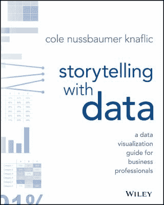
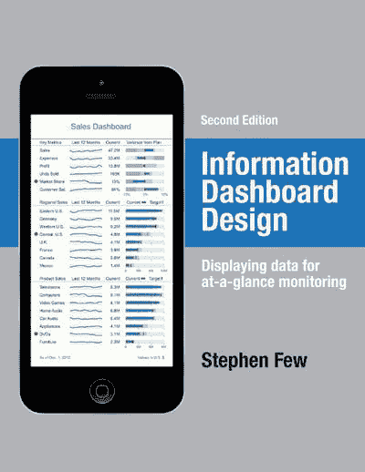
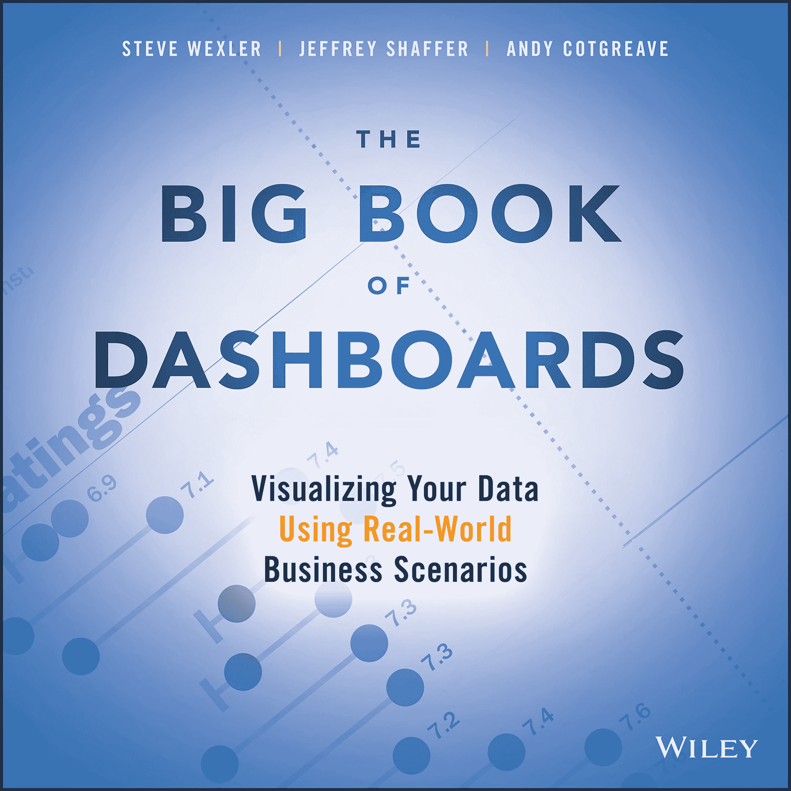
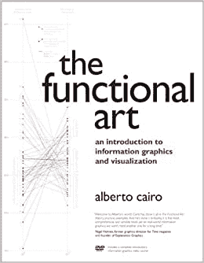
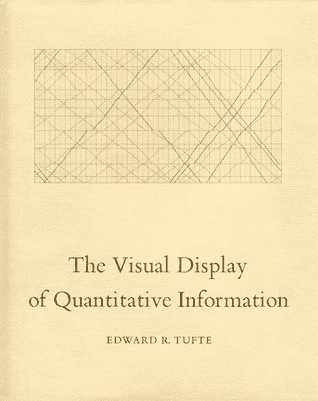
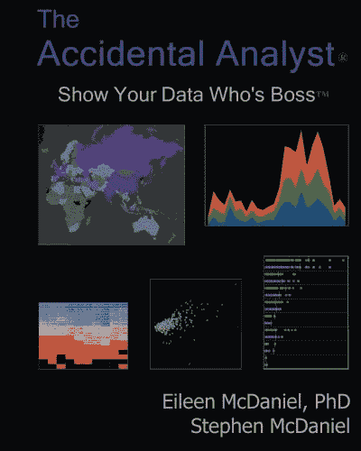
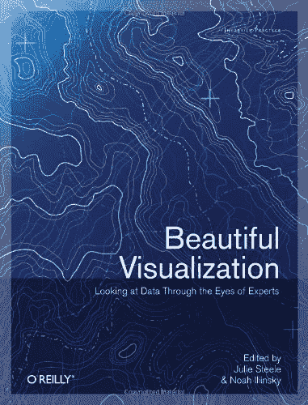

# 十大数据可视化书籍

> 原文：<https://web.archive.org/web/20221129050302/https://www.datacamp.com/blog/top-10-data-visualization-books>

*“这是我最喜欢的分析部分:获取枯燥的平面数据，并通过可视化将它变得生动起来”——John Tukey*

我们每天都在与数据进行越来越多的互动，并且必须理解它。在工作中，数据从业者和非从业者都必须根据他们可能从未遇到过的数千甚至数百万行数据来做出决策。在国内，我们越来越多地获得数据，使我们能够优化我们的习惯，保护我们的健康，成为负责任的 T2 公民。在做出基于数据的决策时，我们如何确保有效地理解这些信息？这就是数据可视化的用武之地。

数据可视化是数据科学中最重要的技能之一。以富有洞察力的视觉效果生动展示数据是传达数据洞察力的最有效方式。无论是数据分析师将他们的发现分解给非技术利益相关方，数据科学家描述他们在生产中部署的模型的影响，还是公民数据从业者将他们的数据素养技能付诸实践。数据可视化也是数据故事的核心，它提倡使用视觉、叙事和数据来推动洞察之外的行动。

数据可视化的美妙之处在于它的可访问性和关联性。有效可视化数据的工具范围从拖放工具如 Excel、 [Power BI](https://web.archive.org/web/20220518134937/https://www.datacamp.com/courses/introduction-to-power-bi) 和 [Tableau](https://web.archive.org/web/20220518134937/https://www.datacamp.com/tracks/tableau-fundamentals) 到更多的技术工具如 [Python](https://web.archive.org/web/20220518134937/https://www.datacamp.com/tracks/data-visualization-with-python) 和 [R](https://web.archive.org/web/20220518134937/https://www.datacamp.com/tracks/data-visualization-with-r) 。因此，数据可视化通常被视为许多有志于进入该领域的数据从业者的入门药物。

在本文中，我们提供了 10 本必读书的清单，它们将提升您的数据可视化技能。无论您是希望提高视觉设计和讲故事技能的经验丰富的数据从业者，还是希望掌握数据可视化基础的新手，这里都有适合每个人的东西。

## 1.有效的数据叙事:如何用数据、叙事和视觉推动变革

数据讲故事的技巧正成为任何人展示数据的筹码。数据故事通常被称为“分析的最后一英里”，它为技术和非技术受众提供了一个分解数据洞察力的框架。布伦特·戴克斯在他的开创性著作《T1》中，阐述了数据故事背后的价值以及一个成功的数据故事的关键要素。

Dykes——他出现在[数据框架播客](https://web.archive.org/web/20220518134937/https://www.datacamp.com/community/podcast/effective-data-storytelling-how-turn-insights-into-actions)中——认为，我们不应该只关注如何可视化数据，我们还应该利用叙事和讲故事来推动基于洞察力的决策。在他的书中，戴克斯开发了一个数据叙事的框架，这种方法结合了三个核心要素:数据、叙事和视觉。

有效的数据讲故事是一本创新的书。它超越了对数据可视化的传统关注，反思叙事的力量和用数据讲故事的心理。它将教会你通过有说服力和令人难忘的数据故事来展示你的见解的基本技巧。由于这些原因，它是任何经常与数据通信的人的必备工具。

## **2。Cole Nussbaumer Knaflic 的《用数据讲故事:商业专业人士的数据可视化指南》**

同样，Cole Nussbaumer Knaflic 关于 [用数据讲故事](https://web.archive.org/web/20220518134937/https://www.storytellingwithdata.com/books) 的书，分解了传递数据故事的不同方式。在处理数据时，可视化为我们的数据故事提供了可视化层。然而，如何通过数据有效地呈现和讲述，讲述一个令人信服的故事，并不是一件容易的事情。科尔·努斯鲍默·克纳弗里克试图在她的书中弥合这一鸿沟。

用数据讲故事充满了实用的资源和案例研究，适用于希望有效使用数据可视化的企业和数据从业者。无论是决定使用哪些图表，如何构建数据故事，或如何整理图表，理论和实践的结合使这本书成为新颖和先进的数据可视化实践者的伟大资源。

## **3。信息仪表板设计:显示数据进行一览式监控**

****

仪表板是提供复杂数据环境一览视图的最有效方式。然而，仪表板很容易以繁琐和低效的方式设计。斯蒂芬·诺的 [信息仪表盘设计](https://web.archive.org/web/20220518134937/http://www.stephen-few.com/idd.php) 的目标是帮助从业者在开发仪表盘时避免常见的错误和陷阱。

作为实用指南，这本书介绍了设计仪表板的最佳实践。它非常详细，提供了许多例子来说明有效和无效的仪表板，以及如何避免常见的仪表板设计陷阱。除了解释如何创建优秀的仪表板，Stephen first 还根据神经科学领域的最新进展，对设计理论和数据可视化的原则进行了有价值的介绍。

## **4。仪表板大全。Steve Wexler、Jeffrey Shaffer 和 Andy cotgreve**利用真实世界的商业场景将数据可视化

****

任何在商业智能团队工作的人都应该阅读这本书。由 Steve Wexler、Jeffrey Shaffer 和 Andy Cotgreave 合著的 [仪表盘大全](https://web.archive.org/web/20220518134937/https://www.bigbookofdashboards.com/) 是创建有效仪表盘的权威指南。

这本书提供了许多基于仪表盘真实使用案例的例子，涵盖了医疗、金融、营销和体育等各个领域，非常适合那些希望将仪表盘设计技能提升到更高水平的人。特别面向 Tableau 用户，它涵盖了设计仪表板时的最佳实践，从与观众共情到完善仪表板中的数据可视化。

你也可以直接从合著者安迪·科特格里夫那里了解更多关于这本书的信息，他在 [数据框架播客](https://web.archive.org/web/20220518134937/https://www.datacamp.com/community/podcast/the-data-storytelling-skills-data-teams-need) 上讨论了数据可视化和讲故事的技巧。

## **5。阿尔贝托·开罗的功能艺术**

在 [功能艺术](https://web.archive.org/web/20220518134937/http://www.thefunctionalart.com/) 中，数据记者 Alberto Cairo 解决了开发数据可视化时最关键的问题之一:如何在不牺牲实用性和洞察力的情况下创建美丽、迷人的可视化。换句话说，如何使数据可视化背后的艺术功能化。

虽然这个问题通常被视为一种交换，但阿尔贝托·开罗展示了相反的情况。从对行业最佳实践的详细回顾出发，Alberto Cairo 继续探索我们大脑在感知和记忆信息时的特性。

功能艺术有一个明确的目标:结合数据科学的最佳实践和我们对人类感知和认知的知识，为最终用户创造出既美观又实用的视觉效果。

## **6。Edward R. Tufte 的定量信息的可视化显示**

****

为了深入理解一个主题，在某些时候，人们必须回到经典。 [数量信息的可视化显示](https://web.archive.org/web/20220518134937/https://www.edwardtufte.com/tufte/books_vdqi) 爱德华·r·塔夫特(Edward R. Tufte)的著作通常被认为是最早的数据可视化书籍之一。

自从 1983 年第一次出版以来，世界已经发生了很大的变化——技术进步使得数据可视化任务比 Tufte 时代更容易实现——页面上的一些想法已经过时了。然而，定量信息的可视化显示仍然提供了许多关于设计理论和如何创建有效图形的永恒的最佳实践。此外，这本书包含一个特殊的图形，图表和表格阵列，超过 200 个插图和详细的分析，可以非常方便那些寻找灵感。

## **7。艾琳·麦克丹尼尔和斯蒂芬·麦克丹尼尔的《意外分析师》**

****

随着数据量的增长和侵入越来越多的工作，越来越多的专业人士(无论其背景如何)不得不在日常工作中处理数据。如果你认为自己是一个意外的分析师，不打算在他们的角色中处理和分析数据，这本书是给你的。

艾琳·麦克丹尼尔(Eileen Mcdaniel)和斯蒂芬·麦克丹尼尔(Stephen McDaniel)所著的《偶然的分析师 》提供了一个直观、循序渐进的框架来解决数据分析和可视化的复杂性。所谓的“数据分析的 7c”定义了一个直接的行动过程，以按照行业最佳实践成功地组织、分析和可视化数据。

这本书配有插图的例子和许多提示和技巧，对于努力理解数据并与之交流的专家和新手来说都是一个资源。

## **8。美丽的视觉效果。Julie Steele 和 Noah Iliinsky 从专家的角度看数据**

是什么让数据可视化引人注目且富有洞察力？这就是 [美丽可视化](https://web.archive.org/web/20220518134937/https://www.oreilly.com/library/view/beautiful-visualization/9781449379889/) 试图回答的问题，通过该领域专家的眼睛看出来。

由 Julie Steele 和 Noah Iliinsky 合著的《美丽的可视化》通过观察真实世界的数据可视化项目来分析数据可视化的过程。它包含来自 24 位数据可视化专家(从设计师和科学家到艺术家和统计学家)的专家观点，这些专家在可视化数据时扩展了他们的方法、途径和理念。

对于那些想了解专家如何处理视觉设计过程的人来说，这本书是一个很好的资源。由于各种各样的声音，任何背景的读者都可能掌握新的见解，将他们的数据可视化技能提升到一个新的水平。

## **9。Sandra Rendgen 和 Julius Wiedemann 制作的信息图表**

