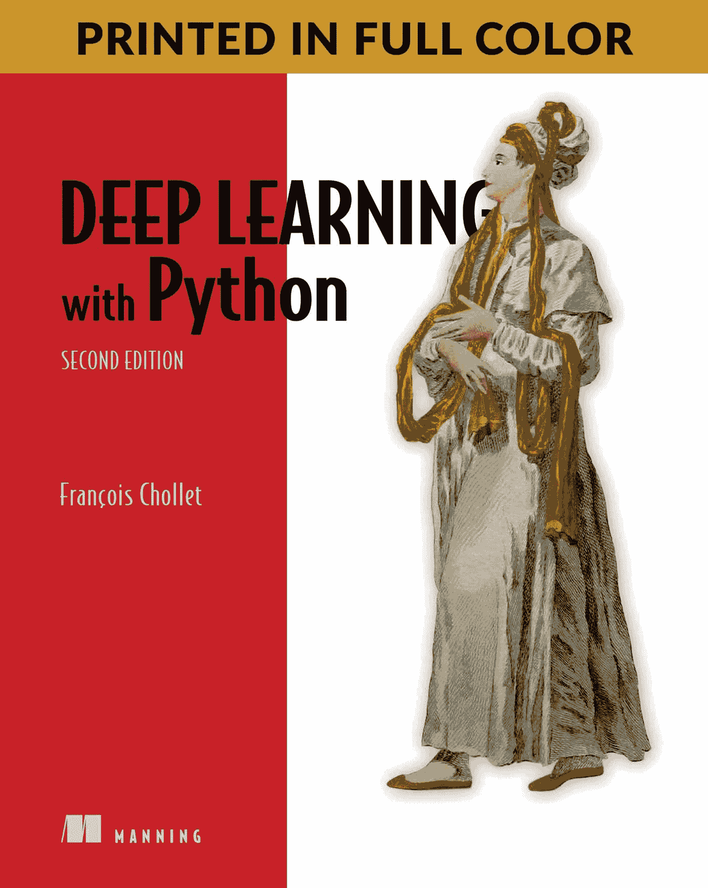
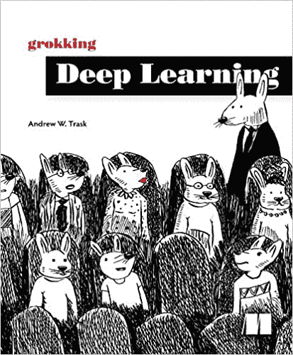
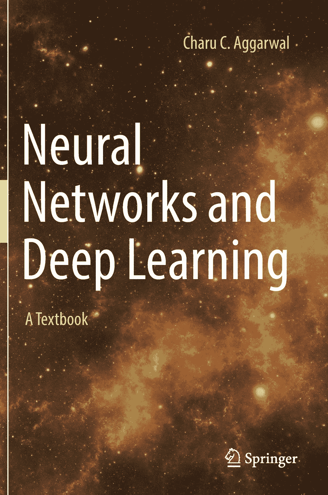
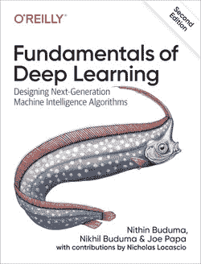
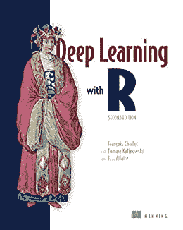
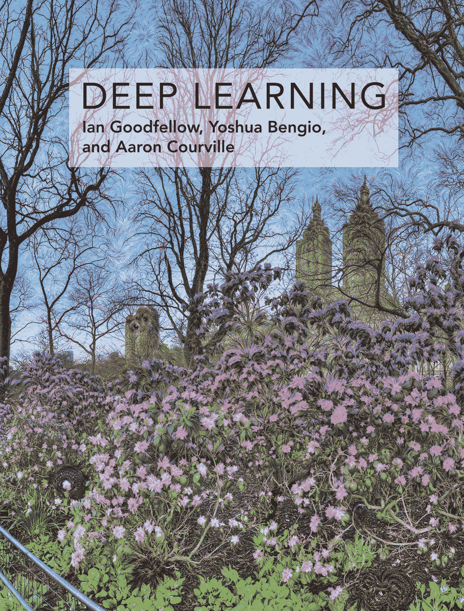
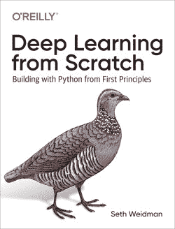
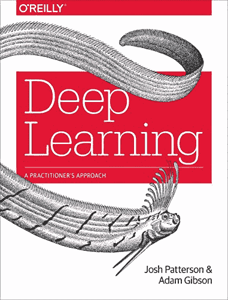
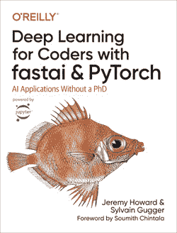
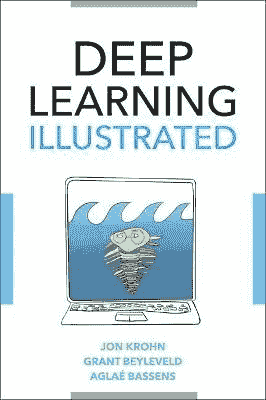

# 2022 年十大深度学习读物

> 原文：<https://web.archive.org/web/20221210085053/https://www.datacamp.com/blog/top-10-deep-learning-books-to-read-in-2022>

深度学习是当今数据科学中最热门的话题之一。作为机器学习的一个子领域，深度学习专注于受人脑结构和功能启发的强大算法，称为神经网络。

过去几年人工智能的大部分进步都来自于深度学习。神经网络是一些最具颠覆性和令人敬畏的应用的背后，包括自动驾驶汽车、聊天机器人、图像识别和机器人。

了解神经网络的理论和实践正迅速成为数据科学家和其他数据专业人员学习旅程中的一个必修步骤。然而，深度学习是一个复杂的话题，需要决心和一定程度的抽象才能学习。

以下是我们列出的 10 本必不可少的深度学习书籍，无论你目前的技能水平如何，它们都将帮助你成为该领域的专家。如果你渴望更多的推荐，你也可以看看我们的 2022 年最佳机器学习书籍清单。

## Franç ois Chollet 的 Python 深度学习

《Python 深度学习》于 2017 年首次出版，迅速成为畅销书，其 2021 年 10 月的更新包含了更多见解和实用技术。流行的深度学习框架 Keras 的创始人 Franç ois Chollet 以对新人和高级机器学习从业者的见解探索深度学习领域。

使用 Python 的第二版[深度学习具有令人愉快的简单风格，提供了反映该领域最新发展的新更新。在整个页面中，你会找到直观的解释、彩色插图和基于 Python、](https://web.archive.org/web/20221129042601/https://www.manning.com/books/deep-learning-with-python-second-edition) [Keras](https://web.archive.org/web/20221129042601/https://www.datacamp.com/courses/introduction-to-deep-learning-with-keras) 和 [TensorFlow](https://web.archive.org/web/20221129042601/https://www.datacamp.com/courses/introduction-to-tensorflow-in-r) 的编码示例，为你提供开始深度学习所需的一切。你也可以通过查看 DataCamp 上的[深度学习 Python 技能赛道来入门 Tensorflow 和 Keras。](https://web.archive.org/web/20221129042601/https://www.datacamp.com/tracks/deep-learning-in-python)

## 安德鲁·w·特拉斯克的《探索深度学习》

[探索深度学习](https://web.archive.org/web/20221129042601/https://www.manning.com/books/grokking-deep-learning)给出了一个对初学者最友好的深度学习介绍。这本书教你如何从零开始构建神经网络，将直觉理论与编码样本相结合，同时仅使用 Python 及其流行的数学支持库 [NumPy](https://web.archive.org/web/20221129042601/https://www.datacamp.com/courses/introduction-to-numpy) 。

这本书涵盖了从处理图像到将文本翻译成不同语言的各种用例，是您在准备转向更复杂的框架之前开始深度学习之旅的绝佳资源。

## 神经网络和深度学习:Charu C. Aggarwal 的教科书

[神经网络和深度学习](https://web.archive.org/web/20221129042601/https://www.amazon.es/Neural-Networks-Deep-Learning-Textbook/dp/3319944622)对于那些在深度学习领域迈出第一步的人来说，是另一个很好的资源。这本书涵盖了最重要的深度学习算法，理论，数学和 Python 代码示例的平衡和可访问的组合。它讨论了神经网络和传统机器学习算法之间的关系。这本书非常适合学生，以教科书的风格编写，包括练习、解决方案手册和教师幻灯片。

## 深度学习的基础:设计下一代机器学习算法

当神经网络在 2010 年代首次开始提供神奇的结果时，深度学习成为了人工智能的前沿。如今，深度学习是一个活跃的研究领域，为数据科学中一些最具创新性的应用提供了动力。然而，由于其复杂性，深度学习经常被视为仅限于具有机器学习和数学博士水平知识的专业人士的学科。[深度学习的基础](https://web.archive.org/web/20221129042601/https://www.oreilly.com/library/view/fundamentals-of-deep/9781492082170)证明了相反的情况。

这本书旨在介绍这门学科，不使用专业术语。基于实用的、基于 Python 的代码示例，这本书将带你了解深度学习的一些最常见的用例，从处理图像和分析文本到构建强化学习模型。

## Franç ois Chollet、Tomasz Kalinowski 和 J. J. Allaire 的深度学习

虽然 Python 经常被称为深度学习的首选语言，但 R 编程语言也提供了构建强大神经网络的能力。[深度学习与 R](https://web.archive.org/web/20221129042601/https://www.manning.com/books/deep-learning-with-r-second-edition) 基于弗朗索瓦·乔莱的畅销书《深度学习与 Python》。深度学习专家 Tomasz Kalinowski 在将代码和示例翻译成 R 语言方面做得非常出色。与 Python 这本书类似，使用 R 的深度学习对于新手和有经验的机器学习实践者来说都是很好的参考资源。

## 伊恩·古德菲勒、约舒阿·本吉奥和亚伦·库维尔的《深度学习》

如果没有这本书，任何必要的深度学习资源列表都是不完整的。大多数深度学习指南都包括代码和实际例子。相比之下，Goodfellow、Bengio 和 Courvilleis 所著的 [Deep Learning](https://web.archive.org/web/20221129042601/https://www.amazon.com/Deep-Learning-Adaptive-Computation-Machine/dp/0262035618/ref=sr_1_1?ie=UTF8&qid=1472485235&sr=8-1&keywords=deep+learning+book) 是一本完全理论化且极具学术性的书，经常被编入全球大学深度学习课程的参考书目。

这本书旨在帮助学生和从业者进入机器学习领域，特别是深度学习。它回顾了机器学习的基本概念，其发展所需的应用数学，算法，深度学习技术，以及该领域的当前研究趋势。你甚至可以在这里找到免费的在线版本。

## 从零开始的深度学习:用 Python 从基本原则开始构建

如果你是一名拥有机器学习专业知识的数据科学家，并希望进入深度学习领域，这是一本非常适合你的书。[从零开始的深度学习](https://web.archive.org/web/20221129042601/https://www.google.com/search?q=Deep+Learning+from+Scratch&rlz=1C5CHFA_enNL828NL828&oq=Deep+Learning+from+Scratch&aqs=chrome..69i57j0i512j69i59l2j0i22i30j69i60l3.165j0j4&sourceid=chrome&ie=UTF-8)为已经熟悉机器学习的数据科学家和其他数据专业人士提供了深度学习的全面介绍。

从深度学习的基础开始，这本书快速移动到开发神经网络的高级概念，模型和架构。这本书当然具有挑战性，因为它通过理论、数学和概念解释引导读者，但结果更有价值。这本书还包括许多使用流行的深度学习框架 [PyTorch](https://web.archive.org/web/20221129042601/https://www.datacamp.com/courses/introduction-to-deep-learning-with-pytorch) 的例子。

## 深度学习:乔希·帕特森和亚当·吉布森的实践方法

公司在处理机器学习和深度学习时面临的最大挑战之一是开发和部署可扩展和易于维护的模型。[深度学习:从业者的方法](https://web.archive.org/web/20221129042601/https://www.oreilly.com/library/view/deep-learning/9781491924570)试图解决这个问题，产生了关于这个主题的最实用的指南之一。这本书融合了深度学习理论、行业最佳实践和少量以非学术方式呈现的用例。

一个重要的注意事项是，该书包括在 DL4J 中实现的代码示例，DL4J 是作者用于开发生产级深度学习工作流的开源框架。由于 DL4J 运行在 Java 虚拟机上，这本书提供了一个很好的机会来尝试 Java 在深度学习方面的可能性。

## 杰瑞米·霍华德和西尔万·古格用 fastai 和 PyTorch 为编码人员提供深度学习

深度学习不仅是一个快速发展的领域，而且也变得越来越容易获得。由于直观、用户友好的库和界面的发展，不再需要有数学或计算机科学的博士学位才能从事深度学习。

其中一个工具是 fastai，这是第一个为最常用的深度学习应用程序提供一致接口的库。[fastai 和 PyTorch 的程序员深度学习](https://web.archive.org/web/20221129042601/https://www.oreilly.com/library/view/deep-learning-for/9781492045519)是一个用很少的数学背景、少量数据和最少的代码开发深度学习模型的实践指南。除了编码示例，这本书还涵盖了深度学习理论，这将有助于您理解神经网络背后的科学。

## 《深度学习图解:人工智能的可视化互动指南》,作者:乔恩·克罗恩、格兰特·贝维尔德和阿格莱·巴森斯

一张图胜过千言万语。这就是 Deep Learning Illustrated 背后的想法，这是一个使用直观的视觉表示来学习深度学习技术和应用的独特资源。

这本书用丰富多彩的插图和以人物为中心的叙述包装起来，抽象掉了这门学科的许多复杂性，使它能为更广泛的公众所接受。技术术语很少，应用程序由使用 Python 代码的手动 Jupyter 笔记本支持。书中介绍了一些最流行的深度学习框架，包括 [TensorFlow](https://web.archive.org/web/20221129042601/https://www.datacamp.com/courses/introduction-to-tensorflow-in-python) 、 [Keras](https://web.archive.org/web/20221129042601/https://www.datacamp.com/courses/introduction-to-deep-learning-with-keras) 和 [PyTorch](https://web.archive.org/web/20221129042601/https://www.datacamp.com/courses/introduction-to-deep-learning-with-pytorch) 。

## 了解更多关于深度学习的信息

深度学习是数据科学工具包的重要组成部分。学习 it 是提升职业前景和构建有趣应用程序的明智之举。书籍是入门或成为深度学习专家的绝佳资源，但你也应该考虑其他学习方式。查看以下资源，开始您的深度学习之旅。

*   DataCamp 的[课程目录](https://web.archive.org/web/20221129042601/https://www.datacamp.com/courses-all)，包含+380 门数据科学课程，涵盖编程、机器学习、深度学习等。
*   用[顶级机器学习书籍](https://web.archive.org/web/20221129042601/https://www.datacamp.com/blog/the-15-best-data-machine-learning-books-to-read-in-2022)阅读我们的文章
*   查看 DataCamp 的[机器学习教程](https://web.archive.org/web/20221129042601/https://www.datacamp.com/tutorial/category/machine-learning)
*   订阅[数据框架播客](https://web.archive.org/web/20221129042601/https://www.datacamp.com/podcast)
*   看看这个[机器学习备忘单](https://web.archive.org/web/20221129042601/https://www.datacamp.com/cheat-sheet/machine-learning-cheat-sheet)