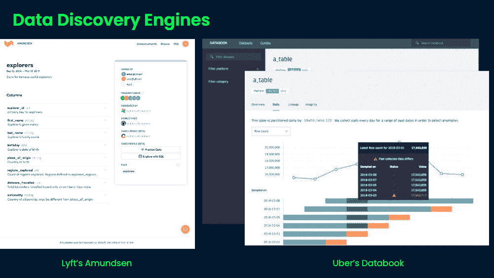
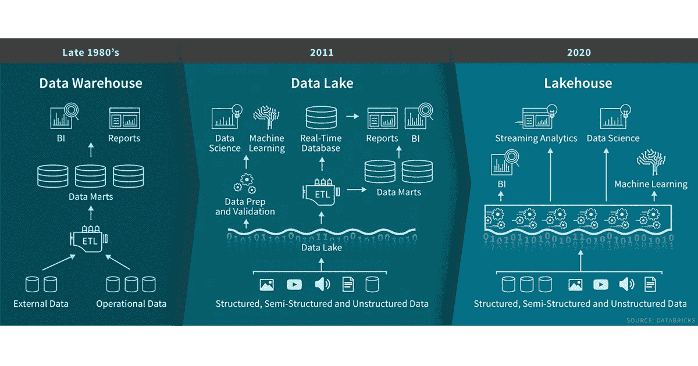

# 2021 年数据基础架构的三大趋势

> 原文：<https://web.archive.org/web/20221129033105/https://www.datacamp.com/blog/top-3-trends-in-data-infrastructure-for-2021>

数据工程仍然是企业的重中之重，2021 年，数据基础设施领域将会有令人振奋的发展。在最近的一次网络研讨会中，世界银行的数据工程师、前圣地亚哥市首席数据官马克西姆·佩彻斯基强调了三个特别值得关注的趋势:数据编排平台、数据发现引擎和数据湖库。

## 数据编排平台

虽然编排平台已经存在多年来管理计算机系统和软件，但[数据编排](https://web.archive.org/web/20220518140129/https://dzone.com/articles/data-orchestration-its-open-source-but-what-is-it)是一个相对较新的概念，它跨存储系统抽象数据访问，虚拟化数据，并将数据呈现给数据驱动的应用程序。数据编排平台通过组合来自多个数据存储位置的孤立数据并使其可用，帮助公司变得更加数据驱动。例子包括[阿帕奇气流](https://web.archive.org/web/20220518140129/https://airflow.apache.org/)、[提督](https://web.archive.org/web/20220518140129/https://www.prefect.io/)、[路易吉](https://web.archive.org/web/20220518140129/https://luigi.readthedocs.io/en/stable/)和[史迪奇](https://web.archive.org/web/20220518140129/https://www.stitchdata.com/)，它们与版本控制、DevOps 和持续集成等现代软件方法兼容。

DataCamp 的课程[Python 中的 Airflow 简介](https://web.archive.org/web/20220518140129/https://www.datacamp.com/courses/introduction-to-airflow-in-python)是一个学习如何以简单且可重复的方式实现和安排 ETL 和数据工程工作流的好地方。

## 数据发现引擎

随着数据的增加，公司将投入更多的时间让他们的团队找到他们需要的数据，记录下来，并减少返工，这是有道理的。像 Lyft 的阿蒙森和 T2 优步的数据手册这样的数据发现引擎旨在通过提供数据搜索界面来提高数据用户的生产力。这些工具依赖于元数据，元数据通过允许数据基础架构随着公司的增长而扩展来支持生产力和合规性。数据发现的目标是使数据更加公平:可发现、可访问、可互操作和可重用。

## 数据仓库

[数据湖和数据仓库](https://web.archive.org/web/20220518140129/https://www.datacamp.com/community/blog/data-lakes-vs-data-warehouses)有不同的用例。每个都是为不同的目的和不同的最终用户而设计的。例如，分析人员通常使用数据仓库来收集商业情报——它们包含为他们的工作而显式处理的平面文件。另一方面，数据湖是由数据工程师建立和维护的，他们将数据湖集成到数据管道中。数据科学家与数据湖的合作更加密切，因为它们包含更广泛、更现代的数据。

数据湖库顾名思义就是数据湖和数据仓库的结合。像 [Snowflake](https://web.archive.org/web/20220518140129/https://www.snowflake.com/guides/what-data-lakehouse) 和 [Databrick 的 Delta Lake](https://web.archive.org/web/20220518140129/https://delta.io/) 这样的平台已经创建了解决方案，为结合了数据湖和数据仓库优势的数据提供单一的真实数据来源。数据湖库实现了数据仓库的数据结构和数据湖的管理特性，这对于数据存储来说通常更具成本效益。同时，它们保留了数据的模式和版本。有了数据湖库，数据科学家将能够进行机器学习和商业智能。

##### 来源:[数据块](https://web.archive.org/web/20220518140129/https://databricks.com/blog/2020/01/30/what-is-a-data-lakehouse.html)

所有这三种趋势对于企业在 2021 年扩展数据基础架构至关重要。它们对于围绕数据构建的公司以及那些努力将数据可持续地集成到其工作流程中的公司非常有用。[了解有关大公司在运营数据和实现数据驱动方面所面临挑战的更多信息](https://web.archive.org/web/20220518140129/https://www.datacamp.com/community/blog/data-driven-enterprise)。

