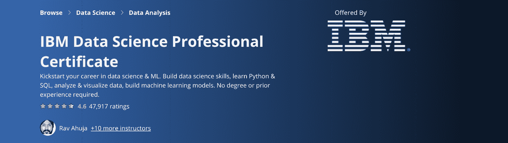

# 五大在线数据科学认证

> 原文：<https://web.archive.org/web/20230101103202/https://www.datacamp.com/blog/top-5-online-data-science-certifications>

### 对数据科学职位的需求以及获得认证如何帮助你获得一个职位

根据世界经济论坛最近的一份报告，数据科学是最受欢迎的技能之一——在他们调查的每个国家的就业市场中，十大“新兴”角色中的大多数都在某种程度上涉及数据科学。因为这个领域有大量的工作机会，了解它的工作原理和能力将有助于你的职业发展。

此外，向未来的潜在雇主证明你拥有数据科学职位所需的技能在求职过程中变得更加重要。也就是说，发展这些数据科学技能的机会不再伴随着巨大的入门障碍，相反，您可以掌控自己的未来。

### 如何获得在线认证

在整个疫情，我们已经看到教育以前所未有的速度转移到网上，现在认证也越来越多地转移到网上领域。足不出户就可以展示你的知识，有很多选择，让你有机会在方便的时候获得认证。但是，有这么多的认证，可能很难知道从哪里开始，所以我们汇编了一个前五名在线数据科学认证的列表。

[**哈佛专业数据科学家**](https://web.archive.org/web/20220627143153/https://online-learning.harvard.edu/series/professional-certificate-data-science) $793

由 edX 提供支持，该认证利用真实世界的案例研究来教授数据科学，主要关注 r。从数据科学的基础到机器学习，该认证利用基于所教授内容的实际应用的问题:电影推荐、选举预测和 2007-08 年的金融危机。这将增强你在雇主眼中解决现实问题的能力。

[**【Data camp】数据科学专业**](https://web.archive.org/web/20220627143153/https://www.datacamp.com/certification)【29 美元/月

我们的认证将测试您成为一名成功的专业数据科学家所需的技能。我们的认证侧重于 R 或 Python 和 SQL，由三项评估、一项编码挑战和一个案例研究组成。在案例研究部分，您将向技术和非技术观众展示真实世界环境。

通过认证后，您将可以联系我们的职业服务团队。我们的职业服务团队专门帮助认证学习者在数据科学领域找到他们梦想的工作。无论是通过量身定制的职业建议、简历审阅、一般最佳实践还是工作匹配，我们的团队都将帮助您成功定位。

[**IBM 数据科学专业证书**](https://web.archive.org/web/20220627143153/https://www.coursera.org/professional-certificates/ibm-data-science)【40-80 美元/月

由 IBM 和 Coursera 共同运营，IBM 的认证涵盖了数据科学的基础知识，同时也深入分析和可视化数据的细节，主要是使用 Python。最后，你将完成一个练习，为你的投资组合增添一些内容，并向雇主展示你的技能。

[**Excel 到 MySQL**](https://web.archive.org/web/20220627143153/https://www.coursera.org/specializations/excel-mysql)【40-80 美元/月

该认证由杜克大学和 Coursera 联合举办，将教你如何利用数据回答商业问题。该认证由五门不同的课程组成，将涵盖 SQL、Tableau 和 Excel 在业务分析中的使用。

[**画面**](https://web.archive.org/web/20220627143153/https://www.tableau.com/en-gb/learn/certification) 【桌面专家 100 美元

Tableau 提供三种不同的考试(桌面专家、认证助理和专业人员),用于在不同层级使用其产品。每一级都提供不断增加的奖励，如较低的复习考试费用。考试是在线和开卷的，所以如果你忘记了一两个细节，不要担心。该认证将测试您使用 Tableau 本身和创建可视化的能力，这将使您能够更好地交流您的发现。

*如果你觉得已经准备好证明你的知识，那就去参加我们的认证吧——如果你觉得你可以先多做一点练习，这里有大量的课程和练习[在数据营](https://web.archive.org/web/20220627143153/https://www.datacamp.com/)上！*