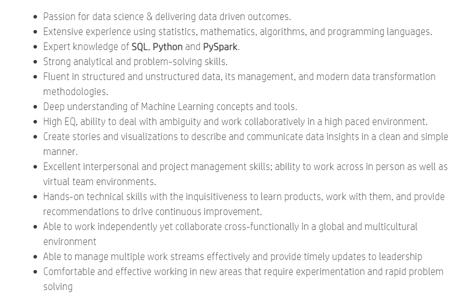
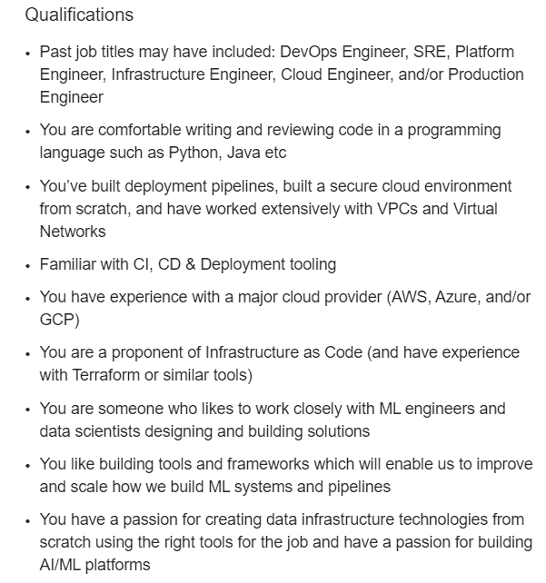
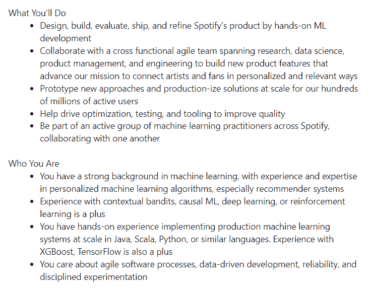
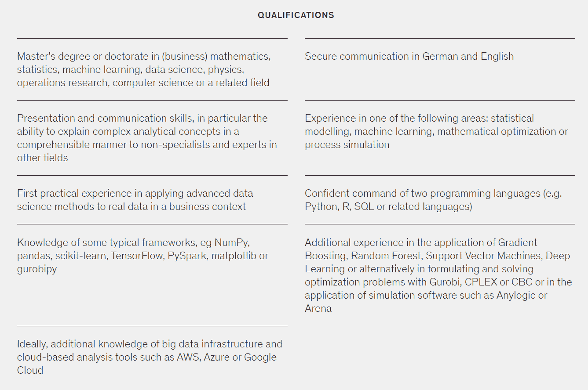
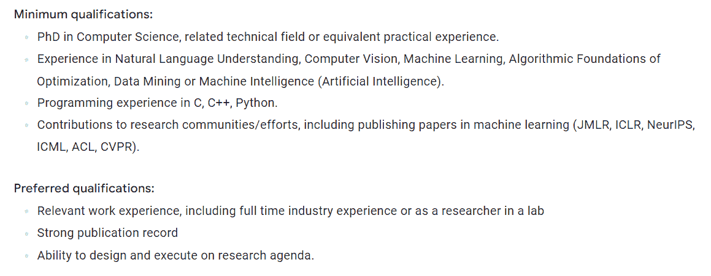
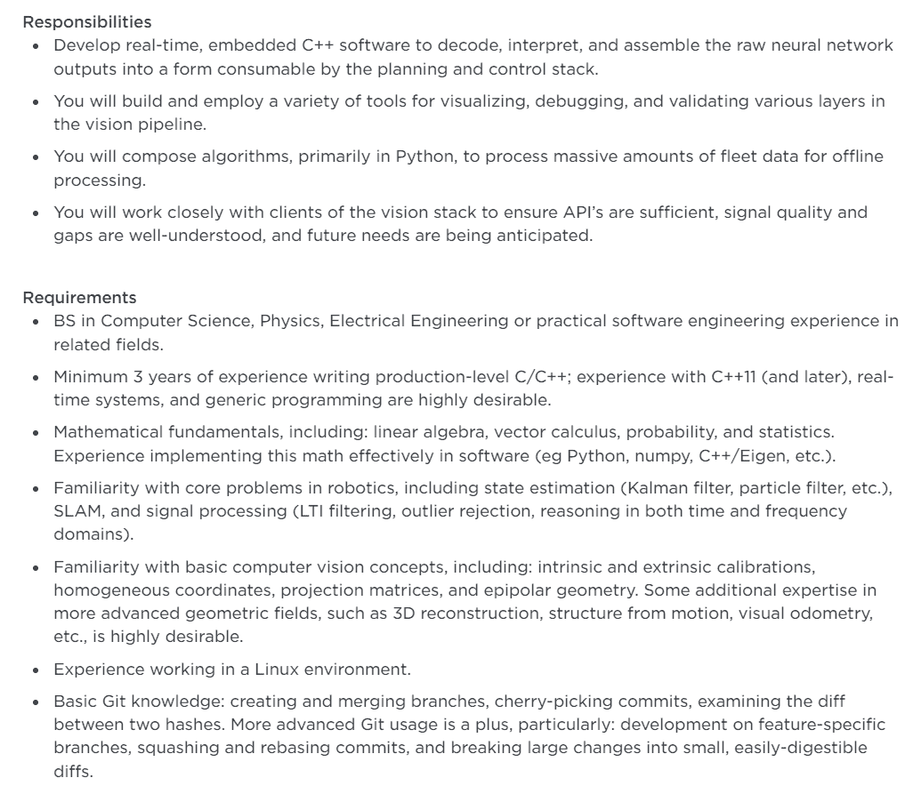
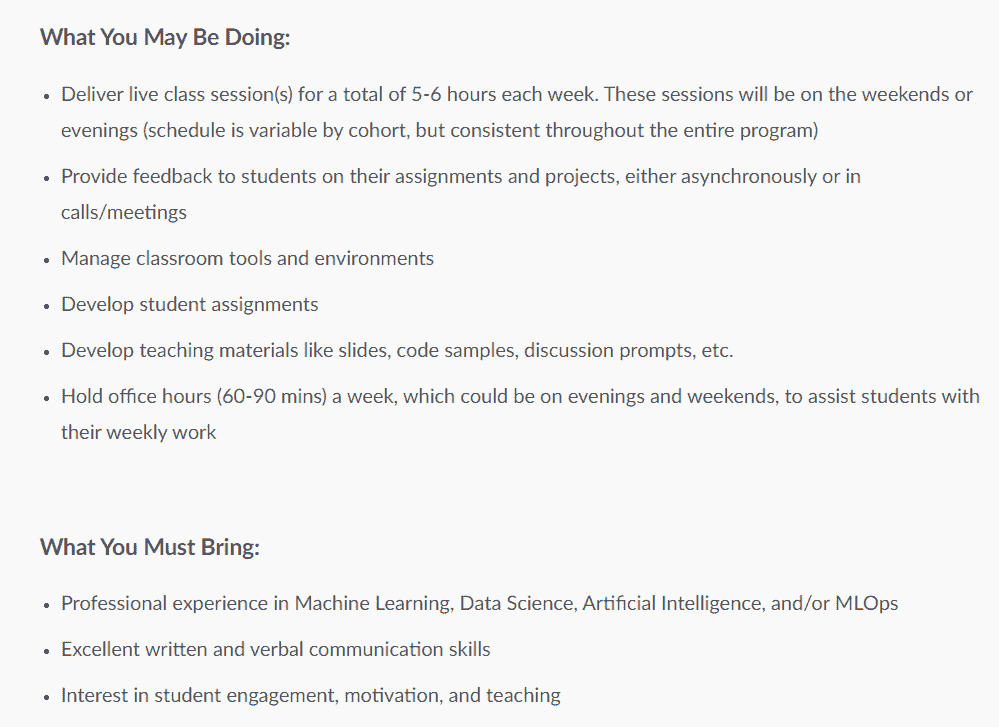

# 2022 年最热门的机器学习工作以及如何获得这些工作

> 原文：<https://web.archive.org/web/20230101102924/https://www.datacamp.com/blog/top-machine-learning-jobs-in-2022>

当大多数人听到“机器学习”这个词时，他们脑海中首先想到的是数据科学。

2011 年，数据科学领域被《哈佛商业评论》评为“20 世纪最性感的工作”,在过去的十年里，它取得了巨大的发展。来自不同背景的学生、毕业生和在职专业人士争相进入该行业，并获得一份数据科学工作。他们中的许多人仅仅通过参加在线课程和自学课程材料就成功地做到了这一点。

数据科学是目前最热门的机器学习角色。由于高薪和弹性工作时间的承诺，这个领域有很多宣传。

然而，如果你正在寻找一份机器学习方面的工作，你应该知道数据科学并不是你唯一的职业选择。组织收集的数据量在过去几年中呈指数级增长，这反过来又导致了许多新的机器学习角色的兴起。

在本文中，我们将分解几个 2022 年值得追求的机器学习职业选择。

## **7 个最好的机器学习工作**

下面，我们重点介绍了 2022 年机器学习领域的一些顶级工作。我们还挑选了一些你在这些角色中工作所需的基本技能，以及可以帮助你获得相关工作的课程。如果你正在寻找数据行业中最好的机器学习机会，请查看 [DataCamp 的工作岗位](https://web.archive.org/web/20220810135209/https://www.datacamp.com/data-jobs)，寻找适合你技能的角色。

### **1。数据科学家**

首先，让我们从探索数据科学家的角色开始，以便了解这项工作真正需要什么。

数据科学家是在数据的帮助下为组织增加商业价值的个人。

作为一名数据科学家，你应该能够收集、预处理和分析大量数据，以提出解决业务问题的见解。你还需要运用机器学习建模技术来提出推动业务增长的预测。

#### **成为数据科学家所需的技能:**

数据科学家应该掌握至少一门编程语言——通常是 R 或 Python。您还应该能够使用 SQL 提取和操作数据，构建机器学习算法，并使用统计技术分析数据集。Python 包如 Numpy、Pandas、Matplotlib 和 Keras 通常被公司的数据科学团队用于数据分析和模型构建。学习使用这些软件包是一个好主意，因为一些数据科学面试官将测试您对它们的了解。如果你想发展你在数据科学方面的技能，并在该领域找到一份工作，Datacamp 有两条很好的职业道路可以帮助你开始: [数据科学与 Python](https://web.archive.org/web/20220810135209/https://www.datacamp.com/tracks/data-scientist-with-python) 和 [数据科学与 R](https://web.archive.org/web/20220810135209/https://www.datacamp.com/tracks/data-scientist-with-r) 。

作为一名数据科学家，你还需要将业务需求转化为功能性的机器学习模型。为了做到这一点，你需要对你工作的领域有所了解。例如，如果你想从事营销工作，学习一些常用的营销指标和术语是一个好主意，因为这将有助于你在做出分析之前更好地理解手头的业务问题。你可以参加 Datacamp 的 [这个](https://web.archive.org/web/20220810135209/https://www.datacamp.com/tracks/marketing-analytics-with-python) 营销分析课程，获取特定领域的知识，从其他数据科学有志者中脱颖而出。

为了更好地了解公司对数据科学家的期望，看看惠普的职位列表:

根据 Glassdoor 的数据，美国数据科学家的平均工资为每年 143971 美元。在大型科技公司，如 [【谷歌】](https://web.archive.org/web/20220810135209/https://www.glassdoor.com/Salary/Google-Data-Scientist-Salaries-E9079_D_KO7,21.htm)[Meta](https://web.archive.org/web/20220810135209/https://www.glassdoor.com/Salary/Meta-Data-Scientist-Salaries-E40772_D_KO5,19.htm#:~:text=%24191%2C840,-%2F%20yr&text=The%20estimated%20total%20pay%20for,salaries%20collected%20from%20our%20users.)和 [苹果](https://web.archive.org/web/20220810135209/https://www.indeed.com/cmp/Apple/salaries/Data-Scientist#:~:text=Average%20Apple%20Data%20Scientist%20yearly,36%25%20above%20the%20national%20average.) ，这个数字会增加，每年从 15 万美元到 17 万美元不等。

### **2。MLOps 工程师**

MLOps 工程师生产和扩展由数据科学家构建的预测模型。他们的工作是将数据科学代码转换成用户可以与之交互的功能性最终产品。

下面是一个你作为 MLOps 工程师将要完成的任务的例子:

你加入了一家航空公司，那里的数据科学家建立了一个机器学习算法，来预测最有可能购买航班保险的用户。整个模型是在一个 Jupyter 笔记本上创建的，你需要把它嵌入到公司的网站上。

你构建的系统应该能够根据用户采取的行动将他们重定向到网站上的不同接触点。例如，如果机器学习算法预测客户可能会购买保险，他们将被重定向到一个介绍不同航班保险计划的网页。

在部署了机器学习算法之后，您需要实现一个可以不时地持续监控模型性能的流程。现实世界的数据总是在变化，因此预测模型可能会退化。必须偶尔检查度量和日志，以了解哪里出了问题，如果模型在生产中表现不佳，可能必须重新培训。

需要时，您还需要执行数据和模型版本控制。必须跟踪对训练数据集或预测算法的任何修改，并且应该保留以前的版本，以确保可以随时恢复它们。

最后，作为一名 MLOps 工程师，您必须验证您构建的系统是安全的，并且没有任何敏感的用户数据遭到破坏。为了实现这一点，您可以实现访问控制机制，验证所创建的基础结构符合遵从性策略，并引入有效的模型报告功能。

#### **成为 MLOps 工程师所需的技能:**

作为一名 MLOps 工程师，您通常不需要从头开始构建预测算法。然而，您仍然需要使用机器学习库，如 Tensorflow、Keras 和 PyTorch，所以请确保将这些库添加到您的工具箱中。

你还需要理解 ML 算法的基础，因为你的大部分工作涉及重构数据科学家的代码，并使它们为生产做好准备。

最后，因为你的主要任务是自动化机器学习工作流，所以你需要了解软件开发和 MLOps 概念，如 CI/CD 管道。

为了更好地了解公司对 MLOps 工程师的期望，请看一下 multiply 列出的 MLOps 工程师职位清单:

美国 MLOps 工程师平均工资为[【118，278](https://web.archive.org/web/20220810135209/https://www.glassdoor.com/Salaries/us-mlops-engineer-salary-SRCH_IL.0,2_IN1_KO3,17.htm#:~:text=The%20national%20average%20salary%20for,by%20a%20MLOps%20Engineer%20employees.) 美元/年。然而，在像华特·迪士尼公司 这样的大型组织中，这个数字每年可高达 15 万美元。

### **3。机器学习工程师**

虽然数据科学家的工作围绕着建立预测模型，但机器学习工程师设计的是最终用户可以与之互动的可扩展的人工智能产品。

机器学习工程师和数据科学家之间有一些不同。

数据科学家主要用 R 或 Python 编写代码，分析数据，并建立预测模型来解决公司的业务问题。他们的大部分工作是高度统计性的，围绕着产生商业洞察力。

另一方面，机器学习工程师负责构建和训练机器学习管道。在某些情况下，他们还执行 MLOps 任务，例如将这些模型投入生产，并在必要时持续监控和重新训练预测算法。

这里有一个你作为机器学习工程师将要从事的任务的例子:

你被一家音乐流媒体公司录用，加入了产品团队。您需要构建一个推荐系统管道，并将该模型投入生产。您部署的应用程序应该接收用户数据，并根据每个客户现有的音乐偏好为他们提供个性化的建议。您还需要持续监控模型性能，并在必要时重新训练推荐系统。

#### **成为机器学习工程师所需技能:**

机器学习工程师位于数据科学和软件工程的交叉点，被期望对这两个领域都有所了解。如果你想成为一名机器学习工程师，一定要学习统计学、概率和机器学习建模的基础知识。

你还需要理解软件工程的原则，比如抽象、模块化和版本控制，因为你将创建可扩展的应用程序，与最终用户进行交互。

最后，作为一名机器学习工程师，你需要掌握 MLOps 的知识，并且必须精通将数据科学模型投入生产时所涉及的最佳实践。

下面是 Spotify 的机器学习工程师职位列表截图:

据 Glassdoor 报道，美国 的平均机器学习工程师工资每年 13.1001 万美元。然而，像[Meta](https://web.archive.org/web/20220810135209/https://www.glassdoor.com/Salary/Meta-Machine-Learning-Engineer-Salaries-E40772_D_KO5,30.htm#:~:text=The%20typical%20Meta%20Machine%20Learning,estimated%20based%20upon%20statistical%20methods.)， [网飞](https://web.archive.org/web/20220810135209/https://www.glassdoor.com/Salary/Netflix-Machine-Learning-Engineer-Salaries-E11891_D_KO8,33.htm#:~:text=Machine%20Learning%20Engineer%20salaries%20at,estimated%20based%20upon%20statistical%20methods.) ，以及 [苹果](https://web.archive.org/web/20220810135209/https://www.glassdoor.com/Salary/Apple-Machine-Learning-Engineer-Salaries-E1138_D_KO6,31.htm#:~:text=The%20typical%20Apple%20Machine%20Learning,from%20%24100%2C000%20%2D%20%24279%2C173%20per%20year.) 这样的大公司为一个 ML 工程师角色提供超过 15 万美元的基本工资，这与他们的数据科学家工资相当。

如果你想学习成为一名机器学习工程师所必需的技能，Datacamp 的 [机器学习基础与 Python](https://web.archive.org/web/20220810135209/https://www.datacamp.com/tracks/machine-learning-fundamentals-with-python) 课程是一个很好的起点。

你也可以阅读 [这篇](https://web.archive.org/web/20220810135209/https://www.datacamp.com/blog/how-to-become-a-machine-learning-engineer) 的文章，进一步了解机器学习工程师的角色以及你如何成为一名机器学习工程师。

**免责声明:** 数据科学家、机器学习工程师和 MLOps 工程师的角色有很多重叠。虽然本文根据传统定义对这三个职位进行了解释，但是公司也可以互换这些职位。

### **4。数据科学顾问**

作为一名数据科学顾问，你将与一家咨询公司合作，为他们的客户提供机器学习和人工智能解决方案。

在典型的数据科学角色中，您为固定领域的单个公司工作，并解决组织内的业务问题。然而，作为一名顾问，你将与不同行业的客户一起从事许多不同的项目。

有两种类型的数据科学顾问。第一种是机器学习策略顾问，他提出了一个人工智能驱动的策略来解决他们客户的问题，但并没有实际实施它。麦肯锡(McKinsey)和波士顿咨询公司(BCG)等顶级咨询公司就属于这一类，它们的顾问将解决方案概念化，而不是实际构建端到端的系统。

第二种数据科学顾问是构建者。像德勤和埃森哲这样的公司就属于这一类，他们的数据科学家实际上为他们的客户实现了全功能的 AI 产品。

#### **成为数据科学顾问所需的技能:**

标准数据科学家的角色和数据科学顾问的角色有很多重叠。他们都被期望知道如何构建机器学习算法，分析大量数据，并利用他们的专业知识增加商业价值。

然而，由于数据科学顾问需要与客户互动，他们通常还需要具备非凡的沟通和演示技能。咨询顾问的最大优势是他们能够将数据转化为可操作的见解，这些见解可以被非技术人员轻松消化。

如果你有兴趣成为一名数据科学顾问，并希望磨练自己在数据故事方面的技能，你可以参加 Datacamp 的这个 [数据通信概念](https://web.archive.org/web/20220810135209/https://www.datacamp.com/courses/data-communication-concepts) 课程。

此外，由于顾问为各种各样的客户从事许多不同的项目，他们需要能够使用各种各样的工具。例如，虽然大多数公司将 R 或 Python 列为获得机器学习工作的先决条件，但麦肯锡通常要求候选人精通这两种语言才能成为顾问。

以下是麦肯锡一名数据科学顾问的职位描述截图:

根据 Glassdoor 的数据，数据科学顾问的平均工资为[【112595 美元/年](https://web.archive.org/web/20220810135209/https://www.glassdoor.com/Salaries/data-scientist-consultant-salary-SRCH_KO0,25.htm) 。然而，顶级咨询公司如 [麦肯锡](https://web.archive.org/web/20220810135209/https://www.glassdoor.com/Salary/McKinsey-and-Company-Data-Science-Consultant-Salaries-E2893_D_KO21,44.htm) 和[BCG](https://web.archive.org/web/20220810135209/https://www.glassdoor.com/Salary/Boston-Consulting-Group-Lead-Data-Scientist-Salaries-E3879_D_KO24,43.htm#:~:text=The%20typical%20Boston%20Consulting%20Group,salary%20is%20%24220%2C173%20per%20year.)平均每年支付他们的数据科学顾问 15 万到 20 万美元。

### **5。机器学习研究科学家**

数据科学家构建机器学习模型来驱动商业价值，而研究科学家从头开始创建定制的人工智能解决方案。机器学习研究员在学术机构或像谷歌这样资助研究的大公司工作。

机器学习研究是理论密集型的，研究人员通常专注于开发新的机器学习模型或提高现有算法的性能。

机器学习从业者和研究科学家之间形成了鲜明的对比。

在 ML 研究中，即使模型精度有 0.2%的微小提高也可以被认为是一个突破，值得写一篇论文。相比之下，为组织实施机器学习解决方案的人不会真的关心性能的小幅提高，特别是如果这是以公司时间和计算能力为代价的话。

此外，虽然机器学习行业的从业者通常是能够管理端到端项目工作流的多面手，但研究人员在该领域的某个方面高度专业化，并继续在该特定领域做出发现。

#### **成为机器学习研究科学家所需的技能:**

由于机器学习研究人员是高度专业化的学者，他们通常需要拥有硕士或博士学位，应该能够熟练地撰写研究论文，并且必须知道至少一种编程语言。优化或回归分析等特定领域的机器学习技能也是必要的。

下面是谷歌对一名机器学习研究科学家的职位描述截图:

根据 Glassdoor，一个机器学习研究科学家的平均年薪是[$ 151124](https://web.archive.org/web/20220810135209/https://www.glassdoor.com/Salaries/machine-learning-research-scientist-salary-SRCH_KO0,35.htm)。

如果你想成为一名机器学习研究科学家，但不知道从哪里开始，请查看 Datacamp 的这个 [机器学习科学家与 Python](https://web.archive.org/web/20220810135209/https://www.datacamp.com/tracks/machine-learning-scientist-with-python) 学习跟踪。

### **6。计算机视觉工程师**

作为一名计算机视觉工程师，你将为各种组织用例开发对象检测、人脸识别和姿态估计模型。

例如，如果你在一家开发安全解决方案的公司工作，你的任务可能是开发一个入侵检测系统，以便及时识别和防止威胁的发生。

计算机视觉工程师的角色是高度专业化的，因为他们的关注领域仅限于一个领域。雇用计算机视觉工程师的公司通常要么希望他们在该领域提出一个新颖的解决方案，要么改进现有的解决方案。

这与 ML engineering 等通才角色不同，在 ML engineering 中，预先训练的模型或现有的软件包可以用来解决业务问题。

#### **成为计算机视觉工程师所需的技能:**

要成为一名计算机视觉工程师，你需要有很强的编程能力，以及一些软件工程原理的知识。学会解决 DSA(数据结构和算法)问题，因为这些问题在面试中经常被问到。

由于你将构建计算机视觉应用，你需要知道如何将公司的要求转化为最终产品。因此，你应该对系统设计有所了解。

最后，学习微积分、统计学、数学优化和线性代数，因为这些是机器学习算法的组成部分。如果你是机器学习初学者，缺乏所需的基础数学知识，可以先上 Datacamp 的 [线性代数入门](https://web.archive.org/web/20220810135209/https://www.datacamp.com/courses/linear-algebra-for-data-science-in-r) 课程。

如果你想更好地了解成为一名计算机视觉工程师所需的技能，看看特斯拉的工作列表:

根据 Glassdoor 的数据，计算机视觉工程师的平均年薪为[【121，369 美元](https://web.archive.org/web/20220810135209/https://www.glassdoor.com/Salaries/computer-vision-engineer-salary-SRCH_KO0,24.htm) 。在 [Meta](https://web.archive.org/web/20220810135209/https://www.glassdoor.com/Salary/Meta-Computer-Vision-Engineer-Salaries-E40772_D_KO5,29.htm#:~:text=The%20typical%20Meta%20Computer%20Vision,from%20%24128%2C842%20%2D%20%24266%2C098%20per%20year.) 和[Apple](https://web.archive.org/web/20220810135209/https://www.indeed.com/cmp/Apple/salaries/Computer-Vision-Engineer#:~:text=How%20much%20does%20a%20Computer,33%25%20above%20the%20national%20average.)这样的公司，这个数字每年可以上升到 15 万-20 万美元。

### 7 .**。机器学习导师**

在获得该领域的熟练程度后，您可以开始创建关于该主题的内容，以教育机器学习的有志之士。机器学习的领域很广，许多来自不同背景的学生都在尝试在线自学课程材料。

像 DataCamp 这样的在线学习网站经常在寻找能够满足这些学生需求的培训师，你可以随时在平台上申请成为讲师。

如果你心中有特定的主题想与机器学习社区分享，YouTube 和 Udemy 也是很好的起点。

除了有一份全职工作，这些都是利用你的专业知识建立一个被动收入流的好方法。

#### **成为机器学习导师所需技能:**

作为一名机器学习讲师，你需要具备非凡的沟通技巧，并且应该能够将高度技术性的概念分解给非技术观众。一般来说，你应该有一些在机器学习领域工作的经验，但这并不总是一个硬性要求，只要你能证明你在所教的学科中有足够的知识深度。

下面是一个名为 FourthBrain 的在线学习平台发布的机器学习讲师职位列表截图:

根据 Glassdoor 的数据，美国机器学习培训师的平均年薪为[【124812 美元](https://web.archive.org/web/20220810135209/https://www.glassdoor.com/Salaries/ai-trainer-salary-SRCH_KO0,10.htm) 。然而，由于大多数公司都是以自由职业者的身份雇佣讲师，或者根据课程收入来支付他们，所以这个数额可能会有所不同。例如，像何塞·波尔蒂利亚这样的 Udemy 顶级机器学习导师仅从他们的在线课程中就赚了大约[【100 万到 400 万](https://web.archive.org/web/20220810135209/https://blog.teachinguide.com/how-much-do-udemy-instructors-make/) 美元。

## **决定机器学习的职业道路**

从上面列出的职业选择中你可以看出，对于来自不同背景的人来说，机器学习是一个充满机遇的领域。该行业的工作报酬很高，年薪为 10 万美元，处于工资级别的低端。

如果你正在寻找机器学习的角色，数据科学是你的职业选择之一，但它不是唯一的选择。选择一个符合你的目标和价值观的角色是很重要的，所以要花时间选择一份你最感兴趣的工作。

例如，如果你喜欢每天与人交流，并且天生具有很强的说服力，你可能会成为一名数据科学顾问或讲师。但是，如果你是一个更喜欢编程和创建端到端产品的技术人员，那么你应该考虑从事机器学习或 MLOps 工程方面的职业。

如果你倾向于语音识别或计算机视觉等特定领域，机器学习研究等专业角色可以成为令人满意的职业。你是否曾经觉得帮助构建特斯拉的物体检测系统以提高汽车的自动驾驶能力可能是一件令人兴奋的事情？如果是这样的话，计算机视觉工程的工作可能适合你。

最终，所有机器学习角色的薪酬都很高，并且有持续增长和改进的空间。没有一份工作严格来说比另一份更好，做出最终的职业决定完全取决于你自己的兴趣和能力。