# 顶级机器学习用例及算法

> 原文：<https://web.archive.org/web/20221210075939/https://www.datacamp.com/blog/top-machine-learning-use-cases-and-algorithms>

机器学习可以说是数据科学和人工智能最突出和最明显的用例的原因。从特斯拉的自动驾驶汽车到 DeepMind 的 AlphaFold 算法，基于机器学习的解决方案已经产生了令人惊叹的结果，并进行了大量宣传。但是机器学习到底是什么？它是如何工作的？最重要的是，这值得大肆宣传吗？本文提供了关键机器学习算法的直观定义，概述了它们的一些关键应用，并提供了如何开始机器学习的资源。

## 什么是机器学习？

简而言之，机器学习是人工智能的一个子领域，其中计算机根据直接从数据中学习的模式提供预测，而无需显式编程。你会注意到在这个定义中，机器学习是人工智能的一个子领域。因此，让我们将定义分解为更多细节，因为机器学习、人工智能、深度学习甚至数据科学等术语经常被互换使用。

### 人工智能

人工智能的最佳定义之一来自谷歌大脑的联合创始人、前百度首席科学家吴恩达。根据安德鲁的说法，人工智能是一个“让计算机智能运行的庞大工具集。”这可以包括从计算器等明确定义的系统到垃圾邮件检测器等基于机器学习的解决方案。

### 机器学习

如上所述，机器学习是人工智能的一个子领域，其中算法从历史数据中学习模式，并通过将这些学习到的模式应用于新数据来提供基于这些模式的预测。传统上，简单、智能的系统(如计算器)由开发人员明确编程为明确定义的步骤和过程(即，如果这个，那么那个)。然而，对于更高级的问题，这是不可伸缩的或不可能的。

让我们以垃圾邮件过滤器为例。开发人员可以通过显式定义垃圾邮件过滤器来尝试和创建它们。例如，他们可以定义一个程序，如果电子邮件有特定的主题行或包含特定的链接，该程序就会触发垃圾邮件过滤器。然而，一旦垃圾邮件发送者改变策略，这个系统将被证明是无效的。

另一方面，基于机器学习的解决方案将接受数百万封垃圾邮件作为输入数据，通过统计关联学习垃圾邮件的最常见特征，并根据学习到的特征对未来的邮件进行预测。

### 深度学习

深度学习是机器学习的一个子领域，可能是流行文化中最明显的机器学习用例的原因。深度学习算法受到人脑结构的启发，需要难以置信的大量数据进行训练。它们通常用于最复杂的“认知”问题，如语音检测、语言翻译、自动驾驶汽车等。

### 数据科学

与机器学习、人工智能和深度学习相比，数据科学的定义相当宽泛。简而言之，数据科学就是从数据中提取价值和洞察力。这种价值可能以使用机器学习的预测模型的形式出现，但也可能意味着通过仪表板或报告展现洞察力。在本文中阅读更多关于数据科学家的[日常任务的信息。](https://web.archive.org/web/20221212135824/https://www.datacamp.com/blog/what-is-data-science-understanding-data-science-from-scratch)

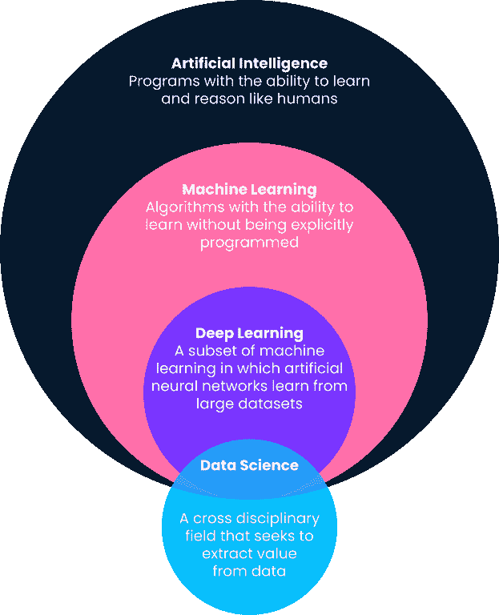

除了垃圾邮件检测，一些常见的机器学习应用程序包括基于人口统计数据的客户细分(销售和营销)、股票价格预测(金融)、索赔审批自动化(保险)、基于观看历史的内容推荐(媒体和娱乐)等等。机器学习已经变得无处不在，并在我们的日常生活中找到了各种应用。

在本文的最后，我们将分享许多资源，让你开始学习机器。

## 不同类型的机器学习

现在，我们已经给出了机器学习的概述，以及它在这个领域中可能遇到的其他流行词汇中的位置，让我们更深入地了解不同类型的机器学习算法。机器学习算法大致分为监督学习、非监督学习、强化学习和自我监督学习。让我们更详细地了解它们以及它们最常见的用例。

### 监督机器学习

大多数机器学习用例都围绕着算法从历史数据中学习模式，并以预测的形式将它们应用到新数据中。这通常被称为监督学习。监督学习算法显示了我们试图解决的特定问题的历史输入和输出，其中输入本质上是我们试图预测的观察的特征或维度，而输出是我们想要预测的结果。让我们用垃圾邮件检测的例子来说明这一点。

在垃圾邮件检测用例中，将在垃圾邮件数据集上训练监督学习算法。输入将是关于电子邮件的特征或维度，例如电子邮件主题行、发件人的电子邮件地址、电子邮件的内容、电子邮件是否包含看起来危险的链接，以及可以给出关于电子邮件是否是垃圾邮件的线索的其他相关信息。

输出将是该电子邮件实际上是否是垃圾邮件。在模型学习阶段，该算法学习一个函数来映射一组输入变量(垃圾邮件的不同维度)和输出变量(是否是垃圾邮件)之间的统计关系。然后，使用这种功能映射来预测以前看不到的数据的输出。

监督学习用例大致有两种类型:

*   **回归:**回归用例是指我们试图预测一个范围内的连续结果。一个很好的例子是基于房子的面积、位置、卧室数量和其他相关尺寸的房价预测。
*   **分类:**分类用例是指我们尝试对一个结果是否属于两个或更多类别进行分类。垃圾邮件检测器是分类模型(要么是垃圾邮件，要么不是垃圾邮件)，但其他分类用例包括客户流失预测(将流失或不流失)，识别图片中的汽车(多个类别)，等等。

在接下来的一节中，我们将更详细地研究特定的监督学习算法及其一些用例。

### 无监督机器学习

无监督学习算法不是学习将输入映射到输出的模式，而是发现数据中的一般模式，而不明确显示输出。无监督学习算法通常用于对不同的对象和实体进行分组和聚类。无监督学习的一个很好的例子是客户细分。公司通常有各种各样的客户角色。组织通常希望有一种基于事实的方法来识别他们的客户群，以便更好地为他们服务。进入无监督学习。

在这个用例中，无监督学习算法将根据各种属性来学习客户群，例如他们使用产品的次数、他们的人口统计数据、他们与产品的交互方式等等。然后，相同的算法可以基于相同的维度预测新客户属于哪个可能的细分市场。

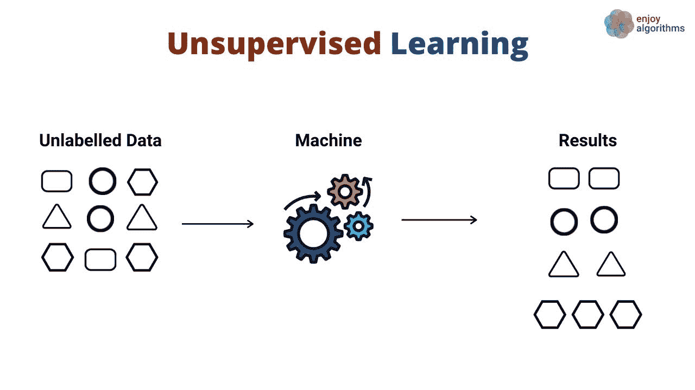

[来源](https://web.archive.org/web/20221212135824/Source:%20https://cdn-images-1.medium.com/max/1440/1*YUl_BcqFPgX49sSb5yrk3A.jpeg)

无监督算法也用于通过使用维度减少技术来减少数据集中的维度(即，特征的数量)。这些算法通常用作训练监督学习算法的中间步骤。

数据科学家在训练机器学习算法时经常面临的一个很大的权衡是性能与预测准确性。一般来说，他们对特定问题了解得越多越好。然而，这也可能导致缓慢的训练时间和表现。降维技术有助于减少数据集中的特征数量，而不会牺牲预测价值。

### 强化学习

强化学习是机器学习算法的一个子集，它利用奖励来促进期望的行为或预测，否则就是惩罚。虽然相对而言仍是机器学习的一个研究领域，但强化学习负责在国际象棋、围棋等游戏中超越人类智能的算法。

这是一种行为建模技术，模型通过不断与环境交互的试错机制来学习。让我们用象棋的例子来说明这一点。在高层次上，强化学习算法(通常称为 agent)被提供了一个环境(棋盘),在这个环境中它可以做出各种决策(走棋)。

每一步都有一组相关的分数，对导致代理人获胜的行为给予奖励，对导致代理人失败的行为给予惩罚。

代理不断与环境互动，以学习收获最多回报的动作，并不断重复这些动作。这种促进行为的重复被称为开发阶段。当代理寻找新的途径来获得奖励时，这被称为探索阶段。更一般地说，这被称为探索-开发范例。

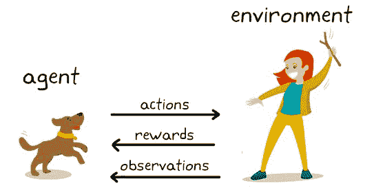

[来源](https://web.archive.org/web/20221212135824/https://www.kdnuggets.cimg/mathworks-reinforcement-learning-fig1-543.jpg)

### 自我监督机器学习

自我监督学习是一种数据高效的机器学习技术，其中模型从未标记的样本数据集进行学习。如下例所示，第一个模型输入了一些未标记的输入图像，它使用这些图像生成的特征对这些图像进行聚类。

这些例子中的一些将具有属于聚类的高置信度，而其他的则没有。第二步使用来自第一步的高置信度标记数据来训练分类器，该分类器往往比一步聚类方法更强大。

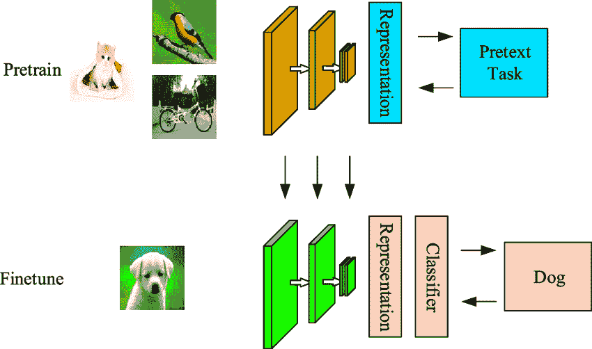

[来源](https://web.archive.org/web/20221212135824/https://assets-global.website-files.com/5d7b77b063a9066d83e1209c/6215b2d698dbdf6c276225c7_ssl.png)

自监督算法和监督算法之间的区别在于，前者的分类输出仍然没有映射到真实对象的类。它不同于监督学习，因为它不依赖于人工标记的集合，而是自己生成标签，因此得名自学习。

## 最流行的机器学习算法的分类

下面，我们概述了一些顶级的机器学习算法及其最常见的用例。

### 顶级监督机器学习算法

#### 线性回归

一种简单的算法模拟一个或多个解释变量和连续数字输出变量之间的线性关系。与其他机器学习算法相比，它的训练速度更快。它最大的优势在于能够解释和诠释模型预测。这是一种回归算法，用于预测客户生命周期价值、房价和股价等结果。

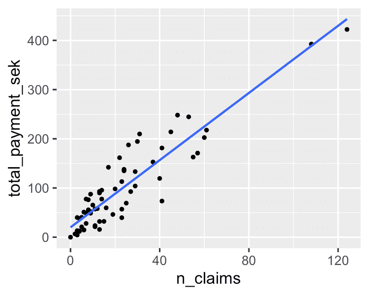

您可以在 Python 教程的[线性回归基础中了解更多信息。如果你对回归分析有兴趣，DataCamp 上的这个](https://web.archive.org/web/20221212135824/https://www.datacamp.com/tutorial/essentials-linear-regression-python)[非常受欢迎的课程](https://web.archive.org/web/20221212135824/https://www.datacamp.com/courses/introduction-to-regression-with-statsmodels-in-python)是你的合适资源。

#### 决策树

决策树算法是决策规则的树状结构，应用于输入要素以预测可能的结果。它可用于分类或回归。决策树预测为医疗专家提供了很好的帮助，因为它可以直接解释这些预测是如何做出的。

如果有兴趣学习[如何使用 Python](https://web.archive.org/web/20221212135824/https://www.datacamp.com/tutorial/decision-tree-classification-python) 构建决策树分类器，可以参考本教程。此外，如果你更习惯使用 R，那么你将从这个[教程](https://web.archive.org/web/20221212135824/https://www.datacamp.com/tutorial/decision-trees-R)中受益。DataCamp 上还有一个全面的[决策树课程](https://web.archive.org/web/20221212135824/https://www.datacamp.com/courses/machine-learning-with-tree-based-models-in-python)。

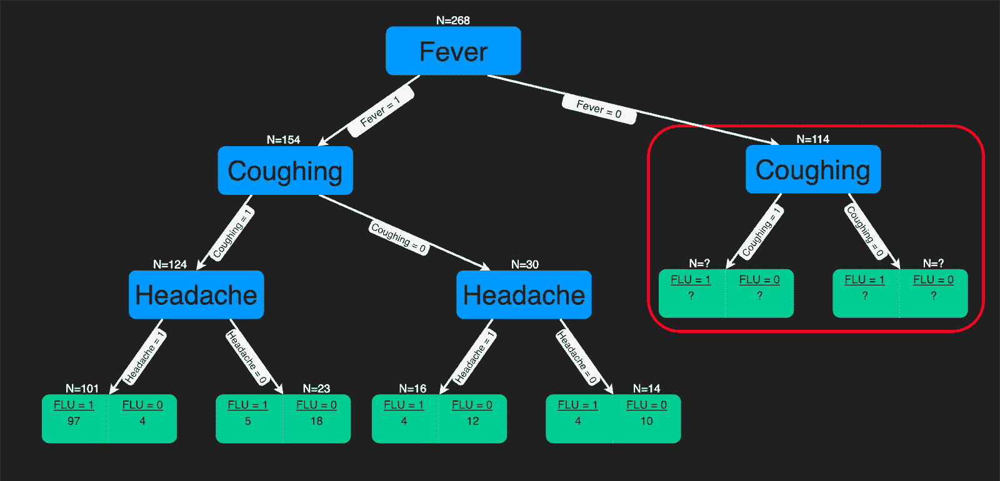

[来源](https://web.archive.org/web/20221212135824/https://mlfromscratch.com/conteimg/2020/09/exercise_3-1.png)

#### 随机森林

它可以说是最流行的算法之一，并且建立在决策树模型中明显可见的过度拟合的缺点之上。过度拟合是指算法在训练数据上训练得太好，而它们无法对看不见的数据进行归纳或提供准确的预测。随机森林通过在从数据中随机选择的样本上构建多个决策树来解决过度拟合的问题。最佳预测形式的最终结果来自森林中所有树的多数投票。

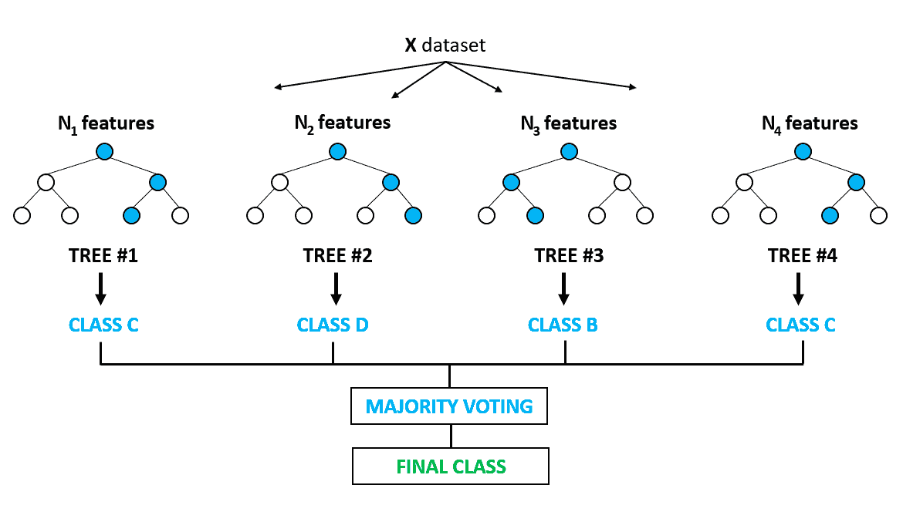

[来源](https://web.archive.org/web/20221212135824/https://miro.medium.com/max/1400/1*58f1CZ8M4il0OZYg2oRN4w.png)

它用于分类和回归问题。它在特征选择、疾病检测等方面有应用。你可以从 DataCamp 上这个非常受欢迎的课程中了解更多关于基于树的模型和集合(组合不同的单个模型)的信息。你也可以在[这篇基于 Python 的教程中了解更多关于实现随机森林模型](https://web.archive.org/web/20221212135824/https://www.datacamp.com/tutorial/random-forests-classifier-python)。

#### 支持向量机

支持向量机，俗称 SVM，一般用于分类问题。如下例所示，SVM 找到了一个超平面(本例中为直线)，该超平面将两个类(红色和绿色)分开，并最大化了它们之间的边距(虚线之间的距离)。

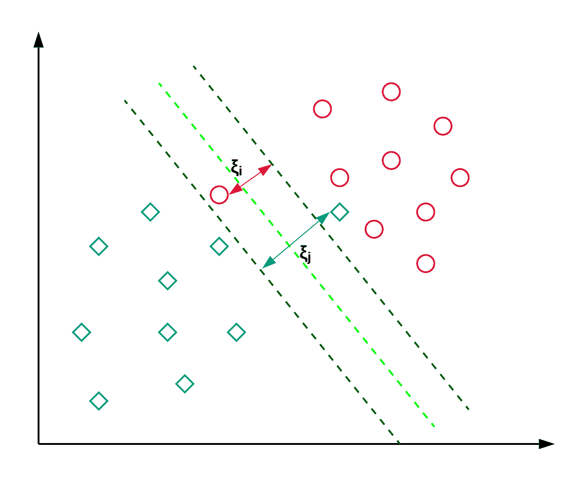

[来源](https://web.archive.org/web/20221212135824/https://miro.medium.com/max/1400/1*M_3iYollNTlz0PVn5udCBQ.png)

SVM 通常用于分类问题，但也可用于回归问题。它用于对新闻文章和手写识别进行分类。在这篇 scikit-learn SVM 教程中，你可以阅读更多关于不同类型的内核技巧以及 python 实现[。你也可以遵循这个教程，在这里你将](https://web.archive.org/web/20221212135824/https://www.datacamp.com/tutorial/svm-classification-scikit-learn-python)[复制 R 中的 SVM 实现](https://web.archive.org/web/20221212135824/https://www.datacamp.com/tutorial/support-vector-machines-r)

#### 梯度推进回归器

梯度推进回归是一种集成模型，它将几个弱学习器结合起来，形成一个稳健的预测模型。它擅长处理数据中的非线性和多重共线性问题。

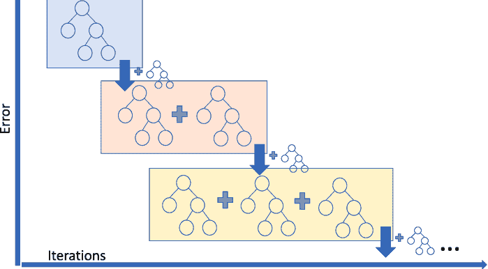

[来源](https://web.archive.org/web/20221212135824/https://www.researchgate.net/profile/Ivanna-Baturynska/publication/340524896/figure/fig3/AS:878319096569859@1586418999392/Schematical-representation-of-gradient-boosting-regression-in-regards-to-algorithm.png)

如果您从事拼车业务，并且需要预测拼车费用金额，那么您可以使用梯度推进回归器。如果你想了解渐变增强的不同风味，那么你可以在 DataCamp 上观看[这个](https://web.archive.org/web/20221212135824/https://campus.datacamp.com/courses/ensemble-methods-in-python/boosting-3?ex=13)视频。

### 顶级无监督机器学习算法

#### k 均值聚类

K-Means 是使用最广泛的聚类方法，它基于欧几里德距离确定 K 个聚类。这是一个非常受欢迎的客户细分和推荐系统的算法。

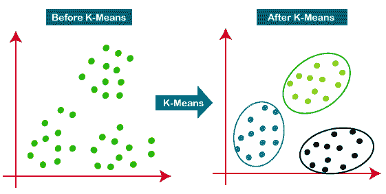

[来源](https://web.archive.org/web/20221212135824/https://static.javatpoint.com/tutorial/machine-learniimg/k-means-clustering-algorithm-in-machine-learning.png)

这篇教程是学习 K-means 聚类的很好的资源。

#### 主成分分析

主成分分析(PCA)是一种统计过程，用于通过将其投影到较低维度的子空间来总结来自大型数据集的信息。它也被称为降维技术，确保保留具有更高信息的数据的基本部分。

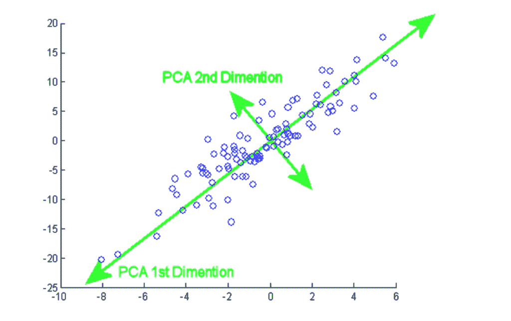

[来源](https://web.archive.org/web/20221212135824/https://programmathically.com/wp-content/uploads/2021/08/pca-2-dimensions-1024x644.png)

从本教程中，您可以在两个流行的数据集乳腺癌和 CIFAR-10 上实践[动手 PCA 实现](https://web.archive.org/web/20221212135824/https://www.datacamp.com/tutorial/principal-component-analysis-in-python)。

#### 分层聚类

这是一种自下而上的方法，其中每个数据点被视为其自己的聚类，然后最接近的两个聚类被迭代地合并在一起。与 K-means 聚类相比，它最大的优点是不需要用户一开始就指定期望的聚类数。它在基于相似性的文档聚类中得到应用。

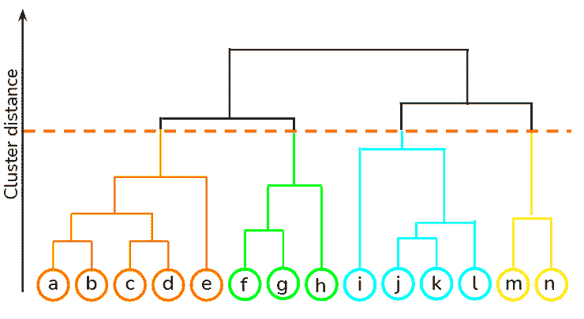

[来源](https://web.archive.org/web/20221212135824/https://miro.medium.com/max/740/1*VvOVxdBb74IOxxF2RmthCQ.png)

你可以在 [DataCamp](https://web.archive.org/web/20221212135824/https://www.datacamp.com/courses/clustering-methods-with-scipy) 使用本课程的`scipy`库学习各种无监督学习技术，比如层次聚类和 K-means 聚类。此外，你还可以从[这门课](https://web.archive.org/web/20221212135824/https://www.datacamp.com/courses/cluster-analysis-in-r)中学习如何应用聚类技术从未标记的数据中获得洞察力。

#### 高斯混合模型

它是一种概率模型，用于对数据集中的正态分布聚类进行建模。它不同于标准的聚类算法，因为它估计一个观察值属于一个特定聚类的概率，然后对其子群体进行推断。

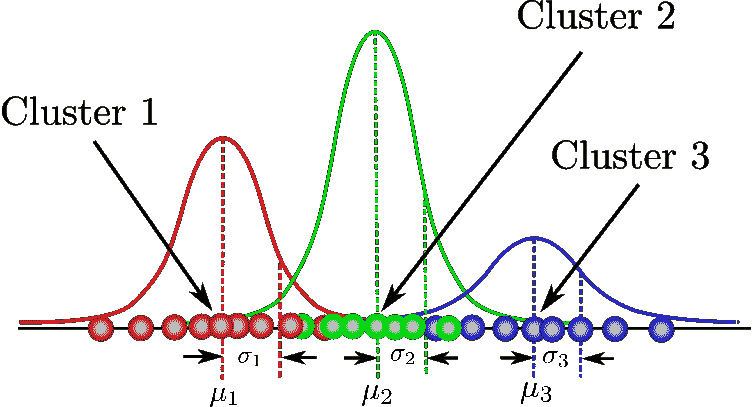

[来源](https://web.archive.org/web/20221212135824/https://miro.medium.com/max/753/1*lTv7e4Cdlp738X_WFZyZHA.png)

您可以在这里找到一站式课程整理，涵盖基于模型的聚类、混合模型的结构等基本概念。您还将使用 flexmix 软件包实践高斯混合建模。

#### Apriori 算法

一种基于规则的方法，使用频繁项集属性的先验知识来标识给定数据集中最频繁的项集。市场购物篮分析采用这种算法来帮助亚马逊和网飞这样的巨头将关于他们用户的大量信息转化为简单的产品推荐规则。它分析了数以百万计的产品之间的关联，揭示了深刻的规则。

DataCamp 提供了两种语言的综合课程——[Python](https://web.archive.org/web/20221212135824/https://www.datacamp.com/courses/market-basket-analysis-in-python)和 [R](https://web.archive.org/web/20221212135824/https://www.datacamp.com/courses/market-basket-analysis-in-r) 。

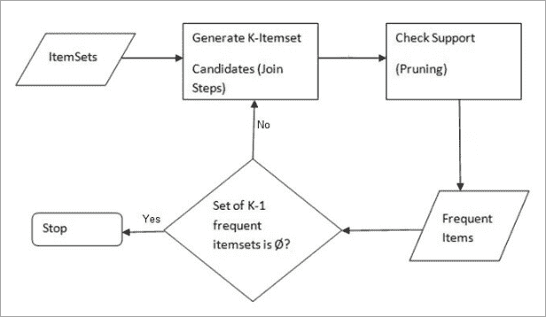

[来源](https://web.archive.org/web/20221212135824/https://www.softwaretestinghelp.com/wp-content/qa/uploads/2019/09/AprioriSteps.png)

## 如何学习机器学习

机器学习不再只是一个时髦词。许多组织正在部署机器学习模型，并已经从预测性洞察中实现了收益。不用说，市场上对高技能机器学习从业者的需求很大。下面，您会发现一个资源列表，可以快速帮助您提升机器学习概念的技能。下面是分享的内容:

*   [2022 年最值得阅读的 15 本机器学习书籍](https://web.archive.org/web/20221212135824/https://www.datacamp.com/blog/the-15-best-data-machine-learning-books-to-read-in-2022)
*   [2022 年十大深度学习读物](https://web.archive.org/web/20221212135824/https://www.datacamp.com/blog/top-10-deep-learning-books-to-read-in-2022)
*   [AI 和机器学习有什么区别？](https://web.archive.org/web/20221212135824/https://www.datacamp.com/blog/the-difference-between-ai-and-machine-learning)
*   [什么是机器学习？](https://web.archive.org/web/20221212135824/https://www.datacamp.com/blog/what-is-machine-learning)
*   [如何学习 python](https://web.archive.org/web/20221212135824/https://www.datacamp.com/blog/how-to-learn-python)
*   [如何学习 R](https://web.archive.org/web/20221212135824/https://www.datacamp.com/blog/how-to-learn-r)
*   [套索和脊线回归教程](https://web.archive.org/web/20221212135824/https://www.datacamp.com/tutorial/tutorial-lasso-ridge-regression)
*   [部署机器学习管道教程](https://web.archive.org/web/20221212135824/https://www.datacamp.com/tutorial/kubeflow-tutorial-building-and-deploying-machine-learning-pipelines)
*   [机器学习备忘单](https://web.archive.org/web/20221212135824/https://www.datacamp.com/cheat-sheet/machine-learning-cheat-sheet)