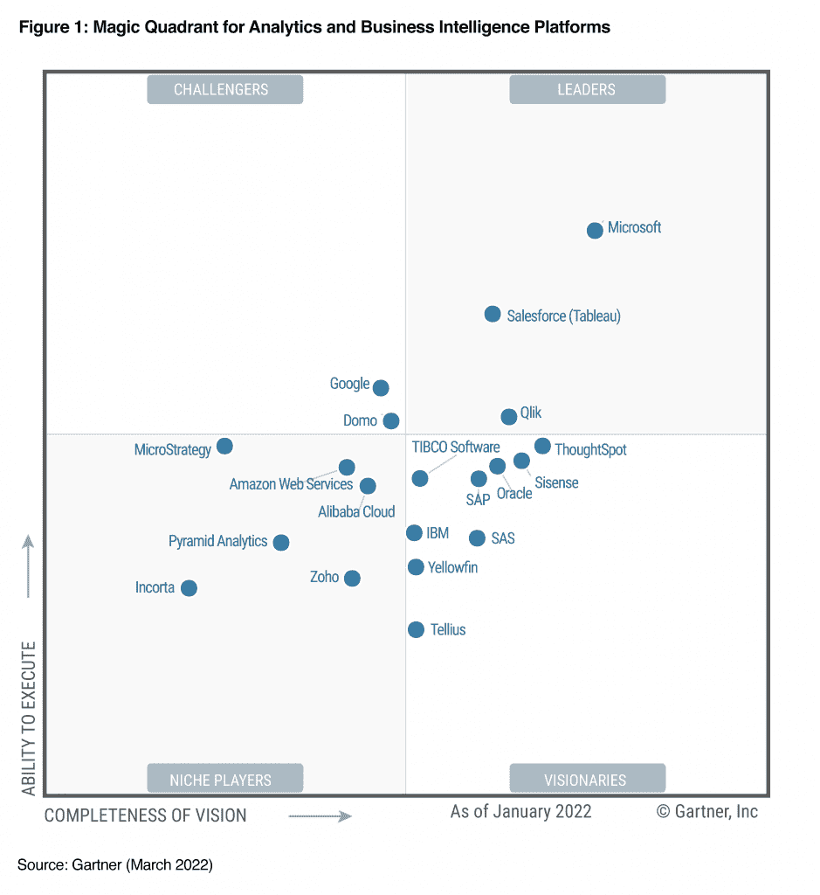
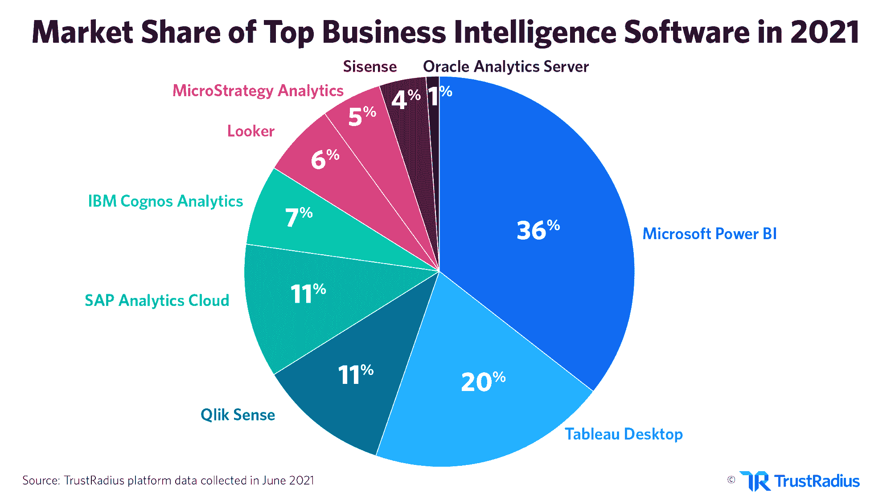

# 2022 年最重要的商务智能工作

> 原文：<https://web.archive.org/web/20230101102924/https://www.datacamp.com/blog/top-power-bi-jobs-in-2022>

如果你正在考虑从事分析或商业智能方面的职业，那么 [Power BI](https://web.archive.org/web/20220810141124/http://www.datacamp.com/learn/power-bi) 是添加到你简历中的最佳技能之一。Power BI 不仅提供了各种各样的工作机会，而且也是一项有助于长期职业发展的宝贵技能。

如果你不知道[什么是 Power BI](https://web.archive.org/web/20220810141124/https://www.datacamp.com/blog/all-about-power-bi)或者如果你对 Power BI 职业是否真的值得持观望态度，那么请继续阅读！在本文中，我们将分析 Power BI 在市场中的位置，以及 Power BI 可以提供哪些职业机会。我们将讨论你期望的薪水是多少，你应该具备什么样的技能和经验，以及每份工作都涉及到什么。

## 什么是 Power BI？

Power BI 是一个商业智能(BI)工具，允许您连接到各种数据源，在报告和仪表板中可视化数据，然后与您想要的任何人共享它们。一般来说，BI 的目的是跟踪关键绩效指标(KPI)并揭示业务数据中的洞察力，以便更好地为整个组织的决策提供信息。

要了解更多关于 Power BI 的知识并掌握基础知识，请查看此[入门教程](https://web.archive.org/web/20220810141124/https://www.datacamp.com/tutorial/tutorial-power-bi-for-beginners)或考虑报名参加此 [DataCamp Power BI 技能培训。](https://web.archive.org/web/20220810141124/https://www.datacamp.com/tracks/power-bi-fundamentals)

## 权力 BI 职业值得吗？

你可能会问自己的下一个问题是，从事商务智能是否真的值得。让我们来看看 Power BI 在市场中的定位，与其他一些流行的商业智能工具进行比较。

每年，Gartner 都会使用他们的“[魔力象限](https://web.archive.org/web/20220810141124/https://www.gartner.com/en/research/methodologies/magic-quadrants-research)”方法发布分析和商业智能市场摘要。您可以在下图中看到 [2022 年分析和商业智能平台魔力象限](https://web.archive.org/web/20220810141124/https://powerbi.microsoft.com/en-us/blog/microsoft-named-a-leader-in-the-2022-gartner-magic-quadrant-for-analytics-and-bi-platforms/)。

这个幻方图根据愿景的完整性和执行能力对各种平台进行排名。显然，微软(Power BI)遥遥领先于其他公司。Gartner 将“领导者”描述为“今天执行相对较好，并且为明天做好准备”的人。

根据 TrustRadius 在 2021 年进行的一项分析，Power BI 被确定为 2021 年领先的 BI 软件，占据 36%的市场份额。Power BI 也是 2021 年最受关注的软件。

上述“魔力象限”和市场份额分析在探索长期职业发展的最大机会时非常有用。基于这两点，Power BI 是商业智能和分析领域的可靠职业选择。如果你有兴趣在职业生涯中的某个时候过渡到数据科学，那么在 Power BI 和 business intelligence 领域的工作是获得经验和增强技能的绝佳跳板。

## Power BI 提供了哪些职业机会？

Power BI 中最常见的工作有:

*   **Power BI 开发人员/分析师:**专注于 Power BI
*   **Power BI 顾问:** Power BI 是主要技能，但通常需要更多经验和各种其他软件平台的知识
*   **商业智能开发人员/分析师:**商业智能平台的范围很广，可能需要其他高级分析技能

在本文的其余部分，我们将对这些角色进行细分，重点关注以下几个主要方面:

*   工资幅度
*   必备技能和/或教育水平
*   最常见的角色和职责

### Power BI 开发人员/分析师

Power BI 开发人员和 Power BI 分析师都有非常相似的工作要求和薪资期望，他们的职称可以互换使用。这项工作以 Power BI 为中心，通常包括周围的微软生态系统(如 SQL Server、Azure 和 SSRS)。

根据 [Glassdoor](https://web.archive.org/web/20220810141124/https://www.glassdoor.com/Career/power-bi-developer-career_KO0,18.htm) 的数据，这份工作的平均年薪是 104292 美元。这可能会因公司和工作级别的不同而有很大差异(即初级与高级)。通常，除了任何相关技能和工具之外，Power BI 还需要大约 3-5 年的经验。

这项工作需要的最常见的伴随技能是 [SQL](https://web.archive.org/web/20220810141124/http://www.datacamp.com/learn/sql) ，所以在学习 Power BI 的同时培养这项技能是个好主意。

一些工作清单提到，IT、计算机科学或类似专业的学士学位是必备条件。然而，一般来说，学士学位并不是 Power BI 中列出的大多数工作的标准要求。

角色和职责(此列表并不详尽，仅包含此工作中最常见的一些职责):

*   根据业务需求创建、发布和维护 Power BI 报告和控制面板。
*   写 DAX 公式。
*   连接到各种数据源并与各种其他平台集成(例如，Salesforce、SAP、Oracle、Azure 和 SQL Server)。
*   安装和管理 Power BI 网关。
*   编写和优化复杂的 SQL 查询和存储过程。
*   与其他业务单位合作，了解需求和业务问题，然后有效地交流见解和成果。

### Power BI 顾问

电力商业智能顾问是一个跨多个行业的实践性更强的工作，需要更广泛的技能。这些工作通常涉及直接与客户的定期接触，并要求你能够很好地沟通，有组织能力，并能够从头到尾管理项目。

Power BI 顾问的工作以 Power BI 为中心，但也可以包括各种其他软件平台(如 Salesforce 和 SAP 等第三方软件)；有时需要在 Power BI 和这些平台之间进行复杂的集成。对于脚本语言(如 Python)的知识也有更广泛的需求，以促进这些集成或复杂的分析。

根据 [Glassdoor](https://web.archive.org/web/20220810141124/https://www.glassdoor.com/Career/power-bi-consultant-career_KO0,19.htm) 的数据，这份工作的平均年薪是 110385 美元。这里值得注意的是，Power BI 顾问可以是全职职位，也可以是有限时间内的合同制职位。通常情况下，这些工作需要更多的经验，对于公司来说，要求 5 年以上的 Power BI 经验并不罕见。

角色和职责(此列表并不详尽，仅包含此工作中最常见的一些职责):

*   利用 Power BI 构建端到端解决方案–从头开始规划和设计系统。
*   能够独立工作，并在需要时作为团队的一部分。
*   了解客户需求，利用 Power BI 提供有效的解决方案(还能够发现能够促进增长并为客户提供价值的其他机会)。
*   确定新项目的范围，撰写项目计划并从头到尾记录项目。
*   根据客户要求创建和发布 Power BI 报告和仪表板(项目完成后的持续维护并不总是其中的一部分)。
*   连接到各种数据源，并与基于云的和内部部署的各种其他平台集成(例如 Salesforce、SAP、Oracle、Azure、SQL Server 和 AWS)。

### 商业智能开发人员/分析师

商业智能开发人员和商业智能分析师非常相似，他们的职位在许多职位列表中可以互换使用。这些工作比 Power BI 开发人员要宽泛一些，因为他们并不总是涉及 Power BI，并且可能需要 Tableau 和 Qlik 等其他平台的知识。然而，Power BI 是最常用的平台之一，在行业中非常有名，因此拥有 Power BI 作为一项技能在这些工作中具有很大的分量。你的技能也可以很容易的转移到其他平台。

在这些工作中，学士学位往往是强制性的，因为它们通常要求你进行高级分析并产生洞察力，而不仅仅依赖于特定的商业智能工具。正因为如此，可能还需要掌握足够的脚本语言(如 Python)技能以及熟练的 SQL。

根据 [Glassdoor](https://web.archive.org/web/20220810141124/https://www.glassdoor.com/Career/business-intelligence-developer-career_KO0,31.htm) 的数据，这份工作的平均年薪是 130895 美元。

角色和职责(此列表并不详尽，仅包含此工作中最常见的一些职责):

*   与其他业务单位和团队合作，了解需求、业务问题和业务流程，以推动解决方案。
*   负责数据挖掘、数据转换、数据洞察、高级分析、报告及其交付。
*   参与关于公司当前和未来数据需求的高层讨论，并就数据如何最好地支持关键业务功能提供建议。
*   根据需要设计、实施和维护 ETL 作业和流程。
*   根据需要设计、构建和维护 SQL 数据库。

## 结论

Power BI 显然是分析和商业智能市场的领导者。这意味着，在你的简历中把能力 BI 作为一项技能，将会打开各种各样的职业机会和长期发展。

如果你有兴趣从事 Power BI 职业，你应该考虑 Power BI 职业跟踪的[数据分析师。该课程由微软共同创建，将为您提供通过](https://web.archive.org/web/20220810141124/https://www.datacamp.com/tracks/data-analyst-in-power-bi) [PL-300 考试](https://web.archive.org/web/20220810141124/https://docs.microsoft.com/en-us/learn/certifications/exams/pl-300)并获得助理认证所需的知识和技能:[微软认证:Power BI 数据分析师助理](https://web.archive.org/web/20220810141124/https://docs.microsoft.com/en-us/learn/certifications/power-bi-data-analyst-associate/)。

我们希望这篇文章能为您提供一些在 Power BI 中可以期待的职业机会，并激励您在分析和商业智能领域开始令人兴奋的职业生涯！