# 2022 年数据科学家的顶级编程语言

> 原文：<https://web.archive.org/web/20230101103026/https://www.datacamp.com/blog/top-programming-languages-for-data-scientists-in-2022>

如果你正在考虑开始数据科学职业生涯，越早开始编码越好。学习编码是每个有抱负的数据科学家的关键一步。然而，开始编程可能会令人望而生畏，尤其是如果你没有以前的编码经验。

要选择合适的编程语言，首先要看数据科学家在日常工作中做些什么。数据科学家是使用数学和统计技术处理、分析和提取数据信息的技术专家。数据科学领域有许多领域，从机器学习和深度学习到网络分析、自然语言处理和地理空间分析。为了完成任务，数据科学家依靠计算机的能力。编程是一种允许数据科学家与计算机交互并向计算机发送指令的技术。

有数百种编程语言，为不同的目的而构建。其中一些更适合数据科学，提供高生产率和高性能来处理大量数据。然而，这个群体仍然包含了大量的编程语言。

在本文中，我们将探讨 2022 年的一些顶级数据科学编程语言，并展示每种语言的优势和能力。

*   计算机编程语言
*   稀有
*   结构化查询语言
*   Java 语言(一种计算机语言，尤用于创建网站)
*   朱莉娅
*   斯卡拉
*   C/C++
*   Java Script 语言
*   迅速发生的
*   去
*   矩阵实验室
*   斯堪的纳维亚航空公司

## 计算机编程语言

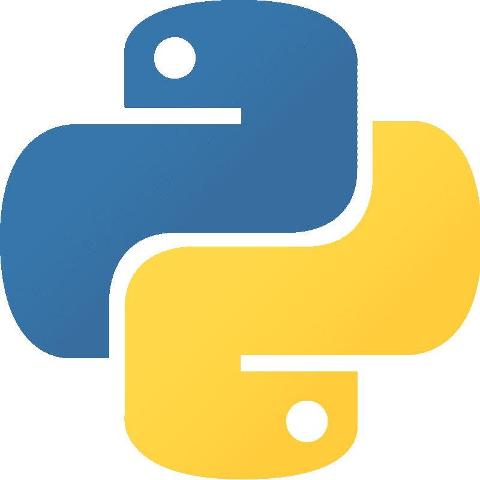

在几个编程语言流行指数中排名第一，包括 [TIOBE](https://web.archive.org/web/20221007043919/https://www.tiobe.com/tiobe-index/) 指数和 [PYPL](https://web.archive.org/web/20221007043919/https://pypl.github.io/PYPL.html) 指数，Python 的流行程度在最近几年蓬勃发展。Python 是一种开源的通用编程语言，不仅在数据科学行业，而且在其他领域，如 web 开发和视频游戏开发，都有广泛的适用性。

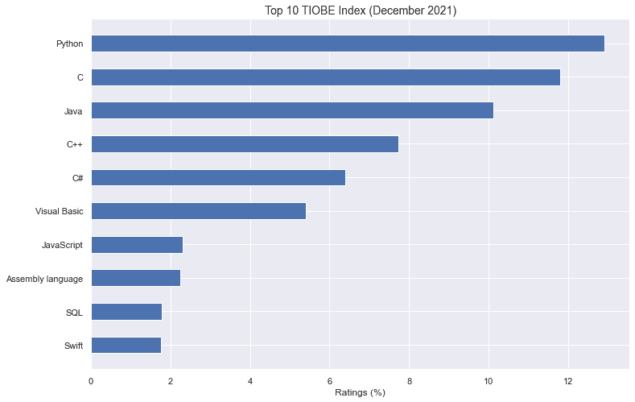

Source: [TIOBE Index](https://web.archive.org/web/20221007043919/https://www.tiobe.com/tiobe-index/)

你能想到的任何数据科学任务都可以用 Python 来完成。这主要得益于其丰富的图书馆生态系统。凭借其庞大的用户社区支持的数千个强大的软件包，Python 可以执行各种操作，从数据预处理、可视化和统计分析，到机器学习和深度学习模型的部署。以下是一些最常用于数据科学和机器学习的库:

NumPy 是一个流行的软件包，它提供了大量的高级数学函数。许多包都是基于 NumPy 对象的，比如著名的 Numpy 数组。

pandas 是数据科学中的一个关键库，用于执行数据库的各种操作，也称为 DataFrames。

**Matplotlib** :数据可视化的标准 Python 库。

**scikit-learn** :建立在 NumPy 和 SciPy 之上，已经成为开发机器学习算法最流行的 Python 库。

**TensorFlow** :由 Google 开发，是开发机器学习和深度学习算法的强大计算框架。

**Keras** :一个开源库，旨在训练高性能的神经网络。

由于其简单易读的语法，Python 通常被认为是初学者最容易学习和使用的编程语言之一。如果你是数据科学的新手，不知道先学哪种语言，Python 是最好的选择之一。

如果您想成为 Python 专家，DataCamp 可以提供帮助。查看我们目录中的 [Python 课程](https://web.archive.org/web/20221007043919/https://www.datacamp.com/data-courses/python)，开始训练成为一名成功的数据科学家。

## 稀有

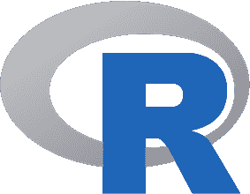

根据流行指数，R 还没有 Python 流行，它是有抱负的数据科学家的首选。经常在数据科学论坛上被描绘成 Python 的主要竞争对手，学习这两种语言中的一种是进入该领域的关键一步。

r 是一种开源的、特定于领域的语言，专门为数据科学而设计。在金融和学术界非常流行，R 是数据操作、处理和可视化以及统计计算和机器学习的完美语言。

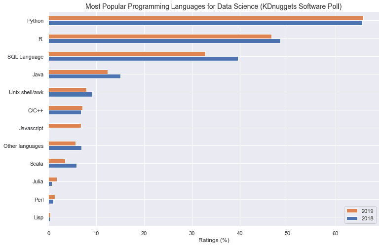

Source: [KDnuggets](https://web.archive.org/web/20221007043919/https://www.kdnuggets.com/2019/05/poll-top-data-science-machine-learning-platforms.html)

像 Python 一样，R 有一个庞大的用户社区和大量用于数据分析的专用库。一些最著名的属于 Tidyverse 家族，一个数据科学包的集合。它包括用于数据操作的 dplyr 和功能强大的 ggplot2，这是 r 中用于数据可视化的标准库。至于机器学习任务，像 caret 这样的库将使您在开发算法时更加轻松。

尽管可以在命令行上直接使用 R，但通常使用 Rstudio，它是一个强大的第三方接口，集成了各种功能，如数据编辑器、数据查看器和调试器。

无论您是数据科学的新手，还是想要增加新的语言，学习 R 都是一个完美的选择。查看我们丰富的课程目录[开始磨练你的技能。](https://web.archive.org/web/20221007043919/https://www.datacamp.com/data-courses/r-courses)

## 结构化查询语言

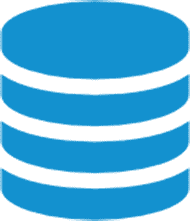

世界上的许多数据都存储在数据库中。SQL(结构化查询语言)是一种特定于领域的语言，允许程序员与数据库通信、编辑和提取数据。如果你想成为一名数据科学家，掌握数据库和 SQL 的工作知识是必不可少的。

了解 SQL 将使您能够使用不同的关系数据库，包括 SQLite、MySQL 和 PostgreSQL 等流行系统。尽管这些关系数据库之间有微小的差异，但基本查询的语法非常相似，这使得 SQL 成为一种非常通用的语言。

无论你选择 Python 还是 R 开始你的数据科学之旅，你也要考虑[学习 SQL](https://web.archive.org/web/20221007043919/https://www.datacamp.com/learn/sql) 。由于其声明性的、简单的语法，与其他语言相比，SQL 非常容易学习，并且它会在这个过程中给你很大的帮助。

想入门 SQL？看看 DataCamp 提供的不同的 [SQL 课程](https://web.archive.org/web/20221007043919/https://www.datacamp.com/data-courses/sql)和[技能课程](https://web.archive.org/web/20221007043919/https://www.datacamp.com/tracks/sql-fundamentals)，做好成为查询高手的准备。

## Java 语言(一种计算机语言，尤用于创建网站)

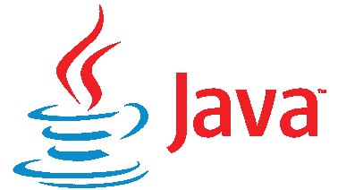

在 PYPL 指数中排名第二，在 TIOBE 指数中排名第三，Java 是世界上最流行的编程语言之一。它是一种开源的、面向对象的语言，以其一流的性能和效率而闻名。无尽的技术、软件应用和网站都依赖于 Java 生态系统。

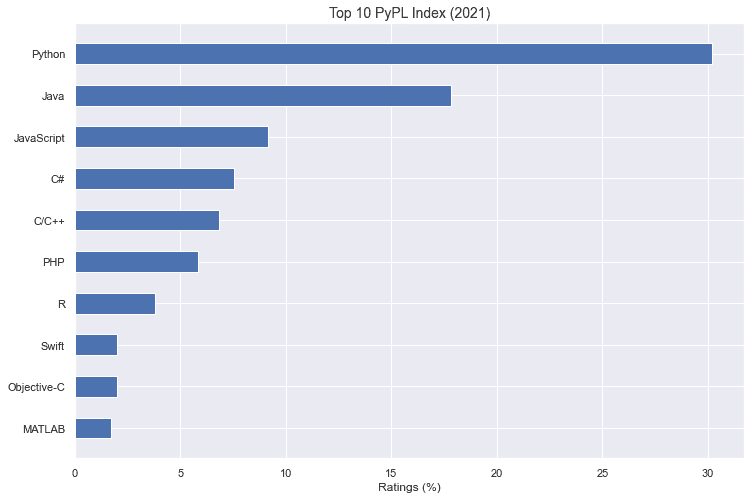

Source: [PYPL Index](https://web.archive.org/web/20221007043919/https://pypl.github.io/PYPL.html)

尽管在开发网站或从头构建应用程序时，Java 是首选，但近年来，Java 在数据科学行业中占据了突出的地位。这主要是因为 Java 虚拟机，它为流行的大数据工具，如 Hadoop、Spark 和 Scala，提供了一个坚实而高效的框架。

由于其高性能，Java 是开发 ETL 作业和执行需要大存储和复杂处理要求的数据任务(如机器学习算法)的合适语言。

## 朱莉娅

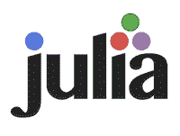

Julia 可以被认为是数据科学的后起之秀。尽管是这个列表中最年轻的语言之一，(该列表于 2011 年发布)，Julia 已经给数值计算界留下了深刻的印象。有时被称为 Python 的继承者，与用于数据分析的其他语言相比，Julia 是一个非常有效的工具。

尽管由于被几个主要组织(包括金融行业的许多组织)早期采用而声名狼藉，但 Julia 仍然缺乏与顶级数据科学语言竞争的成熟度。它仍然有一个小社区，并且没有它的主要竞争对手 Python 或 r 那么多的库。

朱莉娅的主要缺点是它的年轻，但有许多理由继续关注它。让我们看看它在未来几年如何演变。

## 斯卡拉

虽然 Scala 在编程语言的顶级排名中并不常见(它在 PYPL 指数中排名第 18，在 TIOBE 中排名第 33)，但在数据科学的背景下，谈论这种编程语言是不可避免的。

Scala 最近成为机器学习和大数据的最佳语言之一。Scala 于 2004 年发布，是一种多聚合语言，被明确设计成比 Java 更清晰、更简洁的替代语言。

Scala 也运行在 Java 虚拟机上，从而允许与 Java 的互操作性，并使其成为分布式大数据项目的完美语言。比如 Apache Spark 集群计算框架就是用 Scala 写的。

## #C/C++

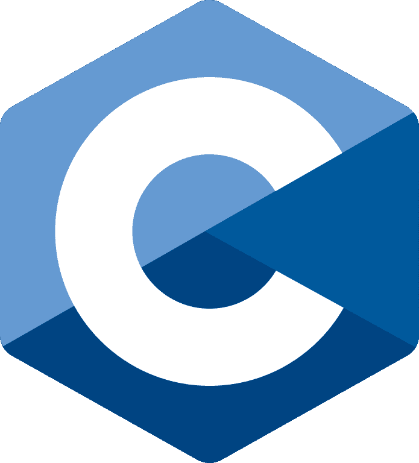          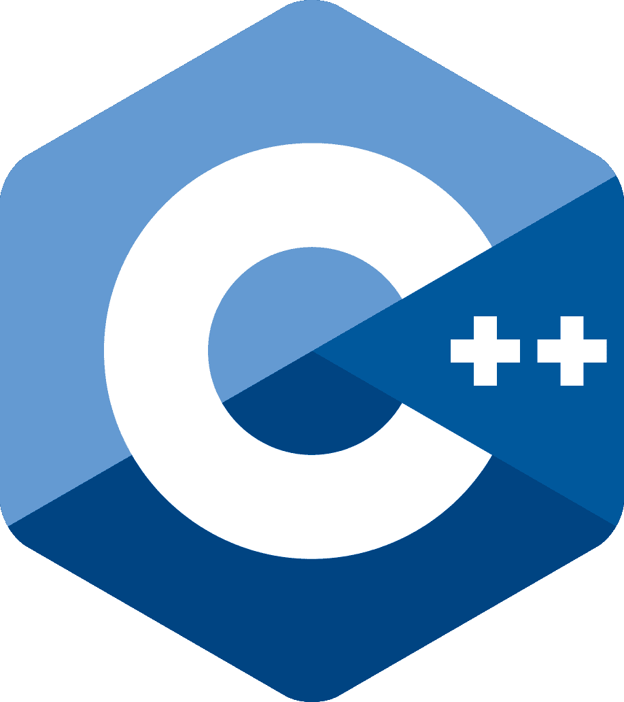

作为两种优化程度最高的语言，熟悉 C 及其近亲 C++，在处理计算密集型数据科学工作时会非常有用。

C 和 C++相对来说比其他编程语言更快，这使得它们非常适合开发大数据和机器学习应用程序。包括 PyTorch 和 TensorFlow 在内的一些流行的机器学习库的核心组件都是用 C++编写的，这并不是巧合。

由于它们的低级本质，C 和 C++是最复杂的语言之一。因此，虽然它们可能不是进入数据科学世界的首选，但是一旦您对编程的基础有了扎实的了解，掌握它们是一个明智之举，可以为您的简历带来很大的不同。

## Java Script 语言

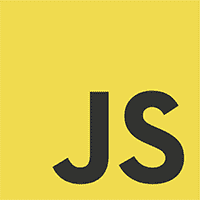

根据 2021 年栈溢出开发者调查[显示，JavaScript 居于首选编程语言之首。JavaScript 是一种跨领域、通用的语言，因其构建丰富的交互式网页的能力而广为人知。](https://web.archive.org/web/20221007043919/https://insights.stackoverflow.com/survey/2021)

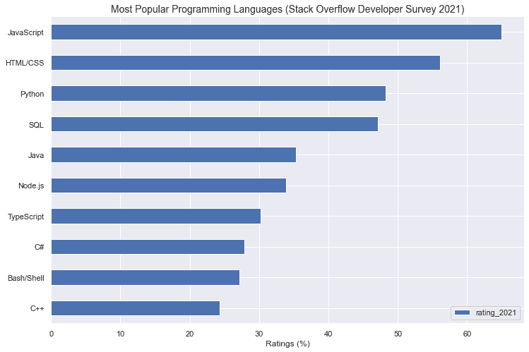

Source: [Stack Overflow](https://web.archive.org/web/20221007043919/https://insights.stackoverflow.com/survey/2021)

尽管大多数 JavaScript 用户都在 web 开发部门工作，但近年来，这种语言在数据科学行业已经声名狼藉。今天，JavaScript 支持流行的机器学习和深度学习库，如 TensorFlow 和 Keras，以及非常强大的可视化工具，如 D3。

由于流行的机器学习库的支持，以及它在 web 开发人员中的广泛流行，它对于所有想要进入数据科学的前端和后端程序员来说都是一个平稳的入门选择。

## 迅速发生的

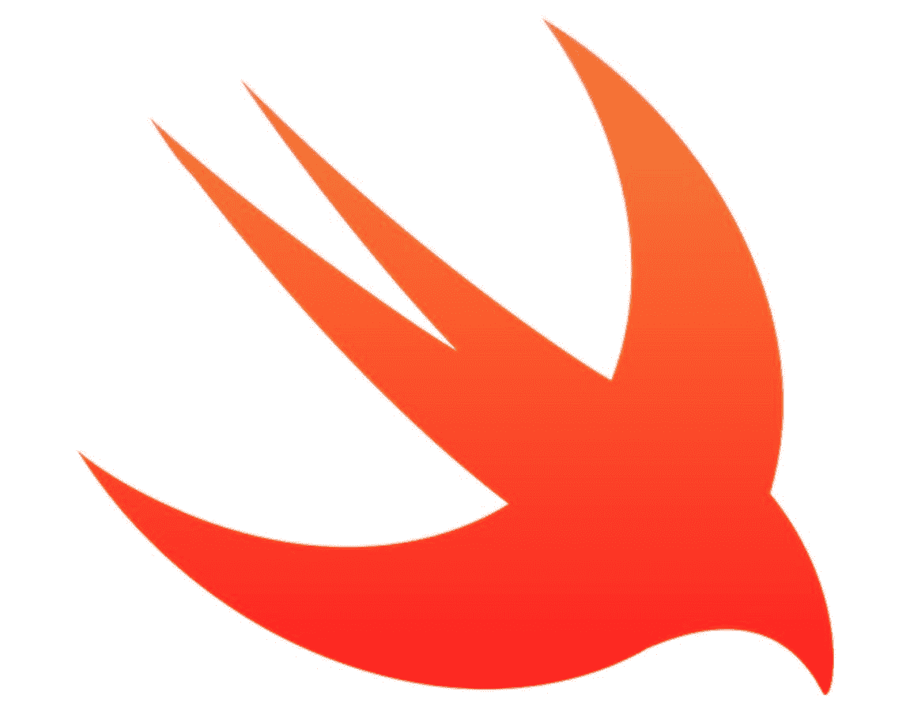

Python 和 R 的一个缺点是它们都没有考虑到移动设备。在未来几年，我们可以期待移动设备、可穿戴设备和物联网的更大进步。苹果开发 Swift 是为了让创建应用程序变得更容易，并借此发展其应用程序生态系统和增加客户保留率。在 2014 年发布后不久，苹果和谷歌就开始合作，让它成为移动和机器学习相互作用的关键工具。

Swift 现在与 TensorFlow 兼容，并可与 Python 互操作。Swift 的另一个优势是，它不再局限于 iOS 生态系统，它已经开放源代码，可以在 Linux 上工作。

出于这些原因，如果你是一名移动开发者，并且对数据科学感到好奇，Swift 就是你要找的。

## 去

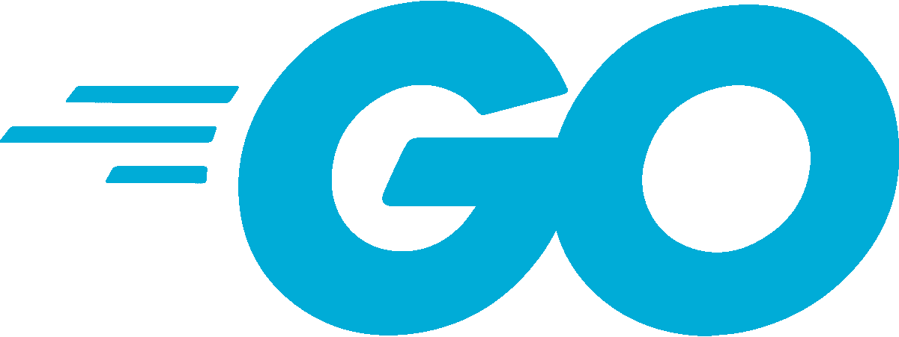

Go(或 GoLang)是一种越来越受欢迎的语言，尤其是对于机器学习项目。谷歌在 2009 年引入了类似 C 语言的语法和布局。根据许多开发人员的说法，Go 是 c 语言的 21 世纪版本。

在推出十多年后，由于其灵活和易于理解的语言，Go 变得非常受欢迎。在数据科学的背景下，围棋可以成为机器学习任务的良好盟友。尽管前景看好，但 Go 的数据科学社区仍然非常小。

## 矩阵实验室

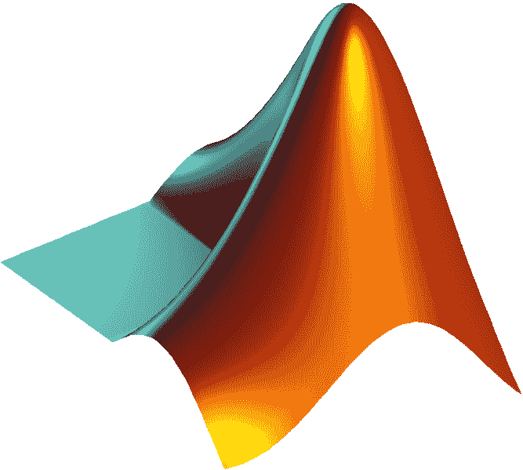

MATLAB 是一种主要为数值计算而设计的语言。自 1984 年推出以来，MATLAB 在学术界和科学研究中被广泛采用，它提供了强大的工具来执行高级数学和统计运算，使其成为数据科学的重要候选对象。

然而，MATLAB 有一个重要的缺点:它是专有的。根据不同的情况(学术、个人或商业用途)，您可能需要支付大量的资金来获得许可证，这使得它不如其他可以免费使用的编程语言有吸引力。

## 斯堪的纳维亚航空公司

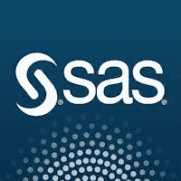

SAS(统计分析系统)是为商业智能和高级数值计算设计的软件环境。SAS 已经存在很长时间了，它被许多领域的大公司广泛采用，为 SAS 开发者创造了一个巨大的市场。

然而，相对于 Python 和 r 等其他数据科学编程语言，SAS 正逐步失去人气。这主要是因为，正如 MATLAB 的情况一样，使用 SAS 需要许可证。这为新用户和公司创造了一个进入壁垒，他们将倾向于使用免费的开源语言。

## 结论

我们希望这篇文章能帮助你浏览丰富多样的数据科学编程语言。作为一名数据科学家，没有哪种语言能够绝对解决您工作中可能出现的所有问题和情况。但是，如果你是数据科学的新人，我们的建议是从选择 Python 或 R 开始，你可以报名参加我们免费的[Python 入门教程](https://web.archive.org/web/20221007043919/https://www.datacamp.com/courses/intro-to-python-for-data-science)和[R 入门教程](https://web.archive.org/web/20221007043919/https://www.datacamp.com/courses/free-introduction-to-r?utm_source=blog_launch_new_intro&utm_medium=blog&utm_campaign=launch_new_intro)，看看你最喜欢哪个。从那以后，成功的关键就是耐心和练习。为了获得实际编程经验，我们最近推出了 [DataCamp Workspace](https://web.archive.org/web/20221007043919/https://www.datacamp.com/workspace) ，这是一个编写代码、应用技能和创建数据科学组合的在线环境。

一旦你对自己选择的语言有了信心，你就可以通过扎实的 SQL 训练来提升自己。幸运的是，DataCamp 提供了大量的 SQL 课程。

从那里，天空是极限。精通多种编程语言是一项资产，根据组织的需要在不同语言之间转换将有助于您成为一名多才多艺的数据科学家，并获得更成功的职业生涯。