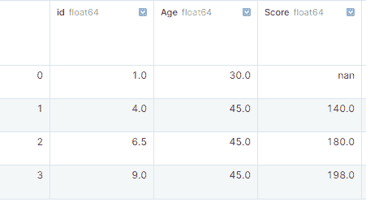
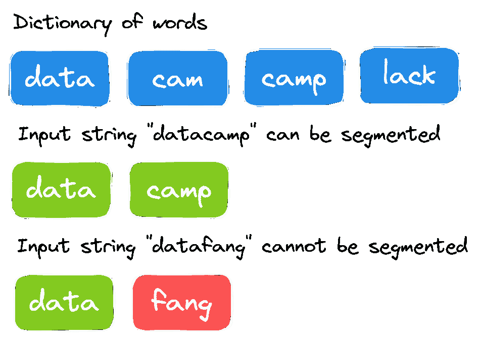
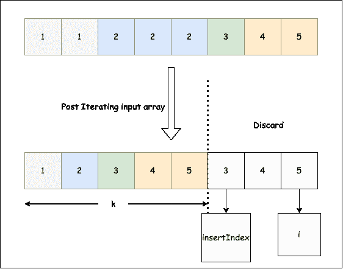
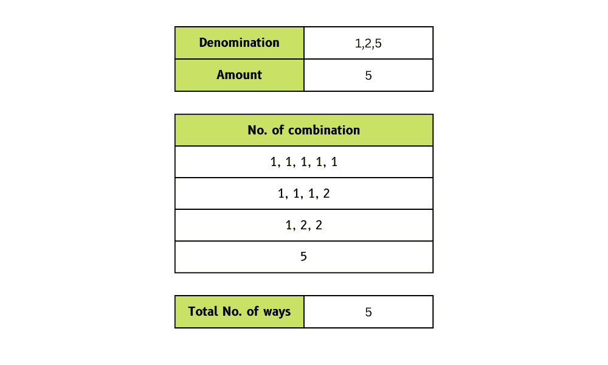

# 23 大 Python 面试问答

> 原文：<https://web.archive.org/web/20221212135909/https://www.datacamp.com/blog/top-python-interview-questions-and-answers>


Python 是科技行业最流行的语言。在面试中，您将被要求使用 Python 解决挑战，并解释复杂的 Python 功能。要通过技术和编码阶段，你需要一个指南或模拟问题来练习。

在本帖中，我们概述了技术面试中最常见的问题。练习这些问题可以帮助数据专业人员、开发人员和软件工程师成功通过面试阶段。

## 基本 Python 面试问题

这些是你在初级 Python 面试中可能会遇到的一些问题。

### 1.你能区分列表和元组吗？

列表和元组是 Python 数据结构。列表是动态的，而元组具有静态特征。它们都有不同的优点和使用案例。

#### 目录

list 是可变的数据类型，消耗更多的内存，更适合插入和删除元素。此外，它有几个构建函数，与 Tuple 相比，迭代的含义较慢。

**举例**:

```py
a_list = ["Data", "Camp", "Tutorial"]
```

#### 元组

Tuple 是一种不可变的数据类型，通常用于访问元素。它速度更快，占用的内存更少，但是缺少内置方法。

**举例**:

```py
a_tuple = ("Data", "Camp", "Tutorial")
```

在我们的 [Python 列表教程](https://web.archive.org/web/20221212135949/https://www.datacamp.com/tutorial/lists-python)中了解更多。

### 2.Python 中 __init__()是什么？

在 OOP 术语中，它被称为构造函数。它用于在创建新对象时启动一个状态。例如，可以为对象特性指定值，或者在创建对象时运行必要的操作。

__init__()方法是为 Python 类保留的，在创建新对象时会自动调用该方法。

**举例**:

我们创建了一个“book_shop”类，并添加了构造函数和“book()”函数。构造函数将存储书名，函数' book()'将打印书名。

为了测试我们的代码，我们用“Sandman”初始化了“b”对象，并执行了“book()”函数。

```py
class book_shop:

    # constructor
    def __init__(self, title):
        self.title = title

    # Sample method
    def book(self):
        print('The tile of the book is', self.title)

b = book_shop('Sandman')
b.book()
# The tile of the book is Sandman
```

### 3.可变数据类型和不可变数据类型有什么区别？

可变的 Python 数据类型可以被修改，并且它们可以在运行时改变，例如，列表、字典和集合。

不可变的 Python 数据类型不能更改或修改，它们在运行时保持不变，例如，数字、字符串和元组。

### 4.用一个例子解释列表、字典和元组理解。

#### 目录

List comprehension 提供了一行语法来基于现有列表的值创建新列表。你可以用一个“for 循环”来复制同样的东西，但是这需要你写多行，有时会变得很复杂。

列表理解简化了基于现有 iterable 的列表创建。

```py
my_list = [i for i in range(1, 10)]
my_list
# [1, 2, 3, 4, 5, 6, 7, 8, 9]
```

#### 词典

与列表理解类似，您可以使用一行代码基于现有的表创建一个字典。您需要用花括号“{}”将操作括起来。

```py
my_dict = {i for i in range(1, 10)}
my_dict
# {1, 2, 3, 4, 5, 6, 7, 8, 9}
```

#### 元组

对于元组来说有点不同。您可以使用圆括号`()'创建元组理解，但它将返回一个生成器对象，而不是元组理解。

您可以运行循环来提取元素或将它们转换为列表。

```py
my_tuple = (i for i in range(1, 10))
my_tuple
# <generator object <genexpr> at 0x7fb91b151430>
```

你可以在我们的 [Python 元组教程](https://web.archive.org/web/20221212135949/https://www.datacamp.com/tutorial/python-tuples)中了解更多。

## 高级 Python 面试问题

这些面试问题是为更有经验的 Python 从业者准备的。

### 5.Python 中的猴子补丁是什么？

Python 中的 Monkey patching 是一种动态技术，可以在运行时改变代码的行为。简而言之，您可以在运行时修改类或模块。

**举例**:

让我们用一个例子来学习猴子打补丁。

1.  我们创建了一个具有“patch()”函数的类“monkey”。我们还在类外创建了一个“monk_p”函数。
2.  我们现在将通过将‘monkey . patch’分配给‘monk _ p’来用‘monk _ p’函数替换‘patch’。
3.  最后，我们将通过使用“monkey”类创建对象并运行“patch()”函数来测试修改。

没有显示“patch()正在被调用”，而是显示了“monk_p()正在被调用”。

```py
class monkey:
    def patch(self):
          print ("patch() is being called")

def monk_p(self):
    print ("monk_p() is being called")

# replacing address of "patch" with "monk_p"
monkey.patch = monk_p

obj = monkey()

obj.patch()
# monk_p() is being called
```

### 6.Python 的“with”语句是为了什么而设计的？

“with”语句用于异常处理，使代码更简洁。它通常用于管理公共资源，如创建、编辑和保存文件。

**举例**:

您可以使用“with”语句创建并编写一个文本文件，而不是编写多行 open、try、finally 和 close 语句。很简单。

```py
# using with statement
with open('myfile.txt', 'w') as file:
    file.write('DataCamp Black Friday Sale!!!')
```

### 7.为什么在 Python 的 try/except 构造中使用 else？

` try:`和` except:`在 Python 中以异常处理而闻名，那么` else:`在哪里派上用场呢？` else:`将在未引发异常时触发。

**举例**:

让我们通过几个例子来更多地了解“else:”。

1.  第一次尝试时，我们输入 2 作为分子，输入“d”作为分母。这是不正确的，而“except:”是由“无效输入！”。
2.  在第二次尝试中，我们输入 2 作为分子，1 作为分母，得到的结果是 2。没有引发异常，所以它触发了“else:”打印消息“除法成功。”

```py
try:
    num1 = int(input('Enter Numerator: '))
    num2 = int(input('Enter Denominator: '))
    division = num1/num2
    print(f'Result is: {division}')
except:
    print('Invalid input!')
else:
    print('Division is successful.')

## Try 1 ##
# Enter Numerator: 2
# Enter Denominator: d
# Invalid input!

## Try 2 ##
# Enter Numerator: 2
# Enter Denominator: 1
# Result is: 2.0
# Division is successful.
```

参加 [Python 基础](https://web.archive.org/web/20221212135949/https://www.datacamp.com/tracks/python-fundamentals)技能课程，获得成为 Python 程序员所需的基本技能。

## Python 数据科学面试问题

对于那些更关注 Python 的数据科学应用的人来说，这些是你可能会遇到的一些问题。

### 8.NumPy 比常规 Python 列表有什么优势？

#### 记忆

Numpy 数组消耗的内存更少。

例如，如果创建一个列表和一个包含一千个元素的 Numpy 数组。列表将消耗 48K 字节，Numpy 数组将消耗 8K 字节的内存。

#### 速度

Numpy 数组在数组上执行操作所需的时间比列表少。

例如，如果我们将两个列表和两个包含一百万个元素的 Numpy 数组相乘。列表花了 0.15 秒，数组花了 0.0059 秒。

#### 虔诚地

Numpy 数组使用起来很方便，因为它们提供了简单的数组乘法、加法和更多的内置功能。而 Python 列表不能运行基本操作。

### 9.merge、join 和 concatenate 有什么区别？

#### 合并

使用唯一列标识符合并两个名为 series 对象的数据框架。

它需要两个数据框架，两个数据框架中的一个公共列，以及“如何”将它们连接在一起。您可以对两个数据帧进行左、右、外、内和交叉连接。默认情况下，它是一个内部联接。

```py
pd.merge(df1, df2, how='outer', on='Id')
```

#### 加入

使用唯一索引连接数据帧。它需要一个可选的“on”参数，该参数可以是一列或多个列名。默认情况下，join 函数执行左连接。

```py
df1.join(df2)
```

#### 连锁的

Concatenate 沿特定轴(行或列)连接两个或多个数据帧。它不需要一个“开”的论点。

```py
pd.concat(df1,df2)
```

*   **join()** :通过索引合并两个数据帧。
*   **merge()** :根据指定的一列或多列合并两个数据帧。
*   **concat()** :垂直或水平组合两个或多个数据帧。

### 10.你如何识别和处理缺失值？

#### 识别缺失值

我们可以通过使用“isnull()”函数，然后应用“sum()”来识别数据帧中缺失的值。` Isnull()`将返回布尔值，求和将得出每列中缺失值的数量。

在这个例子中，我们创建了一个列表字典，并将其转换为 pandas 数据帧。之后，我们使用 isnull()。sum()获取每列中缺失值的数量。

```py
import pandas as pd
import numpy as np

# dictionary of lists
dict = {'id':[1, 4, np.nan, 9],
        'Age': [30, 45, np.nan, np.nan],
        'Score':[np.nan, 140, 180, 198]}

# creating a DataFrame
df = pd.DataFrame(dict)

df.isnull().sum()
# id       1
# Age      2
# Score    1
```

#### 处理缺失值

处理缺失值有多种方法。

1.  如果行或列包含缺失值，请使用' dropna()'删除整行或整列。不建议使用这种方法，因为这样会丢失重要信息。
2.  使用' fillna()'函数用常量、平均值、向后填充和向前填充来填充缺失值。
3.  使用“Replace()”函数将缺失值替换为常量字符串、整数或浮点数。
4.  使用插值法填充缺失的值。

**注意**:使用“dropna()”函数时，请确保您正在处理一个更大的数据集。

```py
# drop missing values
df.dropna(axis = 0, how ='any')

#fillna
df.fillna(method ='bfill')

#replace null values with -999
df.replace(to_replace = np.nan, value = -999)

# Interpolate
df.interpolate(method ='linear', limit_direction ='forward')
```



参加[数据科学家和 Python](https://web.archive.org/web/20221212135949/https://www.datacamp.com/tracks/data-scientist-with-python) 职业培训，成为一名专业的数据科学家。它包括 25 门课程和 6 个项目，帮助您在 Python 库的帮助下学习数据科学的所有基础知识。

### 11.你使用过哪些 Python 库进行可视化？

数据可视化是数据分析中最重要的部分。您可以看到您的数据在运行，这有助于您找到隐藏的模式。

最流行的 Python 数据可视化库有:

1.  Matplotlib
2.  希伯恩
3.  Plotly
4.  散景

在 Python 中，我们一般使用 **Matplotlib** 和 **seaborn** 来显示所有类型的数据可视化。只需几行代码，您就可以用它来显示散点图、折线图、箱线图、条形图等等。

对于交互式和更复杂的应用程序，我们使用 **Plotly** 。您可以使用它用几行代码创建丰富多彩的交互式图形。您可以缩放、应用动画，甚至添加控制功能。Plotly 提供了 40 多种独特的图表，我们甚至可以使用它们来创建一个 web 应用程序或仪表板。

**散景**用于大型数据集中具有高度交互性的详细图形。

## Python 编码面试问题

如果你有一个 Python 编码的面试，准备类似的问题可以帮助你给面试官留下深刻印象。

### 12.在 Python 中，如何用给定的字符替换字符串空间？

这是一个简单的字符串操作挑战。你必须用特定的字符替换空格。

**例 1** :某用户提供了字符串“l vey u”和字符“o”，输出将是“loveyou”。

**例 2** :某用户提供了字符串“D t C mpBl ckFrid yS le”和字符“a”，输出将是“DataCampBlackFridaySale”。

在' str_replace()'函数中，我们将循环遍历字符串中的每个字母，并检查它是否是空格。如果它由空格组成，我们将用用户提供的特定字符替换它。最后，我们将返回修改后的字符串。

```py
def str_replace(text,ch):
    result = ''
    for i in text: 
            if i == ' ': 
                i = ch  
            result += i 
    return result

text = "D t C mpBl ckFrid yS le"
ch = "a"

str_replace(text,ch)
# 'DataCampBlackFridaySale'
```

### 13.给定一个正整数 num，写一个函数，如果 num 是一个正方数，则返回 True，否则返回 False。

这有一个相对简单的解决方案。您可以通过以下方式检查数字是否有完美的平方根:

1.  求该数的平方根，并将其转换为整数。
2.  将平方应用于平方根数，并检查它是否是一个完美的平方根。
3.  将结果作为布尔值返回。

#### 测试 1

我们已经为“valid_square()”函数提供了数字 10。

1.  取这个数的平方根，我们得到 3.162776601683795。
2.  通过将其转换成整数，我们得到 3。
3.  然后，取 3 的平方，得到 9。
4.  9 不等于数字，所以函数会返回 False。

答

#### 测试 2

我们已经为“valid_square()”函数提供了数字 36。

1.  取这个数的平方根，我们得到 6。
2.  通过将其转换成整数，我们得到 6。
3.  然后，取 6 的平方，得到 36。
4.  36 等于数字，所以函数将返回 True。

```py
def valid_square(num):
    square = int(num**0.5)
    check = square**2==num
    return check

valid_square(10)
# False
valid_square(36)
# True
```

### 14.给定一个整数 n，返回 n 阶乘 n 中尾随零的个数！

为了通过这个挑战，你必须首先计算 n 阶乘(n！)然后计算训练零的个数。

#### 寻找阶乘

在第一步中，我们将使用 while 循环迭代 n 阶乘，当 n 等于 1 时停止。

#### 计算尾随零

在第二步中，我们将计算尾随零，而不是零的总数。差别巨大。

```py
7! = 5040
```

七个阶乘总共有两个零，只有一个尾随零，所以我们的解应该返回 1。

1.  将阶乘数转换为字符串。
2.  读回来申请循环。
3.  如果数字是 0，结果加+1，否则中断循环。
4.  返回结果。

解决方案很优雅，但需要注意细节。

```py
def factorial_trailing_zeros(n):

    fact = n
    while n > 1:
        fact *= n - 1
        n -= 1

    result = 0

    for i in str(fact)[::-1]:
        if i == "0":
            result += 1
        else:
            break

    return result

factorial_trailing_zeros(10)
# 2
factorial_trailing_zeros(18)
# 3
```

参加基本的[实践编码面试问题](https://web.archive.org/web/20221212135949/https://www.datacamp.com/courses/practicing-coding-interview-questions-in-python?hl=GB)课程，为您接下来的 Python 编码面试做准备。

## FAANG Python 面试问题

下面，我们挑选了一些你可能会从行业中最受欢迎的职位中想到的问题，这些职位在 Meta、Amazon、Google 等公司。

### 脸书/Meta Python 面试问题

你在 Meta 会遇到的确切问题很大程度上取决于这个角色。但是，您可能会遇到以下情况:

#### 15.字符串分段

你会得到一大串单词和一个单词字典。您必须确定输入字符串是否可以使用字典分割成单词。



作者图片

解决方案相当简单。你必须在每一点分割一个大的字符串，并检查该字符串是否可以分割成字典中的单词。

1.  使用大字符串的长度运行循环。
2.  我们将创建两个子字符串。
3.  第一个子字符串将从 s[0:i]中检查大字符串中的每个点
4.  如果第一个子串不在字典中，它将返回 False。
5.  如果第一个子串在字典中，它将使用 s[i:0]创建第二个子串。
6.  如果第二个子字符串在字典中，或者第二个子字符串的长度为零，则返回 True。用第二个子串递归调用' can_segment_str()'，如果可以分段则返回 True。

```py
def can_segment_str(s, dictionary):
    for i in range(1, len(s) + 1):
        first_str = s[0:i]
        if first_str in dictionary:
            second_str = s[i:]
            if (
                not second_str
                or second_str in dictionary
                or can_segment_str(second_str, dictionary)
            ):
                return True
    return False

s = "datacamp"
dictionary = ["data", "camp", "cam", "lack"]
can_segment_string(s, dictionary)
# True
```

#### 16.从排序数组中删除重复项

给定一个按升序排序的整数数组，删除重复的数字，使每个唯一元素只出现一次。确保数组的最终顺序保持不变。

在 Python 中不可能改变数组的长度，所以我们将结果放在数组的第一部分。删除重复项后，我们将有 k 个元素，数组中的前 k 个元素应该包含结果。



图片来自 [LeetCode](https://web.archive.org/web/20221212135949/https://leetcode.com/problems/remove-duplicates-from-sorted-array/solution/)

**例 1** :输入数组为[1，1，2，2]，函数应该返回 2。

**例 2** :输入数组为[1，1，2，3，3]，函数应该返回 3。

**解决方案**:

1.  运行范围为 1 到数组大小的循环。
2.  检查之前的号码是否唯一。我们正在将以前的元素与当前的元素进行比较。
3.  如果它是唯一的，则使用 insertIndex 更新数组，开始时为 1，然后在 insertIndex 上加+1。
4.  返回 insertIndex，因为它是 k。

一旦你知道怎么做，这个问题就相对简单了。如果你花更多的时间去理解这句话，你可以很容易地想出一个解决办法。

```py
def removeDuplicates(array):
    size = len(array)
    insertIndex = 1
    for i in range(1, size):
        if array[i - 1] != array[i]:
            # Updating insertIndex in our main array
            array[insertIndex] = array[i]
            # Incrementing insertIndex count by 1
            insertIndex = insertIndex + 1
    return insertIndex

array_1 = [1,2,2,3,3,4]
removeDuplicates(array_1)
# 4

array_2 = [1,1,3,4,5,6,6]
removeDuplicates(array_2)
# 5
```

#### 17.找到最大的单笔销售利润

给你提供了股票价格的列表，你必须返回买入和卖出价格，以获得最高利润。

**注**:我们要从单笔买卖中获取最大利润，如果不能盈利，就要减少损失。

**例一** : stock_price = [8，4，12，9，20，1]，买入= 4，卖出= 20。利润最大化。

**例二** : stock_price = [8，6，5，4，3，2，1]，买入= 6，卖出= 5。最小化损失。

**解决方案**:

1.  我们将通过从当前买入(列表中的第二个元素)中减去全局卖出(列表中的第一个元素)来计算全局利润。
2.  运行从 1 到列表长度的循环。
3.  在循环中，使用列表元素和当前买入值计算当前利润。
4.  如果当前利润大于全局利润，则用当前利润和全局卖出将全局利润更改为列表的 I 元素。
5.  如果当前买入大于列表的当前元素，用列表的当前元素改变当前买入。
6.  最终，我们将返回全球买卖价值。为了得到全球购买价值，我们将从全球利润中减去全球销售。

问题有点棘手，你可以想出你独特的算法来解决问题。

```py
def buy_sell_stock_prices(stock_prices):
    current_buy = stock_prices[0]
    global_sell = stock_prices[1]
    global_profit = global_sell - current_buy

    for i in range(1, len(stock_prices)):
        current_profit = stock_prices[i] - current_buy

        if current_profit > global_profit:
            global_profit = current_profit
            global_sell = stock_prices[i]

        if current_buy > stock_prices[i]:
            current_buy = stock_prices[i]

    return global_sell - global_profit, global_sell

stock_prices_1 = [10,9,16,17,19,23]
buy_sell_stock_prices(stock_prices_1)
# (9, 23)

stock_prices_2 = [8, 6, 5, 4, 3, 2, 1]
buy_sell_stock_prices(stock_prices_2)
# (6, 5)
```

### 亚马逊 Python 面试问题

Amazon Python 面试问题可能会有很大不同，但可能包括:

#### 18.找出数组中缺少的数字

已经向你提供了从 1 到 n 的正整数列表。从 1 到 n 的所有数字都存在，除了 x，你必须找到 x。

**举例**:

| four | five | three | Two | eight | one | six |

*   n = 8
*   缺少的数字= 7

这道题是一道简单的数学题。

1.  求列表中所有元素的和。
2.  利用等差数列求和公式，求出前 n 个数的期望和。
3.  返回预期总和与元素总和之间的差值。

```py
def find_missing(input_list):

  sum_of_elements = sum(input_list)

  # There is exactly 1 number missing
  n = len(input_list) + 1
  actual_sum = (n * ( n + 1 ) ) / 2

  return int(actual_sum - sum_of_elements)
list_1 = [1,5,6,3,4]

find_missing(list_1)
# 2
```

#### 19.数组中的毕达哥拉斯三联体

编写一个函数，如果存在满足 a2+ b2 = c2 的毕达哥拉斯三元组，则返回 True

**举例**:

| **输入** | **输出** |
| [3, 1, 4, 6, 5]  | 真实的 |
| [10, 4, 6, 12, 5] | 错误的 |

**解决方案**:

1.  对数组中的所有元素求平方。
2.  按升序对数组进行排序。
3.  跑两圈。外部循环从数组的最后一个索引到 1 开始，内部循环从(outer_loop_index -1)开始。
4.  创建 set()来存储外循环索引和内循环索引之间的元素。
5.  检查集合中是否存在等于(array[outerLoopIndex]–array[innerLoopIndex])的数字。如果是，返回真，否则返回假。

```py
def checkTriplet(array):
    n = len(array)
    for i in range(n):
        array[i] = array[i]**2

    array.sort()

    for i in range(n - 1, 1, -1):
        s = set()
        for j in range(i - 1, -1, -1):
            if (array[i] - array[j]) in s:
                return True
            s.add(array[j])
    return False

arr = [3, 2, 4, 6, 5]
checkTriplet(arr)
# True
```

#### 20.有多少种方法可以用硬币和总数来找零？

我们需要创建一个函数，该函数采用一个硬币面额和总金额的列表，并返回我们可以进行更改的方式的数量。

在示例中，我们提供了硬币面额[1，2，5]和总额 5。作为回报，我们有五种方法可以做出改变。



作者图片

**解决方案**:

1.  我们将创建大小金额+ 1 的列表。添加了额外的空间来存储零量的溶液。
2.  我们将用 1 开始一个解决方案列表。
3.  我们将运行两个循环。外部循环将返回面额的数量，内部循环将从外部循环索引的范围运行到金额+1。
4.  不同面值的结果存储在阵列解决方案中。溶液[i] =溶液[i] +溶液[i - den]
5.  这个过程将对命名列表中的所有元素重复，在解决方案列表的最后一个元素，我们将有我们的号码。

```py
def solve_coin_change(denominations, amount):
    solution = [0] * (amount + 1)
    solution[0] = 1
    for den in denominations:
        for i in range(den, amount + 1):
            solution[i] += solution[i - den]

    return solution[len(solution) - 1]

denominations = [1,2,5]
amount = 5

solve_coin_change(denominations,amount)
# 4
```

### 谷歌 Python 面试问题

与提到的其他公司一样，Google Python 面试问题将取决于职位和经验水平。但是，一些常见问题包括:

#### 21.用 Python 定义一个 lambda 函数，一个迭代器，一个生成器。

Lambda 函数也称为匿名函数。您可以添加任意数量的参数，但只能使用一条语句。

迭代器是一种对象，我们可以用它来迭代列表、字典、元组和集合等可迭代对象。

生成器是一个类似于普通函数的函数，但是它使用 yield 关键字而不是 return 来生成一个值。如果函数体包含 yield，它会自动成为生成器。

在我们的完整教程中阅读更多关于 [Python 迭代器和生成器](https://web.archive.org/web/20221212135949/https://www.datacamp.com/tutorial/python-iterators-generators-tutorial)的内容。

#### 22.给定数组 arr[]，找出最大值 j–I，使得 arr[j] > arr[i]

这个问题很简单，但需要特别注意细节。我们得到了一个正整数数组。我们必须找到 j-i 的最大差值，其中 array[j] > array[i]。

**例子**:

1.  输入:[20，70，40，50，12，38，98]，输出:6 (j = 6，i = 0)
2.  输入:[10，3，2，4，5，6，7，8，18，0]，输出:8 ( j = 8，i = 0)

**解决方案**:

1.  计算数组的长度并用-1 初始化最大差值。
2.  跑两圈。外部循环从左侧选取元素，内部循环将选取的元素与从右侧开始的元素进行比较。
3.  当元素大于拾取的元素时停止内部循环，并使用 j - I 不断更新最大差值。

```py
def max_index_diff(array):
    n = len(array)
    max_diff = -1
    for i in range(0, n):
        j = n - 1
        while(j > i):
            if array[j] > array[i] and max_diff < (j - i):
                max_diff = j - i
            j -= 1

    return max_diff

array_1 = [20,70,40,50,12,38,98]

max_index_diff(array_1)
# 6
```

#### 23.在 Python 中如何使用三元运算符？

三元运算符也称为条件表达式。它们是根据条件 True 和 False 来评估表达式的运算符。

您可以在一行中编写条件表达式，而不是使用多行 if-else 语句。它允许您编写简洁紧凑的代码。

例如，我们可以将嵌套的 if-else 语句转换成一行，如下所示。

If-else 语句

```py
score = 75

if score < 70:
    if score < 50:
        print('Fail')
    else:
        print('Merit')
else:
    print('Distinction')
# Distinction
```

嵌套三元运算符

```py
print('Fail' if score < 50 else 'Merit' if score < 70 else 'Distinction')
# Distinction
```

你需要修改 Python 语法、函数、类、数据类型、算法、数据结构和异常处理。此外，您需要阅读技术教程，查看示例项目、备忘单和模拟问题，并解决编码挑战以通过面试阶段。

你需要准备关于本机功能的一般性 Python 问题、特定工作问题(数据工程师、数据科学家、后端开发人员)以及基于代码的定时问题。可以用 DataCamp 练习 [机器学习 Python 题](https://web.archive.org/web/20221212135949/https://www.datacamp.com/courses/practicing-machine-learning-interview-questions-in-python?hl=GB) 和 [统计 Python 面试题](https://web.archive.org/web/20221212135949/https://www.datacamp.com/courses/practicing-statistics-interview-questions-in-python) 。

你必须展现出编写干净的生产就绪代码的能力，理解特定工作的 Python 库、工具和算法，并为复杂的问题提出独特的解决方案。你可以通过练习编码挑战或从事开源项目来做到这一点。

通过在 GitHub 和个人网站上创建基于 Python 的项目组合，你也可以脱颖而出。

lambda 函数也称为匿名函数，即没有名称的 Python 函数。它可以接受任意数量的参数，但只计算并返回一个表达式。

**语法**:

```py
lambda arguments : expression
```

**举例**:

```py
lambda_add = lambda a : a + 10
print(lambda_add (7))
# 17
```

1.  开发网站和软件
2.  脚本和实用软件
3.  桌面应用
4.  数据分析
5.  机器学习

如果将函数应用于 iterable 的每一项,“map”比“for loop”更快。