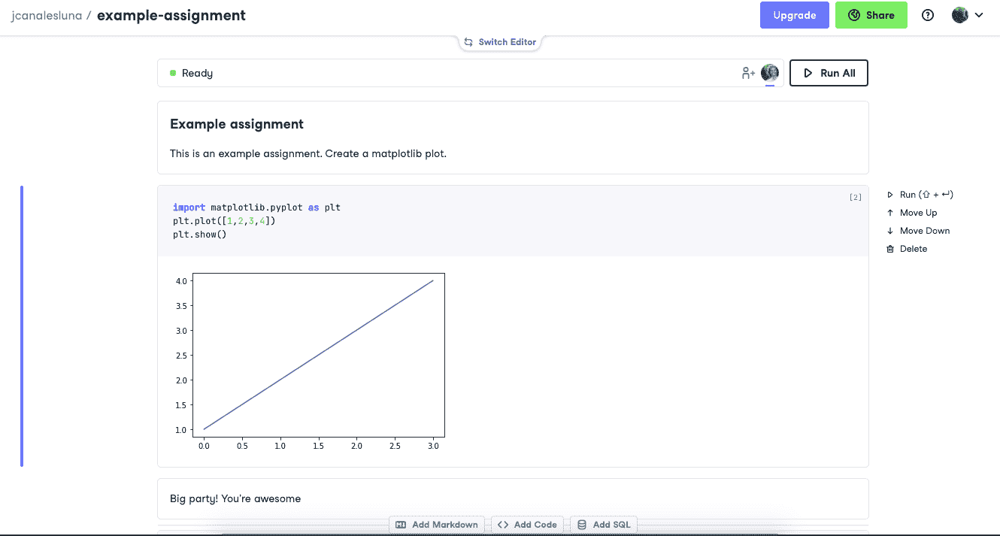
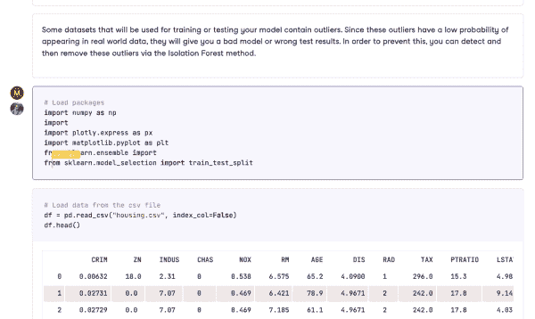

# 在教室中使用 DataCamp 工作空间

> 原文：<https://web.archive.org/web/20220627024316/https://www.datacamp.com/blog/using-datacamp-workspace-in-the-classroom>

*   [什么是 DataCamp 工作区？](#what-is-datacamp-workspace?)
*   [如何在教室中使用工作区](#how-to-use-workspace-in-the-classroom)
    *   [工作区模板和数据集](#workspace-templates-and-datasets)
        *   [工作区模板](workspace-templates)
        *   [工作区数据集](#workspace-datasets)
    *   [培养学生协作能力](#foster-student-collaboration)
    *   [根据你的讲座/课程建立你自己的作业](#build-your-own-assignments-based-on-your-lectures/coursework)
*   [结论](#conclusion)

在 DataCamp，我们的使命是让学生掌握适合未来的数据技能。我们相信[数据教育是一项基本人权](https://web.archive.org/web/20220604042222/https://www.datacamp.com/blog/data-education-is-a-basic-human-right-freely-supporting-300000-students)，这就是为什么我们在 2017 年推出了[课堂数据营](https://web.archive.org/web/20220604042222/https://www.datacamp.com/groups/classrooms)，这是一项向学院和大学教授及其学生提供免费数据营的举措。2021 年，随着进一步推进数据科学民主化的明确愿景，教室数据营的范围扩大到包括美国高中教室的[免费访问。](https://web.archive.org/web/20220604042222/https://www.datacamp.com/blog/high-school-teachers-and-their-students-now-have-free-access-to-datacamp-for-classrooms)

2021 年，3，750 多个教室的 100，000 多名学生和教师加入了教室数据营。这意味着可以免费访问 DataCamp 不断增长的专家内容课程(360 多门互动课程、50 多条精选学习路径和 100 多个真实项目)以及旨在提高参与度和跟踪学生学习进度的各种工具。最强大的工具之一是 [DataCamp Workspace](https://web.archive.org/web/20220604042222/https://www.datacamp.com/workspace) 。参加 DataCamp for Classrooms 的学生可以无限制地访问 Datacamp Workspace，这是一个在线 IDE，允许他们通过协作处理数据项目来获得实际编码经验。

在本帖中，我们将解释什么是 DataCamp Workspace，以及教师和讲师如何在课程工作中利用该工具来提高学生的数据科学技能。

## 什么是 DataCamp 工作区？

DataCamp Workspace 是一个在线集成开发环境(通常称为 IDE ),允许用户编写代码、单独或集体分析数据以及共享数据见解。换句话说，你可以把 DataCamp Workspace 看作是一种专门为数据科学设计的 Google Docs。这是从学习数据科学到利用它的完美工具。

在某些方面，DataCamp Workspace 类似于 Jupyter 笔记本，其优势之一在于与该平台完全互操作。事实上，从 DataCamp 的笔记本编辑器无缝切换到 JupyterLab 是可能的。Workspace 包括一些关键功能，如真实团队协作、评论、标记和共享，令人惊讶的是，这些功能在数据科学领域中仍然经常缺失。

Workspace 是一个基于云的浏览器内工具，这意味着它无需安装和下载即可开始使用。这在课堂上可以节省大量时间，因为不需要在学生的计算机上进行设置。

Workspace 支持 R、Python 和 SQL，可在 Mac、Windows 和 Linux 上使用。数据科学的所有软件和常用包都有。它有一个直观和用户友好的界面，使其成为各种数据配置文件的伟大工具，是学生的理想选择。

## 如何在教室中使用工作空间

Workspace 是为参加教室数据营的教师和学生设计的核心工具。值得注意的是，所有申请教室数据营的小组都在团队计划中，每个小组成员都可以免费获得团队许可证！同样的情况也适用于 [DataCamp 捐赠的](https://web.archive.org/web/20220604042222/https://www.datacamp.com/donates)组。该团队计划是为寻求在数据科学项目上合作的小型和大型数据营团队设计的。编辑者(通常是讲师和教师)可以在组帐户中创建、编辑、执行、发布和共享工作空间和集成。

Workspace 至少可以支持三种教育场景:

*   工作空间模板和数据集

*   促进学生合作

*   根据你的讲座/课程作业，建立你自己的作业

### 工作空间模板和数据集

开始会很艰难。熟悉并熟练掌握 IDE，更不用说编程语言了，是一项艰巨而耗时的任务，尤其是当学生的数据或编码知识有限时。为了减轻冷启动的影响，Workspace 提供了一些有用的资源来帮助您入门，包括:

#### 工作区模板

使用可定制的模板，在几分钟内构建一个数据驱动的控制面板。工作区模板使您能够访问预先编写的代码，从而轻松构建可视化和报表，而无需设置笔记本或编写自己的代码。使用工作区模板，您将能够:

*   借助预写代码快速获得洞察力
*   通过预安装和导入的软件包节省安装时间
*   作为有影响力的出版物分享您的见解
*   从学习到做数据科学

#### 工作空间数据集

Workspace 包括一个完整的现成数据集目录，您可以分析和解决现实世界中的问题。将您的编码技能应用到我们管理的库中的数据集，并创建一个数据科学组合来存储您的发现。

### 促进学生合作

DataCamp Workspace 支持笔记本电脑中的实时和异步协作，并以不同的访问权限共享您的工作空间。该功能非常适合学生与同龄人或同学一起进行编码作业或数据科学项目。它也可以成为尝试创新编码方法的良好基础，例如[结对编程](https://web.archive.org/web/20220604042222/https://en.wikipedia.org/wiki/Pair_programming)，这可以改善学生的学习体验，增加参与度，并鼓励学生之间的互动。

要允许学生在同一个项目中与其他人协作，您只需设置共享配置，以控制谁可以查看或编辑工作区和/或出版物。

当[共享一个工作空间](https://web.archive.org/web/20220604042222/https://workspace-docs.datacamp.com/work/sharing-a-workspace)时，您可以授予协作者几个角色(查看者、评论者、编辑者和所有者)。角色的可用性对于根据老师和学生的特定需求定制作业或项目非常有用。

### 根据你的讲座/课程作业，建立你自己的作业

提高数据流畅性的最佳策略是边做边学。这是所有 DataCamp 课程背后的思想学校，注册 DataCamp for Classrooms 的学生可以访问这些课程。Workspace 是愿意坚持这一理念的教师的完美工具。

假设一名教师希望他们的学生完成一个 Jupyter 笔记本作为作业的一部分。他们需要做的只是在组帐户中与学生共享作业链接。一旦学生完成了作业，他们只需要与老师分享他们的作业链接。在审阅作业时，教师不必担心可再现性，因为 Workspace 可以确保安装所有必需的软件和软件包。

## 结论

如果你是一名教师或教授，正在考虑申请教室数据营项目，我们希望这篇文章能帮助你下定决心。如果你已经在使用它，我们希望这几行能帮助你更上一层楼。

我们确实明白有很多东西需要理解。如果您想了解更多关于如何利用 Workspace 进行课堂教学的信息，我们建议您观看录制了的[网络研讨会，Filip Schouwenaars 将向您展示如何:](https://web.archive.org/web/20220604042222/https://www.youtube.com/watch?v=gy0lT_dKCDo&t=8s)

*   向 GitHub 存储库添加笔记本
*   创建可共享的 URL
*   使用链接查看最终用户的体验

    [https://web.archive.org/web/20220604042222if_/https://www.youtube.com/embed/gy0lT_dKCDo?t=8s](https://web.archive.org/web/20220604042222if_/https://www.youtube.com/embed/gy0lT_dKCDo?t=8s)

最后，我们强烈建议您阅读 Workspace [文档](https://web.archive.org/web/20220604042222/https://workspace-docs.datacamp.com/)，其中广泛涵盖了如何使用该工具以及如何将 [Workspace 用于课堂](https://web.archive.org/web/20220604042222/https://workspace-docs.datacamp.com/resources/workspace-for-education)。