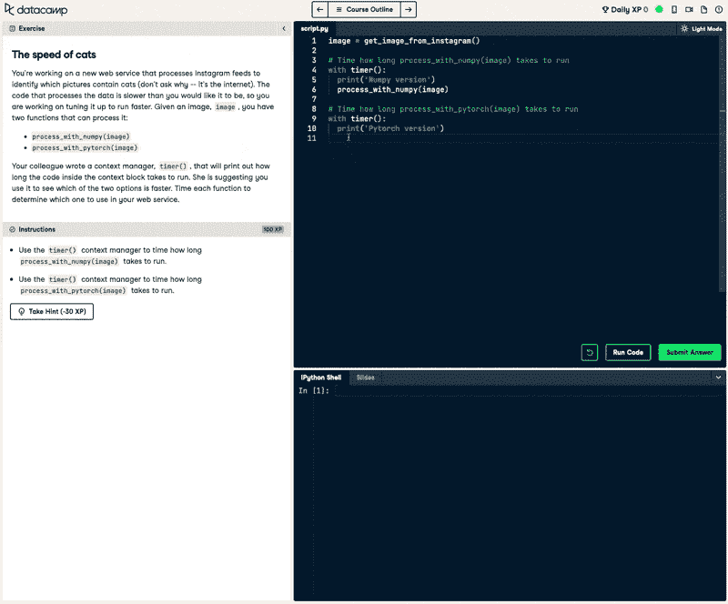
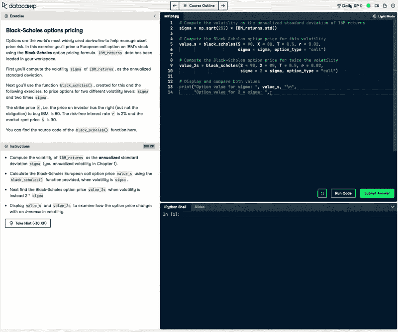
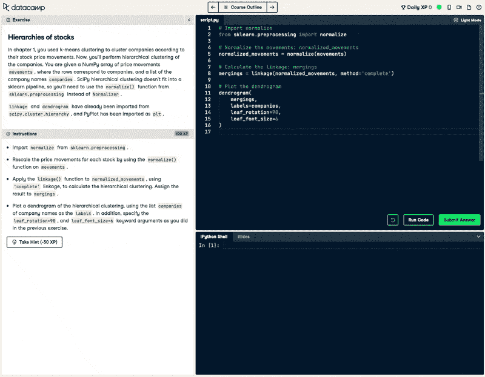

# 你能用 Python 做什么？

> 原文：<https://web.archive.org/web/20221129033335/https://www.datacamp.com/blog/what-can-you-do-with-python-5-ideas-for-experts>

众所周知，Python 是最通用的编程语言，适合每个人以及来自不同教育和专业背景的任何人。无论您是数据科学家、web 或软件开发人员，或者仅仅是技术爱好者，Python 都可以处理许多不同的任务。

作为一种流行的通用编程语言，许多不同的公司都使用 Python，包括 NASA、Spotify、Google 和 JP Morgan。它的多功能性、开源性和简单性使每个人都容易使用。如果你对掌握 Python 后能做什么感到好奇，我们已经仔细研究了一些潜在的项目。

## 掌握 Python 做数据科学可以做什么？

### 1.构建出色的自定义数据可视化和仪表板

Python 中最简单也是最有效的工具之一是它的数据可视化和仪表板库。Python 极大地扩展了可视化数据的可能性。matplotlib、seaborn 和 plotly 等库为您提供了创建健壮、复杂和高度可定制的可视化的能力，可以使任何演示或绘图真正脱颖而出。此外，通过掌握 Dash 包，您将能够构建极其丰富的 dashboard web 应用程序，部署它们并与同事共享，而无需任何成本。

#### 如何开始

*   课程:【Seaborn 数据可视化简介
*   课程:【Matplotlib 数据可视化介绍
*   课程:[Python 中使用 Plotly 的数据可视化介绍](https://web.archive.org/web/20221212135819/https://www.datacamp.com/courses/introduction-to-data-visualization-with-plotly-in-python)
*   课程:[用 Dash 和 Plotly 构建仪表板](https://web.archive.org/web/20221212135819/https://www.datacamp.com/courses/building-dashboards-with-dash-and-plotly)
*   技能轨迹:[用 Python 实现数据可视化](https://web.archive.org/web/20221212135819/https://www.datacamp.com/tracks/data-visualization-with-python)

### 2.自动化重复的数据操作工作流程

许多涉及数据的任务通常是每天或每周重复的一系列重复步骤。供应链预测就是一个很好的例子，分析师通过一系列数据操作步骤和简单的预测技术来进行每周预测。

Python 允许您创建脚本，当结合一些命令行知识时，可以自动运行和调度脚本。此外，通过使用函数，您可以存储通常对数据执行的复杂数据操作任务，并根据您的需要对其稍作修改，而不是从头开始重新创建分析。

#### 如何开始

*   课程:[用 Python 写函数](https://web.archive.org/web/20221212135819/https://www.datacamp.com/courses/writing-functions-in-python)
*   课程:[熊猫数据操作](https://web.archive.org/web/20221212135819/https://www.datacamp.com/courses/data-manipulation-with-pandas)
*   课程:[Python 中数据科学家的软件工程](https://web.archive.org/web/20221212135819/https://app.datacamp.com/learn/courses/software-engineering-for-data-scientists-in-python)
*   职业轨迹: [Python 程序员](https://web.archive.org/web/20221212135819/https://www.datacamp.com/tracks/python-programmer)

### 3.加快财务分析工作流程

Python 是金融和金融科技领域使用最广泛的工具之一。来自世界各地的从业者利用 Python 完成投资组合分析、定量风险管理、信用风险建模、预测等任务。

Python 健壮的财务包提供了一套工具来解决上述问题以及更多问题。此外，通过将自动化与财务任务相结合，您将能够加速任何财务分析工作流。

#### 如何开始

*   课程:[Python 中的投资组合风险管理介绍](https://web.archive.org/web/20221212135819/https://www.datacamp.com/courses/introduction-to-portfolio-risk-management-in-python)
*   课程:[Python 中的量化风险管理](https://web.archive.org/web/20221212135819/https://www.datacamp.com/courses/quantitative-risk-management-in-python)
*   课程:[Python 中的信用风险建模](https://web.archive.org/web/20221212135819/https://www.datacamp.com/courses/credit-risk-modeling-in-python)
*   技能轨迹:[Python 中的应用金融](https://web.archive.org/web/20221212135819/https://www.datacamp.com/tracks/applied-finance-in-python)

### 4.利用机器学习构建智能应用

Python 的主要杀手锏之一是其丰富且功能丰富的机器学习包。Scikit-learn 是业内机器学习的标准包，目前被大多数数据科学家使用。掌握 scikit-learn 和机器学习将允许您建立预测模型，如客户流失模型、电影推荐系统等。

此外，深度学习包(如 Tensorflow、Keras 和 PyTorch)是令人惊叹的机器学习用例(如自动驾驶汽车、智能聊天机器人和其他认知应用)背后的驱动引擎。

#### 如何开始

*   课程:[使用 scikit 的机器学习-学习](https://web.archive.org/web/20221212135819/https://www.datacamp.com/courses/supervised-learning-with-scikit-learn)
*   课程:[Python 中的无监督学习](https://web.archive.org/web/20221212135819/https://www.datacamp.com/courses/unsupervised-learning-in-python)
*   课程:[Python 深度学习入门](https://web.archive.org/web/20221212135819/https://www.datacamp.com/courses/introduction-to-deep-learning-in-python)
*   课程:[用 Python 中的 Keras 进行图像处理](https://web.archive.org/web/20221212135819/https://www.datacamp.com/courses/image-processing-with-keras-in-python)
*   职业轨迹:[使用 Python 的机器学习科学家](https://web.archive.org/web/20221212135819/https://www.datacamp.com/tracks/machine-learning-scientist-with-python)

Python 作为最通用的编程语言而闻名，适合每个人和来自不同教育和专业背景的任何人。无论您是数据科学家、web 或软件开发人员，或者仅仅是技术爱好者，Python 都可以处理许多不同的任务。

作为一种流行的通用编程语言，许多不同的公司都使用 Python，包括 NASA、Spotify、Google 和 JP Morgan。它的多功能性、开源性和简单性使每个人都容易使用。如果你对掌握 Python 后能做什么感到好奇，我们已经仔细研究了一些潜在的项目。

## 掌握 Python 做数据科学可以做什么？

### 1.构建出色的自定义数据可视化和仪表板

Python 中最简单也是最有效的工具之一是它的数据可视化和仪表板库。Python 极大地扩展了可视化数据的可能性。matplotlib、seaborn 和 plotly 等库为您提供了创建健壮、复杂和高度可定制的可视化的能力，可以使任何演示或绘图真正脱颖而出。此外，通过掌握 Dash 包，您将能够构建极其丰富的 dashboard web 应用程序，部署它们并与同事共享，而无需任何成本。

#### 如何开始

*   课程:【Seaborn 数据可视化简介
*   课程:【Matplotlib 数据可视化介绍
*   课程:[Python 中使用 Plotly 的数据可视化介绍](https://web.archive.org/web/20221212135819/https://www.datacamp.com/courses/introduction-to-data-visualization-with-plotly-in-python)
*   课程:[用 Dash 和 Plotly 构建仪表板](https://web.archive.org/web/20221212135819/https://www.datacamp.com/courses/building-dashboards-with-dash-and-plotly)
*   技能轨迹:[用 Python 实现数据可视化](https://web.archive.org/web/20221212135819/https://www.datacamp.com/tracks/data-visualization-with-python)

### 2.自动化重复的数据操作工作流程

许多涉及数据的任务通常是每天或每周重复的一系列重复步骤。供应链预测就是一个很好的例子，分析师通过一系列数据操作步骤和简单的预测技术来进行每周预测。

Python 允许您创建脚本，当结合一些命令行知识时，可以自动运行和调度脚本。此外，通过使用函数，您可以存储通常对数据执行的复杂数据操作任务，并根据您的需要对其稍作修改，而不是从头开始重新创建分析。

#### 如何开始

*   课程:[用 Python 写函数](https://web.archive.org/web/20221212135819/https://www.datacamp.com/courses/writing-functions-in-python)
*   课程:[熊猫数据操作](https://web.archive.org/web/20221212135819/https://www.datacamp.com/courses/data-manipulation-with-pandas)
*   课程:[Python 中数据科学家的软件工程](https://web.archive.org/web/20221212135819/https://app.datacamp.com/learn/courses/software-engineering-for-data-scientists-in-python)
*   职业轨迹: [Python 程序员](https://web.archive.org/web/20221212135819/https://www.datacamp.com/tracks/python-programmer)

### 3.加快财务分析工作流程

Python 是金融和金融科技领域使用最广泛的工具之一。来自世界各地的从业者利用 Python 完成投资组合分析、定量风险管理、信用风险建模、预测等任务。

Python 健壮的财务包提供了一套工具来解决上述问题以及更多问题。此外，通过将自动化与财务任务相结合，您将能够加速任何财务分析工作流。

#### 如何开始

*   课程:[Python 中的投资组合风险管理介绍](https://web.archive.org/web/20221212135819/https://www.datacamp.com/courses/introduction-to-portfolio-risk-management-in-python)
*   课程:[Python 中的量化风险管理](https://web.archive.org/web/20221212135819/https://www.datacamp.com/courses/quantitative-risk-management-in-python)
*   课程:[Python 中的信用风险建模](https://web.archive.org/web/20221212135819/https://www.datacamp.com/courses/credit-risk-modeling-in-python)
*   技能轨迹:[Python 中的应用金融](https://web.archive.org/web/20221212135819/https://www.datacamp.com/tracks/applied-finance-in-python)

### 4.利用机器学习构建智能应用

Python 的主要杀手锏之一是其丰富且功能丰富的机器学习包。Scikit-learn 是业内机器学习的标准包，目前被大多数数据科学家使用。掌握 scikit-learn 和机器学习将允许您建立预测模型，如客户流失模型、电影推荐系统等。

此外，深度学习包(如 Tensorflow、Keras 和 PyTorch)是令人惊叹的机器学习用例(如自动驾驶汽车、智能聊天机器人和其他认知应用)背后的驱动引擎。

#### 如何开始

*   课程:[使用 scikit 的机器学习-学习](https://web.archive.org/web/20221212135819/https://www.datacamp.com/courses/supervised-learning-with-scikit-learn)
*   课程:[Python 中的无监督学习](https://web.archive.org/web/20221212135819/https://www.datacamp.com/courses/unsupervised-learning-in-python)
*   课程:[Python 深度学习入门](https://web.archive.org/web/20221212135819/https://www.datacamp.com/courses/introduction-to-deep-learning-in-python)
*   课程:[用 Python 中的 Keras 进行图像处理](https://web.archive.org/web/20221212135819/https://www.datacamp.com/courses/image-processing-with-keras-in-python)
*   职业轨迹:[使用 Python 的机器学习科学家](https://web.archive.org/web/20221212135819/https://www.datacamp.com/tracks/machine-learning-scientist-with-python)