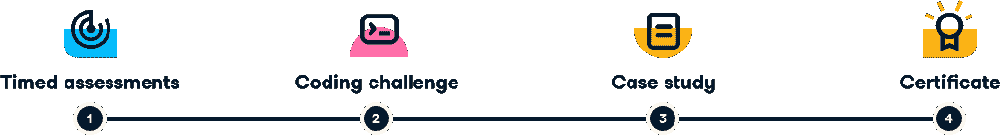

# 什么是数据科学认证？

> 原文：<https://web.archive.org/web/20230101103145/https://www.datacamp.com/blog/what-is-a-data-science-certification>

你可能一直在学习数据科学，从如何开发模型到如何向非技术利益相关者传达见解，不仅仅是为了它的乐趣(尽管，如果你有的话，向你致敬)。你们中的许多人将一直在学习，目标是最终获得一份数据科学工作——一份你一直梦想的高薪、智力投入的工作。要做到这一点，首先，你需要向雇主证明你了解自己的工作——但你该怎么做呢？答案在于获得一个数据科学认证。

数据科学认证是一种认可，它向任何潜在的雇主传达了以下信息:此人的数据科学技能已经过可信方的测试，他们已经确认自己符合一套要求的标准。

## DataCamp 的数据科学认证是如何运作的？

为了说明成为认证数据科学家的过程，以下是 DataCamp 数据科学认证的工作方式:

### 1.定时评估:

我们首先测试您在一系列数据科学主题方面的知识。我们的评估会根据您之前的回答来调整您的技能水平。最后，如果你达到了某个门槛，你就会进入下一阶段。

### 2.编码挑战:

在这个长格式练习中，你将得到三样东西:一个有特定问题的场景，一个相关的数据集，以及以你认为合适的方式回答它的自由。第三件事是这一评估的关键:测试您使用数据科学实现特定目标的能力，因为您在数据科学职业生涯中需要这样做。为了进入下一步，你需要取得正确的结果。不要担心——虽然这个阶段是独立完成的，但你会知道什么时候已经完成了。此外，这个步骤没有时间限制，并且发生在我们的 IDE 中，所以不需要安装。

### 3.案例研究:

最后一个阶段分为两部分:技术演示和非技术演示。在此阶段，您需要与我们的一位数据科学家预约案例研究时间。在案例研究开始前 24 小时，我们会向您发送一组数据进行分析，在案例研究期间，您需要展示您的发现。交流数据见解的能力是成为成功的数据科学家的关键。请注意:我们希望这项工作由你来进行，如果有证据表明其他人已经进行了这项工作，这将导致自动失败。

你可以通过 [DataCamp 的认证白皮书](https://web.archive.org/web/20220525032714/https://assets.datacamp.com/email/other/ds-certification-whitepaper.pdf)了解更多关于这些步骤的细节。

通过这些测试的设计，雇主可以确信，通过 DataCamp 认证的数据科学学习者拥有的技能将使他们成为团队中有价值的一员:在数据科学方面知识丰富，能够在压力下工作，与技术和非技术同事交流他们的发现，并采取主动。

## 报名参加这个数据科学认证项目的前提条件是什么？

没有强制性要求，但是为了确保您准备充分，我们建议您完成以下内容:

*   Python 数据科学家职业轨迹

或者

*   r 数据科学家职业轨迹

和

*   SQL 基础知识

根据 LinkedIn ，准备好获得世界上[最受欢迎的工作之一的认证了吗？](https://web.archive.org/web/20220525032714/https://www.businessinsider.com/most-in-demand-jobs-according-to-linkedin-report-2021-1)

您可以点击[此处](https://web.archive.org/web/20220525032714/https://www.datacamp.com/certification)注册通过 DataCamp 获得认证。

## 了解有关数据科学认证更多信息的其他资源

如果您想了解更多关于获得数据科学认证的信息，我们还制作了许多其他文章，您可能会觉得有用！

[DataCamp 的认证白皮书](https://web.archive.org/web/20220525032714/https://assets.datacamp.com/email/other/ds-certification-whitepaper.pdf)，了解获得认证过程的更多信息。

[DataCamp 的专业数据科学家认证计划](https://web.archive.org/web/20220525032714/https://www.datacamp.com/community/blog/datacamps-professional-data-scientist-certification-program)，了解我们推出认证的原因。

[如何获得数据科学认证？](https://web.archive.org/web/20220525032714/https://www.datacamp.com/community/blog/how-can-i-get-certified)，了解获得数据科学认证的所有选项的完整指南。

[DataCamp 的认证如何帮助学员找到他们梦想中的工作](https://web.archive.org/web/20220525032714/https://www.datacamp.com/community/blog/certified-learners-landing-dream-jobs)这是一个关于两位专业人士的案例研究，他们在通过 data camp 认证后能够找到工作。

[五大在线数据科学认证](https://web.archive.org/web/20220525032714/https://www.datacamp.com/community/blog/top-5-data-science-certifications)我们最喜欢的五大在线数据科学认证。

[通过 DataCamp](https://web.archive.org/web/20220525032714/https://www.datacamp.com/community/blog/what-to-do-after-getting-certified-as-a-data-scientist) 成为认证数据科学家后要做什么，获取认证后要做什么的指南。

[Tableau:从学生到认证](https://web.archive.org/web/20220525032714/https://www.datacamp.com/community/blog/tableau-student-to-certification)和 [Tableau 桌面专家认证:了解如何使用 Tableau 并通过考试](https://web.archive.org/web/20220525032714/https://www.datacamp.com/community/blog/Tableau-desktop-specialist-certification)了解如何在 BI 工具中获得认证。

