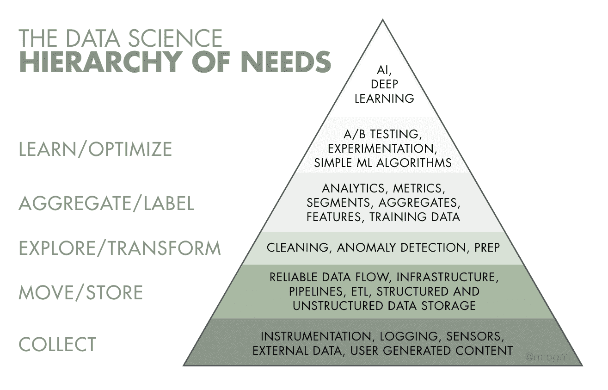
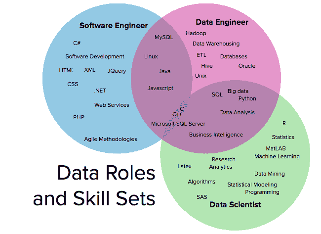

# 什么是数据工程？

> 原文：<https://web.archive.org/web/20230101103026/https://www.datacamp.com/blog/what-is-data-engineering>

## 介绍

数据无处不在。近年来，随着连接设备数量的增加及其使用范围的扩大，世界已经产生了大量传统方法无法处理的数据。

根据 Statista 的数据，截至 2021 年，有[238 亿台设备连接到互联网](https://web.archive.org/web/20220705010745/https://www.statista.com/statistics/1101442/iot-number-of-connected-devices-worldwide/)，其中 58%是物联网设备(智能家居设备、联网自动驾驶汽车、工业设备等)。)而剩下的 42%是非物联网设备(笔记本电脑、智能手机等。).这意味着现在数据可以来自不同的来源。其中一些是:

1.  **用户活动:**任何用户行为都会产生数据，甚至反映我们在哪里使用移动应用程序以及使用频率的数据都是有价值的。包含此类信息的每一份数据都需要保存并分发到应用程序的数据中心。
2.  **“物联网”设备:**这些设备会产生海量的信息，比如在很多不同的地点产生的传感器数据。所有这些数据都需要被检索并发送到一个数据池进行进一步分析。
3.  **程序日志:**当今的计算机应用程序由许多组件组成，所有这些组件都产生程序日志。这些日志被发送到数据工程管道进行进一步分析。

世界上产生的所有不同的结构化数据都需要交付给软件结构中的其他组件，或者由业务分析师和数据科学家进行可视化和解释。然而，这种交付并不是一项简单的任务。关于如何交付数据，有一些关键要求:

1.  数据需要以标准化的结构交付
2.  数据不应出现任何冲突
3.  可能需要消除数据重复
4.  数据需要是可靠的
5.  数据传送必须以最小的延迟完成

因此，这种信息的传递是一个复杂的过程，如果执行不当，可能会产生很大的问题，尤其是对于大中型公司而言。这就是数据工程师发挥作用的地方。

在本文中，您将学习数据工程的基础知识，包括:

1.  什么是数据工程，为什么要确保稳健的数据管道
2.  数据科学与数据工程的区别
3.  数据工程日益流行背后的原因
4.  优秀数据工程师的技能
5.  DataCamp 如何帮助你成为数据工程师

## 数据工程师的职责是什么？

简而言之，数据工程师:

1.  旨在让数据科学家和商业智能工程师(或任何与数据打交道的人)能够轻松访问和使用数据
2.  优化公司的大数据系统架构
3.  设计和配置数据库
4.  与商业智能工程师、数据科学家和数据分析师团队协作
5.  为了执行所有这些任务，数据工程师首先需要建立 ETL 管道。

## ETL 管道

ETL 管道以固定的时间间隔接收复杂的数据，并对其进行处理，目的是以可用的形式存储数据。建立和维护这些管道是数据工程师的责任。

有 3 种类型的 ETL 管道:

1.  由数据源创建的大量数据以不同的格式收集。
2.  **转换**由于数据以不同的格式出现，并且由于其来源不一致，数据被处理以变得尽可能标准化。这为后续步骤增加了数据的可发现性和可用性。
3.  **Load** 一旦数据处于可发现和可用的格式，它通常会存储在数据仓库中。这使得数据随时可用于进一步分析。

## 数据仓库

数据仓库是存储标准化数据的地方。它们针对过滤和读取大量数据进行了优化。在现代数据仓库中，结构化和非结构化数据都可以存储，因为存储无法分类的数据(如照片和视频)也很重要。

## 数据工程 vs 数据科学

数据工程师和数据科学家之间的角色差异非常重要。一方面，数据科学家在公司中有着重要的作用，因为他们有助于数据驱动的决策。然而，数据科学家的成功取决于他们拥有的数据。

另一方面，数据工程师是设计系统的人，这些系统以有组织和一致的方式向数据科学家提供数据。一旦数据工程师为他们提供了可用的信息，数据科学家就试图使用数据工程师提供的格式在数据中找到模式以得出结论。

数据工程师和数据科学家显然密切合作。我们可以认为这是一场足球比赛。在足球中，是教练制定了创造进球机会的策略，是教练把球员安排在特定的位置上。在这种情况下，教练是数据工程师，所以我们可以认为球是数据，得分的球员是数据科学家。团队的其余部分是基础设施。

## 为什么数据工程越来越受欢迎？

根据在 [Burning Glass Nova](https://web.archive.org/web/20220705010745/https://www.burning-glass.com/products/nova/) 平台上进行的研究，2019 年“数据工程师”的职位招聘增加了 88.3%。根据这项研究，自 2016 年以来，对数据工程师的需求一直在上升。另一个有趣的信息是，数据工程师的职位空缺数量几乎是数据科学家的 5 倍。数据工程师的工资也比数据科学家的工资高 20-30%。

如上所述，数据科学家是数据处理链中的最后一环。他们需要由数据工程师处理数据，以便完成工作。随着数据源和数据类型的增加，对数据工程师的需求也在增加。出于这个原因，企业最近开始加大对数据提取和分发的投资。

在图 4.1 中，金字塔图显示了数据科学需求的层次结构。在这个层级中，分配给数据工程师的任务位于金字塔的底部，这解释了数据工程师对公司的重要性。

Figure 4.1: The data science hierarchy of needs.

[Source: hackernoon](https://web.archive.org/web/20220705010745/https://medium.com/hackernoon/the-ai-hierarchy-of-needs-18f111fcc007)

## 一个数据工程师需要具备哪些技能？

数据工程师的技能通常与软件工程师和数据科学家的技能交织在一起，如图 5.1 所示。

 Figure 5.1: Data roles and skill sets

[Source: RyanSwanstrom](https://web.archive.org/web/20220705010745/https://ryanswanstrom.com/2016/11/28/data-scientists-data-engineers-software-engineers-the-difference-according-to-linkedin/)

## 数据工程师的角色更接近软件工程师还是数据科学家？

一组数据工程师以前的职业如图 5.2 所示。根据这个数字，他们中超过 40%的人有软件工程背景。这不仅意味着数据工程和软件工程比我们最初想象的要紧密得多，而且意味着现在的软件工程师比其他任何领域都更有可能转向数据工程。

 Figure 5.2: Data engineers by prior role (top 10).

[Source: stitchdata](https://web.archive.org/web/20220705010745/https://www.stitchdata.com/resources/the-state-of-data-engineering/)

在 DataCamp，我们认为以下是优秀数据工程师的技能:

1.  **软件工程背景**数据工程师需要有软件工程背景，因为他们需要用面向对象编程、数据结构和算法的知识来应对数据工程的挑战。数据工程师必须精通 Python、Scala 或 Java。
2.  **工具**数据工程师需要熟悉像 Airflow、Apache 或 Kafka 这样的数据工程工具。
3.  数据库技术一名数据工程师应该了解多种数据库。
4.  **云技术**数据工程师应该习惯使用多种云平台，如亚马逊网络服务、谷歌云平台和微软 Azure。他们还需要具备云架构和 DevOps 工具方面的经验，因为他们负责系统数据流部分的自动化。

## 如何学习数据工程

想要在数据工程领域有[的提升，可以从完成以下推荐的 DataCamp 课程开始。通过完成这些课程，你将有可能成为数据工程领域更适合实习或工作岗位的候选人。](https://web.archive.org/web/20220705010745/https://www.datacamp.com/data-courses/data-engineering-courses)

1.  [Python 简介](https://web.archive.org/web/20220705010745/https://www.datacamp.com/courses/intro-to-python-for-data-science)
2.  [中级 Python](https://web.archive.org/web/20220705010745/https://www.datacamp.com/courses/intermediate-python)
3.  [SQL 关系数据库简介](https://web.archive.org/web/20220705010745/https://www.datacamp.com/courses/introduction-to-relational-databases-in-sql)
4.  [Scala 简介](https://web.archive.org/web/20220705010745/https://www.datacamp.com/courses/introduction-to-scala)
5.  [数据工程介绍](https://web.archive.org/web/20220705010745/https://www.datacamp.com/courses/introduction-to-data-engineering)
6.  [Python 中的气流介绍](https://web.archive.org/web/20220705010745/https://www.datacamp.com/courses/introduction-to-airflow-in-python)
7.  [AWS 云概念](https://web.archive.org/web/20220705010745/https://www.datacamp.com/courses/aws-cloud-concepts)
8.  [用 Python 构建数据工程管道](https://web.archive.org/web/20220705010745/https://www.datacamp.com/courses/building-data-engineering-pipelines-in-python)
9.  [NoSQL 概念](https://web.archive.org/web/20220705010745/https://www.datacamp.com/courses/nosql-concepts)
10.  [Python 中的 ETL](https://web.archive.org/web/20220705010745/https://www.datacamp.com/courses/etl-in-python)
11.  [流概念](https://web.archive.org/web/20220705010745/https://www.datacamp.com/courses/streaming-concepts)
12.  [通过 AWS Kinesis 和 Lambda 传输数据](https://web.archive.org/web/20220705010745/https://www.datacamp.com/courses/streaming-data-with-aws-kinesis-and-lambda)