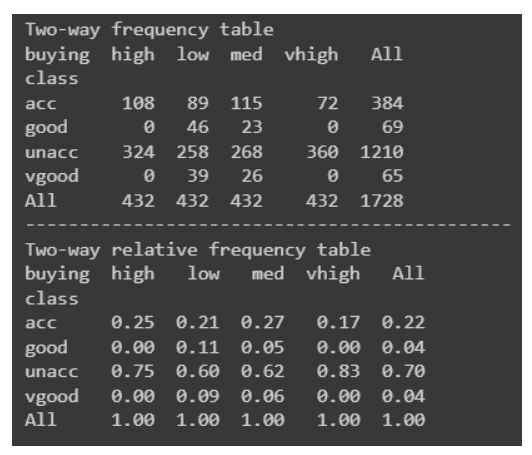
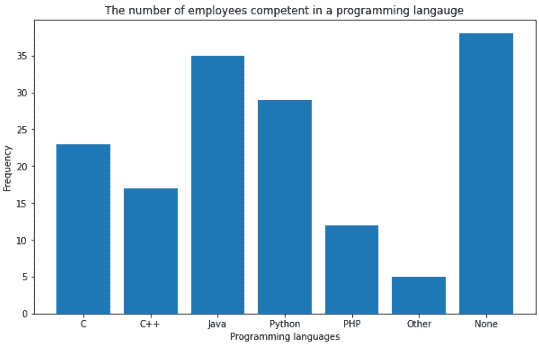
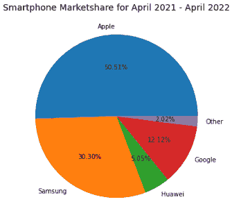
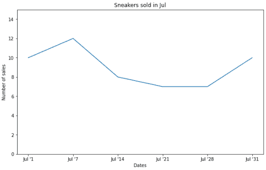
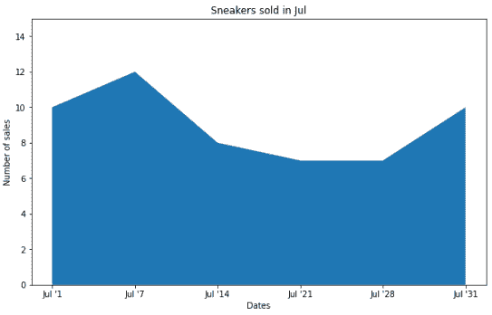
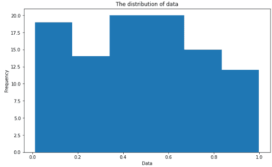
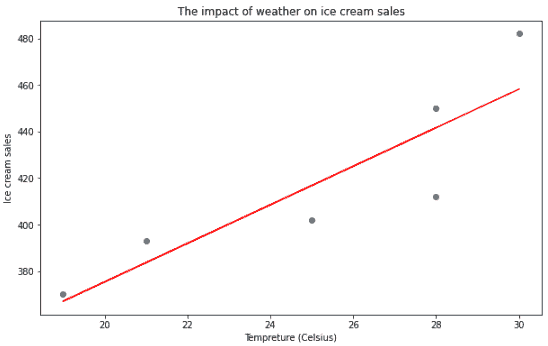
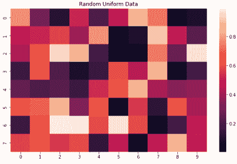
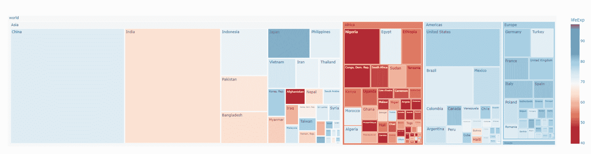

# 什么是数据可视化？数据科学家指南

> 原文：<https://web.archive.org/web/20230101102924/https://www.datacamp.com/blog/what-is-data-visualization-a-guide-for-data-scientists>


据估计，每天会产生 25 万亿字节的数据[来源: [CloudTweaks](https://web.archive.org/web/20220715002438/https://cloudtweaks.com/2015/03/how-much-data-is-produced-every-day/#:~:text=The%20amount%20of%20data%20is,a%20staggering%2018%20zeros!).) ]。如果你在这个数字上遇到困难，不要气馁——你并不孤单。客观地看，十亿是 109，一万亿是 1018。换句话说，我们生成的数据量正以指数速度增长。

组织和个人利用数据来确定问题的原因并确定可行的步骤。然而，随着数据量的不断增长，理解所有这些变得越来越困难。我们与生俱来的天性就是寻找模式，寻找结构。这是我们储存信息和学习新见解的方式。当传入的数据没有以视觉上令人愉快的方式呈现时，看到这些模式并找到结构可能是困难的，或者在某些情况下是不可能的。

在本文中，我们将看看如何用数据可视化解决上述问题。我们还将介绍什么是数据可视化、为什么它很重要、培养数据可视化技能的技巧、常用图表以及可以用来简化数据可视化过程的工具。

## 什么是数据可视化？

数据可视化可以描述为用图形表示数据。它是将数据转化为视觉内容的行为，可以使用图表、绘图、动画、信息图等来完成。其背后的想法是让我们(人类)更容易识别数据中的趋势、异常值和模式。数据专业人员定期利用数据可视化来总结数据中的关键见解，并将这些信息反馈给适当的利益相关方。

例如，数据专家可以为管理人员创建数据可视化，然后管理人员利用这些可视化来规划组织结构。另一个例子是，数据科学家使用可视化来揭示数据的底层结构，以便更好地理解他们的数据。

鉴于上述数据可视化的定义目的，我们可以从什么是数据可视化中获得两个重要的见解:

1)使数据可访问的方法:使数据可访问的最好方法是保持简单。这里的“简单”一词需要放在上下文中:对一个十岁孩子来说简单易懂的东西对一个博士来说可能不一样。因此，数据可视化是一种用于使数据可以被任何人访问的技术。

2)一种沟通方式:这种外卖是第一种的延伸。为了有效地交流，房间里的每个人都必须说同一种语言。不管你是独立完成一项任务还是与团队合作，相对于那些可能看到可视化的人来说，可视化都应该获得有趣的见解。CEO 可能更喜欢查看提供可操作步骤的见解，而机器学习团队可能更喜欢查看他们的模型如何执行的见解。

简而言之，数据可视化是一种用于使识别数据中的模式或趋势变得更容易的技术。但是为什么这对数据科学家来说如此重要呢？我们将在下一节回答这个问题。

## 为什么数据可视化对数据科学家如此重要？

据[维基百科](https://web.archive.org/web/20220715002438/https://en.wikipedia.org/wiki/Data_science)介绍，数据科学是一个跨学科的领域，它使用科学的方法、流程、算法和系统从嘈杂的、结构化的和非结构化的数据中提取知识和见解。然而，数据科学家面临的挑战是，面对原始数据时，并不总是能够将点连接起来；这就是数据可视化极其有价值的地方。让我们更深入地探讨为什么数据可视化对数据科学家来说是一个名副其实的宝藏。

### 发现和学习

数据科学家需要很好地理解他们使用的数据。数据可视化使数据科学家能够展示其数据中最具信息性的方面，使他们(和其他人)能够快速轻松地掌握数据中发生的事情。例如，识别以表格格式表示的数据集中的趋势要比直观地看到它复杂得多。我们将在[用于数据可视化的常见图表](#common-graphs-used-for-data-visualization)一节中对此进行更多讨论。

### 讲故事

几个世纪以来，故事一直被用来分享信息。故事之所以如此引人注目，是因为它们与观众建立了情感联系。这种联系可以让观众更深入地了解他人的经历，使信息更令人难忘。数据可视化是一种讲故事的形式:它帮助数据科学家理解他们的数据，并以易于理解的格式与他人分享。

### 效率

毫无疑问，洞察力可以从数据库中获得(在某些情况下)，但这一努力需要极大的关注，并且是一笔巨大的业务支出。在这种情况下使用数据可视化要有效得多。例如，如果目标是识别所有在 2021 年遭受损失的公司，使用红色突出显示所有利润小于零的公司，使用绿色突出显示大于零的公司会更容易。破产的公司甚至保持中立。这种技术比手动解析数据库来标记单个公司要有效得多。

### 美学

虽然原始数据可能会提供信息，但它很少在视觉上令人愉悦或引人入胜。数据可视化是一种技术，用于获取信息丰富但枯燥的数据，并将其转化为美丽、深刻的知识。让数据在视觉上更具吸引力符合我们主要是视觉生物的本性。换句话说，当信息刺激我们的视觉感官时，我们处理信息的速度要快得多。

## 数据可视化工具

数据专家，如数据科学家和数据分析师，通常会利用数据可视化工具，因为这有助于他们更有效地工作和交流他们的发现。

这些工具可以分为两类:1)无代码的和 2)基于代码的。让我们来看看每个类别中的一些流行工具。

### 无代码工具

不是你组织中的每个人都精通技术。然而，缺乏编程能力不应该阻止你从数据中获得洞察力。你可能缺乏编程能力，但仍然具备[数据素养](https://web.archive.org/web/20220715002438/https://www.datacamp.com/blog/the-complete-guide-to-data-literacy)——能够读、写、交流和推理数据以做出更好的数据驱动决策的人。

因此，对于没有编程知识的人来说，无代码工具是一种容易使用的解决方案(尽管有编程技能的人仍然会选择使用它们)。更正式的说法是:无代码工具是图形用户界面，具有运行本地脚本来处理和扩充数据的能力。

一些无代码工具的例子包括:

#### 功率 BI

Power BI 是一个非常流行的微软数据可视化和商业智能解决方案。它是世界上最受欢迎的商业智能工具之一，用于报告、自助服务分析和预测分析。这一平台服务使您能够轻松快速地清理、分析并开始发现对组织数据的洞察力。

如果你对学习 Power BI 感兴趣，可以考虑从 Datacamp 的 [Power BI 基础](https://web.archive.org/web/20220715002438/https://www.datacamp.com/tracks/power-bi-fundamentals)技能赛道开始。

#### （舞台上由人扮的）静态画面

Tableau 也是世界上最流行的商业智能工具之一。其简单的拖放功能使任何人都可以使用交互式数据可视化轻松地开始了解其组织的数据。

Datacamp 的[Tableau Fundamentals](https://web.archive.org/web/20220715002438/https://www.datacamp.com/tracks/tableau-fundamentals)skill track 是开始学习 Tableau 的好方法。

### 代码可视化

如果你更精通技术，你可能更喜欢使用编程语言来可视化你的数据。由于支持数据处理的各种包，数据产量的增加促进了 Python 和 R 的流行。

让我们来看看其中的一些包。

#### Python 包

Python 是一种高级的、解释的、通用的编程语言【来源:[维基百科](https://web.archive.org/web/20220715002438/https://en.wikipedia.org/wiki/Python_(programming_language))】。它为数据可视化提供了几个很棒的图形包，例如:

*   Matplotlib
*   希伯恩
*   Plotly
*   ggplot
*   散景
*   Geoplotlib

使用 Python 的[数据可视化](https://web.archive.org/web/20220715002438/https://www.datacamp.com/tracks/data-visualization-with-python)技能课程是一个很好的课程序列，使用 Python 最受欢迎和最强大的数据可视化库来增强您的数据科学技能。

#### r 包

r 是一种统计计算和图形的编程语言【来源:[维基百科](https://web.archive.org/web/20220715002438/https://en.wikipedia.org/wiki/R_(programming_language))】。这是一个很好的数据分析工具，因为你可以使用它的各种包创建几乎任何类型的图表。流行的 R 数据可视化包包括:

*   ggplot2
*   格子木架
*   高价租船合同
*   传单
*   红啤酒
*   Plotly

查看 R 技能跟踪中的[数据可视化与 R](https://web.archive.org/web/20220715002438/https://www.datacamp.com/tracks/data-visualization-with-r) 和[交互式数据可视化，提升您的 R 编程语言可视化技能。](https://web.archive.org/web/20220715002438/https://www.datacamp.com/tracks/interactive-data-visualization-in-r)

## 用于数据可视化的常见图表

我们已经确定，数据可视化是一种有效的数据呈现和交流方式。在本节中，我们将介绍如何通过使用 Python 和 Matplotlib python 包进行数据可视化来创建一些常见类型的图表和图形，这是大多数数据可视化任务的有效起点。我们还将分享每个图表的一些用例。

注意:参见此 [Datacamp 工作区](https://web.archive.org/web/20220715002438/https://app.datacamp.com/workspace/w/e7ef11a3-a7aa-4d71-887e-0ac29699d3ba)以获取完整代码。

### 频率表

频率表是表示一个事件或值发生的次数的好方法。我们通常使用它们来查找数据的描述性统计数据。例如，我们可能希望了解某个特性对最终决策的影响。

让我们创建一个示例频率表。我们将使用来自 UCI 机器学习知识库的[汽车评估数据集](https://web.archive.org/web/20220715002438/https://archive.ics.uci.edu/ml/datasets/car+evaluation)和[熊猫](https://web.archive.org/web/20220715002438/https://pandas.pydata.org/docs/)来构建我们的频率表。

```py
import pandas as pd

"""
source: https://heartbeat.comet.ml/exploratory-data-analysis-eda-for-categorical-data-870b37a79b65
"""

def frequency_table(data:pd.DataFrame, col:str, column:str):
    freq_table = pd.crosstab(index=data[col],
                            columns=data[column],         
                            margins=True)
    rel_table = round(freq_table/freq_table.loc["All"], 2)
    return freq_table, rel_table

buying_freq, buying_rel = frequency_table(car_data, "class", "buying")

print("Two-way frequency table")
print(buying_freq)
print("---" * 15)
print("Two-way relative frequency table")
print(buying_rel)
```



### 条形图

条形图是最简单有效的数据可视化工具之一。它通常用于比较类别之间的差异。例如，我们可以使用条形图来显示欺诈性案例与非欺诈性案例的数量。条形图的另一个用例可能是可视化一部电影的每个星级的频率。

下面是我们如何用 Python 创建一个条形图:

```py
"""
Starter code from tutorials point
see: https://bit.ly/3x9Z6HU
"""
import matplotlib.pyplot as plt

# Dataset creation.
programming_languages = ['C', 'C++', 'Java', 'Python', 'PHP', "Other", "None"]
employees_frequency = [23, 17, 35, 29, 12, 5, 38]

# Bar graph creation.
fig, ax = plt.subplots(figsize=(10, 5))
plt.bar(programming_languages, employees_frequency)
plt.title("The number of employees competent in a programming langauge")
plt.xlabel("Programming languages")
plt.ylabel("Frequency")
plt.show()
```



### 饼图

饼图是另一种简单有效的可视化工具。它们通常用于可视化和比较整体的各个部分。例如，饼图的一个很好的用例是代表智能手机的市场份额。让我们用 Python 来实现它。

```py
"""
Example to demonstrate how a pie chart can be used to represent the market
share for smartphones.
Note: These are not real figures. They were created for demonstration purposes.
"""
import numpy as np
from matplotlib import pyplot as plt

# Dataset creation.

smartphones = ["Apple", "Samsung", "Huawei", "Google", "Other"]
market_share = [50, 30, 5, 12, 2]

# Pie chart creation
fig, ax = plt.subplots(figsize=(10, 6))
plt.pie(market_share,
        labels = smartphones,
        autopct='%1.2f%%')
plt.title("Smartphone Marketshare for April 2021 - April 2022",
          fontsize=14)
plt.show()
```



### 折线图和面积图

折线图非常适合可视化一段时间内数据的趋势或进度。例如，我们可以用一个折线图来显示七月份运动鞋的销售量。

```py
import matplotlib.pyplot as plt

# Data creation.
sneakers_sold = [10, 12, 8, 7, 7, 10]
dates = ["Jul '1", "Jul '7", "Jul '14", "Jul '21", "Jul '28", "Jul '31"]

# Line graph creation
fig, ax = plt.subplots(figsize=(10, 6))
plt.plot(dates, sneakers_sold)
plt.title("Sneakers sold in Jul")
plt.ylim(0, 15) # Change the range of y-axis.
plt.xlabel("Dates")
plt.ylabel("Number of sales")
plt.show()
```



面积图是折线图的扩展，但它们的不同之处在于，线下方的区域用颜色或图案填充。

下面是上面绘制在面积图中的完全相同的数据:

```py
# Area chart creation
fig, ax = plt.subplots(figsize=(10, 6))
plt.fill_between(dates, sneakers_sold)
plt.title("Sneakers sold in Jul")
plt.ylim(0, 15) # Change the range of y-axis.
plt.xlabel("Dates")
plt.ylabel("Number of sales")
plt.show()
```



显示多个变量随时间变化的堆积面积图也很常见。例如，我们可以用堆积面积图来显示 7 月份销售的运动鞋品牌，而不是总销售额。

```py
# Data creation.
sneakers_sold = [[3, 4, 2, 4, 3, 1], [3, 2, 6, 1, 3, 5], [4, 6, 0, 2, 1, 4]]
dates = ["Jul '1", "Jul '7", "Jul '14", "Jul '21", "Jul '28", "Jul '31"]

# Multiple area chart creation
fig, ax = plt.subplots(figsize=(10, 6))
plt.stackplot(dates, sneakers_sold, labels=["Nike", "Adidas", "Puma"])
plt.title("Sneakers sold in Jul")
plt.ylim(0, 15) # Change the range of y-axis.
plt.xlabel("Dates")
plt.ylabel("Number of sales")
plt.legend()
plt.show()
```


每幅图都以不同的方式显示了完全相同的数据。

### 直方图

直方图用于表示数值变量的分布。

```py
import numpy as np
import matplotlib.pyplot as plt

data = np.random.sample(size=100) # Graph will change with each run

fig, ax = plt.subplots(figsize=(10, 6))
plt.hist(data, bins=6)
plt.title("The distribution of data")
plt.xlabel("Data")
plt.ylabel("Frequency")
plt.show()
```



### 散点图

散点图用于显示两个不同变量之间的关系。添加一条最佳拟合线来揭示数据的总体方向也很常见。散点图的一个示例用例可能是表示温度如何影响冰淇淋销售量。

```py
import numpy as np
import matplotlib.pyplot as plt

# Data creation.
temperature = np.array([30, 21, 19, 25, 28, 28]) # Degree's celsius
ice_cream_sales = np.array([482, 393, 370, 402, 412, 450])

# Calculate the line of best fit
X_reshape = temperature.reshape(temperature.shape[0], 1)
X_reshape = np.append(X_reshape, np.ones((temperature.shape[0], 1)), axis=1)
y_reshaped = ice_cream_sales.reshape(ice_cream_sales.shape[0], 1)

theta = np.linalg.inv(X_reshape.T.dot(X_reshape)).dot(X_reshape.T).dot(y_reshaped)
best_fit = X_reshape.dot(theta)

# Create and plot scatter chart
fig, ax = plt.subplots(figsize=(10, 6))
plt.scatter(temperature, ice_cream_sales)
plt.plot(temperature, best_fit, color="red")
plt.title("The impact of weather on ice cream sales")
plt.xlabel("Temperature (Celsius)")
plt.ylabel("Ice cream sales")
plt.show()
```



### 热图

热图使用颜色编码方案来描述两个项目之间的强度。热图的一个使用案例可能是说明天气预报(即红色区域显示将有暴雨)。你也可以使用热图来表示网络流量和几乎任何三维数据。

为了演示如何用 Python 创建热图，我们将使用另一个名为 [Seaborn](https://web.archive.org/web/20220715002438/https://seaborn.pydata.org/) 的库，这是一个基于 Matplotlib 的高级数据可视化库。

```py
import numpy as np
import seaborn as sns
import matplotlib.pyplot as plt

data = np.random.rand(8, 10) # Graph will change with each run

fig, ax = plt.subplots(figsize=(10, 6))
sns.heatmap(data)
plt.title("Random Uniform Data")
plt.show()
```



### 树图

树状图用于表示具有嵌套矩形的分层数据。它们非常适合可视化大量类别之间的部分到整体的关系，例如在销售数据中。

为了帮助我们用 Python 构建树形图，我们将利用另一个名为 Plotly 的库，它用于制作交互式图形。

```py
"""
Source: https://plotly.com/python/treemaps/
"""

import plotly.express as px
import numpy as np

df = px.data.gapminder().query("year == 2007")
fig = px.treemap(df, path=[px.Constant("world"), 'continent', 'country'], values='pop',
                  color='lifeExp', hover_data=['iso_alpha'],
                  color_continuous_scale='RdBu',
                  color_continuous_midpoint=np.average(df['lifeExp'], weights=df['pop']))
fig.update_layout(margin = dict(t=50, l=25, r=25, b=25))
fig.show()
```



## 有效数据可视化的 3 个技巧

数据可视化是一门艺术。发展你的技能需要时间和练习。这里有三个建议可以让你朝着正确的方向前进:

### 技巧 1:问一个具体的问题

创建真正有洞察力的数据可视化的第一步是有一个你想用数据回答的特定问题。如果你看到一个可视化的扭曲的关键信息，这很可能是跳过了这一步，或者创作者试图一次回答多个问题。为了避免矫枉过正，确保你已经清楚地表达了要用你的可视化回答的具体问题(例如，特征 A 和 B 之间有关系吗？).

### 技巧 2:选择合适的可视化

一个有效的可视化应该实现两个目标:1)它应该清楚地揭示所提问题的答案；2)它应该易于让观众快速理解所呈现的内容。满足这些标准的一个关键因素是确保你选择了合适的图表来代表你想要揭示的东西。

### 技巧 3:突出最重要的信息

人类非常擅长识别模式，但我们的回忆能力却并非如此。例如，你有没有见过一个人看起来很面熟，但你完全不知道他叫什么名字？由于我们的设计，这样的场景发生在我们所有人身上。我们更容易记住某人的脸，因为这与我们识别模式的能力相关，而他们的名字需要我们回忆信息。

“人类有一种随处可见模式的倾向。这在做决定和判断以及获取知识时很重要；我们往往对混乱和机遇感到不安。”基洛维奇，1991 年。

总而言之，有效的视觉化依赖于我们识别模式的自然倾向。使用颜色、形状、大小等是一种非常有效的技术，可以强调你想要展示的最重要的信息。数据可视化是一门艺术；做好这件事需要问一个特定的问题，选择合适的可视化方式，突出最重要的信息。如果你的第一次尝试不是最棒的，不要太沮丧；提高你的技能需要时间和练习，DataCamp 的[广泛的数据可视化课程](https://web.archive.org/web/20220715002438/https://www.datacamp.com/courses-all?topic=data+visualization)是帮助你成为数据可视化大师的绝佳资源。