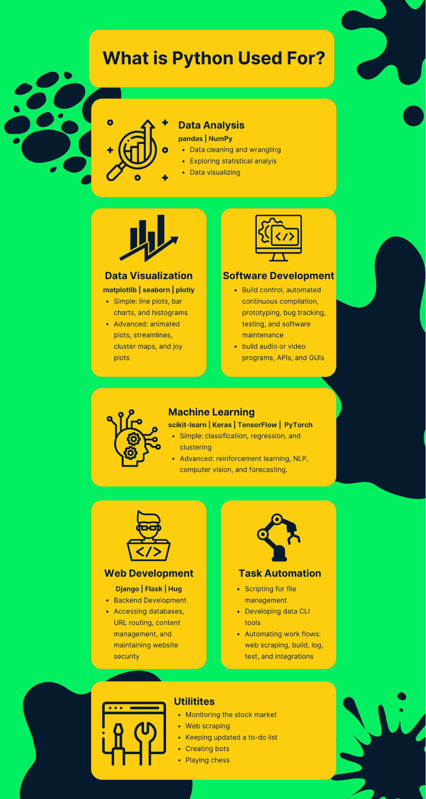

# Python 是用来做什么的？初学者指南

> 原文：<https://web.archive.org/web/20221129033335/https://www.datacamp.com/blog/what-is-python-used-for>

Python 是目前(截至 2022 年 6 月)[世界上最流行的编程语言](https://web.archive.org/web/20221108191604/https://www.tiobe.com/tiobe-index)，其用户群也在不断增长。但是 Python 是用来做什么的呢？许多行业和公司将 Python 用于各种各样的任务，例如分析数据、构建机器学习模型、创建网站或编写软件。

在本文中，我们将探索 Python 的主要用途，Python 如此受欢迎的原因，为什么应该学习它，以及需要多长时间。我们还探讨了哪些工作通常需要 Python 编程技能。

## Python 是什么？

从技术上讲，Python 是一种开源的、面向对象的、高级的、通用的编程语言。由于这个定义可能看起来令人不知所措，让我们分别看一下每个特征，以了解它们各自的含义:

*   开源:它是免费的，可以进一步改进，比如添加有用的功能或修复错误
*   面向对象:不是基于函数，而是基于具有定义的属性和方法的对象
*   高级:对人类友好而不是对计算机友好
*   通用:可用于创建任何类型的程序

Python 广泛应用于数据科学、数据分析、机器学习、数据工程、web 开发、软件开发等领域。

要了解更多关于什么是 Python 的知识，你可以在我们的博客文章中找到这种流行语言的基础知识。

## Python 为什么这么受欢迎？

现在让我们来讨论一下使 Python 成为如此强大和广泛使用的编程语言的主要优势:

*   它有一个直观的语法，类似于自然的英语，因此很容易学习，特别是对于那些刚刚进入编程世界的人
*   由于其人性化的语法，它很容易编写、阅读和调试
*   它提供了一个**广泛的标准库**和一个广泛的有良好文档记录和全面的**附加库和模块**
*   对个人和企业来说都是免费的
*   得益于其庞大的支持社区，Python 不断得到开发、改进和扩展
*   它可以集成到任何项目中，并用于解决高级问题
*   作为一种通用语言，它在许多领域有各种各样的应用

## 为什么要学 Python？

了解和使用 Python 的好处清楚地表明了为什么它是学习的最佳选择，尤其是作为您的第一门编程语言。但是，你个人为什么会决定去学呢？以下是一些更能说服你的理由:

*   它可以为你在许多领域开启新的职业生涯打开无数的机会，我们很快就会详细了解到底是哪些领域。
*   它可以成为你当前工作的一个方便的辅助工具。例如，使用 Python，您可以自动执行许多单调的任务，如一次重命名许多文件，将文件转换为另一种格式，或者创建和更新工作报告。
*   即使在申请不需要直接了解 Python 的工作职位时，它也能让你脱颖而出(例如，你可以在这里查看一个业务分析师工作描述模板的例子)。
*   Python 相关的职业目前收入很高，需求量很大，而且这种趋势在未来只会越来越大。如果你需要证明，就拿[中提到的任何工作来说吧，哪些工作需要 Python？查看](https://web.archive.org/web/20221108191604/https://docs.google.com/document/d/1XtbF34WNfkCs2vIBHbVg5yzjom4I6oVtdaeyT52hr0k/edit#heading=h.xt0u8tk1tnvy)[上的平均工资和](https://web.archive.org/web/20221108191604/https://www.indeed.com/) [LinkedIn 上的职位空缺。](https://web.archive.org/web/20221108191604/https://www.linkedin.com/)
*   最后，能够使用 Python 你可以为自己做很多有益或有趣的事情，比如抓取网站或创建机器人。我们将在本文中进一步讨论其他一些想法。

## 学习 Python 需要多长时间

[学习 Python 需要多长时间](https://web.archive.org/web/20221108191604/https://www.datacamp.com/learn/python)？好了，在这里，一切都取决于你之前的编码经验(或者没有，完全 ok！)，你的目标，你的动力，以及你准备投入多少时间在学习上。

好消息是，即使你是一个完全的初学者，你也可以在短短 15 个小时内[学习 Python](https://web.archive.org/web/20221108191604/https://www.datacamp.com/learn/python) 的基础知识。

如果你想[学习数据科学的 Python 基础](https://web.archive.org/web/20221108191604/https://www.datacamp.com/courses/introduction-to-data-science-in-python)，或者[学习如何在统计学中使用它](https://web.archive.org/web/20221108191604/https://www.datacamp.com/courses/introduction-to-statistics-in-python)，或者你已经知道 Python 但是想[掌握高效地编写代码](https://web.archive.org/web/20221108191604/https://www.datacamp.com/courses/writing-efficient-python-code)，你只需要大约 4 个小时。

相反，如果你需要一种更加结构化和多面化的学习方法来[成为一名 Python](https://web.archive.org/web/20221108191604/https://www.datacamp.com/tracks/data-analyst-with-python) 的数据分析师，你可能需要 32 个小时。所以你可以选择用这种语言做什么，然后[开始学习](https://web.archive.org/web/20221108191604/https://www.datacamp.com/learn/python)。

## Python 是用来做什么的？7 Python 的用途

我们在本文中已经不止一次提到 Python 有很多应用。所以，让我们看看在现实世界中我们可以在哪里使用 Python。

### 1.用于数据分析的 Python

在任何现代行业中，数据都已经成为真正珍贵的资产，所有公司都有兴趣收集、处理和分析相关数据，从中提取有意义的商业见解。这也是 Python 超越任何竞争对手的地方。

这种语言特别有价值，因为除了其全面的标准库之外，它还提供了大量专门为分析目的设计的附加模块。

进行数据分析最著名的 Python 库是 [pandas](https://web.archive.org/web/20221108191604/https://pandas.pydata.org/) 和 [NumPy](https://web.archive.org/web/20221108191604/https://numpy.org/) 。这些工具允许您对数据做几乎所有的事情，例如清理和争论数据、探索统计数据或可视化数据中隐藏的趋势。

除了这两个库，您还可以使用许多其他库来完成各种与数据相关的任务，比如数据可视化、web 抓取或假设检验。

### 2.用于数据可视化的 Python

他们说一张图胜过千言万语，这就是数据可视化的用途。数据可视化是数据分析的一个独立部分，它帮助我们以更具说服力和洞察力的形式呈现信息，无论是原始信息还是经过清理和转换的信息。

这里 Python 再次发挥了作用，提供了一系列可视化数据的工具。其中最受欢迎的是 matplotlib 和基于它的 T2 seaborn。使用它们，我们可以创建几乎所有类型的可视化，从简单的(线图、条形图、直方图)到更高级的(动画图、流线图、聚类图、快乐图等)。).如果你想进一步了解如何使用这两个库，可以关注 DataCamp 的这些课程:【Matplotlib 数据可视化简介和【Seaborn 数据可视化简介。

Python 中还有大量其他图形库:既有多用途的(如 [Plotly](https://web.archive.org/web/20221108191604/https://plotly.com/) 、 [Bokeh](https://web.archive.org/web/20221108191604/https://bokeh.org/) 或 [Altair](https://web.archive.org/web/20221108191604/https://altair-viz.github.io/) )，也有更专注的(用于可视化缺失值的 [missingno](https://web.archive.org/web/20221108191604/https://github.com/ResidentMario/missingno) 、用于创建电子出版交互图的 [Toyplot](https://web.archive.org/web/20221108191604/https://toyplot.readthedocs.io/en/stable) 、用于构建地图的 [GeoPandas](https://web.archive.org/web/20221108191604/https://geopandas.org/en/stable) 等。).

### 3.用于机器学习的 Python

机器学习(ML)是大多数数据科学任务的核心。它代表了人工智能(AI)的一个领域，涉及使用算法使机器能够从历史数据中学习模式和趋势，以对未知数据进行预测。

使用 ML 技术，我们可以创建模型，这些模型可以准确地[预测公司的客户流失率](https://web.archive.org/web/20221108191604/https://www.datacamp.com/blog/data-science-in-marketing-customer-churn-rate-prediction)、[估计某人患有某种疾病的风险](https://web.archive.org/web/20221108191604/https://www.datacamp.com/blog/data-science-use-cases-guide#data-science-in-healthcare)、[确定出租车车辆的最佳位置](https://web.archive.org/web/20221108191604/https://www.datacamp.com/blog/data-science-use-cases-guide#data-science-in-transport-and-logistics)等。

使用 Python，我们可以使用少至三行代码构建一个 ML 模型(参见[预测欺诈性银行交易的模型示例](https://web.archive.org/web/20221108191604/https://www.datacamp.com/blog/data-science-in-banking#applying-logistic-regression))。尽管在这几行代码后面有复杂的过程和计算，Python ML 库完成了大部分的幕后工作，这极大地方便了用户的任务。最常见的库有 [scikit-learn](https://web.archive.org/web/20221108191604/https://scikit-learn.org/stable) 、 [Keras](https://web.archive.org/web/20221108191604/https://keras.io/) 、 [TensorFlow](https://web.archive.org/web/20221108191604/https://www.tensorflow.org/) 和 [PyTorch](https://web.archive.org/web/20221108191604/https://pytorch.org/) 。

### 4.Python 用于软件开发

除了在数据科学领域的多方面应用，Python 还用于软件开发的每个阶段，包括构建控制、自动化连续编译、原型开发、错误跟踪、测试和软件维护。

这种编程语言的灵活性和强大功能允许使用它来创建相对简单和高度先进的多协议应用程序，或者那些涉及复杂数值计算的应用程序。

使用 Python，我们可以基于 AI 或 ML 技术、API(应用程序编程接口)、GUI(图形用户界面)或任何其他类型的软件来构建音频或视频程序。

### 5.用于 Web 开发的 Python

对于构建网站的前端(用户可以访问的网站部分)，我们通常会使用 HTML、CSS 和 JavaScript 等语言，而对于后端(网站的不可见部分)，我们通常会选择 Python。

出于这些目的，Python 被用于一些公共框架(如 Django 或 Flask ),这些框架具有专门的内置模块，能够与服务器共享数据、处理信息、访问数据库、URL 路由、内容管理和维护网站安全。

在使用 Python 创建的大型网站和应用程序中，值得一提的是谷歌、脸书、Instagram、YouTube、Dropbox 和 Reddit。

### 6.用于任务自动化/脚本的 Python

Python 是一个很好的工具，可以用来编写程序来自动化不同的重复性任务。这个过程也称为脚本编写。

特别是，您可以编写脚本来处理文件和文件夹。例如，您可以创建、重命名、转换、拆分、合并或删除文件，检查文件中的错误、重复或特定文本模式，或者更新文件内容。

您还可以使用 Python automation 从互联网上搜索和下载信息，完成并提交在线表单，以及发送定期通知或电子邮件。

手动完成所有这些事情，除了极其无聊之外，还会非常耗时且容易出错。使用 Python 脚本在几分钟内执行这些操作将显著提高您的效率，并为您节省宝贵的时间和精力来完成更具创造性的任务。

### 7.有用或有趣的 Python 用法

除了上面提到的那些“严肃的”实现，Python 还有什么用途？以下是一些新鲜的想法:

*   监控股票市场
*   网页抓取
*   保持更新待办事项列表
*   创建机器人
*   生成随机名称、颜色、电话号码、货币等列表。

最后，您可以享受 Python 带来的纯粹乐趣:

*   [将文本转换成 ASCII 艺术作品](https://web.archive.org/web/20221108191604/https://pypi.org/project/art)，就像这样:ʕ •`ᴥ• ʔ
*   [随机配对秘密圣诞礼物和接收者](https://web.archive.org/web/20221108191604/https://pypi.org/project/santa)
*   [生成带有消息](https://web.archive.org/web/20221108191604/https://pypi.org/project/cowsay)的所选动物的 ASCII 艺术图片
*   [下棋](https://web.archive.org/web/20221108191604/https://pypi.org/project/chess)
*   [阅读你的星座运势](https://web.archive.org/web/20221108191604/https://github.com/sameerkumar18/pyaztro)

甚至

*   [使用火绒](https://web.archive.org/web/20221108191604/https://pypi.org/project/pynder)

## 什么工作需要 Python？

很多职业的日常工作都直接需要 Python。下面，我们概述了你可以用 Python 做什么:

*   数据科学家
*   数据分析师
*   数据工程师
*   机器学习工程师
*   数据记者
*   数据架构师
*   全栈 web 开发人员
*   后端 web 开发人员
*   DevOps 工程师
*   软件工程师

此外，一些其他工作可能需要 Python 技能来执行某些任务，如分析数据、自动化重复任务或监控市场行为:业务分析师、银行家和科学家只是几个例子。

## 选择 Python

总的来说，我们讨论了很多关于用 Python 来解决不同任务的实现。我们了解了什么是 Python，以及 Python 的主要优点是什么，使它成为世界上使用最广泛的编程语言。

我们探讨了选择 Python 的好处和学习它的原因，以及需要花费的时间。最后，我们发现 Python 可以在许多领域中用于许多应用程序，并且许多专家在他们的日常工作中使用它。

如果您有兴趣继续学习 Python 的激动人心的旅程以拓宽您的职业视野，请探索 DataCamp 的以下技能和职业跟踪的详尽的初学者友好的在线计划:

*   [Python 基础知识](https://web.archive.org/web/20221108191604/https://www.datacamp.com/tracks/python-fundamentals)
*   [Python Programmer](https://web.archive.org/web/20221108191604/https://www.datacamp.com/tracks/python-programmer)
*   [使用 Python 的数据分析师](https://web.archive.org/web/20221108191604/https://www.datacamp.com/tracks/data-analyst-with-python)
*   [使用 Python 的数据科学家](https://web.archive.org/web/20221108191604/https://www.datacamp.com/tracks/data-scientist-with-python)

有几个原因，包括:

*   由于其直观的语法，它易于学习、编写、调试和阅读
*   对所有人都是免费的
*   它提供了广泛的标准库和许多附加模块
*   它在不断地发展、改进和扩展
*   它可用于解决各种领域的高级问题。

数据科学、数据分析、数据可视化、机器学习、人工智能、数据工程、web 开发、软件开发和任务自动化。

肯定是的！Python 的知识可以帮助你开始一个新的高薪且在许多领域非常受欢迎的职业，或者它可以成为你当前工作或个人任务的额外工具。Python 也能让你在人群中脱颖而出，即使是在应聘不直接需要这种技能的工作时。

大约 4 到 100 个小时，取决于你以前的编程经验(或者没有)，你的目标，你的动机，你准备花多少时间来学习，以及你到底要用这种编程语言做什么。

绝对的！Python 有一个初学者友好的、直观的语法，类似于自然语言，它还提供了描述良好的、全面的库，所以这种语言真的很容易学习和使用。如果你是一个完全的初学者，你可以在 Python 基础上找到有用的 [这个技能轨迹](https://web.archive.org/web/20221108191604/https://www.datacamp.com/tracks/python-fundamentals) 。

是的，最近它变得越来越受欢迎，因为它的入门门槛低、语法简单、支持社区广泛，并且有多种用途或非常专业的记录良好的数据科学库可供选择，可用于解决任何复杂的任务。

数据科学家、数据分析师、数据工程师、机器学习工程师、数据记者、数据架构师、全栈 web 开发者、后端 web 开发者、软件工程师、DevOps 工程师、业务分析师、银行家、不同领域的科学家。

用于监控股票市场、自动化报告、抓取网站、完成并发送在线表格、更新待办事项列表、创建机器人以及生成某一类别的随机数据。你也可以使用 Python 来完成各种有趣的任务，比如生成 ASCII 艺术文本和图片，下棋，配对秘密的圣诞老人礼物和接收者，阅读你的星座，甚至使用 Tinder。