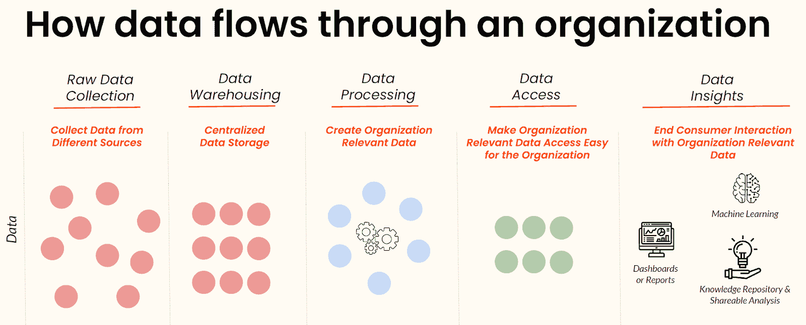
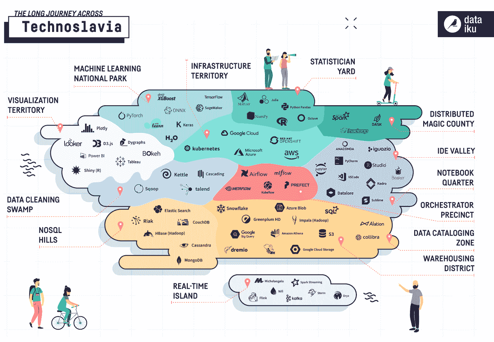
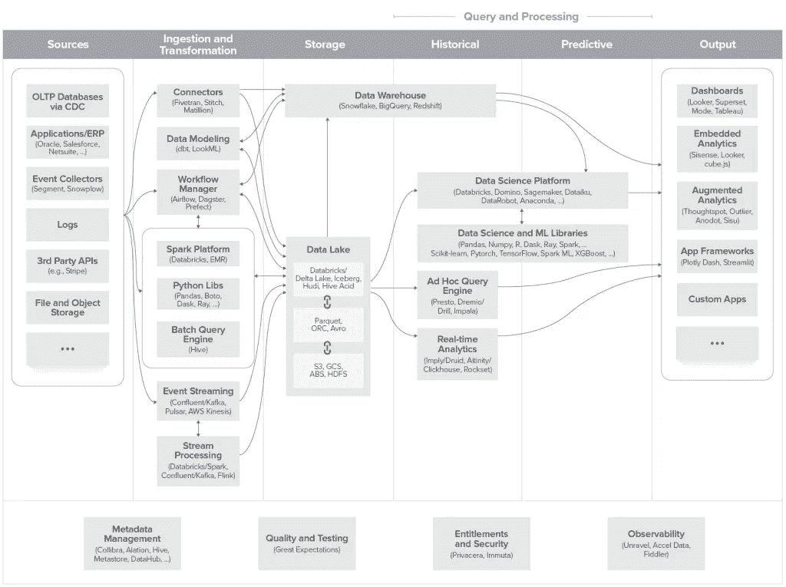
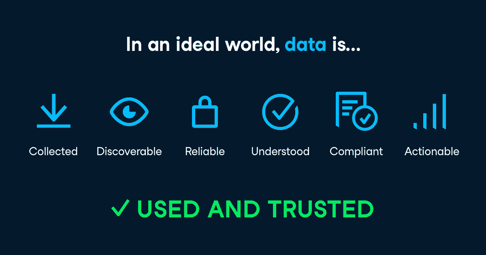

# 成熟的数据基础设施是什么样的

> 原文：<https://web.archive.org/web/20230101103227/https://www.datacamp.com/blog/what-mature-data-infrastructure-looks-like>

## 数据驱动的数字化转型的现状

随着组织在新冠肺炎疫情中经历加速的数字化转型，利用数据、机器学习和分析的案例变得前所未有的重要。

2020 年麦肯锡关于人工智能状态的全球调查报告称，50%的企业已经在至少一项业务职能中采用了人工智能，22%的组织将至少 5%的息税前收入归功于人工智能计划。

然而，为了大规模释放数据和人工智能的价值，组织必须民主化他们的数据，并释放组织范围内的数据流畅性。实现这一点的方法之一是提供跨团队和技能级别的可信且可操作的数据访问，以便每个人都可以做出基于数据的业务决策。

## 处于数据民主化核心的数据基础设施

在实现数据流畅之前，组织需要做好基础工作。首先要了解数据如何在组织中流动，然后构建一个有组织的统一数据基础架构。

在关于 2021 年数据趋势和预测的[网络研讨会上，DataCamp 产品研究副总裁 Ramnath Vaidyanathan 描述了数据通常如何在组织中流动。这一流程需要数据工程工具来接收原始数据，摄取和转换它们，将它们存储在一个集中的位置，并以仪表板和报告、机器学习输出等形式生成数据洞察。](https://web.archive.org/web/20221116031255/https://www.datacamp.com/resources/webinars/data-trends-2021)

在组织内扩展数据访问在很大程度上取决于可靠的数据基础架构的存在和最新数据基础架构工具的使用，这使组织能够将原始数据转换为可访问的、有价值的数据洞察。

## 数据基础设施工具的现状

数据基础设施和工具的重要性从数据基础设施市场的快速增长和演变中可见一斑。许多解决方案旨在简化与组织数据基础设施的特定元素的工作，这导致了工具越来越分散，难以驾驭。

以下由 Dataiku 创建的视觉效果恰当地说明了数据基础设施市场如何被细分为众多细分类别，每个细分类别中的竞争解决方案越来越多。

##### 来源:[大台库](https://web.archive.org/web/20221116031255/https://blog.dataiku.com/technoslavia-the-fragmented-world-of-data-infrastructure-in-2020)

## 数据基础设施工具的未来

去年年底，Andreessen Horowitz 试图通过开发一个统一的架构框架来澄清这种令人困惑的数据基础架构格局。随着越来越多的人需要处理大量的数据和过多的可用解决方案，该框架在现代化、映射和构建组织的数据堆栈时提供了实用的参考。

##### 来源:[安德森·霍洛维茨](https://web.archive.org/web/20221116031255/https://a16z.com/2020/10/15/the-emerging-architectures-for-modern-data-infrastructure)

随着这一空间和趋势的发展，我们将看到数据基础架构堆栈中各种工具的整合和标准化。此外，云的采用、数据发现工具和集中式数据治理平台将使组织能够跨团队和职能部门提供可扩展的数据访问。

那么，理想的未来数据基础设施能提供什么呢？据世界银行数据工程师、圣地亚哥市前 CDO 马克西姆·佩切尔斯基称，数据必须是 ***收集的、可发现的、可靠的、可理解的、合规的、*** 和 ***可操作的*** 。最终，我们的目标是让数据变得可用和可信，这反过来又会推动整个组织的数据流畅度。

## 成熟的数据基础设施包括云采用、数据发现工具和集中式数据治理平台

随着数据基础设施工具在 2021 年及以后围绕数据民主化逐渐成熟，以下技术的采用和发展也将随之成熟:

### 1.云采用

云技术的使用[正在成为常态](https://web.archive.org/web/20221116031255/https://www.oreilly.com/radar/cloud-adoption-in-2020)，尤其是在我们在 2020 年看到的加速数据驱动的数字化转型之后。

除了改进数据存储和访问，云解决方案还提供了许多用户友好的产品，用于收集、吸收、转换、存储数据和从数据中创建见解。

云平台领域有许多提供商，其中一个关键的参与者是[亚马逊网络服务](https://web.archive.org/web/20221116031255/https://aws.amazon.com/) (AWS)，它拥有[100 多种产品](https://web.archive.org/web/20221116031255/https://aws.amazon.com/products)，使企业能够以高速、大规模和低成本充分利用他们的数据。

### 2.数据发现工具

随着数据表、报告和模型被添加到组织数据环境中，扩展数据基础设施将变得至关重要。利益相关者必须能够随时找到可靠的、可理解的、合规的、可操作的数据和见解，以完成他们的最佳工作。

为了应对这一挑战，(也称为元数据管理工具或数据目录)可以作为组织内这些数据宝库的通用搜索引擎。元数据本质上是指描述特定数据的一组数据，对于索引各种可用数据非常有用。

Lyft 开源了他们自己的数据发现工具 [Amundsen](https://web.archive.org/web/20221116031255/https://www.amundsen.io/) ，以提供元数据引擎解决方案，旨在帮助组织发现、理解、共享和信任他们用于分析的数据。这种能力对于任何希望扩展其数据能力的组织来说都是至关重要的。

### 3.集中式数据治理平台

如前所述，建立对数据的信任对于推动数据民主化至关重要。这就是数据治理发挥重要作用的地方。随着数据量和数据种类的不断增长，对数据质量、一致性和相关性的集中监管至关重要。

像 [Collibra](https://web.archive.org/web/20221116031255/https://www.collibra.com/) 和 [Alation](https://web.archive.org/web/20221116031255/https://www.alation.com/solutions/data-governance) 这样的公司提供的集中式数据治理平台服务可以帮助组织有效地管理其数据的可用性、一致性和完整性。这就允许所有的利益相关者从一个可靠的单一的事实来源来工作。

成熟的数据基础设施只是我们预测的 2021 年及以后的数据趋势之一。如需了解更多信息，请下载我们关于 2021 年[数据趋势和预测的白皮书:数据流畅之年](https://web.archive.org/web/20221116031255/https://www.datacamp.com/resources/whitepapers/data-trends-and-predictions-2021)或观看我们的[网络研讨会](https://web.archive.org/web/20221116031255/https://www.datacamp.com/resources/webinars/data-trends-2021)。

