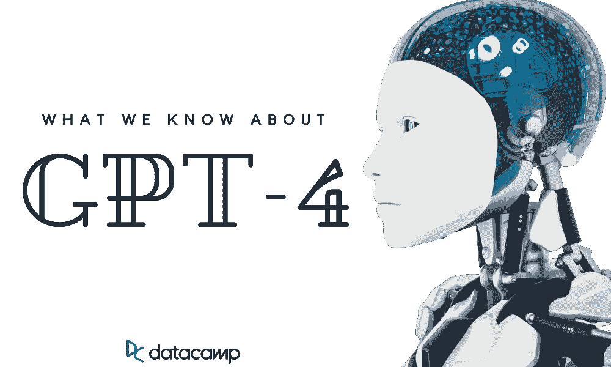
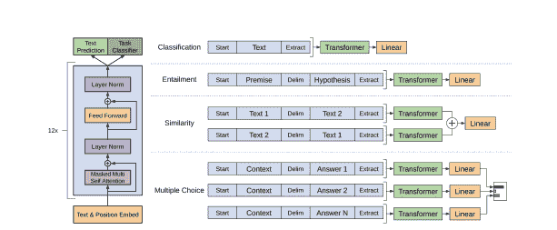

# 我们所知道的关于 GPT 4 号的一切

> 原文：<https://web.archive.org/web/20221210075939/https://www.datacamp.com/blog/what-we-know-gpt4>

我们生活在一个非常时期，你可以看到一种新型模式的推出，这种模式完全改变了人工智能领域。2022 年 7 月，OpenAI 推出了最先进的文本到图像模型 [DALLE2](https://web.archive.org/web/20221124153834/https://openai.com/dall-e-2) 。几周后，稳定下来。AI 推出了 DALLE-2 的开源版本，名为[稳定扩散](https://web.archive.org/web/20221124153834/https://stability.ai/blog/stable-diffusion-public-release)。这两种模型都很受欢迎，并且在质量和理解提示的能力方面都显示出了良好的效果。

最近，OpenAI 推出了一款名为 [Whisper](https://web.archive.org/web/20221124153834/https://openai.com/blog/whisper) 的自动语音识别(ASR)模型。就稳健性和准确性而言，它胜过所有其他模型。

从趋势来看，我们可以假设 OpenAI 将在未来几个月内发射 GPT 4 号。市场对大型语言模型有很高的需求，GPT-3 的流行已经证明，人们期待 GPT-4 有更好的准确性、计算优化、更低的偏差和更高的安全性。

尽管 OpenAI 对发射或功能保持沉默，但在这篇文章中，我们将根据 AI 趋势和 OpenAI 提供的信息，对 GPT-4 进行一些假设和预测。此外，我们将学习大型语言模型及其应用。

## 什么是 GPT？

生成式预训练转换器(GPT)是一种基于互联网上可用数据训练的文本生成深度学习模型。它用于问答、文本摘要、机器翻译、分类、代码生成和对话人工智能。

你可以通过参加 Python 技能追踪中的[深度学习来学习如何建立你的深度学习模型。您将探索深度学习的基础，了解 Tensorflow 和 Keras 框架，并使用 Keras 构建多个输入和输出模型。](https://web.archive.org/web/20221124153834/https://www.datacamp.com/tracks/deep-learning-in-python)

GPT 模型有无穷无尽的应用，你甚至可以根据特定的数据对它们进行微调，以创造更好的结果。通过使用变压器，您将节省计算、时间和其他资源的成本。

### 在 GPT 之前

在 GPT-1 之前，大多数自然语言处理(NLP)模型被训练用于特定的任务，如分类、翻译等。他们都在使用监督学习。这种类型的学习有两个问题:缺少带注释的数据和不能概括任务。

### GPT 一号

### 

变压器架构| [GPT-1 论文](https://web.archive.org/web/20221124153834/https://paperswithcode.com/paper/improving-language-understanding-by)

GPT-1 (117M 参数)论文([通过生成性预训练](https://web.archive.org/web/20221124153834/https://paperswithcode.com/paper/improving-language-understanding-by)提高语言理解)发表于 2018 年。它提出了一个生成语言模型，该模型基于未标记的数据进行训练，并针对特定的下游任务(如分类和情感分析)进行微调。

### GPT-2

不同任务上的模型性能| [GPT 新协议论文](https://web.archive.org/web/20221124153834/https://d4mucfpksywv.cloudfront.net/better-language-models/language-models.pdf)

GPT-2 (1.5B 参数)论文([语言模型是无监督的多任务学习者](https://web.archive.org/web/20221124153834/https://d4mucfpksywv.cloudfront.net/better-language-models/language-models.pdf))发表于 2019 年。它在具有更多模型参数的更大数据集上进行训练，以建立更强大的语言模型。GPT-2 使用任务调节、零射击学习和零短任务转移来提高模型性能。

### GPT-3

三个开放领域问答任务的结果| [GPT 新协议论文](https://web.archive.org/web/20221124153834/https://arxiv.org/abs/2005.14165v4)

GPT-3 (175B 参数)论文([语言模型是很少出手的学习者](https://web.archive.org/web/20221124153834/https://arxiv.org/abs/2005.14165v4))发表于 2020 年。该模型的参数比 GPT-2 多 100 倍。它在一个更大的数据集上进行训练，以在下游任务中取得良好的结果。它以类似人类的故事写作、SQL 查询和 Python 脚本、语言翻译和摘要震惊了世界。它使用上下文学习、少量拍摄、一次拍摄和零拍摄设置实现了最先进的结果。

你可以在另一篇文章中了解更多关于 GPT-3 的信息，它的用途，以及如何开始使用它。

## GPT-4 有什么新消息？

在 AC10 online meetup 的问答环节中，OpenAI 的首席执行官山姆·奥特曼(Sam Altman)证实了关于推出 GPT-4 模型的传言。在本节中，我们将使用该信息并将其与当前趋势相结合，以预测模型大小、最佳参数和计算、多模态性、稀疏性和性能。

### 模型尺寸

根据奥特曼的说法，GPT 4 号不会比 GPT 3 号大多少。所以，我们可以假设它将有大约 175B-280B 个参数，类似于 Deepmind 的语言模型 [Gopher](https://web.archive.org/web/20221124153834/https://www.deepmind.com/blog/language-modelling-at-scale-gopher-ethical-considerations-and-retrieval) 。

大型模型[威震天 NLG](https://web.archive.org/web/20221124153834/https://developer.nvidia.com/blog/using-deepspeed-and-megatron-to-train-megatron-turing-nlg-530b-the-worlds-largest-and-most-powerful-generative-language-model) 比拥有 530B 参数的 GPT-3 大三倍，在性能上没有超过。之后推出的较小型号达到了更高的性能水平。简单来说，尺寸大并不意味着性能更高。

奥特曼表示，他们正专注于让更小的型号表现更好。大型语言模型需要大型数据集、大量计算资源和复杂的实现。对于各种公司来说，即使部署大型模型也变得不划算。

### 最佳参数化

大型模型大多优化不足。训练模型的成本很高，公司必须在准确性和成本之间进行权衡。例如，尽管有错误，GPT-3 只训练了一次。由于负担不起成本，研究人员无法进行超参数优化。

微软和 OpenAI 已经证明，如果他们在最佳超参数上训练 GPT-3，它可以得到改善。在调查结果中，他们发现具有优化超参数的 6.7B GPT-3 模型与 13B GPT-3 模型一样提高了性能。

他们发现了新的参数化(μP ),即较小模型的最佳超参数与具有相同架构的较大模型的最佳超参数相同。它允许研究人员以很小的成本优化大型模型。

### 最佳计算

DeepMind 最近发现，训练令牌的数量和大小一样会影响模型性能。他们已经通过训练龙猫 70B 模型证明了这一点，这个模型比地鼠小 4 倍，比自 GPT 3 号以来的大型语言模型多 4 倍的数据

我们可以有把握地假设，对于计算优化模型，OpenAI 将增加 5 万亿个训练令牌。这意味着训练模型并达到最小损失将需要比 GPT-3 多 10-20 倍的 FLOPs。

### GPT-4 将是一个纯文本模型

在问答过程中，奥特曼说，GPT-4 不会像 DALL-E 那样是多模态的。它将是一个纯文本模型。

这是为什么呢？与只使用语言或视觉相比，好的多模态是很难建立的。结合文本和视觉信息是一项具有挑战性的任务。这也意味着它们必须提供比 GPT-3 和 DALL-E-2 更好的性能。

所以，我们不会期待 GPT-4 会有什么新奇的东西。

### 稀少

稀疏模型使用条件计算来降低计算成本。该模型可以轻松扩展到超过 1 万亿个参数，而不会导致高昂的计算成本。它将帮助我们在较低的资源上训练大型语言模型。

但是 GPT 4 号不会使用稀疏模型。为什么？在过去，OpenAI 一直依赖于密集的语言模型，他们不会增加模型的大小。

### 人工智能对齐

GPT-4 将比 GPT-3 更加一致。OpenAI 正在与 AI 对齐进行斗争。他们希望语言模型遵循我们的意图，坚持我们的价值观。

他们已经通过训练指导迈出了第一步。这是一个 GPT-3 模型，根据人类的反馈进行训练，以遵循指令。该模型被人类法官认为比 GPT-3 更好。不考虑语言基准。

### GPT-4 的发布日期

GPT-4 的发布日期仍未确定，我们可以假设该公司正在更多地关注其他技术，如文本到图像和语音识别。所以，你可能会在明年或者下个月看到它。我们不能确定。我们可以肯定的是，下一个版本将解决旧版本的问题，并呈现更好的结果。

## 结论

GPT-4 将是一个纯文本的大型语言模型，在与 GPT-3 类似的规模上具有更好的性能。它也将更符合人类的命令和价值观。

你可能会在 GPT-4 上听到相互矛盾的消息，它包含 100 万亿个参数，并且只关注代码生成。但在这一点上它们都是推测。还有很多我们不知道的，OpenAI 还没有透露任何关于发布日期、模型架构、大小和数据集的具体信息。

就像 GPT-3 一样，GPT-4 将用于各种语言应用，如代码生成、文本摘要、语言翻译、分类、聊天机器人和语法纠正。新版本的模型将更安全，更少偏见，更准确，更一致。它还将具有成本效益和稳健性。

你可以阅读 [GPT-3 和下一代人工智能驱动的服务](https://web.archive.org/web/20221124153834/https://www.datacamp.com/blog/gpt-3-and-the-next-generation-of-ai-powered-services)来了解更多关于 GPT-3 的应用。

## 参考

*   [GPT 模特解释道。开 AI 的 GPT-1，GPT-2，GPT-3](https://web.archive.org/web/20221124153834/https://medium.com/walmartglobaltech/the-journey-of-open-ai-gpt-models-32d95b7b7fb2)
*   GPT 4 号即将到来。以下是我们所知道的|作者阿尔贝托·罗梅罗